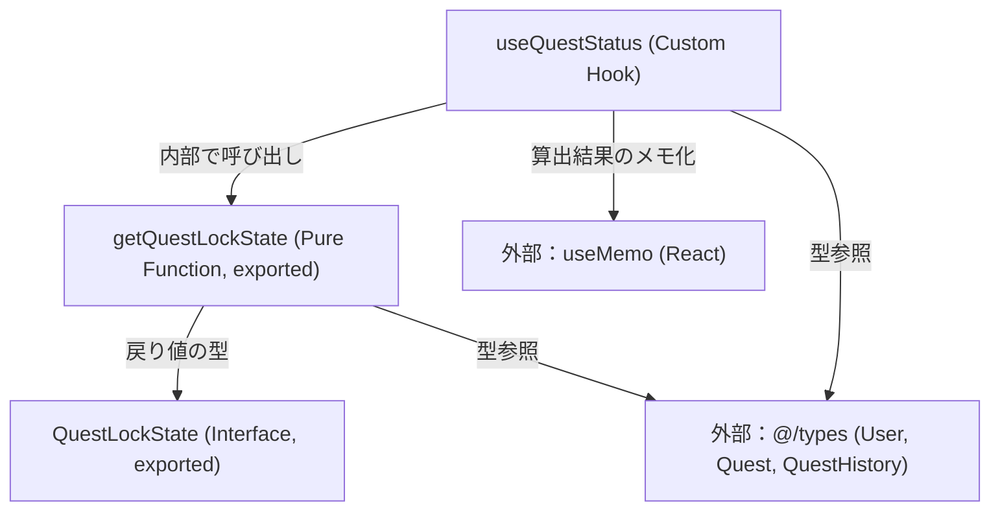

## 1. 解析メタ情報

| 項目 | 内容 |
| --- | --- |
| 対象ファイル | `useQuestStatus.ts` |
| 言語 | React (TypeScript) |
| 解析対象 | 提供されたコードのみ |
| 推測・補完 | 一切なし |

## 関連ドキュメント

- [QuestList.md](../components/QuestList.md) — `getQuestLockState`をソート比較関数から直接呼び出す利用元。
- [types/index.md](../../../types/index.md) — `User`/`Quest`/`QuestHistory`型定義の提供元。
- [App.md](../../../../App.md) — コメントで言及されている「以前の3箇所の重複実装」のうち、クエストクリックハンドラ側の現状の実装を確認できる呼び出し元。

## 2. ファイルの概要

* 現在のユーザー情報、対象クエストの詳細情報、および完了・保留クエストの履歴データを基に、該当クエストの現在の進行状態（完了、保留、ロック、無限クエストなど）を判定する純粋関数 `getQuestLockState` と、それをラップして表示用タイトル・UI表示用バリエーション（`variant`）まで算出するCustom Hook `useQuestStatus` を提供する。
* `getQuestLockState` はコメントによれば、以前は `useQuestStatus`（本ファイル）・`QuestList.tsx` のソート比較関数・`App.tsx` のクリックハンドラの3箇所にほぼ同じロジックが重複して実装されていたものを共通化した純粋関数であり、React Hooksを使えない箇所（`Array.sort`のコンパレータなど）からも直接呼び出せるようにエクスポートされている。
* 根拠: [共通化コメント] (行番号: 11〜18 / 抜粋: "// ★共通化: 「このクエストは今ロック/完了/申請中か」を判定する純粋関数。")
* `useQuestStatus` の算出処理は `useMemo` でラップされており、不要な再計算を防ぐ最適化が施されている。

## 3. 外部依存関係

### インポート一覧

| 名称 | 種類 | 用途 | 根拠 |
| --- | --- | --- | --- |
| `useMemo` | React Hook | `useQuestStatus` の算出結果をメモ化し、パフォーマンスを最適化するため。 | `import { useMemo } from 'react';` (行番号: 1 / 抜粋: "import { useMemo } from 'react';") |
| `User`, `Quest`, `QuestHistory` | 型定義 | `UseQuestStatusProps` および `getQuestLockState` の引数・戻り値の型を定義するため。 | `import { User, Quest, QuestHistory } from '@/types';` (行番号: 2 / 抜粋: "import { User, Quest, QuestHistory } from '@/types';") |

### ブラックボックスとなる外部要素

| 名称 | 理由 | 根拠 |
| --- | --- | --- |
| `@/types` (外部モジュール) | `User`、`Quest`、`QuestHistory` の完全なスキーマ定義が本ファイル内に存在しないため、コード内でアクセスされているプロパティ（`quest_id`, `id`, `type`, `quest_type`, `status`, `pre_requisite_quest_id`, `_isInfinite` など）以外の全体像は判断不可。 | 根拠: [import文] (行番号: 2 / 抜粋: "import { User, Quest, QuestHistory } from '@/types';") |

## 4. 主要要素の定義（関数 / エンドポイント / コンポーネント）

### `UseQuestStatusProps`

* **役割**: `useQuestStatus` フックが受け取る引数の型定義。
* 根拠: [インターフェース定義] (行番号: 4〜9 / 抜粋: "interface UseQuestStatusProps {")

### `QuestLockState`

* **役割**: `getQuestLockState` の戻り値の型定義。ロック状態(`isLocked`)、完了状態(`isDone`)、保留状態(`isPending`)、無限クエスト判定(`isInfinite`)、自分の承認済み完了履歴一覧(`myCompletions`)、対応する保留・完了エントリ(`pendingEntry`/`completedEntry`)を含む。
* 根拠: [インターフェース定義] (行番号: 19〜28 / 抜粋: "export interface QuestLockState {")

### `getQuestLockState`

* **役割**: クエストと現在のユーザー、完了・保留履歴から、そのクエストが「ロック中」「完了済み」「保留中」「無限クエストか」を判定する純粋関数。React Hooksに依存しないため、`useQuestStatus`内部だけでなく`QuestList.tsx`のソート処理などフックが使えない文脈からも呼び出せる。
* 根拠: [関数定義] (行番号: 30〜81 / 抜粋: "export function getQuestLockState(")

* **引数/リクエスト**: `quest: Quest, currentUser: User, completedQuests: QuestHistory[], pendingQuests: QuestHistory[]`
* 根拠: [引数定義] (行番号: 31〜35 / 抜粋: "quest: Quest, currentUser: User, completedQuests: QuestHistory[], pendingQuests: QuestHistory[]")

* **戻り値/レスポンス**: `QuestLockState` オブジェクト（`isLocked`, `isDone`, `isPending`, `isInfinite`, `myCompletions`, `pendingEntry`, `completedEntry`）
* 根拠: [return文] (行番号: 72〜80 / 抜粋: "return { isLocked, isDone, isPending, isInfinite, myCompletions, pendingEntry, completedEntry: myCompletions[myCompletions.length - 1], };")

* **副作用**: なし（純粋関数）
* 根拠: [関数定義] (行番号: 30〜81 / 抜粋: "export function getQuestLockState(") ※外部API呼び出しやステート更新等が存在しないため。

* **エラーハンドリング**: なし。前提クエストID(`pre_requisite_quest_id`)が未設定の場合は`isPreReqCleared`を`true`として扱うフォールバックのみ存在する。
* 根拠: (行番号: 47〜51 / 抜粋: "const isPreReqCleared = !preReqId || completedQuests.some(cq =>")

### `useQuestStatus`

* **役割**: `getQuestLockState`の結果をもとに、無限クエストの表示回数付きタイトル(`displayTitle`)とUI表示用の`variant`を算出し、メモ化されたオブジェクトとして返すCustom Hook。
* 根拠: `useQuestStatus` (行番号: 83〜124 / 抜粋: "export const useQuestStatus = ({ quest, currentUser, completedQuests, pendingQuests }: UseQuestStatusProps) => {")

* **引数/リクエスト**: `UseQuestStatusProps` (オブジェクト: `quest`, `currentUser`, `completedQuests`, `pendingQuests` を含む)
* 根拠: `UseQuestStatusProps` (行番号: 4〜9 / 抜粋: "interface UseQuestStatusProps {")

* **戻り値/レスポンス**: クエストステータスを含むオブジェクト (`isDone`, `isPending`, `isInfinite`, `isRandom`, `isTimeLimited`, `isLimited`, `isLocked`, `displayTitle`, `variant`)
* 根拠: `return` (行番号: 110〜120 / 抜粋: "return { isDone, isPending, isInfinite, isRandom, isTimeLimited, isLimited, isLocked, displayTitle, variant };")

* **副作用**: なし（`useMemo`による算出結果のメモ化のみ）
* 根拠: `useMemo` ブロック (行番号: 84〜121 / 抜粋: "const status = useMemo(() => {") ※外部API呼び出しやステート更新等が存在しないため。

* **エラーハンドリング**: なし
* 根拠: `useQuestStatus` (行番号: 83〜124 / 抜粋: "export const useQuestStatus = (") ※例外処理（try-catchやthrow）が存在しないため。

---

## 5. 処理フロー図

```mermaid
flowchart TD
    Start([Start: getQuestLockState]) --> ExtractQId["qId = quest.quest_id || quest.id を算出"]
    ExtractQId --> ExtractInfinite["isInfinite = type==='infinite' OR quest_type==='infinite' OR _isInfinite"]
    ExtractInfinite --> CheckPreReq["前提クエストID(pre_requisite_quest_id)の抽出"]
    CheckPreReq --> PreReqCond{"前提IDなし OR 今日の完了履歴に前提IDあり?"}
    PreReqCond -- Yes --> PreReqClear["isPreReqCleared = true"]
    PreReqCond -- No --> PreReqNotClear["isPreReqCleared = false"]
    PreReqClear --> SetLockedStatus["isLocked = !isPreReqCleared"]
    PreReqNotClear --> SetLockedStatus
    SetLockedStatus --> FilterMyComp["自身の承認済み完了履歴(myCompletions)を抽出"]
    FilterMyComp --> CheckDone{"myCompletions.length > 0?"}
    CheckDone -- Yes --> CheckInfForDone{"isInfinite?"}
    CheckDone -- No --> SetNotDone["isDone = false"]
    CheckInfForDone -- Yes --> SetNotDone
    CheckInfForDone -- No --> SetDone["isDone = true"]
    SetDone --> FilterPending["自身の保留中履歴(pendingEntry)を検索"]
    SetNotDone --> FilterPending
    FilterPending --> ReturnLockState["QuestLockStateオブジェクトを返却"] --> EndLockState([End: getQuestLockState])

    ReturnLockState -.->|"useQuestStatus内部から呼び出し"| Start2([Start: useQuestStatus useMemo])
    Start2 --> DeriveFlags["isRandom, isLimited, isTimeLimited を算出"]
    DeriveFlags --> CheckInfTitle{"isInfinite?"}
    CheckInfTitle -- Yes --> FormatTitle["displayTitle = 'タイトル (N回目)'"]
    CheckInfTitle -- No --> KeepTitle["displayTitle = quest.title のまま"]
    FormatTitle --> DetVariant
    KeepTitle --> DetVariant
    DetVariant{"Variant判定処理 (優先度順)"}
    DetVariant --> |isLocked| VarLocked["variant = 'locked'"]
    DetVariant --> |isDone| VarDone["variant = 'completed'"]
    DetVariant --> |isPending| VarPending["variant = 'pending'"]
    DetVariant --> |isInfinite| VarInf["variant = 'infinite'"]
    DetVariant --> |isTimeLimited| VarTL["variant = 'timeLimit'"]
    DetVariant --> |isRandom| VarRand["variant = 'random'"]
    DetVariant --> |isLimited| VarLim["variant = 'limited'"]
    DetVariant --> |その他| VarDef["variant = 'default'"]
    VarLocked --> ReturnStatus(["ステータスオブジェクト返却"])
    VarDone --> ReturnStatus
    VarPending --> ReturnStatus
    VarInf --> ReturnStatus
    VarTL --> ReturnStatus
    VarRand --> ReturnStatus
    VarLim --> ReturnStatus
    VarDef --> ReturnStatus
    ReturnStatus --> End([End: useQuestStatus])

```

## 6. 依存関係図

```mermaid
graph TD
    useQuestStatus["useQuestStatus (Custom Hook)"]
    getQuestLockState["getQuestLockState (Pure Function, exported)"]
    QuestLockState["QuestLockState (Interface, exported)"]
    useMemo["外部：useMemo (React)"]
    Types["外部：@/types (User, Quest, QuestHistory)"]

    useQuestStatus -->|内部で呼び出し| getQuestLockState
    useQuestStatus -->|算出結果のメモ化| useMemo
    useQuestStatus -->|型参照| Types
    getQuestLockState -->|戻り値の型| QuestLockState
    getQuestLockState -->|型参照| Types

```

## 7. 次のステップ（リバースエンジニアリングの提案）

| 優先度 | ファイル名(推測可) | 理由 | 根拠 |
| --- | --- | --- | --- |
| 高 | `@/types` の定義ファイル | 本ファイル内で `quest_id` / `id`、`type` / `quest_type` / `_isInfinite` といった複数のフォールバック参照が使われている `Quest` 型の正確なスキーマを把握するため。 | 根拠: (行番号: 36, 39 / 抜粋: "const qId = quest.quest_id || quest.id;") |
| 高 | `../components/QuestList.tsx` | `getQuestLockState`をソート比較関数から直接呼び出しており、`useQuestStatus`との呼び出し方の違いや、両者の間で判定結果に齟齬がないかを確認するため。 | 根拠: [共通化コメント] (行番号: 11〜13 / 抜粋: "// 以前は useQuestStatus (このファイル)・QuestList.tsx のソート比較関数・App.tsx の") |
| 中 | `App.tsx` | コメントによれば、クリックハンドラでも同様のロック/完了/申請中判定ロジックが使われていた（または使われている）とされるため、現在の実装との整合性を確認するため。 | 根拠: [共通化コメント] (行番号: 12〜13 / 抜粋: "クリックハンドラの3箇所にほぼ同じロジックが重複して実装されていた。") |
| 中 | 本Hook/関数を呼び出している親コンポーネントまたは状態管理ファイル | `completedQuests` に「今日」の承認済みデータのみが渡される前提となっているため、その絞り込みが正しく実行されているか確認する必要がある。 | 根拠: (行番号: 46 / 抜粋: "// completedQuests には「今日」の承認済みデータのみが入っている前提 (GameSystem仕様)") |

## 8. 保守上の注意点

* **型・APIレスポンスの非統一性**: `quest.quest_id || quest.id`、および `quest.type === 'infinite' || quest.quest_type === 'infinite' || !!quest._isInfinite` といったフォールバック処理が存在し、バックエンドAPIとフロントエンドで型の不一致や移行期間中の仕様が混在している。該当プロパティの変更時に影響が出る可能性が高い。
* 根拠: (行番号: 36, 39 / 抜粋: "const qId = quest.quest_id || quest.id;")
* **qId算出順序の食い違いに関する既知の注意**: コメントによれば、以前の3つの重複実装では`qId`の算出順序に食い違いがあった（`useQuestStatus`は`quest.quest_id || quest.id`、`QuestList.tsx`/`App.tsx`は`quest.id || quest.quest_id`）。共通化後の`getQuestLockState`では`useQuestStatus`側（本来のソースオブトゥルース）の順序に統一されているが、呼び出し元でこの順序に依存した独自ロジックが残っていないか注意が必要。
* 根拠: [コメント] (行番号: 16〜18 / 抜粋: "// 注意: 元の3実装には qId の算出順序に食い違いがあった")
* **外部からの入力前提**: 前提クエストの判定ロジックは「`completedQuests` に『今日』の承認済みデータのみが入っている」というコメント上の仕様に強く依存している。呼び出し元で履歴データの絞り込み条件が変わると、意図せずロック状態が解除・維持されるバグに繋がる。
* 根拠: [コメント] (行番号: 46 / 抜粋: "// completedQuests には「今日」の承認済みデータのみが入っている前提 (GameSystem仕様)")
* `getQuestLockState`が共通化された結果、この関数のロジックを変更すると`useQuestStatus`を使う画面と`QuestList.tsx`のソート処理の両方に影響する。片方だけを見て変更すると、もう片方で意図しない挙動差が生まれる可能性がある。

## 9. 不明事項一覧

| 項目 | 理由 | 必要なファイル |
| --- | --- | --- |
| `Quest` オブジェクトの完全なスキーマ | ファイル内で使われている `quest_id`, `id`, `type`, `quest_type`, `_isInfinite`, `pre_requisite_quest_id` などのプロパティがなぜ複数存在するのか、本来どの値が正なのかを特定するため。 | `@/types` 関連ファイル |
| 履歴データ（`completedQuests`）の取得・抽出ロジック | 本当に「今日」の承認済みデータだけがHook/関数に渡されているかを客観的に確認するため。 | 本Hook/関数の呼び出し元コンポーネント（`QuestList.tsx`, `App.tsx`など） |
| `App.tsx`のクリックハンドラにおける現状の実装 | コメントで言及されている「以前の3箇所の重複実装」のうち、`App.tsx`側が現在も共通化前のロジックを残しているか、`getQuestLockState`に置き換わっているかが本ファイルからは不明。 | `App.tsx` |

## 相互参照による補足情報

| 元の不明事項 | 判明した内容 | 参照元ドキュメント |
| --- | --- | --- |
| `Quest` オブジェクトの完全なスキーマ | `types/index.md`の解析によれば、`Quest`インターフェースには共有クエスト判定用のフィールド（`is_shared_completed_by`等、バックエンドの`get_available_quests`が付与）が含まれるとされている。ただし`quest_id`/`id`や`type`/`quest_type`が併存する理由自体は`types/index.md`側でも特定されていない。 | `../../../types/index.md` |
| `App.tsx`のクリックハンドラにおける現状の実装 | `App.md`の解析によれば、`App.tsx`は`import { getQuestLockState } from './features/quest/hooks/useQuestStatus';`として本ファイルの`getQuestLockState`を直接インポートし、`handleQuestClick`内で無限クエスト判定や保留・完了履歴の検索に使用しているとされている。これにより、コメントで言及されていた「以前の3箇所の重複実装」のうち`App.tsx`側は共通化後の`getQuestLockState`に置き換わっている（少なくとも重複したロジックがそのまま残ってはいない）と推測される。ただしこれは`App.md`側の解析結果からの補足であり、`App.tsx`のソースコード自体は本ファイルの解析時点では確認していない。 | `../../../../App.md` |

## 10. 自己検証結果

* [x] 推測・外部ファイルの仕様を一切含んでいない
* [x] 全関数・全クラス・全コンポーネントを列挙した
* [x] 全てのインポート要素を列挙した
* [x] すべての仕様説明に「根拠（行番号・抜粋）」を明記した
* [x] 根拠漏れが0件である
* [x] Mermaid構文にエラーの原因となる記号（エスケープ漏れ）がない
* [x] 不明事項を漏れなく列挙した

完了
