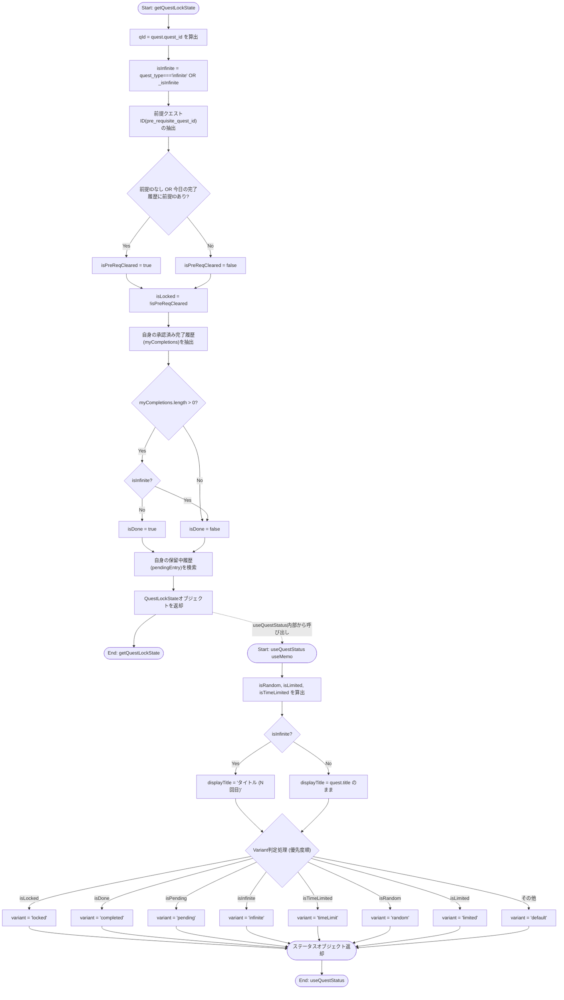
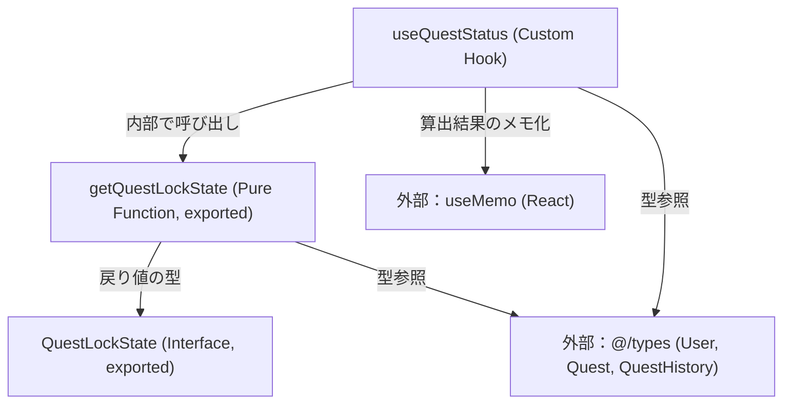

## 1. 解析メタ情報

| 項目 | 内容 |
| --- | --- |
| 対象ファイル | `useQuestStatus.ts` |
| 言語 | React (TypeScript) |
| 解析対象 | 提供されたコードのみ |
| 推測・補完 | 一切なし |
| 解析基準コミット | `c29d467` |

## 関連ドキュメント

- [QuestList.md](../components/QuestList.md) — `getQuestLockState`をソート比較関数から直接呼び出す利用元。
- [types/index.md](../../../types/index.md) — `User`/`Quest`/`QuestHistory`型定義の提供元。
- [App.md](../../../../App.md) — コメントで言及されている「以前の3箇所の重複実装」のうち、クエストクリックハンドラ側の現状の実装を確認できる呼び出し元。

## 2. ファイルの概要

* 現在のユーザー情報、対象クエストの詳細情報、および完了・保留クエストの履歴データを基に、該当クエストの現在の進行状態（完了、保留、ロック、無限クエストなど）を判定する純粋関数 `getQuestLockState` と、それをラップして表示用タイトル・UI表示用バリエーション（`variant`）まで算出するCustom Hook `useQuestStatus` を提供する。
* `getQuestLockState` はコメントによれば、以前は `useQuestStatus`（本ファイル）・`QuestList.tsx` のソート比較関数・`App.tsx` のクリックハンドラの3箇所にほぼ同じロジックが重複して実装されていたものを共通化した純粋関数であり、React Hooksを使えない箇所（`Array.sort`のコンパレータなど）からも直接呼び出せるようにエクスポートされている。**（#291で修正）** 共通化された当初はこの3実装間で`qId`（クエストの識別子）の算出順序（`quest.quest_id || quest.id`か`quest.id || quest.quest_id`か）に食い違いがあったが、`quest.id`自体がバックエンドAPIから一度も送られてこない「幽霊フィールド」であったことが判明したため、`Quest`型定義から`id`が削除され、`qId`（およびQuestList.tsx/App.tsx側の同種の算出）は`quest.quest_id`のみを参照する形に統一された。同様に`isInfinite`の判定も、`quest.type`（同じく実際には送られてこない幽霊フィールド）への参照が削除され、`quest.quest_type === 'infinite' || !!quest._isInfinite`のみで判定するようになった。
* 根拠: [共通化コメント] (行番号: 11〜19 / 抜粋: "// ★共通化: 「このクエストは今ロック/完了/申請中か」を判定する純粋関数。")
* `useQuestStatus` の算出処理は `useMemo` でラップされており、不要な再計算を防ぐ最適化が施されている。

## 3. 外部依存関係

### インポート一覧

| 名称 | 種類 | 用途 | 根拠 |
| --- | --- | --- | --- |
| `useMemo` | React Hook | `useQuestStatus` の算出結果をメモ化し、パフォーマンスを最適化するため。 | `import { useMemo } from 'react';` (行番号: 1 / 抜粋: "import { useMemo } from 'react';") |
| `User`, `Quest`, `QuestHistory` | 型定義 | `UseQuestStatusProps` および `getQuestLockState` の引数・戻り値の型を定義するため。 | `import { User, Quest, QuestHistory } from '@/types';` (行番号: 2 / 抜粋: "import { User, Quest, QuestHistory } from '@/types';") |

### ブラックボックスとなる外部要素

| 名称 | 理由 | 根拠 |
| --- | --- | --- |
| `@/types` (外部モジュール) | `User`、`Quest`、`QuestHistory` の完全なスキーマ定義が本ファイル内に存在しないため、コード内でアクセスされているプロパティ（`quest_id`, `id`, `type`, `quest_type`, `status`, `pre_requisite_quest_id`, `_isInfinite` など）以外の全体像は判断不可。 | 根拠: [import文] (行番号: 2 / 抜粋: "import { User, Quest, QuestHistory } from '@/types';") |

## 4. 主要要素の定義（関数 / エンドポイント / コンポーネント）

### `getQuestProcessingKey` (export関数、Issue #391で追加)

* **役割**: 「このユーザーのこのクエストに対する完了/取消APIが送信中か」を表す集合（`App.tsx`の`processingQuestKeysRef`）のキー文字列`"<user_id>:<quest_id>"`を生成する。横画面の4人パネルでは同じクエスト（`target_user: 'all'`）を別々のユーザーが同時に完了しうるため、`quest_id`単体ではなく`(user_id, quest_id)`の組で識別する。`App.tsx`（集合の管理）と`QuestList.tsx`（カードのローディング表示判定）の両方から使う。
* 根拠: (行番号: 4〜9 / 抜粋: "// #391: 「このユーザーのこのクエストに対する完了/取消APIが送信中か」を表す集合のキー。", "export const getQuestProcessingKey = (userId: string, questId: ID | undefined): string =>\n    `${userId}:${questId ?? ''}`;")
* **引数/リクエスト**: `userId: string`, `questId: ID | undefined`
* **戻り値/レスポンス**: `string`
* **副作用**: なし
* **エラーハンドリング**: なし（`questId`未定義時は空文字を連結する）

### `UseQuestStatusProps`

* **役割**: `useQuestStatus` フックが受け取る引数の型定義。
* 根拠: [インターフェース定義] (行番号: 4〜9 / 抜粋: "interface UseQuestStatusProps {")

### `QuestLockState`

* **役割**: `getQuestLockState` の戻り値の型定義。ロック状態(`isLocked`)、完了状態(`isDone`)、保留状態(`isPending`)、無限クエスト判定(`isInfinite`)、自分の承認済み完了履歴一覧(`myCompletions`)、対応する保留・完了エントリ(`pendingEntry`/`completedEntry`)を含む。
* 根拠: [インターフェース定義] (行番号: 19〜28 / 抜粋: "export interface QuestLockState {")

### `getQuestLockState`

* **役割**: クエストと現在のユーザー、完了・保留履歴から、そのクエストが「ロック中」「完了済み」「保留中」「無限クエストか」を判定する純粋関数。React Hooksに依存しないため、`useQuestStatus`内部だけでなく`QuestList.tsx`のソート処理などフックが使えない文脈からも呼び出せる。**（#291で修正）** クエスト識別子`qId`は以前`quest.quest_id || quest.id`というフォールバックだったが、`quest.id`が幽霊フィールド（APIから一度も送られてこない）と判明したため`quest.quest_id`のみの参照に単純化された。無限クエスト判定`isInfinite`も同様に、`quest.type === 'infinite'`という幽霊フィールドへの参照が削除され、`quest.quest_type === 'infinite' || !!quest._isInfinite`のみで判定する。
* 根拠: [関数定義] (行番号: 31〜83 / 抜粋: "export function getQuestLockState(")
* 根拠: `qId`/`isInfinite`の算出 (行番号: 37, 40 / 抜粋: "const qId = quest.quest_id;", "const isInfinite = quest.quest_type === 'infinite' || !!quest._isInfinite;")

* **引数/リクエスト**: `quest: Quest, currentUser: User, completedQuests: QuestHistory[], pendingQuests: QuestHistory[]`
* 根拠: [引数定義] (行番号: 32〜36 / 抜粋: "quest: Quest, currentUser: User, completedQuests: QuestHistory[], pendingQuests: QuestHistory[]")

* **戻り値/レスポンス**: `QuestLockState` オブジェクト（`isLocked`, `isDone`, `isPending`, `isInfinite`, `myCompletions`, `pendingEntry`, `completedEntry`）
* 根拠: [return文] (行番号: 73〜82 / 抜粋: "return { isLocked, isDone, isPending, isInfinite, myCompletions, pendingEntry, completedEntry: myCompletions[myCompletions.length - 1], };")

* **副作用**: なし（純粋関数）
* 根拠: [関数定義] (行番号: 31〜83 / 抜粋: "export function getQuestLockState(") ※外部API呼び出しやステート更新等が存在しないため。

* **エラーハンドリング**: なし。前提クエストID(`pre_requisite_quest_id`)が未設定の場合は`isPreReqCleared`を`true`として扱うフォールバックのみ存在する。
* 根拠: (行番号: 47〜51 / 抜粋: "const isPreReqCleared = !preReqId || completedQuests.some(cq =>")

### `useQuestStatus`

* **役割**: `getQuestLockState`の結果をもとに、無限クエストの表示回数付きタイトル(`displayTitle`)とUI表示用の`variant`を算出し、メモ化されたオブジェクトとして返すCustom Hook。
* 根拠: `useQuestStatus` (行番号: 83〜124 / 抜粋: "export const useQuestStatus = ({ quest, currentUser, completedQuests, pendingQuests }: UseQuestStatusProps) => {")

* **引数/リクエスト**: `UseQuestStatusProps` (オブジェクト: `quest`, `currentUser`, `completedQuests`, `pendingQuests` を含む)
* 根拠: `UseQuestStatusProps` (行番号: 4〜9 / 抜粋: "interface UseQuestStatusProps {")

* **戻り値/レスポンス**: クエストステータスを含むオブジェクト (`isDone`, `isPending`, `isInfinite`, `isRandom`, `isTimeLimited`, `isLimited`, `isLocked`, `displayTitle`, `variant`)
* 根拠: `return` (行番号: 110〜120 / 抜粋: "return { isDone, isPending, isInfinite, isRandom, isTimeLimited, isLimited, isLocked, displayTitle, variant };")

* **副作用**: なし（`useMemo`による算出結果のメモ化のみ）
* 根拠: `useMemo` ブロック (行番号: 84〜121 / 抜粋: "const status = useMemo(() => {") ※外部API呼び出しやステート更新等が存在しないため。

* **エラーハンドリング**: なし
* 根拠: `useQuestStatus` (行番号: 83〜124 / 抜粋: "export const useQuestStatus = (") ※例外処理（try-catchやthrow）が存在しないため。

---

## 5. 処理フロー図

```mermaid
flowchart TD
    Start([Start: getQuestLockState]) --> ExtractQId["qId = quest.quest_id を算出"]
    ExtractQId --> ExtractInfinite["isInfinite = quest_type==='infinite' OR _isInfinite"]
    ExtractInfinite --> CheckPreReq["前提クエストID(pre_requisite_quest_id)の抽出"]
    CheckPreReq --> PreReqCond{"前提IDなし OR 今日の完了履歴に前提IDあり?"}
    PreReqCond -- Yes --> PreReqClear["isPreReqCleared = true"]
    PreReqCond -- No --> PreReqNotClear["isPreReqCleared = false"]
    PreReqClear --> SetLockedStatus["isLocked = !isPreReqCleared"]
    PreReqNotClear --> SetLockedStatus
    SetLockedStatus --> FilterMyComp["自身の承認済み完了履歴(myCompletions)を抽出"]
    FilterMyComp --> CheckDone{"myCompletions.length > 0?"}
    CheckDone -- Yes --> CheckInfForDone{"isInfinite?"}
    CheckDone -- No --> SetNotDone["isDone = false"]
    CheckInfForDone -- Yes --> SetNotDone
    CheckInfForDone -- No --> SetDone["isDone = true"]
    SetDone --> FilterPending["自身の保留中履歴(pendingEntry)を検索"]
    SetNotDone --> FilterPending
    FilterPending --> ReturnLockState["QuestLockStateオブジェクトを返却"] --> EndLockState([End: getQuestLockState])

    ReturnLockState -.->|"useQuestStatus内部から呼び出し"| Start2([Start: useQuestStatus useMemo])
    Start2 --> DeriveFlags["isRandom, isLimited, isTimeLimited を算出"]
    DeriveFlags --> CheckInfTitle{"isInfinite?"}
    CheckInfTitle -- Yes --> FormatTitle["displayTitle = 'タイトル (N回目)'"]
    CheckInfTitle -- No --> KeepTitle["displayTitle = quest.title のまま"]
    FormatTitle --> DetVariant
    KeepTitle --> DetVariant
    DetVariant{"Variant判定処理 (優先度順)"}
    DetVariant --> |isLocked| VarLocked["variant = 'locked'"]
    DetVariant --> |isDone| VarDone["variant = 'completed'"]
    DetVariant --> |isPending| VarPending["variant = 'pending'"]
    DetVariant --> |isInfinite| VarInf["variant = 'infinite'"]
    DetVariant --> |isTimeLimited| VarTL["variant = 'timeLimit'"]
    DetVariant --> |isRandom| VarRand["variant = 'random'"]
    DetVariant --> |isLimited| VarLim["variant = 'limited'"]
    DetVariant --> |その他| VarDef["variant = 'default'"]
    VarLocked --> ReturnStatus(["ステータスオブジェクト返却"])
    VarDone --> ReturnStatus
    VarPending --> ReturnStatus
    VarInf --> ReturnStatus
    VarTL --> ReturnStatus
    VarRand --> ReturnStatus
    VarLim --> ReturnStatus
    VarDef --> ReturnStatus
    ReturnStatus --> End([End: useQuestStatus])

```

## 6. 依存関係図

```mermaid
graph TD
    useQuestStatus["useQuestStatus (Custom Hook)"]
    getQuestLockState["getQuestLockState (Pure Function, exported)"]
    QuestLockState["QuestLockState (Interface, exported)"]
    useMemo["外部：useMemo (React)"]
    Types["外部：@/types (User, Quest, QuestHistory)"]

    useQuestStatus -->|内部で呼び出し| getQuestLockState
    useQuestStatus -->|算出結果のメモ化| useMemo
    useQuestStatus -->|型参照| Types
    getQuestLockState -->|戻り値の型| QuestLockState
    getQuestLockState -->|型参照| Types

```

## 7. 次のステップ（リバースエンジニアリングの提案）

| 優先度 | ファイル名(推測可) | 理由 | 根拠 |
| --- | --- | --- | --- |
| 高 | `@/types` の定義ファイル | 本ファイルが参照する `quest_id` / `quest_type` / `_isInfinite` を含む `Quest` 型の正確なスキーマを把握するため（`id`/`type`はIssue #291で幽霊フィールドと判明し型定義から削除済み）。 | 根拠: (行番号: 37, 40 / 抜粋: "const qId = quest.quest_id;") |
| 高 | `../components/QuestList.tsx` | `getQuestLockState`をソート比較関数から直接呼び出しており、`useQuestStatus`との呼び出し方の違いや、両者の間で判定結果に齟齬がないかを確認するため。 | 根拠: [共通化コメント] (行番号: 11〜13 / 抜粋: "// 以前は useQuestStatus (このファイル)・QuestList.tsx のソート比較関数・App.tsx の") |
| 中 | `App.tsx` | コメントによれば、クリックハンドラでも同様のロック/完了/申請中判定ロジックが使われていた（または使われている）とされるため、現在の実装との整合性を確認するため。 | 根拠: [共通化コメント] (行番号: 12〜13 / 抜粋: "クリックハンドラの3箇所にほぼ同じロジックが重複して実装されていた。") |
| 中 | 本Hook/関数を呼び出している親コンポーネントまたは状態管理ファイル | `completedQuests` に「今日」の承認済みデータのみが渡される前提となっているため、その絞り込みが正しく実行されているか確認する必要がある。 | 根拠: (行番号: 46 / 抜粋: "// completedQuests には「今日」の承認済みデータのみが入っている前提 (GameSystem仕様)") |

## 8. 保守上の注意点

* **型・APIレスポンスのフォールバックは解消済み（Issue #291）**: 以前は`quest.quest_id || quest.id`、および`quest.type === 'infinite' || quest.quest_type === 'infinite' || !!quest._isInfinite`といったフォールバック処理が存在したが、`quest.id`/`quest.type`はバックエンドAPIから一度も送られてこない幽霊フィールドであったと判明し、`Quest`型定義自体から削除された。現在は`qId = quest.quest_id`、`isInfinite = quest.quest_type === 'infinite' || !!quest._isInfinite`という単純な参照になっている。
* 根拠: (行番号: 37, 40 / 抜粋: "const qId = quest.quest_id;", "const isInfinite = quest.quest_type === 'infinite' || !!quest._isInfinite;")
* **qId算出順序の食い違いは解消済み（Issue #291）**: コメントによれば、共通化直後の3実装では`qId`の算出順序に食い違いがあった（`useQuestStatus`は`quest.quest_id || quest.id`、`QuestList.tsx`/`App.tsx`は`quest.id || quest.quest_id`）。`quest.id`自体が幽霊フィールドと判明したことで、この順序の食い違いという問題自体が意味を失い、全箇所が単に`quest.quest_id`のみを参照する形に統一されて解消した。
* 根拠: [コメント] (行番号: 16〜19 / 抜粋: "// #291: 元の3実装には qId の算出順序に食い違いがあった")
* **外部からの入力前提**: 前提クエストの判定ロジックは「`completedQuests` に『今日』の承認済みデータのみが入っている」というコメント上の仕様に強く依存している。呼び出し元で履歴データの絞り込み条件が変わると、意図せずロック状態が解除・維持されるバグに繋がる。
* 根拠: [コメント] (行番号: 46 / 抜粋: "// completedQuests には「今日」の承認済みデータのみが入っている前提 (GameSystem仕様)")
* `getQuestLockState`が共通化された結果、この関数のロジックを変更すると`useQuestStatus`を使う画面と`QuestList.tsx`のソート処理の両方に影響する。片方だけを見て変更すると、もう片方で意図しない挙動差が生まれる可能性がある。

## 9. 不明事項一覧

| 項目 | 理由 | 必要なファイル |
| --- | --- | --- |
| `Quest` オブジェクトの完全なスキーマ | ファイル内で使われている `quest_id`, `quest_type`, `_isInfinite`, `pre_requisite_quest_id` などのプロパティの完全な仕様を特定するため（`id`/`type`はIssue #291で幽霊フィールドと判明し型定義から削除済み）。 | `@/types` 関連ファイル |
| 履歴データ（`completedQuests`）の取得・抽出ロジック | 本当に「今日」の承認済みデータだけがHook/関数に渡されているかを客観的に確認するため。 | 本Hook/関数の呼び出し元コンポーネント（`QuestList.tsx`, `App.tsx`など） |
| `App.tsx`のクリックハンドラにおける現状の実装 | コメントで言及されている「以前の3箇所の重複実装」のうち、`App.tsx`側が現在も共通化前のロジックを残しているか、`getQuestLockState`に置き換わっているかが本ファイルからは不明。 | `App.tsx` |

## 相互参照による補足情報

| 元の不明事項 | 判明した内容 | 参照元ドキュメント |
| --- | --- | --- |
| `Quest` オブジェクトの完全なスキーマ | `family-quest/src/types/index.ts`を直接確認した。**（#291で修正）** `Quest`インターフェースの`id?: ID`と`type?: string`は、`id`/`exp`/`gold`/`desc`とともに「バックエンドAPIから一度も送られてこない幽霊フィールドだった」ことが判明したため型定義から削除され、現在は`quest_id?: ID`と`quest_type?: 'daily' | 'weekly' | 'infinite' | 'challenge' | string`のみが定義されている。これにより本ファイルの`qId = quest.quest_id`（37行目）や`isInfinite = quest.quest_type === 'infinite' || !!quest._isInfinite`（40行目）というフィールド参照は、型定義上も実カラム名のみを参照する形と一致するようになった。共有クエスト判定用の`is_shared_completed_by`等には引き続き「バックエンドの`get_available_quests`が付与するフィールド」というコメントがある。 | 直接ソース確認: `family-quest/src/types/index.ts` |
| 履歴データ（`completedQuests`）の取得・抽出ロジック | フロントエンド側は`family-quest/src/hooks/useGameData.ts`を直接確認した。`completedQuests`は`GET /api/quest/data`のレスポンス(`gameData?.completedQuests`)をそのまま返しているのみで(87〜92, 284行目)、フロントエンド側に「今日」への絞り込み処理は存在しない。バックエンド側は`MY_HOME_SYSTEM/services/quest_service.py`の`GameSystem.get_all_view_data`(797〜891行目)を直接確認した結果、実際には「今日」固定ではなく、直近1ヶ月分の`quest_history`(822〜836行目、`WHERE status='approved' AND completed_at >= (30日前のJST日付)`)を取得したうえで、クエストごとの`reset_period`（未設定時は既定`'daily'`、849行目）と`is_within_reset_period`判定(856, 865行目)によって「その周期内に完了済みか」を個別に絞り込み、結果を`completedQuests`として返す(883, 889行目)仕様であることが判明した。フロントエンドのコメント「completedQuests には『今日』の承認済みデータのみが入っている前提」は、`reset_period`が既定値の`'daily'`であるクエストに関しては概ね正しいが、週次等の`reset_period`を持つクエストでは「今日」より広い期間のデータが含まれうる点で、コメントは正確には「クエストごとのリセット周期内の承認済みデータ」と言うべきものであった。 | 直接ソース確認: `family-quest/src/hooks/useGameData.ts:86-92,280-284`, `MY_HOME_SYSTEM/services/quest_service.py:797-891` |
| `App.tsx`のクリックハンドラにおける現状の実装 | `family-quest/src/App.tsx`を直接確認した。16行目で`import { getQuestLockState } from './features/quest/hooks/useQuestStatus';`として本ファイルの`getQuestLockState`を直接インポートしている。`handleQuestClick`(219〜252行目)は、履歴タブからの呼び出し(`isHistory`が真)ならワンタップで即`cancel`(223〜226行目)、クエストリストからの呼び出しでは`getQuestLockState(q as Quest, user, completedQuests, pendingQuests)`(230〜231行目)を呼んで`isInfinite`/`pendingEntry`/`completedEntry`を取得し、無限クエストなら常に`complete`(234〜237行目)、`pendingEntry`または`completedEntry`が存在すればその履歴を対象に`cancel`(240〜247行目)、いずれもなければ`complete`(249〜250行目)を実行する。コメントで言及されていた「以前の3箇所の重複実装」のうち`App.tsx`側は、確かに共通化後の`getQuestLockState`に置き換わっており、独自の重複ロジックは残っていないことを直接確認した。 | 直接ソース確認: `family-quest/src/App.tsx:16,219-252` |

## 10. 自己検証結果

* [x] 推測・外部ファイルの仕様を一切含んでいない
* [x] 全関数・全クラス・全コンポーネントを列挙した
* [x] 全てのインポート要素を列挙した
* [x] すべての仕様説明に「根拠（行番号・抜粋）」を明記した
* [x] 根拠漏れが0件である
* [x] Mermaid構文にエラーの原因となる記号（エスケープ漏れ）がない
* [x] 不明事項を漏れなく列挙した

完了
