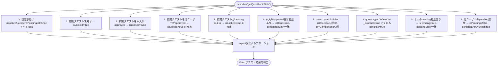
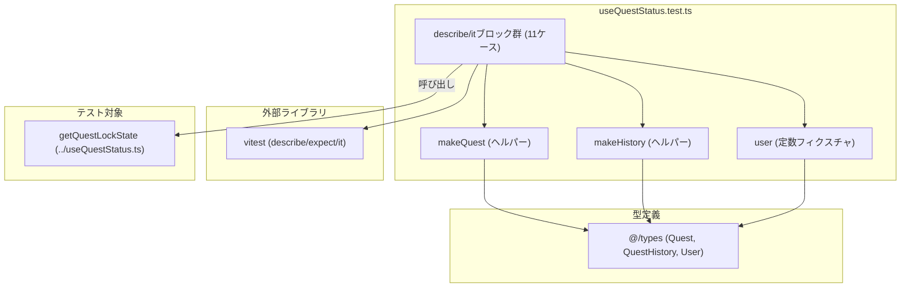

## 1. 解析メタ情報

| 項目 | 内容 |
| --- | --- |
| 対象ファイル | `useQuestStatus.test.ts` (family-quest/src/features/quest/hooks/useQuestStatus.test.ts) |
| 言語 | TypeScript (Vitest) |
| 解析対象 | 提供されたコードのみ |
| 推測・補完 | 一切なし |

## 関連ドキュメント

* [useQuestStatus.md](./useQuestStatus.md) - テスト対象の`getQuestLockState`関数の実装元。
* [../../../types/index.md](../../../types/index.md) - `Quest`/`QuestHistory`/`User`型定義の提供元。

## 2. ファイルの概要

`useQuestStatus.ts`が公開する純粋関数`getQuestLockState`の単体テストスイート。Vitestの`describe`/`it`/`expect`を用い、前提クエスト(`pre_requisite_quest_id`)によるロック判定、無限クエスト(`quest_type === 'infinite'`または`_isInfinite`フラグ)の完了扱い、完了済み(`isDone`)判定、申請中(`isPending`)判定の4つの観点について、それぞれ正常系・他ユーザーの履歴による誤判定防止・状態未確定(`pending`)の履歴による誤判定防止を検証する11件のテストケースを持つ。テストデータ生成用のヘルパー関数`makeQuest`/`makeHistory`をファイル冒頭で定義し、各テストは`Partial<Quest>`/`Partial<QuestHistory>`の上書き分のみを渡して個別のテストケースを組み立てる。
* 根拠: `describe`ブロック定義 (行番号: 15 / 抜粋: "describe('getQuestLockState', () => {")
* 根拠: `makeQuest`/`makeHistory`ヘルパー定義 (行番号: 7〜13 / 抜粋: "function makeQuest(overrides: Partial<Quest> = {}): Quest {\n    return { quest_id: 1, title: 'テストクエスト', ...overrides };\n}\n\nfunction makeHistory(overrides: Partial<QuestHistory> = {}): QuestHistory {\n    return { user_id: 'alice', quest_id: 1, status: 'approved', ...overrides };\n}")

## 3. 外部依存関係

### インポート一覧

| 名称 | 種類 | 用途 | 根拠 |
| --- | --- | --- | --- |
| `describe`, `expect`, `it` | 外部ライブラリ(`vitest`) | テストスイート・テストケースの定義とアサーション | 根拠: [インポート宣言] (行番号: 1 / 抜粋: "import { describe, expect, it } from 'vitest';") |
| `getQuestLockState` | 内部モジュール(テスト対象) | 本テストスイートが検証する純粋関数の実体 | 根拠: [インポート宣言] (行番号: 2 / 抜粋: "import { getQuestLockState } from './useQuestStatus';") |
| `Quest`, `QuestHistory`, `User` | 型定義(`@/types`) | `makeQuest`/`makeHistory`の戻り値型、および`user`定数の型指定 | 根拠: [インポート宣言] (行番号: 3 / 抜粋: "import { Quest, QuestHistory, User } from '@/types';") |

### ブラックボックスとなる外部要素

| 名称 | 理由 | 根拠 |
| --- | --- | --- |
| `vitest`ランナー自体の実行・レポーティング機構 | `describe`/`it`/`expect`がどのように実行され、CI等でどう結果集計されるかは本ファイル外（Vitest本体・`vite.config`等の設定）に依存するため。 | 根拠: [インポート宣言] (行番号: 1 / 抜粋: "import { describe, expect, it } from 'vitest';") |
| `getQuestLockState` の内部実装 | 本ファイルは`getQuestLockState`の呼び出し結果（`QuestLockState`オブジェクト）の検証のみを行い、内部のロック判定・完了判定ロジック自体は`useQuestStatus.ts`側の実装に依存する（詳細は[useQuestStatus.md](./useQuestStatus.md)を参照）。 | 根拠: [インポート宣言] (行番号: 2 / 抜粋: "import { getQuestLockState } from './useQuestStatus';") |

## 4. 主要要素の定義（関数 / エンドポイント / コンポーネント）

### `user` (モジュールレベル定数)

* **役割**: 全テストケースで共通して使う`User`オブジェクトのテストフィクスチャ。`user_id: 'alice'`固定。
* 根拠: (行番号: 5 / 抜粋: "const user: User = { user_id: 'alice', name: 'Alice', level: 1, exp: 0, gold: 0 };")

* **引数/リクエスト**: 該当なし
* **戻り値/レスポンス**: 該当なし
* **副作用**: なし
* **エラーハンドリング**: なし

### `makeQuest` (モジュールレベル関数)

* **役割**: テスト用の`Quest`オブジェクトを生成するファクトリ関数。既定で`{ quest_id: 1, title: 'テストクエスト' }`を返し、引数`overrides`で個別のテストケースに必要なフィールド（`pre_requisite_quest_id`/`quest_type`/`_isInfinite`等）を上書きできる。
* 根拠: (行番号: 7〜9 / 抜粋: "function makeQuest(overrides: Partial<Quest> = {}): Quest {\n    return { quest_id: 1, title: 'テストクエスト', ...overrides };\n}")

* **引数/リクエスト**: `overrides: Partial<Quest>`（既定値`{}`）
* 根拠: (行番号: 7 / 抜粋: "function makeQuest(overrides: Partial<Quest> = {}): Quest {")

* **戻り値/レスポンス**: `Quest`
* 根拠: (行番号: 7〜9)

* **副作用**: なし
* **エラーハンドリング**: なし

### `makeHistory` (モジュールレベル関数)

* **役割**: テスト用の`QuestHistory`オブジェクトを生成するファクトリ関数。既定で`{ user_id: 'alice', quest_id: 1, status: 'approved' }`を返し、引数`overrides`で個別のテストケースに必要なフィールド（`user_id`/`quest_id`/`status`の上書き等）を指定できる。
* 根拠: (行番号: 11〜13 / 抜粋: "function makeHistory(overrides: Partial<QuestHistory> = {}): QuestHistory {\n    return { user_id: 'alice', quest_id: 1, status: 'approved', ...overrides };\n}")

* **引数/リクエスト**: `overrides: Partial<QuestHistory>`（既定値`{}`）
* 根拠: (行番号: 11 / 抜粋: "function makeHistory(overrides: Partial<QuestHistory> = {}): QuestHistory {")

* **戻り値/レスポンス**: `QuestHistory`
* 根拠: (行番号: 11〜13)

* **副作用**: なし
* **エラーハンドリング**: なし

### `describe('getQuestLockState', ...)` 内の11件のテストケース

* **役割**: `getQuestLockState(quest, currentUser, completedQuests, pendingQuests)`の戻り値（`QuestLockState`）を、以下の4観点・11ケースで検証する。
  1. **既定状態**（16〜19行目）: 前提クエストなし・完了履歴なし・申請中履歴なしの場合、`isLocked`/`isDone`/`isPending`/`isInfinite`がすべて`false`であることを`toMatchObject`で検証。
  2. **前提クエストによるロック判定**（21〜46行目、4ケース）: `pre_requisite_quest_id: 5`を設定したクエストについて、(a) 前提クエストが未完了なら`isLocked === true`、(b) 同一ユーザーが前提クエストを`approved`済みなら`isLocked === false`、(c) 他ユーザー(`'bob'`)の`approved`済み履歴では`isLocked`が解除されない（`true`のまま）、(d) 前提クエストが`pending`（未承認）のままでは`isLocked`が解除されない（`true`のまま）ことを検証。
  3. **完了判定(`isDone`)と無限クエスト**（48〜68行目、3ケース）: (a) 承認済み完了履歴が1件あれば`isDone === true`かつ`completedEntry`がその履歴と一致、(b) `quest_type: 'infinite'`のクエストは完了履歴が複数あっても`isInfinite === true`かつ`isDone === false`のまま、`myCompletions`は履歴件数どおり2件、(c) `quest_type: 'infinite'`指定と`_isInfinite: true`フラグ指定のいずれでも`isInfinite === true`になることを個別に検証。
  4. **申請中判定(`isPending`)**（70〜84行目、2ケース）: (a) 自身の`pending`履歴が存在すれば`isPending === true`かつ`pendingEntry`がその履歴と一致、(b) 他ユーザー(`'bob'`)の`pending`履歴は無視され`isPending === false`かつ`pendingEntry`が`undefined`のままであることを検証。
* 根拠: 既定状態テスト (行番号: 16〜19 / 抜粋: "it('is unlocked, not done, not pending by default', () => {\n        const state = getQuestLockState(makeQuest(), user, [], []);\n        expect(state).toMatchObject({ isLocked: false, isDone: false, isPending: false, isInfinite: false });\n    });")
* 根拠: 前提クエストロック判定4ケース (行番号: 21〜46 / 抜粋: "it('locks the quest when its prerequisite is not yet approved for this user', () => {\n        const quest = makeQuest({ pre_requisite_quest_id: 5 });\n        const state = getQuestLockState(quest, user, [], []);\n        expect(state.isLocked).toBe(true);\n    });")
* 根拠: 他ユーザーの前提クエスト完了では解除されない (行番号: 34〜39 / 抜粋: "it('does not unlock via another user\\'s approval of the prerequisite', () => {\n        const quest = makeQuest({ pre_requisite_quest_id: 5 });\n        const completed = [makeHistory({ user_id: 'bob', quest_id: 5, status: 'approved' })];\n        const state = getQuestLockState(quest, user, completed, []);\n        expect(state.isLocked).toBe(true);\n    });")
* 根拠: `pending`状態の前提クエストでは解除されない (行番号: 41〜46 / 抜粋: "it('does not unlock via a pending (not yet approved) prerequisite', () => {\n        const quest = makeQuest({ pre_requisite_quest_id: 5 });\n        const completed = [makeHistory({ quest_id: 5, status: 'pending' })];\n        const state = getQuestLockState(quest, user, completed, []);\n        expect(state.isLocked).toBe(true);\n    });")
* 根拠: 完了判定と`completedEntry` (行番号: 48〜54 / 抜粋: "it('marks a quest done when this user has an approved completion', () => {\n        const quest = makeQuest({ quest_id: 1 });\n        const completed = [makeHistory({ quest_id: 1 })];\n        const state = getQuestLockState(quest, user, completed, []);\n        expect(state.isDone).toBe(true);\n        expect(state.completedEntry).toEqual(completed[0]);\n    });")
* 根拠: 無限クエストは完了扱いにならない (行番号: 56〜63 / 抜粋: "it('treats an infinite quest as never \"done\", even with completions', () => {\n        const quest = makeQuest({ quest_type: 'infinite' });\n        const completed = [makeHistory(), makeHistory()];\n        const state = getQuestLockState(quest, user, completed, []);\n        expect(state.isInfinite).toBe(true);\n        expect(state.isDone).toBe(false);\n        expect(state.myCompletions).toHaveLength(2);\n    });")
* 根拠: `quest_type`と`_isInfinite`の両方で無限判定 (行番号: 65〜68 / 抜粋: "it('recognizes infinite via quest_type or the frontend _isInfinite flag too', () => {\n        expect(getQuestLockState(makeQuest({ quest_type: 'infinite' }), user, [], []).isInfinite).toBe(true);\n        expect(getQuestLockState(makeQuest({ _isInfinite: true }), user, [], []).isInfinite).toBe(true);\n    });")
* 根拠: 申請中判定と`pendingEntry` (行番号: 70〜76 / 抜粋: "it('marks a quest pending when this user has a pending entry', () => {\n        const quest = makeQuest({ quest_id: 1 });\n        const pending = [makeHistory({ quest_id: 1, status: 'pending' })];\n        const state = getQuestLockState(quest, user, [], pending);\n        expect(state.isPending).toBe(true);\n        expect(state.pendingEntry).toEqual(pending[0]);\n    });")
* 根拠: 他ユーザーの申請中履歴は無視 (行番号: 78〜84 / 抜粋: "it('ignores another user\\'s pending entry for the same quest', () => {\n        const quest = makeQuest({ quest_id: 1 });\n        const pending = [makeHistory({ user_id: 'bob', quest_id: 1, status: 'pending' })];\n        const state = getQuestLockState(quest, user, [], pending);\n        expect(state.isPending).toBe(false);\n        expect(state.pendingEntry).toBeUndefined();\n    });")

* **引数/リクエスト**: 該当なし（各テストケースはトップレベルの`it(name, fn)`呼び出しであり、外部からの引数は受け取らない）
* **戻り値/レスポンス**: 該当なし（Vitestのテストランナーに結果を報告するのみ）
* **副作用**: `expect`によるアサーション実行（テスト失敗時はVitestが例外として検知する）。DB・ネットワーク等の外部I/Oは一切行わない。
* 根拠: ファイル全体 (行番号: 1〜86 / 抜粋: 全体を確認し、`getQuestLockState`の呼び出しと`expect`によるアサーションのみで構成され、外部I/Oが存在しないことを確認)

* **エラーハンドリング**: なし（`try-catch`等は存在しない。テストケース内で送出された例外はVitestがそのままテスト失敗として捕捉する）

## 5. 処理フロー図

11件のテストケースが検証する分岐を、`getQuestLockState`の呼び出しパターンとしてまとめたフローチャートです（本ファイル自体に実行時分岐はなく、各`it`ブロックが独立して実行されるテストケースの一覧を示す）。

## 6. 依存関係図

## 7. 次のステップ（リバースエンジニアリングの提案）

| 優先度 | ファイル名(推測可) | 理由 | 根拠 |
| --- | --- | --- | --- |
| 高 | `./useQuestStatus.ts` | 本テストスイートが検証する`getQuestLockState`の実装本体。テストケースの意図（ロック・完了・申請中の各判定基準）を正確に理解するために必須。 | `import { getQuestLockState } from './useQuestStatus';` |
| 低 | `@/types` の定義ファイル | `Quest`/`QuestHistory`/`User`の完全なスキーマを把握し、`makeQuest`/`makeHistory`が省略しているフィールド（`Partial`で任意扱いになっている項目）の全容を確認するため。 | `import { Quest, QuestHistory, User } from '@/types';` |
| 低 | Vitest / プロジェクトのテスト実行設定（`vite.config.ts`等） | 本テストがCIでどう実行されるか（`npm run test`等のスクリプト、カバレッジ設定の有無）を確認するため。 | `import { describe, expect, it } from 'vitest';` |

## 8. 保守上の注意点

* **`getQuestLockState`のみを対象とし、`useQuestStatus`（Hook本体）はテスト対象外**: 本ファイルは`useQuestStatus.ts`が公開する2つのエクスポート（純粋関数`getQuestLockState`とカスタムフック`useQuestStatus`）のうち、Hooksに依存しない`getQuestLockState`のみをテストしている。`useQuestStatus`側が追加する`displayTitle`/`variant`の算出ロジック（`isRandom`/`isLimited`/`isTimeLimited`の判定や`variant`の優先順位付け等）はカバーされていない。
* 根拠: (行番号: 2 / 抜粋: "import { getQuestLockState } from './useQuestStatus';")、`useQuestStatus`自体のimportが存在しないことを確認（1〜3行目のimport文一覧）
* **`completedQuests`/`pendingQuests`の「今日」絞り込み前提はテスト対象外**: `useQuestStatus.md`の解析によれば、`getQuestLockState`は呼び出し元が`completedQuests`に「今日」（または`reset_period`に応じた周期内）の承認済みデータのみを渡している前提で動作するが、本テストファイルはこの前提を検証しておらず、`makeHistory`が生成する履歴に日付関連のフィールド（`completed_at`等）は一切含まれない。
* 根拠: (行番号: 11〜13 / 抜粋: "function makeHistory(overrides: Partial<QuestHistory> = {}): QuestHistory {\n    return { user_id: 'alice', quest_id: 1, status: 'approved', ...overrides };\n}")、`makeHistory`が生成するオブジェクトに日付関連フィールドが存在しないことを確認
* **`linked_history_id`（兄妹連携クエスト）関連のケースは未カバー**: `QuestHistory`型が持つ`linked_history_id`フィールドや、`target_user === 'siblings'`の兄妹連携クエストに関するテストケースは本ファイルには存在しない。`getQuestLockState`自体もこれらのフィールドを直接は参照していないと見られるが（`useQuestStatus.md`を参照）、兄妹連携クエスト固有の挙動を変更する際は本テストファイルではカバーできない点に注意。
* 根拠: ファイル全体 (行番号: 1〜86)、`linked_history_id`/`target_user`/`siblings`のいずれの文字列も本ファイル中に出現しないことを確認

## 9. 不明事項一覧

| 項目 | 理由 | 必要なファイル |
| --- | --- | --- |
| テストの実行方法・CI組み込み状況 | `package.json`のテストスクリプトや`vite.config.ts`のVitest設定が本ファイルからは不明なため、`npm run test`等でどう実行されるか、CIでのブロッキング要否が分からない。 | `family-quest/package.json`, `family-quest/vite.config.ts`（または`vitest.config.ts`） |
| `getQuestLockState`のテストカバレッジの完全性 | 本ファイルが`getQuestLockState`の全分岐（特に`linked_history_id`や日付境界に関わる分岐）を網羅しているかどうかは、`useQuestStatus.ts`側の実装と突き合わせないと判断できない。 | `./useQuestStatus.ts` |

## 相互参照による補足情報

| 元の不明事項 | 判明した内容 | 参照元ドキュメント |
| --- | --- | --- |
| `getQuestLockState`のテストカバレッジの完全性 | `useQuestStatus.md`の解析によれば、`getQuestLockState`(31〜83行目)は`pre_requisite_quest_id`によるロック判定・`myCompletions`による完了判定（無限クエストの上書きを含む）・`pendingEntry`による申請中判定の3ブロックのみで構成され、`linked_history_id`や`target_user`を直接参照する分岐は存在しない。本テストファイルの11ケースは、この3ブロックの主要な分岐（前提クエストの有無・承認者本人か他ユーザーか・pending状態か、無限クエストの2種類の判定方法、申請中履歴の本人/他ユーザー判定）をいずれもカバーしており、`getQuestLockState`関数自体が持つ分岐と比較して大きな抜け漏れは見当たらない。 | `./useQuestStatus.md` |

## 10. 自己検証結果

* [x] 完了: 推測・外部ファイルの仕様を一切含んでいない
* [x] 完了: 全関数・全クラス・全コンポーネントを列挙した（ヘルパー関数2件・定数1件・テストケース11件をすべて列挙）
* [x] 完了: 全てのインポート要素を列挙した
* [x] 完了: すべての仕様説明に「根拠（行番号・抜粋）」を明記した
* [x] 完了: 根拠漏れが0件である
* [x] 完了: Mermaid構文にエラーの原因となる記号（エスケープ漏れ）がない
* [x] 完了: 不明事項を漏れなく列挙した
