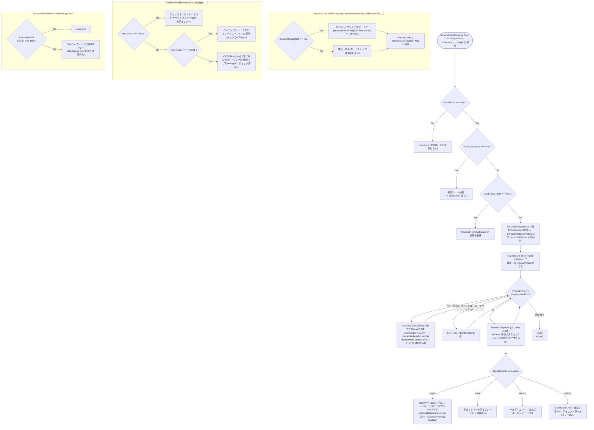
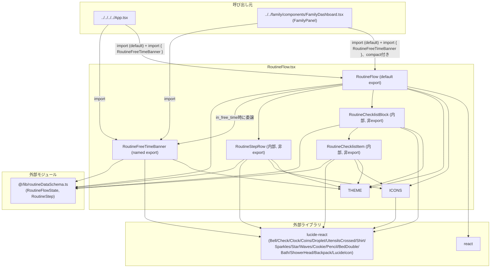

## 1. 解析メタ情報

| 項目 | 内容 |
| --- | --- |
| 対象ファイル | `RoutineFlow.tsx` (family-quest/src/features/routine/components/RoutineFlow.tsx) |
| 言語 | React (TypeScript) |
| 解析対象 | 提供されたコードのみ |
| 推測・補完 | 一切なし |
| 解析基準コミット | `3ac46ca` (+同一ブランチ内で`THEME[flowKey].chip`の冗長参照をコードレビューで修正、朝の準備の順不同チェックリスト化(`RoutineChecklistBlock`/`RoutineChecklistItem`を新規追加)、夜の切り替え時刻変更/寝る準備チェックリスト化/明日の準備追加(チェックリストブロックの描画位置をamの先頭固定からflow.steps上の実際の位置に沿って挿入する一般化、pm向けにチェックポイント後チェックリストではボーナスチップを出さない分岐を追加)を追加修正) |

## 関連ドキュメント

* [../../../lib/routineDataSchema.md](../../../lib/routineDataSchema.md) - 本ファイルがpropsの型として使う`RoutineFlowState`/`RoutineStep`の実装元。
* [../../../hooks/useRoutineData.md](../../../hooks/useRoutineData.md) - 本ファイルの`flow`/`onCompleteStep`/`isCompleting`各propsの実データの取得元（呼び出し元が`useRoutineData`から取得した値をそのまま渡す）。
* [../../../../App.md](../../../../App.md) - `RoutineFlow`（デフォルトエクスポート）と`RoutineFreeTimeBanner`（名前付きエクスポート）の両方を、縦画面の`activeTab === 'quest'`描画分岐内で使う消費元。
* [../../family/components/FamilyDashboard.md](../../family/components/FamilyDashboard.md) - `FamilyPanel`が同様に両コンポーネントを`compact`付きで使う消費元。
* [MY_HOME_SYSTEM側 routine_data.md](../../../../../../MY_HOME_SYSTEM/routine_data.md) - `is_checklist`(`checklist`フィールド)がフロー内のどこに置かれうるか(`get_checklist_range`が返す連続ブロック、amは先頭・pmはチェックポイント通過後)の定義元。本ファイルの描画順ロジック(flow.steps全体を1回だけ走査してブロックを差し込む方式)はこの前提に対応するために書かれた。
* [MY_HOME_SYSTEM側 routine_service.md](../../../../../../MY_HOME_SYSTEM/routine_service.md) - `preview_bonus_gold`がチェックポイントより前のステップの達成率でのみ変動する(`_eligible_done_ratio`)ことの実装元。本ファイルがチェックポイント後のチェックリストでボーナスチップを出さない判定(`checklistAffectsBonus`)の根拠になっている。

## 2. ファイルの概要

「きょうのすごろく」機能のUI本体を提供するファイル。平日の朝/夕方の生活動線を、縦一列のすごろく（路線図）として常時全ステップ表示するコンポーネント`RoutineFlow`（デフォルトエクスポート）と、自由時間中に代わりに表示する現在地バナー`RoutineFreeTimeBanner`（名前付きエクスポート）の2つのコンポーネントを定義する。療育目的として「現在地と見通しを常に見せる」ことを意図しており、ファイル冒頭のコメントによれば、自由時間の終了（チェックポイント）はサーバー側で時刻ベースに強制通過させる設計のため、本コンポーネントは現在のステップを手動で進める手段を持たず、現在のステップの完了報告のみを行う。**（朝の準備チェックリスト化で変更）** `RoutineFlow`は誘導中の描画時に`flow.steps`を`step.is_checklist`で「チェックリスト部分」と「路線図部分」に分けて扱うようになり、チェックリスト部分は新設の内部コンポーネント`RoutineChecklistBlock`(チェック状況に応じて増える出発ボーナス見込み額`preview_bonus_gold`/`bonus_full_gold`の表示も兼ねる)と`RoutineChecklistItem`(1項目ぶんのタップ可能なチェック行)で描画し、路線図部分は従来通り`RoutineStepRow`(内部コンポーネント)でマップする。**（夜の切り替え/寝る準備チェックリスト化で全面的に変更）** 当初、チェックリスト部分は「常にチェックリスト→残りの一本道」という固定順で描画していたが、これは`am`(朝の準備がフロー先頭にある)にしか対応できない実装だった。`pm`フローのチェックポイント通過後にチェックリスト(寝る準備4項目)が追加されたことで、`flow.steps`配列全体を1回だけ走査し、チェックリストに差し掛かった位置でブロックを1つだけ差し込む形に書き直された。これにより、チェックリストがフロー先頭にある`am`・チェックポイント通過後にある`pm`のどちらでも、実際の生活動線の順序通りに描画される。また、出発ボーナスの見込み額はチェックポイントより前のステップの達成率でのみ決まる(`MY_HOME_SYSTEM/services/routine_service.py`の`_eligible_done_ratio`)ため、チェックポイントより後にあるチェックリスト(`pm`の寝る準備)では`RoutineChecklistBlock`にボーナス表示チップ自体を出さない判定(`checklistAffectsBonus`)が追加された。
* 根拠: ファイル冒頭コメント (行番号: 1〜7 / 抜粋: "// family-quest/src/features/routine/components/RoutineFlow.tsx\n//\n// 「きょうのすごろく」— 平日の朝/夕方の生活動線を、縦一列のすごろく/路線図として\n// 常時全ステップ表示するUI(療育目的: 現在地と見通しを常に見せる)。\n// 自由時間の終了(チェックポイント)だけはサーバー側で時刻ベースに強制通過させる\n// (services/routine_service.py)ため、このコンポーネントには手動で進める手段を\n// 持たせず、現在のステップの完了報告のみを行う。")
* 根拠: `export default RoutineFlow` (行番号: 305 / 抜粋: "export default RoutineFlow;")
* 根拠: `export const RoutineFreeTimeBanner` (行番号: 67 / 抜粋: "export const RoutineFreeTimeBanner: React.FC<{ flowKey: 'am' | 'pm'; flow: RoutineFlowState }> = ({ flowKey, flow }) => {")
* 根拠: チェックリストブロックを実際の位置に差し込む描画ロジックとそのコメント (行番号: 100〜108 / 抜粋: "// チェックリスト項目(順不同でチェックできる、例: 朝の準備5項目・寝る準備4項目)は\n    // フロー内で連続する一塊(routine_data.py get_checklist_range参照)。すごろく/\n    // 路線図の一本道には乗せず、専用のチェックボックスUIとしてひとまとめに表示するが、\n    // ブロックの位置自体はamなら先頭、pmならチェックポイント通過後と実際のflow.steps\n    // 上の並び順が異なるため、単純に「チェックリスト→残りの一本道」の順で並べると\n    // pmでは表示順が生活動線と逆転してしまう。そのためflow.steps全体を1回だけ走査し、\n    // チェックリストに差し掛かった位置でブロックを1つだけ差し込む形で組み立てる。")
* 根拠: ボーナスチップの出し分け判定とそのコメント (行番号: 110〜117 / 抜粋: "// 出発ボーナス(preview_bonus_gold)はチェックポイントより前のステップの達成率で\n    // 決まる(routine_service._eligible_done_ratio)。チェックリストがチェックポイントの\n    // 「後」にある場合(例: pmの寝る準備4項目)は、その時点でボーナスは既に確定済みで\n    // チェックしても金額は変わらないため、ボーナス表示自体を出さない(要件確認済みの\n    // 範囲外だが、出しっぱなしだと「チェックすると増える」ように誤解させてしまうため)。\n    const checkpointIndex = flow.steps.findIndex((step) => step.is_checkpoint);\n    const checklistStartIndex = flow.steps.findIndex((step) => step.is_checklist);\n    const checklistAffectsBonus = checkpointIndex === -1 || checklistStartIndex < checkpointIndex;")

## 3. 外部依存関係

### インポート一覧

| 名称 | 種類 | 用途 | 根拠 |
| --- | --- | --- | --- |
| `React` | 外部ライブラリ | コンポーネント定義 | 根拠: [インポート宣言] (行番号: 8 / 抜粋: "import React from 'react';") |
| `Bell`, `Check`, `Clock`, `Coins`, `LucideIcon` | 外部ライブラリ(`lucide-react`) | `Bell`はリマインド状態、`Check`は完了状態のアイコン、`Clock`はチェックポイント時刻表示のアイコン、**（朝の準備チェックリスト化で追加）**`Coins`は`RoutineChecklistBlock`の出発ボーナス見込み額チップのアイコン、`LucideIcon`は`ICONS`テーブルの値の型注釈 | 根拠: [インポート宣言] (行番号: 9 / 抜粋: "import { Bell, Check, Clock, Coins, LucideIcon } from 'lucide-react';") |
| `Droplet`, `UtensilsCrossed`, `Shirt`, `Sparkles`, `Star`, `Waves`, `Cookie`, `Pencil`, `BedDouble`, `Bath`, `ShowerHead`, `Backpack` | 外部ライブラリ(`lucide-react`) | `ICONS`テーブルの各`icon_key`に対応するアイコンコンポーネント（`Star`は未知の`icon_key`に対するフォールバックにも使われる）。**（朝の準備チェックリスト化で追加）**`Bath`は`toilet`キー用。**（夜の切り替え/寝る準備チェックリスト化で変更）**単独ステップ`nightprep`が廃止されたため`Moon`の利用箇所が無くなりimportから削除され、代わりに新設の`tomorrow_prep`キー用`Backpack`、`bath`キー用`ShowerHead`(`toilet`が既に`Bath`を使っているため、実際の入浴と見分けが付くよう別アイコンにした)が追加された。**（画面非表示化で変更）**`am`フローの末尾ステップ`leave`が廃止され`ICONS`テーブルから対応エントリ`leave: DoorOpen`が削除されたことに伴い、他の場所で使われなくなった`DoorOpen`もimportから削除された。 | 根拠: [インポート宣言] (行番号: 10〜13 / 抜粋: "import {\n    Droplet, UtensilsCrossed, Shirt, Sparkles, Star,\n    Waves, Cookie, Pencil, BedDouble, Bath, ShowerHead, Backpack,\n} from 'lucide-react';") |
| `RoutineFlowState`, `RoutineStep` | 外部モジュール(型定義) | `RoutineFlowState`は`RoutineFlow`/`RoutineFreeTimeBanner`propsの`flow`の型、`RoutineStep`は`RoutineStepRow`/**（朝の準備チェックリスト化で追加）**`RoutineChecklistBlock`/`RoutineChecklistItem`の`step`(または`steps`)propの型 | 根拠: [インポート宣言] (行番号: 14 / 抜粋: "import { RoutineFlowState, RoutineStep } from '@/lib/routineDataSchema';") |

### ブラックボックスとなる外部要素

| 名称 | 理由 | 根拠 |
| --- | --- | --- |
| `lucide-react`の各アイコンコンポーネント | 各アイコンの実際のSVG描画内容はライブラリ内部の実装であり、本ファイルからは名称と`size`propの指定のみが分かる。 | 根拠: [インポート宣言] (行番号: 9〜13) |
| `RoutineFlowState`/`RoutineStep`の詳細なフィールド定義 | `@/lib/routineDataSchema.ts`に実装があり、本ファイルからは各フィールドの参照箇所のみが分かる（詳細は`routineDataSchema.md`を参照）。 | 根拠: [インポート宣言] (行番号: 14 / 抜粋: "import { RoutineFlowState, RoutineStep } from '@/lib/routineDataSchema';") |
| `icon_key`の実際の値の全一覧（バックエンド側） | `ICONS`テーブルのキーは本ファイル内でのみ定義されており、バックエンド（`MY_HOME_SYSTEM/routine_data.py`）が実際にどの`icon_key`文字列を送出するかは本ファイルからは不明。 | 根拠: [`ICONS`テーブル定義] (行番号: 16〜33) |

## 4. 主要要素の定義（関数 / エンドポイント / コンポーネント）

### `ICONS` (モジュールレベル定数、非export)

* **役割**: バックエンドから送られてくる`step.icon_key`文字列を、実際に描画するアイコンコンポーネント（`LucideIcon`）にマッピングするルックアップテーブル。`wash`/`meal`/`clothes`/`teeth`/`toilet`/`free`/`handwash`/`snack`/`homework`/**（夜の切り替え/寝る準備チェックリスト化で追加）**`tomorrow_prep`/`bath`/`sleep`の12キーを定義する(**画面非表示化で変更**: `am`フローの末尾ステップ`leave`廃止に伴い`leave`エントリが削除され13キーから12キーになった)。**（夜の切り替え/寝る準備チェックリスト化で変更）** 以前は`pm`の単独ステップ`nightprep`用に`Moon`が定義されていたが、`nightprep`が晩ごはん/お風呂/着替え/歯磨きの4項目に分割され廃止されたためこのエントリも削除された。`dinner`(晩ごはん)・`nightclothes`(着替え)・`nightteeth`(歯磨き)という新しいステップキーは、対応する`icon_key`にそれぞれ`am`と同じ`'meal'`/`'clothes'`/`'teeth'`を送出することでこのテーブルを再利用しており、専用エントリは追加されていない(バックエンド側`routine_data.py`の`icon_key`フィールド設定による、[routine_data.md](../../../../../../MY_HOME_SYSTEM/routine_data.md)参照)。
* 根拠: [定数定義] (行番号: 16〜33 / 抜粋: "const ICONS: Record<string, LucideIcon> = {\n    wash: Droplet,\n    meal: UtensilsCrossed,\n    clothes: Shirt,\n    teeth: Sparkles,\n    toilet: Bath,\n    free: Star,\n    handwash: Waves,\n    snack: Cookie,\n    homework: Pencil,\n    // 「明日の準備」(要件: 宿題の次に追加)。\n    tomorrow_prep: Backpack,\n    // 「お風呂」(要件: 寝る準備を晩ごはん/お風呂/着替え/歯磨きに分割)。\n    // トイレはlucide-reactに専用アイコンが無いため既にBathを転用しており、\n    // 実際の入浴と見分けが付くようShowerHeadを充てる。\n    bath: ShowerHead,\n    sleep: BedDouble,\n};")

* **引数/リクエスト**: 該当なし（ルックアップテーブルであり関数ではない）
* **戻り値/レスポンス**: 該当なし
* **副作用**: なし
* **エラーハンドリング**: 該当なし（未定義キーへのアクセスは`undefined`を返すのみで、実際のフォールバック処理は`RoutineStepRow`/`RoutineChecklistItem`側（いずれも`ICONS[step.icon_key] || Star`）が担う。8章参照）

### `THEME` (モジュールレベル定数、非export)

* **役割**: `am`（朝、黄色系）と`pm`（夕方、紫系）の2つの時間帯それぞれについて、`text`/`chip`/`node`/`nodeDone`/`seg`/`spotlight`/`btn`/`banner`の8種類のTailwind CSSクラス文字列をまとめたテーマ定義オブジェクト。`as const`で宣言され、`RoutineFlow`/`RoutineFreeTimeBanner`/`RoutineStepRow`/`RoutineChecklistBlock`/`RoutineChecklistItem`の全てが`flowKey`（`'am' | 'pm'`）に応じてこのテーブルから対応するクラスを引いて使う。本定数自体は夜の切り替え/寝る準備チェックリスト化による変更を受けていない。
* 根拠: [定数定義] (行番号: 35〜56 / 抜粋: "const THEME = {\n    am: {\n        text: 'text-yellow-400',\n        chip: 'bg-yellow-900/40 text-yellow-300 border-yellow-500',\n        node: 'bg-gradient-to-br from-yellow-300 to-yellow-500 text-yellow-950 border-yellow-300',\n        nodeDone: 'bg-yellow-900/40 border-yellow-500 text-yellow-300',\n        seg: 'bg-yellow-500',\n        spotlight: 'bg-gradient-to-br from-yellow-900/50 to-yellow-900/10 border-yellow-500/60',\n        btn: 'bg-gradient-to-r from-yellow-300 to-yellow-500 text-yellow-950 shadow-yellow-500/40',\n        banner: 'bg-yellow-900/30 border-yellow-500/50',\n    },\n    pm: {\n        text: 'text-purple-400',", "} as const;")

* **引数/リクエスト**: 該当なし
* **戻り値/レスポンス**: 該当なし
* **副作用**: なし
* **エラーハンドリング**: 該当なし

### `RoutineFlowProps` (型定義、非export)

* **役割**: `RoutineFlow`コンポーネントが受け取るPropsのインターフェース。`flowKey`（`'am' | 'pm'`、テーマ色の切り替えに使用）、`flow`（`RoutineFlowState`、当該フローの現在の状態）、`onCompleteStep`（現在のステップの完了報告コールバック。`RoutineChecklistBlock`/`RoutineChecklistItem`のトグル操作もこの同じコールバックを経由する）、`isCompleting`（送信中フラグ、任意）、`compact`（横画面パネル向けの縮小表示フラグ、任意）を持つ。本型定義自体は夜の切り替え/寝る準備チェックリスト化による変更を受けていない。
* 根拠: [インターフェース定義] (行番号: 58〜64 / 抜粋: "interface RoutineFlowProps {\n    flowKey: 'am' | 'pm';\n    flow: RoutineFlowState;\n    onCompleteStep: (stepKey: string) => void;\n    isCompleting?: boolean;\n    compact?: boolean;\n}")

* **引数/リクエスト**: 該当なし（型定義であり関数ではない）
* **戻り値/レスポンス**: 該当なし
* **副作用**: なし
* **エラーハンドリング**: 該当なし

### `RoutineFlow` (デフォルトエクスポート、コンポーネント)

* **役割**: `flowKey`/`flow`/`onCompleteStep`/`isCompleting`/`compact`のpropsを受け取り、`flow`の状態に応じて描画分岐を持つコンポーネント。(1) `flow.started`が偽（未開始）なら`null`を返し何も表示しない。(2) `flow.is_complete`が真なら、絵文字とテーマカラーを使った完了祝賀カード（「🎉」＋`{flow.title}・完了！`）を表示する。(3) `flow.in_free_time`が真なら、`RoutineFreeTimeBanner`（後述）へ描画を委譲する。(4) 上記いずれにも該当しない（誘導中）場合、**（夜の切り替え/寝る準備チェックリスト化で全面的に書き直し）** 以前は`flow.steps`を`step.is_checklist`で`checklistSteps`/`pathSteps`の2グループに分け、「`checklistSteps`があれば先頭に`RoutineChecklistBlock`を1つ、続けて`pathSteps`全部」という固定順で描画していたが、これは`am`(チェックリストがフロー先頭にある)にしか対応できない構成だった。現在は`flow.steps`配列全体を`Array.prototype.reduce`で1回だけ走査し、非チェックリストのステップは1件ずつ`RoutineStepRow`として、チェックリストのステップに差し掛かった位置では(最初の1回だけ)`RoutineChecklistBlock`をまとめて差し込む形で描画リスト(`rows`)を組み立てる。これにより、チェックリストがフロー先頭にある`am`・チェックポイント通過後にある`pm`のどちらでも、実際の`flow.steps`の並び順通りに描画される。`RoutineStepRow`の`isLast`propには、チェックリストを除いた最後の非チェックリストステップ(`lastPathKey`)と一致するかどうかを渡す(接続線の描画有無の判定に使う、`RoutineStepRow`参照)。また、`RoutineChecklistBlock`へ渡す`previewBonusGold`は、そのチェックリストブロックがフロー内の(最初の)チェックポイントより前にあるかどうか(`checklistAffectsBonus`)で`flow.preview_bonus_gold`かリテラル`null`かを出し分ける(§2参照)。
* 根拠: [コンポーネント本体] (行番号: 83〜98 / 抜粋: "const RoutineFlow: React.FC<RoutineFlowProps> = ({ flowKey, flow, onCompleteStep, isCompleting, compact }) => {\n    if (!flow.started) return null;")
* 根拠: 完了分岐 (行番号: 87〜94 / 抜粋: "if (flow.is_complete) {\n        return (\n            
\n                
🎉
\n                
{flow.title}・完了！
\n            
\n        );\n    }")
* 根拠: 自由時間分岐 (行番号: 96〜98 / 抜粋: "if (flow.in_free_time) {\n        return <RoutineFreeTimeBanner flowKey={flowKey} flow={flow} />;\n    }")
* 根拠: チェックリスト/ボーナス判定に使う変数群 (行番号: 107〜117 / 抜粋: "const checklistSteps = flow.steps.filter((step) => step.is_checklist);\n    const pathSteps = flow.steps.filter((step) => !step.is_checklist);\n    const lastPathKey = pathSteps.length > 0 ? pathSteps[pathSteps.length - 1].key : null;")
* 根拠: flow.stepsを1回走査して描画リストを組み立てるreduce本体 (行番号: 119〜152 / 抜粋: "let checklistRendered = false;\n    const rows = flow.steps.reduce<React.ReactNode[]>((acc, step) => {\n        if (step.is_checklist) {\n            if (!checklistRendered) {\n                checklistRendered = true;\n                acc.push(\n                    <RoutineChecklistBlock\n                        key=\"checklist-block\"\n                        flowKey={flowKey}\n                        steps={checklistSteps}\n                        previewBonusGold={checklistAffectsBonus ? flow.preview_bonus_gold : null}\n                        fullBonusGold={flow.bonus_full_gold}\n                        onToggleStep={onCompleteStep}\n                        isCompleting={!!isCompleting}\n                        compact={!!compact}\n                    />\n                );\n            }\n            return acc;\n        }\n        acc.push(\n            <RoutineStepRow\n                key={step.key}\n                flowKey={flowKey}\n                step={step}\n                checkpointTime={flow.checkpoint_time}\n                isLast={step.key === lastPathKey}\n                onComplete={() => onCompleteStep(step.key)}\n                isCompleting={!!isCompleting}\n                compact={!!compact}\n            />\n        );\n        return acc;\n    }, []);")
* 根拠: 誘導中の最終的な戻り値 (行番号: 154 / 抜粋: "return 
{rows}
;")

* **引数/リクエスト**: `RoutineFlowProps`（`flowKey: 'am' | 'pm'`, `flow: RoutineFlowState`, `onCompleteStep: (stepKey: string) => void`, `isCompleting?: boolean`, `compact?: boolean`）
* 根拠: (行番号: 83 / 抜粋: "const RoutineFlow: React.FC<RoutineFlowProps> = ({ flowKey, flow, onCompleteStep, isCompleting, compact }) => {")

* **戻り値/レスポンス**: `null`（未開始時）、または上記の分岐いずれかのJSX要素
* 根拠: (行番号: 84, 88〜93, 97, 154)

* **副作用**: なし（描画のみ。実際のAPI通信は`onCompleteStep`コールバック経由で呼び出し元、実際には`useRoutineData`の`completeStep`に委譲される。`RoutineChecklistBlock`/`RoutineChecklistItem`のチェック操作も同じ`onCompleteStep`を経由するため、この副作用の範囲は変わらない）
* **エラーハンドリング**: なし（本コンポーネント自体は`flow`の値による分岐のみを行い、`onCompleteStep`の呼び出し結果（成功/失敗）を判定・表示する処理は持たない）

### `RoutineFreeTimeBanner` (名前付きエクスポート、コンポーネント)

* **役割**: 自由時間中の現在地表示専用のバナーコンポーネント。`flow.started`が偽、または`flow.in_free_time`が偽の場合は`null`を返す（`RoutineFlow`から`flow.in_free_time`が真の場合にのみ呼ばれる想定だが、本コンポーネント単体で直接呼び出された場合にも同じガードが働く）。星（`Star`）アイコンと「自由時間中」という見出し、`flow.checkpoint_time`が存在すれば「{checkpoint_time} になったら次へ進むよ」という案内文を表示する。本コンポーネント自体は夜の切り替え/寝る準備チェックリスト化による変更を受けていない。
* 根拠: [コンポーネント本体] (行番号: 67〜81 / 抜粋: "export const RoutineFreeTimeBanner: React.FC<{ flowKey: 'am' | 'pm'; flow: RoutineFlowState }> = ({ flowKey, flow }) => {\n    if (!flow.started || !flow.in_free_time) return null;\n    const theme = THEME[flowKey];\n    return (\n        
\n            <Star size={16} className={theme.text} />\n            
\n                
自由時間中
\n                {flow.checkpoint_time && (\n                    
{flow.checkpoint_time} になったら次へ進むよ
\n                )}\n            
\n        
\n    );\n};")
* 根拠: ファイル冒頭のコメント（自由時間中は別画面に任せる設計意図） (行番号: 66 / 抜粋: "// 自由時間中は別画面(既存のクエスト選択UI)に任せ、ここでは現在地バナーだけを表示する。")

* **引数/リクエスト**: `{ flowKey: 'am' | 'pm'; flow: RoutineFlowState }`
* 根拠: (行番号: 67 / 抜粋: "export const RoutineFreeTimeBanner: React.FC<{ flowKey: 'am' | 'pm'; flow: RoutineFlowState }> = ({ flowKey, flow }) => {")

* **戻り値/レスポンス**: `null`（`flow.started`が偽、または`flow.in_free_time`が偽の場合)、またはバナーのJSX要素
* 根拠: (行番号: 68 / 抜粋: "if (!flow.started || !flow.in_free_time) return null;")

* **副作用**: なし
* **エラーハンドリング**: なし（`flow.checkpoint_time`が`null`/falsy の場合は案内文自体を描画しない条件分岐のみで、例外処理は無い）
* 根拠: (行番号: 75〜77 / 抜粋: "{flow.checkpoint_time && (\n                    
{flow.checkpoint_time} になったら次へ進むよ
\n                )}")

### `RoutineChecklistBlock` (内部コンポーネント、非export、朝の準備チェックリスト化で新規追加)

* **役割**: `RoutineFlow`の描画走査で`checklist=True`なステップの先頭に差し掛かった位置に1つだけ描画される、順不同でチェックできる項目群(例: 朝の準備5項目、寝る準備4項目)を1枚のカードにまとめる内部コンポーネント。カード上部に見出し「できたらチェック！(じゅんばんは自由だよ)」を表示し、**（夜の切り替え/寝る準備チェックリスト化で変更）** `previewBonusGold`が`null`でなければ`Coins`アイコン付きの「出発ボーナス {previewBonusGold} / {fullBonusGold}」チップ(要件: チェックした分の出発ボーナス見込み額が画面で分かるようにしたい)を追加で表示する。`previewBonusGold`が`null`の場合(チェックポイントより後にあるチェックリスト、例: `pm`の寝る準備4項目)はこのチップ自体を描画しない — チェックポイントより後の項目をチェックしても出発ボーナスの金額は変わらない(既に確定済み)ため、チップを出し続けると「チェックすると増える」ように誤解させてしまうことを避けるための分岐であり、`RoutineFlow`側の`checklistAffectsBonus`判定(§4の`RoutineFlow`参照)が呼び出し時点で`previewBonusGold`に`null`かどうかを決めている。見出し・チップの下には`steps`の各要素を`RoutineChecklistItem`(後述)として縦に並べる。すごろく/路線図の一本道の見た目（ノード+接続線）はこのブロックには適用されず、`RoutineStepRow`とは別の専用レイアウトになる。
* 根拠: [コンポーネント本体・コメント] (行番号: 157〜171 / 抜粋: "// 朝の準備等、順不同でチェックできる項目をまとめて表示するブロック。チェックポイント\n// より前のチェックリスト(例: 朝の準備)ではチェックのたびに出発ボーナスの見込み額\n// (preview_bonus_gold)が増えていく様子も併せて見せる(要件: 1つチェックすると出発\n// ゴールドが増え、それが画面で分かるようにしたい)。previewBonusGoldがnullの場合\n// (チェックポイント後のチェックリスト、例: pmの寝る準備4項目)はボーナス表示自体を省く\n// (ボーナスは既に確定済みでチェックしても金額が変わらないため、誤解を避ける)。\nconst RoutineChecklistBlock: React.FC<{\n    flowKey: 'am' | 'pm';\n    steps: RoutineStep[];\n    previewBonusGold: number | null;\n    fullBonusGold: number;\n    onToggleStep: (stepKey: string) => void;\n    isCompleting: boolean;\n    compact: boolean;\n}> = ({ flowKey, steps, previewBonusGold, fullBonusGold, onToggleStep, isCompleting, compact }) => {")
* 根拠: 出発ボーナスチップの条件付き描画 (行番号: 175〜182 / 抜粋: "
\n                できたらチェック！(じゅんばんは自由だよ)\n                {previewBonusGold !== null && (\n                    \n                        <Coins size={12} />出発ボーナス {previewBonusGold} / {fullBonusGold}\n                    \n                )}\n            
")

* **引数/リクエスト**: `{ flowKey: 'am' | 'pm'; steps: RoutineStep[]; previewBonusGold: number | null; fullBonusGold: number; onToggleStep: (stepKey: string) => void; isCompleting: boolean; compact: boolean }`（**夜の切り替え/寝る準備チェックリスト化で変更**: `previewBonusGold`が`number`から`number | null`へ）
* 根拠: (行番号: 163〜171)

* **戻り値/レスポンス**: JSX要素（チェックリストカード全体）
* 根拠: (行番号: 173〜196)

* **副作用**: `RoutineChecklistItem`各行のタップにより`onToggleStep`（`RoutineFlow`側で`onCompleteStep`がそのまま渡される）を呼び出す。
* 根拠: (行番号: 184〜193 / 抜粋: "{steps.map((step) => (\n                    <RoutineChecklistItem\n                        key={step.key}\n                        flowKey={flowKey}\n                        step={step}\n                        onToggle={() => onToggleStep(step.key)}\n                        isCompleting={isCompleting}\n                        compact={compact}\n                    />\n                ))}")

* **エラーハンドリング**: なし

### `RoutineChecklistItem` (内部コンポーネント、非export、朝の準備チェックリスト化で新規追加)

* **役割**: `RoutineChecklistBlock`から1項目ぶんマップされる、タップでチェック/チェック解除できる行。行全体が`<button>`であり、`step.status`に関わらず常にタップ可能（`RoutineStepRow`の「`current`のときだけボタンが出る」設計とは異なり、チェックリスト項目は`'current'`(未チェック)/`'done'`(チェック済み)のどちらでも同じ`onToggle`ハンドラを呼ぶ）。左側の丸いバッジに`step.status === 'done'`ならチェックマーク、`'remind'`ならベルアイコン、それ以外は`ICONS[step.icon_key] || Star`のアイコンを表示し、行の背景色・バッジ色・ラベル色を`checked`/`remind`の状態に応じてテーマカラー(`theme.node`/`theme.nodeDone`)またはオレンジ系(リマインド)に変える。`remind`状態のときのみ行末に「まだだよ」バッジを追加で表示する。`compact`propに応じてバッジサイズ・アイコンサイズ・フォントサイズを縮小する。本コンポーネント自体は夜の切り替え/寝る準備チェックリスト化による変更を受けていない。
* 根拠: [コンポーネント本体] (行番号: 199〜218 / 抜粋: "const RoutineChecklistItem: React.FC<{\n    flowKey: 'am' | 'pm';\n    step: RoutineStep;\n    onToggle: () => void;\n    isCompleting: boolean;\n    compact: boolean;\n}> = ({ flowKey, step, onToggle, isCompleting, compact }) => {\n    const theme = THEME[flowKey];\n    const Icon = ICONS[step.icon_key] || Star;\n    const checked = step.status === 'done';\n    const remind = step.status === 'remind';\n    const iconSize = compact ? 14 : 18;\n\n    let boxClass = 'border-gray-500 text-gray-400';\n    if (checked) boxClass = theme.node;\n    if (remind) boxClass = 'border-orange-500 text-orange-300';\n\n    let rowClass = 'border-gray-600 bg-gray-800/60';\n    if (checked) rowClass = theme.nodeDone;\n    if (remind) rowClass = 'bg-orange-900/40 border-orange-500';")
* 根拠: ボタン本体とトグル呼び出し (行番号: 220〜226 / 抜粋: "return (\n        <button\n            type=\"button\"\n            onClick={onToggle}\n            disabled={isCompleting}\n            className={`flex items-center gap-3 w-full rounded-xl border px-3 py-2.5 text-left transition-colors disabled:opacity-50 ${rowClass}`}\n        >")

* **引数/リクエスト**: `{ flowKey: 'am' | 'pm'; step: RoutineStep; onToggle: () => void; isCompleting: boolean; compact: boolean }`
* 根拠: (行番号: 199〜205)

* **戻り値/レスポンス**: JSX要素（1項目ぶんのチェック行`<button>`）
* 根拠: (行番号: 220〜237)

* **副作用**: タップにより`onToggle`（`RoutineChecklistBlock`側で`() => onToggleStep(step.key)`として渡される）を呼び出す。`RoutineStepRow`の完了ボタンと異なり、`status`が`'current'`/`'done'`のどちらであっても同じ`onToggle`が呼ばれる(チェック/チェック解除どちらの操作もバックエンド側の`complete_step`が同じエンドポイントでトグルする設計、[routine_service.md](../../../../../../MY_HOME_SYSTEM/routine_service.md)の`_toggle_checklist_step`参照)。
* 根拠: (行番号: 221〜226 / 抜粋: "<button\n            type=\"button\"\n            onClick={onToggle}\n            disabled={isCompleting}\n            className={`flex items-center gap-3 w-full rounded-xl border px-3 py-2.5 text-left transition-colors disabled:opacity-50 ${rowClass}`}\n        >")

* **エラーハンドリング**: なし（`onToggle`の呼び出し結果自体はこのコンポーネントの関知するところではない。`isCompleting`が真の間はボタンを`disabled`にするのみ）

### `RoutineStepRow` (内部コンポーネント、非export)

* **役割**: `RoutineFlow`の誘導中描画から`is_checklist`が偽なステップについてマップされる、1ステップぶんの行を描画する内部コンポーネント。左側に円形のステップノード（`step.status`に応じて`done`＝チェックマーク、`remind`＝ベルアイコン、それ以外＝`ICONS[step.icon_key] || Star`のアイコン）と、その下に接続線・チェックポイントチップを描画する。**（画面非表示化で変更）** 以前は最終ステップ（`isLast`）なら接続線・チェックポイントチップの描画ブロック自体を`{!isLast && (...)}`でスキップしていたため、`step.is_checkpoint`が真かつ`isLast`も真という組み合わせ(現に`am`フローの`free`で発生するようになった)ではチェックポイント時刻チップが一切表示されなくなってしまっていた。チェックポイントの時刻チップは「次のステップへの接続線」ではなく「この時刻に自動で進む/完了する」という告知であり最終ステップでも意味を持つため、`step.is_checkpoint`を先に判定し真であれば`isLast`に関わらずチップを描画し、偽の場合のみ`isLast`でない時に接続線(縦棒)を描画するよう分岐順序を入れ替えた。右側には、`step.status === 'current'`の場合は強調されたカード（見出し「🌟 今ここ」＋ステップ名＋「完了！」ボタン、`isCompleting`中は`disabled`）を、それ以外の場合は単純なラベル表示（`status === 'remind'`なら「まだだよ」バッジを先頭に付与）を描画する。`compact`propに応じてノード・アイコン・フォントサイズ・余白を縮小する。**（夜の切り替え/寝る準備チェックリスト化で確認済み）** `isLast`propの意味が「`flow.steps`全体の最後」から「チェックリストを除いた非チェックリストステップの中での最後」に変わった(`RoutineFlow`側の`lastPathKey`算出方法の変更)。
* 根拠: [コンポーネント本体] (行番号: 240〜248 / 抜粋: "const RoutineStepRow: React.FC<{\n    flowKey: 'am' | 'pm';\n    step: RoutineStep;\n    checkpointTime: string | null;\n    isLast: boolean;\n    onComplete: () => void;\n    isCompleting: boolean;\n    compact: boolean;\n}> = ({ flowKey, step, checkpointTime, isLast, onComplete, isCompleting, compact }) => {")
* 根拠: アイコン・ノードサイズの算出とフォールバック (行番号: 249〜257 / 抜粋: "const theme = THEME[flowKey];\n    const Icon = ICONS[step.icon_key] || Star;\n    const nodeSize = compact ? 'w-8 h-8' : (step.status === 'current' ? 'w-14 h-14' : 'w-11 h-11');\n    const iconSize = compact ? 14 : (step.status === 'current' ? 24 : 18);\n\n    let nodeClass = 'border-gray-600 bg-gray-800 text-gray-500';\n    if (step.status === 'done') nodeClass = theme.nodeDone;\n    if (step.status === 'current') nodeClass = `${theme.node} ${!compact ? 'animate-pulse' : ''}`;\n    if (step.status === 'remind') nodeClass = 'bg-orange-900/40 border-orange-500 text-orange-300';")
* 根拠: チェックポイントチップの分岐（画面非表示化で`isLast`に関わらず描画するよう変更） (行番号: 265〜272 / 抜粋: "{step.is_checkpoint ? (\n                    // チェックポイントの時刻表示は「次のステップへの接続線」ではなく\n                    // 「この時刻に自動で進む/完了する」という告知のため、そのステップが\n                    // フロー最後(isLast)でも出し続ける(例: amは'free'がチェックポイント\n                    // 兼フロー最後のステップ、画面非表示化で'leave'廃止のため)。\n                    \n                        <Clock size={10} />{checkpointTime}\n                    ")、[接続線の分岐（`isLast`でなければ描画）] (行番号: 273〜277 / 抜粋: ") : (\n                    !isLast && (\n                        
\n                    )\n                )}")
* 根拠: `current`ステップの完了ボタン (行番号: 281〜293 / 抜粋: "{step.status === 'current' ? (\n                    
\n                        
🌟 今ここ
\n                        
{step.label}
\n                        <button\n                            type=\"button\"\n                            onClick={onComplete}\n                            disabled={isCompleting}\n                            className={`w-full rounded-full py-3 font-black shadow-lg disabled:opacity-50 ${theme.btn}`}\n                        >\n                            完了！\n                        </button>\n                    
\n                ) : (")

* **引数/リクエスト**: `{ flowKey: 'am' | 'pm'; step: RoutineStep; checkpointTime: string | null; isLast: boolean; onComplete: () => void; isCompleting: boolean; compact: boolean }`
* 根拠: (行番号: 240〜248)

* **戻り値/レスポンス**: JSX要素（1ステップぶんの行）
* 根拠: (行番号: 263〜302)

* **副作用**: 「完了！」ボタンのクリックにより`onComplete`（`RoutineFlow`側で`() => onCompleteStep(step.key)`として渡される）を呼び出す。
* 根拠: (行番号: 285〜288 / 抜粋: "<button\n                            type=\"button\"\n                            onClick={onComplete}\n                            disabled={isCompleting}")

* **エラーハンドリング**: なし（`onComplete`の呼び出し結果自体はこのコンポーネントの関知するところではない。`isCompleting`が真の間はボタンを`disabled`にするのみ）

## 5. 処理フロー図

以下は`RoutineFlow`コンポーネントの描画分岐ロジックです。**（夜の切り替え/寝る準備チェックリスト化で変更）** 誘導中の描画が「`flow.steps`を1回走査し、チェックリスト位置に差し掛かった時だけブロックを差し込む」という位置保存型の組み立てになった点を反映しています。

## 6. 依存関係図

## 7. 次のステップ（リバースエンジニアリングの提案）

| 優先度 | ファイル名(推測可) | 理由 | 根拠 |
| --- | --- | --- | --- |
| 高 | `MY_HOME_SYSTEM/services/routine_service.py`, `MY_HOME_SYSTEM/routine_data.py` | `icon_key`として実際にバックエンドが送出しうる値の全一覧を確認し、`ICONS`テーブル（12キー）に存在しない`icon_key`が来た場合の`Star`フォールバック（8章参照）が実際に発生しうるかを検証するため。`is_checklist`/`preview_bonus_gold`/`bonus_full_gold`の実際の生成条件・按分計算式(`get_checklist_range`/`_eligible_done_ratio`)、および`checklistAffectsBonus`が前提とする「チェックポイントは最大1つ」という構造も合わせて確認したい。 | `ICONS`テーブル (行番号: 16〜33)、`icon_key`の参照箇所 (行番号: 250, 207) |
| 中 | `../../../hooks/useRoutineData.ts` | `onCompleteStep`に渡される`completeStep`関数の実際の通信・エラーハンドリング（`RoutineFlow`自身はこれを一切判定しない）を確認するため。 | `useRoutineData.md`参照 |
| 中 | `RoutineFlow.test.tsx`（テストファイルのため仕様書は持たない） | 各`step.status`分岐（`current`/`done`/`remind`/`locked`）の実際の描画結果、`pm`のチェックポイント後チェックリストの描画位置、および完了/トグル操作時の`onCompleteStep`呼び出し引数を確認するため。 | 本ファイル自体からはテストの内容は不明（除外対象ファイル） |
| 低 | `../../../../App.tsx`, `../../family/components/FamilyDashboard.tsx` | `compact`propが実際にどちらの消費元でどう設定されるか（縦画面は`compact`なし、横画面パネルは`compact`あり）を確認するため。 | `App.md`/`FamilyDashboard.md`のルーティング分岐箇所参照 |

## 8. 保守上の注意点

* **手動でチェックポイントを進める手段が存在しない（設計意図）**: ファイル冒頭のコメントの通り、自由時間の終了（チェックポイント）はサーバー側の時刻ベース判定のみに委ねる設計であり、本コンポーネントには「今すぐ次に進む」ボタンや、チェックポイントステップそのものを完了報告する手段は実装されていない。`RoutineStepRow`の完了ボタンは`step.status === 'current'`の任意のステップに対して呼ばれるが、チェックポイントの通過自体はこのボタン操作の結果ではなく、`useRoutineData`のポーリング（15秒間隔、`useRoutineData.md`参照）がサーバー側の状態変化を検知して反映するのを待つ形になる。
* 根拠: (行番号: 5〜7 / 抜粋: "// 自由時間の終了(チェックポイント)だけはサーバー側で時刻ベースに強制通過させる\n// (services/routine_service.py)ため、このコンポーネントには手動で進める手段を\n// 持たせず、現在のステップの完了報告のみを行う。")
* **未知の`icon_key`は`Star`へ無言でフォールバックする**: `RoutineStepRow`（`RoutineChecklistItem`も同様）は`ICONS[step.icon_key] || Star`という式でアイコンを解決しており、`ICONS`テーブル（12キー）に存在しない`icon_key`をバックエンドが送出した場合、エラーや警告を出すことなく`Star`アイコンへ静かにフォールバックする。バックエンド側（`routine_data.py`）に新しいステップ種別を追加する際は、対応する`icon_key`をこの`ICONS`テーブルにも追加しないと、意図しないアイコン（星）が表示され続ける。**（夜の切り替え/寝る準備チェックリスト化で確認済み）** `dinner`/`nightclothes`/`nightteeth`は専用の`icon_key`を持たず、既存の`'meal'`/`'clothes'`/`'teeth'`キーを再利用することでこのフォールバックの心配なく`ICONS`テーブルの既存エントリを再利用している。
* 根拠: (行番号: 250, 207 / 抜粋: "const Icon = ICONS[step.icon_key] || Star;")
* **`RoutineFreeTimeBanner`は`RoutineFlow`から呼ばれる場合と直接呼ばれる場合の両方に対応する**: `RoutineFlow`は`flow.in_free_time`が真の場合に`RoutineFreeTimeBanner`へ描画を委譲するが、`RoutineFreeTimeBanner`自体も冒頭で同じ条件（`!flow.started || !flow.in_free_time`）をチェックして`null`を返すガードを持つ。これにより、`App.tsx`/`FamilyDashboard.tsx`側が`selectRoutineFlow`（`routineDataSchema.ts`、内部で`isRoutineFlowFreeTime`を使う）の戻り値`freeTimeKey`で判定した上で`RoutineFreeTimeBanner`を直接マウントする現在の使い方（`RoutineFlow`を介さない）でも安全に動作する。
* 根拠: (行番号: 68 / 抜粋: "if (!flow.started || !flow.in_free_time) return null;")
* **`compact`propはノード・アイコン・余白のサイズのみを変える視覚的な調整であり、機能自体は変わらない**: `compact`が真の場合、`RoutineStepRow`のノードサイズ・アイコンサイズ・行間パディングが縮小され、`current`ステップの`animate-pulse`アニメーションも無効化されるが、完了ボタンの機能や描画される情報の内容自体は`compact`の有無で変わらない。`RoutineChecklistBlock`/`RoutineChecklistItem`も同じ`compact`propを受け取り、バッジ・アイコン・フォントサイズを同様に縮小するが、こちらも機能自体（タップでのトグル）は変わらない。
* 根拠: (行番号: 251〜252, 256, 280 / 抜粋: "const nodeSize = compact ? 'w-8 h-8' : (step.status === 'current' ? 'w-14 h-14' : 'w-11 h-11');\n    const iconSize = compact ? 14 : (step.status === 'current' ? 24 : 18);", "if (step.status === 'current') nodeClass = `${theme.node} ${!compact ? 'animate-pulse' : ''}`;", "
")
* **[修正済み] `RoutineStepRow`内での`THEME`の冗長な再参照（コードレビューで発覚）**: `RoutineStepRow`は関数冒頭で`const theme = THEME[flowKey];`（行番号250）と一度だけ取り出しているにもかかわらず、チェックポイントチップのクラス名では以前`THEME[flowKey].chip`と`THEME`テーブルを直接再インデックスしていた（実害はない。`THEME`はモジュールレベルの静的定数のため）。他のスタイル参照箇所（`theme.node`/`theme.nodeDone`/`theme.seg`/`theme.spotlight`/`theme.text`/`theme.btn`等）と一貫させるため`theme.chip`に統一した。
* 根拠: (行番号: 249, 270 / 抜粋: "const theme = THEME[flowKey];", "")
* **（朝の準備チェックリスト化で新規追加）** `RoutineChecklistItem`は`RoutineStepRow`と異なり、`step.status`の値に関わらず常にタップ可能な`<button>`として描画される（`disabled`になるのは`isCompleting`が真の間のみ）。`RoutineStepRow`は`status === 'current'`のステップにしかボタンを出さない（それ以外はラベル表示のみで押せない）のに対し、`RoutineChecklistItem`は`'current'`(未チェック)でも`'done'`(チェック済み)でも同じ`onToggle`を呼ぶボタンのままであり、どちらの状態も「タップすれば状態が反転する」という一貫した操作性を持つ。この違いは、チェックリスト項目が`current_step_index`という単一の「今どこか」ポインタとは独立して、順不同にチェック/チェック解除できるという設計（要件確認済み）を反映している。
* 根拠: (行番号: 220〜225 / 抜粋: "return (\n        <button\n            type=\"button\"\n            onClick={onToggle}\n            disabled={isCompleting}\n            className={`flex items-center gap-3 w-full rounded-xl border px-3 py-2.5 text-left transition-colors disabled:opacity-50 ${rowClass}`}\n        >")
* **（夜の切り替え/寝る準備チェックリスト化で修正）** 以前の版では「チェックリスト項目はフロー先頭に連続してまとまっている」ことが本ファイル・バックエンド双方の暗黙の前提であり、この前提が崩れた場合(チェックポイント通過後にチェックリストを置く)の描画順が壊れるという既知の制約があった。この制約は本変更で解消され、現在は`flow.steps`配列を1回走査してチェックリストの実際の位置にブロックを差し込む(§4の`RoutineFlow`参照)ため、チェックリストがフロー先頭・チェックポイント通過後のどちらにあっても、また(将来)フロー中間の他の位置にあっても、実際の並び順通りに描画される。ただし、`checklist=True`なステップが**複数の非連続なブロック**に分かれて存在するケース(例: フロー中に2つの独立したチェックリストが離れて存在する)は今も想定されていない — その場合、走査中に最初のチェックリストブロックの位置で`RoutineChecklistBlock`を1つ描画した後、`checklistRendered`フラグにより2つ目以降のチェックリストステップは(既存のブロックに合流させることも新しいブロックを作ることもなく)単に無視され、描画されない。この制約はバックエンド側(`routine_data.py`の`get_checklist_range`)が「単一の連続ブロックのみ」を前提としていることと対になっている([routine_data.md](../../../../../../MY_HOME_SYSTEM/routine_data.md)参照)。
* 根拠: (行番号: 100〜108, 119〜138 / 抜粋: "// チェックリスト項目(順不同でチェックできる、例: 朝の準備5項目・寝る準備4項目)は\n    // フロー内で連続する一塊(routine_data.py get_checklist_range参照)。すごろく/\n    // 路線図の一本道には乗せず、専用のチェックボックスUIとしてひとまとめに表示するが、\n    // ブロックの位置自体はamなら先頭、pmならチェックポイント通過後と実際のflow.steps\n    // 上の並び順が異なるため、単純に「チェックリスト→残りの一本道」の順で並べると\n    // pmでは表示順が生活動線と逆転してしまう。そのためflow.steps全体を1回だけ走査し、\n    // チェックリストに差し掛かった位置でブロックを1つだけ差し込む形で組み立てる。\n    const checklistSteps = flow.steps.filter((step) => step.is_checklist);\n    const pathSteps = flow.steps.filter((step) => !step.is_checklist);\n    const lastPathKey = pathSteps.length > 0 ? pathSteps[pathSteps.length - 1].key : null;")
* **（夜の切り替え/寝る準備チェックリスト化で新規追加）** `checklistAffectsBonus`は`flow.steps`の中で**最初に見つかったチェックポイント**(`is_checkpoint === true`なステップ)の位置とチェックリストの先頭位置だけを比較する単純な判定であり、1フローに複数のチェックポイントが存在するケースは想定していない（現状の`ROUTINE_FLOWS`では`am`/`pm`とも常に1つだけ）。またこの判定はあくまで「ボーナス表示チップを出すかどうか」というUI上の配慮であり、実際にボーナスが変動するかどうかの真の判定はサーバー側(`_eligible_done_ratio`)にあるため、本ファイルの判定がサーバー側の実装とズレた場合でも実害(誤ったボーナス付与)は起きない — 起こりうるのはチップの出し方が実態と食い違う表示上の不整合のみである。
* 根拠: (行番号: 115〜117 / 抜粋: "const checkpointIndex = flow.steps.findIndex((step) => step.is_checkpoint);\n    const checklistStartIndex = flow.steps.findIndex((step) => step.is_checklist);\n    const checklistAffectsBonus = checkpointIndex === -1 || checklistStartIndex < checkpointIndex;")

## 9. 不明事項一覧

| 項目 | 理由 | 必要なファイル |
| --- | --- | --- |
| バックエンドが実際に送出する`icon_key`の全一覧 | `ICONS`テーブルは12キーを定義しているが、これがバックエンドの全ステップ種別を網羅しているかどうかは本ファイル（フロントエンドのみ）からは確認できない。 | `MY_HOME_SYSTEM/routine_data.py`、`MY_HOME_SYSTEM/services/routine_service.py` |
| `flow.steps`が空配列の場合の描画結果 | `flow.steps.reduce(...)`は空配列に対しては単に空の`rows`配列を返す（React上は空の`
`のみが描画される）と推測されるが、バックエンドが実際にこの状態（誘導中かつステップ0件）を返しうるかどうかは本ファイルからは不明。 | `MY_HOME_SYSTEM/services/routine_service.py` |
| `preview_bonus_gold`/`bonus_full_gold`の実際の計算タイミング・条件 | `RoutineChecklistBlock`は`flow.preview_bonus_gold`/`flow.bonus_full_gold`をそのまま表示するのみで、これらがバックエンド側でどう計算されるか（チェックポイント通過前後でどう変化するか等）は本ファイルからは不明。 | `MY_HOME_SYSTEM/services/routine_service.py` |
| `checklist=True`なステップが複数の非連続なブロックに分かれて送られてきた場合の実際の望ましい挙動 | 8章に記載の通り、現在の実装は最初のブロックのみを描画し以降のチェックリストステップを無視するが、これが仕様として妥当か（例えばエラー表示すべきか、複数ブロックとして描画すべきか）は本ファイル・要件のいずれからも明確ではない。 | `MY_HOME_SYSTEM/routine_data.py`（`get_checklist_range`が複数ブロックを返す設計になる可能性の有無） |

## 相互参照による補足情報

| 元の不明事項 | 判明した内容 | 参照元ドキュメント |
| --- | --- | --- |
| バックエンドが実際に送出する`icon_key`の全一覧 | `MY_HOME_SYSTEM/routine_data.py`の`ROUTINE_FLOWS`定義を直接確認した。実際に送出される`icon_key`の値は`meal`/`clothes`/`wash`/`teeth`/`toilet`/`free`(`am`)、`handwash`/`snack`/`homework`/`tomorrow_prep`/`free`/`meal`(`dinner`用)/`bath`/`clothes`(`nightclothes`用)/`teeth`(`nightteeth`用)/`sleep`(`pm`)であり、重複を除いた distinct な値の集合は本ファイルの`ICONS`テーブル(12キー: `wash`/`meal`/`clothes`/`teeth`/`toilet`/`free`/`handwash`/`snack`/`homework`/`tomorrow_prep`/`bath`/`sleep`)と完全に一致する。バックエンドが`ICONS`に存在しない`icon_key`を送出する経路は現状無い。**（画面非表示化で変更）**以前は`am`フローの末尾に単なる表示用ステップ`leave`(`icon_key`も`'leave'`)があったが削除され、`ICONS`側の対応エントリ(`DoorOpen`)も削除された。 | [routine_data.md](../../../../../../MY_HOME_SYSTEM/routine_data.md)、直接ソース確認: `MY_HOME_SYSTEM/routine_data.py:49-110` |
| `flow.steps`が空配列の場合の描画結果 | `MY_HOME_SYSTEM/routine_data.py`の`ROUTINE_FLOWS`は`am`(6ステップ、**画面非表示化で7→6に変更**)・`pm`(10ステップ)ともコード上の固定リテラルであり、実行時にステップ0件になる経路は無い。よって`flow.steps`が空配列になるケースは現状発生しない(本ファイルのフォールバック描画自体は空配列でもクラッシュしないが、実際に踏まれることはない)。 | [routine_data.md](../../../../../../MY_HOME_SYSTEM/routine_data.md)、直接ソース確認: `MY_HOME_SYSTEM/routine_data.py:49-110` |
| **（画面非表示化で解消）** `step.is_checkpoint`が最終ステップの場合の表示 | かつて`MY_HOME_SYSTEM/routine_data.py`の`ROUTINE_FLOWS`では`checkpoint_time`を持つステップ(`am`/`pm`とも`free`)はいずれもフローの最終ステップではなかったため未検証のまま残っていたが、`am`フローの末尾ステップ`leave`が削除されたことで`free`(チェックポイント)が`am`フローの最終ステップになり、この組み合わせが実際に発生するようになった。本ファイル側は`RoutineStepRow`の接続線・チェックポイントチップの分岐を`{!isLast && (...)}`から`step.is_checkpoint`を先に判定する形に書き直し、チェックポイントの時刻チップは`isLast`の値に関わらず(＝フロー最後のステップであっても)描画されるよう修正した(4章`RoutineStepRow`参照)。接続線(`div`)側のみ引き続き`isLast`なら描画されない。 | 直接ソース確認: `MY_HOME_SYSTEM/routine_data.py:49-110`、本ファイル`RoutineFlow.tsx:265-277`(4章参照) |
| `preview_bonus_gold`/`bonus_full_gold`の実際の計算タイミング・条件 | `MY_HOME_SYSTEM/services/routine_service.py`の`_compute_bonus_preview`/`_eligible_done_ratio`/`_serialize_flow`を直接確認した。`preview_bonus_gold`はチェックポイントより前の全ステップの達成率(`done`の割合)に`FULL_BONUS_GOLD`(150)を掛けて`round()`した値で、`_serialize_flow`が呼ばれるたび(GET `/api/routine/today`・POST `/api/routine/complete`の両方)に毎回再計算される表示専用の値であり、DBには保存されない。`bonus_full_gold`は定数`FULL_BONUS_GOLD`(150)をそのまま転記したもの。 | [routine_service.md](../../../../../../MY_HOME_SYSTEM/routine_service.md)、直接ソース確認: `MY_HOME_SYSTEM/services/routine_service.py:187-211, 333-375` |
| `checklist=True`なステップが複数の非連続なブロックに分かれて送られてきた場合の実際の望ましい挙動 | `MY_HOME_SYSTEM/routine_data.py`の`get_checklist_range`は「`checklist=True`なステップは単一の連続ブロックのみ」という前提で実装されており(最初と最後の`checklist=True`インデックスからそのまま`(start, end)`を組み立てるため、その間に`checklist=False`なステップが挟まる構成は想定されていない)、バックエンド側もこの前提を検証していない。現状の`ROUTINE_FLOWS`(`am`/`pm`とも)はこの前提を満たす構成になっているため、複数の非連続ブロックが実際に送出されることは無い。 | [routine_data.md](../../../../../../MY_HOME_SYSTEM/routine_data.md)、直接ソース確認: `MY_HOME_SYSTEM/routine_data.py:121-131` |

## 10. 自己検証結果

* [x] 完了: 推測・外部ファイルの仕様を一切含んでいない
* [x] 完了: 全関数・全クラス・全コンポーネントを列挙した（デフォルトエクスポート`RoutineFlow`、名前付きエクスポート`RoutineFreeTimeBanner`、内部コンポーネント`RoutineStepRow`/`RoutineChecklistBlock`/`RoutineChecklistItem`、モジュールレベル定数`ICONS`/`THEME`、型定義`RoutineFlowProps`を含む）
* [x] 完了: 全てのインポート要素を列挙した
* [x] 完了: すべての仕様説明に「根拠（行番号・抜粋）」を明記した
* [x] 完了: 根拠漏れが0件である
* [x] 完了: Mermaid構文にエラーの原因となる記号（エスケープ漏れ）がない
* [x] 完了: 不明事項を漏れなく列挙した
