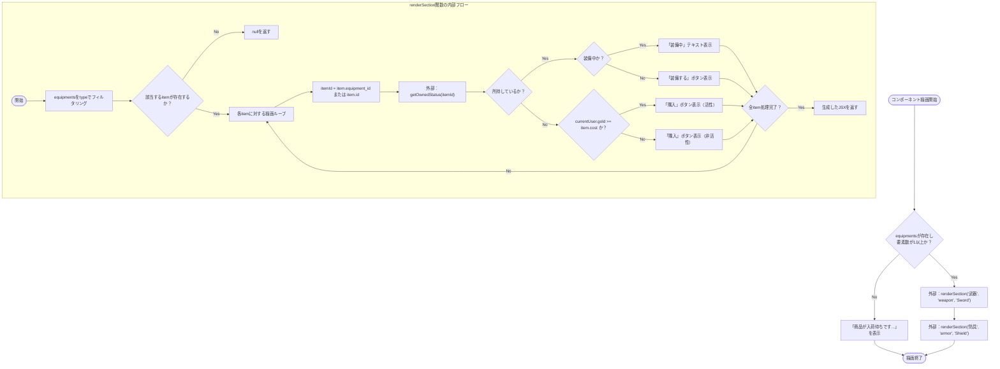
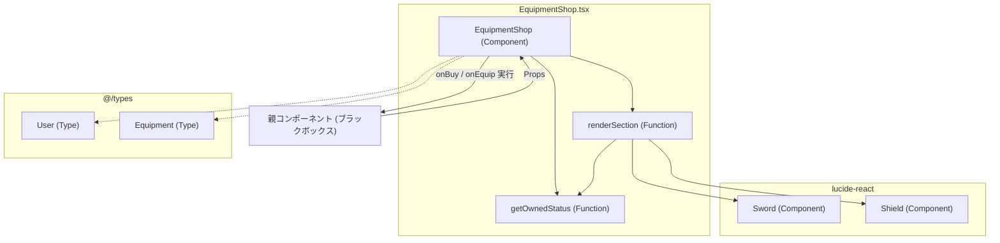

## 1. 解析メタ情報

| 項目 | 内容 |
| --- | --- |
| 対象ファイル | EquipmentShop.tsx |
| 言語 | React (TypeScript) |
| 解析対象 | 提供されたコードのみ |
| 推測・補完 | 一切なし |

## 2. ファイルの概要

装備品のショップ画面を描画するReactコンポーネント。提供された装備品リストを武器・防具のセクションに分けて表示し、ユーザーの所持状況や所持金に応じて「装備中」「装備する」「購入」のアクションを伴うUIを切り替えて表示する責務を持つ。

## 3. 外部依存関係

### インポート一覧

| 名称 | 種類 | 用途 | 根拠 |
| --- | --- | --- | --- |
| `React` | ライブラリ | Reactコンポーネントの構築 | `import React from 'react';` (行番号: 1) |
| `Shield`, `Sword` | コンポーネント | UI上のアイコン表示用 | `import { Shield, Sword } from 'lucide-react';` (行番号: 2) |
| `User`, `Equipment` | 型定義 | Propsの型定義用 | `import { User, Equipment } from '@/types';` (行番号: 3) |

### ブラックボックスとなる外部要素

| 名称 | 理由 | 根拠 |
| --- | --- | --- |
| `@/types`のモジュール詳細 | インポート先の実装が提供されていないため、`User`および`Equipment`の持つ全プロパティ構造が不明。 | `import { User, Equipment } from '@/types';` (行番号: 3) |
| 親コンポーネント | このコンポーネントを呼び出し、Propsを渡している親コンポーネントの実装が存在しないため、渡されるデータの出所やコールバックの実装内容が不明。 | `export default EquipmentShop;` (行番号: 121) |

## 4. 主要要素の定義（関数 / エンドポイント / コンポーネント）

### `EquipmentShop`

* **役割**: 装備品ショップ全体のUIを描画するメインコンポーネント。商品の在庫がない場合の表示、および武器・防具のセクションごとの表示判定を行う。
* 根拠: `const EquipmentShop: React.FC<EquipmentShopProps> = ({...}) => {...}` (行番号: 13-119)

* **引数/リクエスト**: `EquipmentShopProps`型オブジェクト
* `equipments`: `Equipment[]` (全装備品のリスト)
* `ownedEquipments`: `any[]` (ユーザーの所持装備品リスト)
* `currentUser`: `User` (現在のユーザー情報)
* `onBuy`: `(item: Equipment) => void` (購入処理のコールバック)
* `onEquip`: `(item: Equipment) => void` (装備処理のコールバック)
* 根拠: `interface EquipmentShopProps {...}` (行番号: 5-11) および 引数定義 (行番号: 14-20)

* **戻り値/レスポンス**: `React.ReactElement` (JSX要素)
* 根拠: `return (
...
);` (行番号: 110, 113-118)

* **副作用**: なし
* 根拠: 関数内部で外部状態の直接変更や通信処理を行っていない (行番号: 21-119)

* **エラーハンドリング**: なし
* 根拠: `try-catch`等のエラー捕捉処理の記述なし (行番号: 21-119)

### `getOwnedStatus` (内部関数)

* **役割**: 引数で指定された装備品IDについて、現在のユーザーが所持しているかどうかを`ownedEquipments`から検索して返す。
* 根拠: `const getOwnedStatus = (itemId: number) => {...}` (行番号: 22-26)

* **引数/リクエスト**: `itemId: number`
* 根拠: `(itemId: number)` (行番号: 22)

* **戻り値/レスポンス**: 条件に一致する`ownedEquipments`内の要素 (`any`型)、または `undefined`
* 根拠: `return ownedEquipments.find(...)` (行番号: 23-25)

* **副作用**: なし
* 根拠: 配列に対する`find`メソッドの実行のみ (行番号: 23-25)

* **エラーハンドリング**: なし
* 根拠: エラー処理の記述なし (行番号: 22-26)

### `renderSection` (内部関数)

* **役割**: 指定された種別(`type`)に合致する装備品を抽出し、セクションごとのUI（リストアイテム、アイコン、ステータス、アクションボタン）を生成する。該当する装備品がない場合は何も表示しない。
* 根拠: `const renderSection = (title: string, type: string, icon: React.ReactNode) => {...}` (行番号: 28-107)

* **引数/リクエスト**:
* `title`: `string` (セクション名)
* `type`: `string` (装備品の種別)
* `icon`: `React.ReactNode` (セクションタイトル横のアイコン)
* 根拠: `(title: string, type: string, icon: React.ReactNode)` (行番号: 28)

* **戻り値/レスポンス**: `React.ReactElement` (JSX要素)、または `null`
* 根拠: `if (items.length === 0) return null;` (行番号: 30) および `return (
...
);` (行番号: 32-106)

* **副作用**: なし
* 根拠: JSX要素の生成処理のみ (行番号: 29-106)

* **エラーハンドリング**: なし
* 根拠: エラー処理の記述なし (行番号: 28-107)

## 5. 処理フロー図

## 6. 依存関係図

## 7. 次のステップ（リバースエンジニアリングの提案）

| 優先度 | ファイル名(推測可) | 理由 | 根拠 |
| --- | --- | --- | --- |
| 高 | `src/types/index.ts` または `src/types.ts` | `User`および`Equipment`の完全なデータ構造を把握するため。 | `import { User, Equipment } from '@/types';` (行番号: 3) |
| 高 | `EquipmentShop`を呼び出している親コンポーネント (例: `ShopPage.tsx`) | `ownedEquipments`の取得元や、`onBuy`、`onEquip`の実際のロジック（API通信やグローバルステートの更新処理）を把握するため。 | `onBuy`, `onEquip` がProps経由で渡されているため (行番号: 9-10) |

## 8. 保守上の注意点

* **型の安全性**: `ownedEquipments` が `any[]` で定義されており、内部で `oe.equipment_id`, `oe.user_id`, `oe.is_equipped` といったプロパティへのアクセスが発生しているため、実行時エラーのリスクが存在する。
* **フォールバック処理**: `itemId`の取得において `item.equipment_id || item.id` と複数のプロパティを評価している。また、所持金判定において `(currentUser.gold || 0)` と未定義時のフォールバックが行われている。
* **パフォーマンス**: `getOwnedStatus`関数において、`renderSection`内の`map`ループごとに`ownedEquipments.find`を実行しているため、データ量増加時に計算量が多くなる構造になっている。

## 9. 不明事項一覧

| 項目 | 理由 | 必要なファイル |
| --- | --- | --- |
| `Equipment`型の全プロパティ | `item.equipment_id`, `item.id`, `item.type`, `item.cost`, `item.icon`, `item.name`, `item.power`が使われているが、これ以外にプロパティが存在するか不明。 | `@/types`の定義ファイル |
| `User`型の全プロパティ | `currentUser.user_id`, `currentUser.gold`が使われているが、それ以外の構造が不明。 | `@/types`の定義ファイル |
| `ownedEquipments`の型詳細 | `any[]`型のため、オブジェクトの正確な型定義が不明。 | 親コンポーネントまたは対応する型定義ファイル |
| `onBuy` / `onEquip` の実体ロジック | Propsとして注入されているだけであり、呼び出し後のDBへの保存や状態更新処理が不明。 | 親コンポーネント |

## 10. 自己検証結果

* [x] 推測・外部ファイルの仕様を一切含んでいない
* [x] 全関数・全クラス・全コンポーネントを列挙した
* [x] 全てのインポート要素を列挙した
* [x] すべての仕様説明に「根拠（行番号・抜粋）」を明記した
* [x] 根拠漏れが0件である
* [x] Mermaid構文にエラーの原因となる記号（エスケープ漏れ）がない
* [x] 不明事項を漏れなく列挙した

完了