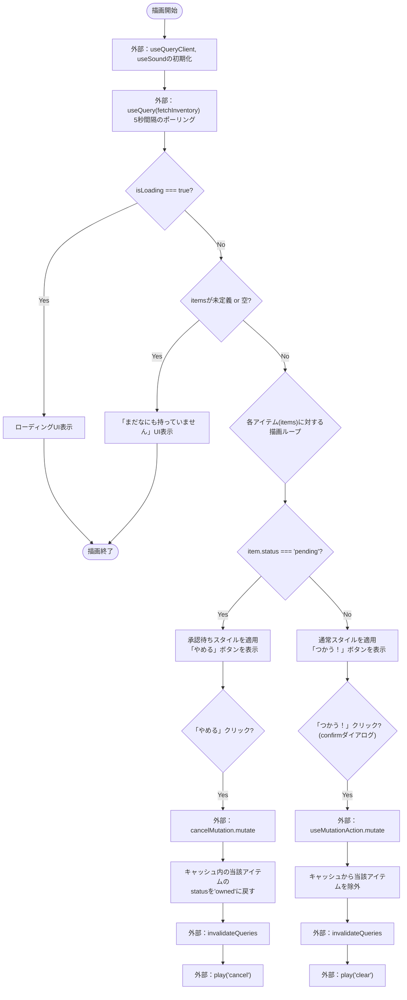
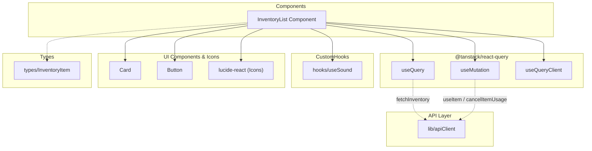

## 1. 解析メタ情報

| 項目 | 内容 |
| --- | --- |
| 対象ファイル | `InventoryList.tsx` |
| 言語 | React (TypeScript) |
| 解析対象 | 提供されたコードのみ |
| 推測・補完 | 一切なし |

## 2. ファイルの概要

* ユーザーの所持アイテム（インベントリ）一覧を取得・表示し、アイテムの「使用」および「キャンセル」を行うUIコンポーネント。
* React Queryを用いてサーバーとの定期的な同期（ポーリング）を行いつつ、アイテム操作時には画面への即時反映（楽観的UI更新）を行う責務を持つ。

## 3. 外部依存関係

### インポート一覧

| 名称 | 種類 | 用途 | 根拠 |
| --- | --- | --- | --- |
| `React` | モジュール | Reactコンポーネントとしての定義と利用 | 根拠: [`React`] (行番号: 1〜1 / 抜粋: "import React from 'react';") |
| `useQuery`, `useMutation`, `useQueryClient` | フック | データ取得、データ更新、キャッシュ操作 | 根拠: [`@tanstack/react-query`] (行番号: 2〜2 / 抜粋: "import { useQuery, useMutation") |
| `apiClient` | オブジェクト | サーバーサイドとのAPI通信 | 根拠: [`apiClient`] (行番号: 3〜3 / 抜粋: "import { apiClient } from '...") |
| `Card` | コンポーネント | アイテムごとのUIカードレイアウト表示 | 根拠: [`Card`] (行番号: 4〜4 / 抜粋: "import { Card } from '...") |
| `Button` | コンポーネント | アイテム使用のトリガーボタン | 根拠: [`Button`] (行番号: 5〜5 / 抜粋: "import { Button } from '...") |
| `useSound` | フック | アクション時の効果音再生 | 根拠: [`useSound`] (行番号: 6〜6 / 抜粋: "import { useSound } from '...") |
| `Loader2`, `PackageOpen`, `Clock`, `AlertCircle` | コンポーネント(アイコン) | UI上の状態・装飾を示すアイコン表示 | 根拠: [`lucide-react`] (行番号: 7〜7 / 抜粋: "import { Loader2, PackageOpen") |
| `InventoryItem` | 型定義 | アイテムデータの型チェックと補完 | 根拠: [`InventoryItem`] (行番号: 8〜8 / 抜粋: "import { InventoryItem } from ") |

### ブラックボックスとなる外部要素

| 名称 | 理由 | 根拠 |
| --- | --- | --- |
| `apiClient`の各メソッド (`fetchInventory`, `useItem`, `cancelItemUsage`) | 具体的なエンドポイント、リクエスト/レスポンス形式、エラーハンドリングの実装が不明（`../../../lib/apiClient`に依存のため要確認）。 | 根拠: [`apiClient`の呼び出し] (行番号: 24〜50 / 抜粋: "queryFn: () => apiClient.") |
| `useSound`の挙動 | 音声再生時のエラー処理や、再生可能な音声キー（'clear', 'cancel'）の定義が不明（`../../../hooks/useSound`に依存のため要確認）。 | 根拠: [`useSound`] (行番号: 18〜61 / 抜粋: "const { play } = useSound();") |
| `InventoryItem`の詳細な型定義 | コンポーネント内で使用されていないプロパティの有無が不明（`../../../types`に依存のため要確認）。 | 根拠: [`InventoryItem`] (行番号: 8〜8 / 抜粋: "import { InventoryItem } from ") |

## 4. 主要要素の定義（関数 / エンドポイント / コンポーネント）

### `InventoryList`

* **役割**: ユーザーのインベントリ一覧を取得し、条件に応じた画面（ローディング、空状態、アイテム一覧）を表示する。また、各アイテムの「使用」と「キャンセル」の操作を受け付け、キャッシュ更新を行う。
* 根拠: [`InventoryList`] (行番号: 16〜166 / 抜粋: "export const InventoryList: React.FC =")

* **引数/リクエスト**: `{ userId: string }`
* 根拠: [`Props`] (行番号: 12〜14 / 抜粋: "type Props = { userId: string; };")

* **戻り値/レスポンス**: `ReactElement`（ローディングUI、空状態UI、またはアイテム一覧のグリッドUI）
* 根拠: [`InventoryList`のreturn文] (行番号: 65〜84 / 抜粋: "return ( 
")

* **エラーハンドリング**:
* APIデータ取得中（`isLoading`）はローディングアイコンを表示。
* データが空（`!items || items.length === 0`）の場合は専用のメッセージUIを表示。
* ただし、`useMutation`や`useQuery`によるAPIエラー（`isError`など）に対する明示的なUI・キャッチ処理はファイル内に記述なし。
* 根拠: [条件付きレンダリング部分] (行番号: 65〜71 / 抜粋: "if (isLoading) return (")

## 5. 処理フロー図

## 6. 依存関係図

## 7. 次のステップ（リバースエンジニアリングの提案）

| 優先度 | ファイル名(推測可) | 理由 | 根拠 |
| --- | --- | --- | --- |
| 高 | `../../../lib/apiClient.ts` | APIの実際のエンドポイント、パラメータ仕様、レスポンス構造、およびAPI側で発生しうるエラーの詳細を把握するため。 | 根拠: [`apiClient`への依存] (行番号: 3 / 抜粋: "import { apiClient }") |
| 中 | `../../../types/index.ts` | `InventoryItem`が持つ全プロパティ（特に`status`が取りうる他の値）を正確に特定し、UI上に反映漏れがないか確認するため。 | 根拠: [`InventoryItem`への依存] (行番号: 8 / 抜粋: "import { InventoryItem }") |
| 低 | `../../../hooks/useSound.ts` | 再生可能な音声キーの全容や、音声ファイルのロード状況による動作への影響を確認するため。 | 根拠: [`useSound`への依存] (行番号: 6 / 抜粋: "import { useSound }") |

## 8. 保守上の注意点

* **エラーハンドリングの欠如**: `useQuery`および`useMutation`実行時にAPI通信エラーが発生した場合、エラーを画面上に表示・通知する処理が記述されていません。
* **楽観的UI更新の巻き戻し処理**: `useMutation`の`onSuccess`でキャッシュの即時書き換えを行っていますが、`onError`時のロールバック処理が記述されていないため、通信失敗時に画面状態とサーバー状態が一時的に乖離する可能性があります（`invalidateQueries`による次回のフェッチで上書きされる仕様と見受けられます）。
* **ポーリング負荷**: `refetchInterval: 5000` が設定されており、5秒ごとに自動フェッチが走るため、ユーザー数が多い場合はサーバー負荷への影響を考慮する必要があります。
* **ネイティブのConfirm利用**: アイテム使用時の確認にブラウザネイティブの `confirm()` を使用しており、スレッドをブロックする挙動となっています。

## 9. 不明事項一覧

| 項目 | 理由 | 必要なファイル |
| --- | --- | --- |
| `item.status`の取りうる全値 | 現在のコードでは`'pending'`と`'owned'`のみ扱われているが、他のステータスが存在するか不明なため。 | `../../../types` |
| API通信エラー時のデフォルトの挙動 | グローバルなエラーハンドラーの有無がこのファイル単独では不明なため。 | `../../../lib/apiClient` または親コンポーネント群 |
| `play('clear')`等の音声の有無 | 指定されたキーに対応する音声が確実に存在するかが不明なため。 | `../../../hooks/useSound` |

## 10. 自己検証結果

* [x] 推測・外部ファイルの仕様を一切含んでいない
* [x] 全関数・全クラス・全コンポーネントを列挙した
* [x] 全てのインポート要素を列挙した
* [x] すべての仕様説明に「根拠（行番号・抜粋）」を明記した
* [x] 根拠漏れが0件である
* [x] Mermaid構文にエラーの原因となる記号（エスケープ漏れ）がない
* [x] 不明事項を漏れなく列挙した