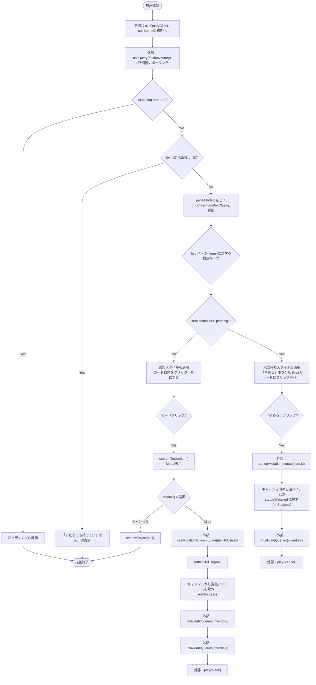
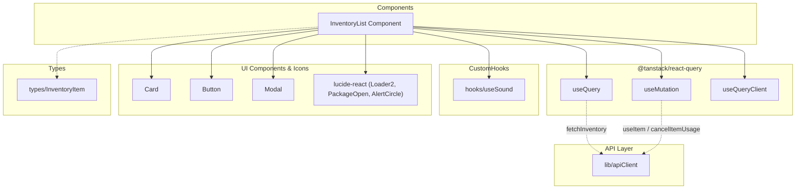

## 1. 解析メタ情報

| 項目 | 内容 |
| --- | --- |
| 対象ファイル | `InventoryList.tsx` |
| 言語 | React (TypeScript) |
| 解析対象 | 提供されたコードのみ |
| 推測・補完 | 一切なし |

## 関連ドキュメント

- [apiClient.md](../../../lib/apiClient.md) — `fetchInventory`/`useItem`/`cancelItemUsage`等、本ファイルが呼び出すAPIクライアントメソッドの実装元。
- [types/index.md](../../../types/index.md) — `InventoryItem`型定義の提供元。
- [Card.md](../../../components/ui/Card.md) — アイテムカードのUIコンポーネント。
- [Button.md](../../../components/ui/Button.md) — 確認モーダル内「キャンセル」「はい」ボタンのUIコンポーネント。
- [Modal.md](../../../components/ui/Modal.md) — 使用確認ダイアログのUIコンポーネント。
- [useSound.md](../../../hooks/useSound.md) — 使用・キャンセル時の効果音再生フックの実装元。
- [RewardShop.md](RewardShop.md) — 呼び出し元候補。`userId`のみを渡す「ごほうび」画面コンテナ。
- [../../family/components/FamilyDashboard.md](../../family/components/FamilyDashboard.md) — 呼び出し元候補。横画面パネルの「もちもの」タブから`userId`と`panelMode`を渡して使用。

## 2. ファイルの概要

* ユーザーの所持アイテム（インベントリ）一覧を取得・表示し、アイテムの「使用」および「キャンセル」を行うUIコンポーネント。
* React Queryを用いてサーバーとの定期的な同期（ポーリング）を行いつつ、アイテム操作時には画面への即時反映（楽観的UI更新）を行う責務を持つ。
* `panelMode`プロパティにより、狭いパネル（横画面の4人並びレイアウト等）に埋め込まれる際にレイアウト（グリッド列数・アイコンサイズ）を切り替える。

## 3. 外部依存関係

### インポート一覧

| 名称 | 種類 | 用途 | 根拠 |
| --- | --- | --- | --- |
| `React`, `useState` | モジュール | Reactコンポーネントとしての定義と利用、確認モーダルの表示対象アイテム保持用の状態管理 | 根拠: [`React`, `useState`] (行番号: 1 / 抜粋: "import React, { useState } from 'react';") |
| `useQuery`, `useMutation`, `useQueryClient` | フック | データ取得、データ更新、キャッシュ操作 | 根拠: [`@tanstack/react-query`] (行番号: 2 / 抜粋: "import { useQuery, useMutation, useQueryClient } from '@tanstack/react-query';") |
| `apiClient` | オブジェクト | サーバーサイドとのAPI通信 | 根拠: [`apiClient`] (行番号: 3 / 抜粋: "import { apiClient } from '../../../lib/apiClient';") |
| `Card` | コンポーネント | アイテムごとのUIカードレイアウト表示 | 根拠: [`Card`] (行番号: 4 / 抜粋: "import { Card } from '../../../components/ui/Card';") |
| `Button` | コンポーネント | 使用確認モーダル内の「キャンセル」「はい」ボタン | 根拠: [`Button`] (行番号: 5 / 抜粋: "import { Button } from '../../../components/ui/Button';") |
| `Modal` | コンポーネント | 「つかう」実行前の確認ダイアログ表示 | 根拠: [`Modal`] (行番号: 6 / 抜粋: "import { Modal } from '../../../components/ui/Modal';") |
| `useSound` | フック | アクション時の効果音再生 | 根拠: [`useSound`] (行番号: 7 / 抜粋: "import { useSound } from '../../../hooks/useSound';") |
| `Loader2`, `PackageOpen`, `AlertCircle` | コンポーネント(アイコン) | UI上の状態・装飾を示すアイコン表示（ローディング/所持中/承認待ち） | 根拠: [`lucide-react`] (行番号: 8 / 抜粋: "import { Loader2, PackageOpen, AlertCircle } from 'lucide-react';") |
| `InventoryItem` | 型定義 | アイテムデータの型チェックと補完 | 根拠: [`InventoryItem`] (行番号: 9 / 抜粋: "import { InventoryItem } from '../../../types';") |

### ブラックボックスとなる外部要素

| 名称 | 理由 | 根拠 |
| --- | --- | --- |
| `apiClient`の各メソッド (`fetchInventory`, `useItem`, `cancelItemUsage`) | 具体的なエンドポイント、リクエスト/レスポンス形式、エラーハンドリングの実装が不明（`../../../lib/apiClient`に依存のため要確認）。 | 根拠: [`apiClient`の呼び出し] (行番号: 33, 38, 64 / 抜粋: "queryFn: () => apiClient.fetchInventory(userId),") |
| `Card`, `Button`, `Modal`の内部実装 | `../../../components/ui/`配下の実装が提供されていないため、propsの全容やレンダリング内容が不明。 | 根拠: [`Card`, `Button`, `Modal`] (行番号: 4〜6) |
| `useSound`の挙動 | 音声再生時のエラー処理や、再生可能な音声キー（'clear', 'cancel'）の定義が不明（`../../../hooks/useSound`に依存のため要確認）。 | 根拠: [`useSound`] (行番号: 24 / 抜粋: "const { play } = useSound();") |
| `InventoryItem`の詳細な型定義 | コンポーネント内で使用されていないプロパティの有無が不明（`../../../types`に依存のため要確認）。 | 根拠: [`InventoryItem`] (行番号: 9 / 抜粋: "import { InventoryItem } from '../../../types';") |

## 4. 主要要素の定義（関数 / エンドポイント / コンポーネント）

### `InventoryList`

* **役割**: ユーザーのインベントリ一覧を取得し、条件に応じた画面（ローディング、空状態、アイテム一覧）を表示する。各アイテムカード（所持中）はクリックすると使用確認`Modal`を開き、「はい」で使用（`useMutationAction`）を実行する。承認待ち（`pending`）のアイテムには「やめる」ボタンでキャンセル（`cancelMutation`）を実行できる。`panelMode`が真の場合はグリッドを1カラムに固定し、アイコンサイズを縮小する。
* 根拠: [`InventoryList`] (行番号: 22〜180 / 抜粋: "export const InventoryList: React.FC<Props> = ({ userId, panelMode }) => {")

* **引数/リクエスト**: `Props`（`{ userId: string; panelMode?: boolean }`）
* 根拠: [`Props`] (行番号: 13〜20 / 抜粋: "type Props = {\n    userId: string;\n    // PC横画面の4人並びパネルなど、実際の表示幅が狭い枠内に埋め込む場合に指定する。\n    // 通常の sm:grid-cols-2 はブラウザの「ビューポート幅」基準のため、狭いパネルに\n    // 埋め込まれていても(ビューポート自体は広いPC画面なので)2カラム化してしまい、\n    // アイコン・ボタンが見切れる原因になっていた。panelMode時は常に1カラムにする。\n    panelMode?: boolean;\n};")

* **戻り値/レスポンス**: `ReactElement`（ローディングUI、空状態UI、またはアイテム一覧のグリッドUIと使用確認`Modal`）
* 根拠: [`InventoryList`のreturn文] (行番号: 79〜83, 85〜96, 105〜178 / 抜粋: "return (\n        
")

* **副作用**:
  * `apiClient`を利用した外部API呼び出し（取得・使用・キャンセル）
  * `queryClient.setQueryData`によるローカルキャッシュの直接更新（使用済みアイテムの除外、キャンセル時のステータス書き戻し）
  * `queryClient.invalidateQueries`による`['inventory', userId]`および`['chronicle']`キャッシュの無効化と再フェッチのトリガー
  * `play`関数による音声（`'clear'`, `'cancel'`）の再生
  * `setItemToUse`によるローカルstate更新（使用確認モーダルの開閉制御）
* 根拠: [`useMutationAction`, `cancelMutation`, `itemToUse`] (行番号: 37〜77 / 抜粋: "queryClient.setQueryData<InventoryItem[]>(queryKey, (oldItems) => {")
* 根拠: `chronicle`無効化のバグ修正コメント (行番号: 53〜56 / 抜粋: "// ★バグ修正: アイテム使用はバックエンド側で quest_history に記録され\n            // 冒険の記録に載る仕組みだったが、chronicleクエリを無効化していなかったため\n            // staleTime(5分)が切れるまで反映されなかった。\n            queryClient.invalidateQueries({ queryKey: ['chronicle'] });")

* **エラーハンドリング**:
  * APIデータ取得中（`isLoading`）はローディングアイコンを表示。
  * データが空（`!items || items.length === 0`）の場合は専用のメッセージUIを表示。
  * ただし、`useMutation`や`useQuery`によるAPIエラー（`isError`など）に対する明示的なUI・キャッチ処理はファイル内に記述なし。
* 根拠: [条件付きレンダリング部分] (行番号: 79〜96 / 抜粋: "if (isLoading) return (")

## 5. 処理フロー図

```mermaid
flowchart TD
    Start([描画開始]) --> Init["外部：useQueryClient, useSoundの初期化"]
    Init --> Query["外部：useQuery(fetchInventory) \n5秒間隔のポーリング"]
    Query --> CheckLoading{"isLoading === true?"}

    CheckLoading -- Yes --> RenderLoading["ローディングUI表示"] --> End([描画終了])
    CheckLoading -- No --> CheckEmpty{"itemsが未定義 or 空?"}

    CheckEmpty -- Yes --> RenderEmpty["「まだなにも持っていません」UI表示"] --> End
    CheckEmpty -- No --> CalcLayout["panelModeに応じてgridClass/iconBoxClassを算出"]
    CalcLayout --> MapItems{"各アイテム(items)に対する描画ループ"}

    MapItems --> CheckStatus{"item.status === 'pending'?"}

    CheckStatus -- Yes --> RenderPending["承認待ちスタイルを適用\n「やめる」ボタンを表示(カードはクリック不可)"]
    CheckStatus -- No --> RenderOwned["通常スタイルを適用\nカード自体をクリック可能にする"]

    RenderPending --> CancelClick{"「やめる」クリック?"}
    RenderOwned --> CardClick{"カードクリック?"}

    CardClick -- Yes --> SetItemToUse["setItemToUse(item)\nModal表示"]
    SetItemToUse --> ModalChoice{"Modal内で選択"}
    ModalChoice -- "キャンセル" --> CloseModal["setItemToUse(null)"] --> End
    ModalChoice -- "はい" --> MutateUse["外部：useMutationAction.mutate(itemToUse.id)"]
    MutateUse --> CloseModal2["setItemToUse(null)"]
    CloseModal2 --> OptimisticUse["キャッシュから当該アイテムを除外\n(onSuccess)"]
    OptimisticUse --> InvalidateUse["外部：invalidateQueries(inventory)"]
    InvalidateUse --> InvalidateChronicle["外部：invalidateQueries(chronicle)"]
    InvalidateChronicle --> PlayClear["外部：play('clear')"]

    CancelClick -- Yes --> MutateCancel["外部：cancelMutation.mutate(item.id)"]
    MutateCancel --> OptimisticCancel["キャッシュ内の当該アイテムの\nstatusを'owned'に戻す\n(onSuccess)"]
    OptimisticCancel --> InvalidateCancel["外部：invalidateQueries(inventory)"]
    InvalidateCancel --> PlayCancel["外部：play('cancel')"]

```

## 6. 依存関係図

```mermaid
graph TD
    subgraph Components
        InventoryList["InventoryList Component"]
    end

    subgraph ReactQuery ["@tanstack/react-query"]
        useQuery["useQuery"]
        useMutation["useMutation"]
        useQueryClient["useQueryClient"]
    end

    subgraph CustomHooks
        useSoundHook["hooks/useSound"]
    end

    subgraph UI ["UI Components & Icons"]
        Card["Card"]
        Button["Button"]
        Modal["Modal"]
        Lucide["lucide-react (Loader2, PackageOpen, AlertCircle)"]
    end

    subgraph ExternalAPI ["API Layer"]
        apiClient["lib/apiClient"]
    end

    subgraph Types
        InventoryItem["types/InventoryItem"]
    end

    InventoryList --> useQuery
    InventoryList --> useMutation
    InventoryList --> useQueryClient
    InventoryList --> useSoundHook
    InventoryList --> Card
    InventoryList --> Button
    InventoryList --> Modal
    InventoryList --> Lucide
    InventoryList -.-> InventoryItem

    useQuery -.->|fetchInventory| apiClient
    useMutation -.->|useItem / cancelItemUsage| apiClient

```

## 7. 次のステップ（リバースエンジニアリングの提案）

| 優先度 | ファイル名(推測可) | 理由 | 根拠 |
| --- | --- | --- | --- |
| 高 | `../../../lib/apiClient.ts` | APIの実際のエンドポイント、パラメータ仕様、レスポンス構造、およびAPI側で発生しうるエラーの詳細を把握するため。 | 根拠: [`apiClient`への依存] (行番号: 3 / 抜粋: "import { apiClient }") |
| 中 | `../../../types/index.ts` | `InventoryItem`が持つ全プロパティ（特に`status`が取りうる他の値）を正確に特定し、UI上に反映漏れがないか確認するため。 | 根拠: [`InventoryItem`への依存] (行番号: 9 / 抜粋: "import { InventoryItem }") |
| 中 | `../../../components/ui/Modal.tsx` | `isOpen`/`onClose`/`footer`以外に受け付けるprops、およびアクセシビリティ対応（フォーカストラップ等）の実装状況を確認するため。 | 根拠: [`Modal`への依存] (行番号: 6 / 抜粋: "import { Modal }") |
| 低 | `../../../hooks/useSound.ts` | 再生可能な音声キーの全容や、音声ファイルのロード状況による動作への影響を確認するため。 | 根拠: [`useSound`への依存] (行番号: 7 / 抜粋: "import { useSound }") |

## 8. 保守上の注意点

* **エラーハンドリングの欠如**: `useQuery`および`useMutation`実行時にAPI通信エラーが発生した場合、エラーを画面上に表示・通知する処理が記述されていません。
* **楽観的UI更新の巻き戻し処理**: `useMutation`の`onSuccess`でキャッシュの即時書き換えを行っていますが、`onError`時のロールバック処理が記述されていないため、通信失敗時に画面状態とサーバー状態が一時的に乖離する可能性があります（`invalidateQueries`による次回のフェッチで上書きされる仕様と見受けられます）。
* **ポーリング負荷**: `refetchInterval: 5000` が設定されており、5秒ごとに自動フェッチが走るため、ユーザー数が多い場合はサーバー負荷への影響を考慮する必要があります。
* **確認ダイアログの状態管理**: アイテム使用時の確認はブラウザネイティブの`confirm()`ではなく、`itemToUse`ステートとアプリ標準の`Modal`コンポーネントで実装されている。`useMutationAction.mutate`呼び出しと`setItemToUse(null)`が同一の`onClick`内で連続実行されるため、ミューテーションの成否に関わらずモーダルは即座に閉じる（成否のフィードバックは`onSuccess`側の楽観的更新にのみ依存する）。
* **「つかう」操作のトリガーがボタンからカードクリックへ変更**: 以前は個別の「つかう！」ボタンがあったが、コンパクトな1行表示にするため、`isOwned`なカード自体のクリックで使用確認モーダルを開く方式に変更された。承認待ち（`isPending`）のカードには`onClick`が設定されておらず、クリックしても反応しない。
* 根拠: (行番号: 114〜116, 108〜109, 116 / 抜粋: "{/* ★バグ修正: 「つかう」ボタンを廃止し、カード自体をタップしたら\n                        // つかう確認モーダルを開くようにする(1行のコンパクト表示にするため) */}", "onClick={isOwned ? () => setItemToUse(item) : undefined}")
* **`panelMode`によるレイアウト切り替え**: 狭いパネル内では`sm:grid-cols-2`がビューポート幅基準で誤って2カラム化してしまう問題への対応として、`panelMode`時は`grid-cols-1`に固定し、アイコンサイズも縮小する。
* 根拠: (行番号: 98〜103 / 抜粋: "const gridClass = panelMode ? 'grid-cols-1' : 'grid-cols-1 sm:grid-cols-2';\n    const iconBoxClass = panelMode ? 'text-xl w-9 h-9' : 'text-2xl w-11 h-11';")
* **アイテム使用時の冒険の記録への即時反映（バグ修正済み）**: アイテム使用はバックエンド側で`quest_history`に記録され冒険の記録（`chronicle`）に載る仕組みだが、以前は`chronicle`クエリを無効化していなかったため`staleTime`（5分）が切れるまで反映されなかった。現在は使用成功時に`['chronicle']`も明示的に`invalidateQueries`する。
* 根拠: (行番号: 53〜56)

## 9. 不明事項一覧

| 項目 | 理由 | 必要なファイル |
| --- | --- | --- |
| `item.status`の取りうる全値 | 現在のコードでは`'pending'`と`'owned'`のみ扱われているが、他のステータスが存在するか不明なため。 | `../../../types` |
| API通信エラー時のデフォルトの挙動 | グローバルなエラーハンドラーの有無がこのファイル単独では不明なため。 | `../../../lib/apiClient` または親コンポーネント群 |
| `play('clear')`等の音声の有無 | 指定されたキーに対応する音声が確実に存在するかが不明なため。 | `../../../hooks/useSound` |
| `Modal`コンポーネントの内部実装 | `isOpen`/`onClose`/`title`/`footer`のprops以外にどのような機能（フォーカストラップ、アニメーション等）を持つか不明なため。 | `../../../components/ui/Modal` |
| `panelMode`の呼び出し元の使用実態 | 本ファイル単体では、どの画面（親コンポーネント）が`panelMode`を`true`で渡しているかが完全には特定できないため。 | 本コンポーネントを呼び出す親ファイル群 |

## 相互参照による補足情報

| 元の不明事項 | 判明した内容 | 参照元ドキュメント |
| --- | --- | --- |
| API通信エラー時のデフォルトの挙動 | `apiClient.md`の解析によれば、`_request`メソッドは`!response.ok`の際にレスポンスのJSON（`detail`フィールド優先）または汎用メッセージから`Error`を生成してスローし、`catch`節で`console.error`によるログ出力を行った上で再スローするのみで、`apiClient.ts`内にグローバルなエラー通知の仕組みは実装されていないとされている。 | `../../../lib/apiClient.md` |
| `play('clear')`等の音声の有無 | `useSound.md`の解析によれば、`play`は`SOUNDS`定義のキーに対応する`HTMLAudioElement`をキャッシュしつつ再生し、再生失敗時は`console.warn`のみで例外は投げないとされている。ただし`SOUNDS`に`'clear'`/`'cancel'`キーが実際に含まれるかは`useSound.md`側でも全キーの列挙が行われておらず断定できない。 | `../../../hooks/useSound.md` |
| `Modal`コンポーネントの内部実装 | `Modal.md`の解析によれば、`Modal`は`isOpen`/`onClose`/`title`/`children`/`footer`/`maxWidth`をpropsとして受け取り、`isOpen`が真の間はESCキー押下時に`onClose`を呼ぶ`keydown`リスナーを登録・解除するとされている。 | `../../../components/ui/Modal.md` |
| `panelMode`の呼び出し元の使用実態 | `FamilyDashboard.tsx`を本セッションで直接解析した結果、`FamilyDashboard`内の`FamilyPanel`が「もちもの」タブ選択時に`<InventoryList userId={user.user_id} panelMode />`という形で`panelMode`を明示的に付与して呼び出していることを確認した。これは`FamilyDashboard.tsx`の直接解析結果であり確定情報である。 | ../../family/components/FamilyDashboard.md（本セッションで同時解析） |

## 10. 自己検証結果

* [x] 完了: 推測・外部ファイルの仕様を一切含んでいない
* [x] 完了: 全関数・全クラス・全コンポーネントを列挙した
* [x] 完了: 全てのインポート要素を列挙した
* [x] 完了: すべての仕様説明に「根拠（行番号・抜粋）」を明記した
* [x] 完了: 根拠漏れが0件である
* [x] 完了: Mermaid構文にエラーの原因となる記号（エスケープ漏れ）がない
* [x] 完了: 不明事項を漏れなく列挙した
