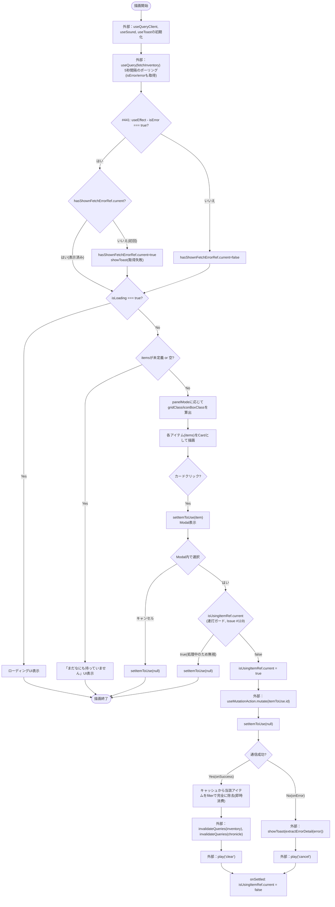
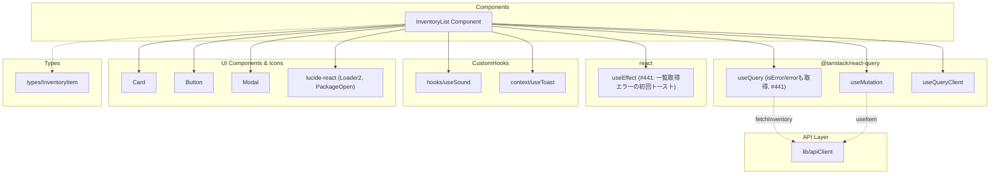

## 1. 解析メタ情報

| 項目 | 内容 |
| --- | --- |
| 対象ファイル | `InventoryList.tsx` |
| 言語 | React (TypeScript) |
| 解析対象 | 提供されたコードのみ |
| 推測・補完 | 一切なし |
| 解析基準コミット | `6007292` |

## 関連ドキュメント

- [apiClient.md](../../../lib/apiClient.md) — `fetchInventory`/`useItem`等、本ファイルが呼び出すAPIクライアントメソッドの実装元。
- [types/index.md](../../../types/index.md) — `InventoryItem`型定義の提供元。
- [Card.md](../../../components/ui/Card.md) — アイテムカードのUIコンポーネント。
- [Button.md](../../../components/ui/Button.md) — 確認モーダル内「キャンセル」「はい」ボタンのUIコンポーネント。
- [Modal.md](../../../components/ui/Modal.md) — 使用確認ダイアログのUIコンポーネント。
- [useSound.md](../../../hooks/useSound.md) — 使用成功・失敗時の効果音再生フックの実装元。
- [../../../context/useToast.md](../../../context/useToast.md) — 使用失敗時のエラートースト表示フックの実装元。
- [RewardShop.md](RewardShop.md) — 呼び出し元候補。`userId`のみを渡す「ごほうび」画面コンテナ。
- [../../family/components/FamilyDashboard.md](../../family/components/FamilyDashboard.md) — 呼び出し元候補。横画面パネルの「もちもの」タブから`userId`と`panelMode`を渡して使用。

## 2. ファイルの概要

* ユーザーの所持アイテム（インベントリ）一覧を取得・表示し、アイテムを即座に使用するUIコンポーネント。アイテムカードをクリックすると使用確認`Modal`を開き、「はい」を選ぶと`useMutationAction`が`apiClient.useItem`（`POST /api/quest/inventory/use`）を呼び出す。親（大人ユーザー）による承認を待つ状態は存在せず、成功と同時にそのアイテムを一覧から即座に取り除く。「はい」の連打（ダブルタップ）による同一アイテムへの多重使用リクエストは`isUsingItemRef`（`useRef`）で同期的に防ぐ（Issue #119）。
* 根拠: (行番号: 50〜51, 55〜59, 130〜156 / 抜粋: "const useMutationAction = useMutation({\n        mutationFn: (inventoryId: number) => apiClient.useItem(userId, inventoryId),", "// アイテム使用は即座に消費が確定する(親の承認は不要)ため、\n            // リストからも即座に取り除く。\n            const usedInventoryId = variables;\n            queryClient.setQueryData<InventoryItem[]>(queryKey, (oldItems) => {\n                if (!oldItems) return [];\n                return oldItems.filter(item => item.id !== usedInventoryId);\n            });", "<Modal\n                isOpen={!!itemToUse}")
* React Queryを用いてサーバーとの定期的な同期（5秒間隔のポーリング）を行いつつ、使用成功時には画面への即時反映（`setQueryData`によるフィルタ除去。楽観的UI更新）を行う責務を持つ。
* 根拠: (行番号: 44〜48 / 抜粋: "const { data: items, isLoading } = useQuery({\n        queryKey: queryKey,\n        queryFn: () => apiClient.fetchInventory(userId),\n        refetchInterval: 5000\n    });")
* `panelMode`プロパティにより、狭いパネル（横画面の4人並びレイアウト等）に埋め込まれる際にレイアウト（グリッド列数・アイコンサイズ）を切り替える。
* 根拠: (行番号: 22〜26, 101〜102 / 抜粋: "// PC横画面の4人並びパネルなど、実際の表示幅が狭い枠内に埋め込む場合に指定する。", "const gridClass = panelMode ? 'grid-cols-1' : 'grid-cols-1 sm:grid-cols-2';\n    const iconBoxClass = panelMode ? 'text-xl w-9 h-9' : 'text-2xl w-11 h-11';")
* **バグ修正(M-6-3)**: 以前は使用ミューテーション（`useMutationAction`）に`onError`が無く、通信エラー等が発生してもユーザーに一切通知されないサイレント失敗になっていた。`useToast`によるエラートースト表示を追加し、`apiClient`がスローする`Error.message`（バックエンドの`{"detail": "..."}`）を`extractErrorDetail`で取り出して表示するようにした。
* 根拠: (行番号: 12〜16, 67〜72 / 抜粋: "// M-6-3: apiClient側でスローされるErrorのmessageには、バックエンドが返す\n// {\"detail\": \"...\"} の内容が入っている(apiClient.ts参照)。\nconst extractErrorDetail = (error: unknown): string => {", "// M-6-3: 以前はonErrorが無く、使用申請の失敗(通信エラー等)が\n        // ユーザーに一切通知されないサイレント失敗になっていた。\n        onError: (error) => {")
* **バグ修正(Issue #119)**: 使用確認`Modal`の「はい」ボタンは、押下と同時に`setItemToUse(null)`でモーダルを閉じる実装のため、連打（ダブルタップ）で1回目のクリックが画面に反映される前に2回目のクリックイベントが発火し、同一アイテムに対し`useMutationAction.mutate`が二重に呼ばれることがあった。2回目のリクエストはサーバー側で`status != 'owned'`（既に1回目で`'consumed'`に更新済み）により`400`（`"Cannot use this item"`）となり、実際は1回目が成功しているにもかかわらずエラートーストが表示されてしまっていた。`isUsingItemRef`（`useRef`）による同期的なガードを追加し、2回目以降のクリックは`useMutationAction.mutate`を呼ばずに無視するようにした（`onSettled`でリクエスト完了時に解除）。
* 根拠: (行番号: 41, 73〜75, 140〜147 / 抜粋: "const isUsingItemRef = useRef(false);", "onSettled: () => {\n            isUsingItemRef.current = false;\n        }", "if (itemToUse && !isUsingItemRef.current) {\n                                    isUsingItemRef.current = true;\n                                    useMutationAction.mutate(itemToUse.id);\n                                }")
* **バグ修正(Issue #441)**: 使用ミューテーション（`useMutationAction`）には既にエラー通知（M-6-3）が実装済みだったが、一覧取得自体の`useQuery`にはエラーハンドリングが一切無く、取得失敗時は画面上に何も表示されないサイレント失敗のままだった（「アイテムが無い」のか「読み込みに失敗した」のか区別できない）。`useQuery`から`isError`/`error`も分割代入で取得し、`isError`が`true`になった時点を検知する`useEffect`を追加、`hasShownFetchErrorRef`（`useRef`）でエラー状態に入った最初の1回だけ`showToast`を呼ぶようにした（5秒間隔のポーリングでバックエンドが落ちたままの間、失敗のたびにトーストが連投されるのを防ぐ。`isError`が`false`に戻ればrefをリセットし、次にエラーになった際は再度1回だけ表示する）。
* 根拠: (行番号: 40, 46〜61 / 抜粋: "const { data: items, isLoading, isError, error } = useQuery({", "const hasShownFetchErrorRef = useRef(false);\n    useEffect(() => {\n        if (isError) {\n            if (!hasShownFetchErrorRef.current) {\n                hasShownFetchErrorRef.current = true;\n                showToast({ title: \"エラー\", text: extractErrorDetail(error, 'アイテム一覧の取得に失敗しました'), icon: \"⚠️\" });\n            }\n        } else {\n            hasShownFetchErrorRef.current = false;\n        }\n    }, [isError, error, showToast]);")

## 3. 外部依存関係

### インポート一覧

| 名称 | 種類 | 用途 | 根拠 |
| --- | --- | --- | --- |
| `React`, `useEffect`, `useRef`, `useState` | モジュール | Reactコンポーネントとしての定義と利用、確認モーダルの表示対象アイテム保持用の状態管理、多重使用リクエスト防止ガード（`isUsingItemRef`）用の参照保持。**（#441で`useEffect`が追加）** 一覧取得(`useQuery`)がエラー状態になったことを検知して初回の1回だけトーストを表示する副作用処理、および「エラー状態が続いている間」を判定する`hasShownFetchErrorRef`用の参照保持 | 根拠: [`React`, `useEffect`, `useRef`, `useState`] (行番号: 1 / 抜粋: "import React, { useEffect, useRef, useState } from 'react';") |
| `useQuery`, `useMutation`, `useQueryClient` | フック | データ取得、データ更新、キャッシュ操作 | 根拠: [`@tanstack/react-query`] (行番号: 2 / 抜粋: "import { useQuery, useMutation, useQueryClient } from '@tanstack/react-query';") |
| `apiClient` | オブジェクト | サーバーサイドとのAPI通信 | 根拠: [`apiClient`] (行番号: 3 / 抜粋: "import { apiClient } from '../../../lib/apiClient';") |
| `Card` | コンポーネント | アイテムごとのUIカードレイアウト表示 | 根拠: [`Card`] (行番号: 4 / 抜粋: "import { Card } from '../../../components/ui/Card';") |
| `Button` | コンポーネント | 使用確認モーダル内の「キャンセル」「はい」ボタン | 根拠: [`Button`] (行番号: 5 / 抜粋: "import { Button } from '../../../components/ui/Button';") |
| `Modal` | コンポーネント | 「つかう」実行前の確認ダイアログ表示 | 根拠: [`Modal`] (行番号: 6 / 抜粋: "import { Modal } from '../../../components/ui/Modal';") |
| `useSound` | フック | アクション時の効果音再生 | 根拠: [`useSound`] (行番号: 7 / 抜粋: "import { useSound } from '../../../hooks/useSound';") |
| `useToast` | フック | 使用失敗時のエラートースト表示 | 根拠: [`useToast`] (行番号: 8 / 抜粋: "import { useToast } from '../../../context/useToast';") |
| `Loader2`, `PackageOpen` | コンポーネント(アイコン) | UI上の状態表示アイコン（ローディング中/所持アイテム） | 根拠: [`lucide-react`] (行番号: 9 / 抜粋: "import { Loader2, PackageOpen } from 'lucide-react';") |
| `InventoryItem` | 型定義 | アイテムデータの型チェックと補完 | 根拠: [`InventoryItem`] (行番号: 10 / 抜粋: "import { InventoryItem } from '../../../types';") |

### ブラックボックスとなる外部要素

| 名称 | 理由 | 根拠 |
| --- | --- | --- |
| `apiClient`の各メソッド (`fetchInventory`, `useItem`) | 具体的なエンドポイント、リクエスト/レスポンス形式、エラーハンドリングの実装が不明（`../../../lib/apiClient`に依存のため要確認）。 | 根拠: [`apiClient`の呼び出し] (行番号: 46, 51 / 抜粋: "queryFn: () => apiClient.fetchInventory(userId),", "mutationFn: (inventoryId: number) => apiClient.useItem(userId, inventoryId),") |
| `Card`, `Button`, `Modal`の内部実装 | `../../../components/ui/`配下の実装が提供されていないため、propsの全容やレンダリング内容が不明。 | 根拠: [`Card`, `Button`, `Modal`] (行番号: 4〜6) |
| `useSound`の挙動 | 音声再生時のエラー処理や、再生可能な音声キー（`'clear'`, `'cancel'`）の定義が不明（`../../../hooks/useSound`に依存のため要確認）。 | 根拠: [`useSound`] (行番号: 31 / 抜粋: "const { play } = useSound();") |
| `useToast`/`showToast`の内部実装 | トーストの表示時間・スタック方法・スタイルなど、`../../../context/useToast`（および`ToastContext`）に依存する具体的な描画内容が不明。 | 根拠: [`useToast`] (行番号: 8, 32 / 抜粋: "import { useToast } from '../../../context/useToast';", "const { showToast } = useToast();") |
| `InventoryItem`の詳細な型定義 | コンポーネント内で使用されていないプロパティの有無が不明（`../../../types`に依存のため要確認）。 | 根拠: [`InventoryItem`] (行番号: 10 / 抜粋: "import { InventoryItem } from '../../../types';") |

## 4. 主要要素の定義（関数 / エンドポイント / コンポーネント）

### `extractErrorDetail` (`../../../lib/errorDetail`からのインポート、Issue #412 品質で移動)

* **役割**: `apiClient`側でスローされた`Error`から、バックエンドが返す`{"detail": "..."}`のメッセージ内容（`Error.message`）を取り出す。`error`が`Error`インスタンスかつ`message`が真値の場合のみそれを使い、それ以外は固定文言`'操作に失敗しました'`にフォールバックする。使用ミューテーションの`onError`から呼ばれ、トースト表示用のテキストとして使われる。
* 根拠: (行番号: 12〜16 / 抜粋: "// M-6-3: apiClient側でスローされるErrorのmessageには、バックエンドが返す\n// {\"detail\": \"...\"} の内容が入っている(apiClient.ts参照)。\nconst extractErrorDetail = (error: unknown): string => {\n    return error instanceof Error && error.message ? error.message : '操作に失敗しました';\n};")

* **引数/リクエスト**: `error: unknown`
* **戻り値/レスポンス**: `string`
* **副作用**: なし
* **エラーハンドリング**: なし（自身がエラー内容を安全な文字列に変換するためのヘルパー）

### `InventoryList`

* **役割**: ユーザーのインベントリ一覧を取得し、条件に応じた画面（ローディング、空状態、アイテム一覧）を表示する。各アイテムカードはクリックすると使用確認`Modal`を開き、「はい」で使用（`useMutationAction`）を実行する。使用は即座に確定するため、承認待ちを示すカードの見た目や「やめる」ボタンなどの取消機能は存在しない。`panelMode`が真の場合はグリッドを1カラムに固定し、アイコンサイズを縮小する。「はい」の連打による多重使用リクエストは`isUsingItemRef`で防ぐ（Issue #119）。
* 根拠: [`InventoryList`] (行番号: 29〜160 / 抜粋: "export const InventoryList: React.FC<Props> = ({ userId, panelMode }) => {")

* **引数/リクエスト**: `Props`（`{ userId: string; panelMode?: boolean }`）
* 根拠: [`Props`] (行番号: 20〜27 / 抜粋: "type Props = {\n    userId: string;\n    // PC横画面の4人並びパネルなど、実際の表示幅が狭い枠内に埋め込む場合に指定する。\n    // 通常の sm:grid-cols-2 はブラウザの「ビューポート幅」基準のため、狭いパネルに\n    // 埋め込まれていても(ビューポート自体は広いPC画面なので)2カラム化してしまい、\n    // アイコン・ボタンが見切れる原因になっていた。panelMode時は常に1カラムにする。\n    panelMode?: boolean;\n};")

* **戻り値/レスポンス**: `ReactElement`（ローディングUI、空状態UI、またはアイテム一覧のグリッドUIと使用確認`Modal`）
* 根拠: [`InventoryList`のreturn文] (行番号: 78〜82, 84〜95, 104〜159 / 抜粋: "return (\n        
")

* **副作用**:
  * `apiClient`を利用した外部API呼び出し（一覧取得・使用）。
  * **（Issue #441で追加）** 一覧取得の`useQuery`が返す`isError`を監視する`useEffect`。`isError`が`true`になった最初の1回だけ`hasShownFetchErrorRef.current`を`true`にセットして`showToast`を呼び、`isError`が`false`に戻れば`hasShownFetchErrorRef.current`を`false`にリセットする（5秒間隔のポーリングで失敗が継続する間、トーストが連投されるのを防ぐ）。
  * `queryClient.setQueryData`によるローカルキャッシュの直接更新（使用成功時、対象アイテムを`filter`でキャッシュから完全に除去する。承認待ち等の中間状態への更新は行わない）。
  * `queryClient.invalidateQueries`による`['inventory', userId]`と`['chronicle']`キャッシュの無効化（使用成功時のみ）。
  * `play`関数による音声再生。使用成功時は`'clear'`、使用失敗時は`'cancel'`。
  * `showToast`によるエラートースト表示（使用失敗時、`title: "エラー"`, `text: extractErrorDetail(error, '操作に失敗しました')`, `icon: "⚠️"`）。**バグ修正(M-6-3)**: 以前は`onError`が無く、失敗がユーザーに一切通知されないサイレント失敗になっていた。
  * `setItemToUse`によるローカルstate更新（使用確認モーダルの開閉制御）。
  * `isUsingItemRef.current`の設定・解除（`onSettled`で必ず解除。**バグ修正(Issue #119)**、連打による多重使用リクエストを防ぐ）。
* 根拠: [`useMutationAction`, `itemToUse`] (行番号: 63〜89 / 抜粋: "const useMutationAction = useMutation({\n        mutationFn: (inventoryId: number) => apiClient.useItem(userId, inventoryId),")
* 根拠: **（Issue #441）** 一覧取得エラーの初回トースト (行番号: 51〜61 / 抜粋: "const hasShownFetchErrorRef = useRef(false);\n    useEffect(() => {\n        if (isError) {\n            if (!hasShownFetchErrorRef.current) {\n                hasShownFetchErrorRef.current = true;\n                showToast({ title: \"エラー\", text: extractErrorDetail(error, 'アイテム一覧の取得に失敗しました'), icon: \"⚠️\" });\n            }\n        } else {\n            hasShownFetchErrorRef.current = false;\n        }\n    }, [isError, error, showToast]);")
* 根拠: 使用成功時のキャッシュ更新・無効化・再生音 (行番号: 65〜78 / 抜粋: "// アイテム使用は即座に消費が確定する(親の承認は不要)ため、\n            // リストからも即座に取り除く。\n            const usedInventoryId = variables;\n            queryClient.setQueryData<InventoryItem[]>(queryKey, (oldItems) => {\n                if (!oldItems) return [];\n                return oldItems.filter(item => item.id !== usedInventoryId);\n            });\n\n            // 念のためサーバーとも同期\n            queryClient.invalidateQueries({ queryKey: queryKey });\n            queryClient.invalidateQueries({ queryKey: ['chronicle'] });\n\n            play('clear');")
* 根拠: 使用失敗時のonError (行番号: 80〜85 / 抜粋: "// M-6-3: 以前はonErrorが無く、使用申請の失敗(通信エラー等)が\n        // ユーザーに一切通知されないサイレント失敗になっていた。\n        onError: (error) => {\n            showToast({ title: \"エラー\", text: extractErrorDetail(error, '操作に失敗しました'), icon: \"⚠️\" });\n            play('cancel');\n        }")
* 根拠: `isUsingItemRef`の解除(`onSettled`) (行番号: 86〜88 / 抜粋: "onSettled: () => {\n            isUsingItemRef.current = false;\n        }")

* **エラーハンドリング**:
  * APIデータ取得中（`isLoading`）はローディングアイコンを表示。
  * データが空（`!items || items.length === 0`）の場合は専用のメッセージUIを表示。
  * **（Issue #441で追加）** 一覧取得の`useQuery`（`fetchInventory`）が`isError`になった場合、専用の画面UI（ローディング/空状態のような分岐レンダリング）は無いままだが、`useEffect`が検知して`showToast`でエラー通知トーストを1回だけ表示する（それ以前は取得失敗時のUI・通知処理が一切無かった）。
  * 使用（`useMutationAction`）の通信エラーは`onError`で`extractErrorDetail`によりメッセージを取り出し`showToast`でユーザーに通知する（**バグ修正(M-6-3)**、以前はこのハンドラ自体が存在せずサイレント失敗だった）。
  * 「はい」ボタンのクリックハンドラは、`itemToUse && !isUsingItemRef.current`のときのみ`useMutationAction.mutate`を呼ぶ。既に使用リクエストが進行中（`isUsingItemRef.current === true`）の場合は何もせず`setItemToUse(null)`でモーダルを閉じるのみとし、多重送信によるサーバー側400エラーの発生自体を未然に防ぐ（**バグ修正(Issue #119)**）。
* 根拠: [条件付きレンダリング部分] (行番号: 91〜108 / 抜粋: "if (isLoading) return (")
* 根拠: **（Issue #441）** 一覧取得エラーの通知 (行番号: 51〜61)
* 根拠: `useMutationAction`の`onError` (行番号: 80〜85)
* 根拠: 「はい」ボタンのガード (行番号: 157〜160 / 抜粋: "if (itemToUse && !isUsingItemRef.current) {\n                                    isUsingItemRef.current = true;\n                                    useMutationAction.mutate(itemToUse.id);\n                                }")

## 5. 処理フロー図

```mermaid
flowchart TD
    Start([描画開始]) --> Init["外部：useQueryClient, useSound, useToastの初期化"]
    Init --> Query["外部：useQuery(fetchInventory) \n5秒間隔のポーリング\n(isError/errorも取得)"]
    Query --> FetchErrEffect{"#441: useEffect - isError === true?"}
    FetchErrEffect -- はい --> CheckShown{"hasShownFetchErrorRef.current?"}
    CheckShown -- いいえ(初回) --> ShowFetchErrToast["hasShownFetchErrorRef.current=true\nshowToast(取得失敗)"]
    CheckShown -- はい(表示済み) --> CheckLoading
    ShowFetchErrToast --> CheckLoading
    FetchErrEffect -- いいえ --> ResetShown["hasShownFetchErrorRef.current=false"] --> CheckLoading

    CheckLoading{"isLoading === true?"}

    CheckLoading -- Yes --> RenderLoading["ローディングUI表示"] --> End([描画終了])
    CheckLoading -- No --> CheckEmpty{"itemsが未定義 or 空?"}

    CheckEmpty -- Yes --> RenderEmpty["「まだなにも持っていません」UI表示"] --> End
    CheckEmpty -- No --> CalcLayout["panelModeに応じてgridClass/iconBoxClassを算出"]
    CalcLayout --> MapItems["各アイテム(items)をCardとして描画"]

    MapItems --> CardClick{"カードクリック?"}
    CardClick -- Yes --> SetItemToUse["setItemToUse(item)\nModal表示"]
    SetItemToUse --> ModalChoice{"Modal内で選択"}
    ModalChoice -- "キャンセル" --> CloseModal["setItemToUse(null)"] --> End
    ModalChoice -- "はい" --> GuardCheck{"isUsingItemRef.current<br>(連打ガード, Issue #119)"}
    GuardCheck -- true(処理中のため無視) --> CloseModal2["setItemToUse(null)"] --> End
    GuardCheck -- false --> SetGuard["isUsingItemRef.current = true"] --> MutateUse["外部：useMutationAction.mutate(itemToUse.id)"]
    MutateUse --> CloseModal3["setItemToUse(null)"]
    CloseModal3 --> UseResult{"通信成功?"}
    UseResult -- Yes(onSuccess) --> RemoveFromCache["キャッシュから当該アイテムをfilterで完全に除去(即時消費)"]
    RemoveFromCache --> InvalidateUse["外部：invalidateQueries(inventory), invalidateQueries(chronicle)"]
    InvalidateUse --> PlayClear["外部：play('clear')"]
    UseResult -- No(onError) --> ShowToastUse["外部：showToast(extractErrorDetail(error))"]
    ShowToastUse --> PlayCancelOnError["外部：play('cancel')"]
    PlayClear --> ResetGuard["onSettled: isUsingItemRef.current = false"]
    PlayCancelOnError --> ResetGuard

```

## 6. 依存関係図

```mermaid
graph TD
    subgraph Components
        InventoryList["InventoryList Component"]
    end

    subgraph ReactQuery ["@tanstack/react-query"]
        useQueryHook["useQuery (isError/errorも取得, #441)"]
        useMutationHook["useMutation"]
        useQueryClientHook["useQueryClient"]
    end

    subgraph ReactCore ["react"]
        useEffectHook["useEffect (#441: 一覧取得エラーの初回トースト)"]
    end

    subgraph CustomHooks
        useSoundHook["hooks/useSound"]
        useToastHook["context/useToast"]
    end

    subgraph UI ["UI Components & Icons"]
        Card["Card"]
        Button["Button"]
        Modal["Modal"]
        Lucide["lucide-react (Loader2, PackageOpen)"]
    end

    subgraph ExternalAPI ["API Layer"]
        apiClient["lib/apiClient"]
    end

    subgraph Types
        InventoryItem["types/InventoryItem"]
    end

    InventoryList --> useQueryHook
    InventoryList --> useMutationHook
    InventoryList --> useQueryClientHook
    InventoryList --> useEffectHook
    InventoryList --> useSoundHook
    InventoryList --> useToastHook
    InventoryList --> Card
    InventoryList --> Button
    InventoryList --> Modal
    InventoryList --> Lucide
    InventoryList -.-> InventoryItem

    useQueryHook -.->|fetchInventory| apiClient
    useMutationHook -.->|useItem| apiClient

```

## 7. 次のステップ（リバースエンジニアリングの提案）

| 優先度 | ファイル名(推測可) | 理由 | 根拠 |
| --- | --- | --- | --- |
| 高 | `../../../lib/apiClient.ts` | APIの実際のエンドポイント、パラメータ仕様、レスポンス構造、およびAPI側で発生しうるエラーの詳細を把握するため。 | 根拠: [`apiClient`への依存] (行番号: 3 / 抜粋: "import { apiClient }") |
| 中 | `../../../types/index.ts` | `InventoryItem`が持つ全プロパティ（`status`が取りうる値を含む）を正確に特定し、UI上に反映漏れがないか確認するため。 | 根拠: [`InventoryItem`への依存] (行番号: 10 / 抜粋: "import { InventoryItem }") |
| 中 | `../../../components/ui/Modal.tsx` | `isOpen`/`onClose`/`footer`以外に受け付けるprops、およびアクセシビリティ対応（フォーカストラップ等）の実装状況を確認するため。 | 根拠: [`Modal`への依存] (行番号: 6 / 抜粋: "import { Modal }") |
| 低 | `../../../hooks/useSound.ts` | 再生可能な音声キーの全容や、音声ファイルのロード状況による動作への影響を確認するため。 | 根拠: [`useSound`への依存] (行番号: 7 / 抜粋: "import { useSound }") |
| 低 | `../../../context/useToast.ts` / `ToastContext.tsx` | エラートーストの表示時間・スタック方法など、UI上の具体的な挙動を確認するため。 | 根拠: [`useToast`への依存] (行番号: 8 / 抜粋: "import { useToast }") |

## 8. 保守上の注意点

* **[修正済み] 一覧取得(`useQuery`)のエラーハンドリング欠如（Issue #441）**: 以前は`fetchInventory`の`useQuery`自体に`onError`相当のハンドリングが無く（`useMutationAction`の`onError`はM-6-3で追加済みだったが、`useQuery`側は対象外のままだった）、一覧取得に失敗した場合にエラーを画面上に表示・通知する処理が存在しなかった（「アイテムが無い」のか「読み込みに失敗した」のか区別できないサイレント失敗）。現在は`useQuery`から`isError`/`error`も取得し、専用の`useEffect`＋`hasShownFetchErrorRef`により、エラー状態に入った最初の1回だけ`showToast`でトースト通知する（5秒間隔のポーリングが失敗し続けても連投はしない）。ただし、`isLoading`/空状態のような専用の画面分岐（例えば「再試行」ボタン付きのエラー専用UI）はまだ無く、トースト表示後は通常時と同じ表示（`items`が`undefined`のままなら空状態UIが出る）に留まる。
* 根拠: (行番号: 40, 46〜61 / 抜粋: "const { data: items, isLoading, isError, error } = useQuery({\n        queryKey: queryKey,\n        queryFn: () => apiClient.fetchInventory(userId),\n        refetchInterval: 5000\n    });", "const hasShownFetchErrorRef = useRef(false);\n    useEffect(() => {\n        if (isError) {\n            if (!hasShownFetchErrorRef.current) {\n                hasShownFetchErrorRef.current = true;\n                showToast({ title: \"エラー\", text: extractErrorDetail(error, 'アイテム一覧の取得に失敗しました'), icon: \"⚠️\" });\n            }\n        } else {\n            hasShownFetchErrorRef.current = false;\n        }\n    }, [isError, error, showToast]);")
* **[修正済み] エラートースト追加によるサイレント失敗の解消（M-6-3）**: 以前は使用ミューテーション（`useMutationAction`）に`onError`が定義されておらず、通信エラー等が発生してもコンソールログのみでユーザーには一切通知されないサイレント失敗になっていた。現在は`onError`を追加し、`extractErrorDetail(error)`で取り出したメッセージを`showToast`でトースト表示する（追加で`play('cancel')`も再生）。ただしキャッシュの`setQueryData`は`onSuccess`内でのみ行われる設計のため、`onError`時に巻き戻す対象のキャッシュ変更自体が存在せず、いわゆる「楽観的更新のロールバック」は不要（`invalidateQueries`による次回フェッチが実質的な同期手段）。
* 根拠: (行番号: 67〜72 / 抜粋: "// M-6-3: 以前はonErrorが無く、使用申請の失敗(通信エラー等)が\n        // ユーザーに一切通知されないサイレント失敗になっていた。\n        onError: (error) => {\n            showToast({ title: \"エラー\", text: extractErrorDetail(error), icon: \"⚠️\" });\n            play('cancel');\n        }")
* **ポーリング負荷**: `refetchInterval: 5000` が設定されており、5秒ごとに自動フェッチが走るため、ユーザー数が多い場合はサーバー負荷への影響を考慮する必要があります。
* **確認ダイアログの状態管理**: アイテム使用時の確認はブラウザネイティブの`confirm()`ではなく、`itemToUse`ステートとアプリ標準の`Modal`コンポーネントで実装されている。`useMutationAction.mutate`呼び出しと`setItemToUse(null)`が同一の`onClick`内で連続実行されるため、ミューテーションの成否に関わらずモーダルは即座に閉じる（成否のフィードバックは、成功時は`onSuccess`側のキャッシュ更新、失敗時は`onError`側のトーストにのみ依存する）。
* 根拠: (行番号: 36, 139〜149 / 抜粋: "const [itemToUse, setItemToUse] = useState<InventoryItem | null>(null);", "onClick={() => {\n                                // #119: ...\n                                if (itemToUse && !isUsingItemRef.current) {\n                                    isUsingItemRef.current = true;\n                                    useMutationAction.mutate(itemToUse.id);\n                                }\n                                setItemToUse(null);\n                            }}")
* **「つかう」操作のトリガーがボタンからカードクリックへ変更**: 以前は個別の「つかう！」ボタンがあったが、コンパクトな1行表示にするため、カード自体のクリックで使用確認モーダルを開く方式に変更された。現在すべてのアイテムカードが常にクリック可能であり、かつて存在したと見られる「承認待ち」等の中間状態によるクリック無効化・スタイル分岐は存在しない（`item.status`は本ファイル内で一切参照されていない）。
* 根拠: (行番号: 108〜112 / 抜粋: "// ★バグ修正: 「つかう」ボタンを廃止し、カード自体をタップしたら\n                    // つかう確認モーダルを開くようにする(1行のコンパクト表示にするため)\n                    onClick={() => setItemToUse(item)}")
* **`panelMode`によるレイアウト切り替え**: 狭いパネル内では`sm:grid-cols-2`がビューポート幅基準で誤って2カラム化してしまう問題への対応として、`panelMode`時は`grid-cols-1`に固定し、アイコンサイズも縮小する。
* 根拠: (行番号: 101〜102 / 抜粋: "const gridClass = panelMode ? 'grid-cols-1' : 'grid-cols-1 sm:grid-cols-2';\n    const iconBoxClass = panelMode ? 'text-xl w-9 h-9' : 'text-2xl w-11 h-11';")
* **アイテム使用は即時確定（親承認フローの廃止、2026-08-29 コミット`9d5edec`、`family-quest/CLAUDE.md`の改訂メモに記載）**: 使用（`useItem`）は成功と同時にサーバー側で消費が確定する設計であり、本コンポーネントもこれに合わせて成功時に対象アイテムをキャッシュから`filter`で完全に除去する。ステータスを中間状態（例: 承認待ち）に更新して一覧に残す処理や、それを取り消す「やめる」操作、専用の承認待ちキャッシュキーの無効化は存在しない。`chronicle`クエリの無効化もこの`onSuccess`内で直接行われ、他コンポーネント（`ApprovalList`等）が使用確定やそれに伴う`chronicle`反映を代行する設計にはなっていない。
* 根拠: (行番号: 52〜63 / 抜粋: "// アイテム使用は即座に消費が確定する(親の承認は不要)ため、\n            // リストからも即座に取り除く。\n            const usedInventoryId = variables;\n            queryClient.setQueryData<InventoryItem[]>(queryKey, (oldItems) => {\n                if (!oldItems) return [];\n                return oldItems.filter(item => item.id !== usedInventoryId);\n            });\n\n            // 念のためサーバーとも同期\n            queryClient.invalidateQueries({ queryKey: queryKey });\n            queryClient.invalidateQueries({ queryKey: ['chronicle'] });")
* **[修正済み] 「はい」連打による多重使用リクエストの防止（Issue #119）**: 以前は「はい」ボタンの`onClick`が`itemToUse`の真偽値のみを条件に無条件で`useMutationAction.mutate`を呼んでいたため、連打（ダブルタップ）で`setItemToUse(null)`によるモーダル閉じ（再レンダー）が反映される前に2回目のクリックイベントが発火すると、同一アイテムに対して`mutate`が二重に呼ばれることがあった。2回目のリクエストはサーバー側で`status != 'owned'`（1回目で既に`'consumed'`済み）により`400`「Cannot use this item」を返し、実際は1回目が成功しているのにエラートーストが表示されてしまっていた。`isUsingItemRef`（`useRef`）による同期的な多重送信ガードを追加し、`useMutationAction`の`onSettled`で必ず解除するようにした。`useMutationAction.isPending`（React Queryのreactiveな状態）ではなく`useRef`を使っているのは、`#101`の`isConfirmingRef`（`App.tsx`）と同じ理由で、連打による同期的な2回目の呼び出しが1回目の状態更新の反映（再レンダー）を待たずに発生しうるため。
* 根拠: (行番号: 41, 73〜75, 140〜147 / 抜粋: "const isUsingItemRef = useRef(false);", "onSettled: () => {\n            isUsingItemRef.current = false;\n        }", "if (itemToUse && !isUsingItemRef.current) {\n                                    isUsingItemRef.current = true;\n                                    useMutationAction.mutate(itemToUse.id);\n                                }")

## 9. 不明事項一覧

| 項目 | 理由 | 必要なファイル |
| --- | --- | --- |
| `item.status`の取りうる全値とその意味 | 本ファイルは`item.status`を一切参照しておらず、`InventoryItem.status`のどの値のアイテムが一覧（`GET /inventory/{user_id}`のレスポンス）に含まれるかは本ファイルからは断定できないため。 | `../../../types`, バックエンドの`GET /inventory/{user_id}`実装 |
| `play('clear')`/`play('cancel')`等の音声の有無 | 指定されたキーに対応する音声が確実に存在するかが不明なため。 | `../../../hooks/useSound` |
| `Modal`コンポーネントの内部実装 | `isOpen`/`onClose`/`title`/`footer`のprops以外にどのような機能（フォーカストラップ、アニメーション等）を持つか不明なため。 | `../../../components/ui/Modal` |
| `useToast`/`showToast`の内部実装 | トーストの表示時間・同時表示数の上限など、`../../../context/useToast`に依存する具体的な挙動が不明なため。 | `../../../context/useToast.ts`, `ToastContext.tsx` |
| `panelMode`の呼び出し元の使用実態 | 本ファイル単体では、どの画面（親コンポーネント）が`panelMode`を`true`で渡しているかが完全には特定できないため。 | 本コンポーネントを呼び出す親ファイル群 |

## 相互参照による補足情報

| 元の不明事項 | 判明した内容 | 参照元ドキュメント |
| --- | --- | --- |
| `item.status`の取りうる全値とその意味 | `family-quest/src/types/index.ts`を直接確認した。`InventoryItem.status`(100行目)は`'owned' \| 'consumed'`の2値で定義されている（`'pending'`のような承認待ちを示す値は存在しない）。本ファイルが`status`を全く参照しないのは、これと整合する（一覧には基本的に`'owned'`のアイテムのみが表示対象として想定され、使用即座に一覧から除去されるため`'consumed'`状態のアイテムを画面上で区別して扱う必要が無い設計と考えられる）。 | 直接ソース確認: `family-quest/src/types/index.ts:100` |
| 一覧取得(`useQuery`)失敗時のデフォルトの挙動（#441で解消済み） | `family-quest/src/lib/apiClient.ts`を直接確認した。`_request`メソッド(77〜95行目)は`!response.ok`の場合、レスポンスのJSONの`detail`フィールド（文字列型の場合のみ）またはフォールバックの`API Error: {status}`から`Error`を生成してスローし(83〜88行目)、`catch`節(91〜94行目)で`console.error`によるログ出力の後に例外を再スローするのみで、`apiClient.ts`内にグローバルなエラー通知・トースト表示の仕組みは実装されていないことを確認した。以前の`InventoryList.tsx`は、使用ミューテーション（`useMutationAction`）には`onError`ハンドラを定義し`showToast`で通知するようになっていた（M-6-3）が、一覧取得の`useQuery`（`fetchInventory`）には`onError`が無く、取得失敗時はコンソールログのみで画面上には何も表示されなかった。**Issue #441でこの空白が埋められ**、`useQuery`から`isError`/`error`を取得する`useEffect`＋`hasShownFetchErrorRef`により、エラー状態に入った最初の1回だけ`showToast`が呼ばれるようになった（`family-quest/src/features/shop/components/InventoryList.tsx:46-61`で直接確認）。 | 直接ソース確認: `family-quest/src/lib/apiClient.ts:77-95`, `family-quest/src/features/shop/components/InventoryList.tsx:46-61` |
| `play('clear')`/`play('cancel')`等の音声の有無 | `family-quest/src/hooks/useSound.ts`を直接確認した。`SOUNDS`定義(4〜13行目)には本ファイルが使用する`'clear'`(6行目、`/quest/quest_clear.mp3`、「クエスト完了」用と兼用の音源)と`'cancel'`(12行目、`/quest/tap.mp3`と同一音源、「cancel は tap(タップ音) を使用」)がいずれも実在することを確認した。 | 直接ソース確認: `family-quest/src/hooks/useSound.ts:4-13` |
| `Modal`コンポーネントの内部実装 | `family-quest/src/components/ui/Modal.tsx`(全76行)を直接確認した。`Modal`(15〜76行目)は`isOpen`/`onClose`/`title`/`children`/`footer`/`maxWidth`(既定`"sm"`)をpropsとして受け取り、`useEffect`(24〜30行目)で`isOpen`が真の間だけ`keydown`リスナーを登録してESCキー押下時に`onClose`を呼ぶ。フォーカストラップは実装されておらず、背景（バックドロップ）のクリックでも`onClose`が呼ばれる(44〜47行目)。本ファイルは`title`/`footer`/`children`のみを渡しており(122〜141行目)、`maxWidth`は既定値`"sm"`のまま使用していることを確認した。 | 直接ソース確認: `family-quest/src/components/ui/Modal.tsx:15-76` |
| `useToast`/`showToast`の内部実装 | `family-quest/src/context/useToast.ts`と`toastShared.ts`を直接確認した。`useToast()`(`useToast.ts`4〜8行目)は`useContext(ToastContext)`を呼び出し、値が`null`なら`Error('useToast は ToastProvider の内側で使ってください')`を`throw`する。`ToastContextValue.showToast`(`toastShared.ts`15〜17行目)は`(toast: Omit<ToastItem, 'id' \| 'createdAt'>) => void`型で、`ToastItem`(7〜13行目)は`id`/`title`/`text?`/`icon?`/`createdAt`を持つ。実際の描画・表示時間・スタック方法は`ToastContext.tsx`(Provider本体)側の実装に依存し、本調査の範囲では未確認。 | 直接ソース確認: `family-quest/src/context/useToast.ts:1-8`, `family-quest/src/context/toastShared.ts:1-19` |
| `panelMode`の呼び出し元の使用実態 | `family-quest/src/features/family/components/FamilyDashboard.tsx`を直接確認した。「もちもの」タブ選択時に`<InventoryList userId={user.user_id} panelMode />`(215行目)という形で`panelMode`を明示的に真として渡して呼び出している。一方`family-quest/src/App.tsx`の縦画面側では`<InventoryList userId={currentUser.user_id} />`(605行目)と`panelMode`を渡していない（＝`undefined`で偽扱い）ことも確認した。 | 直接ソース確認: `family-quest/src/features/family/components/FamilyDashboard.tsx:215`, `family-quest/src/App.tsx:605` |

## 10. 自己検証結果

* [x] 完了: 推測・外部ファイルの仕様を一切含んでいない
* [x] 完了: 全関数・全クラス・全コンポーネントを列挙した
* [x] 完了: 全てのインポート要素を列挙した
* [x] 完了: すべての仕様説明に「根拠（行番号・抜粋）」を明記した
* [x] 完了: 根拠漏れが0件である
* [x] 完了: Mermaid構文にエラーの原因となる記号（エスケープ漏れ）がない
* [x] 完了: 不明事項を漏れなく列挙した
