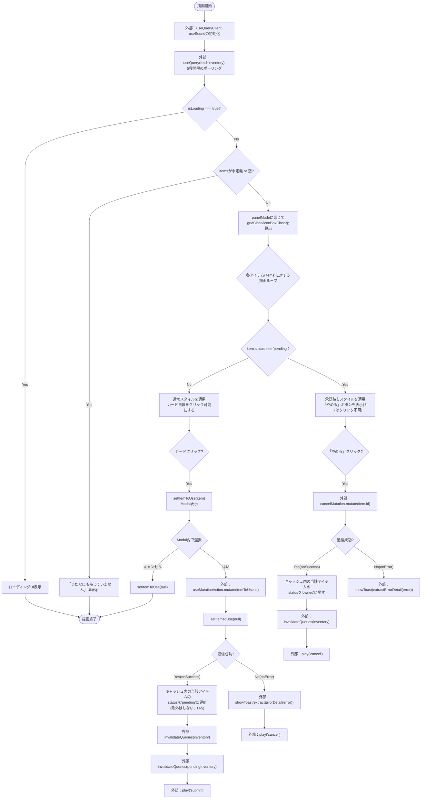
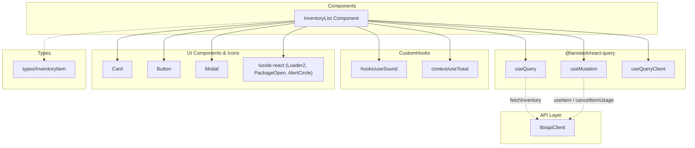

## 1. 解析メタ情報

| 項目 | 内容 |
| --- | --- |
| 対象ファイル | `InventoryList.tsx` |
| 言語 | React (TypeScript) |
| 解析対象 | 提供されたコードのみ |
| 推測・補完 | 一切なし |

## 関連ドキュメント

- [apiClient.md](../../../lib/apiClient.md) — `fetchInventory`/`useItem`/`cancelItemUsage`等、本ファイルが呼び出すAPIクライアントメソッドの実装元。
- [types/index.md](../../../types/index.md) — `InventoryItem`型定義の提供元。
- [Card.md](../../../components/ui/Card.md) — アイテムカードのUIコンポーネント。
- [Button.md](../../../components/ui/Button.md) — 確認モーダル内「キャンセル」「はい」ボタンのUIコンポーネント。
- [Modal.md](../../../components/ui/Modal.md) — 使用確認ダイアログのUIコンポーネント。
- [useSound.md](../../../hooks/useSound.md) — 使用・キャンセル時の効果音再生フックの実装元。
- [../../../context/useToast.md](../../../context/useToast.md) — 使用・キャンセル失敗時のエラートースト表示フックの実装元。
- [RewardShop.md](RewardShop.md) — 呼び出し元候補。`userId`のみを渡す「ごほうび」画面コンテナ。
- [../../family/components/FamilyDashboard.md](../../family/components/FamilyDashboard.md) — 呼び出し元候補。横画面パネルの「もちもの」タブから`userId`と`panelMode`を渡して使用。

## 2. ファイルの概要

* ユーザーの所持アイテム（インベントリ）一覧を取得・表示し、アイテムの「使用申請」および「使用申請の取消（やめる）」を行うUIコンポーネント。
* React Queryを用いてサーバーとの定期的な同期（ポーリング）を行いつつ、アイテム操作時には画面への即時反映（楽観的UI更新）を行う責務を持つ。**バグ修正(H-5)**: バックエンドの`use_item`が即時消費(`consumed`)ではなく親の承認待ち(`pending`)に変わったことに合わせ、使用申請成功時にアイテムをリストから消さず`status: 'pending'`に更新してリュック内に残すよう変更された。
* `panelMode`プロパティにより、狭いパネル（横画面の4人並びレイアウト等）に埋め込まれる際にレイアウト（グリッド列数・アイコンサイズ）を切り替える。
* **バグ修正(M-6-3)**: 以前は使用・キャンセルの各ミューテーションに`onError`が無く、通信エラー等が発生してもユーザーに一切通知されないサイレント失敗になっていた。`useToast`によるエラートースト表示を追加し、`apiClient`がスローする`Error.message`（バックエンドの`{"detail": "..."}`）を`extractErrorDetail`で取り出して表示するようにした。

## 3. 外部依存関係

### インポート一覧

| 名称 | 種類 | 用途 | 根拠 |
| --- | --- | --- | --- |
| `React`, `useState` | モジュール | Reactコンポーネントとしての定義と利用、確認モーダルの表示対象アイテム保持用の状態管理 | 根拠: [`React`, `useState`] (行番号: 1 / 抜粋: "import React, { useState } from 'react';") |
| `useQuery`, `useMutation`, `useQueryClient` | フック | データ取得、データ更新、キャッシュ操作 | 根拠: [`@tanstack/react-query`] (行番号: 2 / 抜粋: "import { useQuery, useMutation, useQueryClient } from '@tanstack/react-query';") |
| `apiClient` | オブジェクト | サーバーサイドとのAPI通信 | 根拠: [`apiClient`] (行番号: 3 / 抜粋: "import { apiClient } from '../../../lib/apiClient';") |
| `Card` | コンポーネント | アイテムごとのUIカードレイアウト表示 | 根拠: [`Card`] (行番号: 4 / 抜粋: "import { Card } from '../../../components/ui/Card';") |
| `Button` | コンポーネント | 使用確認モーダル内の「キャンセル」「はい」ボタン | 根拠: [`Button`] (行番号: 5 / 抜粋: "import { Button } from '../../../components/ui/Button';") |
| `Modal` | コンポーネント | 「つかう」実行前の確認ダイアログ表示 | 根拠: [`Modal`] (行番号: 6 / 抜粋: "import { Modal } from '../../../components/ui/Modal';") |
| `useSound` | フック | アクション時の効果音再生 | 根拠: [`useSound`] (行番号: 7 / 抜粋: "import { useSound } from '../../../hooks/useSound';") |
| `useToast` | フック | 使用・キャンセル失敗時のエラートースト表示 | 根拠: [`useToast`] (行番号: 8 / 抜粋: "import { useToast } from '../../../context/useToast';") |
| `Loader2`, `PackageOpen`, `AlertCircle` | コンポーネント(アイコン) | UI上の状態・装飾を示すアイコン表示（ローディング/所持中/承認待ち） | 根拠: [`lucide-react`] (行番号: 9 / 抜粋: "import { Loader2, PackageOpen, AlertCircle } from 'lucide-react';") |
| `InventoryItem` | 型定義 | アイテムデータの型チェックと補完 | 根拠: [`InventoryItem`] (行番号: 10 / 抜粋: "import { InventoryItem } from '../../../types';") |

### ブラックボックスとなる外部要素

| 名称 | 理由 | 根拠 |
| --- | --- | --- |
| `apiClient`の各メソッド (`fetchInventory`, `useItem`, `cancelItemUsage`) | 具体的なエンドポイント、リクエスト/レスポンス形式、エラーハンドリングの実装が不明（`../../../lib/apiClient`に依存のため要確認）。 | 根拠: [`apiClient`の呼び出し] (行番号: 41, 46, 77 / 抜粋: "queryFn: () => apiClient.fetchInventory(userId),") |
| `Card`, `Button`, `Modal`の内部実装 | `../../../components/ui/`配下の実装が提供されていないため、propsの全容やレンダリング内容が不明。 | 根拠: [`Card`, `Button`, `Modal`] (行番号: 4〜6) |
| `useSound`の挙動 | 音声再生時のエラー処理や、再生可能な音声キー（'submit', 'cancel'）の定義が不明（`../../../hooks/useSound`に依存のため要確認）。 | 根拠: [`useSound`] (行番号: 31 / 抜粋: "const { play } = useSound();") |
| `useToast`/`showToast`の内部実装 | トーストの表示時間・スタック方法・スタイルなど、`../../../context/useToast`（および`ToastContext`）に依存する具体的な描画内容が不明。 | 根拠: [`useToast`] (行番号: 8, 32 / 抜粋: "import { useToast } from '../../../context/useToast';", "const { showToast } = useToast();") |
| `InventoryItem`の詳細な型定義 | コンポーネント内で使用されていないプロパティの有無が不明（`../../../types`に依存のため要確認）。 | 根拠: [`InventoryItem`] (行番号: 10 / 抜粋: "import { InventoryItem } from '../../../types';") |

## 4. 主要要素の定義（関数 / エンドポイント / コンポーネント）

### `extractErrorDetail` (モジュールレベル関数)

* **役割**: `apiClient`側でスローされた`Error`から、バックエンドが返す`{"detail": "..."}`のメッセージ内容（`Error.message`）を取り出す。`error`が`Error`インスタンスかつ`message`が真値の場合のみそれを使い、それ以外は固定文言`'操作に失敗しました'`にフォールバックする。使用申請・キャンセル申請の各ミューテーションの`onError`から呼ばれ、トースト表示用のテキストとして使われる。
* 根拠: (行番号: 12〜16 / 抜粋: "// M-6-3: apiClient側でスローされるErrorのmessageには、バックエンドが返す\n// {\"detail\": \"...\"} の内容が入っている(apiClient.ts参照)。\nconst extractErrorDetail = (error: unknown): string => {\n    return error instanceof Error && error.message ? error.message : '操作に失敗しました';\n};")

* **引数/リクエスト**: `error: unknown`
* **戻り値/レスポンス**: `string`
* **副作用**: なし
* **エラーハンドリング**: なし（自身がエラー内容を安全な文字列に変換するためのヘルパー）

### `InventoryList`

* **役割**: ユーザーのインベントリ一覧を取得し、条件に応じた画面（ローディング、空状態、アイテム一覧）を表示する。各アイテムカード（所持中）はクリックすると使用確認`Modal`を開き、「はい」で使用申請（`useMutationAction`）を実行する。承認待ち（`pending`）のアイテムには「やめる」ボタンでキャンセル（`cancelMutation`）を実行できる。`panelMode`が真の場合はグリッドを1カラムに固定し、アイコンサイズを縮小する。**バグ修正(H-5)**: バックエンドの`use_item`が即時消費(`consumed`)から承認待ち(`pending`)に変わったことに合わせ、使用申請成功時はアイテムをリストから消さず`status: 'pending'`に更新するのみとし、実際の消費確定（`quest_history`への記録・`chronicle`反映）は親の承認（`consume_item`、`ApprovalList`側）で行われるようになった。
* 根拠: [`InventoryList`] (行番号: 29〜196 / 抜粋: "export const InventoryList: React.FC<Props> = ({ userId, panelMode }) => {")
* 根拠: H-5バグ修正コメント (行番号: 50〜53 / 抜粋: "// H-5: use_itemはバックエンド側で即時消費(consumed)ではなく承認待ち\n            // (pending)にするため、リストから消さずステータスのみ更新する。\n            // 実際の消費確定(quest_historyへの記録・chronicle反映)は親の承認\n            // (consume_item)時に行われる。")

* **引数/リクエスト**: `Props`（`{ userId: string; panelMode?: boolean }`）
* 根拠: [`Props`] (行番号: 20〜27 / 抜粋: "type Props = {\n    userId: string;\n    // PC横画面の4人並びパネルなど、実際の表示幅が狭い枠内に埋め込む場合に指定する。\n    // 通常の sm:grid-cols-2 はブラウザの「ビューポート幅」基準のため、狭いパネルに\n    // 埋め込まれていても(ビューポート自体は広いPC画面なので)2カラム化してしまい、\n    // アイコン・ボタンが見切れる原因になっていた。panelMode時は常に1カラムにする。\n    panelMode?: boolean;\n};")

* **戻り値/レスポンス**: `ReactElement`（ローディングUI、空状態UI、またはアイテム一覧のグリッドUIと使用確認`Modal`）
* 根拠: [`InventoryList`のreturn文] (行番号: 95〜99, 101〜112, 121〜194 / 抜粋: "return (\n        
")

* **副作用**:
  * `apiClient`を利用した外部API呼び出し（取得・使用申請・キャンセル申請）
  * `queryClient.setQueryData`によるローカルキャッシュの直接更新（使用申請したアイテムの`status`を`'pending'`に更新、キャンセル成功時に`'owned'`へ書き戻し）。**バグ修正**: 以前は使用成功時にキャッシュから当該アイテムを`filter`で除外していたが、H-5のバックエンド仕様変更（即時消費→承認待ち）に合わせ、除外ではなく`status`更新のみに変更された。
  * `queryClient.invalidateQueries`による`['inventory', userId]`キャッシュの無効化（使用申請・キャンセル申請の両方）、および使用申請成功時のみ`['pendingInventory']`キャッシュの無効化（親の承認待ち一覧への即時反映のため）。**バグ修正**: 以前ここにあった`['chronicle']`の無効化は、消費確定処理自体が親の承認（`consume_item`）側に移ったことに伴い削除された（現在は`ApprovalList`側の承認ミューテーションが`chronicle`を無効化する）。
  * `play`関数による音声再生。使用申請成功時は`'submit'`（以前は`'clear'`）、使用申請失敗時・キャンセル成功時は`'cancel'`。
  * `showToast`によるエラートースト表示（使用申請・キャンセル申請の通信失敗時、`title: "エラー"`, `text: extractErrorDetail(error)`, `icon: "⚠️"`）。**バグ修正(M-6-3)**: 以前は`onError`が無く、失敗がユーザーに一切通知されないサイレント失敗になっていた。
  * `setItemToUse`によるローカルstate更新（使用確認モーダルの開閉制御）
* 根拠: [`useMutationAction`, `cancelMutation`, `itemToUse`] (行番号: 45〜93 / 抜粋: "queryClient.setQueryData<InventoryItem[]>(queryKey, (oldItems) => {")
* 根拠: 使用申請成功時の音・キャッシュ無効化 (行番号: 61〜66 / 抜粋: "// 念のためサーバーとも同期(承認待ち一覧のポーリングにも反映される)\n            queryClient.invalidateQueries({ queryKey: queryKey });\n            queryClient.invalidateQueries({ queryKey: ['pendingInventory'] });\n\n            // 承認待ちになったことを示す申請音(quest完了時のpending相当)を再生\n            play('submit');")
* 根拠: 使用申請失敗時のonError (行番号: 68〜73 / 抜粋: "// M-6-3: 以前はonErrorが無く、使用申請の失敗(通信エラー等)が\n        // ユーザーに一切通知されないサイレント失敗になっていた。\n        onError: (error) => {\n            showToast({ title: \"エラー\", text: extractErrorDetail(error), icon: \"⚠️\" });\n            play('cancel');\n        }")
* 根拠: キャンセル申請失敗時のonError (行番号: 90〜92 / 抜粋: "onError: (error) => {\n            showToast({ title: \"エラー\", text: extractErrorDetail(error), icon: \"⚠️\" });\n        }")

* **エラーハンドリング**:
  * APIデータ取得中（`isLoading`）はローディングアイコンを表示。
  * データが空（`!items || items.length === 0`）の場合は専用のメッセージUIを表示。
  * 使用申請（`useMutationAction`）・キャンセル申請（`cancelMutation`）の通信エラーは、それぞれの`onError`で`extractErrorDetail`によりメッセージを取り出し`showToast`でユーザーに通知する（**バグ修正(M-6-3)**、以前はこのハンドラ自体が存在せずサイレント失敗だった）。
  * ただし、一覧取得の`useQuery`（`fetchInventory`）自体には`onError`等の明示的なエラーハンドリングは無く、取得失敗時のUI・キャッチ処理はファイル内に記述されていない。
* 根拠: [条件付きレンダリング部分] (行番号: 95〜112 / 抜粋: "if (isLoading) return (")
* 根拠: 両ミューテーションの`onError` (行番号: 68〜73, 90〜92)

## 5. 処理フロー図

```mermaid
flowchart TD
    Start([描画開始]) --> Init["外部：useQueryClient, useSoundの初期化"]
    Init --> Query["外部：useQuery(fetchInventory) \n5秒間隔のポーリング"]
    Query --> CheckLoading{"isLoading === true?"}

    CheckLoading -- Yes --> RenderLoading["ローディングUI表示"] --> End([描画終了])
    CheckLoading -- No --> CheckEmpty{"itemsが未定義 or 空?"}

    CheckEmpty -- Yes --> RenderEmpty["「まだなにも持っていません」UI表示"] --> End
    CheckEmpty -- No --> CalcLayout["panelModeに応じてgridClass/iconBoxClassを算出"]
    CalcLayout --> MapItems{"各アイテム(items)に対する描画ループ"}

    MapItems --> CheckStatus{"item.status === 'pending'?"}

    CheckStatus -- Yes --> RenderPending["承認待ちスタイルを適用\n「やめる」ボタンを表示(カードはクリック不可)"]
    CheckStatus -- No --> RenderOwned["通常スタイルを適用\nカード自体をクリック可能にする"]

    RenderPending --> CancelClick{"「やめる」クリック?"}
    RenderOwned --> CardClick{"カードクリック?"}

    CardClick -- Yes --> SetItemToUse["setItemToUse(item)\nModal表示"]
    SetItemToUse --> ModalChoice{"Modal内で選択"}
    ModalChoice -- "キャンセル" --> CloseModal["setItemToUse(null)"] --> End
    ModalChoice -- "はい" --> MutateUse["外部：useMutationAction.mutate(itemToUse.id)"]
    MutateUse --> CloseModal2["setItemToUse(null)"]
    CloseModal2 --> UseResult{"通信成功?"}
    UseResult -- Yes(onSuccess) --> OptimisticUse["キャッシュ内の当該アイテムの\nstatusを'pending'に更新\n(除外はしない、H-5)"]
    OptimisticUse --> InvalidateUse["外部：invalidateQueries(inventory)"]
    InvalidateUse --> InvalidatePending["外部：invalidateQueries(pendingInventory)"]
    InvalidatePending --> PlaySubmit["外部：play('submit')"]
    UseResult -- No(onError) --> ShowToastUse["外部：showToast(extractErrorDetail(error))"]
    ShowToastUse --> PlayCancelOnUseError["外部：play('cancel')"]

    CancelClick -- Yes --> MutateCancel["外部：cancelMutation.mutate(item.id)"]
    MutateCancel --> CancelResult{"通信成功?"}
    CancelResult -- Yes(onSuccess) --> OptimisticCancel["キャッシュ内の当該アイテムの\nstatusを'owned'に戻す"]
    OptimisticCancel --> InvalidateCancel["外部：invalidateQueries(inventory)"]
    InvalidateCancel --> PlayCancel["外部：play('cancel')"]
    CancelResult -- No(onError) --> ShowToastCancel["外部：showToast(extractErrorDetail(error))"]

```

## 6. 依存関係図

```mermaid
graph TD
    subgraph Components
        InventoryList["InventoryList Component"]
    end

    subgraph ReactQuery ["@tanstack/react-query"]
        useQuery["useQuery"]
        useMutation["useMutation"]
        useQueryClient["useQueryClient"]
    end

    subgraph CustomHooks
        useSoundHook["hooks/useSound"]
        useToastHook["context/useToast"]
    end

    subgraph UI ["UI Components & Icons"]
        Card["Card"]
        Button["Button"]
        Modal["Modal"]
        Lucide["lucide-react (Loader2, PackageOpen, AlertCircle)"]
    end

    subgraph ExternalAPI ["API Layer"]
        apiClient["lib/apiClient"]
    end

    subgraph Types
        InventoryItem["types/InventoryItem"]
    end

    InventoryList --> useQuery
    InventoryList --> useMutation
    InventoryList --> useQueryClient
    InventoryList --> useSoundHook
    InventoryList --> useToastHook
    InventoryList --> Card
    InventoryList --> Button
    InventoryList --> Modal
    InventoryList --> Lucide
    InventoryList -.-> InventoryItem

    useQuery -.->|fetchInventory| apiClient
    useMutation -.->|useItem / cancelItemUsage| apiClient

```

## 7. 次のステップ（リバースエンジニアリングの提案）

| 優先度 | ファイル名(推測可) | 理由 | 根拠 |
| --- | --- | --- | --- |
| 高 | `../../../lib/apiClient.ts` | APIの実際のエンドポイント、パラメータ仕様、レスポンス構造、およびAPI側で発生しうるエラーの詳細を把握するため。 | 根拠: [`apiClient`への依存] (行番号: 3 / 抜粋: "import { apiClient }") |
| 中 | `../../../types/index.ts` | `InventoryItem`が持つ全プロパティ（特に`status`が取りうる他の値）を正確に特定し、UI上に反映漏れがないか確認するため。 | 根拠: [`InventoryItem`への依存] (行番号: 10 / 抜粋: "import { InventoryItem }") |
| 中 | `../../../components/ui/Modal.tsx` | `isOpen`/`onClose`/`footer`以外に受け付けるprops、およびアクセシビリティ対応（フォーカストラップ等）の実装状況を確認するため。 | 根拠: [`Modal`への依存] (行番号: 6 / 抜粋: "import { Modal }") |
| 低 | `../../../hooks/useSound.ts` | 再生可能な音声キーの全容や、音声ファイルのロード状況による動作への影響を確認するため。 | 根拠: [`useSound`への依存] (行番号: 7 / 抜粋: "import { useSound }") |
| 低 | `../../../context/useToast.ts` / `ToastContext.tsx` | エラートーストの表示時間・スタック方法など、UI上の具体的な挙動を確認するため。 | 根拠: [`useToast`への依存] (行番号: 8 / 抜粋: "import { useToast }") |

## 8. 保守上の注意点

* **一覧取得(`useQuery`)のエラーハンドリング欠如**: `fetchInventory`の`useQuery`自体には`onError`が無く、一覧取得に失敗した場合にエラーを画面上に表示・通知する処理は記述されていません（**バグ修正(M-6-3)で追加されたのは`useMutationAction`/`cancelMutation`の`onError`のみで、`useQuery`側は対象外**）。
* **エラートースト追加によるサイレント失敗の解消（バグ修正済み、M-6-3）**: 以前は使用申請（`useMutationAction`）・キャンセル申請（`cancelMutation`）のいずれも`onError`が定義されておらず、通信エラー等が発生してもコンソールログのみでユーザーには一切通知されないサイレント失敗になっていた。現在は両ミューテーションに`onError`を追加し、`extractErrorDetail(error)`で取り出したメッセージを`showToast`でトースト表示する（使用申請側は追加で`play('cancel')`も再生）。ただしキャッシュの`setQueryData`は`onSuccess`内でのみ行われる設計のため、`onError`時に巻き戻す対象のキャッシュ変更自体が存在せず、いわゆる「楽観的更新のロールバック」は不要（`invalidateQueries`による次回フェッチが実質的な同期手段）。
* **ポーリング負荷**: `refetchInterval: 5000` が設定されており、5秒ごとに自動フェッチが走るため、ユーザー数が多い場合はサーバー負荷への影響を考慮する必要があります。
* **確認ダイアログの状態管理**: アイテム使用時の確認はブラウザネイティブの`confirm()`ではなく、`itemToUse`ステートとアプリ標準の`Modal`コンポーネントで実装されている。`useMutationAction.mutate`呼び出しと`setItemToUse(null)`が同一の`onClick`内で連続実行されるため、ミューテーションの成否に関わらずモーダルは即座に閉じる（成否のフィードバックは、成功時は`onSuccess`側のキャッシュ更新、失敗時は`onError`側のトーストにのみ依存する）。
* **「つかう」操作のトリガーがボタンからカードクリックへ変更**: 以前は個別の「つかう！」ボタンがあったが、コンパクトな1行表示にするため、`isOwned`なカード自体のクリックで使用確認モーダルを開く方式に変更された。承認待ち（`isPending`）のカードには`onClick`が設定されておらず、クリックしても反応しない。
* 根拠: (行番号: 124〜125, 130〜132 / 抜粋: "const isPending = item.status === 'pending';\n                const isOwned = item.status === 'owned';", "{/* ★バグ修正: 「つかう」ボタンを廃止し、カード自体をタップしたら\n                        // つかう確認モーダルを開くようにする(1行のコンパクト表示にするため) */}", "onClick={isOwned ? () => setItemToUse(item) : undefined}")
* **`panelMode`によるレイアウト切り替え**: 狭いパネル内では`sm:grid-cols-2`がビューポート幅基準で誤って2カラム化してしまう問題への対応として、`panelMode`時は`grid-cols-1`に固定し、アイコンサイズも縮小する。
* 根拠: (行番号: 114〜119 / 抜粋: "const gridClass = panelMode ? 'grid-cols-1' : 'grid-cols-1 sm:grid-cols-2';\n    const iconBoxClass = panelMode ? 'text-xl w-9 h-9' : 'text-2xl w-11 h-11';")
* **アイテム使用の承認フロー復活とchronicle無効化責務の移動（バグ修正済み、H-5）**: 以前は使用（`useItem`）が即時消費(`consumed`)扱いで、成功時にアイテムをキャッシュから`filter`で除外し、`['chronicle']`も本ファイル側で`invalidateQueries`していた。バックエンドの`use_item`が承認待ち(`pending`)を返す仕様に変わったことに合わせ、本ファイルでは`status`を`'pending'`に更新して一覧に残すのみとし、`['chronicle']`の無効化コードは削除された。実際の消費確定・`chronicle`反映は、親の承認操作（`ApprovalList`の`consumeMutation`、`apiClient.consumeItem`）側の責務に移った。したがって本ファイル単体を読む限り、使用申請後に冒険の記録が更新されるタイミングはこのファイルの外（`ApprovalList.tsx`）に依存する。
* 根拠: (行番号: 50〜59, 61〜63 / 抜粋: "// H-5: use_itemはバックエンド側で即時消費(consumed)ではなく承認待ち\n            // (pending)にするため、リストから消さずステータスのみ更新する。\n            // 実際の消費確定(quest_historyへの記録・chronicle反映)は親の承認\n            // (consume_item)時に行われる。", "queryClient.invalidateQueries({ queryKey: ['pendingInventory'] });")

## 9. 不明事項一覧

| 項目 | 理由 | 必要なファイル |
| --- | --- | --- |
| `item.status`の取りうる全値 | 現在のコードでは`'pending'`と`'owned'`のみ扱われているが、他のステータスが存在するか不明なため。 | `../../../types` |
| 一覧取得(`useQuery`)失敗時のデフォルトの挙動 | `fetchInventory`自体には`onError`が無く、グローバルなエラーハンドラーの有無がこのファイル単独では不明なため。 | `../../../lib/apiClient` または親コンポーネント群 |
| `play('submit')`/`play('cancel')`等の音声の有無 | 指定されたキーに対応する音声が確実に存在するかが不明なため。 | `../../../hooks/useSound` |
| `Modal`コンポーネントの内部実装 | `isOpen`/`onClose`/`title`/`footer`のprops以外にどのような機能（フォーカストラップ、アニメーション等）を持つか不明なため。 | `../../../components/ui/Modal` |
| `useToast`/`showToast`の内部実装 | トーストの表示時間・同時表示数の上限など、`../../../context/useToast`に依存する具体的な挙動が不明なため。 | `../../../context/useToast.ts`, `ToastContext.tsx` |
| `panelMode`の呼び出し元の使用実態 | 本ファイル単体では、どの画面（親コンポーネント）が`panelMode`を`true`で渡しているかが完全には特定できないため。 | 本コンポーネントを呼び出す親ファイル群 |

## 相互参照による補足情報

| 元の不明事項 | 判明した内容 | 参照元ドキュメント |
| --- | --- | --- |
| `item.status`の取りうる全値 | `family-quest/src/types/index.ts`を直接確認した。`InventoryItem.status`(97行目)は`'owned' \| 'pending' \| 'consumed'`の3値で定義されている。さらに`MY_HOME_SYSTEM/services/quest_service.py`の`InventoryService.get_user_inventory`(586〜597行目)を直接確認したところ、SQLクエリが`WHERE ui.status IN ('owned', 'pending')`(593行目)という条件で`'consumed'`状態のアイテムを明示的に除外して返しており、フロントエンドの`fetchInventory`が取得するデータには`'consumed'`は原理的に含まれない設計であることが判明した。本ファイルが`'pending'`と`'owned'`の2値のみを扱っている(124〜125行目)のは、この結果として妥当であることを確認した。 | 直接ソース確認: `family-quest/src/types/index.ts:97`, `MY_HOME_SYSTEM/services/quest_service.py:586-597` |
| 一覧取得(`useQuery`)失敗時のデフォルトの挙動 | `family-quest/src/lib/apiClient.ts`を直接確認した。`_request`メソッド(77〜95行目)は`!response.ok`の場合、レスポンスのJSONの`detail`フィールド（文字列型の場合のみ）またはフォールバックの`API Error: {status}`から`Error`を生成してスローし(83〜88行目)、`catch`節(91〜94行目)で`console.error`によるログ出力の後に例外を再スローするのみで、`apiClient.ts`内にグローバルなエラー通知・トースト表示の仕組みは実装されていないことを確認した。呼び出し元の`InventoryList.tsx`自体は、2つの`useMutation`（`useMutationAction`/`cancelMutation`）には`onError`ハンドラを定義し`showToast`で通知するようになった（M-6-3）が、一覧取得の`useQuery`（`fetchInventory`）には引き続き`onError`が無く、取得失敗時はコンソールログのみで画面上には何も表示されない。 | 直接ソース確認: `family-quest/src/lib/apiClient.ts:77-95` |
| `play('submit')`/`play('cancel')`等の音声の有無 | `family-quest/src/hooks/useSound.ts`を直接確認した。`SOUNDS`定義(4〜13行目)には本ファイルが使用する`'submit'`(5行目、`/quest/submit.mp3`、「申請・決定音」)と`'cancel'`(12行目、`/quest/tap.mp3`と同一音源、「cancel は tap(タップ音) を使用」)がいずれも実在する。以前使用していた`'clear'`(7行目、`quest_clear.mp3`)も実在するが、H-5のバグ修正により使用申請成功時の再生キーが`'clear'`から`'submit'`に変更されている。`play`(21〜46行目)は`audioCache`にキャッシュした`HTMLAudioElement`を再生し、失敗時は`console.warn`のみで例外を投げない(38〜41行目)ことも確認した。 | 直接ソース確認: `family-quest/src/hooks/useSound.ts:4-13,21-46` |
| `Modal`コンポーネントの内部実装 | `family-quest/src/components/ui/Modal.tsx`を直接確認した。`Modal`(15〜77行目)は`isOpen`/`onClose`/`title`/`children`/`footer`/`maxWidth`(既定`"sm"`)をpropsとして受け取り、`useEffect`(24〜30行目)で`isOpen`が真の間だけ`keydown`リスナーを登録してESCキー押下時に`onClose`を呼ぶ。フォーカストラップは実装されておらず、背景（バックドロップ）のクリックでも`onClose`が呼ばれる(44〜47行目)。本ファイルは`title`/`footer`/`children`のみを渡しており(173〜193行目)、`maxWidth`は既定値`"sm"`のまま使用していることを確認した。 | 直接ソース確認: `family-quest/src/components/ui/Modal.tsx:15-77` |
| `useToast`/`showToast`の内部実装 | `family-quest/src/context/useToast.ts`と`toastShared.ts`を直接確認した。`useToast()`(`useToast.ts`4〜8行目)は`useContext(ToastContext)`を呼び出し、値が`null`なら`Error('useToast は ToastProvider の内側で使ってください')`を`throw`する。`ToastContextValue.showToast`(`toastShared.ts`15〜17行目)は`(toast: Omit<ToastItem, 'id' \| 'createdAt'>) => void`型で、`ToastItem`(7〜13行目)は`id`/`title`/`text?`/`icon?`/`createdAt`を持つ。実際の描画・表示時間・スタック方法は`ToastContext.tsx`(Provider本体)側の実装に依存し、本調査の範囲では未確認。 | 直接ソース確認: `family-quest/src/context/useToast.ts:1-9`, `family-quest/src/context/toastShared.ts:1-19` |
| `panelMode`の呼び出し元の使用実態 | `family-quest/src/features/family/components/FamilyDashboard.tsx`を直接確認した。`FamilyPanel`内の「もちもの」タブ選択時に`<InventoryList userId={user.user_id} panelMode />`(212行目)という形で`panelMode`を明示的に真として渡して呼び出している。一方`family-quest/src/App.tsx`の縦画面側では`<InventoryList userId={currentUser.user_id} />`(513行目)と`panelMode`を渡していない（＝`undefined`で偽扱い）ことも確認した。 | 直接ソース確認: `family-quest/src/features/family/components/FamilyDashboard.tsx:212`, `family-quest/src/App.tsx:513` |

## 10. 自己検証結果

* [x] 完了: 推測・外部ファイルの仕様を一切含んでいない
* [x] 完了: 全関数・全クラス・全コンポーネントを列挙した
* [x] 完了: 全てのインポート要素を列挙した
* [x] 完了: すべての仕様説明に「根拠（行番号・抜粋）」を明記した
* [x] 完了: 根拠漏れが0件である
* [x] 完了: Mermaid構文にエラーの原因となる記号（エスケープ漏れ）がない
* [x] 完了: 不明事項を漏れなく列挙した
