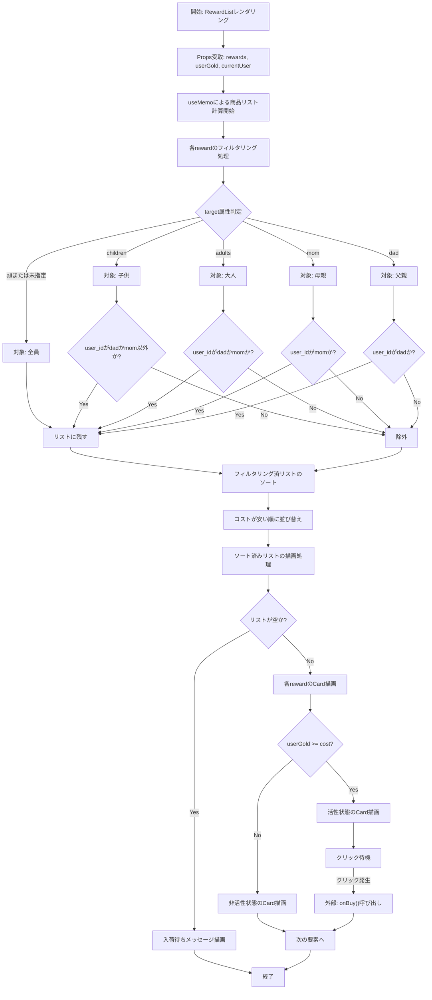
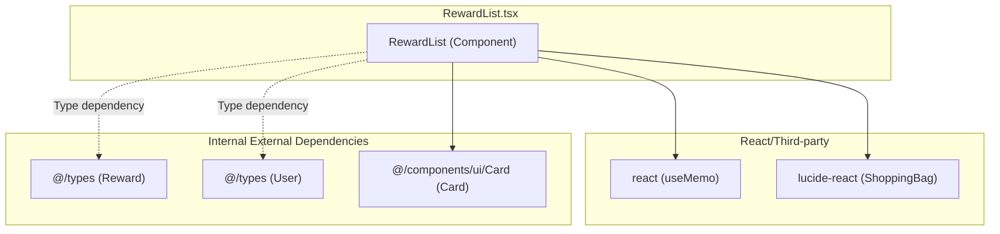

## 1. 解析メタ情報

| 項目 | 内容 |
| --- | --- |
| 対象ファイル | RewardList.tsx |
| 言語 | React (TypeScript) |
| 解析対象 | 提供されたコードのみ |
| 推測・補完 | 一切なし |

## 2. ファイルの概要

* ユーザー情報と保有ゴールドに基づいて、購入可能な商品のリストをフィルタリングおよび価格順にソートして表示するUIコンポーネント。
* 各商品に対し、ユーザーの保有ゴールドが購入価格を満たしているかを判定し、見た目の状態（活性/非活性）を切り替える。
* 購入可能な商品がクリックされた際、外部から渡された購入処理関数を呼び出す。

## 3. 外部依存関係

### インポート一覧

| 名称 | 種類 | 用途 | 根拠 |
| --- | --- | --- | --- |
| `React`, `useMemo` | ライブラリ | コンポーネント定義およびメモ化によるパフォーマンス最適化 | インポート文 (行番号: 1 / 抜粋: `import React, { useMemo } from 'react';`) |
| `ShoppingBag` | UIアイコン | 見出し用アイコンの表示 | インポート文 (行番号: 2 / 抜粋: `import { ShoppingBag } from 'lucide-react';`) |
| `Reward`, `User` | 型定義 | コンポーネントのPropsである商品とユーザー情報の型指定 | インポート文 (行番号: 3 / 抜粋: `import { Reward, User } from '@/types';`) |
| `Card` | UIコンポーネント | 商品情報のリストアイテム外枠の描画 | インポート文 (行番号: 4 / 抜粋: `import { Card } from '@/components/ui/Card';`) |

### ブラックボックスとなる外部要素

| 名称 | 理由 | 根拠 |
| --- | --- | --- |
| `@/types`の`Reward`, `User` | プロパティの全容やスキーマ構造が現在のファイルから読み取れないため。 | インポート文 (行番号: 3 / 抜粋: `import { Reward, User } from '@/types';`) |
| `@/components/ui/Card`の`Card` | 内部的なDOM構造、スタイル適用方法、イベントハンドラの処理方式が不明なため。 | インポート文 (行番号: 4 / 抜粋: `import { Card } from '@/components/ui/Card';`) |

## 4. 主要要素の定義（関数 / エンドポイント / コンポーネント）

### `RewardList`

* **役割**: プロパティとして受け取った商品リストをユーザー情報（ターゲット属性、保有ゴールド）に基づきフィルタリング・ソートし、購入可否のステータス付きで一覧表示する。
* 根拠: `RewardList`コンポーネント (行番号: 13〜98 / 抜粋: `const RewardList: React.FC<RewardListProps> = ...`)

* **引数/リクエスト**: `RewardListProps` オブジェクト
* `rewards`: `Reward[]` (商品配列)
* `userGold`: `number` (ユーザーの保有ゴールド)
* `onBuy`: `(reward: Reward) => void` (商品購入時のコールバック関数)
* `currentUser`: `User` (現在のユーザー情報)
* 根拠: `RewardListProps`インターフェース (行番号: 6〜11 / 抜粋: `interface RewardListProps { ... }`)

* **戻り値/レスポンス**: `JSX.Element`
* 根拠: コンポーネント戻り値 (行番号: 39〜97 / 抜粋: `return ( 
 canAfford && onBuy(reward)}`)

* **エラーハンドリング**: オブジェクトのプロパティ欠損に対して論理和(`||`)演算子を用いてデフォルト値へフォールバックしている。
* 根拠: 変数代入 (行番号: 17, 33, 51, 54, 57, 73 / 抜粋: `const target = r.target || 'all';` など)

## 5. 処理フロー図

## 6. 依存関係図

## 7. 次のステップ（リバースエンジニアリングの提案）

| 優先度 | ファイル名(推測可) | 理由 | 根拠 |
| --- | --- | --- | --- |
| 高 | `@/types` (index.ts 等) | `Reward`および`User`型の完全なスキーマ（オプショナルなプロパティの全容）を把握するため。 | インポート文 (行番号: 3 / 抜粋: `import { Reward, User } from '@/types';`) |
| 中 | 本コンポーネントを呼び出す親コンポーネント | `userGold`の管理方法や`onBuy`の具体的な副作用（DB更新やAPI呼び出しなど）を確認するため。 | Props定義 (行番号: 8, 9 / 抜粋: `userGold: number; onBuy: (reward: Reward) => void;`) |
| 低 | `@/components/ui/Card` | `Card`コンポーネントが`className`や`onClick`を正しくDOM要素に伝播させているか仕様を確認するため。 | インポートおよび使用箇所 (行番号: 4, 60 / 抜粋: `<Card key={rId} onClick={...} className={...}>`) |

## 8. 保守上の注意点

* **ハードコードされたIDロジック**: `isAdult`の判定処理等において、`user_id`が `'dad'` または `'mom'` であるかを直接文字列で判定している。ユーザーIDの仕様が変更された場合、ロジックが破綻する。
* 根拠: 条件式 (行番号: 21, 25, 26 / 抜粋: `const isAdult = currentUser.user_id === 'dad' || currentUser.user_id === 'mom';`)

* **プロパティの非正規化（フォールバック）**: 一つのデータに対して複数のプロパティ名（例: `cost_gold`と`cost`、`reward_id`と`id`、`description`と`desc`と`category`）が混在しており、データ構造が統一されていないことが窺える。
* 根拠: 変数代入 (行番号: 33, 51, 54, 57, 73 / 抜粋: `const displayText = reward.description || reward.desc || reward.category || 'General';` など)

* **リストのKey属性におけるインデックス使用**: 一意のID（`reward_id`や`id`）が存在しない場合、配列の`index`をフォールバックとしてReactの`key`に指定している。リストが動的に増減または並び替わる場合、レンダリングバグやパフォーマンス低下を引き起こす可能性がある。
* 根拠: 変数代入およびJSX (行番号: 54, 61 / 抜粋: `const rId = reward.reward_id || reward.id || index;`, `key={rId}`)

## 9. 不明事項一覧

| 項目 | 理由 | 必要なファイル |
| --- | --- | --- |
| `Reward` / `User`の詳細なデータ構造 | 型の完全なインターフェースがこのファイル内には記述されていないため。 | `@/types` 内の該当ファイル |
| `onBuy` 実行時の具体的なシステム挙動 | 状態管理やサーバーへの通信処理などの実装が親コンポーネントに委譲されているため。 | 親コンポーネント |
| `Card` コンポーネントの内部実装 | クリックイベントの伝播仕様や、デフォルトで適用されるスタイルが不明なため。 | `@/components/ui/Card` |

## 10. 自己検証結果

* [x] 推測・外部ファイルの仕様を一切含んでいない
* [x] 全関数・全クラス・全コンポーネントを列挙した
* [x] 全てのインポート要素を列挙した
* [x] すべての仕様説明に「根拠（行番号・抜粋）」を明記した
* [x] 根拠漏れが0件である
* [x] Mermaid構文にエラーの原因となる記号（エスケープ漏れ）がない
* [x] 不明事項を漏れなく列挙した
完了