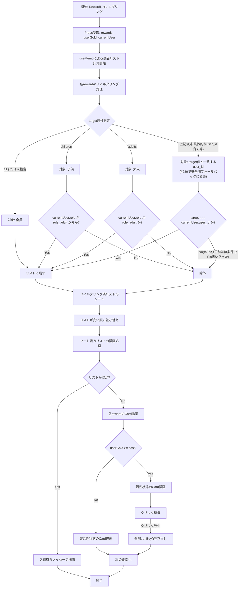
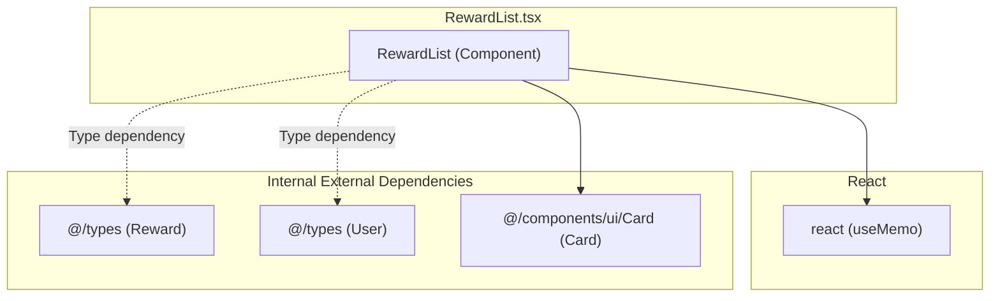

## 1. 解析メタ情報

| 項目 | 内容 |
| --- | --- |
| 対象ファイル | RewardList.tsx |
| 言語 | React (TypeScript) |
| 解析対象 | 提供されたコードのみ |
| 推測・補完 | 一切なし |

## 関連ドキュメント

- [types/index.md](../../../types/index.md) — `Reward`/`User`型定義の提供元。
- [Card.md](../../../components/ui/Card.md) — 商品カードのUIコンポーネント。
- [RewardShop.md](RewardShop.md) — 呼び出し元。`userGold`/`onBuy`/`currentUser`を渡すコンテナ。

## 2. ファイルの概要

* ユーザー情報と保有ゴールドに基づいて、購入可能な商品のリストをフィルタリングおよび価格順にソートして表示するUIコンポーネント。
* 各商品に対し、ユーザーの保有ゴールドが購入価格を満たしているかを判定し、見た目の状態（活性/非活性）を切り替える。
* 購入可能な商品がクリックされた際、外部から渡された購入処理関数を呼び出す。

## 3. 外部依存関係

### インポート一覧

| 名称 | 種類 | 用途 | 根拠 |
| --- | --- | --- | --- |
| `React`, `useMemo` | ライブラリ | コンポーネント定義およびメモ化によるパフォーマンス最適化 | インポート文 (行番号: 1 / 抜粋: `import React, { useMemo } from 'react';`) |
| `Reward`, `User` | 型定義 | コンポーネントのPropsである商品とユーザー情報の型指定 | インポート文 (行番号: 2 / 抜粋: `import { Reward, User } from '@/types';`) |
| `Card` | UIコンポーネント | 商品情報のリストアイテム外枠の描画 | インポート文 (行番号: 3 / 抜粋: `import { Card } from '@/components/ui/Card';`) |

### ブラックボックスとなる外部要素

| 名称 | 理由 | 根拠 |
| --- | --- | --- |
| `@/types`の`Reward`, `User` | プロパティの全容やスキーマ構造が現在のファイルから読み取れないため。 | インポート文 (行番号: 2 / 抜粋: `import { Reward, User } from '@/types';`) |
| `@/components/ui/Card`の`Card` | 内部的なDOM構造、スタイル適用方法、イベントハンドラの処理方式が不明なため。 | インポート文 (行番号: 3 / 抜粋: `import { Card } from '@/components/ui/Card';`) |

## 4. 主要要素の定義（関数 / エンドポイント / コンポーネント）

### `RewardList`

* **役割**: プロパティとして受け取った商品リストをユーザー情報（ターゲット属性、保有ゴールド）に基づきフィルタリング・ソートし、購入可否のステータス付きで一覧表示する。
* 根拠: `RewardList`コンポーネント (行番号: 12〜94 / 抜粋: `const RewardList: React.FC<RewardListProps> = ({ rewards, userGold, onBuy, currentUser }) => {`)

* **引数/リクエスト**: `RewardListProps` オブジェクト
  * `rewards`: `Reward[]` (商品配列)
  * `userGold`: `number` (ユーザーの保有ゴールド)
  * `onBuy`: `(reward: Reward) => void` (商品購入時のコールバック関数)
  * `currentUser`: `User` (現在のユーザー情報)
* 根拠: `RewardListProps`インターフェース (行番号: 5〜10 / 抜粋: `interface RewardListProps {\n  rewards: Reward[];\n  userGold: number;\n  onBuy: (reward: Reward) => void;\n  currentUser: User;\n}`)
* フィルタリングにおける`target === 'children'`/`'adults'`の判定は`currentUser.role === 'role_adult'`（`isAdult`、20行目）で行われる。**（Issue #239で修正）** それ以外の`target`値（具体的なuser_id宛て、または将来追加されうる未知の値）は、以前は`'mom'`/`'dad'`のみを個別に`if`分岐でハードコード比較し、それ以外は無条件で`true`（全員へ表示）を返す安全でないフォールバックになっていた。修正後は`QuestList.tsx`のターゲット判定（`q.target !== currentUser?.user_id`）と同様の安全側（deny-by-default）に統一し、`target === currentUser.user_id`の完全一致でのみ表示する。これにより`'mom'`/`'dad'`以外の任意のuser_id宛てtarget（例: `'son'`/`'daughter'`）も正しく本人以外には表示されなくなった。
* 根拠: (行番号: 20, 22〜23, 29 / 抜粋: `const isAdult = currentUser.role === 'role_adult';`, `if (target === 'children') return !isAdult;`, `return target === currentUser.user_id;`)

* **戻り値/レスポンス**: `JSX.Element`
* 根拠: コンポーネント戻り値 (行番号: 38〜93 / 抜粋: `return (\n    
`)

* **副作用**: なし (純粋なUIレンダリングのみ。実際の購入副作用は引数`onBuy`へ委譲)
* 根拠: イベントハンドラ (行番号: 59 / 抜粋: `onClick={() => canAfford && onBuy(reward)}`)

* **エラーハンドリング**: オブジェクトのプロパティ欠損に対して論理和(`||`)演算子を用いてデフォルト値へフォールバックしている。
* 根拠: 変数代入 (行番号: 16, 32〜33, 51, 54, 70, 76 / 抜粋: `const target = r.target || 'all';` など)

## 5. 処理フロー図

```mermaid
flowchart TD
    Start[開始: RewardListレンダリング] --> PropsCheck[Props受取: rewards, userGold, currentUser]
    PropsCheck --> UseMemo[useMemoによる商品リスト計算開始]
    UseMemo --> FilterLoop[各rewardのフィルタリング処理]

    FilterLoop --> TargetCheck{target属性判定}
    TargetCheck -- "all"または未指定 --> TargetAll[対象: 全員]
    TargetCheck -- "children" --> TargetChildren[対象: 子供]
    TargetCheck -- "adults" --> TargetAdults[対象: 大人]
    TargetCheck -- "上記以外(具体的なuser_id宛て等)" --> TargetSpecific["対象: target値と一致するuser_id<br>(#239で安全側フォールバックに変更)"]

    TargetAll --> FilterKeep[リストに残す]
    TargetChildren --> IsAdultCheck1{currentUser.role が role_adult 以外か?}
    TargetAdults --> IsAdultCheck2{currentUser.role が role_adult か?}
    TargetSpecific --> IsSpecificCheck{"target === currentUser.user_id か?"}

    IsAdultCheck1 -- Yes --> FilterKeep
    IsAdultCheck1 -- No --> FilterDrop[除外]
    IsAdultCheck2 -- Yes --> FilterKeep
    IsAdultCheck2 -- No --> FilterDrop
    IsSpecificCheck -- Yes --> FilterKeep
    IsSpecificCheck -- "No(#239修正前は無条件でYes扱いだった)" --> FilterDrop

    FilterKeep --> SortProcess[フィルタリング済リストのソート]
    FilterDrop --> SortProcess

    SortProcess --> CompareCost[コストが安い順に並び替え]
    CompareCost --> MapProcess[ソート済みリストの描画処理]

    MapProcess --> IsEmpty{リストが空か?}
    IsEmpty -- Yes --> RenderEmpty[入荷待ちメッセージ描画]
    IsEmpty -- No --> RenderLoop[各rewardのCard描画]

    RenderLoop --> CalcAffordability{userGold >= cost?}
    CalcAffordability -- Yes --> RenderAffordable[活性状態のCard描画]
    CalcAffordability -- No --> RenderUnaffordable[非活性状態のCard描画]

    RenderAffordable --> ClickWait[クリック待機]
    RenderUnaffordable --> NextItem[次の要素へ]

    ClickWait -- "クリック発生" --> FireOnBuy["外部: onBuy()呼び出し"]
    FireOnBuy --> NextItem
    RenderEmpty --> End[終了]
    NextItem --> End

```

## 6. 依存関係図

```mermaid
graph TD
    subgraph RewardList.tsx
        RewardList["RewardList (Component)"]
    end

    subgraph "React"
        React_useMemo["react (useMemo)"]
    end

    subgraph "Internal External Dependencies"
        Types_Reward["@/types (Reward)"]
        Types_User["@/types (User)"]
        UI_Card["@/components/ui/Card (Card)"]
    end

    RewardList --> React_useMemo
    RewardList --> UI_Card
    RewardList -. "Type dependency" .-> Types_Reward
    RewardList -. "Type dependency" .-> Types_User

```

## 7. 次のステップ（リバースエンジニアリングの提案）

| 優先度 | ファイル名(推測可) | 理由 | 根拠 |
| --- | --- | --- | --- |
| 高 | `@/types` (index.ts 等) | `Reward`および`User`型の完全なスキーマ（オプショナルなプロパティの全容）を把握するため。 | インポート文 (行番号: 2 / 抜粋: `import { Reward, User } from '@/types';`) |
| 中 | `../RewardShop.tsx` (本コンポーネントの呼び出し元) | `userGold`の管理方法や`onBuy`の具体的な副作用（DB更新やAPI呼び出しなど）を確認するため。 | Props定義 (行番号: 7, 8 / 抜粋: `userGold: number;\n  onBuy: (reward: Reward) => void;`) |
| 低 | `@/components/ui/Card` | `Card`コンポーネントが`className`や`onClick`を正しくDOM要素に伝播させているか仕様を確認するため。 | インポートおよび使用箇所 (行番号: 3, 59 / 抜粋: `<Card key={rId} onClick={...} className={...}>`) |

## 8. 保守上の注意点

* **安全側フォールバックへの統一（Issue #239で修正）**: 以前は`target === 'mom'`/`'dad'`のみを個別にハードコード比較し、それ以外の`target`値（`'son'`/`'daughter'`等の具体的なuser_id宛て、または将来追加されうる未知の値）はどの`if`分岐にも一致せず`return true`（無条件で全員へ表示）に落ちる安全でない実装だった。`quest_data.py`のREWARDSに該当targetが存在しなかったため実データでは未発火だったが、個人宛て報酬が追加された時点で顕在化する潜在バグだった。修正後は`QuestList.tsx`のターゲット判定（`q.target !== currentUser?.user_id`なら除外）と同様の安全側（deny-by-default）に統一し、`'children'`/`'adults'`以外は`target === currentUser.user_id`の完全一致でのみ表示する。
* 根拠: 条件式 (行番号: 20, 22〜23, 29 / 抜粋: `const isAdult = currentUser.role === 'role_adult';`, `if (target === 'children') return !isAdult;`, `return target === currentUser.user_id;`)

* **プロパティの非正規化（フォールバック）**: 一つのデータに対して複数のプロパティ名（例: `cost_gold`と`cost`、`reward_id`と`id`、`description`と`desc`と`category`、`icon`と`icon_key`）が混在しており、データ構造が統一されていないことが窺える。
* 根拠: 変数代入 (行番号: 32〜33, 51, 54, 70, 76 / 抜粋: `const displayText = reward.description || reward.desc || reward.category || 'General';` など)

* **リストのKey属性におけるインデックス使用**: 一意のID（`reward_id`や`id`）が存在しない場合、配列の`index`をフォールバックとしてReactの`key`に指定している。コード上のコメントでは「バックエンドのデータ不備がある場合のみ発生するベストエフォートの保険」として意図的に残されているとされているが、リストが動的に増減または並び替わる場合はレンダリングバグやパフォーマンス低下を引き起こす可能性がある点は変わらない。
* 根拠: 変数代入およびJSX (行番号: 48〜51, 58 / 抜粋: `const rId = reward.reward_id || reward.id || index;`, `key={rId}`)

* **未使用アイコンインポートの不在**: 以前は見出し用に`lucide-react`の`ShoppingBag`アイコンがインポートされていたが、現在の実装では`lucide-react`自体がインポートされておらず、アイコン表示は各商品カード内の`reward.icon || reward.icon_key || '🎁'`のみとなっている（見出しアイコンは廃止されている）。
* 根拠: ファイル先頭のインポート文一覧に`lucide-react`が存在しない (行番号: 1〜3 / 抜粋: `import React, { useMemo } from 'react';\nimport { Reward, User } from '@/types';\nimport { Card } from '@/components/ui/Card';`)

## 9. 不明事項一覧

| 項目 | 理由 | 必要なファイル |
| --- | --- | --- |
| `Reward` / `User`の詳細なデータ構造 | 型の完全なインターフェースがこのファイル内には記述されていないため。 | `@/types` 内の該当ファイル |
| `onBuy` 実行時の具体的なシステム挙動 | 状態管理やサーバーへの通信処理などの実装が親コンポーネントに委譲されているため。 | 親コンポーネント |
| `Card` コンポーネントの内部実装 | クリックイベントの伝播仕様や、デフォルトで適用されるスタイルが不明なため。 | `@/components/ui/Card` |

## 相互参照による補足情報

| 元の不明事項 | 判明した内容 | 参照元ドキュメント |
| --- | --- | --- |
| `Reward` / `User`の詳細なデータ構造 | `family-quest/src/types/index.ts`を直接確認した。`Reward`インターフェース(76〜88行目)は`id?`/`reward_id?`、`desc?`/`description?`、`cost: number`(必須)/`cost_gold?`(任意)、`icon?`/`icon_key?`という類似プロパティの併存が確認でき、本ファイルの`reward.cost_gold || reward.cost`(32〜33行目)や`reward.description || reward.desc || reward.category`(54行目)というフォールバックの実態と一致する。`User`インターフェース(9〜26行目)は`role?: string`(19行目)と`gold: number`(必須、18行目)を持ち、本ファイルが参照する`currentUser.role`/`userGold`と対応することを確認した。 | 直接ソース確認: `family-quest/src/types/index.ts:9-26,76-88` |
| `onBuy` 実行時の具体的なシステム挙動 | `family-quest/src/features/shop/components/RewardShop.tsx`と`family-quest/src/App.tsx`を直接確認した。`RewardShop`(14〜25行目)は`onBuy`propをそのまま`RewardList`へ素通しするのみで独自処理は持たない。縦画面側は`App.tsx`の`handleBuyReward`(254〜259行目)が呼ばれ、`confirmUser`/`confirmTarget`/`confirmMode('purchase')`をセットして`'select'`音を再生するのみで、実際の購入は`ConfirmModal`で「はい」が押された際の`executeConfirm`(262〜296行目)内で`buyReward(actingUser, confirmTarget as Reward)`(269行目、`useGameData`が返す関数)が呼ばれ、成功時にトースト表示と`'clear'`音再生(271〜274行目)、失敗時は`resolveErrorText`によるエラーメッセージ表示と`'cancel'`音再生(283〜286行目)を行う。横画面側は`FamilyDashboard.tsx`の`FamilyPanel`が`onBuyReward={(r) => onBuyReward(user, r)}`(107行目)として同じ`App.tsx`の`handleBuyReward`に委譲しており、最終的な購入処理の実体は縦横どちらの経路でも共通の`executeConfirm`である。 | 直接ソース確認: `family-quest/src/features/shop/components/RewardShop.tsx:14-25`, `family-quest/src/App.tsx:254-296`, `family-quest/src/features/family/components/FamilyDashboard.tsx:107` |
| `Card` コンポーネントの内部実装 | `family-quest/src/components/ui/Card.tsx`を直接確認した。`Card`(11〜49行目)は`variant`prop(既定`'default'`)に応じて`switch`文(17〜40行目)で`variantStyle`(border色・背景色等)を切り替えるが、本ファイル(`RewardList.tsx`)は`variant`を一切指定せず`className`のみを直接渡している(57〜65行目)ため、実際には常に既定の`'default'`スタイル(15行目)に本ファイル独自の`className`（購入可否に応じた色分け）が上書き合成される形で描画される。`Card`はクリックイベントをそのまま`{...props}`経由でルート`div`に伝播させ、`onClick`が渡されていれば`cursor-pointer`等の`interactiveStyle`を追加する(43行目)。 | 直接ソース確認: `family-quest/src/components/ui/Card.tsx:11-49`（呼び出し側: `family-quest/src/features/shop/components/RewardList.tsx:57-65`） |

## 10. 自己検証結果

* [x] 完了: 推測・外部ファイルの仕様を一切含んでいない
* [x] 完了: 全関数・全クラス・全コンポーネントを列挙した
* [x] 完了: 全てのインポート要素を列挙した
* [x] 完了: すべての仕様説明に「根拠（行番号・抜粋）」を明記した
* [x] 完了: 根拠漏れが0件である
* [x] 完了: Mermaid構文にエラーの原因となる記号（エスケープ漏れ）がない
* [x] 完了: 不明事項を漏れなく列挙した
