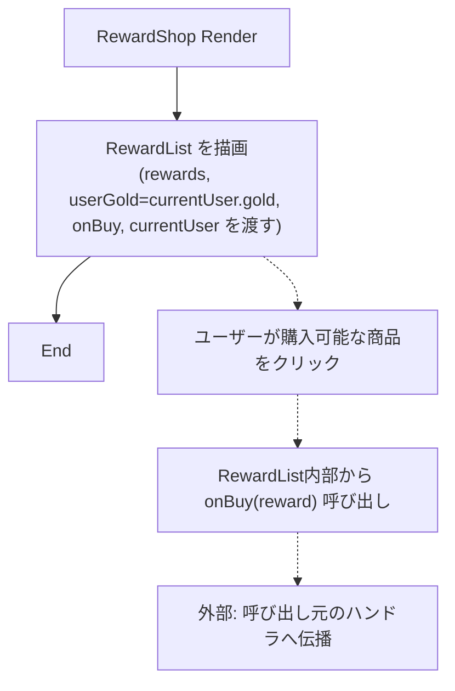
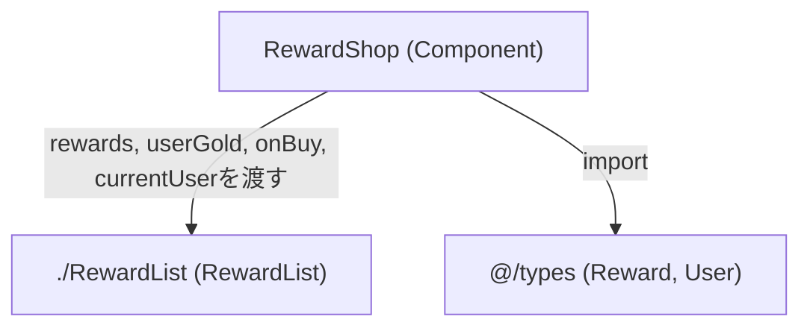

## 1. 解析メタ情報

| 項目 | 内容 |
| --- | --- |
| 対象ファイル | RewardShop.tsx |
| 言語 | React (TypeScript) |
| 解析対象 | 提供されたコードのみ |
| 推測・補完 | 一切なし |

## 関連ドキュメント

- [RewardList.md](RewardList.md) — 購入可能な報酬一覧を描画する子コンポーネントの実装元。本コンポーネントが唯一描画する子コンポーネント。
- [types/index.md](../../../types/index.md) — `Reward`/`User`型定義の提供元。
- [App.md](../../../../App.md) — 縦画面（portrait）側で本コンポーネントを直接呼び出す呼び出し元の可能性がある（本ファイル単体では確認不可、要再解析）。
- [FamilyDashboard.md](../../family/components/FamilyDashboard.md) — 横画面（landscape）側で本コンポーネントを呼び出す呼び出し元の可能性がある（本ファイル単体では確認不可、要再解析）。

## 2. ファイルの概要

「ごほうび」画面を構成するコンポーネント。コメントにより、購入可能な報酬一覧（`RewardList`）のみを表示する画面であること、所持ゴールドは（本コンポーネントの外側にある）ステータスカードに既に表示されているため重複表示しないこと、そして「もちもの（所持品）」は独立した別タブ（`InventoryList`）に戻されたためここでは扱わない、という設計上の経緯が明記されている。本体の処理は`RewardList`へ`props`をそのまま受け渡すのみである。

* 根拠: コンポーネント直前のコメント (行番号: 11〜13 / 抜粋: "// 「ごほうび」画面: 購入可能な報酬一覧のみを表示する。\n// 所持ゴールドはステータスカードに既に表示されているため重複表示しない。\n// もちもの(所持品)は独立した別タブ(InventoryList)に戻したため、ここでは扱わない。")
* 根拠: JSX本体 (行番号: 15〜24 / 抜粋: "return (\n    
\n      <RewardList")

## 3. 外部依存関係

### インポート一覧

| 名称 | 種類 | 用途 | 根拠 |
| --- | --- | --- | --- |
| `React` | ライブラリ | Reactコンポーネントの定義（`React.FC`型の利用） | `import React from 'react';` (行番号: 1) |
| `Reward`, `User` | 型定義 | Propsの型指定（`RewardShopProps`および`onBuy`のシグネチャで使用） | `import { Reward, User } from '@/types';` (行番号: 2) |
| `RewardList` | コンポーネント | 購入可能な報酬一覧の表示（本コンポーネントが描画する唯一の子コンポーネント） | `import RewardList from './RewardList';` (行番号: 3) |

### ブラックボックスとなる外部要素

| 名称 | 理由 | 根拠 |
| --- | --- | --- |
| `RewardList` | 実装ファイルが提供されておらず（本ファイル単体では）、フィルタ・ソート・購入可否判定・購入時の挙動が不明 | `import RewardList from './RewardList';` (行番号: 3) |
| `@/types` の `Reward`, `User` | プロパティの完全な構造が本ファイル内では定義されていないため | `import { Reward, User } from '@/types';` (行番号: 2) |

## 4. 主要要素の定義（関数 / エンドポイント / コンポーネント）

### `RewardShopProps` (型定義)

* **役割**: `RewardShop`コンポーネントが受け取るPropsの型定義。`rewards`（報酬一覧）、`currentUser`（現在のユーザー）、`onBuy`（購入時に呼び出すコールバック）の3つを持つ。
* 根拠: (行番号: 5〜9 / 抜粋: "interface RewardShopProps {\n  rewards: Reward[];\n  currentUser: User;\n  onBuy: (reward: Reward) => void;\n}")

### `RewardShop`

* **役割**: `rewards`, `currentUser.gold`（`userGold`として）, `onBuy`, `currentUser`をそのまま`RewardList`へ渡し、購入可能な報酬一覧を描画する。「ごほうび」画面全体のコンテナとして機能するが、実体はほぼ`RewardList`への薄いラッパーである。
* 根拠: (行番号: 14〜25 / 抜粋: "const RewardShop: React.FC<RewardShopProps> = ({ rewards, currentUser, onBuy }) => {")

* **引数/リクエスト**: `RewardShopProps`（`rewards: Reward[]`, `currentUser: User`, `onBuy: (reward: Reward) => void`）
* 根拠: (行番号: 14 / 抜粋: "const RewardShop: React.FC<RewardShopProps> = ({ rewards, currentUser, onBuy }) => {")

* **戻り値/レスポンス**: JSX.Element（`
`でラップされた`RewardList`）
* 根拠: (行番号: 15〜23 / 抜粋: "return (\n    
")

* **副作用**: なし（純粋なレンダリングのみ。実際の購入副作用は`onBuy`経由で`RewardList`から呼び出し元へ委譲）
* 根拠: `useEffect`等の記述なし、`onBuy`をそのまま`RewardList`に渡すのみ (行番号: 17〜22 / 抜粋: "<RewardList\n        rewards={rewards}\n        userGold={currentUser.gold}\n        onBuy={onBuy}\n        currentUser={currentUser}\n      />")

* **エラーハンドリング**: なし
* 根拠: ファイル内にtry-catchやエラー制御の記述なし (行番号: 14〜25)

### `RewardList`呼び出し部

* **役割**: `rewards`, `currentUser.gold`(`userGold`として、フォールバックなし), `onBuy`, `currentUser`をそのまま`RewardList`コンポーネントへ渡し、購入可能な報酬一覧を描画させる。
* 根拠: (行番号: 17〜22 / 抜粋: "<RewardList\n        rewards={rewards}\n        userGold={currentUser.gold}\n        onBuy={onBuy}\n        currentUser={currentUser}\n      />")

## 5. 処理フロー図

## 6. 依存関係図

## 7. 次のステップ（リバースエンジニアリングの提案）

| 優先度 | ファイル名(推測可) | 理由 | 根拠 |
| --- | --- | --- | --- |
| 高 | `./RewardList.tsx` | 購入可能な報酬のフィルタリング・ソート・購入可否判定の実装を把握するため。本コンポーネントの実質的な処理主体である。 | `import RewardList from './RewardList';` (行番号: 3) |
| 中 | `App.tsx`, `../../family/components/FamilyDashboard.tsx` | 本コンポーネントの呼び出し元（`rewards`/`currentUser`/`onBuy`の実際の渡され方）を確認するため。本ファイルは`ripgrep`検索の結果、両ファイルから参照されていることが確認できたが、実際の呼び出しコード自体は本ファイルの解析対象外である。 | `onBuy: (reward: Reward) => void;` (行番号: 8) |
| 低 | `@/types` (`index.ts`) | `Reward`/`User`型の完全な構造（特に`gold`フィールドの必須性）を確認するため。 | `import { Reward, User } from '@/types';` (行番号: 2) |

## 8. 保守上の注意点

* **旧バージョンからの機能縮小**: 以前のバージョンでは、本コンポーネントが所持ゴールド表示（`CountUp`によるアニメーション付き数値表示）と所持品一覧（`InventoryList`）も自身の内部で描画していたが、現在の実装ではコメントに明記されている通りこれらは削除され、`RewardList`の描画のみを行う。所持ゴールド表示は呼び出し元のステータスカードに、所持品表示は独立タブに、それぞれ役割が移管されている。
* 根拠: (行番号: 11〜13 / 抜粋: "// 「ごほうび」画面: 購入可能な報酬一覧のみを表示する。\n// 所持ゴールドはステータスカードに既に表示されているため重複表示しない。\n// もちもの(所持品)は独立した別タブ(InventoryList)に戻したため、ここでは扱わない。")
* **`currentUser.gold`の未定義防御なし**: `RewardList`への`userGold`propには`currentUser.gold`がフォールバックなし（`|| 0`等の防御処理なし）でそのまま渡されている。`User.gold`が型定義上必須でない場合、`undefined`が伝播する可能性がある。
* 根拠: (行番号: 19 / 抜粋: "userGold={currentUser.gold}")
* **`RewardList`への全面依存**: 本コンポーネント自体はほぼロジックを持たない薄いラッパーであり、購入可否判定・表示ロジックのほぼ全てが`RewardList`側に存在する。本コンポーネントを変更する際は`RewardList`の実装との整合性を確認する必要がある。
* 根拠: (行番号: 17〜22 / 抜粋: "<RewardList\n        rewards={rewards}\n        userGold={currentUser.gold}\n        onBuy={onBuy}\n        currentUser={currentUser}\n      />")

## 9. 不明事項一覧

| 項目 | 理由 | 必要なファイル |
| --- | --- | --- |
| `RewardList`の内部実装 | フィルタリング・ソート・購入可否判定・クリック時の挙動の詳細が本ファイルからは不明なため。 | `./RewardList.tsx` |
| `onBuy`実行後の具体的な挙動 | 呼び出し元でどのように処理されるか（確認モーダルの有無等）は本ファイルからは不明なため。 | `App.tsx`, `../../family/components/FamilyDashboard.tsx` |
| `Reward`/`User`型の完全な構造 | `@/types`の実体が本ファイルには含まれていないため、`gold`フィールドが必須か否か等が不明。 | `@/types` (`index.ts`) |
| 所持ゴールド表示・所持品表示の現在の実装場所 | かつて本コンポーネントが担っていたこれら2機能が、現在具体的にどのコンポーネントへ移管されたかはコメントの記述以上には本ファイルから確認できないため。 | ステータスカード相当のコンポーネント、`InventoryList.tsx`の呼び出し元 |

## 相互参照による補足情報

| 元の不明事項 | 判明した内容 | 参照元ドキュメント |
| --- | --- | --- |
| `RewardList`の内部実装 | `family-quest/src/features/shop/components/RewardList.tsx`を直接確認した。`sortedRewards`(13〜36行目)は`useMemo`で`reward.target`(`'all'`/`'children'`/`'adults'`/`'mom'`/`'dad'`)によるフィルタリングと、`reward.cost_gold || reward.cost`昇順ソートを行う。各カードは`userGold >= cost`で`canAfford`を判定し(46行目)、`onClick={() => canAfford && onBuy(reward)}`(59行目)で購入可能な場合のみ`onBuy`を呼び出す（購入不可時はクリックしても何も起きない）。 | 直接ソース確認: `family-quest/src/features/shop/components/RewardList.tsx:13-65` |
| `onBuy`実行後の具体的な挙動 | `family-quest/src/App.tsx`を直接確認した。`handleBuyReward`(254〜259行目)は`confirmUser`/`confirmTarget`/`confirmMode('purchase')`をセットして購入確認モーダル(`ConfirmModal`)を開き、モーダルで「はい」が選択されると`executeConfirm`(262〜296行目)内で`useGameData`の`buyReward(actingUser, confirmTarget as Reward)`(269行目)が呼ばれる。成功時はトースト表示と`'clear'`音再生(271〜274行目)、失敗時は`resolveErrorText`によるエラーメッセージ表示と`'cancel'`音再生(283〜286行目)を行う。横画面側は`family-quest/src/features/family/components/FamilyDashboard.tsx`の`FamilyPanel`が`onBuyReward={(r) => onBuyReward(user, r)}`(107行目)として同じ`handleBuyReward`に委譲しており、確認モーダルの経路は縦横で共通である。 | 直接ソース確認: `family-quest/src/App.tsx:254-296`, `family-quest/src/features/family/components/FamilyDashboard.tsx:107` |
| `Reward`/`User`型の完全な構造 | `family-quest/src/types/index.ts`を直接確認した。`Reward`(76〜88行目)は`cost: number`が必須、`cost_gold?`/`id?`/`reward_id?`/`desc?`/`description?`/`icon?`/`icon_key?`が任意という構造。`User`(9〜26行目)は`gold: number`が必須(18行目)であり、本ファイルが`RewardList`へフォールバックなしで渡している`currentUser.gold`(19行目)は型定義上`undefined`になり得ないことを確認した。 | 直接ソース確認: `family-quest/src/types/index.ts:9-26,76-88` |
| 所持ゴールド表示・所持品表示の現在の実装場所 | `family-quest/src/features/family/components/UserStatusCard.tsx`と`family-quest/src/App.tsx`、`family-quest/src/features/family/components/FamilyDashboard.tsx`を直接確認した。所持ゴールド表示は`UserStatusCard.tsx`(38〜43行目)が`CountUp`でアニメーション付き表示しており、縦画面では`App.tsx`(416〜419行目)、横画面では`FamilyDashboard.tsx`の`FamilyPanel`(155行目)がそれぞれ`<UserStatusCard user={user} .../>`として描画する。所持品(もちもの)表示は独立タブの`InventoryList`が担い、縦画面は`App.tsx`の`activeTab === 'inventory'`(464〜468行目)、横画面は`FamilyPanel`の`tab === 'inventory'`(208〜210行目)がそれぞれ`InventoryList`を描画する（横画面では`panelMode`付き）。 | 直接ソース確認: `family-quest/src/features/family/components/UserStatusCard.tsx:38-43`, `family-quest/src/App.tsx:416-419,464-468`, `family-quest/src/features/family/components/FamilyDashboard.tsx:155,208-210` |

## 10. 自己検証結果

* [x] 完了: 推測・外部ファイルの仕様を一切含んでいない
* [x] 完了: 全関数・全クラス・全コンポーネントを列挙した
* [x] 完了: 全てのインポート要素を列挙した
* [x] 完了: すべての仕様説明に「根拠（行番号・抜粋）」を明記した
* [x] 完了: 根拠漏れが0件である
* [x] 完了: Mermaid構文にエラーの原因となる記号（エスケープ漏れ）がない
* [x] 完了: 不明事項を漏れなく列挙した
