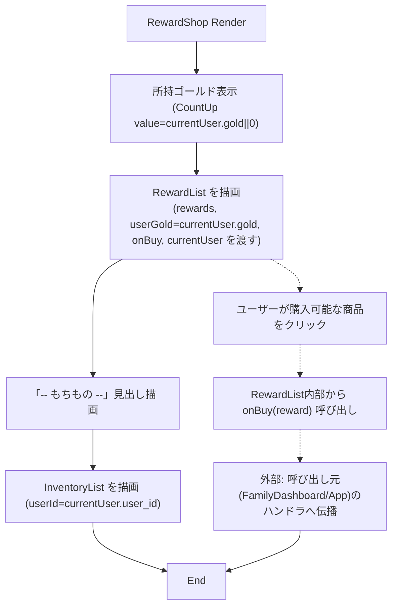
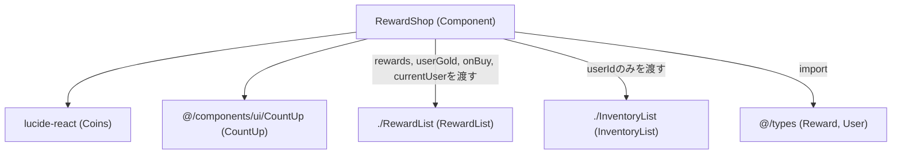

## 1. 解析メタ情報

| 項目 | 内容 |
| --- | --- |
| 対象ファイル | RewardShop.tsx |
| 言語 | React (TypeScript) |
| 解析対象 | 提供されたコードのみ |
| 推測・補完 | 一切なし |

## 2. ファイルの概要

「ごほうび」画面を構成するコンポーネント。所持ゴールド表示 → 購入可能な報酬一覧（`RewardList`） → 所持品（`InventoryList`、使用申請ボタン付き）の順に画面を構成する。コメントにより、`RewardList`（購入）と`InventoryList`（所持品・使用申請）を1画面にまとめ、以前存在した「もちもの」独立タブは廃止された旨が明記されている。

* 根拠: コンポーネント直前のコメント (行番号: 14〜15 / 抜粋: "// 「ごほうび」画面: 所持ゴールド表示 → 購入可能な報酬一覧 → 所持品(使用ボタン付き) の順で構成する。\n// RewardList(購入)とInventoryList(所持品・使用申請)を1画面にまとめ、「もちもの」タブは廃止する。")

## 3. 外部依存関係

### インポート一覧

| 名称 | 種類 | 用途 | 根拠 |
| --- | --- | --- | --- |
| `React` | ライブラリ | Reactコンポーネントの定義 | `import React from 'react';` (行番号: 1) |
| `Coins` | アイコンコンポーネント | 所持ゴールド表示部のアイコン | `import { Coins } from 'lucide-react';` (行番号: 2) |
| `Reward`, `User` | 型定義 | Propsの型指定 | `import { Reward, User } from '@/types';` (行番号: 3) |
| `CountUp` | コンポーネント | 所持ゴールド数値のカウントアップ表示 | `import { CountUp } from '@/components/ui/CountUp';` (行番号: 4) |
| `RewardList` | コンポーネント | 購入可能な報酬一覧の表示 | `import RewardList from './RewardList';` (行番号: 5) |
| `InventoryList` | コンポーネント | 所持品（もちもの）一覧の表示 | `import { InventoryList } from './InventoryList';` (行番号: 6) |

### ブラックボックスとなる外部要素

| 名称 | 理由 | 根拠 |
| --- | --- | --- |
| `CountUp` | 実装ファイルが提供されておらず、アニメーションの詳細やPropsの完全な仕様が不明 | `import { CountUp } from '@/components/ui/CountUp';` (行番号: 4) |
| `RewardList` | 実装ファイルが提供されておらず（本ファイル単体では）、フィルタ・ソート・購入時の挙動が不明 | `import RewardList from './RewardList';` (行番号: 5) |
| `InventoryList` | 実装ファイルが提供されておらず、`userId`のみを受け取った後の内部データ取得・描画方法が不明 | `import { InventoryList } from './InventoryList';` (行番号: 6) |
| `@/types` の `Reward`, `User` | プロパティの完全な構造が本ファイル内では定義されていないため | `import { Reward, User } from '@/types';` (行番号: 3) |

## 4. 主要要素の定義（関数 / エンドポイント / コンポーネント）

### `RewardShopProps` (型定義)

* **役割**: `RewardShop`コンポーネントが受け取るPropsの型定義。
* 根拠: (行番号: 8〜12 / 抜粋: "interface RewardShopProps {\n  rewards: Reward[];\n  currentUser: User;\n  onBuy: (reward: Reward) => void;\n}")

### `RewardShop`

* **役割**: 所持ゴールド表示（`CountUp`によるアニメーション付き数値表示）、購入可能な報酬一覧（`RewardList`）、所持品一覧（`InventoryList`）を縦に並べて描画する。「ごほうび」画面全体のコンテナとして機能する。
* 根拠: (行番号: 16〜42 / 抜粋: "const RewardShop: React.FC<RewardShopProps> = ({ rewards, currentUser, onBuy }) => {")

* **引数/リクエスト**: `RewardShopProps`（`rewards: Reward[]`, `currentUser: User`, `onBuy: (reward: Reward) => void`）
* 根拠: (行番号: 16 / 抜粋: "const RewardShop: React.FC<RewardShopProps> = ({ rewards, currentUser, onBuy }) => {")

* **戻り値/レスポンス**: JSX.Element
* 根拠: (行番号: 17〜41 / 抜粋: "return (\n    
")

* **副作用**: なし（純粋なレンダリングのみ。実際の購入副作用は`onBuy`経由で`RewardList`から呼び出し元へ委譲）
* 根拠: `useEffect`等の記述なし、`onBuy`をそのまま`RewardList`に渡すのみ (行番号: 27〜32 / 抜粋: "<RewardList\n        rewards={rewards}\n        userGold={currentUser.gold}\n        onBuy={onBuy}\n        currentUser={currentUser}\n      />")

* **エラーハンドリング**: なし

### 所持ゴールド表示部

* **役割**: `currentUser.gold`（未定義時は`0`）を`CountUp`コンポーネントでアニメーション表示する。
* 根拠: (行番号: 19〜25 / 抜粋: "
\n        <Coins size={18} className=\"text-yellow-300\" />\n        所持ゴールド\n        \n          <CountUp value={currentUser.gold || 0} suffix=\" G\" />\n        \n      
")

### `RewardList`呼び出し部

* **役割**: `rewards`, `currentUser.gold`(`userGold`として), `onBuy`, `currentUser`をそのまま`RewardList`コンポーネントへ渡し、購入可能な報酬一覧を描画させる。
* 根拠: (行番号: 27〜32 / 抜粋: "<RewardList\n        rewards={rewards}\n        userGold={currentUser.gold}\n        onBuy={onBuy}\n        currentUser={currentUser}\n      />")

### 所持品（もちもの）セクション

* **役割**: 見出し「-- もちもの --」を表示したのち、`currentUser.user_id`のみを渡して`InventoryList`コンポーネントを描画する。
* 根拠: (行番号: 34〜39 / 抜粋: "
\n        
\n          -- もちもの --\n        
\n        <InventoryList userId={currentUser.user_id} />\n      
")

## 5. 処理フロー図

## 6. 依存関係図

## 7. 次のステップ（リバースエンジニアリングの提案）

| 優先度 | ファイル名(推測可) | 理由 | 根拠 |
| --- | --- | --- | --- |
| 高 | `./RewardList.tsx` | 購入可能な報酬のフィルタリング・ソート・購入可否判定の実装を把握するため。 | `import RewardList from './RewardList';` (行番号: 5) |
| 高 | `./InventoryList.tsx` | `userId`のみを受け取った後、内部でどのようにデータを取得・表示し、使用申請を行っているかを把握するため。 | `import { InventoryList } from './InventoryList';` (行番号: 6) |
| 中 | `@/components/ui/CountUp` | 数値カウントアップアニメーションの実装・Propsの仕様を確認するため。 | `import { CountUp } from '@/components/ui/CountUp';` (行番号: 4) |
| 中 | `../../family/components/FamilyDashboard.tsx`, `App.tsx` | 本コンポーネントの呼び出し元における`onBuy`の実装（購入確認モーダル経由の呼び出し方）を確認するため。 | `onBuy: (reward: Reward) => void;` (行番号: 11) |

## 8. 保守上の注意点

* **「もちもの」タブ廃止によるUI統合**: コメントにより、以前は独立していた「もちもの」タブが廃止され、`RewardList`（購入）と`InventoryList`（所持品）が1画面（本コンポーネント）に統合されたことが明記されている。今後、購入と所持品閲覧を再度分離する場合は、この統合構造を踏まえて設計する必要がある。
* 根拠: (行番号: 14〜15 / 抜粋: "// RewardList(購入)とInventoryList(所持品・使用申請)を1画面にまとめ、「もちもの」タブは廃止する。")
* **`currentUser.gold`の未定義防御**: 所持ゴールド表示部は`currentUser.gold || 0`でフォールバックしているが、`RewardList`への`userGold`propには`currentUser.gold`をそのまま（フォールバックなしで）渡している。`User.gold`は型定義上必須（`gold: number`）のため通常は問題にならないが、表示部とpropsで防御の有無が異なる点に留意が必要。
* 根拠: (行番号: 23, 29行目 / 抜粋: "<CountUp value={currentUser.gold || 0} suffix=\" G\" />", "userGold={currentUser.gold}")
* **`InventoryList`へは`userId`のみを渡す設計**: `rewards`や`onBuy`とは異なり、`InventoryList`には`currentUser.user_id`のみが渡されており、所持品データの取得は`InventoryList`内部（本ファイルの外）で行われることが窺える。
* 根拠: (行番号: 38 / 抜粋: "<InventoryList userId={currentUser.user_id} />")

## 9. 不明事項一覧

| 項目 | 理由 | 必要なファイル |
| --- | --- | --- |
| `RewardList`の内部実装 | フィルタリング・ソート・購入可否判定・クリック時の挙動の詳細が本ファイルからは不明なため。 | `./RewardList.tsx` |
| `InventoryList`の内部実装 | `userId`のみを受け取った後のデータ取得方法（API呼び出し等）や使用申請フローが本ファイルからは不明なため。 | `./InventoryList.tsx` |
| `CountUp`のアニメーション仕様 | `value`/`suffix`以外のPropsや、値変化時のアニメーション挙動の詳細が不明なため。 | `@/components/ui/CountUp.tsx` |
| `onBuy`実行後の具体的な挙動 | 呼び出し元（`FamilyDashboard`/`App.tsx`）でどのように処理されるか（確認モーダルの有無等）は本ファイルからは不明なため。 | `../../family/components/FamilyDashboard.tsx`, `App.tsx` |

## 10. 自己検証結果

* [x] 完了: 推測・外部ファイルの仕様を一切含んでいない
* [x] 完了: 全関数・全クラス・全コンポーネントを列挙した
* [x] 完了: 全てのインポート要素を列挙した
* [x] 完了: すべての仕様説明に「根拠（行番号・抜粋）」を明記した
* [x] 完了: 根拠漏れが0件である
* [x] 完了: Mermaid構文にエラーの原因となる記号（エスケープ漏れ）がない
* [x] 完了: 不明事項を漏れなく列挙した
