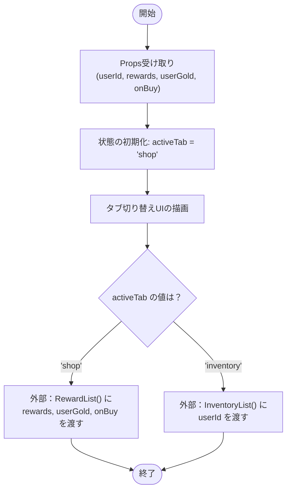
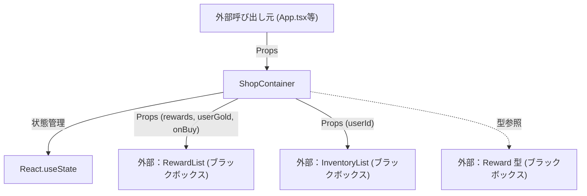

## 1. 解析メタ情報

| 項目 | 内容 |
| --- | --- |
| 対象ファイル | ShopContainer.tsx |
| 言語 | React (TypeScript) |
| 解析対象 | 提供されたコードのみ |
| 推測・補完 | 一切なし |

## 2. ファイルの概要

* 「お店」と「もちもの」の2つのタブを切り替えるUIコンポーネントを提供する。
* ユーザーの操作（タブのクリック）に応じて内部状態を変更し、それに対応する外部コンポーネント（`RewardList` または `InventoryList`）をマウント・表示する役割を持つ。
* 根拠: `ShopContainer` (行番号: 15-64 / 抜粋: "export const ShopContainer: Re")
* 根拠: `activeTab`の状態に応じたレンダリング分岐 (行番号: 45-60 / 抜粋: "{activeTab === 'shop' ? (...")

## 3. 外部依存関係

### インポート一覧

| 名称 | 種類 | 用途 | 根拠 |
| --- | --- | --- | --- |
| `React`, `useState` | モジュール | Reactコア機能、タブ切り替え用の状態管理 | `import React, { useState } fro` (行番号: 2) |
| `RewardList` | コンポーネント | 「お店」タブ選択時に表示するリスト要素の描画 | `import RewardList from './Rewa` (行番号: 3) |
| `InventoryList` | コンポーネント | 「もちもの」タブ選択時に表示するリスト要素の描画 | `import { InventoryList } from ` (行番号: 4) |
| `Reward` | 型定義 | Props（`rewards`、`onBuy`）の型指定 | `import { Reward } from '@/type` (行番号: 5) |

### ブラックボックスとなる外部要素

| 名称 | 理由 | 根拠 |
| --- | --- | --- |
| `RewardList` | 実装ファイルが存在せず、内部ロジックやレンダリング内容が判断不可のため。 | `<RewardList rewards={rewards} ` (行番号: 47) |
| `InventoryList` | 実装ファイルが存在せず、内部ロジックやレンダリング内容が判断不可のため。 | `<InventoryList userId={userId}` (行番号: 58) |
| `Reward` | 型定義ファイルが存在せず、具体的なプロパティ構造が判断不可のため。 | `rewards: Reward[];` (行番号: 10) |
| `App.tsx` | 本コンポーネントの呼び出し元としてコメントに記載があるが、実装は未提供のため。 | `// App.tsx から受け取るデータの型定義` (行番号: 7) |

## 4. 主要要素の定義（関数 / エンドポイント / コンポーネント）

### `Props`

* **役割**: `ShopContainer`コンポーネントが親コンポーネント（`App.tsx`等）から受け取るプロパティの型定義。
* 根拠: `Props` (行番号: 8-13 / 抜粋: "type Props = {")

* **プロパティ一覧**:
* `userId` (string): ユーザーの識別子。
* 根拠: `userId` (行番号: 9 / 抜粋: "userId: string;")

* `rewards` (Reward[]): 提供される報酬の配列。
* 根拠: `rewards` (行番号: 10 / 抜粋: "rewards: Reward[];")

* `userGold` (number): ユーザーの所持ゴールド。
* 根拠: `userGold` (行番号: 11 / 抜粋: "userGold: number;")

* `onBuy` (関数): 報酬購入時に実行されるコールバック関数。引数に`Reward`を受け取る。
* 根拠: `onBuy` (行番号: 12 / 抜粋: "onBuy: (reward: Reward) => voi")

### `ShopContainer`

* **役割**: Propsを受け取り、状態管理を用いて「お店」または「もちもの」コンポーネントを切り替えて描画する。
* 根拠: `ShopContainer` (行番号: 15-64 / 抜粋: "export const ShopContainer: Re")

* **引数/リクエスト**: `Props` (`userId`, `rewards`, `userGold`, `onBuy`)
* 根拠: コンポーネント引数 (行番号: 15 / 抜粋: "({ userId, rewards, userGold, ")

* **戻り値/レスポンス**: React要素 (`JSX.Element`)。内部にタブ切替ボタンとコンテンツエリアを持つ`div`タグを返す。
* 根拠: return文 (行番号: 19-63 / 抜粋: "return ( <div className="space")

* **状態管理 (State)**: `activeTab` ('shop' または 'inventory' の文字列)。初期値は 'shop'。
* 根拠: `useState` (行番号: 17 / 抜粋: "const [activeTab, setActiveTab")

* **副作用**: なし
* 根拠: コンポーネント内に外部通信やDOM直接操作などの処理が存在しない (行番号: 15-64)

* **エラーハンドリング**: なし（例外捕捉の記述なし）
* 根拠: try-catch文やError Boundaryが存在しない (行番号: 15-64)

## 5. 処理フロー図

## 6. 依存関係図

## 7. 次のステップ（リバースエンジニアリングの提案）

| 優先度 | ファイル名(推測可) | 理由 | 根拠 |
| --- | --- | --- | --- |
| 高 | `./RewardList.tsx` | 「お店」タブの実体であり、購入処理（`onBuy`）がどのようにトリガーされるかを把握する必要があるため。 | `import RewardList from './Rewa` (行番号: 3) |
| 高 | `./InventoryList.tsx` | 「もちもの」タブの実体であり、`userId`を元にどのようにデータを取得・表示しているか仕様を確認する必要があるため。 | `import { InventoryList } from ` (行番号: 4) |
| 中 | `@/types.ts` | `Reward`型の具体的なデータ構造を特定することで、コンポーネント間で受け渡しされるデータの全容を把握できるため。 | `import { Reward } from '@/type` (行番号: 5) |
| 低 | `App.tsx` | 本コンポーネントへのPropsの供給元であり、実際のデータ取得元（API連携など）を追跡するために必要となるため。 | `// App.tsx から受け取るデータの型定義` (行番号: 7) |

## 8. 保守上の注意点

* `RewardList`のインポートに関して、コード上に `// default export か named export か確認してください` というコメントが残置されている。現状はdefault exportとして記述されているが、インポートエラーが発生するリスクがある。
* Propsに対するnullチェックやundefinedの代替値が設定されておらず、親コンポーネントから無効な値が渡された際、子コンポーネント（`RewardList`等）でエラーが発生する可能性がある。

## 9. 不明事項一覧

| 項目 | 理由 | 必要なファイル |
| --- | --- | --- |
| `RewardList`の正しいインポート方式 | 該当ファイルの実装が確認できず、コメントにある懸念が解消できないため。 | `./RewardList.tsx` |
| `Reward`のプロパティ構造 | 型定義ファイルが存在せず、IDや名前、価格などの具体的な要素が不明なため。 | `@/types.ts` （または該当の型定義ファイル） |
| 子コンポーネントの詳細な挙動 | `RewardList`および`InventoryList`内部のロジックが不明であるため。 | `./RewardList.tsx`, `./InventoryList.tsx` |

## 10. 自己検証結果

* [x] 推測・外部ファイルの仕様を一切含んでいない
* [x] 全関数・全クラス・全コンポーネントを列挙した
* [x] 全てのインポート要素を列挙した
* [x] すべての仕様説明に「根拠（行番号・抜粋）」を明記した
* [x] 根拠漏れが0件である
* [x] Mermaid構文にエラーの原因となる記号（エスケープ漏れ）がない
* [x] 不明事項を漏れなく列挙した
* [x] 完了