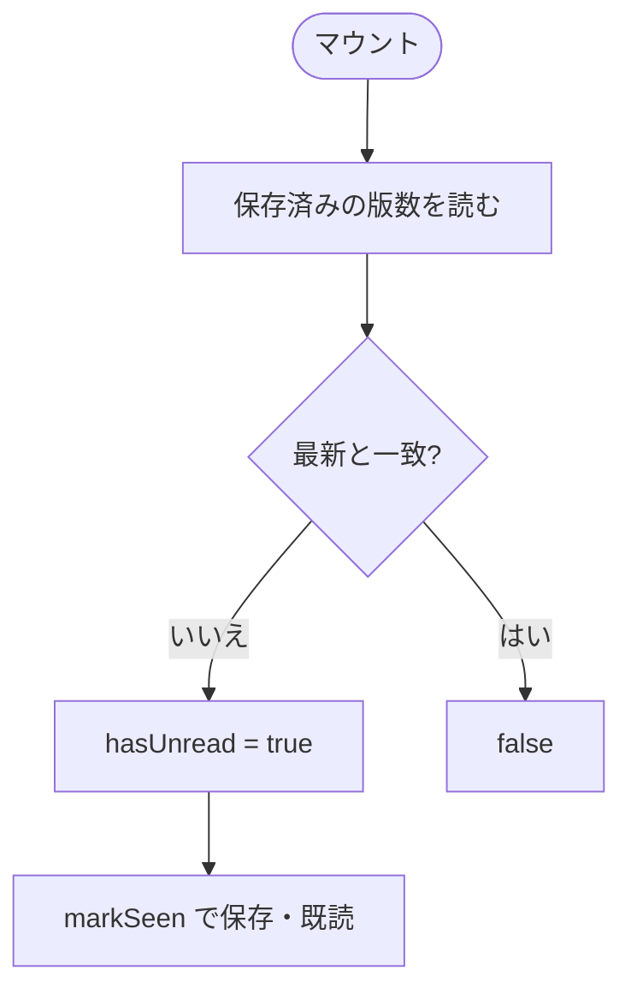
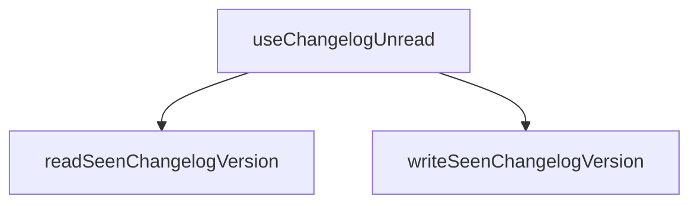

## 1. 解析メタ情報

| 項目 | 内容 |
| --- | --- |
| 対象ファイル | useChangelogUnread.ts |
| 言語 | React (TypeScript) |
| 解析対象 | 提供されたコードのみ |
| 推測・補完 | 一切なし |

## 関連ドキュメント

* [../lib/changelogSeen.md](../lib/changelogSeen.md) - 既読の保存・読み出し
* [../components/layout/UpdateNoticeBanner.md](../components/layout/UpdateNoticeBanner.md) - 未読時に出す帯
* [../../App.md](../../App.md) - 呼び出し元

## 2. ファイルの概要

* 最新のアップデートをこの端末でまだ見ていないかを返すフック `useChangelogUnread`。`markSeen()` で既読にすると、次に `CHANGELOG` へ新しい版が追記されるまでバッジ・帯が出なくなる。
* 根拠: `export function useChangelogUnread() {` (行番号: 10 / 抜粋: "export function useChangelogUnread() {")

## 3. 外部依存関係

### インポート一覧

| 名称 | 種類 | 用途 | 根拠 |
| --- | --- | --- | --- |
| `useCallback, useState` | 関数 | 状態保持 | 根拠: `import { useCallback, useState } from 'react';` (行番号: 1 / 抜粋: "import { useCallback, useState } from 'react';") |
| `changelogSeen の各関数` | 関数/定数 | 既読の保存・読み出し | 根拠: `} from '../lib/changelogSeen';` (行番号: 6 / 抜粋: "} from '../lib/changelogSeen';") |

### ブラックボックスとなる外部要素

| 名称 | 理由 | 根拠 |
| --- | --- | --- |
| 各importの実装 | 本ファイル外のため | 根拠: import文 (行番号: 1 / 抜粋: 判断不可) |

## 4. 主要要素の定義（関数 / エンドポイント / コンポーネント）

### useChangelogUnread

* **役割**: 未読判定と既読化。
* 根拠: `export function useChangelogUnread() {` (行番号: 10 / 抜粋: "export function useChangelogUnread() {")
* **引数/リクエスト**: なし
* **戻り値/レスポンス**: `{ hasUnread, latest, markSeen }`
* **副作用**: `markSeen` で localStorage に最新版数を保存し、state を更新
* **エラーハンドリング**: 保存失敗時も例外にしない（changelogSeen側）

## 5. 処理フロー図

## 6. 依存関係図

## 7. 次のステップ（リバースエンジニアリングの提案）

| 優先度 | ファイル名(推測可) | 理由 |
| --- | --- | --- |
| 低 | `family-quest/src/App.tsx` | 結線の確認 |

## 8. 保守上の注意点

* 保存が使えない環境では、リロードのたびに未読扱いに戻る（画面は壊れない）。

## 9. 不明事項一覧

| 項目 | 理由 | 必要なファイル |
| --- | --- | --- |
| なし | － | － |

## 10. 自己検証結果

* [x] 推測・外部ファイルの仕様を一切含んでいない
* [x] 全関数・全クラス・全コンポーネントを列挙した
* [x] 全てのインポート要素を列挙した
* [x] すべての仕様説明に「根拠（行番号・抜粋）」を明記した
* [x] 根拠漏れが0件である
* [x] Mermaid構文にエラーの原因となる記号（エスケープ漏れ）がない
* [x] 不明事項を漏れなく列挙した
