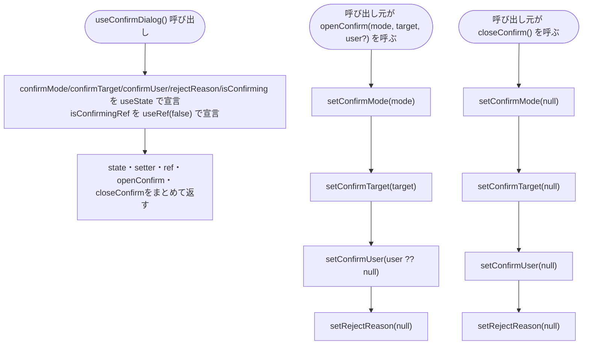
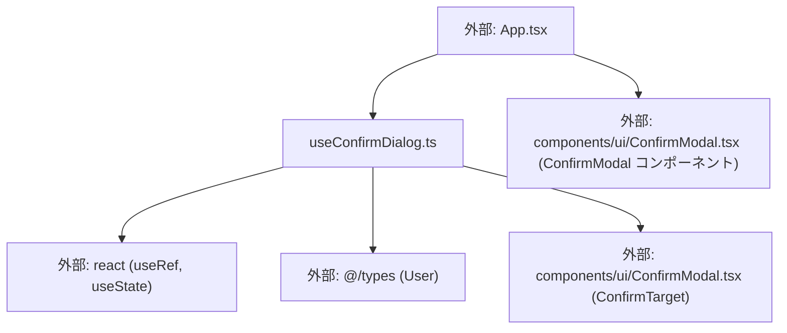

## 1. 解析メタ情報

| 項目 | 内容 |
| --- | --- |
| 対象ファイル | useConfirmDialog.ts (family-quest/src/hooks/useConfirmDialog.ts) |
| 言語 | TypeScript (React Hook) |
| 解析対象 | 提供されたコードのみ |
| 推測・補完 | 一切なし |
| 解析基準コミット | `f06eef5` |

## 関連ドキュメント

* [../../App.md](../../App.md) - 唯一の呼び出し元。返り値のstate/setter/refをそのまま使い、`handleQuestClick`/`handleBuyReward`/`handleReject`/`executeConfirm`/`ConfirmModal`の`onCancel`から`openConfirm`/`closeConfirm`を呼ぶ
* [../components/ui/ConfirmModal.md](../components/ui/ConfirmModal.md) - `ConfirmTarget`型のimport元。本フックが管理する`confirmTarget`stateの型として使われる
* [../types/index.md](../types/index.md) - `User`型の定義元

## 2. ファイルの概要

* 完了・購入・却下の確認モーダルまわりの状態クラスタ（`confirmMode`/`confirmTarget`/`confirmUser`/`rejectReason`/`isConfirming`）と、それらをまとめて更新する2つのヘルパー関数`openConfirm`/`closeConfirm`を提供するカスタムフック`useConfirmDialog`。**（Issue #552で`App.tsx`から新規抽出）** 以前は`App.tsx`が個別に持っていた17個の`useState`のうち5つ（`confirmMode`/`confirmTarget`/`confirmUser`/`rejectReason`/`isConfirming`）と、連打防止ガード用の`isConfirmingRef`（Issue #101）を本フックへ集約したもの。確認モーダルの実際の実行処理（API呼び出し・メダル演出等）は`useGameData`の他の状態・ハンドラーと密結合であるため、意図的に`App.tsx`側に残されている。
* 根拠: ファイル冒頭のコメント (行番号: 7〜10 / 抜粋: "// #552: 完了・購入・却下の確認モーダルまわりの状態(App.tsxの17個のuseStateのうち\n// confirmMode/confirmTarget/confirmUser/rejectReason/isConfirmingの5つ)をまとめて\n// 抱えるフック。実行そのもの(API呼び出し・メダル演出等)はApp.tsx側に残す\n// (useGameDataの他の状態・handlerと密結合なため)。")

## 3. 外部依存関係

### インポート一覧

| 名称 | 種類 | 用途 | 根拠 |
| --- | --- | --- | --- |
| `useRef`, `useState` | Reactフック | `isConfirmingRef`の保持、各stateの宣言 | 根拠: (行番号: 1 / 抜粋: "import { useRef, useState } from 'react';") |
| `User` | 型定義 | `confirmUser`stateおよび`openConfirm`引数の型 | 根拠: (行番号: 2 / 抜粋: "import { User } from '@/types';") |
| `ConfirmTarget` | 型定義 | `confirmTarget`stateおよび`openConfirm`引数の型 | 根拠: (行番号: 3 / 抜粋: "import { ConfirmTarget } from '@/components/ui/ConfirmModal';") |

### ブラックボックスとなる外部要素

| 名称 | 理由 | 根拠 |
| --- | --- | --- |
| `ConfirmTarget` | 型のUnion構成（`Quest`/`QuestHistory`/`Reward`）の詳細は本ファイルからは分からない（`ConfirmModal.md`で解析済み） | 根拠: (行番号: 3 / 抜粋: "import { ConfirmTarget } from '@/components/ui/ConfirmModal';") |

## 4. 主要要素の定義（関数 / エンドポイント / コンポーネント）

### `ConfirmMode` (export型定義)

* **役割**: 確認モーダルのモードを表すUnion型。`ConfirmModal.tsx`側の`mode`propは`| null`を含むが、本フックの`ConfirmMode`自体は`null`を含まない3値のみ。
* 根拠: (行番号: 5 / 抜粋: "export type ConfirmMode = 'complete' | 'purchase' | 'reject';")

### `useConfirmDialog` (export関数、カスタムフック)

* **役割**: `confirmMode`（`ConfirmMode | null`、既定`null`）、`confirmTarget`（`ConfirmTarget | null`、既定`null`）、`confirmUser`（`User | null`、既定`null`。横画面の4人表示では「今アクティブなユーザー」が存在しないため、どのパネルの操作かを明示的に持つ。承認/却下は別途「親」固定で扱うためここでは使われない）、`rejectReason`（`string | null`、既定`null`）、`isConfirming`（`boolean`、既定`false`）の5つの`useState`と、連打防止用の`isConfirmingRef`（`useRef(false)`。Issue #101: レスポンス前の同期的な連打はstate更新の反映を待たずに発生しうるため、判定には`useState`単独ではなくrefを使い、ボタンの見た目のdisabled/ローディング表示には対になるstateを使う）を宣言する。`openConfirm(mode, target, user = null)`は`confirmMode`/`confirmTarget`/`confirmUser`をセットし、`rejectReason`を`null`にリセットする（既存のrejectReasonを新しいダイアログには持ち越さない）。`closeConfirm()`は`confirmMode`/`confirmTarget`/`confirmUser`/`rejectReason`の4つすべてを`null`に戻す。戻り値はこれら5つのstate、`setRejectReason`/`setIsConfirming`の2つのsetter、`isConfirmingRef`、`openConfirm`/`closeConfirm`をまとめたオブジェクト。
* 根拠: (行番号: 11〜53 / 抜粋: "export function useConfirmDialog() {")
* 根拠: 5つの`useState`宣言 (行番号: 13〜18 / 抜粋: "const [confirmMode, setConfirmMode] = useState<ConfirmMode | null>(null);\n    const [confirmTarget, setConfirmTarget] = useState<ConfirmTarget | null>(null);\n    // クエスト完了/購入を実行する当人。横画面の4人表示では「今アクティブなユーザー」が\n    // 存在しないため、どのパネルの操作かをここで明示的に持つ(承認/却下は別途「親」固定で扱う)。\n    const [confirmUser, setConfirmUser] = useState<User | null>(null);\n    const [rejectReason, setRejectReason] = useState<string | null>(null);")
* 根拠: `isConfirming`/`isConfirmingRef`宣言とIssue #101のコメント (行番号: 19〜24 / 抜粋: "// #101: 確認モーダルの「はい」連打による二重実行(例: 購入の二重成立)を防ぐガード。\n    // レスポンス前の同期的な連打はstate更新の反映(再レンダー)を待たずに発生しうるため、\n    // 判定にはuseState単独ではなくrefを使い、ボタンの見た目のdisabled/ローディング表示には\n    // 対になるstateを使う。\n    const [isConfirming, setIsConfirming] = useState(false);\n    const isConfirmingRef = useRef(false);")
* 根拠: `openConfirm` (行番号: 26〜32 / 抜粋: "// 確認ダイアログを開く。既存のrejectReasonは新しいダイアログには持ち越さない。\n    const openConfirm = (mode: ConfirmMode, target: ConfirmTarget, user: User | null = null) => {\n        setConfirmMode(mode);\n        setConfirmTarget(target);\n        setConfirmUser(user);\n        setRejectReason(null);\n    };")
* 根拠: `closeConfirm` (行番号: 34〜39 / 抜粋: "const closeConfirm = () => {\n        setConfirmMode(null);\n        setConfirmTarget(null);\n        setConfirmUser(null);\n        setRejectReason(null);\n    };")
* 根拠: 戻り値オブジェクト (行番号: 41〜52 / 抜粋: "return {\n        confirmMode,\n        confirmTarget,\n        confirmUser,\n        rejectReason,\n        setRejectReason,\n        isConfirming,\n        setIsConfirming,\n        isConfirmingRef,\n        openConfirm,\n        closeConfirm,\n    };")

* **引数/リクエスト**: なし
* 根拠: (行番号: 11 / 抜粋: "export function useConfirmDialog() {")

* **戻り値/レスポンス**: `{ confirmMode, confirmTarget, confirmUser, rejectReason, setRejectReason, isConfirming, setIsConfirming, isConfirmingRef, openConfirm, closeConfirm }`
* 根拠: (行番号: 41〜52)

* **副作用**: 5つの`useState`と1つの`useRef`の宣言。`openConfirm`/`closeConfirm`はいずれもクロージャ内で複数のsetterを呼ぶ（`openConfirm`は4つ中3つをセット+`rejectReason`をリセット、`closeConfirm`は4つ全てをリセット。`isConfirming`/`isConfirmingRef`はどちらの関数からも変更されない）
* **エラーハンドリング**: なし（単純なstate更新のみで例外を投げうる処理は含まない）

## 5. 処理フロー図

## 6. 依存関係図

## 7. 次のステップ（リバースエンジニアリングの提案）

| 優先度 | ファイル名(推測可) | 理由 | 根拠 |
| --- | --- | --- | --- |
| 高 | `../../App.tsx` | `isConfirmingRef`を使った実際の連打防止ガード（`executeConfirm`）、および`openConfirm`/`closeConfirm`の呼び出し箇所（`handleQuestClick`/`handleBuyReward`/`handleReject`/`ConfirmModal`の`onCancel`）を確認するため | 根拠: 関連ドキュメント参照 |
| 中 | `../components/ui/ConfirmModal.tsx` | `ConfirmTarget`型の実際の構成、および本フックの戻り値がどのようにpropsとして渡されるかを確認するため（既に`ConfirmModal.md`で解析済み） | 根拠: 関連ドキュメント参照 |

## 8. 保守上の注意点

* **実行ロジックはこのフックの外にある**: 本フックはstateの保持と開閉ヘルパーのみを提供し、確認後の実際のAPI呼び出し・成功/失敗時の演出は`App.tsx`の`executeConfirm`が担う。確認フローの挙動を変える場合、本フックではなく`App.tsx`側を確認すること。
* **`isConfirmingRef`は本フックが宣言するが、実際にtrue/falseを切り替えるのは`App.tsx`側**: 本フックの`useConfirmDialog`関数自体は`isConfirmingRef.current`を一度も読み書きしない（宣言して返すのみ）。連打防止ガードの実際の判定・設定・解除ロジックは呼び出し元（`App.tsx`の`executeConfirm`）にある。
* **`confirmUser`は却下（reject）では使われない設計**: コメントの通り、却下は`getRepresentativeParent`で親を確定するため、呼び出し元は`openConfirm('reject', history)`のように第3引数（`user`）を省略して呼ぶことが想定されている（本フック自体は`user`が省略されれば既定値`null`を`confirmUser`にセットするのみで、この用途の強制は行わない）。

## 9. 不明事項一覧

なし（本ファイル単体で完結するstate管理フックであり、外部依存の不明点は`ConfirmModal.md`側で解消済み）。

## 相互参照による補足情報

なし。

## 10. 自己検証結果

* [x] 推測・外部ファイルの仕様を一切含んでいない
* [x] 全関数・全クラス・全コンポーネントを列挙した
* [x] 全てのインポート要素を列挙した
* [x] すべての仕様説明に「根拠（行番号・抜粋）」を明記した
* [x] 根拠漏れが0件である
* [x] Mermaid構文にエラーの原因となる記号（エスケープ漏れ）がない
* [x] 不明事項を漏れなく列挙した
