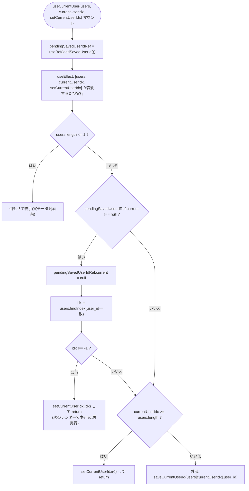
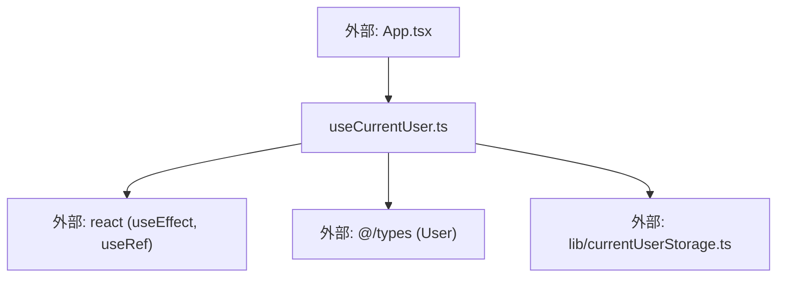

## 1. 解析メタ情報

| 項目 | 内容 |
| --- | --- |
| 対象ファイル | useCurrentUser.ts (family-quest/src/hooks/useCurrentUser.ts) |
| 言語 | TypeScript (React Hook) |
| 解析対象 | 提供されたコードのみ |
| 推測・補完 | 一切なし |
| 解析基準コミット | `f06eef5` |

## 関連ドキュメント

* [../../App.md](../../App.md) - 唯一の呼び出し元。`users`, `currentUserIdx`, `setCurrentUserIdx`を渡す（`currentUserIdx`自体の`useState`はApp.tsx側に残る）
* [../lib/currentUserStorage.md](../lib/currentUserStorage.md) - `loadSavedUserId`/`saveCurrentUserId`の実装元
* [../types/index.md](../types/index.md) - `User`型の定義元

## 2. ファイルの概要

* 選択中ユーザー（`currentUserIdx`）の永続化に関わる副作用（`localStorage`からの初期解決、およびその後の変化の保存）だけを引き受けるカスタムフック`useCurrentUser`を提供する。**（Issue #552で`App.tsx`から新規抽出）** 以前は`App.tsx`内に直接書かれていた`pendingSavedUserIdRef`と対応する`useEffect`（Issue #393で追加）を、本フックへ切り出したもの。`currentUserIdx`自体の`useState`宣言は、CLAUDE.mdの規約（`viewMode`/`activeTab`/`currentUserIdx`はApp.tsxのトップレベル状態として残す）に従い`App.tsx`側に残されており、本フックは`currentUserIdx`の値と更新関数を引数として受け取るのみで自前の状態は持たない（`pendingSavedUserIdRef`という内部`useRef`のみを保持する）。
* 根拠: ファイル冒頭のコメント (行番号: 5〜14 / 抜粋: "// #393: usersが実データに揃ったら、保存済みuser_idをfindIndexで一度だけ解決する。\n// 見つからなければ(メンバー削除・初回起動等)0番目にフォールバックする。\n// また、以後のcurrentUserIdxの変化(ユーザー切替)を都度localStorageへ保存する。\n// users.length <= 1 の間はまだ INITIAL_USERS のフォールバック(guest 1人)の可能性があり、\n// それを保存してしまうと起動のたびに実データ到着前の一瞬で正しい保存値を消してしまうため、\n// 解決・保存のどちらもスキップする。\n//\n// #552: currentUserIdx 自体のuseStateはCLAUDE.mdの記述どおりApp.tsxのトップレベル状態として\n// 残し、このフックはその値の初期解決とlocalStorageへの永続化(=「現在ユーザー選択の状態」の\n// 周辺ロジック)だけを引き受ける。")

## 3. 外部依存関係

### インポート一覧

| 名称 | 種類 | 用途 | 根拠 |
| --- | --- | --- | --- |
| `useEffect`, `useRef` | Reactフック | 副作用の実行、`pendingSavedUserIdRef`の保持 | 根拠: (行番号: 1 / 抜粋: "import { useEffect, useRef } from 'react';") |
| `User` | 型定義 | `users`引数の要素型 | 根拠: (行番号: 2 / 抜粋: "import { User } from '@/types';") |
| `loadSavedUserId`, `saveCurrentUserId` | 関数 | `localStorage`からの読み出し・書き込み | 根拠: (行番号: 3 / 抜粋: "import { loadSavedUserId, saveCurrentUserId } from '@/lib/currentUserStorage';") |

### ブラックボックスとなる外部要素

| 名称 | 理由 | 根拠 |
| --- | --- | --- |
| `loadSavedUserId`, `saveCurrentUserId` | 内部の`localStorage`アクセス・エラーハンドリングの詳細は本ファイルからは不明（`currentUserStorage.md`で解析済み） | 根拠: (行番号: 3 / 抜粋: "import { loadSavedUserId, saveCurrentUserId } from '@/lib/currentUserStorage';") |

## 4. 主要要素の定義（関数 / エンドポイント / コンポーネント）

### `useCurrentUser` (export関数、カスタムフック)

* **役割**: `users`が実データ（`users.length > 1`。`INITIAL_USERS`は1件のみのため、これでフォールバックデータとの区別に使う）に揃った時点のeffectで、マウント時に一度だけ`loadSavedUserId()`の結果を保持した`pendingSavedUserIdRef`から`users.findIndex(u => u.user_id === savedUserId)`により対応する`currentUserIdx`を一度だけ解決し`setCurrentUserIdx`で反映する（見つからなければ`pendingSavedUserIdRef.current`をnullにクリアして次の分岐へ進む）。続けて`currentUserIdx`が`users.length`以上（メンバー減少等で範囲外）なら`0`へクランプし、それ以外は現在の`users[currentUserIdx]`の`user_id`を`saveCurrentUserId`で保存する。この一連の処理は`users.length <= 1`（＝まだ`INITIAL_USERS`のフォールバックの可能性がある）間はスキップされ、実データ到着前に`guest`を保存して既存の保存値を消してしまうのを防ぐ。
* 根拠: (行番号: 15〜47 / 抜粋: "export function useCurrentUser(\n    users: User[],\n    currentUserIdx: number,\n    setCurrentUserIdx: (idx: number) => void,\n): void {")
* 根拠: `pendingSavedUserIdRef`の初期化 (行番号: 20〜23 / 抜粋: "// 起動時にlocalStorageへ保存されたuser_idを一度だけ解決するための保持先。\n    // 実データ(users)が届くまではINITIAL_USERSの1人(guest)しか無く解決しようがないため、\n    // 下のuseEffectで実データが揃うまで待つ。\n    const pendingSavedUserIdRef = useRef<string | null>(loadSavedUserId());")
* 根拠: `users.length <= 1`時のスキップ (行番号: 26 / 抜粋: "if (users.length <= 1) return;")
* 根拠: 保存済みuser_idの解決 (行番号: 28〜36 / 抜粋: "const savedUserId = pendingSavedUserIdRef.current;\n        if (savedUserId !== null) {\n            pendingSavedUserIdRef.current = null;\n            const idx = users.findIndex(u => u.user_id === savedUserId);\n            if (idx !== -1) {\n                setCurrentUserIdx(idx);\n                return; // 次のレンダーで本effectが再実行され、保存処理まで進む\n            }\n        }")
* 根拠: 範囲外クランプ (行番号: 38〜42 / 抜粋: "// メンバーが減った等でindexが範囲外になった場合は0番目にクランプする\n        if (currentUserIdx >= users.length) {\n            setCurrentUserIdx(0);\n            return;\n        }")
* 根拠: 保存処理 (行番号: 44〜45 / 抜粋: "const user = users[currentUserIdx];\n        if (user) saveCurrentUserId(user.user_id);")

* **引数/リクエスト**: `users: User[]`, `currentUserIdx: number`, `setCurrentUserIdx: (idx: number) => void`
* 根拠: (行番号: 16〜19)

* **戻り値/レスポンス**: なし (`void`)
* 根拠: (行番号: 19 / 抜粋: "): void {")

* **副作用**: `pendingSavedUserIdRef`（`useRef`）の生成・更新、`useEffect`内での`setCurrentUserIdx`呼び出し（保存済みuser_id解決時、または範囲外クランプ時）、`saveCurrentUserId`呼び出し（それ以外の通常経路）
* 根拠: (行番号: 23, 25〜46)

* **エラーハンドリング**: 明示的な例外処理は無い。`users.findIndex`が見つからない場合や`users[currentUserIdx]`が`undefined`の場合は、後続の条件分岐（`idx !== -1`チェック、`if (user)`チェック）で静かにスキップされる。

## 5. 処理フロー図

## 6. 依存関係図

## 7. 次のステップ（リバースエンジニアリングの提案）

| 優先度 | ファイル名(推測可) | 理由 | 根拠 |
| --- | --- | --- | --- |
| 中 | `../../App.tsx` | `currentUserIdx`の`useState`宣言、および本フックの実際の呼び出し箇所・`users`の由来（`useGameData`）を確認するため | 根拠: 関連ドキュメント参照 |
| 低 | `../lib/currentUserStorage.ts` | `loadSavedUserId`/`saveCurrentUserId`の内部実装（既に`currentUserStorage.md`で解析済み） | 根拠: 関連ドキュメント参照 |

## 8. 保守上の注意点

* **`users.length <= 1`を「フォールバックデータ中」の判定に使っている**: `INITIAL_USERS`（`masterData.ts`）が1件のみであることに依存した判定であるため、将来`INITIAL_USERS`の要素数を2件以上に変更した場合、この判定が成立しなくなり実データ到着前に誤って解決・保存処理が走る可能性がある。
* **`setCurrentUserIdx`呼び出し後は`return`して次のレンダーへ処理を委ねる設計**: 保存済みuser_id解決時（36行目）とクランプ時（41行目）はどちらも`setCurrentUserIdx`呼び出し直後に`return`しており、同一のeffect実行内で保存処理まで一気に進めない。これは`useEffect`の依存配列に`currentUserIdx`自体が含まれているため、値が更新されれば自動的に再実行される前提の設計であり、依存配列を変更する際はこの前提が崩れないよう注意すること。

## 9. 不明事項一覧

なし（`users`・`currentUserIdx`・`setCurrentUserIdx`の実際の由来はApp.tsx側の解析対象であり、本フック単体のロジックには不明点が無い）。

## 相互参照による補足情報

なし。

## 10. 自己検証結果

* [x] 推測・外部ファイルの仕様を一切含んでいない
* [x] 全関数・全クラス・全コンポーネントを列挙した
* [x] 全てのインポート要素を列挙した
* [x] すべての仕様説明に「根拠（行番号・抜粋）」を明記した
* [x] 根拠漏れが0件である
* [x] Mermaid構文にエラーの原因となる記号（エスケープ漏れ）がない
* [x] 不明事項を漏れなく列挙した
