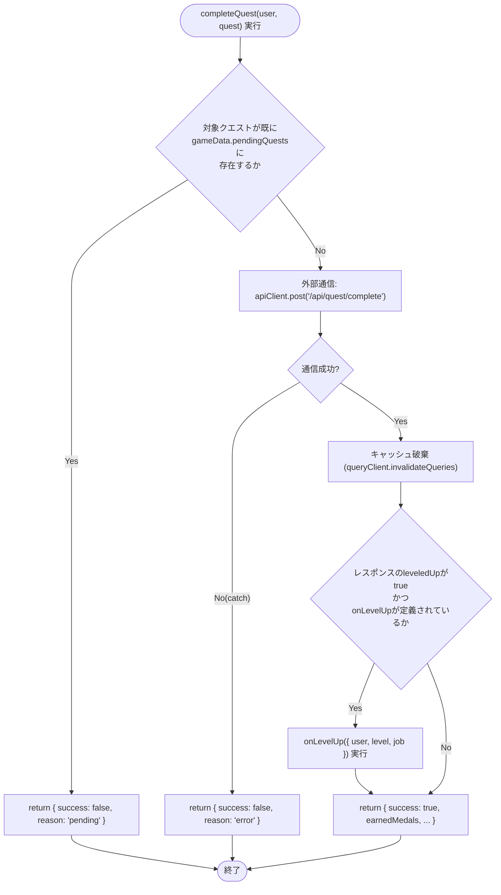
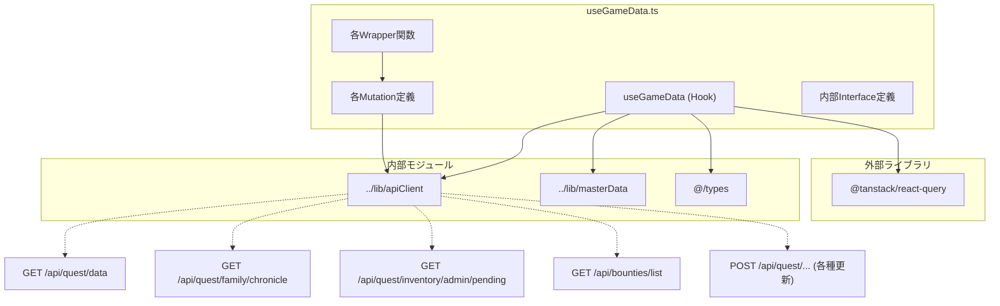

## 1. 解析メタ情報

| 項目 | 内容 |
| --- | --- |
| 対象ファイル | `useGameData.ts` |
| 言語 | React (TypeScript) |
| 解析対象 | 提供されたコードのみ |
| 推測・補完 | 一切なし |

## 2. ファイルの概要

* React Queryを活用し、ゲーム内の各種データ（ユーザー、クエスト、報酬、装備、年代記、バウンティ、インベントリなど）の取得、定期更新（ポーリング）、および状態変更（完了・承認・購入など）のAPIリクエストを統合管理するカスタムフック `useGameData` を提供する。
* データのローディング状態や、サーバーデータが欠損している場合のフォールバックデータ（マスターデータ等）の適用を責務としている。

## 3. 外部依存関係

### インポート一覧

| 名称 | 種類 | 用途 | 根拠 |
| --- | --- | --- | --- |
| `@tanstack/react-query` | ライブラリ | データのフェッチ、キャッシュ管理、ミューテーション用 | 根拠: [`useQuery`, `useMutation`, `useQueryClient`] (行番号: 1 / 抜粋: "import { useQuery, useMuta...") |
| `../lib/apiClient` | 外部モジュール | APIエンドポイントへの通信処理用クライアント | 根拠: [`apiClient`] (行番号: 2 / 抜粋: "import { apiClient } from '...") |
| `../lib/masterData` | 外部モジュール | APIレスポンスがない場合の初期値・フォールバック用定数 | 根拠: [`INITIAL_USERS` 等] (行番号: 3 / 抜粋: "import { INITIAL_USERS, MA...") |
| `@/types` | 型定義 | ユーザー、クエスト、装備などの型アノテーション | 根拠: [`User`, `Quest` 等] (行番号: 4 / 抜粋: "import { User, Quest, Ques...") |

### ブラックボックスとなる外部要素

| 名称 | 理由 | 根拠 |
| --- | --- | --- |
| `apiClient` の内部実装 | ベースURL、ヘッダ付与、認証トークン処理、エラー詳細などの具体的な通信仕様が本ファイルからは読み取れないため。 | 根拠: [`apiClient.get`] (行番号: 103 / 抜粋: "queryFn: () => apiClient.ge...") |
| 各APIエンドポイントの仕様 | リクエスト後のDBの挙動、トランザクション、外部影響が不明であるため。 | 根拠: [`/api/quest/complete` 等] (行番号: 143 / 抜粋: "return apiClient.post<Ques...") |
| マスターデータの実体 | `INITIAL_USERS`, `MASTER_QUESTS` 等の具体的なオブジェクト構造・値が不明であるため。 | 根拠: [`INITIAL_USERS`] (行番号: 352 / 抜粋: "users: gameData?.users |

## 4. 主要要素の定義（関数 / エンドポイント / コンポーネント）

### `useGameData` (カスタムフック本体)

* **役割**: ゲームに関連する各種APIデータの取得（ポーリング含む）と、それらを更新するためのラッパー関数群をまとめたオブジェクトを返す。
* 根拠: [`useGameData`] (行番号: 81 / 抜粋: "export const useGameData = (o...")

* **引数/リクエスト**: `onLevelUp?: (info: LevelUpInfo) => void` (レベルアップ時に発火するコールバック関数、省略可能)
* 根拠: [`useGameData`引数] (行番号: 81 / 抜粋: "onLevelUp?: (info: LevelUp...")

* **戻り値/レスポンス**: オブジェクト（`users`, `quests`, `rewards`, `isLoading` 等のデータ群と、`completeQuest` 等のミューテーション実行関数群）
* 根拠: [`return`文] (行番号: 351〜381 / 抜粋: "return { users: gameData?.u...")

* **副作用**: コンポーネントマウント中、10秒〜15秒間隔で複数のAPIエンドポイントへポーリング通信（`refetchInterval`）を実行する。
* 根拠: [`refetchInterval`] (行番号: 105, 119, 127, 135 / 抜粋: "refetchInterval: 1000 * 10")

* **エラーハンドリング**: 内部で `handleError` 関数を呼び出し、コンソールへエラーログを出力。
* 根拠: [`handleError`] (行番号: 84〜86 / 抜粋: "console.error(`${actionName...")

### `handleError` (内部関数)

* **役割**: 各Mutationで発生したエラーをコンソールに出力する。
* 根拠: [`handleError`] (行番号: 84 / 抜粋: "const handleError = (actionN...")

* **引数/リクエスト**: `actionName: string`, `error: unknown`
* 根拠: [`handleError`引数] (行番号: 84 / 抜粋: "(actionName: string, error...")

* **戻り値/レスポンス**: `void`
* 根拠: [`handleError`] (行番号: 84〜86 / 抜粋: "console.error(`${actionName...")

* **副作用**: コンソールへのエラー出力。
* 根拠: [`console.error`] (行番号: 85 / 抜粋: "console.error(`${actionName...")

* **エラーハンドリング**: なし

### `completeQuest` (ラッパー) & `completeQuestMutation`

* **役割**: クエスト完了APIを呼び出し、成功時に状態キャッシュを無効化する。また、ペンディング状態の事前チェックを行い、レベルアップした場合は引数の `onLevelUp` を実行する。
* 根拠: [`completeQuest`, `completeQuestMutation`] (行番号: 141〜159, 242〜261 / 抜粋: "return apiClient.post<Ques...")

* **引数/リクエスト**: `user: User`, `quest: Quest`
* 根拠: [`completeQuest`引数] (行番号: 242 / 抜粋: "const completeQuest = async...")

* **戻り値/レスポンス**: Promise `{ success: boolean, reason?: string, earnedMedals?: number, leveledUp?: boolean, bossEffect?: any }`
* 根拠: [`return`] (行番号: 251〜256 / 抜粋: "return { success: true, ear...")

* **副作用**: `/api/quest/complete` へのPOSTリクエスト。`queryClient.invalidateQueries` によるキャッシュ破棄。
* 根拠: [`invalidateQueries`] (行番号: 148 / 抜粋: "queryClient.invalidateQuer...")

* **エラーハンドリング**: `catch` 時に `{ success: false, reason: 'error' }` を返却し、Mutation側で `handleError` を呼ぶ。
* 根拠: [`catch`] (行番号: 259 / 抜粋: "return { success: false, re...")

### `cancelQuest` (ラッパー) & `cancelQuestMutation`

* **役割**: クエストをキャンセルするAPIを呼び出し、成功時に状態キャッシュを無効化する。
* 根拠: [`cancelQuest`, `cancelQuestMutation`] (行番号: 161〜172, 263〜269 / 抜粋: "return apiClient.post('/ap...")

* **引数/リクエスト**: `user: User`, `historyItem: QuestHistory`
* 根拠: [`cancelQuest`引数] (行番号: 263 / 抜粋: "const cancelQuest = async (...")

* **戻り値/レスポンス**: Promise `{ success: boolean }`
* 根拠: [`return`] (行番号: 266 / 抜粋: "return { success: true };")

* **副作用**: `/api/quest/quest/cancel` へのPOSTリクエスト。キャッシュ破棄。
* 根拠: [`invalidateQueries`] (行番号: 169 / 抜粋: "queryClient.invalidateQuer...")

* **エラーハンドリング**: `catch` 時に `{ success: false }` を返却し、Mutation側で `handleError` を呼ぶ。
* 根拠: [`catch`] (行番号: 268 / 抜粋: "return { success: false };")

### `approveQuest` (ラッパー) & `approveQuestMutation`

* **役割**: 特定のユーザー（'dad', 'mom'）のみがクエストを承認できる機能を提供する。
* 根拠: [`approveQuest`, `approveQuestMutation`] (行番号: 174〜185, 271〜280 / 抜粋: "if (!['dad', 'mom'].include...")

* **引数/リクエスト**: `user: User`, `historyItem: QuestHistory`
* 根拠: [`approveQuest`引数] (行番号: 271 / 抜粋: "const approveQuest = async...")

* **戻り値/レスポンス**: Promise `{ success: boolean, reason?: string, bossEffect?: any }`
* 根拠: [`return`] (行番号: 276〜277 / 抜粋: "return { success: true, bos...")

* **副作用**: `/api/quest/approve` へのPOSTリクエスト。キャッシュ破棄。
* 根拠: [`invalidateQueries`] (行番号: 182 / 抜粋: "queryClient.invalidateQuer...")

* **エラーハンドリング**: 権限外の場合は即座に `{ success: false, reason: 'permission' }` を返す。通信エラー時は `{ success: false }` を返す。
* 根拠: [`if`ブロック] (行番号: 272 / 抜粋: "return { success: false, re...")

### `rejectQuest` (ラッパー) & `rejectQuestMutation`

* **役割**: 特定のユーザー（'dad', 'mom'）のみがクエストを却下できる機能を提供する。
* 根拠: [`rejectQuest`, `rejectQuestMutation`] (行番号: 187〜198, 282〜288 / 抜粋: "if (!['dad', 'mom'].include...")

* **引数/リクエスト**: `user: User`, `historyItem: QuestHistory`
* 根拠: [`rejectQuest`引数] (行番号: 282 / 抜粋: "const rejectQuest = async (...")

* **戻り値/レスポンス**: Promise `{ success: boolean, reason?: string }`
* 根拠: [`return`] (行番号: 286 / 抜粋: "return { success: true };")

* **副作用**: `/api/quest/reject` へのPOSTリクエスト。キャッシュ破棄。
* 根拠: [`invalidateQueries`] (行番号: 195 / 抜粋: "queryClient.invalidateQuer...")

* **エラーハンドリング**: 権限外は事前弾き。通信エラー時は `{ success: false }` を返す。
* 根拠: [`catch`] (行番号: 288 / 抜粋: "catch (e) { return { success...")

### `buyReward` (ラッパー) & `buyRewardMutation`

* **役割**: 所持ゴールドが足りているか検証した上で、報酬の購入処理を行う。
* 根拠: [`buyReward`, `buyRewardMutation`] (行番号: 200〜212, 290〜300 / 抜粋: "if ((user.gold || 0) < cost...")

* **引数/リクエスト**: `user: User`, `reward: Reward`
* 根拠: [`buyReward`引数] (行番号: 291 / 抜粋: "const buyReward = async (us...")

* **戻り値/レスポンス**: Promise `{ success: boolean, reason?: string, newGold?: number, reward?: Reward }`
* 根拠: [`return`] (行番号: 298 / 抜粋: "return { success: true, new...")

* **副作用**: `/api/quest/reward/purchase` へのPOST。キャッシュ破棄（全体データおよび対象ユーザーのインベントリ）。
* 根拠: [`invalidateQueries`] (行番号: 209 / 抜粋: "queryClient.invalidateQuer...")

* **エラーハンドリング**: ゴールド不足時は `{ success: false, reason: 'gold' }`。通信エラー時は `{ success: false, reason: 'error' }`。
* 根拠: [`if`ブロック] (行番号: 293 / 抜粋: "return { success: false, re...")

### `buyEquipment` (ラッパー) & `buyEquipmentMutation`

* **役割**: 所持ゴールドを検証し、装備の購入処理を行う。
* 根拠: [`buyEquipment`, `buyEquipmentMutation`] (行番号: 214〜225, 302〜309 / 抜粋: "if ((user.gold || 0) < item...")

* **引数/リクエスト**: `user: User`, `item: Equipment`
* 根拠: [`buyEquipment`引数] (行番号: 302 / 抜粋: "const buyEquipment = async...")

* **戻り値/レスポンス**: Promise `{ success: boolean, reason?: string, item?: Equipment }`
* 根拠: [`return`] (行番号: 307 / 抜粋: "return { success: true, ite...")

* **副作用**: `/api/quest/equip/purchase` へのPOSTリクエスト。キャッシュ破棄。
* 根拠: [`invalidateQueries`] (行番号: 222 / 抜粋: "queryClient.invalidateQuer...")

* **エラーハンドリング**: ゴールド不足事前チェック、エラー時は `{ success: false, reason: 'error' }`。
* 根拠: [`catch`] (行番号: 309 / 抜粋: "return { success: false, re...")

### `changeEquipment` (ラッパー) & `changeEquipmentMutation`

* **役割**: 装備の変更APIを呼び出す。
* 根拠: [`changeEquipment`, `changeEquipmentMutation`] (行番号: 227〜238, 311〜316 / 抜粋: "return apiClient.post('/ap...")

* **引数/リクエスト**: `user: User`, `item: Equipment`
* 根拠: [`changeEquipment`引数] (行番号: 311 / 抜粋: "const changeEquipment = asy...")

* **戻り値/レスポンス**: Promise `{ success: boolean }`
* 根拠: [`return`] (行番号: 314 / 抜粋: "return { success: true };")

* **副作用**: `/api/quest/equip/change` へのPOSTリクエスト。キャッシュ破棄。
* 根拠: [`invalidateQueries`] (行番号: 235 / 抜粋: "queryClient.invalidateQuer...")

* **エラーハンドリング**: 通信エラー時は `{ success: false }`。
* 根拠: [`catch`] (行番号: 316 / 抜粋: "return { success: false };")

### `refreshData`

* **役割**: 手動で `gameData` と `inventory` のキャッシュを破棄し、再取得をトリガーする。
* 根拠: [`refreshData`] (行番号: 318〜321 / 抜粋: "queryClient.invalidateQuer...")

* **引数/リクエスト**: なし
* 根拠: [`refreshData`引数] (行番号: 318 / 抜粋: "const refreshData = () => {")

* **戻り値/レスポンス**: `void`
* 根拠: [`refreshData`] (行番号: 318〜321 / 抜粋: "const refreshData = () => {")

* **副作用**: キャッシュ破棄（`['gameData']`, `['inventory']`）
* 根拠: [`invalidateQueries`] (行番号: 319〜320 / 抜粋: "queryClient.invalidateQuer...")

* **エラーハンドリング**: なし

### `adminUpdateBoss` (ラッパー) & `adminUpdateBossMutation`

* **役割**: ボスの状態（最大HP、現在HP、討伐状態）を更新する管理用APIを呼び出す。
* 根拠: [`adminUpdateBoss`, `adminUpdateBossMutation`] (行番号: 88〜98, 323〜330 / 抜粋: "return apiClient.post('/ap...")

* **引数/リクエスト**: `data: { maxHp?: number; currentHp?: number; isDefeated?: boolean }`
* 根拠: [`adminUpdateBoss`引数] (行番号: 323 / 抜粋: "(data: { maxHp?: number; c...")

* **戻り値/レスポンス**: Promise `{ success: boolean }`
* 根拠: [`return`] (行番号: 326 / 抜粋: "return { success: true };")

* **副作用**: `/api/quest/admin/boss/update` へのPOSTリクエスト。キャッシュ破棄。
* 根拠: [`invalidateQueries`] (行番号: 96 / 抜粋: "queryClient.invalidateQuer...")

* **エラーハンドリング**: エラー時は `{ success: false }` を返却。
* 根拠: [`catch`] (行番号: 328 / 抜粋: "return { success: false };")

### `adminUpdateFamilyMileage` (ラッパー) & `adminUpdateFamilyMileageMutation`

* **役割**: 家族のマイレージ情報を更新する管理用APIを呼び出す。
* 根拠: [`adminUpdateFamilyMileage`, `adminUpdateFamilyMileageMutation`] (行番号: 332〜339, 341〜348 / 抜粋: "return apiClient.updateFam...")

* **引数/リクエスト**: `targetName: string`, `targetExp: number`
* 根拠: [`adminUpdateFamilyMileage`引数] (行番号: 341 / 抜粋: "(targetName: string, targe...")

* **戻り値/レスポンス**: Promise `{ success: boolean }`
* 根拠: [`return`] (行番号: 344 / 抜粋: "return { success: true };")

* **副作用**: `apiClient.updateFamilyMileage` の呼び出し。`['familyMileage']` キャッシュ破棄。
* 根拠: [`invalidateQueries`] (行番号: 337 / 抜粋: "queryClient.invalidateQuer...")

* **エラーハンドリング**: エラー時は `{ success: false }` を返却。
* 根拠: [`catch`] (行番号: 346 / 抜粋: "return { success: false };")

## 5. 処理フロー図

※ `completeQuest` （クエスト完了）の主要な処理フロー

## 6. 依存関係図

## 7. 次のステップ（リバースエンジニアリングの提案）

| 優先度 | ファイル名(推測可) | 理由 | 根拠 |
| --- | --- | --- | --- |
| 高 | `../lib/apiClient.ts` | 通信のエラー詳細を握りつぶしている箇所があるため、クライアント側でのリトライ設定、タイムアウト、認証ロジックの実装を確認する必要がある。 | 根拠: [`apiClient`] (行番号: 2 / 抜粋: "import { apiClient } from '...") |
| 中 | バックエンドのエンドポイント (例: `/api/quest/complete` のハンドラ等) | トランザクションや、クエスト完了時のレベルアップ計算処理（`leveledUp`の判定ロジック）などの仕様を確認するため。 | 根拠: [`/api/quest/complete`] (行番号: 143 / 抜粋: "return apiClient.post<Ques...") |
| 低 | `../lib/masterData.ts` | 初期データの構成を確認し、API通信失敗時や初期表示時の画面挙動を特定するため。 | 根拠: [`INITIAL_USERS`] (行番号: 3 / 抜粋: "import { INITIAL_USERS, MA...") |

## 8. 保守上の注意点

* **`any`型の残存**: `familyMileage` の `useQuery` ジェネリクスや、`ApproveResponse` インターフェースの `bossEffect` プロパティにおいて `any` 型が指定されている。
* **過剰なポーリングの可能性**: `useQuery` で設定されている `refetchInterval` が、別々のエンドポイントに対して 10秒〜15秒間隔で同時に複数設定されており、マウント中の通信頻度が高い。
* **詳細なエラーの握りつぶし**: ラッパー関数の `catch (e)` ブロック内でエラーオブジェクトの内容を伝播させず、固定の `{ success: false, reason: 'error' }` のみを返している。
* **ハードコードされた権限チェック**: `approveQuest` と `rejectQuest` 内で `['dad', 'mom'].includes(user.user_id)` という特定文字列のIDによる権限チェックが行われている。

## 9. 不明事項一覧

| 項目 | 理由 | 必要なファイル |
| --- | --- | --- |
| `apiClient`の具体的な通信設定 | URLのプレフィックス、認証トークンの付与方法がコード上に見当たらないため。 | `../lib/apiClient.ts` |
| `INITIAL_USERS` や `MASTER_QUESTS` の中身 | 外部ファイルからインポートされており、値の構造が不明なため。 | `../lib/masterData.ts` |
| 各種Typeの完全なプロパティ | `User`, `Quest`, `Reward` などのプロパティが本ファイル内では一部しか使用されていないため。 | `@/types.ts` 等 |

## 10. 自己検証結果

* [x] 推測・外部ファイルの仕様を一切含んでいない
* [x] 全関数・全クラス・全コンポーネントを列挙した
* [x] 全てのインポート要素を列挙した
* [x] すべての仕様説明に「根拠（行番号・抜粋）」を明記した
* [x] 根拠漏れが0件である
* [x] Mermaid構文にエラーの原因となる記号（エスケープ漏れ）がない
* [x] 不明事項を漏れなく列挙した

完了