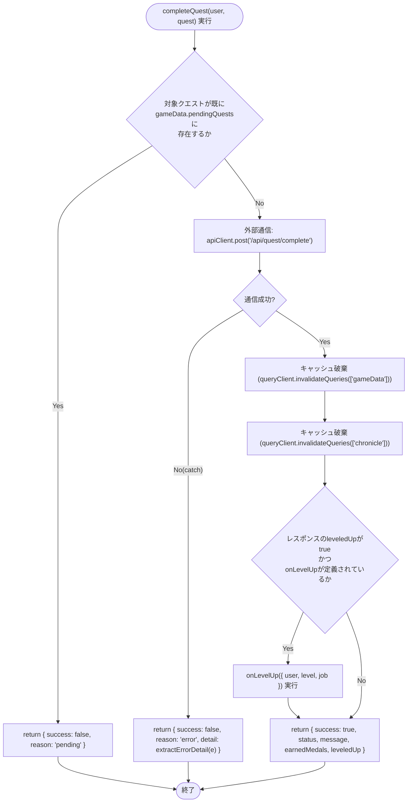
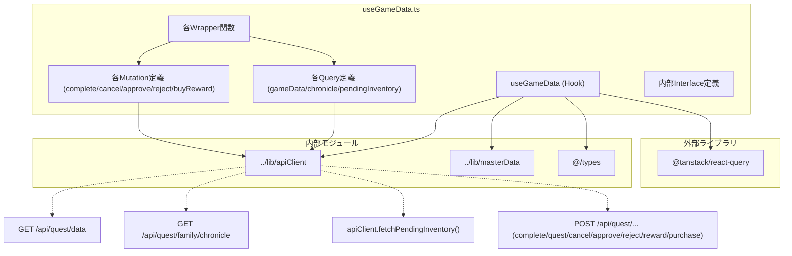

## 1. 解析メタ情報

| 項目 | 内容 |
| --- | --- |
| 対象ファイル | `useGameData.ts` |
| 言語 | React (TypeScript) |
| 解析対象 | 提供されたコードのみ |
| 推測・補完 | 一切なし |

## 関連ドキュメント

- [../lib/apiClient.md](../lib/apiClient.md) — 全APIリクエストの実行元。エンドポイントの共通処理・エラーハンドリングの実装元。
- [../lib/masterData.md](../lib/masterData.md) — `INITIAL_USERS`/`MASTER_QUESTS`/`MASTER_REWARDS`フォールバックデータの実装元。
- [../types/index.md](../types/index.md) — `User`/`Quest`/`QuestHistory`/`Reward`/`QuestResult`/`PendingInventory`型定義の提供元。
- [../../../MY_HOME_SYSTEM/quest_router.md](../../../MY_HOME_SYSTEM/quest_router.md) — `/data`/`/family/chronicle`/`/complete`/`/quest/cancel`/`/approve`/`/reject`/`/reward/purchase`等、本フックが呼び出すバックエンドAPIエンドポイントの実装元。
- [../../../MY_HOME_SYSTEM/quest_service.md](../../../MY_HOME_SYSTEM/quest_service.md) — クエスト完了・購入等のビジネスロジック（`process_complete_quest`等）の実装元。
- [../../../MY_HOME_SYSTEM/game_logic.md](../../../MY_HOME_SYSTEM/game_logic.md) — `earnedMedals`/`leveledUp`算出に使われるレベル・報酬計算ロジックの実装元。

## 2. ファイルの概要

* React Queryを活用し、ゲーム内の各種データ（ユーザー、クエスト、報酬、完了/申請中履歴、家族の年代記（チャットログ）、承認待ちインベントリなど）の取得、定期更新（ポーリング）、および状態変更（完了・承認・却下・取消・購入）のAPIリクエストを統合管理するカスタムフック `useGameData` を提供する。
* データのローディング状態や、サーバーデータが欠損している場合のフォールバックデータ（マスターデータ等）の適用を責務としている。承認待ちインベントリの取得クエリ（`pendingInventory`）はアプリ内で唯一の登録元であり、呼び出し側（`ApprovalList`等）は独自クエリを持たずpropsとして受け取る設計になっている。
* 根拠: `useGameData` の戻り値オブジェクト (行番号: 280〜298 / 抜粋: "return {\n        users: gameData?.users || INITIAL_USERS,")
* 根拠: `pendingInventory`クエリのコメント (行番号: 101〜103 / 抜粋: "// 承認待ちインベントリの取得（無限ループ防止のための安全なポーリング）\n    // ★このクエリがアプリ内で唯一の登録元。ApprovalList側では独自クエリを持たず、\n    // ここから props で受け取る（重複登録の解消）。")

## 3. 外部依存関係

### インポート一覧

| 名称 | 種類 | 用途 | 根拠 |
| --- | --- | --- | --- |
| `useQuery`, `useMutation`, `useQueryClient` | ライブラリ | データのフェッチ、キャッシュ管理、ミューテーション用 | 根拠: (行番号: 1 / 抜粋: "import { useQuery, useMutation, useQueryClient } from '@tanstack/react-query';") |
| `apiClient` | 外部モジュール | APIエンドポイントへの通信処理用クライアント | 根拠: (行番号: 2 / 抜粋: "import { apiClient } from '../lib/apiClient';") |
| `INITIAL_USERS`, `MASTER_QUESTS`, `MASTER_REWARDS` | 外部モジュール | APIレスポンスがない場合の初期値・フォールバック用定数 | 根拠: (行番号: 3 / 抜粋: "import { INITIAL_USERS, MASTER_QUESTS, MASTER_REWARDS } from '../lib/masterData';") |
| `User`, `Quest`, `QuestHistory`, `Reward`, `QuestResult`, `PendingInventory` | 型定義 | ユーザー、クエスト、報酬などの型アノテーション | 根拠: (行番号: 4 / 抜粋: "import { User, Quest, QuestHistory, Reward, QuestResult, PendingInventory } from '@/types';") |

### ブラックボックスとなる外部要素

| 名称 | 理由 | 根拠 |
| --- | --- | --- |
| `apiClient` の内部実装 | ベースURL、ヘッダ付与、認証トークン処理、エラー詳細などの具体的な通信仕様が本ファイルからは読み取れないため。`apiClient.get`/`post`に加え、`fetchPendingInventory`のような専用メソッドも存在するが、その実装は不明。 | 根拠: (行番号: 89 / 抜粋: "queryFn: () => apiClient.get('/api/quest/data'),") |
| 各APIエンドポイントの仕様 | リクエスト後のDBの挙動、トランザクション、外部影響が不明であるため。 | 根拠: (行番号: 117 / 抜粋: "return apiClient.post<QuestResult>('/api/quest/complete', {") |
| マスターデータの実体 | `INITIAL_USERS`, `MASTER_QUESTS`, `MASTER_REWARDS` 等の具体的なオブジェクト構造・値が不明であるため。 | 根拠: (行番号: 281〜283 / 抜粋: "users: gameData?.users || INITIAL_USERS,") |

## 4. 主要要素の定義（関数 / エンドポイント / コンポーネント）

### `AdventureLog` / `FamilyStats` / `ChronicleItem` / `LevelUpInfo` (型定義)

* **役割**: `any`型を排除するために新規追加された厳密な型定義群。`AdventureLog`は`gameData.logs`の1件、`FamilyStats`は`UserService.get_family_chronicle`の`"stats"`レスポンスに対応する家族全体の統計情報、`ChronicleItem`は年代記（`_fetch_full_adventure_logs`のレスポンス）の1エントリで、`FamilyLog.tsx`側が複数の代替フィールド名にフォールバックしていることを踏まえ、それらも任意プロパティとして許容している。`LevelUpInfo`はレベルアップ通知用の型で、`App.tsx`の`handleLevelUp`に渡される。
* 根拠: (行番号: 6〜49 / 抜粋: "// 新規追加: any型を排除するための厳密なインターフェース定義\ninterface AdventureLog {", "// 家族全体の統計情報 (UserService.get_family_chronicle の \"stats\" レスポンスに対応)\nexport interface FamilyStats {", "// 年代記の1エントリ (UserService._fetch_full_adventure_logs のレスポンスに対応。", "export interface LevelUpInfo {")

### `GameDataResponse` / `ChronicleResponse` / `PurchaseResponse` (型定義)

* **役割**: 各`useQuery`/`useMutation`のレスポンス型。`GameDataResponse`は`/api/quest/data`のレスポンス（`users`/`quests`/`rewards`/`completedQuests`/`pendingQuests`/`logs`）、`ChronicleResponse`は`/api/quest/family/chronicle`のレスポンス（`stats`/`chronicle`）、`PurchaseResponse`は購入ミューテーションのレスポンス（`newGold`/`success`）を表す。
* 根拠: (行番号: 51〜69 / 抜粋: "interface GameDataResponse {\n    users: User[];\n    quests: Quest[];\n    rewards: Reward[];\n    completedQuests: QuestHistory[];\n    pendingQuests: QuestHistory[];\n    logs: AdventureLog[];\n}", "interface ChronicleResponse {", "interface PurchaseResponse {")

### `useGameData` (カスタムフック本体)

* **役割**: ゲームに関連する各種APIデータの取得（ポーリング含む）と、それらを更新するためのラッパー関数群をまとめたオブジェクトを返す。
* 根拠: (行番号: 71〜299 / 抜粋: "export const useGameData = (onLevelUp?: (info: LevelUpInfo) => void) => {")

* **引数/リクエスト**: `onLevelUp?: (info: LevelUpInfo) => void` (レベルアップ時に発火するコールバック関数、省略可能)
* 根拠: (行番号: 71 / 抜粋: "export const useGameData = (onLevelUp?: (info: LevelUpInfo) => void) => {")

* **戻り値/レスポンス**: オブジェクト（`users`, `quests`, `rewards`, `completedQuests`, `pendingQuests`, `adventureLogs`, `familyStats`, `chronicle`, `pendingInventory`, `isLoading` 等のデータ群と、`completeQuest`, `approveQuest`, `rejectQuest`, `cancelQuest`, `buyReward`, `refreshData` の各実行関数）
* 根拠: (行番号: 280〜298 / 抜粋: "return {\n        users: gameData?.users || INITIAL_USERS,")

* **副作用**: コンポーネントマウント中、`gameData`（10秒間隔）と`pendingInventory`（10秒間隔）の2系統に対してAPIエンドポイントへポーリング通信（`refetchInterval`）を実行する。`chronicleData`はポーリングせず`staleTime`（5分）による再取得のみ。
* 根拠: (行番号: 90〜91, 107 / 抜粋: "staleTime: 1000 * 30,\n        refetchInterval: 1000 * 10, // 10秒に1回のポーリングに制限", "refetchInterval: 1000 * 10,")

* **エラーハンドリング**: 内部で `handleError` 関数を呼び出しコンソールへエラーログを出力するほか、`extractErrorDetail` でバックエンドが返す具体的なエラーメッセージ（`{"detail": "..."}`）を取り出し、各ラッパー関数の返り値の`detail`として呼び出し元に渡す。
* 根拠: (行番号: 78〜84 / 抜粋: "const extractErrorDetail = (error: unknown): string | undefined => {")

### `handleError` (内部関数)

* **役割**: 各Mutationの`onError`で発生したエラーをコンソールに出力する。
* 根拠: (行番号: 74〜76 / 抜粋: "const handleError = (actionName: string, error: unknown) => {")

* **引数/リクエスト**: `actionName: string`, `error: unknown`
* **戻り値/レスポンス**: `void`
* **副作用**: コンソールへのエラー出力。
* 根拠: (行番号: 75 / 抜粋: "console.error(`${actionName} failed:`, error);")

* **エラーハンドリング**: なし

### `extractErrorDetail` (内部関数)

* **役割**: `apiClient`側でスローされた`Error`から、バックエンドが返す`{"detail": "..."}`のメッセージ内容（`Error.message`）を取り出す。各ラッパー関数の`catch`節から呼ばれ、返り値の`detail`フィールドとしてApp.tsx側に渡ることで、汎用エラーメッセージではなくバックエンドの実際のエラー内容を表示できるようにする。
* 根拠: (行番号: 78〜84 / 抜粋: "// apiClient側でスローされるErrorのmessageには、バックエンドが返す\n    // {\"detail\": \"...\"} の内容が入っている（apiClient.ts参照）。\n    // ここでそれを取り出し、呼び出し元(App.tsx)がユーザーに実際のエラー内容を\n    // 表示できるようにする。\n    const extractErrorDetail = (error: unknown): string | undefined => {")

* **引数/リクエスト**: `error: unknown`
* **戻り値/レスポンス**: `string | undefined`（`error`が`Error`インスタンスの場合は`error.message`、それ以外は`undefined`）
* 根拠: (行番号: 83 / 抜粋: "return error instanceof Error ? error.message : undefined;")

* **副作用**: なし
* **エラーハンドリング**: なし

### `gameData` / `chronicleData` / `pendingInventory` クエリ (`useQuery`)

* **役割**: `useQuery`によるメインデータ取得（`queryKey: ['gameData']`, `GET /api/quest/data`, `staleTime` 30秒, `refetchInterval` 10秒）、年代記データ取得（`queryKey: ['chronicle']`, `GET /api/quest/family/chronicle`, `staleTime` 5分, ポーリングなし）、承認待ちインベントリ取得（`queryKey: ['pendingInventory']`, `apiClient.fetchPendingInventory()`, `refetchInterval` 10秒, `staleTime` 5秒）の3系統のクエリを定義する。
* 根拠: (行番号: 86〜109 / 抜粋: "const { data: gameData, isLoading: isGameDataLoading } = useQuery<GameDataResponse>({\n        queryKey: ['gameData'],\n        queryFn: () => apiClient.get('/api/quest/data'),", "const { data: chronicleData } = useQuery<ChronicleResponse>({\n        queryKey: ['chronicle'],\n        queryFn: () => apiClient.get('/api/quest/family/chronicle'),", "const { data: pendingInventory } = useQuery<PendingInventory[]>({\n        queryKey: ['pendingInventory'],\n        queryFn: () => apiClient.fetchPendingInventory(),")

* **引数/リクエスト**: なし（`useGameData`呼び出し時に自動実行）
* **戻り値/レスポンス**: `gameData: GameDataResponse | undefined`, `chronicleData: ChronicleResponse | undefined`, `pendingInventory: PendingInventory[] | undefined`、および`isGameDataLoading: boolean`
* **副作用**: HTTP GETリクエストのポーリング実行
* **エラーハンドリング**: React Query側のデフォルト挙動に依存（本ファイル内で明示的な`onError`は定義されていない）

### `completeQuest` (ラッパー) & `completeQuestMutation`

* **役割**: クエスト完了APIを呼び出し、成功時に`gameData`と`chronicle`のキャッシュを無効化する。事前に`gameData.pendingQuests`から同一ユーザー・同一クエストの申請中エントリが無いかをチェックし、レベルアップした場合は引数の `onLevelUp` を実行する。
* 根拠: (行番号: 115〜138, 207〜231 / 抜粋: "return apiClient.post<QuestResult>('/api/quest/complete', {")

* **引数/リクエスト**: `user: User`, `quest: Quest`
* 根拠: (行番号: 207 / 抜粋: "const completeQuest = async (user: User, quest: Quest) => {")

* **戻り値/レスポンス**: Promise `{ success: boolean, reason?: string, status?: string, message?: string, earnedMedals?: number, leveledUp?: boolean, detail?: string }`
* 根拠: (行番号: 218〜227 / 抜粋: "return {\n                success: true,\n                status: res.status,\n                message: res.message,\n                earnedMedals: res.earnedMedals,\n                leveledUp: res.leveledUp,\n            };")

* **副作用**: `/api/quest/complete` へのPOSTリクエスト。`queryClient.invalidateQueries` によるキャッシュ破棄（`['gameData']`および`['chronicle']`の両方）。成功時、`res.leveledUp`が真かつ`onLevelUp`が渡されていれば`onLevelUp({ user, level, job })`を実行。
* 根拠: (行番号: 122〜135 / 抜粋: "onSuccess: (res, variables) => {\n            queryClient.invalidateQueries({ queryKey: ['gameData'] });\n            // ★バグ修正: クエスト完了(承認不要な大人の即時完了、または子どもの承認後)は\n            // 冒険の記録(年代記)に載るはずだが、chronicleクエリを無効化していなかったため\n            // staleTime(5分)が切れるまで反映されなかった。\n            queryClient.invalidateQueries({ queryKey: ['chronicle'] });\n            if (res.leveledUp && onLevelUp) {")

* **エラーハンドリング**: 事前チェックで申請中の場合は`{ success: false, reason: 'pending' }`を返す。`catch` 時に `{ success: false, reason: 'error', detail: extractErrorDetail(e) }` を返却し、Mutation側の`onError`で `handleError` を呼ぶ。
* 根拠: (行番号: 211〜213, 228〜230 / 抜粋: "if (isPending) {\n            return { success: false, reason: 'pending' };\n        }", "} catch (e) {\n            return { success: false, reason: 'error', detail: extractErrorDetail(e) };\n        }")

* **バグ修正の記録**: `chronicle`クエリを無効化していなかったため、クエスト完了が冒険の記録に反映されるまで`staleTime`（5分）が切れるのを待つ必要があったバグを修正し、`gameData`と併せて`chronicle`も無効化するようにした。また以前は`status`/`message`を返り値から落としていたため、子供が申請したクエスト（承認待ち）でも「申請完了」メッセージが呼び出し元で絶対に表示されなかった。
* 根拠: (行番号: 124〜127, 220〜222行目 / 抜粋: "// ★バグ修正: クエスト完了(承認不要な大人の即時完了、または子どもの承認後)は\n            // 冒険の記録(年代記)に載るはずだが、chronicleクエリを無効化していなかったため\n            // staleTime(5分)が切れるまで反映されなかった。", "// ★バグ修正: 以前は status/message を返り値から落としていたため、\n                // 子供が申請したクエスト（承認待ち）でも「申請完了」メッセージが\n                // App.tsx 側で絶対に表示されなかった（res.status が常に undefined）。")

### `cancelQuest` (ラッパー) & `cancelQuestMutation`

* **役割**: クエストをキャンセルするAPIを呼び出し、成功時に`gameData`と`chronicle`のキャッシュを無効化する。取消は承認済みの完了もロールバックしうる（`quest_history`の行ごと削除される）ため、既に冒険の記録に載っていた場合に備えて`chronicle`も無効化する。
* 根拠: (行番号: 140〜155, 233〜240 / 抜粋: "return apiClient.post('/api/quest/quest/cancel', {")
* 根拠: `chronicle`無効化のコメント (行番号: 150〜152 / 抜粋: "// 取消は承認済みの完了もロールバックしうる(quest_historyの行ごと削除される)ため、\n            // 既に冒険の記録に載っていた場合に備えてこちらも無効化する")

* **引数/リクエスト**: `user: User`, `historyItem: QuestHistory`
* 根拠: (行番号: 233 / 抜粋: "const cancelQuest = async (user: User, historyItem: QuestHistory) => {")

* **戻り値/レスポンス**: Promise `{ success: boolean, reason?: string, detail?: string }`
* 根拠: (行番号: 236 / 抜粋: "return { success: true };")

* **副作用**: `/api/quest/quest/cancel` へのPOSTリクエスト。キャッシュ破棄（`['gameData']`および`['chronicle']`）。
* 根拠: (行番号: 148〜152 / 抜粋: "queryClient.invalidateQueries({ queryKey: ['gameData'] });")

* **エラーハンドリング**: `catch` 時に `{ success: false, reason: 'error', detail: extractErrorDetail(e) }` を返却し、Mutation側の`onError`で `handleError` を呼ぶ。
* 根拠: (行番号: 237〜239 / 抜粋: "} catch (e) {\n            return { success: false, reason: 'error', detail: extractErrorDetail(e) };\n        }")

### `approveQuest` (ラッパー) & `approveQuestMutation`

* **役割**: `role_adult`ロールを持つユーザーのみがクエストを承認できる機能を提供する。承認によりクエストが`approved`になり冒険の記録に載るようになるため、`gameData`に加え`chronicle`も無効化する。
* 根拠: (行番号: 157〜171, 242〜250 / 抜粋: "if (user.role !== 'role_adult') return { success: false, reason: 'permission' };")

* **引数/リクエスト**: `user: User`, `historyItem: QuestHistory`
* 根拠: (行番号: 242 / 抜粋: "const approveQuest = async (user: User, historyItem: QuestHistory) => {")

* **戻り値/レスポンス**: Promise `{ success: boolean, reason?: string, detail?: string }`
* 根拠: (行番号: 246 / 抜粋: "return { success: true };")

* **副作用**: `/api/quest/approve` へのPOSTリクエスト。キャッシュ破棄（`['gameData']`および`['chronicle']`）。
* 根拠: (行番号: 165〜168 / 抜粋: "queryClient.invalidateQueries({ queryKey: ['gameData'] });\n            // 承認によりクエストが approved になり、冒険の記録に載るようになる\n            queryClient.invalidateQueries({ queryKey: ['chronicle'] });")

* **エラーハンドリング**: 権限外（`user.role !== 'role_adult'`）の場合は即座に `{ success: false, reason: 'permission' }` を返す。通信エラー時は `{ success: false, reason: 'error', detail: extractErrorDetail(e) }` を返す。
* 根拠: (行番号: 243 / 抜粋: "if (user.role !== 'role_adult') return { success: false, reason: 'permission' };")

### `rejectQuest` (ラッパー) & `rejectQuestMutation`

* **役割**: `role_adult`ロールを持つユーザーのみがクエストを却下できる機能を提供する。任意の却下理由（`reason`）をリクエストボディに含める。
* 根拠: (行番号: 173〜186, 252〜260 / 抜粋: "if (user.role !== 'role_adult') return { success: false, reason: 'permission' };")

* **引数/リクエスト**: `user: User`, `historyItem: QuestHistory`, `rejectReason?: string`
* 根拠: (行番号: 252 / 抜粋: "const rejectQuest = async (user: User, historyItem: QuestHistory, rejectReason?: string) => {")

* **戻り値/レスポンス**: Promise `{ success: boolean, reason?: string, detail?: string }`
* 根拠: (行番号: 256 / 抜粋: "return { success: true };")

* **副作用**: `/api/quest/reject` へのPOSTリクエスト。キャッシュ破棄（`['gameData']`のみ。`chronicle`は無効化されない）。
* 根拠: (行番号: 182〜184 / 抜粋: "onSuccess: () => {\n            queryClient.invalidateQueries({ queryKey: ['gameData'] });\n        },")

* **エラーハンドリング**: 権限外は事前弾き。通信エラー時は `{ success: false, reason: 'error', detail: extractErrorDetail(e) }` を返す。
* 根拠: (行番号: 257〜259 / 抜粋: "} catch (e) {\n            return { success: false, reason: 'error', detail: extractErrorDetail(e) };\n        }")

### `buyReward` (ラッパー) & `buyRewardMutation`

* **役割**: 所持ゴールドが足りているか検証した上で、報酬の購入処理を行う。成功時は`gameData`と、購入したユーザー個別の`inventory`クエリキャッシュ、および`chronicle`（購入は`reward_history`に記録され冒険の記録に載るため）の3つを破棄する。
* 根拠: (行番号: 188〜203, 263〜273 / 抜粋: "if ((user.gold || 0) < cost) return { success: false, reason: 'gold' };")

* **引数/リクエスト**: `user: User`, `reward: Reward`
* 根拠: (行番号: 263 / 抜粋: "const buyReward = async (user: User, reward: Reward) => {")

* **戻り値/レスポンス**: Promise `{ success: boolean, reason?: string, newGold?: number, reward?: Reward, detail?: string }`
* 根拠: (行番号: 269 / 抜粋: "return { success: true, newGold: res.newGold, reward };")

* **副作用**: `/api/quest/reward/purchase` へのPOST。キャッシュ破棄（`['gameData']`, `['inventory', variables.user.user_id]`, `['chronicle']`）。
* 根拠: (行番号: 196〜200 / 抜粋: "queryClient.invalidateQueries({ queryKey: ['gameData'] });\n            queryClient.invalidateQueries({ queryKey: ['inventory', variables.user.user_id] });\n            // 購入は reward_history に記録され冒険の記録に載る\n            queryClient.invalidateQueries({ queryKey: ['chronicle'] });")

* **エラーハンドリング**: ゴールド不足時は `{ success: false, reason: 'gold' }`。通信エラー時は `{ success: false, reason: 'error', detail: extractErrorDetail(e) }`。`mutateAsync`の戻り値は`as unknown as PurchaseResponse`でキャストされる。
* 根拠: (行番号: 265, 268, 270〜272 / 抜粋: "if ((user.gold || 0) < cost) return { success: false, reason: 'gold' };", "const res = await buyRewardMutation.mutateAsync({ user, reward }) as unknown as PurchaseResponse;")

### `refreshData`

* **役割**: 手動で `gameData` と `inventory`（キー前方一致で全ユーザー分）のキャッシュを破棄し、再取得をトリガーする。`App.tsx`ではアバターアップロード完了時などに呼ばれる。
* 根拠: (行番号: 275〜278 / 抜粋: "const refreshData = () => {")

* **引数/リクエスト**: なし
* **戻り値/レスポンス**: `void`
* **副作用**: キャッシュ破棄（`['gameData']`, `['inventory']`。`['inventory']`は前方一致的に全ユーザー分のインベントリを強制再取得する）
* 根拠: (行番号: 276〜277 / 抜粋: "queryClient.invalidateQueries({ queryKey: ['gameData'] });\n        queryClient.invalidateQueries({ queryKey: ['inventory'] }); // 全インベントリも強制再取得")

* **エラーハンドリング**: なし

## 5. 処理フロー図

※ `completeQuest` （クエスト完了）の主要な処理フロー

```mermaid
flowchart TD
    Start(["completeQuest(user, quest) 実行"]) --> CheckPending{"対象クエストが既に\ngameData.pendingQuestsに\n存在するか"}
    CheckPending -- Yes --> ReturnPending["return { success: false, reason: 'pending' }"]
    CheckPending -- No --> MutateAsync["外部通信: apiClient.post('/api/quest/complete')"]
    MutateAsync --> CheckSuccess{"通信成功?"}
    CheckSuccess -- No(catch) --> ReturnError["return { success: false, reason: 'error', detail: extractErrorDetail(e) }"]
    CheckSuccess -- Yes --> InvalidateGameData["キャッシュ破棄 (queryClient.invalidateQueries(['gameData']))"]
    InvalidateGameData --> InvalidateChronicle["キャッシュ破棄 (queryClient.invalidateQueries(['chronicle']))"]
    InvalidateChronicle --> CheckLevelUp{"レスポンスのleveledUpがtrue\nかつ\nonLevelUpが定義されているか"}
    CheckLevelUp -- Yes --> CallOnLevelUp["onLevelUp({ user, level, job }) 実行"]
    CallOnLevelUp --> ReturnSuccess["return { success: true, status, message, earnedMedals, leveledUp }"]
    CheckLevelUp -- No --> ReturnSuccess
    ReturnError --> End(["終了"])
    ReturnPending --> End
    ReturnSuccess --> End
```

## 6. 依存関係図

```mermaid
graph TD
    subgraph "useGameData.ts"
        Hook_useGameData["useGameData (Hook)"]
        Queries["各Query定義 (gameData/chronicle/pendingInventory)"]
        Mutations["各Mutation定義 (complete/cancel/approve/reject/buyReward)"]
        Wrappers["各Wrapper関数"]
        Types["内部Interface定義"]
    end

    subgraph "外部ライブラリ"
        ReactQuery["@tanstack/react-query"]
    end

    subgraph "内部モジュール"
        APIClient["../lib/apiClient"]
        MasterData["../lib/masterData"]
        AppTypes["@/types"]
    end

    Hook_useGameData --> ReactQuery
    Hook_useGameData --> APIClient
    Hook_useGameData --> MasterData
    Hook_useGameData --> AppTypes
    Queries --> APIClient
    Mutations --> APIClient
    Wrappers --> Mutations
    Wrappers --> Queries

    APIClient -.-> Endpoint_Data["GET /api/quest/data"]
    APIClient -.-> Endpoint_Chronicle["GET /api/quest/family/chronicle"]
    APIClient -.-> Endpoint_Pending["apiClient.fetchPendingInventory()"]
    APIClient -.-> Endpoint_Mutations["POST /api/quest/... (complete/quest/cancel/approve/reject/reward/purchase)"]
```

## 7. 次のステップ（リバースエンジニアリングの提案）

| 優先度 | ファイル名(推測可) | 理由 | 根拠 |
| --- | --- | --- | --- |
| 高 | `../lib/apiClient.ts` | `fetchPendingInventory`など専用メソッドの実際のエンドポイントや、`Error.message`に`detail`を詰める仕組みを確認する必要がある。 | 根拠: (行番号: 2 / 抜粋: "import { apiClient } from '../lib/apiClient';") |
| 中 | バックエンドのエンドポイント (例: `/api/quest/complete` のハンドラ等) | トランザクションや、クエスト完了時のレベルアップ計算処理（`leveledUp`の判定ロジック）、メダル付与ロジック（`earnedMedals`）などの仕様を確認するため。 | 根拠: (行番号: 117 / 抜粋: "return apiClient.post<QuestResult>('/api/quest/complete', {") |
| 低 | `../lib/masterData.ts` | 初期データの構成を確認し、API通信失敗時や初期表示時の画面挙動を特定するため。 | 根拠: (行番号: 3 / 抜粋: "import { INITIAL_USERS, MASTER_QUESTS, MASTER_REWARDS } from '../lib/masterData';") |

## 8. 保守上の注意点

* **ポーリング対象の縮小**: `useQuery` で設定されている `refetchInterval` は `gameData`（10秒間隔）と `pendingInventory`（10秒間隔）の2系統のみとなっている。`chronicle`は`staleTime`（5分）のみでポーリングされない。以前存在した`familyMileage`・`bounties`のポーリングは廃止されている。
* 根拠: (行番号: 90〜91, 98, 107〜108 / 抜粋: "refetchInterval: 1000 * 10, // 10秒に1回のポーリングに制限", "staleTime: 1000 * 60 * 5,")
* **`chronicle`キャッシュの無効化漏れ修正**: `completeQuest`/`cancelQuest`/`approveQuest`/`buyReward`の成功時には`gameData`に加えて`chronicle`クエリも無効化されるようになった（以前は`completeQuest`成功時に`chronicle`を無効化しておらず、`staleTime`（5分）が切れるまで冒険の記録に反映されなかったバグの修正）。ただし`rejectQuest`は`gameData`のみを無効化し、`chronicle`は無効化されない（却下は記録に載らないため）。新しい状態変更アクションを追加する際は、そのアクションが年代記に影響するかどうかを踏まえて`chronicle`の無効化要否を判断する必要がある。
* 根拠: (行番号: 124〜127, 150〜152, 167〜168, 199〜200行目 / 抜粋: "// ★バグ修正: クエスト完了(承認不要な大人の即時完了、または子どもの承認後)は\n            // 冒険の記録(年代記)に載るはずだが、chronicleクエリを無効化していなかったため\n            // staleTime(5分)が切れるまで反映されなかった。")
* **`buyRewardMutation` の戻り値キャスト**: `buyReward` 内で `mutateAsync` の戻り値を `as unknown as PurchaseResponse` として型キャストしている。`apiClient.post` 自体の戻り値の型（ジェネリック`<T>`）と実際のレスポンス形状との整合はランタイムでは検証されない。
* 根拠: (行番号: 268 / 抜粋: "const res = await buyRewardMutation.mutateAsync({ user, reward }) as unknown as PurchaseResponse;")
* **役割ベースの権限チェックへの統一**: `approveQuest` と `rejectQuest` 内の権限チェックは `user.role !== 'role_adult'` という役割ベースの判定に統一されている。あくまでクライアント側の事前チェックであり、バックエンド側の認可を代替するものではない。
* 根拠: (行番号: 243, 253 / 抜粋: "if (user.role !== 'role_adult') return { success: false, reason: 'permission' };")
* **`refreshData` のキャッシュ無効化範囲**: `queryClient.invalidateQueries({ queryKey: ['inventory'] })` はキー全体（`['inventory', userId]`形式のクエリすべて）を前方一致で無効化する設計であり、コメントで「全インベントリも強制再取得」と明示されている。
* 根拠: (行番号: 276〜277 / 抜粋: "queryClient.invalidateQueries({ queryKey: ['gameData'] });\n        queryClient.invalidateQueries({ queryKey: ['inventory'] }); // 全インベントリも強制再取得")
* **`pendingInventory`クエリの単一登録元化**: `pendingInventory`の`useQuery`は本フックのみが定義しており、コメントにより`ApprovalList`側では独自クエリを持たずpropsとして受け取る設計（重複登録の解消）であることが明記されている。承認待ちインベントリに関する表示や更新頻度を変更する場合は本フックのこのクエリ定義を修正する必要がある。
* 根拠: (行番号: 101〜103 / 抜粋: "// 承認待ちインベントリの取得（無限ループ防止のための安全なポーリング）\n    // ★このクエリがアプリ内で唯一の登録元。ApprovalList側では独自クエリを持たず、\n    // ここから props で受け取る（重複登録の解消）。")

## 9. 不明事項一覧

| 項目 | 理由 | 必要なファイル |
| --- | --- | --- |
| `apiClient`の具体的な通信設定 | URLのプレフィックス、認証トークンの付与方法がコード上に見当たらないため。 | `../lib/apiClient.ts` |
| `INITIAL_USERS` や `MASTER_QUESTS` の中身 | 外部ファイルからインポートされており、値の構造が不明なため。 | `../lib/masterData.ts` |
| 各種Typeの完全なプロパティ | `User`, `Quest`, `Reward` などのプロパティが本ファイル内では一部しか使用されていないため。 | `@/types.ts` 等 |
| `apiClient.fetchPendingInventory` の実エンドポイント | メソッド名のみが呼び出されており、実際に叩かれるURLやHTTPメソッドが本ファイルからは不明なため。 | `../lib/apiClient.ts` |
| `earnedMedals`の付与条件 | サーバー側(`QuestResult.earnedMedals`)の算出ロジックが本ファイルからは不明なため。 | バックエンドの`/api/quest/complete`ハンドラ実装 |

## 相互参照による補足情報

| 元の不明事項 | 判明した内容 | 参照元ドキュメント |
| --- | --- | --- |
| `apiClient`の具体的な通信設定 | `apiClient.md`の解析によれば、`getBaseUrl`関数が環境変数`import.meta.env.VITE_API_URL`が定義されていればそれを、未定義なら`window.location.origin`をベースURLとして使うとされている。認証トークンの付与処理は`apiClient.md`側でも確認されていない。 | `../lib/apiClient.md` |
| `INITIAL_USERS` や `MASTER_QUESTS` の中身 | `masterData.md`の解析によれば、`INITIAL_USERS`はゲストユーザー1件（`user_id: 'guest'`等）、`MASTER_QUESTS`/`MASTER_REWARDS`はいずれも「サーバー接続エラー」を伝えるダミーデータ1件のみで構成されているとされている。 | `../lib/masterData.md` |
| 各種Typeの完全なプロパティ | `types/index.md`の解析によれば、`User`/`Quest`/`QuestHistory`/`Reward`/`InventoryItem`/`QuestResult`/`PendingInventory`の各インターフェースが定義されているとされているが、`description`/`desc`のような類似プロパティの併存が多く、`types/index.md`側でも完全な使い分けの理由は特定されていない。 | `../types/index.md` |
| `apiClient.fetchPendingInventory` の実エンドポイント | `apiClient.md`の解析では`fetchPendingInventory`メソッドの存在自体は確認されているが具体的なURLは抜粋されておらず、`quest_router.md`の解析によれば`GET /inventory/admin/pending`という管理者向けエンドポイントが存在するとされている。両者を突き合わせると対応している可能性が高いが、これはあくまで推測であり断定はできない。 | `../lib/apiClient.md`, `../../../MY_HOME_SYSTEM/quest_router.md` |
| `earnedMedals`の付与条件 | `game_logic.md`の解析によれば、`GameLogic.calculate_drop_rewards`内で`earned_medals = 1 if random.random() < medal_chance else 0`という確率判定でメダル付与を決定しているとされている。ただしこれは`game_logic.md`側の解析結果からの補足であり、`quest_service.py`/`quest_router.py`が実際にこの値を`QuestResult.earnedMedals`としてどう返しているかまでは確認できていない。 | `../../../MY_HOME_SYSTEM/game_logic.md` |

## 10. 自己検証結果

* [x] 完了: 推測・外部ファイルの仕様を一切含んでいない
* [x] 完了: 全関数・全クラス・全コンポーネントを列挙した
* [x] 完了: 全てのインポート要素を列挙した
* [x] 完了: すべての仕様説明に「根拠（行番号・抜粋）」を明記した
* [x] 完了: 根拠漏れが0件である
* [x] 完了: Mermaid構文にエラーの原因となる記号（エスケープ漏れ）がない
* [x] 完了: 不明事項を漏れなく列挙した
