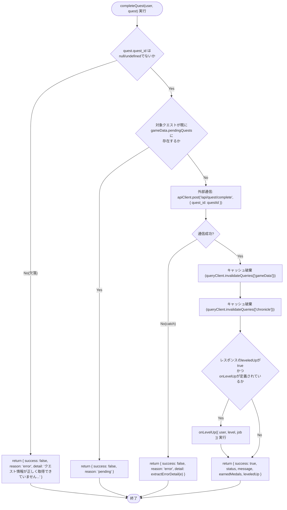

## 1. 解析メタ情報

| 項目 | 内容 |
| --- | --- |
| 対象ファイル | `useGameData.ts` |
| 言語 | React (TypeScript) |
| 解析対象 | 提供されたコードのみ |
| 推測・補完 | 一切なし |
| 解析基準コミット | `5fd3059` |

## 関連ドキュメント

- [../lib/apiClient.md](../lib/apiClient.md) — 全APIリクエストの実行元。エンドポイントの共通処理・エラーハンドリングの実装元。
- [../lib/masterData.md](../lib/masterData.md) — `INITIAL_USERS`/`MASTER_QUESTS`/`MASTER_REWARDS`フォールバックデータの実装元。
- [../lib/gameDataSchema.md](../lib/gameDataSchema.md) — `gameData`クエリのレスポンスをランタイム検証するZodスキーマ(`gameDataResponseSchema`)の実装元（Issue #291で追加。#412で`logs`フィールドを削除）。
- [../types/index.md](../types/index.md) — `User`/`Quest`/`QuestHistory`/`Reward`/`QuestResult`/`ID`型定義の提供元。
- [../../../MY_HOME_SYSTEM/quest_router.md](../../../MY_HOME_SYSTEM/quest_router.md) — `/data`/`/family/chronicle`/`/complete`/`/quest/cancel`/`/approve`/`/reject`/`/reward/purchase`等、本フックが呼び出すバックエンドAPIエンドポイントの実装元。
- [../../../MY_HOME_SYSTEM/quest_service.md](../../../MY_HOME_SYSTEM/quest_service.md) — クエスト完了・購入等のビジネスロジック（`process_complete_quest`等）の実装元。
- [../../../MY_HOME_SYSTEM/game_logic.md](../../../MY_HOME_SYSTEM/game_logic.md) — `earnedMedals`/`leveledUp`算出に使われるレベル・報酬計算ロジックの実装元。

## 2. ファイルの概要

* React Queryを活用し、ゲーム内の各種データ（ユーザー、クエスト、報酬、完了/申請中履歴、家族の年代記（チャットログ）など）の取得、定期更新（ポーリング）、および状態変更（完了・承認・却下・取消・購入）のAPIリクエストを統合管理するカスタムフック `useGameData` を提供する。
* データのローディング状態や、サーバーデータが欠損している場合のフォールバックデータ（マスターデータ等）の適用を責務としている。引数`currentUserIdx`に対応する閲覧中ユーザーの`user_id`を`viewerUserIdRef`に保持し、次回の`gameData`取得時に`viewer_user_id`クエリパラメータとして送信することで、共有クエストのボーナス計算をサーバー側で「閲覧中のユーザー」の履歴を代表として行えるようにしている。
* **（#412で修正）** クエスト完了・キャンセル・承認・却下・報酬購入の各ミューテーションは、以前はリクエストボディに`quest.quest_id`/`historyItem.id`/`reward.reward_id`（いずれも`Quest`/`QuestHistory`/`Reward`型では表示用途向けにoptional）をそのまま渡していたため、これらが`undefined`のまま渡ると`JSON.stringify`でキーごと落ち、バックエンドの必須フィールド検証（`QuestAction`/`HistoryAction`/`RewardAction`、いずれも`int`必須）により422になる経路が型上防がれていなかった。各ラッパー関数（`completeQuest`/`cancelQuest`/`approveQuest`/`rejectQuest`/`buyReward`）の先頭でnullチェックを行い、`useMutation`の`mutationFn`自体の引数を`questId`/`historyId`/`rewardId: ID`（必須）に分離することで、undefinedがリクエスト送信経路に乗る余地をコンパイル時に断つようにした。
* 根拠: `useGameData` の戻り値オブジェクト (行番号: 359〜380 / 抜粋: "return {\n        users: gameData?.users || INITIAL_USERS,")
* 根拠: `viewerUserIdRef`のコメントおよび宣言 (行番号: 66〜73 / 抜粋: "// 共有クエスト(target_user='siblings'等)のボーナス計算はサーバー側で\n    // 「閲覧中のユーザー」の履歴を代表として使うため、直近の応答から現在の\n    // currentUserIdxに対応するuser_idを控えておき、次回フェッチ時に送る。", "const viewerUserIdRef = useRef<string | undefined>(undefined);")
* 根拠: `completeQuest`のnullチェック (行番号: 250〜255 / 抜粋: "// #412(API契約): quest_id は本来常に存在するはず(サーバー応答はgameDataSchema.ts側で\n        // 必須、masterData.jsのフォールバックも必ず付与)だが、Quest型自体は表示専用途向けに\n        // optionalなため、undefinedのままリクエストへ渡してしまう(→422)経路を確実に断つ。\n        if (qId == null) {")

## 3. 外部依存関係

### インポート一覧

| 名称 | 種類 | 用途 | 根拠 |
| --- | --- | --- | --- |
| `useEffect`, `useRef` | ライブラリ(React) | `viewerUserIdRef`(直近の閲覧中ユーザーIDの保持)と、そのユーザーが確定した際に更新する`useEffect`に使用 | 根拠: (行番号: 1 / 抜粋: "import { useEffect, useRef } from 'react';") |
| `useQuery`, `useMutation`, `useQueryClient` | ライブラリ | データのフェッチ、キャッシュ管理、ミューテーション用 | 根拠: (行番号: 2 / 抜粋: "import { useQuery, useMutation, useQueryClient } from '@tanstack/react-query';") |
| `apiClient` | 外部モジュール | APIエンドポイントへの通信処理用クライアント | 根拠: (行番号: 3 / 抜粋: "import { apiClient } from '../lib/apiClient';") |
| `INITIAL_USERS`, `MASTER_QUESTS`, `MASTER_REWARDS` | 外部モジュール | APIレスポンスがない場合の初期値・フォールバック用定数 | 根拠: (行番号: 4 / 抜粋: "import { INITIAL_USERS, MASTER_QUESTS, MASTER_REWARDS } from '../lib/masterData';") |
| `gameDataResponseSchema` | 外部モジュール(Zodスキーマ) | `gameData`クエリのレスポンスをランタイムで検証するために使用（Issue #291で追加）。バックエンドのレスポンス形状が期待するフィールド名と食い違っている場合、コンポーネント側で無言でundefinedを参照する「幽霊フィールド」バグとしてではなく、取得境界で即座にエラーとして検知させる目的。 | 根拠: (行番号: 5 / 抜粋: "import { gameDataResponseSchema } from '../lib/gameDataSchema';") |
| `ID`, `User`, `Quest`, `QuestHistory`, `Reward`, `QuestResult` | 型定義 | ユーザー、クエスト、報酬などの型アノテーション。**（#412で追加）** `ID`は各ミューテーションの`mutationFn`引数（`questId`/`historyId`/`rewardId`）を必須型で分離するために追加でインポートされた。 | 根拠: (行番号: 7 / 抜粋: "import { ID, User, Quest, QuestHistory, Reward, QuestResult } from '@/types';") |

### ブラックボックスとなる外部要素

| 名称 | 理由 | 根拠 |
| --- | --- | --- |
| `apiClient` の内部実装 | ベースURL、ヘッダ付与、認証トークン処理、エラー詳細などの具体的な通信仕様が本ファイルからは読み取れないため。 | 根拠: (行番号: 86〜91 / 抜粋: "queryFn: async () => {\n            const viewerUserId = viewerUserIdRef.current;") |
| 各APIエンドポイントの仕様 | リクエスト後のDBの挙動、トランザクション、外部影響が不明であるため。 | 根拠: (行番号: 125 / 抜粋: "return apiClient.post<QuestResult>('/api/quest/complete', { // 型指定") |
| マスターデータの実体 | `INITIAL_USERS`, `MASTER_QUESTS`, `MASTER_REWARDS` 等の具体的なオブジェクト構造・値が不明であるため。 | 根拠: (行番号: 360〜362 / 抜粋: "users: gameData?.users || INITIAL_USERS,") |
| `gameDataResponseSchema` の詳細なフィールド定義 | `../lib/gameDataSchema.ts`に実装があり、各フィールドの厳密なZod型（`optional`/`nullable`の組み合わせ等）は本ファイルからは呼び出し結果（`.parse()`の成否）のみで、定義の全容は不明。 | 根拠: (行番号: 5, 95 / 抜粋: "import { gameDataResponseSchema } from '../lib/gameDataSchema';", "return gameDataResponseSchema.parse(raw) as GameDataResponse;") |

## 4. 主要要素の定義（関数 / エンドポイント / コンポーネント）

### `ChronicleItem` / `LevelUpInfo` (型定義)

* **役割**: `any`型を排除するために新規追加された厳密な型定義群。`ChronicleItem`は年代記（`GameSystem._fetch_full_adventure_logs`のレスポンス）の1エントリ、`LevelUpInfo`はレベルアップ通知用の型で、`App.tsx`の`handleLevelUp`に渡される。**（#291で修正）** `ChronicleItem`は以前、`FamilyLog.tsx`側が複数の代替フィールド名（`date`/`id`/`avatar_url`/`message`/`quest_title`/`reward_gold`/`reward_exp`/`created_at`）に防御的にフォールバックしていることを踏まえ、それらも任意プロパティとして許容していたが、これらがバックエンドから一度も送られてこない「幽霊フィールド」だったと判明したため型定義から削除され、`FamilyLog.tsx`側の対応するフォールバックも合わせて廃止された。現在の`ChronicleItem`は`type`/`timestamp`/`dateStr`/`userId`/`userName`/`userAvatar`/`title`/`text`/`gold`/`exp`のみを持つ。**（#412で削除）** 以前ここには`AdventureLog`（`gameData.logs`の1件、`QuestService._fetch_recent_logs`のレスポンス）と`FamilyStats`（`chronicleData.stats`、`UserService.get_family_chronicle`の`"stats"`レスポンス）の2型も定義されていたが、いずれもどのコンポーネントからも参照されていないことをgrepで確認したうえで型ごと削除した（後述の`GameDataResponse`/`ChronicleResponse`からも対応するフィールドを削除）。ファイル冒頭にはこれらを再利用する際の注意（バックエンドの実レスポンス形状を確認してから型を再定義すること）のみがコメントとして残る。
* 根拠: (行番号: 9〜30 / 抜粋: "// #412(API契約): gameData.logs(AdventureLog)・chronicle.stats(FamilyStats)は\n// どちらもどのコンポーネントからも参照されていない(grep済み)ため型ごと削除した。\n// gameDataResponseSchema.ts側のlogsフィールドも合わせて削除済み。将来これらを\n// 使う際は、バックエンドの実レスポンス形状(QuestService._fetch_recent_logs /\n// UserService.get_family_chronicleのstats)を確認のうえ型を再定義すること。", "// 年代記の1エントリ (GameSystem._fetch_full_adventure_logs のレスポンスに対応。\n// #291: date/id/avatar_url/message/quest_title/reward_gold/reward_exp/created_at は\n// バックエンドから一度も送られてこない幽霊フィールドだったため削除した。\n// FamilyLog.tsx側の「複数の代替フィールド名への防御的フォールバック」もあわせて廃止した。\nexport interface ChronicleItem {", "export interface LevelUpInfo {")

### `GameDataResponse` / `ChronicleResponse` / `PurchaseResponse` (型定義)

* **役割**: 各`useQuery`/`useMutation`のレスポンス型。`GameDataResponse`は`/api/quest/data`のレスポンス（`users`/`quests`/`rewards`/`completedQuests`/`pendingQuests`）、`ChronicleResponse`は`/api/quest/family/chronicle`のレスポンス（`chronicle`）、`PurchaseResponse`は購入ミューテーションのレスポンス（`status`/`newGold`。**Issue #390**: 以前宣言していた`success: boolean`はサーバー（`models/quest.py`の`PurchaseResponse`）が返さない幽霊フィールドだったため、実際の形状に合わせた）を表す。**（#412で削除）** `GameDataResponse`は以前`logs: AdventureLog[]`フィールドを、`ChronicleResponse`は以前`stats: FamilyStats`フィールドをそれぞれ持っていたが、いずれも消費側が存在しないため削除した（バックエンド自体は引き続きこれらのフィールドを返しうるが、`gameDataResponseSchema`が`.strict()`でないため`logs`はランタイム検証時に単純にstripされ、`chronicle`エンドポイントの`stats`は元々型未検証のままオブジェクトごと無視される）。
* 根拠: (行番号: 51〜57 / 抜粋: "// models/quest.py の PurchaseResponse に対応。\n// #390: 以前は success: boolean と宣言していたがサーバーは status しか返さない\n// 幽霊フィールドだったため、実際の形状に合わせる。\ninterface PurchaseResponse {\n    status: string;\n    newGold: number;\n}")
* 根拠: (行番号: 38〜57 / 抜粋: "interface GameDataResponse {\n    users: User[];\n    quests: Quest[];\n    rewards: Reward[];\n    completedQuests: QuestHistory[];\n    pendingQuests: QuestHistory[];\n}", "interface ChronicleResponse {\n    chronicle: ChronicleItem[];\n}", "interface PurchaseResponse {")

### `useGameData` (カスタムフック本体)

* **役割**: ゲームに関連する各種APIデータの取得（ポーリング含む）と、それらを更新するためのラッパー関数群をまとめたオブジェクトを返す。
* 根拠: (行番号: 59〜380 / 抜粋: "export const useGameData = (currentUserIdx: number, onLevelUp?: (info: LevelUpInfo) => void) => {")

* **引数/リクエスト**: `currentUserIdx: number`（現在閲覧中のユーザーのインデックス。対応するユーザーの`user_id`が`viewerUserIdRef`経由で`gameData`取得時の`viewer_user_id`クエリパラメータに使われる）, `onLevelUp?: (info: LevelUpInfo) => void`（レベルアップ時に発火するコールバック関数、省略可能）
* 根拠: (行番号: 59 / 抜粋: "export const useGameData = (currentUserIdx: number, onLevelUp?: (info: LevelUpInfo) => void) => {")

* **戻り値/レスポンス**: オブジェクト（`users`, `quests`, `rewards`, `completedQuests`, `pendingQuests`, `chronicle`, `isLoading`, `gameDataError`, `refetchGameData` 等のデータ群と、`completeQuest`, `approveQuest`, `rejectQuest`, `cancelQuest`, `buyReward`, `refreshData` の各実行関数）
* 根拠: (行番号: 359〜380 / 抜粋: "return {\n        users: gameData?.users || INITIAL_USERS,")

* **副作用**: コンポーネントマウント中、`gameData`に対してAPIエンドポイントへポーリング通信（`refetchInterval` 10秒）を実行する。`chronicleData`はポーリングせず`staleTime`（5分）による再取得のみ。また`gameData`の応答を受けるたびに`useEffect`が発火し、`currentUserIdx`に対応するユーザーの`user_id`を`viewerUserIdRef`へ保存する（次回以降の`gameData`取得リクエストの`viewer_user_id`パラメータに使われる）。
* 根拠: (行番号: 97〜98, 101〜104, 110 / 抜粋: "staleTime: 1000 * 30,\n        refetchInterval: 1000 * 10, // 10秒に1回のポーリングに制限", "useEffect(() => {\n        const viewer = gameData?.users?.[currentUserIdx];\n        if (viewer) viewerUserIdRef.current = viewer.user_id;\n    }, [gameData, currentUserIdx]);", "staleTime: 1000 * 60 * 5,")

* **エラーハンドリング**: 内部で `handleError` 関数を呼び出しコンソールへエラーログを出力するほか、`extractErrorDetail`（`../lib/errorDetail`）でバックエンドが返す具体的なエラーメッセージ（`{"detail": "..."}`）を取り出し、各ラッパー関数の返り値の`detail`として呼び出し元に渡す。**（#412で追加）** `completeQuest`/`cancelQuest`/`approveQuest`/`rejectQuest`/`buyReward`はいずれも、対象の`quest_id`/`history_id`/`reward_id`が`null`/`undefined`の場合、通信を一切行わずに`{ success: false, reason: 'error', detail: '(日本語の再読み込み案内)' }`を即座に返す事前ガードを持つ。
* 根拠: (行番号: 6 / 抜粋: "import { describeGameDataError, extractErrorDetail } from '../lib/errorDetail';")
* 根拠: 事前ガードの一例(`completeQuest`) (行番号: 250〜255 / 抜粋: "if (qId == null) {\n            return { success: false, reason: 'error', detail: 'クエスト情報が正しく取得できていません(再読み込みしてください)' };\n        }")

### `handleError` (内部関数)

* **役割**: 各Mutationの`onError`で発生したエラーをコンソールに出力する。
* 根拠: (行番号: 62〜64 / 抜粋: "const handleError = (actionName: string, error: unknown) => {")

* **引数/リクエスト**: `actionName: string`, `error: unknown`
* **戻り値/レスポンス**: `void`
* **副作用**: コンソールへのエラー出力。
* 根拠: (行番号: 63 / 抜粋: "console.error(`${actionName} failed:`, error);")

* **エラーハンドリング**: なし

### `extractErrorDetail` / `describeGameDataError` (`../lib/errorDetail`からのインポート)

* **役割**: **（Issue #390で移動）** 以前は本フック内部に`extractErrorDetail`（`apiClient`がスローした`Error`の`message`、すなわちバックエンドの`{"detail": "..."}`を取り出す関数）がローカル定義されていたが、`InventoryList.tsx`/`CameraDashboard.tsx`にも同じ関数が重複していたため`src/lib/errorDetail.ts`へ集約した。各ラッパー関数の`catch`節から`extractErrorDetail(e)`（`fallback`無しの呼び出しで`string | undefined`を返す）として呼ばれ、返り値の`detail`フィールドとして`App.tsx`側に渡る。`describeGameDataError`は`gameData`クエリの`error`を戻り値`gameDataError`の表示用文字列へ変換する（`ZodError`は最初の不一致箇所を要約する）。
* 根拠: (行番号: 6, 276, 290, 316, 331, 350, 370 / 抜粋: "import { describeGameDataError, extractErrorDetail } from '../lib/errorDetail';", "return { success: false, reason: 'error', detail: extractErrorDetail(e) };", "gameDataError: gameDataError ? describeGameDataError(gameDataError, 'データの取得に失敗しました') : null,")

### `gameData` / `chronicleData` クエリ (`useQuery`)

* **役割**: `useQuery`によるメインデータ取得（`queryKey: ['gameData']`, `GET /api/quest/data`。`viewerUserIdRef.current`が設定されていれば`?viewer_user_id={encodeURIComponent(...)}`をURLに付与する。`staleTime` 30秒, `refetchInterval` 10秒）と、年代記データ取得（`queryKey: ['chronicle']`, `GET /api/quest/family/chronicle`, `staleTime` 5分, ポーリングなし）の2系統のクエリを定義する。**（#291で修正）** `gameData`クエリの`queryFn`は非同期関数に変更され、`apiClient.get<unknown>(endpoint)`で取得した生レスポンスを`gameDataResponseSchema.parse(raw)`（`../lib/gameDataSchema.ts`のZodスキーマ）でランタイム検証したうえで`GameDataResponse`にキャストして返すようになった。バックエンドのレスポンス形状がフロントの期待するフィールド名と食い違っている場合、以前はコンポーネント側が無言で`undefined`を参照する「幽霊フィールド」バグとして表面化しないまま残っていたが、この変更により取得境界で即座に例外（`zod`の`ZodError`）として検知されるようになった。`chronicleData`クエリはこの検証を経由せず、以前と同じく`apiClient.get`の戻り値をそのまま返す。
* 根拠: (行番号: 79〜104, 107〜111 / 抜粋: "const {\n        data: gameData,\n        isLoading: isGameDataLoading,\n        error: gameDataError,\n        refetch: refetchGameData,\n    } = useQuery<GameDataResponse>({\n        queryKey: ['gameData'],\n        queryFn: async () => {\n            const viewerUserId = viewerUserIdRef.current;\n            const endpoint = viewerUserId\n                ? `/api/quest/data?viewer_user_id=${encodeURIComponent(viewerUserId)}`\n                : '/api/quest/data';\n            const raw = await apiClient.get<unknown>(endpoint);\n            return gameDataResponseSchema.parse(raw) as GameDataResponse;\n        },", "const { data: chronicleData } = useQuery<ChronicleResponse>({\n        queryKey: ['chronicle'],\n        queryFn: () => apiClient.get('/api/quest/family/chronicle'),")
* 根拠: Zod検証のコメント (行番号: 92〜94 / 抜粋: "// #291: バックエンドのレスポンス形状がここで定義したスキーマ(gameDataSchema.ts)と\n            // 食い違っている場合、コンポーネント側で無言でundefinedを参照する幽霊フィールド\n            // バグとしてではなく、ここで即座にエラーとして検知させる。")

* **引数/リクエスト**: なし（`useGameData`呼び出し時に自動実行。ただし`gameData`クエリの実際のリクエストURLは`viewerUserIdRef`の値に応じて変化する）
* **戻り値/レスポンス**: `gameData: GameDataResponse | undefined`, `chronicleData: ChronicleResponse | undefined`、`isGameDataLoading: boolean`、および**（Issue #390で追加）** `gameDataError`（`useQuery`の`error`）と`refetchGameData`（`useQuery`の`refetch`）
* **副作用**: HTTP GETリクエストのポーリング実行
* **エラーハンドリング**: React Query側のデフォルト挙動に依存（本ファイル内で明示的な`onError`は定義されていない）。**（#291で追加）** `gameData`クエリの`queryFn`は`gameDataResponseSchema.parse(raw)`が失敗した場合に`ZodError`を送出し、これは`useQuery`のエラー状態として扱われる。**（Issue #390で修正）** 以前はこの`error`を捨てており、取得失敗（ネットワーク・Zod検証失敗）はブラウザの`console`でしか分からず、画面は`INITIAL_USERS`（「接続エラー」）のフォールバックか最後に成功した古いデータのまま無言だった。現在は`describeGameDataError`で表示用文字列に変換した`gameDataError`（正常時`null`）と`refetchGameData`を戻り値として公開し、`App.tsx`がバナー（再試行ボタン付き）を表示する。
* 根拠: (行番号: 76〜78, 370〜371 / 抜粋: "// #390: 以前は isError / error を捨てており、取得失敗(ネットワーク・Zod検証失敗)は\n    // ブラウザの console でしか分からず、画面は INITIAL_USERS(「接続エラー」)か\n    // 最後に成功したデータのまま無言だった。error を呼び出し元(App)へ返してバナー表示する。", "gameDataError: gameDataError ? describeGameDataError(gameDataError, 'データの取得に失敗しました') : null,\n        refetchGameData: () => { void refetchGameData(); },")

### `completeQuest` (ラッパー) & `completeQuestMutation`

* **役割**: クエスト完了APIを呼び出し、成功時に`gameData`と`chronicle`のキャッシュを無効化する。`quest.quest_id`が`null`/`undefined`なら通信せず即座にエラーを返す。事前に`gameData.pendingQuests`から同一ユーザー・同一クエストの申請中エントリが無いかをチェックし、レベルアップした場合は引数の `onLevelUp` を実行する。**（#412で変更）** `completeQuestMutation`の`mutationFn`引数は以前`{ user, quest }`（`quest: Quest`全体）だったが、`quest.quest_id`がoptionalなためリクエストボディに`undefined`が渡りうる経路を断つ目的で`{ user, questId }`（`questId: ID`必須）に変更した。
* 根拠: (行番号: 116〜146, 246〜278 / 抜粋: "return apiClient.post<QuestResult>('/api/quest/complete', { // 型指定")
* 根拠: `mutationFn`引数変更のコメント (行番号: 117〜122 / 抜粋: "// #412(API契約): Quest.quest_id は表示用途(マスタ読み込み前のプレースホルダー等)\n    // 向けに型としてはoptionalだが、リクエストボディの quest_id は\n    // バックエンドの QuestAction(quest_id: int, ge=1)が必須で、undefinedを渡すと\n    // JSON.stringifyでキーごと落ちて422になる。ここではmutationFn自体の引数を\n    // questId: ID(必須)として分離し、undefinedがそのまま送信経路に乗らないように\n    // コンパイル時に強制する(呼び出し元のcompleteQuestでnullチェック済み)。")

* **引数/リクエスト**: `user: User`, `quest: Quest`
* 根拠: (行番号: 246 / 抜粋: "const completeQuest = async (user: User, quest: Quest) => {")

* **戻り値/レスポンス**: Promise `{ success: boolean, reason?: string, status?: string, message?: string, earnedMedals?: number, leveledUp?: boolean, detail?: string }`
* 根拠: (行番号: 265〜274 / 抜粋: "return {\n                success: true,\n                status: res.status,\n                message: res.message,\n                earnedMedals: res.earnedMedals,\n                leveledUp: res.leveledUp,\n            };")

* **副作用**: `/api/quest/complete` へのPOSTリクエスト。`queryClient.invalidateQueries` によるキャッシュ破棄（`['gameData']`および`['chronicle']`の両方）。成功時、`res.leveledUp`が真かつ`onLevelUp`が渡されていれば`onLevelUp({ user, level, job })`を実行。
* 根拠: (行番号: 130〜143 / 抜粋: "onSuccess: (res, variables) => {\n            queryClient.invalidateQueries({ queryKey: ['gameData'] });\n            // ★バグ修正: クエスト完了(承認不要な大人の即時完了、または子どもの承認後)は\n            // 冒険の記録(年代記)に載るはずだが、chronicleクエリを無効化していなかったため\n            // staleTime(5分)が切れるまで反映されなかった。\n            queryClient.invalidateQueries({ queryKey: ['chronicle'] });\n            if (res.leveledUp && onLevelUp) {")

* **エラーハンドリング**: **（#412で追加）** `quest.quest_id`が`null`/`undefined`の場合は通信を行わず`{ success: false, reason: 'error', detail: 'クエスト情報が正しく取得できていません(再読み込みしてください)' }`を返す。事前チェックで申請中の場合は`{ success: false, reason: 'pending' }`を返す。`catch` 時に `{ success: false, reason: 'error', detail: extractErrorDetail(e) }` を返却し、Mutation側の`onError`で `handleError` を呼ぶ。
* 根拠: (行番号: 253〜255, 258〜260, 275〜277 / 抜粋: "if (qId == null) {\n            return { success: false, reason: 'error', detail: 'クエスト情報が正しく取得できていません(再読み込みしてください)' };\n        }", "if (isPending) {\n            return { success: false, reason: 'pending' };\n        }", "} catch (e) {\n            return { success: false, reason: 'error', detail: extractErrorDetail(e) };\n        }")

* **バグ修正の記録**: `chronicle`クエリを無効化していなかったため、クエスト完了が冒険の記録に反映されるまで`staleTime`（5分）が切れるのを待つ必要があったバグを修正し、`gameData`と併せて`chronicle`も無効化するようにした。また以前は`status`/`message`を返り値から落としていたため、子供が申請したクエスト（承認待ち）でも「申請完了」メッセージが呼び出し元で絶対に表示されなかった。
* 根拠: (行番号: 132〜135, 267〜269行目 / 抜粋: "// ★バグ修正: クエスト完了(承認不要な大人の即時完了、または子どもの承認後)は\n            // 冒険の記録(年代記)に載るはずだが、chronicleクエリを無効化していなかったため\n            // staleTime(5分)が切れるまで反映されなかった。", "// ★バグ修正: 以前は status/message を返り値から落としていたため、\n                // 子供が申請したクエスト（承認待ち）でも「申請完了」メッセージが\n                // App.tsx 側で絶対に表示されなかった（res.status が常に undefined）。")
* **(Issue #246バグ修正、Issue #291でさらに簡略化)** `completeQuestMutation`のリクエストボディ組み立て（`quest_id: ...`）と`completeQuest`ラッパー内の申請中チェック用`qId`算出の2箇所は、Issue #246の時点では`quest.quest_id || quest.id`という`useQuestStatus.ts`の`getQuestLockState`と揃えたフォールバック順序になっていた（バックエンドの`quest_master`由来のQuestオブジェクトは常に`quest_id`列のみを持ち`id`フィールドは存在しないため、当時から実害はなかった）。**（#291で修正）** その後`quest.id`自体がバックエンドAPIから一度も送られてこない幽霊フィールドと判明し`Quest`型定義から削除されたため、`quest.id`へのフォールバックそのものが不要になり、両箇所とも`quest.quest_id`のみを参照する単純な形に簡略化された。**（#412でさらに変更）** `quest.quest_id`はそれ自体がoptionalな型のままリクエストへ渡っていたため、`qId`のnullチェックを追加したうえで、mutationへは`quest`全体ではなく確定済みの`qId`のみを`questId`として渡す形に変更した。
* 根拠: [quest_id算出のコメントと簡略化] (行番号: 116〜122, 247〜256 / 抜粋: "// #291: quest.id という幽霊フィールド(バックエンドから送られてこない)への\n                // フォールバックを廃止し、実カラムのquest_idのみを参照する。\n                quest_id: quest.quest_id,", "// #291: quest.id という幽霊フィールドへのフォールバックを廃止し、\n        // useQuestStatus.tsのgetQuestLockStateと同じく実カラムのquest_idのみ参照する。\n        const qId = quest.quest_id;")

### `cancelQuest` (ラッパー) & `cancelQuestMutation`

* **役割**: クエストをキャンセルするAPIを呼び出し、成功時に`gameData`と`chronicle`のキャッシュを無効化する。`historyItem.id`が`null`/`undefined`なら通信せず即座にエラーを返す。取消は承認済みの完了もロールバックしうる（`quest_history`の行ごと削除される）ため、既に冒険の記録に載っていた場合に備えて`chronicle`も無効化する。**（#412で変更）** `cancelQuestMutation`の`mutationFn`引数は以前`{ user, history }`（`history: QuestHistory`全体）だったが、`{ user, historyId }`（`historyId: ID`必須）に変更した。
* 根拠: (行番号: 148〜164, 280〜292 / 抜粋: "return apiClient.post('/api/quest/quest/cancel', {")
* 根拠: `chronicle`無効化のコメント (行番号: 159〜161 / 抜粋: "// 取消は承認済みの完了もロールバックしうる(quest_historyの行ごと削除される)ため、\n            // 既に冒険の記録に載っていた場合に備えてこちらも無効化する")

* **引数/リクエスト**: `user: User`, `historyItem: QuestHistory`
* 根拠: (行番号: 280 / 抜粋: "const cancelQuest = async (user: User, historyItem: QuestHistory) => {")

* **戻り値/レスポンス**: Promise `{ success: boolean, reason?: string, detail?: string }`
* 根拠: (行番号: 288 / 抜粋: "return { success: true };")

* **副作用**: `/api/quest/quest/cancel` へのPOSTリクエスト。キャッシュ破棄（`['gameData']`および`['chronicle']`）。
* 根拠: (行番号: 157〜161 / 抜粋: "queryClient.invalidateQueries({ queryKey: ['gameData'] });")

* **エラーハンドリング**: **（#412で追加）** `historyItem.id`が`null`/`undefined`の場合は通信せず`{ success: false, reason: 'error', detail: '履歴情報が正しく取得できていません(再読み込みしてください)' }`を返す。`catch` 時に `{ success: false, reason: 'error', detail: extractErrorDetail(e) }` を返却し、Mutation側の`onError`で `handleError` を呼ぶ。
* 根拠: (行番号: 282〜285, 289〜291 / 抜粋: "if (hId == null) {\n            return { success: false, reason: 'error', detail: '履歴情報が正しく取得できていません(再読み込みしてください)' };\n        }", "} catch (e) {\n            return { success: false, reason: 'error', detail: extractErrorDetail(e) };\n        }")

### `approveQuest` (ラッパー) & `approveQuestMutation`

* **役割**: `role_adult`ロールを持つユーザーのみがクエストを承認できる機能を提供する。`historyItem.id`が`null`/`undefined`なら通信せず即座にエラーを返す。承認によりクエストが`approved`になり冒険の記録に載るようになるため、`gameData`に加え`chronicle`も無効化する。承認APIのレスポンスは`QuestResult`型として受け取り、`leveledUp`が真の場合は承認した親ではなく完了報告した子ども（`history.user_id`）本人の名義で`onLevelUp`を実行する（バグ修正M-6-1）。**（Issue #238で修正）** 兄妹連携クエストのカスケード承認では相方（自分でタップしなかった方の子ども）側もレベルアップ/メダル獲得しうるため、`res.partnerLeveledUp`が真の場合は`res.partnerUserId`で特定した相方の名義でも`onLevelUp`を実行する。**（#412で変更）** `approveQuestMutation`の`mutationFn`引数は`{ user, history, historyId }`の3つを受け取る（他のミューテーションと異なり、`onSuccess`側で`variables.history.user_id`（完了報告した子どものID）を使うため`history`全体も引き続き保持しつつ、リクエストボディに使う`history_id`のみ`historyId: ID`（必須）として分離している）。
* 根拠: (行番号: 166〜207, 294〜318 / 抜粋: "if (user.role !== 'role_adult') return { success: false, reason: 'permission' };")
* 根拠: `mutationFn`引数の設計コメント (行番号: 167〜168 / 抜粋: "// #412(API契約): history はonSuccess側でcompleter(申請者)の表示情報を引くために\n    // そのまま保持しつつ、リクエストに使うhistoryIdのみID(必須)として分離する。")
* 根拠: `M-6-1`バグ修正コメント (行番号: 180〜183 / 抜粋: "// ★バグ修正(M-6-1): 承認APIのレスポンスにも leveledUp/newLevel が\n            // 含まれるが、以前は破棄しており、子どもの承認経由レベルアップ演出が\n            // 一切出なかった。レベルアップしたのは承認した親ではなく、クエストを\n            // 完了報告した子ども(history.user_id)なので、その本人の情報で通知する。")
* 根拠: `Issue #238`修正のパートナー通知 (行番号: 192〜197 / 抜粋: "// ★バグ修正(Issue #238): 兄妹連携クエストのカスケード承認では、相方\n            // (自分でタップしなかった方の子ども)側もgold/exp/level/medalが同時に\n            // 付与されるが、以前はAPIレスポンスにその情報が一切含まれておらず、\n            // 相方のレベルアップ演出を出す手段が無かった。")

* **引数/リクエスト**: `user: User`, `historyItem: QuestHistory`
* 根拠: (行番号: 294 / 抜粋: "const approveQuest = async (user: User, historyItem: QuestHistory) => {")

* **戻り値/レスポンス**: Promise `{ success: boolean, reason?: string, detail?: string, earnedMedals?: number, leveledUp?: boolean, partnerEarnedMedals?: number }`
* 根拠: (行番号: 309〜314 / 抜粋: "return {\n                success: true,\n                earnedMedals: res.earnedMedals,\n                leveledUp: res.leveledUp,\n                partnerEarnedMedals: res.partnerEarnedMedals ?? 0,\n            };")

* **副作用**: `/api/quest/approve` へのPOSTリクエスト（`QuestResult`型で受信）。キャッシュ破棄（`['gameData']`および`['chronicle']`）。`res.leveledUp`が真かつ`onLevelUp`が渡されていれば、`gameData?.users`から`variables.history.user_id`に一致するユーザー（完了報告した子ども）を探し、その`name`/`job_class`（無ければ`'無職'`）で`onLevelUp`を実行する。加えて`res.partnerLeveledUp`が真かつ`res.partnerNewLevel`が非nullかつ`onLevelUp`が渡されていれば、`gameData?.users`から`res.partnerUserId`に一致するユーザー（連携クエストの相方）を探し、同様に`onLevelUp`を実行する（Issue #238）。
* 根拠: (行番号: 176〜191 / 抜粋: "queryClient.invalidateQueries({ queryKey: ['gameData'] });\n            // 承認によりクエストが approved になり、冒険の記録に載るようになる\n            queryClient.invalidateQueries({ queryKey: ['chronicle'] });", "if (res.leveledUp && onLevelUp) {\n                const completer = gameData?.users.find(u => u.user_id === variables.history.user_id);\n                onLevelUp({\n                    user: completer?.name || variables.history.user_id,\n                    level: res.newLevel,\n                    job: completer?.job_class || '無職',\n                });\n            }")、パートナー通知 (行番号: 192〜204 / 抜粋: "if (res.partnerLeveledUp && res.partnerNewLevel != null && onLevelUp) {\n                const partner = gameData?.users.find(u => u.user_id === res.partnerUserId);\n                onLevelUp({\n                    user: partner?.name || res.partnerUserId || '',\n                    level: res.partnerNewLevel,\n                    job: partner?.job_class || '無職',\n                });\n            }")

* **エラーハンドリング**: 権限外（`user.role !== 'role_adult'`）の場合は即座に `{ success: false, reason: 'permission' }` を返す。**（#412で追加）** `historyItem.id`が`null`/`undefined`の場合も通信せず`{ success: false, reason: 'error', detail: '履歴情報が正しく取得できていません(再読み込みしてください)' }`を返す。通信エラー時は `{ success: false, reason: 'error', detail: extractErrorDetail(e) }` を返す。
* 根拠: (行番号: 295, 297〜300 / 抜粋: "if (user.role !== 'role_adult') return { success: false, reason: 'permission' };", "if (hId == null) {\n            return { success: false, reason: 'error', detail: '履歴情報が正しく取得できていません(再読み込みしてください)' };\n        }")

* **バグ修正の記録（M-6-1）**: 承認APIのレスポンスには`leveledUp`/`newLevel`/`earnedMedals`が含まれるが、以前は`approveQuestMutation`のレスポンスを`() => {}`（引数なし）で破棄しており、子どもの承認経由レベルアップ演出・メダル獲得演出が一切表示されなかった。`completeQuest`と同様に`onSuccess`側で`res`/`variables`を受け取り、`approveQuest`ラッパーの戻り値にも`earnedMedals`/`leveledUp`を含めるよう修正した。
* 根拠: (行番号: 180〜183, 301〜308 / 抜粋: "// ★バグ修正(M-6-1): 承認APIのレスポンスにも leveledUp/newLevel が\n            // 含まれるが、以前は破棄しており、子どもの承認経由レベルアップ演出が\n            // 一切出なかった。", "// ★バグ修正(M-6-1): 以前はレスポンスを破棄しており、承認画面側で\n            // メダル獲得演出(earnedMedals)を出す手段が無かった。leveledUp通知は\n            // approveQuestMutationのonSuccess側で行うため、ここではearnedMedalsのみ返す。")

* **バグ修正の記録（Issue #238）**: 兄妹連携クエスト(`target: 'siblings'`)の承認では、タップされた側だけでなく相方（カスケードされた側）のgold/exp/level/medalもサーバー側で同時に付与されるが、以前は`_approve_linked_history`が`-> None`で戻り値を返さなかったためAPIレスポンスに一切含まれず、相方のレベルアップ/メダル獲得演出を出す手段が無かった。バックエンド側で`CompleteResponse`に`partnerUserId`/`partnerLeveledUp`/`partnerNewLevel`/`partnerEarnedMedals`を追加し、`approveQuestMutation`の`onSuccess`と`approveQuest`ラッパーの双方でこれらを消費するよう修正した。連携クエストでない通常の承認・完了報告では、これらのフィールドは常に既定値（`undefined`/`false`/`0`相当）のままとなる。
* 根拠: パートナー通知の追加 (行番号: 192〜204)、`approveQuest`ラッパーの戻り値拡張 (行番号: 309〜314)

### `rejectQuest` (ラッパー) & `rejectQuestMutation`

* **役割**: `role_adult`ロールを持つユーザーのみがクエストを却下できる機能を提供する。`historyItem.id`が`null`/`undefined`なら通信せず即座にエラーを返す。任意の却下理由（`reason`）をリクエストボディに含める。**（#412で変更）** `rejectQuestMutation`の`mutationFn`引数は以前`{ user, history, reason }`だったが、`{ user, historyId, reason }`（`historyId: ID`必須）に変更した。
* 根拠: (行番号: 209〜223, 320〜333 / 抜粋: "if (user.role !== 'role_adult') return { success: false, reason: 'permission' };")

* **引数/リクエスト**: `user: User`, `historyItem: QuestHistory`, `rejectReason?: string`
* 根拠: (行番号: 320 / 抜粋: "const rejectQuest = async (user: User, historyItem: QuestHistory, rejectReason?: string) => {")

* **戻り値/レスポンス**: Promise `{ success: boolean, reason?: string, detail?: string }`
* 根拠: (行番号: 329 / 抜粋: "return { success: true };")

* **副作用**: `/api/quest/reject` へのPOSTリクエスト。キャッシュ破棄（`['gameData']`のみ。`chronicle`は無効化されない）。
* 根拠: (行番号: 219〜221 / 抜粋: "onSuccess: () => {\n            queryClient.invalidateQueries({ queryKey: ['gameData'] });\n        },")

* **エラーハンドリング**: 権限外は事前弾き。**（#412で追加）** `historyItem.id`が`null`/`undefined`の場合も通信せず`{ success: false, reason: 'error', detail: '履歴情報が正しく取得できていません(再読み込みしてください)' }`を返す。通信エラー時は `{ success: false, reason: 'error', detail: extractErrorDetail(e) }` を返す。
* 根拠: (行番号: 321, 323〜326, 330〜332 / 抜粋: "if (user.role !== 'role_adult') return { success: false, reason: 'permission' };", "if (hId == null) {", "} catch (e) {\n            return { success: false, reason: 'error', detail: extractErrorDetail(e) };\n        }")

### `buyReward` (ラッパー) & `buyRewardMutation`

* **役割**: 所持ゴールドが足りているか検証し、続けて`reward.reward_id`が`null`/`undefined`でないか検証した上で、報酬の購入処理を行う。成功時は`gameData`と、購入したユーザー個別の`inventory`クエリキャッシュ、および`chronicle`（購入は`reward_history`に記録され冒険の記録に載るため）の3つを破棄する。**（#412で変更）** `buyRewardMutation`の`mutationFn`引数は以前`{ user, reward }`（`reward: Reward`全体）だったが、`{ user, reward, rewardId }`（`onSuccess`側での表示用に`reward`も引き続き保持しつつ、リクエストに使う`reward_id`は`rewardId: ID`必須として分離）に変更した。
* 根拠: (行番号: 225〜242, 336〜352 / 抜粋: "if ((user.gold || 0) < cost) return { success: false, reason: 'gold' };")

* **引数/リクエスト**: `user: User`, `reward: Reward`
* 根拠: (行番号: 336 / 抜粋: "const buyReward = async (user: User, reward: Reward) => {")

* **戻り値/レスポンス**: Promise `{ success: boolean, reason?: string, newGold?: number, reward?: Reward, detail?: string }`
* 根拠: (行番号: 348 / 抜粋: "return { success: true, newGold: res.newGold, reward };")

* **副作用**: `/api/quest/reward/purchase` へのPOST。キャッシュ破棄（`['gameData']`, `['inventory', variables.user.user_id]`, `['chronicle']`）。
* 根拠: (行番号: 236〜239 / 抜粋: "queryClient.invalidateQueries({ queryKey: ['gameData'] });\n            queryClient.invalidateQueries({ queryKey: ['inventory', variables.user.user_id] });\n            // 購入は reward_history に記録され冒険の記録に載る\n            queryClient.invalidateQueries({ queryKey: ['chronicle'] });")

* **エラーハンドリング**: ゴールド不足時は `{ success: false, reason: 'gold' }`。**（#412で追加）** `reward.reward_id`が`null`/`undefined`の場合は通信せず`{ success: false, reason: 'error', detail: '報酬情報が正しく取得できていません(再読み込みしてください)' }`を返す。通信エラー時は `{ success: false, reason: 'error', detail: extractErrorDetail(e) }`。`mutateAsync`の戻り値は`as unknown as PurchaseResponse`でキャストされる。
* 根拠: (行番号: 338, 341〜344, 347 / 抜粋: "if ((user.gold || 0) < cost) return { success: false, reason: 'gold' };", "if (rId == null) {\n            return { success: false, reason: 'error', detail: '報酬情報が正しく取得できていません(再読み込みしてください)' };\n        }", "const res = await buyRewardMutation.mutateAsync({ user, reward, rewardId: rId }) as unknown as PurchaseResponse;")

### 戻り値オブジェクト

* **役割**: `users`/`quests`/`rewards`（未取得時は`masterData.js`のフォールバック）、`completedQuests`/`pendingQuests`/`chronicle`（未取得時は空配列）、`isLoading`、`gameDataError`/`refetchGameData`（Issue #390）、各ラッパー関数、`refreshData`を返す。**（Issue #390で削除、#412で対応する型自体も削除）** 以前存在した`adventureLogs`（`gameData.logs`）と`familyStats`（`chronicleData.stats`）は、Issue #390の時点でどのコンポーネントからも消費されていないため戻り値からは削除されていたが、対応するレスポンス型（`GameDataResponse.logs`/`ChronicleResponse.stats`）自体は残っていた。#412で改めてgrepし直し、型ごと完全に削除した（「4. 主要要素の定義」の`ChronicleItem`/`LevelUpInfo`節を参照）。
* 根拠: (行番号: 359〜379 / 抜粋: "return {\n        users: gameData?.users || INITIAL_USERS,\n        quests: gameData?.quests || MASTER_QUESTS,\n        rewards: gameData?.rewards || MASTER_REWARDS,\n        completedQuests: gameData?.completedQuests || [],\n        pendingQuests: gameData?.pendingQuests || [],\n        chronicle: chronicleData?.chronicle || [],\n        isLoading: isGameDataLoading,")

### `refreshData`

* **役割**: 手動で `gameData` と `inventory`（キー前方一致で全ユーザー分）のキャッシュを破棄し、再取得をトリガーする。`App.tsx`ではアバターアップロード完了時などに呼ばれる。
* 根拠: (行番号: 354〜357 / 抜粋: "const refreshData = () => {")

* **引数/リクエスト**: なし
* **戻り値/レスポンス**: `void`
* **副作用**: キャッシュ破棄（`['gameData']`, `['inventory']`。`['inventory']`は前方一致的に全ユーザー分のインベントリを強制再取得する）
* 根拠: (行番号: 355〜356 / 抜粋: "queryClient.invalidateQueries({ queryKey: ['gameData'] });\n        queryClient.invalidateQueries({ queryKey: ['inventory'] }); // 全インベントリも強制再取得")

* **エラーハンドリング**: なし

## 5. 処理フロー図

※ `completeQuest` （クエスト完了）の主要な処理フロー

```mermaid
flowchart TD
    Start(["completeQuest(user, quest) 実行"]) --> CheckQId{"quest.quest_id は\nnull/undefinedでないか"}
    CheckQId -- No(欠落) --> ReturnMissing["return { success: false, reason: 'error', detail: 'クエスト情報が正しく取得できていません...' }"]
    CheckQId -- Yes --> CheckPending{"対象クエストが既に\ngameData.pendingQuestsに\n存在するか"}
    CheckPending -- Yes --> ReturnPending["return { success: false, reason: 'pending' }"]
    CheckPending -- No --> MutateAsync["外部通信: apiClient.post('/api/quest/complete', { quest_id: questId })"]
    MutateAsync --> CheckSuccess{"通信成功?"}
    CheckSuccess -- No(catch) --> ReturnError["return { success: false, reason: 'error', detail: extractErrorDetail(e) }"]
    CheckSuccess -- Yes --> InvalidateGameData["キャッシュ破棄 (queryClient.invalidateQueries(['gameData']))"]
    InvalidateGameData --> InvalidateChronicle["キャッシュ破棄 (queryClient.invalidateQueries(['chronicle']))"]
    InvalidateChronicle --> CheckLevelUp{"レスポンスのleveledUpがtrue\nかつ\nonLevelUpが定義されているか"}
    CheckLevelUp -- Yes --> CallOnLevelUp["onLevelUp({ user, level, job }) 実行"]
    CallOnLevelUp --> ReturnSuccess["return { success: true, status, message, earnedMedals, leveledUp }"]
    CheckLevelUp -- No --> ReturnSuccess
    ReturnMissing --> End(["終了"])
    ReturnError --> End
    ReturnPending --> End
    ReturnSuccess --> End
```

## 6. 依存関係図

```mermaid
graph TD
    subgraph "useGameData.ts"
        Hook_useGameData["useGameData (Hook)"]
        Queries["各Query定義 (gameData/chronicle)"]
        Mutations["各Mutation定義 (complete/cancel/approve/reject/buyReward、questId/historyId/rewardId: ID必須)"]
        Wrappers["各Wrapper関数 (IDのnullチェック含む)"]
        Types["内部Interface定義"]
    end

    subgraph "外部ライブラリ"
        ReactQuery["@tanstack/react-query"]
    end

    subgraph "内部モジュール"
        APIClient["../lib/apiClient"]
        MasterData["../lib/masterData"]
        GameDataSchema["../lib/gameDataSchema (Zod, #291で追加, #412でlogsを削除)"]
        AppTypes["@/types (ID/User/Quest/QuestHistory/Reward/QuestResult)"]
    end

    Hook_useGameData --> ReactQuery
    Hook_useGameData --> APIClient
    Hook_useGameData --> MasterData
    Hook_useGameData --> AppTypes
    Queries --> APIClient
    Queries -->|gameDataクエリのみ: .parse()でランタイム検証| GameDataSchema
    Mutations --> APIClient
    Wrappers --> Mutations
    Wrappers --> Queries

    APIClient -.-> Endpoint_Data["GET /api/quest/data"]
    APIClient -.-> Endpoint_Chronicle["GET /api/quest/family/chronicle"]
    APIClient -.-> Endpoint_Mutations["POST /api/quest/... (complete/quest/cancel/approve/reject/reward/purchase)"]
```

## 7. 次のステップ（リバースエンジニアリングの提案）

| 優先度 | ファイル名(推測可) | 理由 | 根拠 |
| --- | --- | --- | --- |
| 高 | `../lib/apiClient.ts` | `apiClient.get`/`post`の内部実装や、`Error.message`に`detail`を詰める仕組みを確認する必要がある。 | 根拠: (行番号: 3 / 抜粋: "import { apiClient } from '../lib/apiClient';") |
| 中 | バックエンドのエンドポイント (例: `/api/quest/complete` のハンドラ等) | トランザクションや、クエスト完了時のレベルアップ計算処理（`leveledUp`の判定ロジック）、メダル付与ロジック（`earnedMedals`）などの仕様、および`viewer_user_id`パラメータの解釈方法を確認するため。特に`QuestAction`/`HistoryAction`/`RewardAction`のPydanticモデルが`quest_id`/`history_id`/`reward_id`を`int`必須（`ge=1`）としている点は、本ファイル側の`questId`/`historyId`/`rewardId`必須化(#412)の直接の根拠であるため、突き合わせ確認が望ましい。 | 根拠: (行番号: 125 / 抜粋: "return apiClient.post<QuestResult>('/api/quest/complete', { // 型指定") |
| 低 | `../lib/masterData.ts` | 初期データの構成を確認し、API通信失敗時や初期表示時の画面挙動を特定するため。 | 根拠: (行番号: 4 / 抜粋: "import { INITIAL_USERS, MASTER_QUESTS, MASTER_REWARDS } from '../lib/masterData';") |
| 中 | `../lib/gameDataSchema.ts` | `gameData`クエリのランタイム検証に使う`gameDataResponseSchema`の詳細なフィールド定義（各サブスキーマの`optional`/`nullable`の組み合わせ）を確認し、`GameDataResponse`型との整合性を把握するため（Issue #291で追加。#412で`logs`フィールドを削除）。 | 根拠: (行番号: 5, 95 / 抜粋: "import { gameDataResponseSchema } from '../lib/gameDataSchema';") |

## 8. 保守上の注意点

* **ポーリング対象の縮小**: `useQuery` で `refetchInterval` が設定されているのは `gameData`（10秒間隔）のみである。`chronicle`は`staleTime`（5分）のみでポーリングされない。以前存在した`familyMileage`・`bounties`のポーリングは廃止されている。加えて、アイテム使用承認フローの廃止（2026-08-29 コミット`9d5edec`）に伴い、以前存在した`pendingInventory`クエリ（および対応する10秒間隔のポーリング）自体が削除された。
* 根拠: (行番号: 97〜98, 110 / 抜粋: "staleTime: 1000 * 30,\n        refetchInterval: 1000 * 10, // 10秒に1回のポーリングに制限", "staleTime: 1000 * 60 * 5,")
* **（#291で追加）ランタイム型検証層の導入**: `gameData`クエリはOpenAPI→TS生成パイプラインが存在しないバックエンドとの型契約のズレを検知する目的で、Zodスキーマ`gameDataResponseSchema`（`../lib/gameDataSchema.ts`）によるランタイム検証を経由するようになった。`.strict()`は意図的に使われておらず、未知のフィールドは無視される（将来バックエンドが新フィールドを追加してもparseは失敗しない。**#412**でこの性質を利用して`logs`フィールドをスキーマから削除しても、バックエンドが引き続き`logs`を返すこと自体は`.parse()`の成否に影響しない）。一方、スキーマに定義された必須フィールドが欠けている、または型が一致しない場合は`.parse()`が例外を送出し、`useQuery`はエラー状態になる。`chronicleData`クエリ（`/api/quest/family/chronicle`）は対象外であり、この検証を経由しない。新しいフィールドを`GameDataResponse`関連の型に追加する際は、`gameDataSchema.ts`側のスキーマも合わせて更新しないと、実際にはバックエンドから返っているフィールドがランタイム検証をすり抜けず`.parse()`失敗の原因になる可能性がある（逆に、スキーマ側にだけフィールドを追加し忘れても、`.strict()`でない以上parse自体は失敗せず、単に検証対象から漏れるだけである点に注意）。
* 根拠: (行番号: 86〜95 / 抜粋: "queryFn: async () => {\n            const viewerUserId = viewerUserIdRef.current;\n            const endpoint = viewerUserId\n                ? `/api/quest/data?viewer_user_id=${encodeURIComponent(viewerUserId)}`\n                : '/api/quest/data';\n            const raw = await apiClient.get<unknown>(endpoint);\n            // #291: バックエンドのレスポンス形状がここで定義したスキーマ(gameDataSchema.ts)と\n            // 食い違っている場合、コンポーネント側で無言でundefinedを参照する幽霊フィールド\n            // バグとしてではなく、ここで即座にエラーとして検知させる。\n            return gameDataResponseSchema.parse(raw) as GameDataResponse;\n        },")
* **`chronicle`キャッシュの無効化漏れ修正**: `completeQuest`/`cancelQuest`/`approveQuest`/`buyReward`の成功時には`gameData`に加えて`chronicle`クエリも無効化されるようになった（以前は`completeQuest`成功時に`chronicle`を無効化しておらず、`staleTime`（5分）が切れるまで冒険の記録に反映されなかったバグの修正）。ただし`rejectQuest`は`gameData`のみを無効化し、`chronicle`は無効化されない（却下は記録に載らないため）。新しい状態変更アクションを追加する際は、そのアクションが年代記に影響するかどうかを踏まえて`chronicle`の無効化要否を判断する必要がある。
* 根拠: (行番号: 132〜135, 159〜161, 176〜179, 236〜239行目 / 抜粋: "// ★バグ修正: クエスト完了(承認不要な大人の即時完了、または子どもの承認後)は\n            // 冒険の記録(年代記)に載るはずだが、chronicleクエリを無効化していなかったため\n            // staleTime(5分)が切れるまで反映されなかった。")
* **`buyRewardMutation` の戻り値キャスト**: `buyReward` 内で `mutateAsync` の戻り値を `as unknown as PurchaseResponse` として型キャストしている。`apiClient.post` 自体の戻り値の型（ジェネリック`<T>`）と実際のレスポンス形状との整合はランタイムでは検証されない。
* 根拠: (行番号: 347 / 抜粋: "const res = await buyRewardMutation.mutateAsync({ user, reward, rewardId: rId }) as unknown as PurchaseResponse;")
* **役割ベースの権限チェックへの統一**: `approveQuest` と `rejectQuest` 内の権限チェックは `user.role !== 'role_adult'` という役割ベースの判定に統一されている。あくまでクライアント側の事前チェックであり、バックエンド側の認可を代替するものではない。
* 根拠: (行番号: 295, 321 / 抜粋: "if (user.role !== 'role_adult') return { success: false, reason: 'permission' };")
* **`refreshData` のキャッシュ無効化範囲**: `queryClient.invalidateQueries({ queryKey: ['inventory'] })` はキー全体（`['inventory', userId]`形式のクエリすべて）を前方一致で無効化する設計であり、コメントで「全インベントリも強制再取得」と明示されている。
* 根拠: (行番号: 355〜356 / 抜粋: "queryClient.invalidateQueries({ queryKey: ['gameData'] });\n        queryClient.invalidateQueries({ queryKey: ['inventory'] }); // 全インベントリも強制再取得")
* **`viewerUserIdRef`によるviewer_user_id送信**: `gameData`クエリの`queryFn`は`viewerUserIdRef.current`が設定されている場合のみ`gameData`取得URLに`viewer_user_id`クエリパラメータを付与する。この値は`useEffect`が`gameData`受信後に`currentUserIdx`に対応するユーザーの`user_id`で更新するため、`queryKey`が`['gameData']`のみ（`currentUserIdx`を含まない）であることと相まって、ユーザー切替直後の1回のフェッチには反映されず、次のポーリング（最大10秒後）または他操作によるinvalidateQueriesまで反映が遅れる。
* 根拠: (行番号: 66〜73, 79〜90, 101〜104 / 抜粋: "const viewerUserIdRef = useRef<string | undefined>(undefined);", "const viewerUserId = viewerUserIdRef.current;\n            const endpoint = viewerUserId\n                ? `/api/quest/data?viewer_user_id=${encodeURIComponent(viewerUserId)}`\n                : '/api/quest/data';", "useEffect(() => {\n        const viewer = gameData?.users?.[currentUserIdx];\n        if (viewer) viewerUserIdRef.current = viewer.user_id;\n    }, [gameData, currentUserIdx]);")
* **（#412で追加）IDの必須化はミューテーション境界のみに限定**: `Quest.quest_id`/`QuestHistory.id`/`Reward.reward_id`自体は`@/types`側では引き続きoptionalなままである（表示専用の文脈やテストフィクスチャでは値が無くても構わないため）。本ファイルでは「実際にAPIリクエストを送る直前」の境界（各ラッパー関数の先頭のnullチェック、および各`mutationFn`の引数型`questId`/`historyId`/`rewardId: ID`）でのみ必須性を強制しており、ドメイン型自体を必須化していない。新しい状態変更アクションを追加する際も、同様に「読み取り用の型は緩いまま、リクエスト直前でのみ確定させる」パターンに従うこと。
* 根拠: (行番号: 246〜264, 280〜291, 294〜318, 320〜333, 336〜352 / 抜粋: "const qId = quest.quest_id;\n        // #412(API契約): quest_id は本来常に存在するはず(...)\n        if (qId == null) {")

## 9. 不明事項一覧

| 項目 | 理由 | 必要なファイル |
| --- | --- | --- |
| `apiClient`の具体的な通信設定 | URLのプレフィックス、認証トークンの付与方法がコード上に見当たらないため。 | `../lib/apiClient.ts` |
| `INITIAL_USERS` や `MASTER_QUESTS` の中身 | 外部ファイルからインポートされており、値の構造が不明なため。 | `../lib/masterData.ts` |
| 各種Typeの完全なプロパティ | `User`, `Quest`, `Reward` などのプロパティが本ファイル内では一部しか使用されていないため。 | `@/types.ts` 等 |
| `viewer_user_id`クエリパラメータのバックエンド側の扱い | `/api/quest/data`エンドポイントが`viewer_user_id`をどう解釈し、共有クエストのボーナス計算にどう用いるかは本ファイルからは不明なため。 | バックエンドの`/api/quest/data`ハンドラ実装 |
| `earnedMedals`の付与条件 | サーバー側(`QuestResult.earnedMedals`)の算出ロジックが本ファイルからは不明なため。 | バックエンドの`/api/quest/complete`ハンドラ実装 |

## 相互参照による補足情報

| 元の不明事項 | 判明した内容 | 参照元ドキュメント |
| --- | --- | --- |
| `apiClient`の具体的な通信設定 | `family-quest/src/lib/apiClient.ts`を直接確認した。`getBaseUrl`(6〜13行目)は`import.meta.env.VITE_API_URL`が定義されていればそれを、未定義なら`window.location.origin`をベースURLとして使う。`_request`(77〜95行目)を含むファイル全体を確認したが、`Authorization`ヘッダーの付与や認証トークンを扱う処理は一切存在せず、`post`(43〜51行目)が`Content-Type: application/json`ヘッダーのみを付与していることを確認した。 | 直接ソース確認: `family-quest/src/lib/apiClient.ts:6-13,43-51,77-95` |
| `INITIAL_USERS` や `MASTER_QUESTS` の中身 | `family-quest/src/lib/masterData.js`を直接確認した。`INITIAL_USERS`(4〜18行目)は`user_id: 'guest'`, `name: '接続エラー'`等の1件のみ、`MASTER_QUESTS`(20〜23行目)は「⚠️ サーバーに繋がりません」「パパに知らせてください」という2件のダミークエスト、`MASTER_REWARDS`(25〜27行目)は「データ取得失敗」という1件のダミー報酬で構成されており、いずれもコメント(2行目)の通り「サーバー接続エラー時のみ使用されるフォールバックデータ」であることを確認した。いずれもフォールバック用の`quest_id`/`reward_id`を常に持つため、#412で追加した`completeQuest`等の事前nullチェックが実際にフォールバックデータ経由で発火することはない。 | 直接ソース確認: `family-quest/src/lib/masterData.js:1-27` |
| 各種Typeの完全なプロパティ | `family-quest/src/types/index.ts`を直接確認した。`ID`、`User`、`Quest`、`QuestHistory`、`Reward`、`InventoryItem`、`CompletedSignal`、`QuestResult`の各型が定義されている（`PendingInventory`型は存在しない）。**（#291で修正）** `Quest`の`description`/`desc`、`id`/`quest_id`、`Reward`の`id`/`reward_id`、`cost`/`cost_gold`、`icon`/`icon_key`のような類似プロパティの併存はすべて解消済みであることを確認した。**（#390/#412で確認）** `User.icon`・`Quest.difficulty`・`QuestHistory.date`・`QuestHistory.status`の`'completed'`値はいずれもバックエンドが送出しない幽霊フィールド/値であり、型定義からは既に削除済みで、`src/`内のどのコンポーネントも参照していないことをgrepで確認した（`user.icon`は`SettingsModal.tsx`のコメント中に過去のバグ修正の記録として残るのみで、実コードは`user.avatar`を参照する）。`quest.quest_id`/`historyItem.id`/`reward.reward_id`自体は`ID`型（`number`固定、#412より前は`number | string`）でoptionalなままだが、本ファイル側のリクエスト送信直前のnullチェックで実質的に必須化されている。 | 直接ソース確認: `family-quest/src/types/index.ts` |
| `earnedMedals`の付与条件 | `MY_HOME_SYSTEM/game_logic.py`と`MY_HOME_SYSTEM/services/quest_service.py`を直接確認した。`GameLogic.calculate_drop_rewards`(64〜79行目)は`medal_chance = 0.05`（5%固定、71行目）とし、`earned_medals = 1 if random.random() < medal_chance else 0`(72行目)で0か1を決定する。この結果は`quest_service.py`の`_apply_quest_rewards`(412〜458行目)内で`rewards['medals']`(423行目)として取り出され、`quest_users`テーブルの`medal_count`列を`medal_count + ?`で加算するUPDATE文(432〜436行目)に使われたうえで、戻り値の`"earnedMedals": earned_medals`(457行目)としてAPIレスポンス(`CompleteResponse.earnedMedals`)に含まれることを確認した。 | 直接ソース確認: `MY_HOME_SYSTEM/game_logic.py:64-79`, `MY_HOME_SYSTEM/services/quest_service.py:412-458` |
| `models/quest.py`の`QuestAction`/`HistoryAction`/`RewardAction`のID必須性 | `MY_HOME_SYSTEM/models/quest.py`を直接確認した。`QuestAction.quest_id`(66〜68行目)、`RewardAction.reward_id`(70〜72行目)、`HistoryAction.history_id`(74〜76行目)はいずれも`int = Field(ge=1, le=_SQLITE_INT_MAX)`で必須（Optionalではない）。フロントエンドがこれらを欠いたリクエストボディ（キー自体が無い、またはJSONの`null`）を送ると、FastAPI/Pydanticのバリデーションにより422 Unprocessable Entityが返る。これが#412でリクエスト直前のnullチェック・`questId`/`historyId`/`rewardId: ID`必須化を追加した直接の根拠である。 | 直接ソース確認: `MY_HOME_SYSTEM/models/quest.py:66-76` |

## 10. 自己検証結果

* [x] 完了: 推測・外部ファイルの仕様を一切含んでいない
* [x] 完了: 全関数・全クラス・全コンポーネントを列挙した
* [x] 完了: 全てのインポート要素を列挙した
* [x] 完了: すべての仕様説明に「根拠（行番号・抜粋）」を明記した
* [x] 完了: 根拠漏れが0件である
* [x] 完了: Mermaid構文にエラーの原因となる記号（エスケープ漏れ）がない
* [x] 完了: 不明事項を漏れなく列挙した
