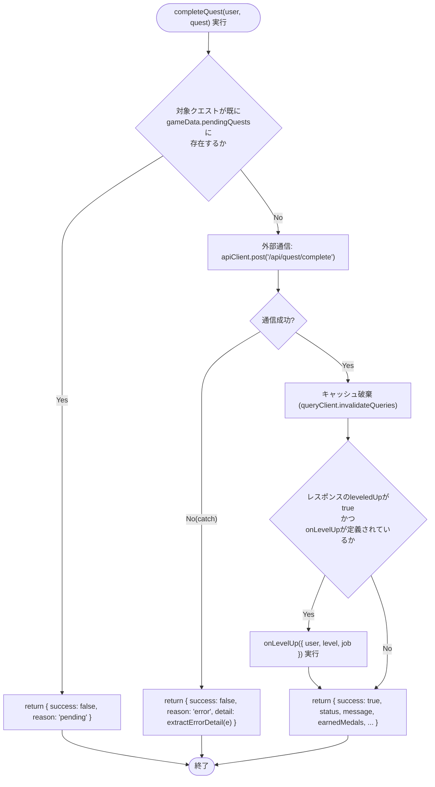
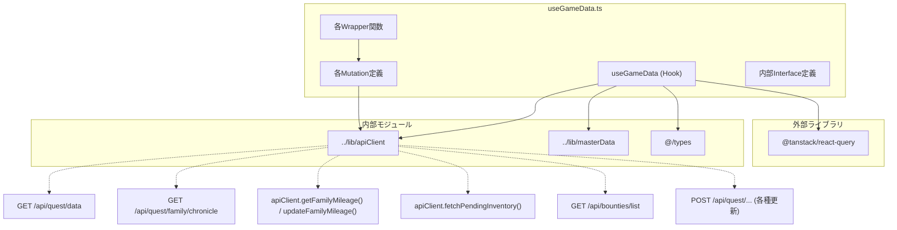

## 1. 解析メタ情報

| 項目 | 内容 |
| --- | --- |
| 対象ファイル | `useGameData.ts` |
| 言語 | React (TypeScript) |
| 解析対象 | 提供されたコードのみ |
| 推測・補完 | 一切なし |

## 2. ファイルの概要

* React Queryを活用し、ゲーム内の各種データ（ユーザー、クエスト、報酬、装備、年代記、バウンティ、インベントリなど）の取得、定期更新（ポーリング）、および状態変更（完了・承認・購入など）のAPIリクエストを統合管理するカスタムフック `useGameData` を提供する。
* データのローディング状態や、サーバーデータが欠損している場合のフォールバックデータ（マスターデータ等）の適用を責務としている。

## 3. 外部依存関係

### インポート一覧

| 名称 | 種類 | 用途 | 根拠 |
| --- | --- | --- | --- |
| `@tanstack/react-query` | ライブラリ | データのフェッチ、キャッシュ管理、ミューテーション用 | 根拠: [`useQuery`, `useMutation`, `useQueryClient`] (行番号: 1 / 抜粋: "import { useQuery, useMuta...") |
| `../lib/apiClient` | 外部モジュール | APIエンドポイントへの通信処理用クライアント | 根拠: [`apiClient`] (行番号: 2 / 抜粋: "import { apiClient } from '...") |
| `../lib/masterData` | 外部モジュール | APIレスポンスがない場合の初期値・フォールバック用定数 | 根拠: [`INITIAL_USERS` 等] (行番号: 3 / 抜粋: "import { INITIAL_USERS, MA...") |
| `@/types` | 型定義 | ユーザー、クエスト、装備などの型アノテーション | 根拠: [`User`, `Quest` 等] (行番号: 4 / 抜粋: "import { User, Quest, Ques...") |

### ブラックボックスとなる外部要素

| 名称 | 理由 | 根拠 |
| --- | --- | --- |
| `apiClient` の内部実装 | ベースURL、ヘッダ付与、認証トークン処理、エラー詳細などの具体的な通信仕様が本ファイルからは読み取れないため。`apiClient.get`/`post`に加え、`fetchPendingInventory`, `getFamilyMileage`, `updateFamilyMileage`のような専用メソッドも存在するが、その実装は不明。 | 根拠: [`apiClient.get`] (行番号: 117 / 抜粋: "queryFn: () => apiClient.get('/api/quest/data'),") |
| 各APIエンドポイントの仕様 | リクエスト後のDBの挙動、トランザクション、外部影響が不明であるため。 | 根拠: [`/api/quest/complete` 等] (行番号: 160 / 抜粋: "return apiClient.post<QuestResult>('/api/quest/complete',") |
| マスターデータの実体 | `INITIAL_USERS`, `MASTER_QUESTS`, `MASTER_REWARDS` 等の具体的なオブジェクト構造・値が不明であるため。 | 根拠: [`INITIAL_USERS`] (行番号: 393 / 抜粋: "users: gameData?.users || INITIAL_USERS,") |

## 4. 主要要素の定義（関数 / エンドポイント / コンポーネント）

### `useGameData` (カスタムフック本体)

* **役割**: ゲームに関連する各種APIデータの取得（ポーリング含む）と、それらを更新するためのラッパー関数群をまとめたオブジェクトを返す。
* 根拠: [`useGameData`] (行番号: 85〜420 / 抜粋: "export const useGameData = (onLevelUp?: (info: LevelUpInfo) => void) => {")

* **引数/リクエスト**: `onLevelUp?: (info: LevelUpInfo) => void` (レベルアップ時に発火するコールバック関数、省略可能)
* 根拠: [`useGameData`引数] (行番号: 85 / 抜粋: "export const useGameData = (onLevelUp?: (info: LevelUpInfo) => void) => {")

* **戻り値/レスポンス**: オブジェクト（`users`, `quests`, `rewards`, `bounties`, `familyMileage`, `isLoading` 等のデータ群と、`completeQuest` 等のミューテーション実行関数群）
* 根拠: [`return`文] (行番号: 392〜419 / 抜粋: "return { users: gameData?.users || INITIAL_USERS,")

* **副作用**: コンポーネントマウント中、10秒〜15秒間隔で複数のAPIエンドポイントへポーリング通信（`refetchInterval`）を実行する。
* 根拠: [`refetchInterval`] (行番号: 119, 133, 142, 150 / 抜粋: "refetchInterval: 1000 * 10, // 10秒に1回のポーリングに制限")

* **エラーハンドリング**: 内部で `handleError` 関数を呼び出しコンソールへエラーログを出力するほか、`extractErrorDetail` でバックエンドが返す具体的なエラーメッセージ（`{"detail": "..."}`）を取り出し、各ラッパー関数の返り値の`detail`として呼び出し元に渡す。
* 根拠: [`handleError`, `extractErrorDetail`] (行番号: 88〜98 / 抜粋: "const extractErrorDetail = (error: unknown): string | undefined => {")

### `handleError` (内部関数)

* **役割**: 各Mutationの`onError`で発生したエラーをコンソールに出力する。
* 根拠: [`handleError`] (行番号: 88〜90 / 抜粋: "const handleError = (actionName: string, error: unknown) => {")

* **引数/リクエスト**: `actionName: string`, `error: unknown`
* 根拠: [`handleError`引数] (行番号: 88 / 抜粋: "(actionName: string, error: unknown) => {")

* **戻り値/レスポンス**: `void`
* 根拠: [`handleError`] (行番号: 88〜90 / 抜粋: "console.error(`${actionName} failed:`, error);")

* **副作用**: コンソールへのエラー出力。
* 根拠: [`console.error`] (行番号: 89 / 抜粋: "console.error(`${actionName} failed:`, error);")

* **エラーハンドリング**: なし

### `extractErrorDetail` (内部関数)

* **役割**: `apiClient`側でスローされた`Error`から、バックエンドが返す`{"detail": "..."}`のメッセージ内容（`Error.message`）を取り出す。各ラッパー関数の`catch`節から呼ばれ、返り値の`detail`フィールドとしてApp.tsx側に渡ることで、汎用エラーメッセージではなくバックエンドの実際のエラー内容を表示できるようにする。
* 根拠: [`extractErrorDetail`] (行番号: 96〜98 / 抜粋: "const extractErrorDetail = (error: unknown): string | undefined => {")

* **引数/リクエスト**: `error: unknown`
* 根拠: [`extractErrorDetail`引数] (行番号: 96 / 抜粋: "(error: unknown): string | undefined => {")

* **戻り値/レスポンス**: `string | undefined`（`error`が`Error`インスタンスの場合は`error.message`、それ以外は`undefined`）
* 根拠: [`return`] (行番号: 97 / 抜粋: "return error instanceof Error ? error.message : undefined;")

* **副作用**: なし
* 根拠: 純粋な変換処理のみ (行番号: 96〜98)

* **エラーハンドリング**: なし

### `completeQuest` (ラッパー) & `completeQuestMutation`

* **役割**: クエスト完了APIを呼び出し、成功時に状態キャッシュを無効化する。また、ペンディング状態の事前チェックを行い、レベルアップした場合は引数の `onLevelUp` を実行する。
* 根拠: [`completeQuest`, `completeQuestMutation`] (行番号: 158〜177, 266〜291 / 抜粋: "return apiClient.post<QuestResult>('/api/quest/complete',")

* **引数/リクエスト**: `user: User`, `quest: Quest`
* 根拠: [`completeQuest`引数] (行番号: 266 / 抜粋: "const completeQuest = async (user: User, quest: Quest) => {")

* **戻り値/レスポンス**: Promise `{ success: boolean, reason?: string, status?: string, message?: string, earnedMedals?: number, leveledUp?: boolean, bossEffect?: BossEffect, detail?: string }`
* 根拠: [`return`] (行番号: 277〜287 / 抜粋: "return { success: true, status: res.status, message: res.message,")

* **副作用**: `/api/quest/complete` へのPOSTリクエスト。`queryClient.invalidateQueries` によるキャッシュ破棄。
* 根拠: [`invalidateQueries`] (行番号: 166 / 抜粋: "queryClient.invalidateQueries({ queryKey: ['gameData'] });")

* **エラーハンドリング**: `catch` 時に `{ success: false, reason: 'error', detail: extractErrorDetail(e) }` を返却し、Mutation側の`onError`で `handleError` を呼ぶ。
* 根拠: [`catch`] (行番号: 288〜290 / 抜粋: "} catch (e) { return { success: false, reason: 'error', detail: extractErrorDetail(e) }; }")

### `cancelQuest` (ラッパー) & `cancelQuestMutation`

* **役割**: クエストをキャンセルするAPIを呼び出し、成功時に状態キャッシュを無効化する。
* 根拠: [`cancelQuest`, `cancelQuestMutation`] (行番号: 180〜191, 293〜300 / 抜粋: "return apiClient.post('/api/quest/quest/cancel',")

* **引数/リクエスト**: `user: User`, `historyItem: QuestHistory`
* 根拠: [`cancelQuest`引数] (行番号: 293 / 抜粋: "const cancelQuest = async (user: User, historyItem: QuestHistory) => {")

* **戻り値/レスポンス**: Promise `{ success: boolean, reason?: string, detail?: string }`
* 根拠: [`return`] (行番号: 296 / 抜粋: "return { success: true };")

* **副作用**: `/api/quest/quest/cancel` へのPOSTリクエスト。キャッシュ破棄。
* 根拠: [`invalidateQueries`] (行番号: 188 / 抜粋: "queryClient.invalidateQueries({ queryKey: ['gameData'] });")

* **エラーハンドリング**: `catch` 時に `{ success: false, reason: 'error', detail: extractErrorDetail(e) }` を返却し、Mutation側の`onError`で `handleError` を呼ぶ。
* 根拠: [`catch`] (行番号: 297〜299 / 抜粋: "} catch (e) { return { success: false, reason: 'error', detail: extractErrorDetail(e) }; }")

### `approveQuest` (ラッパー) & `approveQuestMutation`

* **役割**: 特定のユーザー（'dad', 'mom'）のみがクエストを承認できる機能を提供する。
* 根拠: [`approveQuest`, `approveQuestMutation`] (行番号: 194〜205, 302〜314 / 抜粋: "if (!['dad', 'mom'].includes(user.user_id)) return { success: false, reason: 'permission' };")

* **引数/リクエスト**: `user: User`, `historyItem: QuestHistory`
* 根拠: [`approveQuest`引数] (行番号: 302 / 抜粋: "const approveQuest = async (user: User, historyItem: QuestHistory) => {")

* **戻り値/レスポンス**: Promise `{ success: boolean, reason?: string, bossEffect?: BossEffect, detail?: string }`
* 根拠: [`return`] (行番号: 307〜310 / 抜粋: "return { success: true, bossEffect: res?.bossEffect };")

* **副作用**: `/api/quest/approve` へのPOSTリクエスト。キャッシュ破棄。
* 根拠: [`invalidateQueries`] (行番号: 202 / 抜粋: "queryClient.invalidateQueries({ queryKey: ['gameData'] });")

* **エラーハンドリング**: 権限外の場合は即座に `{ success: false, reason: 'permission' }` を返す。通信エラー時は `{ success: false, reason: 'error', detail: extractErrorDetail(e) }` を返す。
* 根拠: [`if`ブロック] (行番号: 303 / 抜粋: "if (!['dad', 'mom'].includes(user.user_id)) return { success: false, reason: 'permission' };")

### `rejectQuest` (ラッパー) & `rejectQuestMutation`

* **役割**: 特定のユーザー（'dad', 'mom'）のみがクエストを却下できる機能を提供する。
* 根拠: [`rejectQuest`, `rejectQuestMutation`] (行番号: 208〜219, 316〜324 / 抜粋: "if (!['dad', 'mom'].includes(user.user_id)) return { success: false, reason: 'permission' };")

* **引数/リクエスト**: `user: User`, `historyItem: QuestHistory`
* 根拠: [`rejectQuest`引数] (行番号: 316 / 抜粋: "const rejectQuest = async (user: User, historyItem: QuestHistory) => {")

* **戻り値/レスポンス**: Promise `{ success: boolean, reason?: string, detail?: string }`
* 根拠: [`return`] (行番号: 320 / 抜粋: "return { success: true };")

* **副作用**: `/api/quest/reject` へのPOSTリクエスト。キャッシュ破棄。
* 根拠: [`invalidateQueries`] (行番号: 216 / 抜粋: "queryClient.invalidateQueries({ queryKey: ['gameData'] });")

* **エラーハンドリング**: 権限外は事前弾き。通信エラー時は `{ success: false, reason: 'error', detail: extractErrorDetail(e) }` を返す。
* 根拠: [`catch`] (行番号: 321〜323 / 抜粋: "} catch (e) { return { success: false, reason: 'error', detail: extractErrorDetail(e) }; }")

### `buyReward` (ラッパー) & `buyRewardMutation`

* **役割**: 所持ゴールドが足りているか検証した上で、報酬の購入処理を行う。
* 根拠: [`buyReward`, `buyRewardMutation`] (行番号: 222〜234, 327〜337 / 抜粋: "if ((user.gold || 0) < cost) return { success: false, reason: 'gold' };")

* **引数/リクエスト**: `user: User`, `reward: Reward`
* 根拠: [`buyReward`引数] (行番号: 327 / 抜粋: "const buyReward = async (user: User, reward: Reward) => {")

* **戻り値/レスポンス**: Promise `{ success: boolean, reason?: string, newGold?: number, reward?: Reward, detail?: string }`
* 根拠: [`return`] (行番号: 333 / 抜粋: "return { success: true, newGold: res.newGold, reward };")

* **副作用**: `/api/quest/reward/purchase` へのPOST。キャッシュ破棄（全体データおよび対象ユーザーのインベントリ）。
* 根拠: [`invalidateQueries`] (行番号: 230〜231 / 抜粋: "queryClient.invalidateQueries({ queryKey: ['inventory', variables.user.user_id] });")

* **エラーハンドリング**: ゴールド不足時は `{ success: false, reason: 'gold' }`。通信エラー時は `{ success: false, reason: 'error', detail: extractErrorDetail(e) }`。
* 根拠: [`if`ブロック] (行番号: 329 / 抜粋: "if ((user.gold || 0) < cost) return { success: false, reason: 'gold' };")

### `buyEquipment` (ラッパー) & `buyEquipmentMutation`

* **役割**: 所持ゴールドを検証し、装備の購入処理を行う。
* 根拠: [`buyEquipment`, `buyEquipmentMutation`] (行番号: 237〜248, 339〜348 / 抜粋: "if ((user.gold || 0) < item.cost) return { success: false, reason: 'gold' };")

* **引数/リクエスト**: `user: User`, `item: Equipment`
* 根拠: [`buyEquipment`引数] (行番号: 339 / 抜粋: "const buyEquipment = async (user: User, item: Equipment) => {")

* **戻り値/レスポンス**: Promise `{ success: boolean, reason?: string, item?: Equipment, detail?: string }`
* 根拠: [`return`] (行番号: 344 / 抜粋: "return { success: true, item };")

* **副作用**: `/api/quest/equip/purchase` へのPOSTリクエスト。キャッシュ破棄。
* 根拠: [`invalidateQueries`] (行番号: 245 / 抜粋: "queryClient.invalidateQueries({ queryKey: ['gameData'] });")

* **エラーハンドリング**: ゴールド不足事前チェック、エラー時は `{ success: false, reason: 'error', detail: extractErrorDetail(e) }`。
* 根拠: [`catch`] (行番号: 345〜347 / 抜粋: "} catch (e) { return { success: false, reason: 'error', detail: extractErrorDetail(e) }; }")

### `changeEquipment` (ラッパー) & `changeEquipmentMutation`

* **役割**: 装備の変更APIを呼び出す。
* 根拠: [`changeEquipment`, `changeEquipmentMutation`] (行番号: 251〜262, 350〜357 / 抜粋: "return apiClient.post('/api/quest/equip/change',")

* **引数/リクエスト**: `user: User`, `item: Equipment`
* 根拠: [`changeEquipment`引数] (行番号: 350 / 抜粋: "const changeEquipment = async (user: User, item: Equipment) => {")

* **戻り値/レスポンス**: Promise `{ success: boolean, reason?: string, detail?: string }`
* 根拠: [`return`] (行番号: 353 / 抜粋: "return { success: true };")

* **副作用**: `/api/quest/equip/change` へのPOSTリクエスト。キャッシュ破棄。
* 根拠: [`invalidateQueries`] (行番号: 259 / 抜粋: "queryClient.invalidateQueries({ queryKey: ['gameData'] });")

* **エラーハンドリング**: 通信エラー時は `{ success: false, reason: 'error', detail: extractErrorDetail(e) }`。
* 根拠: [`catch`] (行番号: 354〜356 / 抜粋: "} catch (e) { return { success: false, reason: 'error', detail: extractErrorDetail(e) }; }")

### `refreshData`

* **役割**: 手動で `gameData` と `inventory` のキャッシュを破棄し、再取得をトリガーする。
* 根拠: [`refreshData`] (行番号: 359〜362 / 抜粋: "const refreshData = () => {")

* **引数/リクエスト**: なし
* 根拠: [`refreshData`引数] (行番号: 359 / 抜粋: "const refreshData = () => {")

* **戻り値/レスポンス**: `void`
* 根拠: [`refreshData`] (行番号: 359〜362 / 抜粋: "const refreshData = () => {")

* **副作用**: キャッシュ破棄（`['gameData']`, `['inventory']`。`['inventory']`は前方一致的に全ユーザー分のインベントリを強制再取得する）
* 根拠: [`invalidateQueries`] (行番号: 360〜361 / 抜粋: "queryClient.invalidateQueries({ queryKey: ['inventory'] }); // 全インベントリも強制再取得")

* **エラーハンドリング**: なし

### `adminUpdateBoss` (ラッパー) & `adminUpdateBossMutation`

* **役割**: ボスの状態（最大HP、現在HP、討伐状態）を更新する管理用APIを呼び出す。
* 根拠: [`adminUpdateBoss`, `adminUpdateBossMutation`] (行番号: 101〜112, 364〜371 / 抜粋: "return apiClient.post('/api/quest/admin/boss/update',")

* **引数/リクエスト**: `data: { maxHp?: number; currentHp?: number; isDefeated?: boolean }`
* 根拠: [`adminUpdateBoss`引数] (行番号: 364 / 抜粋: "const adminUpdateBoss = async (data: { maxHp?: number; currentHp?: number; isDefeated?: boolean }) => {")

* **戻り値/レスポンス**: Promise `{ success: boolean, detail?: string }`
* 根拠: [`return`] (行番号: 367 / 抜粋: "return { success: true };")

* **副作用**: `/api/quest/admin/boss/update` へのPOSTリクエスト。キャッシュ破棄。
* 根拠: [`invalidateQueries`] (行番号: 110 / 抜粋: "queryClient.invalidateQueries({ queryKey: ['gameData'] });")

* **エラーハンドリング**: エラー時は `{ success: false, detail: extractErrorDetail(e) }` を返却。
* 根拠: [`catch`] (行番号: 368〜370 / 抜粋: "} catch (e) { return { success: false, detail: extractErrorDetail(e) }; }")

### `adminUpdateFamilyMileage` (ラッパー) & `adminUpdateFamilyMileageMutation`

* **役割**: 家族のマイレージ情報を更新する管理用APIを呼び出す。
* 根拠: [`adminUpdateFamilyMileage`, `adminUpdateFamilyMileageMutation`] (行番号: 373〜380, 382〜389 / 抜粋: "return apiClient.updateFamilyMileage(targetName, targetExp);")

* **引数/リクエスト**: `targetName: string`, `targetExp: number`
* 根拠: [`adminUpdateFamilyMileage`引数] (行番号: 382 / 抜粋: "const adminUpdateFamilyMileage = async (targetName: string, targetExp: number) => {")

* **戻り値/レスポンス**: Promise `{ success: boolean, detail?: string }`
* 根拠: [`return`] (行番号: 385 / 抜粋: "return { success: true };")

* **副作用**: `apiClient.updateFamilyMileage` の呼び出し。`['familyMileage']` キャッシュ破棄。
* 根拠: [`invalidateQueries`] (行番号: 378 / 抜粋: "queryClient.invalidateQueries({ queryKey: ['familyMileage'] });")

* **エラーハンドリング**: エラー時は `{ success: false, detail: extractErrorDetail(e) }` を返却。
* 根拠: [`catch`] (行番号: 386〜388 / 抜粋: "} catch (e) { return { success: false, detail: extractErrorDetail(e) }; }")

## 5. 処理フロー図

※ `completeQuest` （クエスト完了）の主要な処理フロー

```mermaid
flowchart TD
    Start(["completeQuest(user, quest) 実行"]) --> CheckPending{"対象クエストが既に\ngameData.pendingQuestsに\n存在するか"}
    CheckPending -- Yes --> ReturnPending["return { success: false, reason: 'pending' }"]
    CheckPending -- No --> MutateAsync["外部通信: apiClient.post('/api/quest/complete')"]
    MutateAsync --> CheckSuccess{"通信成功?"}
    CheckSuccess -- No(catch) --> ReturnError["return { success: false, reason: 'error', detail: extractErrorDetail(e) }"]
    CheckSuccess -- Yes --> InvalidateCache["キャッシュ破棄 (queryClient.invalidateQueries)"]
    InvalidateCache --> CheckLevelUp{"レスポンスのleveledUpがtrue\nかつ\nonLevelUpが定義されているか"}
    CheckLevelUp -- Yes --> CallOnLevelUp["onLevelUp({ user, level, job }) 実行"]
    CallOnLevelUp --> ReturnSuccess["return { success: true, status, message, earnedMedals, ... }"]
    CheckLevelUp -- No --> ReturnSuccess
    ReturnError --> End(["終了"])
    ReturnPending --> End
    ReturnSuccess --> End

```

## 6. 依存関係図

```mermaid
graph TD
    subgraph "useGameData.ts"
        Hook_useGameData["useGameData (Hook)"]
        Mutations["各Mutation定義"]
        Wrappers["各Wrapper関数"]
        Types["内部Interface定義"]
    end

    subgraph "外部ライブラリ"
        ReactQuery["@tanstack/react-query"]
    end

    subgraph "内部モジュール"
        APIClient["../lib/apiClient"]
        MasterData["../lib/masterData"]
        AppTypes["@/types"]
    end

    Hook_useGameData --> ReactQuery
    Hook_useGameData --> APIClient
    Hook_useGameData --> MasterData
    Hook_useGameData --> AppTypes
    Mutations --> APIClient
    Wrappers --> Mutations

    APIClient -.-> Endpoint_Data["GET /api/quest/data"]
    APIClient -.-> Endpoint_Chronicle["GET /api/quest/family/chronicle"]
    APIClient -.-> Endpoint_FamilyMileage["apiClient.getFamilyMileage() / updateFamilyMileage()"]
    APIClient -.-> Endpoint_Pending["apiClient.fetchPendingInventory()"]
    APIClient -.-> Endpoint_Bounties["GET /api/bounties/list"]
    APIClient -.-> Endpoint_Mutations["POST /api/quest/... (各種更新)"]

```

## 7. 次のステップ（リバースエンジニアリングの提案）

| 優先度 | ファイル名(推測可) | 理由 | 根拠 |
| --- | --- | --- | --- |
| 高 | `../lib/apiClient.ts` | `fetchPendingInventory`, `getFamilyMileage`, `updateFamilyMileage`など専用メソッドの実際のエンドポイントや、`Error.message`に`detail`を詰める仕組みを確認する必要がある。 | 根拠: [`apiClient`] (行番号: 2 / 抜粋: "import { apiClient } from '...") |
| 中 | バックエンドのエンドポイント (例: `/api/quest/complete` のハンドラ等) | トランザクションや、クエスト完了時のレベルアップ計算処理（`leveledUp`の判定ロジック）などの仕様を確認するため。 | 根拠: [`/api/quest/complete`] (行番号: 160 / 抜粋: "return apiClient.post<QuestResult>('/api/quest/complete',") |
| 低 | `../lib/masterData.ts` | 初期データの構成を確認し、API通信失敗時や初期表示時の画面挙動を特定するため。 | 根拠: [`INITIAL_USERS`] (行番号: 3 / 抜粋: "import { INITIAL_USERS, MA...") |

## 8. 保守上の注意点

* **過剰なポーリングの可能性**: `useQuery` で設定されている `refetchInterval` が、`gameData`・`familyMileage`・`pendingInventory`・`bounties`の4系統に対して 10秒〜15秒間隔で同時に設定されており、マウント中の通信頻度が高い。
* **`approveQuestMutation` の戻り値キャスト**: `approveQuest` 内で `mutateAsync` の戻り値を `as unknown as ApproveResponse` として型キャストしている。`buyReward` 側も同様に `as unknown as PurchaseResponse` を使っており、`apiClient.post` 自体の戻り値の型（`unknown`または汎用型）と実際のレスポンス形状との整合はランタイムでは検証されない。
* **ハードコードされた権限チェック**: `approveQuest` と `rejectQuest` 内で `['dad', 'mom'].includes(user.user_id)` という特定文字列のIDによる権限チェックが行われている。あくまでクライアント側の事前チェックであり、バックエンド側の認可を代替するものではない。
* **`refreshData` のキャッシュ無効化範囲**: `queryClient.invalidateQueries({ queryKey: ['inventory'] })` はキー全体（`['inventory', userId]`形式のクエリすべて）を前方一致で無効化する設計であり、コメントで「全インベントリも強制再取得」と明示されている。

## 9. 不明事項一覧

| 項目 | 理由 | 必要なファイル |
| --- | --- | --- |
| `apiClient`の具体的な通信設定 | URLのプレフィックス、認証トークンの付与方法がコード上に見当たらないため。 | `../lib/apiClient.ts` |
| `INITIAL_USERS` や `MASTER_QUESTS` の中身 | 外部ファイルからインポートされており、値の構造が不明なため。 | `../lib/masterData.ts` |
| 各種Typeの完全なプロパティ | `User`, `Quest`, `Reward` などのプロパティが本ファイル内では一部しか使用されていないため。 | `@/types.ts` 等 |
| `apiClient.fetchPendingInventory`, `getFamilyMileage`, `updateFamilyMileage` の実エンドポイント | メソッド名のみが呼び出されており、実際に叩かれるURLやHTTPメソッドが本ファイルからは不明なため。 | `../lib/apiClient.ts` |

## 10. 自己検証結果

* [x] 推測・外部ファイルの仕様を一切含んでいない
* [x] 全関数・全クラス・全コンポーネントを列挙した
* [x] 全てのインポート要素を列挙した
* [x] すべての仕様説明に「根拠（行番号・抜粋）」を明記した
* [x] 根拠漏れが0件である
* [x] Mermaid構文にエラーの原因となる記号（エスケープ漏れ）がない
* [x] 不明事項を漏れなく列挙した

完了