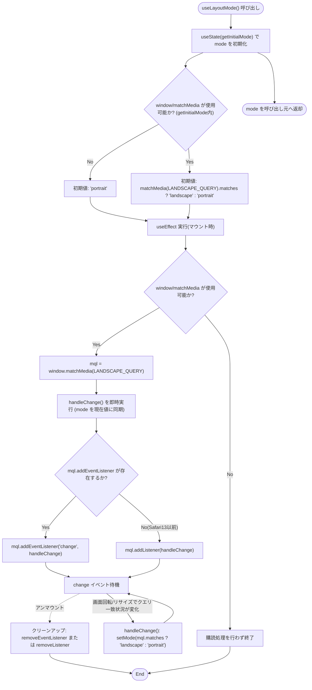
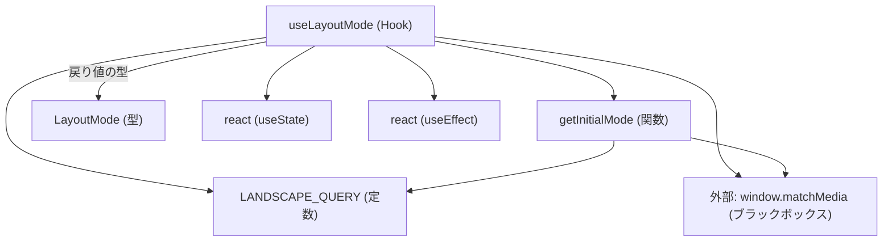

## 1. 解析メタ情報

| 項目 | 内容 |
| --- | --- |
| 対象ファイル | useLayoutMode.ts |
| 言語 | TypeScript (React Hooks) |
| 解析対象 | 提供されたコードのみ |
| 推測・補完 | 一切なし |

## 関連ドキュメント

- [App.md](../../App.md) — `layoutMode`の戻り値を実際に画面分岐（`FamilyDashboard`/縦画面UI）に使う呼び出し元。
- [Header.md](../components/layout/Header.md) — `hideUserSwitcher`propが`layoutMode === 'landscape'`と連動する利用先。

## 2. ファイルの概要

横画面（Echo Show 15等の常設デバイス）/縦画面（スマホ）のレイアウト判定を行うカスタムフック`useLayoutMode`を提供する。`window.matchMedia`によるメディアクエリ（`(min-width: 900px) and (orientation: landscape)`）の一致状況を購読し、ウィンドウのリサイズや画面回転にリアルタイムに追従して`'landscape' | 'portrait'`のいずれかを返す。

* 根拠: フック直前のコメント (行番号: 13〜14 / 抜粋: "// 横画面(Echo Show 15等の常設デバイス)/縦画面(スマホ)のレイアウト判定フック。\n// window.matchMedia の変化を購読し、リサイズ・回転にリアルタイムに追従する。")

## 3. 外部依存関係

### インポート一覧

| 名称 | 種類 | 用途 | 根拠 |
| --- | --- | --- | --- |
| `useEffect`, `useState` | フック | メディアクエリ変化の購読およびレイアウトモードのローカル状態管理 | `import { useEffect, useState } from 'react';` (行番号: 1) |

### ブラックボックスとなる外部要素

| 名称 | 理由 | 根拠 |
| --- | --- | --- |
| `window.matchMedia` | ブラウザ実行環境のAPIであり、静的解析では実際の一致判定結果が不明。Safari 13以前は`addEventListener`非対応で`addListener`にフォールバックする旨がコメントに明記されているが、これはブラウザ側の挙動に依存する。 | 根拠: (行番号: 21, 26〜32 / 抜粋: "const mql = window.matchMedia(LANDSCAPE_QUERY);", "// Safari 13以前は addEventListener 非対応のため addListener にフォールバックする") |
| 実行環境の画面幅・向き | `(min-width: 900px) and (orientation: landscape)`の実際の一致・不一致は、本フックを実行するデバイスの画面サイズと向きに依存し、コード単体からは判定不可。 | 根拠: (行番号: 4 / 抜粋: "const LANDSCAPE_QUERY = '(min-width: 900px) and (orientation: landscape)';") |

## 4. 主要要素の定義（関数 / エンドポイント / コンポーネント）

### `LANDSCAPE_QUERY` (モジュールレベル定数)

* **役割**: 横画面判定に使うメディアクエリ文字列。Echo Show 15（常設・横画面）を想定した閾値であり、実機での見え方を見て調整可能である旨がコメントで明記されている。
* 根拠: (行番号: 3〜4 / 抜粋: "// Echo Show 15 (常設・横画面) 想定の閾値。実機での見え方を見て調整可。\nconst LANDSCAPE_QUERY = '(min-width: 900px) and (orientation: landscape)';")

### `LayoutMode` (型定義)

* **役割**: レイアウトモードを表す型。`'landscape'`（横画面）または`'portrait'`（縦画面）の2値。
* 根拠: (行番号: 6 / 抜粋: "export type LayoutMode = 'landscape' | 'portrait';")

### `getInitialMode` (モジュールレベル関数)

* **役割**: `useState`の初期値算出用の関数。`window`が存在しない（SSR等）、または`window.matchMedia`が使用できない環境では`'portrait'`を返す。それ以外は`window.matchMedia(LANDSCAPE_QUERY).matches`の真偽に応じて`'landscape'`または`'portrait'`を返す。
* 根拠: (行番号: 8〜11 / 抜粋: "const getInitialMode = (): LayoutMode => {\n    if (typeof window === 'undefined' || !window.matchMedia) return 'portrait';\n    return window.matchMedia(LANDSCAPE_QUERY).matches ? 'landscape' : 'portrait';\n};")

* **引数/リクエスト**: なし
* **戻り値/レスポンス**: `LayoutMode`（`'landscape' | 'portrait'`）
* **副作用**: `window.matchMedia`の呼び出し（クエリ評価のみ、購読はしない）
* **エラーハンドリング**: `typeof window === 'undefined' || !window.matchMedia`の場合は`'portrait'`にフォールバックする形で防御している。
* 根拠: (行番号: 9 / 抜粋: "if (typeof window === 'undefined' || !window.matchMedia) return 'portrait';")

### `useLayoutMode` (カスタムフック本体)

* **役割**: `getInitialMode`を初期値として`mode`ステートを持ち、`useEffect`内で`window.matchMedia(LANDSCAPE_QUERY)`の`change`イベントを購読して、メディアクエリの一致状況が変わるたびに`mode`を更新する。ブラウザが`addEventListener`（`MediaQueryList`用）に対応していれば`addEventListener('change', ...)`を、対応していなければSafari 13以前向けの`addListener`/`removeListener`にフォールバックする。
* 根拠: (行番号: 15〜37 / 抜粋: "export function useLayoutMode(): LayoutMode {")

* **引数/リクエスト**: なし
* 根拠: (行番号: 15 / 抜粋: "export function useLayoutMode(): LayoutMode {")

* **戻り値/レスポンス**: `LayoutMode`（`'landscape' | 'portrait'`）
* 根拠: (行番号: 36 / 抜粋: "return mode;")

* **副作用**:
* `mode`ステートの更新（`setMode`）
* 根拠: (行番号: 16, 22 / 抜粋: "const [mode, setMode] = useState<LayoutMode>(getInitialMode);", "const handleChange = () => setMode(mql.matches ? 'landscape' : 'portrait');")

* `window.matchMedia(LANDSCAPE_QUERY)`への`change`イベントリスナー登録（マウント時）と解除（アンマウント時のクリーンアップ関数経由）
* 根拠: (行番号: 27〜33 / 抜粋: "if (mql.addEventListener) {\n            mql.addEventListener('change', handleChange);\n            return () => mql.removeEventListener('change', handleChange);\n        } else {\n            mql.addListener(handleChange);\n            return () => mql.removeListener(handleChange);\n        }")

* マウント直後に`handleChange()`を即時呼び出しし、現在の一致状況を`mode`に反映する
* 根拠: (行番号: 24 / 抜粋: "handleChange();")

* **エラーハンドリング**: `useEffect`内で`typeof window === 'undefined' || !window.matchMedia`の場合は購読処理を行わずに`return`する（SSR/非対応環境への防御）。
* 根拠: (行番号: 19 / 抜粋: "if (typeof window === 'undefined' || !window.matchMedia) return;")

## 5. 処理フロー図

## 6. 依存関係図

## 7. 次のステップ（リバースエンジニアリングの提案）

| 優先度 | ファイル名(推測可) | 理由 | 根拠 |
| --- | --- | --- | --- |
| 高 | `App.tsx` | `useLayoutMode()`の戻り値が実際にどのように`FamilyDashboard`/縦画面UIの分岐条件として使われているか（呼び出し実態）を確認するため。 | 本ファイル単体では利用側の分岐ロジックは不明 |
| 中 | `./components/layout/Header.tsx` | `hideUserSwitcher`propが`layoutMode === 'landscape'`と連動している呼び出し元（`App.tsx`）経由での利用実態を確認するため。 | 本ファイル単体では`Header.tsx`との連携は不明 |

## 8. 保守上の注意点

* **メディアクエリ閾値の調整可能性**: `LANDSCAPE_QUERY`（`900px`以上かつ`landscape`向き）はコメントで「実機での見え方を見て調整可」と明記されており、対象デバイスの実際の解像度に応じて変更される可能性がある。この定数の値に依存するコンポーネント（`App.tsx`等）は、閾値変更の影響を受ける。
* 根拠: (行番号: 3 / 抜粋: "// Echo Show 15 (常設・横画面) 想定の閾値。実機での見え方を見て調整可。")
* **旧ブラウザ互換のためのフォールバック**: `MediaQueryList.addEventListener`が使えない環境（Safari 13以前）向けに`addListener`/`removeListener`（非推奨API）へのフォールバックを実装している。将来的に`addListener`系APIがブラウザから完全に削除された場合、このフォールバック分岐自体が動作しなくなる可能性がある。
* 根拠: (行番号: 26〜27 / 抜粋: "// Safari 13以前は addEventListener 非対応のため addListener にフォールバックする\n        if (mql.addEventListener) {")
* **SSR環境でのフォールバック値**: `typeof window === 'undefined'`の場合、`getInitialMode`と`useEffect`内のガードの両方で`'portrait'`（縦画面）として扱われる。SSR環境で横画面デバイス向けのレンダリングが必要な場合、初期値のミスマッチ（ハイドレーション不整合）が発生しうる。
* 根拠: (行番号: 9, 19 / 抜粋: "if (typeof window === 'undefined' || !window.matchMedia) return 'portrait';", "if (typeof window === 'undefined' || !window.matchMedia) return;")

## 9. 不明事項一覧

| 項目 | 理由 | 必要なファイル |
| --- | --- | --- |
| `layoutMode`の実際の利用箇所・分岐条件 | 本フックは判定結果を返すのみであり、`'landscape'`/`'portrait'`それぞれの場合にどのUIが描画されるかは呼び出し元次第で不明なため。 | `App.tsx` |
| `900px`という閾値の決定根拠 | コメントで「実機での見え方を見て調整可」とあるのみで、具体的な検証データやEcho Show 15以外の対応デバイスの有無は本ファイルからは不明なため。（リポジトリ内を`900px`/`Echo Show`で検索したが、デザイン仕様書等の根拠ファイルは存在せず、解消不可。当該コメント以上の記述はコード上に見当たらない） | 本ファイル外（デザイン仕様書等、存在すれば） |

## 相互参照による補足情報

| 元の不明事項 | 判明した内容 | 参照元ドキュメント |
| --- | --- | --- |
| `layoutMode`の実際の利用箇所・分岐条件 | `family-quest/src/App.tsx`を直接確認した。`App`コンポーネント(140行目)は`useLayoutMode()`の戻り値を`layoutMode`として保持し、`viewMode==='main' && layoutMode==='landscape'`(397行目)のとき`FamilyDashboard`（4人常時表示）を、`viewMode==='main' && layoutMode==='portrait'`(414行目)のとき`UserStatusCard`＋（`isParentUser`なら421行目で）`ApprovalList`＋左右スワイプ対応タブ切替（`quest`/`shop`/`inventory`）を描画する。`Header`へは`hideUserSwitcher={layoutMode === 'landscape'}`(386行目)と`hideLogSwitcher={layoutMode === 'portrait'}`(387行目)、`showBackToMain={layoutMode === 'landscape'}`(388行目)を渡し、コンテナの最大幅も`layoutMode === 'landscape' ? 'max-w-7xl' : 'max-w-md md:max-w-5xl'`(395行目)と切り替えている。縦画面時のみ`BottomNav`を表示する分岐(479行目、`layoutMode === 'portrait'`)も確認した。 | 直接ソース確認: `family-quest/src/App.tsx:140,386-388,395,397,414,421,479` |

## 10. 自己検証結果

* [x] 完了: 推測・外部ファイルの仕様を一切含んでいない
* [x] 完了: 全関数・全クラス・全コンポーネントを列挙した
* [x] 完了: 全てのインポート要素を列挙した
* [x] 完了: すべての仕様説明に「根拠（行番号・抜粋）」を明記した
* [x] 完了: 根拠漏れが0件である
* [x] 完了: Mermaid構文にエラーの原因となる記号（エスケープ漏れ）がない
* [x] 完了: 不明事項を漏れなく列挙した
