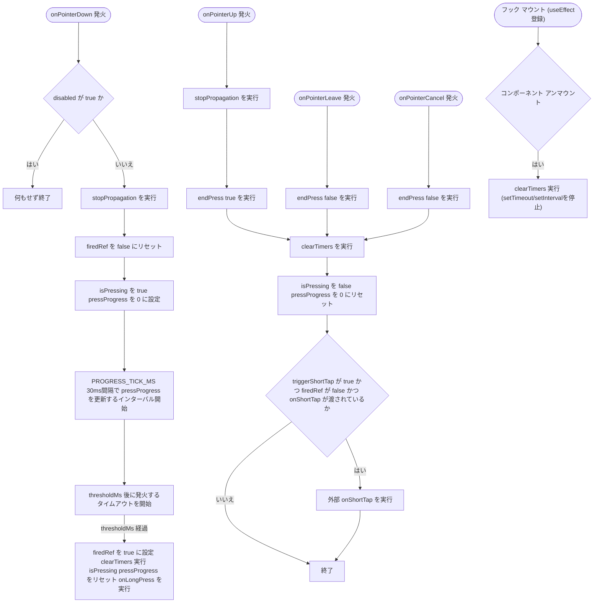
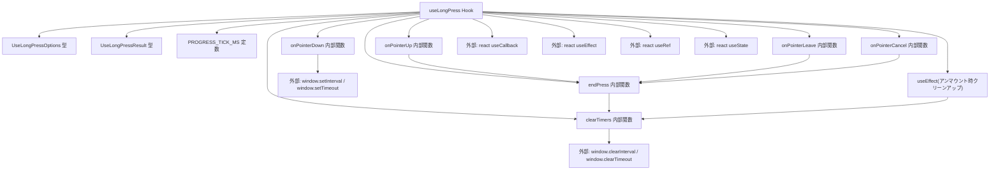

## 1. 解析メタ情報

| 項目 | 内容 |
| --- | --- |
| 対象ファイル | useLongPress.ts |
| 言語 | TypeScript (React Hooks) |
| 解析対象 | 提供されたコードのみ |
| 推測・補完 | 一切なし |
| 解析基準コミット | `4062600` |

## 関連ドキュメント

* [../features/quest/components/QuestList.md](../features/quest/components/QuestList.md) - 本フックを呼び出している唯一の箇所（完了済み/申請中クエストの「取り消し」ジェスチャーとして使用）。Issue #568以降は、`wasFiredRecently()`でclickを抑止すると判断した直後に`clearFiredFlag()`を呼んでフラグを消費する呼び出し元でもある。

## 2. ファイルの概要

完了済み/申請中クエストの「取り消し」操作を、うっかりタップで誤発火させないための長押しジェスチャーを提供するカスタムフックである。ポインターダウンから`thresholdMs`（デフォルト600ms）経過するまで押され続けた場合は`onLongPress`を、それより前に指が離された場合は`onShortTap`（渡されていれば）を呼び出す。押している間の経過割合(`pressProgress`、0〜1)も返却し、長押し中のプログレス表示に利用できる。**（Issue #389）** さらに、直近の長押し発火から`clickSuppressMs`（既定400ms）以内か、または現在のプレスで既に長押しが発火済みかを返す`wasFiredRecently()`を返却する。長押し（取消）が発火→取消API→再取得で同じDOMノードに`onClick`（完了確認）が付け替わった直後に、指を離した瞬間の`click`が完了確認モーダルを開いてしまう競合を、呼び出し側の`onClick`ハンドラでガードするためのものである。**（Issue #568で修正）** 以前は`clickSuppressMs`の経過時間のみで判定しており、`thresholdMs`到達（長押し発火）後、さらに`clickSuppressMs`を超えて指を押し続けてから離すと、同一プレスの発火であるにもかかわらず`false`を誤って返していた。現在は`firedRef.current`が`true`である間（＝現在のプレスが開始してから次の`onPointerDown`が来るまでの全期間）は経過時間に関係なく`true`を返すよう修正されている。あわせて、呼び出し側が`wasFiredRecently()`で一度clickを抑止した後にこのフラグを明示的にリセットするための`clearFiredFlag()`が新設された（`canCancel`が`false`に変わり`onPointerDown`が二度と付け替えられなくなるケースでフラグが永久にリセットされない問題への対処。詳細は4節`clearFiredFlag`の項および8節を参照）。
* 根拠: `wasFiredRecently` (行番号: 18〜22, 103〜115 / 抜粋: "// #389: 直近 clickSuppressMs 以内に onLongPress が発火したかどうか。", "const wasFiredRecently = useCallback((): boolean => {\n        // #568: 経過時間だけで判定すると、長押し発火(thresholdMs時点)後も\n        // clickSuppressMsを超えて指を押し続けてから離した場合に、直前の長押しで\n        // 発火したのと同一プレスであるにもかかわらずfalseを返してしまい、\n        // 離した瞬間のclickが抑止されなかった(#389の修正が不完全だった箇所)。\n        // firedRef.currentは次のpointerdownまでtrueであり続けるため、\n        // 「今まさに終わろうとしているこのプレスで長押しが発火したか」を\n        // 経過時間に関係なく正しく示す。時間窓の判定も、pointerdown前(＝別プレス)の\n        // 発火直後に残っているかもしれない古いclickを抑止するために引き続き併用する。\n        if (firedRef.current) return true;\n        const firedAt = lastFiredAtRef.current;\n        return firedAt !== null && Date.now() - firedAt < clickSuppressMs;\n    }, [clickSuppressMs]);")
* 根拠: `clearFiredFlag` (行番号: 23〜29, 117〜120 / 抜粋: "// #568: wasFiredRecently()がtrueを理由にclickを抑止した呼び出し側は、抑止し終えたら\n    // このフラグを消費(リセット)するために呼ぶこと。", "const clearFiredFlag = useCallback(() => {\n        firedRef.current = false;\n        lastFiredAtRef.current = null;\n    }, []);")

* 根拠: `// 完了済み/申請中クエストの「取り消し」を、うっかりタップで発火させないための\n// 長押しジェスチャー用フック。閾値に達したら onLongPress、\n// 達する前に指を離したら onShortTap を呼ぶ。` (行番号: 41〜43)
* 根拠: `thresholdMs?: number;` (行番号: 7), `thresholdMs = 600,` (行番号: 47)
* 根拠: `// 押し始めてからの経過割合(0〜1)。長押し中のプログレス表示に使う\n    pressProgress: number;` (行番号: 15〜16)

## 3. 外部依存関係

### インポート一覧

| 名称 | 種類 | 用途 | 根拠 |
| --- | --- | --- | --- |
| useCallback | フック | `onPointerDown`, `endPress`, `wasFiredRecently`, `clearFiredFlag`, `onPointerUp`, `onPointerLeave`, `onPointerCancel`, `clearTimers`各関数の参照を安定化するために使用 | 根拠: `import { useCallback, useEffect, useRef, useState } from 'react';` (行番号: 1) |
| useEffect | フック | フックのマウント〜アンマウント間で、アンマウント時に`clearTimers`を実行するクリーンアップ副作用を登録するために使用 | 根拠: `import { useCallback, useEffect, useRef, useState } from 'react';` (行番号: 1) |
| useRef | フック | タイマーID(`timeoutRef`, `intervalRef`)、長押し発火済みフラグ(`firedRef`)、直近発火時刻(`lastFiredAtRef`)の、再レンダリングを引き起こさないミュータブルな保持 | 根拠: `import { useCallback, useEffect, useRef, useState } from 'react';` (行番号: 1) |
| useState | フック | `pressProgress`（経過割合）と`isPressing`（押下中フラグ）のローカル状態管理 | 根拠: `import { useCallback, useEffect, useRef, useState } from 'react';` (行番号: 1) |

### ブラックボックスとなる外部要素

| 名称 | 理由 | 根拠 |
| --- | --- | --- |
| `window.setTimeout` / `window.clearTimeout` / `window.setInterval` / `window.clearInterval` | ブラウザ実行環境のグローバルAPIであり、タイマーの実行精度・スロットリング挙動はコード単体からは判定不可 | 根拠: `timeoutRef.current = window.setTimeout(() => {` (行番号: 82), `intervalRef.current = window.setInterval(() => {` (行番号: 78), `window.clearTimeout(timeoutRef.current);` (行番号: 61), `window.clearInterval(intervalRef.current);` (行番号: 65) |
| `React.PointerEvent` | Reactの型定義であり、`import type`等での明示的なimportは行われていない（型のみの参照）。ポインターイベントの実際の発火条件（マウス/タッチ/ペン等デバイス差異）はブラウザ実装に依存し不明 | 根拠: `onPointerDown: (e: React.PointerEvent) => void;` (行番号: 31) |

## 4. 主要要素の定義（関数 / エンドポイント / コンポーネント）

### `UseLongPressOptions` (型定義)

* **役割**: `useLongPress`が受け取る引数の型定義。長押し時のコールバック(`onLongPress`、必須)、短タップ時のコールバック(`onShortTap`、任意)、長押し判定の閾値ミリ秒(`thresholdMs`、任意)、フック自体の無効化フラグ(`disabled`、任意)、長押し発火後にclickを無視する猶予ミリ秒(`clickSuppressMs`、任意、Issue #389で追加)を持つ。
* 根拠: `interface UseLongPressOptions {\n    onLongPress: () => void;\n    // 長押しに達しなかった場合の通常タップ。渡さなければ短タップは何もしない。\n    onShortTap?: () => void;\n    thresholdMs?: number;\n    disabled?: boolean;\n    // #389: 長押し発火後、この時間内に届いた click を「直前の長押しの余韻」とみなして\n    // 呼び出し側が無視できるようにするための猶予時間。\n    clickSuppressMs?: number;\n}` (行番号: 3〜12)

### `UseLongPressResult` (型定義)

* **役割**: `useLongPress`の戻り値の型定義。押下経過割合(`pressProgress`)、押下中フラグ(`isPressing`)、直近の長押し発火が猶予時間内か（または現在のプレスで発火済みか）を返す`wasFiredRecently`(Issue #389で追加、Issue #568で判定ロジックを修正)、`wasFiredRecently`の判定結果を呼び出し側が消費(リセット)するための`clearFiredFlag`(Issue #568で追加)、DOM要素に紐付ける4種のポインターイベントハンドラ(`handlers`)を持つ。
* 根拠: `interface UseLongPressResult {\n    // 押し始めてからの経過割合(0〜1)。長押し中のプログレス表示に使う\n    pressProgress: number;\n    isPressing: boolean;\n    // #389: 直近 clickSuppressMs 以内に onLongPress が発火したかどうか。\n    ...\n    wasFiredRecently: () => boolean;\n    // #568: wasFiredRecently()がtrueを理由にclickを抑止した呼び出し側は、抑止し終えたら\n    // このフラグを消費(リセット)するために呼ぶこと。\n    ...\n    clearFiredFlag: () => void;\n    handlers: {\n        onPointerDown: (e: React.PointerEvent) => void;\n        onPointerUp: (e: React.PointerEvent) => void;\n        onPointerLeave: (e: React.PointerEvent) => void;\n        onPointerCancel: (e: React.PointerEvent) => void;\n    };\n}` (行番号: 14〜36)

### `PROGRESS_TICK_MS` / `DEFAULT_CLICK_SUPPRESS_MS` (モジュールレベル定数)

* **役割**: `PROGRESS_TICK_MS`は`pressProgress`を更新する間隔（ミリ秒）で値は`30`。`DEFAULT_CLICK_SUPPRESS_MS`は`clickSuppressMs`未指定時の既定値で`400`（Issue #389で追加）。
* 根拠: `const PROGRESS_TICK_MS = 30;\nconst DEFAULT_CLICK_SUPPRESS_MS = 400;` (行番号: 38〜39)

### `useLongPress`

* **役割**: 引数(`onLongPress`, `onShortTap`, `thresholdMs`, `disabled`, `clickSuppressMs`)を受け取り、ポインターダウン〜アップ/リーブ/キャンセルまでの一連の状態管理と、長押し/短タップの判定・コールバック呼び出しを行うフック本体。内部で`clearTimers`, `onPointerDown`, `endPress`, `wasFiredRecently`, `clearFiredFlag`, `onPointerUp`, `onPointerLeave`, `onPointerCancel`の8つの関数を`useCallback`で定義し、うち4つ(`onPointerDown`/`onPointerUp`/`onPointerLeave`/`onPointerCancel`)を`handlers`オブジェクトにまとめ、残り2つ(`wasFiredRecently`/`clearFiredFlag`)は戻り値のトップレベルのプロパティとして個別に返す。
* 根拠: `export function useLongPress({\n    onLongPress,\n    onShortTap,\n    thresholdMs = 600,\n    disabled = false,\n    clickSuppressMs = DEFAULT_CLICK_SUPPRESS_MS,\n}: UseLongPressOptions): UseLongPressResult {` (行番号: 44〜142)

* **引数/リクエスト**: `UseLongPressOptions`型（`{ onLongPress: () => void; onShortTap?: () => void; thresholdMs?: number; disabled?: boolean; clickSuppressMs?: number }`）
* 根拠: `({\n    onLongPress,\n    onShortTap,\n    thresholdMs = 600,\n    disabled = false,\n    clickSuppressMs = DEFAULT_CLICK_SUPPRESS_MS,\n}: UseLongPressOptions)` (行番号: 44〜50)

* **戻り値/レスポンス**: `UseLongPressResult`型（`{ pressProgress: number; isPressing: boolean; wasFiredRecently: () => boolean; clearFiredFlag: () => void; handlers: {...} }`）
* 根拠: `return {\n        pressProgress,\n        isPressing,\n        wasFiredRecently,\n        clearFiredFlag,\n        handlers: { onPointerDown, onPointerUp, onPointerLeave, onPointerCancel },\n    };` (行番号: 135〜141)

* **副作用**:
  - `onPointerDown`実行時、`isPressing`を`true`・`pressProgress`を`0`にリセットし、`PROGRESS_TICK_MS`（30ms）間隔で`pressProgress`を更新する`setInterval`と、`thresholdMs`後に`onLongPress`を発火する`setTimeout`をそれぞれ開始する
  - 根拠: `const onPointerDown = useCallback((e: React.PointerEvent) => {\n        if (disabled) return;\n        e.stopPropagation();\n        firedRef.current = false;\n        setIsPressing(true);\n        setPressProgress(0);` (行番号: 70〜75)

  - `endPress`実行時（`onPointerUp`/`onPointerLeave`/`onPointerCancel`から呼ばれる）、`clearTimers`でタイマーを停止し、`isPressing`を`false`・`pressProgress`を`0`にリセットする。`triggerShortTap`が`true`かつ長押しが未発火（`firedRef.current`が`false`）かつ`onShortTap`が渡されている場合のみ`onShortTap`を呼び出す
  - 根拠: `const endPress = useCallback((triggerShortTap: boolean) => {\n        clearTimers();\n        setIsPressing(false);\n        setPressProgress(0);\n        if (triggerShortTap && !firedRef.current && onShortTap) {\n            onShortTap();\n        }\n    }, [clearTimers, onShortTap]);` (行番号: 92〜99)

  - `thresholdMs`到達時（`setTimeout`コールバック内）、`firedRef.current`を`true`にし、`lastFiredAtRef.current`に発火時刻(`Date.now()`)を記録し（Issue #389）、タイマーを停止、状態をリセットしたうえで`onLongPress`を呼び出す
  - 根拠: `lastFiredAtRef.current = Date.now();` (行番号: 84)
  - 根拠: `timeoutRef.current = window.setTimeout(() => {\n            firedRef.current = true;\n            lastFiredAtRef.current = Date.now();\n            clearTimers();\n            setIsPressing(false);\n            setPressProgress(0);\n            onLongPress();\n        }, thresholdMs);` (行番号: 82〜89)

  - `onPointerUp`/`onPointerDown`では`e.stopPropagation()`によりイベントの親要素への伝播を止める
  - 根拠: `e.stopPropagation();` (行番号: 72, 123)

  - フックのマウント時に`useEffect`を登録し、そのクリーンアップ関数として`clearTimers`自身を返す（`() => clearTimers`ではなく`clearTimers`関数の参照をそのままクリーンアップとして渡す形）。これによりコンポーネントが押下状態のままアンマウントされても、残存していた`setTimeout`/`setInterval`がアンマウント時に確実に停止される（バグ修正: 詳細は後述）。
  - 根拠: `useEffect(() => clearTimers, [clearTimers]);` (行番号: 101)

* **エラーハンドリング**: `disabled`が`true`の場合、`onPointerDown`は何もせず即座に`return`する（長押し判定自体を無効化する形の防御）。それ以外に`try-catch`等の例外処理は存在しない。
* 根拠: `if (disabled) return;` (行番号: 71)

* **バグ修正の記録**: 以前は`useEffect`によるアンマウント時クリーンアップが存在せず、押下状態のままコンポーネントがアンマウントされた場合、`onPointerDown`で開始した`setTimeout`/`setInterval`がクリアされずに残存し、アンマウント後に`onLongPress`が発火したり存在しないコンポーネントに対して`setState`（`setPressProgress`/`setIsPressing`）が呼ばれたりする可能性があった。`useEffect(() => clearTimers, [clearTimers])`を追加し、アンマウント時に`clearTimers`を確実に呼び出すよう修正した。
* 根拠: (行番号: 1, 101 / 抜粋: "import { useCallback, useEffect, useRef, useState } from 'react';", "useEffect(() => clearTimers, [clearTimers]);")

### `wasFiredRecently` (内部関数、戻り値として公開。Issue #389で追加、**Issue #568で修正**)

* **役割**: まず`firedRef.current`が`true`であれば、経過時間に関係なく即座に`true`を返す。そうでない場合は、従来どおり`lastFiredAtRef.current`が`null`でなく、かつ現在時刻との差が`clickSuppressMs`未満なら`true`を返す。長押し発火直後の`click`を呼び出し側が無視するための判定関数。`useCallback`で`clickSuppressMs`にのみ依存する（`firedRef`/`lastFiredAtRef`は`useRef`のため依存配列に含める必要がない）。**（Issue #568で修正）** 以前は`lastFiredAtRef`による経過時間判定のみだった。そのため`thresholdMs`到達（長押し発火）後、さらに`clickSuppressMs`を超えて指を押し続けてから離した場合、直前の長押しと同一プレスの発火であるにもかかわらず、経過時間が`clickSuppressMs`を超えていることを理由に`false`を誤って返していた（`QuestList.tsx`側で完了確認モーダルが誤って開いてしまう、Issue #389と同種の競合の再発）。`firedRef.current`は次の`onPointerDown`が来るまで`true`であり続ける値であるため、これを先にチェックすることで「今終わろうとしているこのプレスで長押しが発火したか」を経過時間に関係なく正しく判定できるようにした。時間窓による判定は、別プレス（すでに次の`onPointerDown`で`firedRef`がリセットされた後）で古い`click`が遅れて届くケースを抑止するため引き続き併用している。
* 根拠: `const wasFiredRecently = useCallback((): boolean => {\n        // #568: 経過時間だけで判定すると、長押し発火(thresholdMs時点)後も\n        // clickSuppressMsを超えて指を押し続けてから離した場合に、直前の長押しで\n        // 発火したのと同一プレスであるにもかかわらずfalseを返してしまい、\n        // 離した瞬間のclickが抑止されなかった(#389の修正が不完全だった箇所)。\n        // firedRef.currentは次のpointerdownまでtrueであり続けるため、\n        // 「今まさに終わろうとしているこのプレスで長押しが発火したか」を\n        // 経過時間に関係なく正しく示す。時間窓の判定も、pointerdown前(＝別プレス)の\n        // 発火直後に残っているかもしれない古いclickを抑止するために引き続き併用する。\n        if (firedRef.current) return true;\n        const firedAt = lastFiredAtRef.current;\n        return firedAt !== null && Date.now() - firedAt < clickSuppressMs;\n    }, [clickSuppressMs]);` (行番号: 103〜115)
* **引数/リクエスト**: なし
* **戻り値/レスポンス**: `boolean`
* **副作用**: なし
* **エラーハンドリング**: なし

### `clearFiredFlag` (内部関数、戻り値として公開。**Issue #568で追加**)

* **役割**: `firedRef.current`を`false`に、`lastFiredAtRef.current`を`null`にリセットする。呼び出し側が`wasFiredRecently()`の結果を理由にclickを1回抑止した直後、そのフラグを明示的に消費するために公開されている。`firedRef`は本来`onPointerDown`のたびに`false`へリセットされる設計だが（行番号: 73）、`QuestList.tsx`では本フックの`handlers`（`longPressHandlers`）が`canCancel`の真偽による条件付きスプレッドでDOM要素に付与されており、長押し（取消）が成立した直後は`canCancel`が`false`に変わるため、それ以降その要素に`onPointerDown`が二度と付け替えられなくなる。そのため次の`onPointerDown`を待つだけでは`firedRef.current`が恒久的に`true`のまま残り、`wasFiredRecently()`が以降のすべてのタップに対して恒久的に`true`を返し続けてしまう（`wasFiredRecently()`のIssue #568修正が新たに生んだ副作用）。`clearFiredFlag()`を呼び出し側が明示的に呼ぶことで、1回の抑止に使った時点でフラグを消費し、この恒久ブロックを防ぐ。
* 根拠: `const clearFiredFlag = useCallback(() => {\n        firedRef.current = false;\n        lastFiredAtRef.current = null;\n    }, []);` (行番号: 117〜120)
* 根拠（`onPointerDown`によるリセットの前提）: `firedRef.current = false;` (行番号: 73)
* 根拠（`canCancel`条件付き付与の前提が本ファイルのコメントに記述されている箇所）: `// #568: wasFiredRecently()がtrueを理由にclickを抑止した呼び出し側は、抑止し終えたら\n    // このフラグを消費(リセット)するために呼ぶこと。長押し発火後にcanCancelがfalseに\n    // 変わる(#389の取消→完了確認の切り替え)ケースでは、この要素にlongPressHandlersの\n    // onPointerDownがもう付け替えられない(canCancel時のみ付与される)ため、\n    // 次のpointerdownを待つだけではフラグが未来永劫リセットされず、以降の正当な\n    // タップまで恒久的に無視され続けてしまう。1回抑止に使ったら明示的に消費する。` (行番号: 23〜28)
* **引数/リクエスト**: なし
* **戻り値/レスポンス**: `void`
* **副作用**: `firedRef.current`を`false`に、`lastFiredAtRef.current`を`null`にリセットする（いずれも`useRef`のミュータブルな値の書き換え）
* 根拠: `firedRef.current = false;\n        lastFiredAtRef.current = null;` (行番号: 118〜119)
* **エラーハンドリング**: なし

### `clearTimers` (内部関数)

* **役割**: `timeoutRef`と`intervalRef`に保持されたタイマーIDが存在する場合、それぞれ`window.clearTimeout`/`window.clearInterval`で停止し、参照を`null`にリセットする。
* 根拠: `const clearTimers = useCallback(() => {\n        if (timeoutRef.current !== null) {\n            window.clearTimeout(timeoutRef.current);\n            timeoutRef.current = null;\n        }\n        if (intervalRef.current !== null) {\n            window.clearInterval(intervalRef.current);\n            intervalRef.current = null;\n        }\n    }, []);` (行番号: 59〜68)

* **引数/リクエスト**: なし
* 根拠: `const clearTimers = useCallback(() => {` (行番号: 59)

* **戻り値/レスポンス**: `void`
* 根拠: 関数内に`return`文が値を伴わない (行番号: 59〜68)

* **副作用**: `timeoutRef.current`/`intervalRef.current`（`useRef`のミュータブルな値）の書き換え
* 根拠: `timeoutRef.current = null;` (行番号: 62), `intervalRef.current = null;` (行番号: 66)

* **エラーハンドリング**: `!== null`チェックにより、未設定のタイマーに対して`clearTimeout`/`clearInterval`を呼ばないよう防御している。
* 根拠: `if (timeoutRef.current !== null) {` (行番号: 60), `if (intervalRef.current !== null) {` (行番号: 64)

### `onPointerUp` / `onPointerLeave` / `onPointerCancel` (内部関数)

* **役割**: いずれも`endPress`を呼び出すラッパー。`onPointerUp`のみ`triggerShortTap`に`true`を渡し（正常に指を離した場合は短タップ判定を行う）、`onPointerLeave`/`onPointerCancel`は`false`を渡す（要素外へのドラッグやキャンセル時は短タップとして扱わない）。
* 根拠: `const onPointerUp = useCallback((e: React.PointerEvent) => {\n        e.stopPropagation();\n        endPress(true);\n    }, [endPress]);` (行番号: 122〜125), `const onPointerLeave = useCallback(() => {\n        endPress(false);\n    }, [endPress]);` (行番号: 127〜129), `const onPointerCancel = useCallback(() => {\n        endPress(false);\n    }, [endPress]);` (行番号: 131〜133)

* **引数/リクエスト**: `onPointerUp`のみ`e: React.PointerEvent`（`e.stopPropagation()`のため）、`onPointerLeave`/`onPointerCancel`は引数なし
* 根拠: `(e: React.PointerEvent) => {` (行番号: 122), `() => {` (行番号: 127, 131)

* **戻り値/レスポンス**: いずれも`void`
* 根拠: `endPress(true);` / `endPress(false);` の呼び出しのみで値を返さない (行番号: 124, 128, 132)

* **副作用**: `endPress`の呼び出しによる状態リセットおよび（`onPointerUp`のみ）短タップ判定
* 根拠: `endPress(true);` (行番号: 124)

* **エラーハンドリング**: なし
* 根拠: いずれの関数にも`try-catch`等が存在しない (行番号: 122〜133)

## 5. 処理フロー図

（`wasFiredRecently`/`clearFiredFlag`は、上記のポインターイベント一連の流れの外で、呼び出し側が任意のタイミング（`click`ハンドラ内）で呼び出す独立した関数であるため、本フローチャートには含めていない。この扱いはIssue #389で追加された`wasFiredRecently`についても元々同様であり、今回追加された`clearFiredFlag`もそれに倣っている。）

## 6. 依存関係図

（本図は既存版の時点で`wasFiredRecently`をノードとして含めていなかった（`clearTimers`/`onPointerDown`等のポインターイベント処理系の依存関係のみを対象としている）。今回追加された`clearFiredFlag`も、`wasFiredRecently`と同様に依存関係を持たない独立した参照専用関数であるため、既存の方針に倣いノードを追加していない。）

## 7. 次のステップ（リバースエンジニアリングの提案）

| 優先度 | ファイル名(推測可) | 理由 | 根拠 |
| --- | --- | --- | --- |
| 高 | `../features/quest/components/QuestList.tsx` | 本フックを呼び出している唯一の箇所であり、`onLongPress`/`onShortTap`/`thresholdMs`/`disabled`/`clickSuppressMs`に実際渡されるコールバック内容や、`handlers`をどのDOM要素に紐付けているか、`wasFiredRecently`/`clearFiredFlag`の具体的な呼び出しパターンを確認するため。 | 根拠: 本ファイル単体では呼び出し元の具体的な利用方法は不明 |

## 8. 保守上の注意点

* `pressProgress`は`PROGRESS_TICK_MS`（30ms）間隔の`setInterval`で更新されるが、`thresholdMs`到達を判定する`setTimeout`とは別のタイマーであるため、両者の発火タイミングが完全に同期している保証はない（`setInterval`の最後のtickが`pressProgress`を1未満の値のまま残す可能性がある）。
* 根拠: `intervalRef.current = window.setInterval(() => {\n            setPressProgress(Math.min(1, (Date.now() - startedAt) / thresholdMs));\n        }, PROGRESS_TICK_MS);` (行番号: 78〜80), `timeoutRef.current = window.setTimeout(() => {` (行番号: 82)
* `firedRef`は`useRef`によるミュータブルな値であり、再レンダリングをトリガーしない。`onPointerDown`のたびに`false`へリセットされ、`onLongPress`発火時のみ`true`になる。この値により、長押し発火後に指を離した際の`endPress(true)`が誤って`onShortTap`を呼ばないよう防いでいる。ただし、この「`onPointerDown`のたびに`false`へリセットされる」という前提は、本フックの`handlers`（＝`onPointerDown`）がDOM要素に常時付与され続けることを暗黙に仮定している。呼び出し側が`handlers`を条件付きでしか要素に付与しない場合の挙動については次項および`clearFiredFlag`の項を参照。
* 根拠: `firedRef.current = false;` (行番号: 73), `firedRef.current = true;` (行番号: 83), `if (triggerShortTap && !firedRef.current && onShortTap) {` (行番号: 96)
* **`firedRef`が`onPointerDown`だけでは永久にリセットされないケース【修正済み・Issue #568】**: `wasFiredRecently()`は`click`ハンドラ等、本フックのポインターイベント一連の流れの外側から呼ばれることを想定している。`QuestList.tsx`のように呼び出し側が`handlers`（`onPointerDown`含む）を`canCancel`等の条件付きでしかDOM要素に付与しない場合、長押し発火後にその条件が偽に変わると、以後その要素に`onPointerDown`が二度と付け替えられなくなる。この状態では`firedRef.current`を`false`に戻す手段が`onPointerDown`しかないため、Issue #568で`wasFiredRecently()`に`firedRef.current`の恒久的な参照が追加されたことと組み合わさると、`wasFiredRecently()`が以降のすべての呼び出しに対して恒久的に`true`を返し続け、正当な操作まで永久にブロックしてしまう問題が生じ得た。これに対処するため、フラグを明示的に消費(リセット)する`clearFiredFlag()`を新設し、呼び出し側が`wasFiredRecently()`でclickを1回抑止した直後にこれを呼ぶ設計とした（本ファイル内では対処のための関数を提供するのみで、実際に呼ぶ責務は呼び出し側にある点に注意）。
* 根拠: `const clearFiredFlag = useCallback(() => {\n        firedRef.current = false;\n        lastFiredAtRef.current = null;\n    }, []);` (行番号: 117〜120)
* **長押し発火後のclick競合ガード（Issue #389、Issue #568で判定ロジックを拡張）**: 本フックは長押し発火後の`click`イベント自体を抑止しない（`handlers`に`onClick`は含まれない）。`QuestList.tsx`は`canCancel`の真偽で`onClick`と本フックの`handlers`を差し替えるため、長押し（取消）の直後に再取得で`canCancel`が偽になると、本フックの`handlers`が外れた同じDOMノードに`onClick`が付き、指を離した瞬間の`click`が届く。そのため抑止は呼び出し側の`onClick`ハンドラが`wasFiredRecently()`を見て行う設計にしている（`lastFiredAtRef`/`firedRef`はフックインスタンスに紐づくため、`handlers`が外れても値は保持される）。`clickSuppressMs`は既定400msで、時間窓による判定単体ではこれより遅い別プレスの通常タップを受け付けるが、Issue #568以降は同一プレス内であれば経過時間に関係なく`firedRef.current`による判定が優先される。
* 根拠: (行番号: 8〜11, 18〜22, 49, 84, 103〜115)
* `onPointerLeave`/`onPointerCancel`にはハンドラの引数として渡される`PointerEvent`に対して`stopPropagation()`が呼ばれていない（`onPointerDown`/`onPointerUp`のみ呼ばれている）。要素外へポインターが離脱した際にイベントが親要素へ伝播する可能性がある。
* 根拠: `const onPointerLeave = useCallback(() => {\n        endPress(false);\n    }, [endPress]);` (行番号: 127〜129)
* **バグ修正: アンマウント時のタイマークリーンアップ漏れ**: 以前は`clearTimers`の呼び出しが`onPointerUp`/`onPointerLeave`/`onPointerCancel`または`thresholdMs`到達時にのみ発生し、フック自体のアンマウント時に呼び出す`useEffect`のクリーンアップ関数が定義されていなかった。押下状態のままコンポーネント（クエストカード等）がアンマウントされた場合、`setTimeout`/`setInterval`が残存し、アンマウント後に`onLongPress`が発火したり破棄済みコンポーネントに対する`setState`が呼ばれたりする可能性があった。`useEffect(() => clearTimers, [clearTimers])`を追加し、アンマウント時に`clearTimers`を確実に呼び出すよう修正した。
* 根拠: (行番号: 1, 101 / 抜粋: "import { useCallback, useEffect, useRef, useState } from 'react';", "useEffect(() => clearTimers, [clearTimers]);")

## 9. 不明事項一覧

| 項目 | 理由 | 必要なファイル |
| --- | --- | --- |
| `onLongPress`/`onShortTap`/`thresholdMs`/`disabled`/`clickSuppressMs`に実際渡される値、および`handlers`が紐付けられるDOM要素、`wasFiredRecently`/`clearFiredFlag`の具体的な呼び出しパターン | 本ファイルはフックの定義のみであり、呼び出し側のコンテキストが含まれていないため | `../features/quest/components/QuestList.tsx` |

## 相互参照による補足情報

| 元の不明事項 | 判明した内容 | 参照元ドキュメント |
| --- | --- | --- |
| `onLongPress`/`onShortTap`/`thresholdMs`/`disabled`/`clickSuppressMs`に実際渡される値、および`handlers`が紐付けられるDOM要素、`wasFiredRecently`/`clearFiredFlag`の具体的な呼び出しパターン | `family-quest/src/features/quest/components/QuestList.tsx`を直接確認した。唯一の呼び出し箇所である`QuestItem`内(136〜140行目)で`useLongPress({ onLongPress: runCancel, disabled: !canCancel || isProcessing, thresholdMs: 550 })`として呼び出されており、`onShortTap`・`clickSuppressMs`は渡されていない（＝短タップでは何も起きず、猶予は既定の400ms）。`thresholdMs`はフック既定の600msではなく550msに明示的に短縮されている。戻り値の`wasFiredRecently`と`clearFiredFlag`は`handleTapComplete`(144〜160行目)内で`if (wasFiredRecently()) { clearFiredFlag(); return; }`という形で使われており（Issue #568）、抑止判定が`true`だった場合は必ずその場で`clearFiredFlag()`を呼んでフラグを消費している。`longPressHandlers`は`{...(canCancel ? longPressHandlers : {})}`(226行目)という形で、`canCancel`（完了済み/申請中かつロックされていないクエストカード）が真の場合にのみカードのルート`Card`要素に展開される。 | 直接ソース確認: `family-quest/src/features/quest/components/QuestList.tsx:120,136-140,144-160,226` |

## 10. 自己検証結果

* [x] 推測・外部ファイルの仕様を一切含んでいない
* [x] 全関数・全クラス・全コンポーネントを列挙した
* [x] 全てのインポート要素を列挙した
* [x] すべての仕様説明に「根拠（行番号・抜粋）」を明記した
* [x] 根拠漏れが0件である
* [x] Mermaid構文にエラーの原因となる記号（エスケープ漏れ）がない
* [x] 不明事項を漏れなく列挙した
