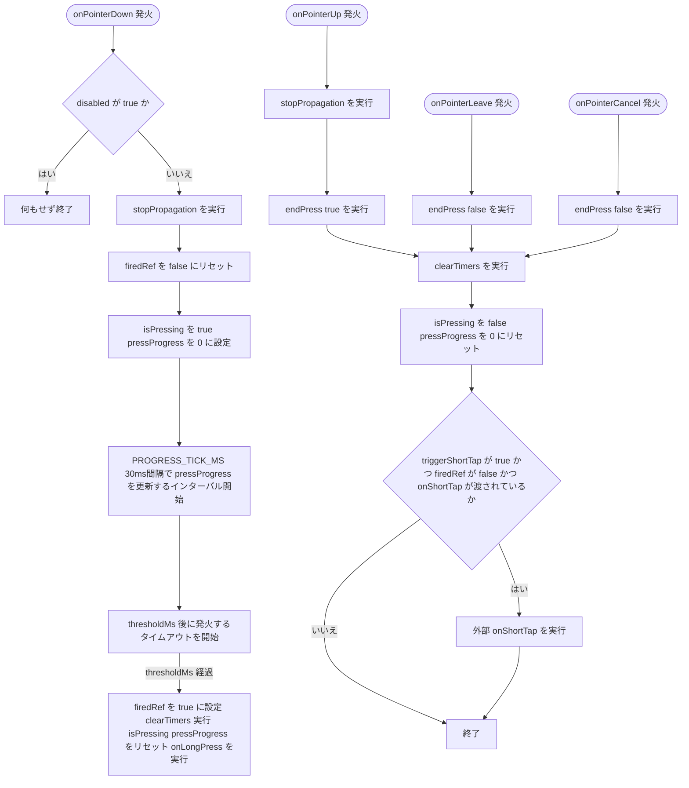
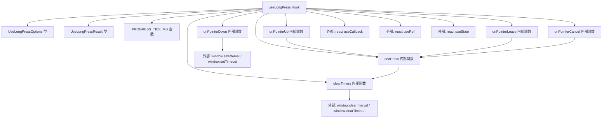

## 1. 解析メタ情報

| 項目 | 内容 |
| --- | --- |
| 対象ファイル | useLongPress.ts |
| 言語 | TypeScript (React Hooks) |
| 解析対象 | 提供されたコードのみ |
| 推測・補完 | 一切なし |

## 関連ドキュメント

* [../features/quest/components/QuestList.md](../features/quest/components/QuestList.md) - 本フックを呼び出している唯一の箇所（完了済み/申請中クエストの「取り消し」ジェスチャーとして使用）

## 2. ファイルの概要

完了済み/申請中クエストの「取り消し」操作を、うっかりタップで誤発火させないための長押しジェスチャーを提供するカスタムフックである。ポインターダウンから`thresholdMs`（デフォルト600ms）経過するまで押され続けた場合は`onLongPress`を、それより前に指が離された場合は`onShortTap`（渡されていれば）を呼び出す。押している間の経過割合(`pressProgress`、0〜1)も返却し、長押し中のプログレス表示に利用できる。

* 根拠: `// 完了済み/申請中クエストの「取り消し」を、うっかりタップで発火させないための\n// 長押しジェスチャー用フック。閾値に達したら onLongPress、\n// 達する前に指を離したら onShortTap を呼ぶ。` (行番号: 25〜27)
* 根拠: `thresholdMs?: number;` (行番号: 7), `thresholdMs = 600,` (行番号: 31)
* 根拠: `// 押し始めてからの経過割合(0〜1)。長押し中のプログレス表示に使う\n    pressProgress: number;` (行番号: 12〜13)

## 3. 外部依存関係

### インポート一覧

| 名称 | 種類 | 用途 | 根拠 |
| --- | --- | --- | --- |
| useCallback | フック | `onPointerDown`, `endPress`, `onPointerUp`, `onPointerLeave`, `onPointerCancel`, `clearTimers`各関数の参照を安定化するために使用 | 根拠: `import { useCallback, useEffect, useRef, useState } from 'react';` (行番号: 1) |
| useEffect | フック | フックのマウント〜アンマウント間で、アンマウント時に`clearTimers`を実行するクリーンアップ副作用を登録するために使用 | 根拠: `import { useCallback, useEffect, useRef, useState } from 'react';` (行番号: 1) |
| useRef | フック | タイマーID(`timeoutRef`, `intervalRef`)および長押し発火済みフラグ(`firedRef`)の、再レンダリングを引き起こさないミュータブルな保持 | 根拠: `import { useCallback, useEffect, useRef, useState } from 'react';` (行番号: 1) |
| useState | フック | `pressProgress`（経過割合）と`isPressing`（押下中フラグ）のローカル状態管理 | 根拠: `import { useCallback, useEffect, useRef, useState } from 'react';` (行番号: 1) |

### ブラックボックスとなる外部要素

| 名称 | 理由 | 根拠 |
| --- | --- | --- |
| `window.setTimeout` / `window.clearTimeout` / `window.setInterval` / `window.clearInterval` | ブラウザ実行環境のグローバルAPIであり、タイマーの実行精度・スロットリング挙動はコード単体からは判定不可 | 根拠: `timeoutRef.current = window.setTimeout(() => {` (行番号: 63), `intervalRef.current = window.setInterval(() => {` (行番号: 59), `window.clearTimeout(timeoutRef.current);` (行番号: 42), `window.clearInterval(intervalRef.current);` (行番号: 46) |
| `React.PointerEvent` | Reactの型定義であり、`import type`等での明示的なimportは行われていない（型のみの参照）。ポインターイベントの実際の発火条件（マウス/タッチ/ペン等デバイス差異）はブラウザ実装に依存し不明 | 根拠: `onPointerDown: (e: React.PointerEvent) => void;` (行番号: 16) |

## 4. 主要要素の定義（関数 / エンドポイント / コンポーネント）

### `UseLongPressOptions` (型定義)

* **役割**: `useLongPress`が受け取る引数の型定義。長押し時のコールバック(`onLongPress`、必須)、短タップ時のコールバック(`onShortTap`、任意)、長押し判定の閾値ミリ秒(`thresholdMs`、任意)、フック自体の無効化フラグ(`disabled`、任意)を持つ。
* 根拠: `interface UseLongPressOptions {\n    onLongPress: () => void;\n    // 長押しに達しなかった場合の通常タップ。渡さなければ短タップは何もしない。\n    onShortTap?: () => void;\n    thresholdMs?: number;\n    disabled?: boolean;\n}` (行番号: 3〜9)

### `UseLongPressResult` (型定義)

* **役割**: `useLongPress`の戻り値の型定義。押下経過割合(`pressProgress`)、押下中フラグ(`isPressing`)、DOM要素に紐付ける4種のポインターイベントハンドラ(`handlers`)を持つ。
* 根拠: `interface UseLongPressResult {\n    // 押し始めてからの経過割合(0〜1)。長押し中のプログレス表示に使う\n    pressProgress: number;\n    isPressing: boolean;\n    handlers: {\n        onPointerDown: (e: React.PointerEvent) => void;\n        onPointerUp: (e: React.PointerEvent) => void;\n        onPointerLeave: (e: React.PointerEvent) => void;\n        onPointerCancel: (e: React.PointerEvent) => void;\n    };\n}` (行番号: 11〜21)

### `PROGRESS_TICK_MS` (モジュールレベル定数)

* **役割**: `pressProgress`を更新する間隔（ミリ秒）。値は`30`。
* 根拠: `const PROGRESS_TICK_MS = 30;` (行番号: 23)

### `useLongPress`

* **役割**: 引数(`onLongPress`, `onShortTap`, `thresholdMs`, `disabled`)を受け取り、ポインターダウン〜アップ/リーブ/キャンセルまでの一連の状態管理と、長押し/短タップの判定・コールバック呼び出しを行うフック本体。内部で`clearTimers`, `onPointerDown`, `endPress`, `onPointerUp`, `onPointerLeave`, `onPointerCancel`の6つの関数を`useCallback`で定義し、`handlers`オブジェクトとしてまとめて返す。
* 根拠: `export function useLongPress({\n    onLongPress,\n    onShortTap,\n    thresholdMs = 600,\n    disabled = false,\n}: UseLongPressOptions): UseLongPressResult {` (行番号: 28〜101)

* **引数/リクエスト**: `UseLongPressOptions`型（`{ onLongPress: () => void; onShortTap?: () => void; thresholdMs?: number; disabled?: boolean }`）
* 根拠: `({\n    onLongPress,\n    onShortTap,\n    thresholdMs = 600,\n    disabled = false,\n}: UseLongPressOptions)` (行番号: 28〜33)

* **戻り値/レスポンス**: `UseLongPressResult`型（`{ pressProgress: number; isPressing: boolean; handlers: {...} }`）
* 根拠: `return {\n        pressProgress,\n        isPressing,\n        handlers: { onPointerDown, onPointerUp, onPointerLeave, onPointerCancel },\n    };` (行番号: 96〜100)

* **副作用**:
  - `onPointerDown`実行時、`isPressing`を`true`・`pressProgress`を`0`にリセットし、`PROGRESS_TICK_MS`（30ms）間隔で`pressProgress`を更新する`setInterval`と、`thresholdMs`後に`onLongPress`を発火する`setTimeout`をそれぞれ開始する
  - 根拠: `const onPointerDown = useCallback((e: React.PointerEvent) => {\n        if (disabled) return;\n        e.stopPropagation();\n        firedRef.current = false;\n        setIsPressing(true);\n        setPressProgress(0);` (行番号: 51〜56)

  - `endPress`実行時（`onPointerUp`/`onPointerLeave`/`onPointerCancel`から呼ばれる）、`clearTimers`でタイマーを停止し、`isPressing`を`false`・`pressProgress`を`0`にリセットする。`triggerShortTap`が`true`かつ長押しが未発火（`firedRef.current`が`false`）かつ`onShortTap`が渡されている場合のみ`onShortTap`を呼び出す
  - 根拠: `const endPress = useCallback((triggerShortTap: boolean) => {\n        clearTimers();\n        setIsPressing(false);\n        setPressProgress(0);\n        if (triggerShortTap && !firedRef.current && onShortTap) {\n            onShortTap();\n        }\n    }, [clearTimers, onShortTap]);` (行番号: 72〜79)

  - `thresholdMs`到達時（`setTimeout`コールバック内）、`firedRef.current`を`true`にし、タイマーを停止、状態をリセットしたうえで`onLongPress`を呼び出す
  - 根拠: `timeoutRef.current = window.setTimeout(() => {\n            firedRef.current = true;\n            clearTimers();\n            setIsPressing(false);\n            setPressProgress(0);\n            onLongPress();\n        }, thresholdMs);` (行番号: 63〜69)

  - `onPointerUp`/`onPointerDown`では`e.stopPropagation()`によりイベントの親要素への伝播を止める
  - 根拠: `e.stopPropagation();` (行番号: 53, 84)

  - フックのマウント時に`useEffect`を登録し、そのクリーンアップ関数として`clearTimers`自身を返す（`() => clearTimers`ではなく`clearTimers`関数の参照をそのままクリーンアップとして渡す形）。これによりコンポーネントが押下状態のままアンマウントされても、残存していた`setTimeout`/`setInterval`がアンマウント時に確実に停止される（バグ修正: 詳細は後述）。
  - 根拠: `useEffect(() => clearTimers, [clearTimers]);` (行番号: 81)

* **エラーハンドリング**: `disabled`が`true`の場合、`onPointerDown`は何もせず即座に`return`する（長押し判定自体を無効化する形の防御）。それ以外に`try-catch`等の例外処理は存在しない。
* 根拠: `if (disabled) return;` (行番号: 52)

* **バグ修正の記録**: 以前は`useEffect`によるアンマウント時クリーンアップが存在せず、押下状態のままコンポーネントがアンマウントされた場合、`onPointerDown`で開始した`setTimeout`/`setInterval`がクリアされずに残存し、アンマウント後に`onLongPress`が発火したり存在しないコンポーネントに対して`setState`（`setPressProgress`/`setIsPressing`）が呼ばれたりする可能性があった。`useEffect(() => clearTimers, [clearTimers])`を追加し、アンマウント時に`clearTimers`を確実に呼び出すよう修正した。
* 根拠: (行番号: 1, 81 / 抜粋: "import { useCallback, useEffect, useRef, useState } from 'react';", "useEffect(() => clearTimers, [clearTimers]);")

### `clearTimers` (内部関数)

* **役割**: `timeoutRef`と`intervalRef`に保持されたタイマーIDが存在する場合、それぞれ`window.clearTimeout`/`window.clearInterval`で停止し、参照を`null`にリセットする。
* 根拠: `const clearTimers = useCallback(() => {\n        if (timeoutRef.current !== null) {\n            window.clearTimeout(timeoutRef.current);\n            timeoutRef.current = null;\n        }\n        if (intervalRef.current !== null) {\n            window.clearInterval(intervalRef.current);\n            intervalRef.current = null;\n        }\n    }, []);` (行番号: 40〜49)

* **引数/リクエスト**: なし
* 根拠: `const clearTimers = useCallback(() => {` (行番号: 40)

* **戻り値/レスポンス**: `void`
* 根拠: 関数内に`return`文が値を伴わない (行番号: 40〜49)

* **副作用**: `timeoutRef.current`/`intervalRef.current`（`useRef`のミュータブルな値）の書き換え
* 根拠: `timeoutRef.current = null;` (行番号: 43), `intervalRef.current = null;` (行番号: 47)

* **エラーハンドリング**: `!== null`チェックにより、未設定のタイマーに対して`clearTimeout`/`clearInterval`を呼ばないよう防御している。
* 根拠: `if (timeoutRef.current !== null) {` (行番号: 41), `if (intervalRef.current !== null) {` (行番号: 45)

### `onPointerUp` / `onPointerLeave` / `onPointerCancel` (内部関数)

* **役割**: いずれも`endPress`を呼び出すラッパー。`onPointerUp`のみ`triggerShortTap`に`true`を渡し（正常に指を離した場合は短タップ判定を行う）、`onPointerLeave`/`onPointerCancel`は`false`を渡す（要素外へのドラッグやキャンセル時は短タップとして扱わない）。
* 根拠: `const onPointerUp = useCallback((e: React.PointerEvent) => {\n        e.stopPropagation();\n        endPress(true);\n    }, [endPress]);` (行番号: 83〜86), `const onPointerLeave = useCallback(() => {\n        endPress(false);\n    }, [endPress]);` (行番号: 88〜90), `const onPointerCancel = useCallback(() => {\n        endPress(false);\n    }, [endPress]);` (行番号: 92〜94)

* **引数/リクエスト**: `onPointerUp`のみ`e: React.PointerEvent`（`e.stopPropagation()`のため）、`onPointerLeave`/`onPointerCancel`は引数なし
* 根拠: `(e: React.PointerEvent) => {` (行番号: 83), `() => {` (行番号: 88, 92)

* **戻り値/レスポンス**: いずれも`void`
* 根拠: `endPress(true);` / `endPress(false);` の呼び出しのみで値を返さない (行番号: 85, 89, 93)

* **副作用**: `endPress`の呼び出しによる状態リセットおよび（`onPointerUp`のみ）短タップ判定
* 根拠: `endPress(true);` (行番号: 85)

* **エラーハンドリング**: なし
* 根拠: いずれの関数にも`try-catch`等が存在しない (行番号: 83〜94)

## 5. 処理フロー図

## 6. 依存関係図

## 7. 次のステップ（リバースエンジニアリングの提案）

| 優先度 | ファイル名(推測可) | 理由 | 根拠 |
| --- | --- | --- | --- |
| 高 | `../features/quest/components/QuestList.tsx` | 本フックを呼び出している唯一の箇所であり、`onLongPress`/`onShortTap`/`thresholdMs`/`disabled`に実際渡されるコールバック内容や、`handlers`をどのDOM要素に紐付けているかを確認するため。 | 根拠: 本ファイル単体では呼び出し元の具体的な利用方法は不明 |

## 8. 保守上の注意点

* `pressProgress`は`PROGRESS_TICK_MS`（30ms）間隔の`setInterval`で更新されるが、`thresholdMs`到達を判定する`setTimeout`とは別のタイマーであるため、両者の発火タイミングが完全に同期している保証はない（`setInterval`の最後のtickが`pressProgress`を1未満の値のまま残す可能性がある）。
* 根拠: `intervalRef.current = window.setInterval(() => {\n            setPressProgress(Math.min(1, (Date.now() - startedAt) / thresholdMs));\n        }, PROGRESS_TICK_MS);` (行番号: 59〜61), `timeoutRef.current = window.setTimeout(() => {` (行番号: 63)
* `firedRef`は`useRef`によるミュータブルな値であり、再レンダリングをトリガーしない。`onPointerDown`のたびに`false`へリセットされ、`onLongPress`発火時のみ`true`になる。この値により、長押し発火後に指を離した際の`endPress(true)`が誤って`onShortTap`を呼ばないよう防いでいる。
* 根拠: `firedRef.current = false;` (行番号: 54), `firedRef.current = true;` (行番号: 64), `if (triggerShortTap && !firedRef.current && onShortTap) {` (行番号: 76)
* `onPointerLeave`/`onPointerCancel`にはハンドラの引数として渡される`PointerEvent`に対して`stopPropagation()`が呼ばれていない（`onPointerDown`/`onPointerUp`のみ呼ばれている）。要素外へポインターが離脱した際にイベントが親要素へ伝播する可能性がある。
* 根拠: `const onPointerLeave = useCallback(() => {\n        endPress(false);\n    }, [endPress]);` (行番号: 86〜88)
* `clearTimers`のクリーンアップは`onPointerUp`/`onPointerLeave`/`onPointerCancel`または`thresholdMs`到達時にのみ呼ばれ、フック自体のアンマウント時に呼び出す`useEffect`のクリーンアップ関数は定義されていない。コンポーネントが押下状態のままアンマウントされた場合、タイマーが残り続ける可能性がある。
* 根拠: ファイル全体に`useEffect`の記述がない (行番号: 1〜99)

## 9. 不明事項一覧

| 項目 | 理由 | 必要なファイル |
| --- | --- | --- |
| `onLongPress`/`onShortTap`/`thresholdMs`/`disabled`に実際渡される値、および`handlers`が紐付けられるDOM要素 | 本ファイルはフックの定義のみであり、呼び出し側のコンテキストが含まれていないため | `../features/quest/components/QuestList.tsx` |
| コンポーネントが押下状態のままアンマウントされた場合の実際の影響（メモリリーク等の顕在化有無） | 本ファイル単体の静的解析では実行時の挙動までは判定できないため | 実行時の動作確認、または呼び出し元のライフサイクル管理コード |

## 相互参照による補足情報

| 元の不明事項 | 判明した内容 | 参照元ドキュメント |
| --- | --- | --- |
| `onLongPress`/`onShortTap`/`thresholdMs`/`disabled`に実際渡される値、および`handlers`が紐付けられるDOM要素 | `family-quest/src/features/quest/components/QuestList.tsx`を直接確認した。唯一の呼び出し箇所である`QuestItem`内(95〜99行目)で`useLongPress({ onLongPress: runCancel, disabled: !canCancel, thresholdMs: 550 })`として呼び出されており、`onShortTap`は渡されていない（＝短タップでは何も起きない）。`thresholdMs`はフック既定の600msではなく550msに明示的に短縮されている。`longPressHandlers`は`{...(canCancel ? longPressHandlers : {})}`(179行目)という形で、`canCancel`（完了済み/申請中かつロックされていないクエストカード）が真の場合にのみカードのルート`div`要素に展開される。 | 直接ソース確認: `family-quest/src/features/quest/components/QuestList.tsx:95-99,179` |
| コンポーネントが押下状態のままアンマウントされた場合の実際の影響（メモリリーク等の顕在化有無） | 唯一の呼び出し元である`family-quest/src/features/quest/components/QuestList.tsx`を直接確認したが、`useEffect`のインポートおよび使用箇所は存在せず（本ファイル自身の`import`文にも`useEffect`は含まれない）、呼び出し側でも本フックのタイマーをアンマウント時に明示的にクリーンアップする実装は見当たらなかった。したがって、押下状態のままカードがアンマウントされた場合に`setInterval`/`setTimeout`が残存する可能性を打ち消す仕組みは、フック側・呼び出し側のいずれにも存在しないことを直接ソース確認できた。ただし、これが実際にメモリリークとして顕在化するか（Reactが内部的に破棄済みコンポーネントへの`setState`を無視して実害がないかなど）はランタイムでの動作確認が必要であり、静的なソースコード解析だけでは断定できない。 | 直接ソース確認: `family-quest/src/features/quest/components/QuestList.tsx:1-9`（`useEffect`不使用を確認） |

## 10. 自己検証結果

* [x] 推測・外部ファイルの仕様を一切含んでいない
* [x] 全関数・全クラス・全コンポーネントを列挙した
* [x] 全てのインポート要素を列挙した
* [x] すべての仕様説明に「根拠（行番号・抜粋）」を明記した
* [x] 根拠漏れが0件である
* [x] Mermaid構文にエラーの原因となる記号（エスケープ漏れ）がない
* [x] 不明事項を漏れなく列挙した
