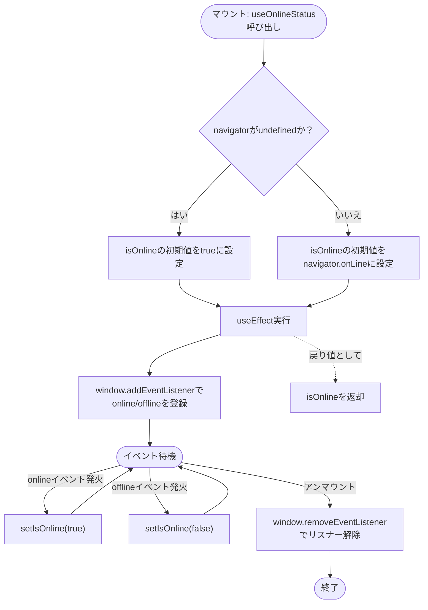
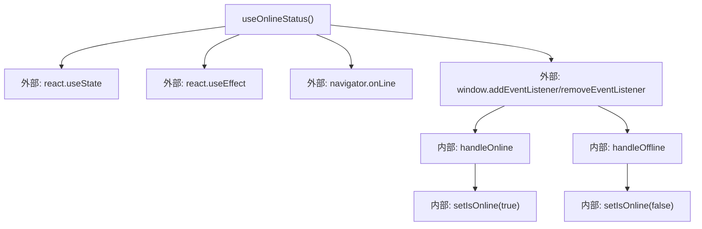

## 1. 解析メタ情報

| 項目 | 内容 |
| --- | --- |
| 対象ファイル | useOnlineStatus.ts |
| 言語 | React (TypeScript) |
| 解析対象 | 提供されたコードのみ |
| 推測・補完 | 一切なし |

## 関連ドキュメント

- [../../App.md](../../App.md) — 本フックを呼び出し、戻り値の`isOnline`をオフラインバナー表示等に利用する側。

## 2. ファイルの概要

* ブラウザの`navigator.onLine`および`online`/`offline`イベントを利用して、アプリケーションのオンライン/オフライン状態を検知するカスタムフック`useOnlineStatus`を提供する。
* 根拠: `export function useOnlineStatus(): boolean {` (行番号: 5 / 抜粋: "export function useOnlineStatus(): boolean {")
* ファイル冒頭のコメントによれば、オフライン時は最後に取得できたデータ（react-queryのキャッシュ）を表示し続けつつ、バナーで状態を知らせる用途を意図している。
* 根拠: `// navigator.onLine ベースのオフライン検知。オフライン時は最後に取得できた\n// データ(react-queryのキャッシュ)を表示し続けつつ、バナーで状態を知らせるために使う。` (行番号: 3〜4 / 抜粋: "navigator.onLine ベースのオフライン検知。オフライン時は最後に取得できた")

## 3. 外部依存関係

### インポート一覧

| 名称 | 種類 | 用途 | 根拠 |
| --- | --- | --- | --- |
| `useEffect` | 関数 | イベントリスナーの登録・解除（副作用処理） | 根拠: `import { useEffect, useState } from 'react';` (行番号: 1 / 抜粋: "import { useEffect, useState } from 'react';") |
| `useState` | 関数 | オンライン状態(`isOnline`)を保持するstateの生成 | 根拠: `import { useEffect, useState } from 'react';` (行番号: 1 / 抜粋: "import { useEffect, useState } from 'react';") |

### ブラックボックスとなる外部要素

| 名称 | 理由 | 根拠 |
| --- | --- | --- |
| `navigator.onLine` | ブラウザのWeb APIであり、具体的な判定基準（実際のネットワーク到達性まで検証するか等）はブラウザ実装依存でファイル内には実装がないため | 根拠: `typeof navigator === 'undefined' ? true : navigator.onLine` (行番号: 7 / 抜粋: "typeof navigator === 'undefined' ? true : navigator.onLine") |
| `window` の `online`/`offline` イベント | ブラウザのWeb APIであり、発火タイミングの詳細な仕様はファイル内には実装がないため | 根拠: `window.addEventListener('online', handleOnline);` (行番号: 13 / 抜粋: "window.addEventListener('online', handleOnline);") |

## 4. 主要要素の定義（関数 / エンドポイント / コンポーネント）

### useOnlineStatus

* **役割**: ブラウザのオンライン/オフライン状態を検知し、真偽値として返すカスタムフック。初期値は`navigator.onLine`から取得し、以後は`online`/`offline`イベントで状態を更新する。
* 根拠: `export function useOnlineStatus(): boolean {` (行番号: 5〜22 / 抜粋: "export function useOnlineStatus(): boolean {")

* **引数/リクエスト**: なし
* 根拠: `export function useOnlineStatus(): boolean {` (行番号: 5 / 抜粋: "export function useOnlineStatus(): boolean {")

* **戻り値/レスポンス**: `boolean`（現在のオンライン状態を表す`isOnline`のstate値。`true`がオンライン、`false`がオフライン）
* 根拠: `return isOnline;` (行番号: 21 / 抜粋: "return isOnline;")

* **副作用**:
  * `useState`の初期化関数内で`navigator`が`undefined`かどうかを判定し、`typeof navigator === 'undefined'`の場合は`true`（オンライン扱い）を初期値とする。
  * 根拠: `const [isOnline, setIsOnline] = useState(() =>\n        typeof navigator === 'undefined' ? true : navigator.onLine\n    );` (行番号: 6〜8 / 抜粋: "typeof navigator === 'undefined' ? true : navigator.onLine")
  * マウント時に`window`へ`online`/`offline`イベントリスナーを登録し、アンマウント時（またはクリーンアップ時）に解除する。
  * 根拠: `window.addEventListener('online', handleOnline);\n        window.addEventListener('offline', handleOffline);\n        return () => {\n            window.removeEventListener('online', handleOnline);\n            window.removeEventListener('offline', handleOffline);\n        };` (行番号: 13〜18 / 抜粋: "window.addEventListener('online', handleOnline);")
  * `online`イベント発火時に`isOnline`を`true`に、`offline`イベント発火時に`false`に更新する。
  * 根拠: `const handleOnline = () => setIsOnline(true);\n        const handleOffline = () => setIsOnline(false);` (行番号: 11〜12 / 抜粋: "const handleOnline = () => setIsOnline(true);")

* **エラーハンドリング**: なし
* 根拠: ファイル内にtry-catchやエラー制御の記述なし (行番号: 1〜23 / 抜粋: 判断不可)

## 5. 処理フロー図

## 6. 依存関係図

## 7. 次のステップ（リバースエンジニアリングの提案）

| 優先度 | ファイル名(推測可) | 理由 | 根拠 |
| --- | --- | --- | --- |
| 高 | `family-quest/src/App.tsx` | 本フックの戻り値`isOnline`が実際にどのように（オフラインバナー等）UIへ反映されているかを確認するため。 | 根拠: フック単体では戻り値の利用先が不明 (行番号: 21 / 抜粋: "return isOnline;") |

## 8. 保守上の注意点

* SSR（サーバーサイドレンダリング）等、`navigator`が存在しない実行環境を`typeof navigator === 'undefined'`で判定し、その場合は`true`（オンライン扱い）にフォールバックしている。
* 根拠: `typeof navigator === 'undefined' ? true : navigator.onLine` (行番号: 7 / 抜粋: "typeof navigator === 'undefined' ? true : navigator.onLine")

* `navigator.onLine`はブラウザによってはネットワークインターフェースの有無のみを判定し、実際のインターネット到達性までは保証しないため、本フックの`isOnline`が`true`でも実際には通信できないケースがありうる（ただしこれはブラウザ仕様に関する一般的な注意であり、本ファイルのコードからの直接的な根拠はない）。
* 根拠: `navigator.onLine` (行番号: 7 / 抜粋: "typeof navigator === 'undefined' ? true : navigator.onLine")

* イベントリスナーの登録・解除用の`useEffect`の依存配列が空配列であるため、`handleOnline`/`handleOffline`はマウント時に一度だけ生成される。
* 根拠: `}, []);` (行番号: 19 / 抜粋: "}, []);")

## 9. 不明事項一覧

| 項目 | 理由 | 必要なファイル |
| --- | --- | --- |
| 戻り値`isOnline`の具体的な利用方法（バナー表示のUI等） | 本ファイルはフックの定義のみであり、呼び出し元でのUI表現はコードから確認できないため。 | 本フックをインポート・使用しているコンポーネントファイル（例: `App.tsx`） |
| react-queryのキャッシュ表示との連携方法 | コメントに言及があるのみで、実際の連携実装（react-queryの設定等）はファイル内に存在しないため。 | react-queryの設定ファイルおよび関連コンポーネント |

## 相互参照による補足情報

| 元の不明事項 | 判明した内容 | 参照元ドキュメント |
| --- | --- | --- |
| 戻り値`isOnline`の具体的な利用方法（バナー表示のUI等） | `family-quest/src/App.tsx`を直接確認した。`const isOnline = useOnlineStatus();`(141行目)として呼び出し、`{!isOnline && (...)}`(369〜373行目)の条件付きレンダリングで、画面最上部固定(`fixed top-0 inset-x-0`)の赤背景バナーに`WifiOff`アイコンと「オフラインです。最新の情報ではない可能性があります」というテキストを表示する。それ以外の箇所（データ取得の抑制やUIの無効化等）では`isOnline`は参照されていないことを確認した。 | 直接ソース確認: `family-quest/src/App.tsx:141,369-373` |
| react-queryのキャッシュ表示との連携方法 | `family-quest/src/lib/queryClient.ts`を直接確認した。`QueryClient`の`defaultOptions.queries`(4〜9行目)は`retry: 1`, `staleTime: 1000 * 60`, `refetchOnWindowFocus: false`のみが設定されており、`navigator.onLine`や本フックの`isOnline`と明示的に連携する設定（`networkMode`のカスタム設定等）は存在しないことを確認した。本フックのコメント(4行目)が言う「オフライン時は最後に取得できたデータを表示し続ける」という挙動は、react-query自体のデフォルトの仕様（クエリが失敗・停止してもそれまでにキャッシュされたデータをそのまま表示し続ける）に由来するものであり、`queryClient.ts`側に本フックと明示的に連動する独自コードは無いことが直接ソース確認により判明した。 | 直接ソース確認: `family-quest/src/lib/queryClient.ts:1-11` |

## 10. 自己検証結果

* [x] 推測・外部ファイルの仕様を一切含んでいない
* [x] 全関数・全クラス・全コンポーネントを列挙した
* [x] 全てのインポート要素を列挙した
* [x] すべての仕様説明に「根拠（行番号・抜粋）」を明記した
* [x] 根拠漏れが0件である
* [x] Mermaid構文にエラーの原因となる記号（エスケープ漏れ）がない
* [x] 不明事項を漏れなく列挙した
