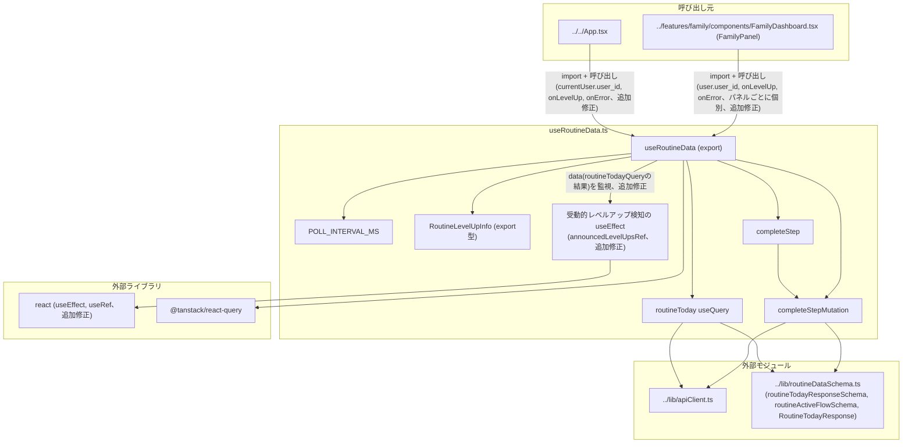

## 1. 解析メタ情報

| 項目 | 内容 |
| --- | --- |
| 対象ファイル | `useRoutineData.ts` (family-quest/src/hooks/useRoutineData.ts) |
| 言語 | React (TypeScript) |
| 解析対象 | 提供されたコードのみ |
| 推測・補完 | 一切なし |
| 解析基準コミット | `29595e9` (PR #629 squash-merge) (+同一ブランチ内でエラートースト重複ロジックのonErrorへの集約、RoutineFlow.tsxの冗長参照・**大人用フロー分離に伴うステップ個別報酬通知(`onStepReward`)の追加**を追加修正) |

## 関連ドキュメント

* [../lib/routineDataSchema.md](../lib/routineDataSchema.md) - 本フックが使う`routineTodayResponseSchema`（`GET`レスポンス検証）・`routineActiveFlowSchema`（`POST`完了報告レスポンス検証、コードレビューで新規追加）・`RoutineTodayResponse`型の実装元。
* [../lib/apiClient.md](../lib/apiClient.md) - 本フックが`GET /api/routine/today`・`POST /api/routine/complete`の通信に使う`apiClient`の実装元。
* [../hooks/useGameData.md](../hooks/useGameData.md) - 同じ「React Query + Zodによるレスポンス検証」パターン、および同じ形（`{ newLevel: number }`相当）の`onLevelUp`コールバックパターンを採る姉妹フック。`queryClient.invalidateQueries`によるキャッシュ無効化の方針も共通する。
* [../features/routine/components/RoutineFlow.md](../features/routine/components/RoutineFlow.md) - 本フックの戻り値（`flows`/`completeStep`/`isCompleting`）の消費元コンポーネント。
* [../../App.md](../../App.md) - 本フックを`currentUser.user_id`と`onLevelUp`コールバックで呼び出す消費元（縦画面/横画面共通のルートコンポーネント）。
* [../features/family/components/FamilyDashboard.md](../features/family/components/FamilyDashboard.md) - `FamilyPanel`が各ユーザーごとに個別に本フックを呼び出す消費元。
* `MY_HOME_SYSTEM/services/routine_service.py`（本タスクの対象外、未解析）- `GET /api/routine/today`・`POST /api/routine/complete`のレスポンス生成、チェックポイントの時刻ベース強制通過（`_apply_forced_transition`）、および`leveled_up`/`new_level`フィールドの生成元と推測される。

## 2. ファイルの概要

React Queryを用いて、「きょうのすごろく」機能のデータ取得（`GET /api/routine/today`のポーリング取得）と、1ステップの完了報告（`POST /api/routine/complete`）を提供するカスタムフック`useRoutineData`を定義するファイル。`userId`（呼び出し元のユーザーID）、任意の`onLevelUp`コールバック、**（コードレビューで発覚した重複を追加修正）** 任意の`onError`コールバックを引数に取り、そのユーザーの当日の朝(`am`)/夕方(`pm`)2系統のフロー状態、日付、ローディング状態、エラー、およびステップ完了関数`completeStep`とその送信中フラグ`isCompleting`を返す。チェックポイント（自由時間の終了）はサーバー側で時刻ベースに強制通過させる遅延評価方式のため、フロント側は15秒間隔の短いポーリング(`POLL_INTERVAL_MS`)でこれを追従する設計である。**（コードレビューで発覚した欠落を修正）** 完了報告のレスポンスが`routineActiveFlowSchema`でランタイム検証されるようになり(以前は無検証)、レスポンスが`leveled_up: true`を含む場合は`onLevelUp`コールバックを呼び出す(以前はレスポンスを無条件に破棄しており、チェックポイント通過ボーナスでレベルアップしてもLEVEL UP演出を出す手段が無かった)。**（再度のコードレビューで発覚した欠落を追加修正）** さらに、本人が何も操作せず自由時間中に締切時刻を過ぎてサーバー側が受動的にチェックポイントを通過させた場合（`GET /api/routine/today`のポーリングだけがそれを検知する経路）にも`onLevelUp`が呼ばれるよう、`data`の変化を監視する`useEffect`を追加した。以前は`completeStepMutation`の`onSuccess`（本人のステップ完了操作がトリガーになる経路）だけがこの通知を行っており、ポーリングだけで検知される受動的なレベルアップはサイレントにDBだけ更新されていた。**（大人用フロー分離で追加）** 第4引数に任意の`onStepReward`コールバックが追加された。バックエンドの大人用フロー(パパ・ママ用のすごろく)では、デイリークエストから移設されたステップを完了すると`gold`/`exp`がその場で付与され、レスポンスの`granted_gold`/`granted_exp`が非0になる。この場合`completeStepMutation`の`onSuccess`は`onStepReward`を呼ぶとともに、`['gameData']`キャッシュも無効化する(付与によって`quest_users.gold`が変わるため、無効化しないとステータスカードの所持ゴールド表示が次のリフェッチまで古いままになる)。**（さらに別のコードレビューで発覚した重複を追加修正）** `completeStep`失敗時のエラートースト表示ロジック（呼び出し元での`try`相当の分岐）が`App.tsx`・`FamilyDashboard.tsx`の両方に一字一句同じ形で重複していたため、`onLevelUp`と同じ「呼び出し元のコールバックを受け取る」形の第3引数`onError`をここへ追加し、`completeStep`内部の`catch`節から直接呼ぶようにした。
* 根拠: ファイル冒頭のポーリング間隔コメント (行番号: 7〜10 / 抜粋: "// チェックポイント(自由時間の終了)はサーバー側で時刻ベースに強制通過させる遅延評価\n// (services/routine_service.py の _apply_forced_transition)のため、フロントは\n// 短い間隔でポーリングして「時刻になった瞬間」の反映をそう待たせずに拾う。\nconst POLL_INTERVAL_MS = 1000 * 15;")
* 根拠: `useRoutineData`関数定義と戻り値 (行番号: 22〜27, 106〜113 / 抜粋: "export const useRoutineData = (\n    userId: string | undefined,\n    onLevelUp?: (info: RoutineLevelUpInfo) => void,\n    onError?: (detail: string) => void,\n    onStepReward?: (info: RoutineStepRewardInfo) => void,\n) => {", "return {\n        flows: data?.flows,\n        date: data?.date,\n        isLoading,\n        error,\n        completeStep,\n        isCompleting: completeStepMutation.isPending,\n    };")
* 根拠: `onLevelUp`呼び出し(完了報告経路) (行番号: 73〜81 / 抜粋: "onSuccess: (res) => {\n            queryClient.invalidateQueries({ queryKey: ['routineToday', userId] });\n            // #(コードレビューで発覚): 以前はレスポンスを無条件に破棄しており、\n            // チェックポイント通過ボーナスでレベルアップしても(サーバー側では\n            // quest_users.levelが更新されているのに)LEVEL UP演出が一切出なかった。\n            if (res.leveled_up && res.new_level != null && onLevelUp) {\n                onLevelUp({ newLevel: res.new_level });\n            }\n        },")
* 根拠: `onLevelUp`呼び出し(ポーリング検知経路、追加修正) (行番号: 41〜62 / 抜粋: "// コードレビューで発覚: チェックポイント通過ボーナスのレベルアップは、本人が\n    // ステップを完了した「その場」(completeStepMutationのonSuccess)だけでなく、\n    // 何も操作せず自由時間中に締切時刻を過ぎた場合はポーリング(GET /today)側の\n    // _apply_forced_transitionで受動的に起こる。", "const announcedLevelUpsRef = useRef<Set<string>>(new Set());\n    useEffect(() => {\n        if (!data || !onLevelUp) return;")

## 3. 外部依存関係

### インポート一覧

| 名称 | 種類 | 用途 | 根拠 |
| --- | --- | --- | --- |
| `useEffect`, `useRef`（コードレビューで発覚した欠落を追加修正） | ライブラリ(React) | ポーリング(`GET /today`)側で受動的に検知されたレベルアップを`onLevelUp`へ通知する`useEffect`、および同一イベントの二重通知を防ぐ`announcedLevelUpsRef`に使用 | 根拠: [インポート宣言] (行番号: 2 / 抜粋: "import { useEffect, useRef } from 'react';") |
| `useMutation`, `useQuery`, `useQueryClient` | 外部ライブラリ(`@tanstack/react-query`) | データ取得（ポーリング付き）・完了報告のミューテーション・キャッシュ無効化に使用 | 根拠: [インポート宣言] (行番号: 3 / 抜粋: "import { useMutation, useQuery, useQueryClient } from '@tanstack/react-query';") |
| `apiClient` | 外部モジュール | `GET /api/routine/today`・`POST /api/routine/complete`への実際のHTTP通信を担うクライアント | 根拠: [インポート宣言] (行番号: 4 / 抜粋: "import { apiClient } from '../lib/apiClient';") |
| `routineActiveFlowSchema`, `routineTodayResponseSchema`, `RoutineTodayResponse` | 外部モジュール(Zodスキーマ/型) | `routineTodayResponseSchema`は`GET /api/routine/today`の生レスポンスを、`routineActiveFlowSchema`は`POST /api/routine/complete`の生レスポンスを、それぞれランタイム検証するために使用。`RoutineTodayResponse`は`useQuery`の型引数として使用 | 根拠: [インポート宣言] (行番号: 5 / 抜粋: "import { routineActiveFlowSchema, routineTodayResponseSchema, RoutineTodayResponse } from '../lib/routineDataSchema';") |

### ブラックボックスとなる外部要素

| 名称 | 理由 | 根拠 |
| --- | --- | --- |
| `apiClient`の内部実装 | ベースURL解決・エラーハンドリングの詳細な通信仕様は本ファイルからは読み取れないため（詳細は`apiClient.md`を参照）。 | 根拠: (行番号: 28, 60〜64 / 抜粋: "const raw = await apiClient.get<unknown>(`/api/routine/today?user_id=${encodeURIComponent(userId!)}`);", "const raw = await apiClient.post('/api/routine/complete', {") |
| `GET /api/routine/today`・`POST /api/routine/complete`エンドポイントの実装 | リクエスト後のDBの挙動、チェックポイントの時刻ベース強制通過（`_apply_forced_transition`とコメントされている）の具体的なタイミング、`leveled_up`/`new_level`の生成条件は本ファイルからは不明（本タスクでは`MY_HOME_SYSTEM`側は解析対象外）。 | 根拠: (行番号: 7〜9 / 抜粋: "// チェックポイント(自由時間の終了)はサーバー側で時刻ベースに強制通過させる遅延評価\n// (services/routine_service.py の _apply_forced_transition)のため、") |
| `routineTodayResponseSchema`/`routineActiveFlowSchema`の詳細なフィールド定義 | `../lib/routineDataSchema.ts`に実装があり、本ファイルからは`.parse()`の呼び出し結果のみが分かる。詳細は`routineDataSchema.md`を参照。 | 根拠: (行番号: 5, 29, 65 / 抜粋: "import { routineActiveFlowSchema, routineTodayResponseSchema, RoutineTodayResponse } from '../lib/routineDataSchema';", "return routineTodayResponseSchema.parse(raw);", "return routineActiveFlowSchema.parse(raw);") |

## 4. 主要要素の定義（関数 / エンドポイント / コンポーネント）

### `POLL_INTERVAL_MS` (モジュールレベル定数、非export)

* **役割**: `routineToday`クエリの`refetchInterval`に使われるポーリング間隔（15000ミリ秒＝15秒）を保持する定数。サーバー側でチェックポイント（自由時間の終了）が時刻ベースの遅延評価で強制的に通過させられる設計のため、フロント側はこの間隔でポーリングし、「時刻になった瞬間」の反映をそれほど待たせずに拾うことを意図している、とコメントされている。
* 根拠: [定数定義] (行番号: 7〜10 / 抜粋: "// チェックポイント(自由時間の終了)はサーバー側で時刻ベースに強制通過させる遅延評価\n// (services/routine_service.py の _apply_forced_transition)のため、フロントは\n// 短い間隔でポーリングして「時刻になった瞬間」の反映をそう待たせずに拾う。\nconst POLL_INTERVAL_MS = 1000 * 15;")

* **引数/リクエスト**: 該当なし
* **戻り値/レスポンス**: 該当なし
* **副作用**: なし
* **エラーハンドリング**: 該当なし

### `RoutineLevelUpInfo` (export型定義)

* **役割**: **（コードレビューで発覚した欠落を修正して新規追加）** `onLevelUp`コールバックに渡される引数の型。`{ newLevel: number }`という単一フィールドのオブジェクト。コメントにより`useGameData.ts`の`onLevelUp`と同じ形を意図していると明記されている（ただし`useGameData.ts`側の`LevelUpInfo`は`user`/`level`/`job`の3フィールドを持ち、本フックの`RoutineLevelUpInfo`はユーザー名・職業を含まない`newLevel`のみである点で完全な同一形状ではない。9章参照）。**（再度のコードレビューで発覚した欠落を追加修正）** コメントが明記する通り、`onLevelUp`は完了報告(`completeStepMutation`)がその場でチェックポイント通過を伴った場合だけでなく、本人の操作を介さずポーリングだけで検知される受動的な通過(後述の`useEffect`)でも呼ばれる。
* 根拠: [型定義] (行番号: 12〜15 / 抜粋: "// レベルアップ通知(useGameData.tsのonLevelUpと同じ形): チェックポイント通過に\n// 伴うレベルアップで呼ばれる。本人がステップを完了した「その場」(completeStepMutation)\n// と、何も操作せずポーリングだけで検知される受動的な通過(下のuseEffect)の両方が経路になる。\nexport type RoutineLevelUpInfo = { newLevel: number };")

* **引数/リクエスト**: 該当なし（型定義であり関数ではない）
* **戻り値/レスポンス**: 該当なし
* **副作用**: なし
* **エラーハンドリング**: 該当なし

### `RoutineStepRewardInfo` (export型定義、大人用フロー分離で新規追加)

* **役割**: `onStepReward`コールバックに渡される引数の型。`{ gold: number; exp: number }`の2フィールドを持つ。コメントによれば、バックエンドの大人用フロー(`routine_data.py`の`DAD_ROUTINE_FLOWS`/`MOM_ROUTINE_FLOWS`)でデイリークエストからすごろくへ寄せたステップを完了したときの即時報酬であり、「クエスト完了時と同じように『いくらもらえたか』をその場で見せるために呼び出し元へ通知する」ことを目的とする。
* 根拠: [型定義] (行番号: 17〜20 / 抜粋: "// 大人用フロー(routine_data.py DAD/MOM_ROUTINE_FLOWS)で、デイリークエストから\n// すごろくへ寄せたステップを完了したときの即時報酬。クエスト完了時と同じように\n// 「いくらもらえたか」をその場で見せるために呼び出し元へ通知する。\nexport type RoutineStepRewardInfo = { gold: number; exp: number };")

* **引数/リクエスト**: 該当なし（型定義であり関数ではない）
* **戻り値/レスポンス**: 該当なし
* **副作用**: なし
* **エラーハンドリング**: 該当なし

### `useRoutineData` (カスタムフック本体、export)

* **役割**: 指定した`userId`について、当日のすごろくフロー状態を取得するクエリと、1ステップを完了報告するミューテーションをまとめて管理し、呼び出し元コンポーネントが使いやすい形（`flows`/`date`/`isLoading`/`error`/`completeStep`/`isCompleting`）に整形して返す。第2引数`onLevelUp`(任意)は、チェックポイント通過に伴うレベルアップが起きた場合に呼ばれる。**（コードレビューで発覚した欠落を修正して追加）** 呼ばれる経路は2つある: (1) 完了報告(`completeStepMutation`)がその場でチェックポイント通過を伴った場合(`onSuccess`)、(2) 本人が何も操作しないまま自由時間中に締切時刻を過ぎ、ポーリング(`GET /today`)だけがそれを検知した場合(後述の`useEffect`、**再度のコードレビューで発覚した欠落を追加修正**)。第3引数`onError`(任意)は、**（さらに別のコードレビューで発覚した重複を追加修正）** `completeStep`が失敗した場合に呼ばれる。以前は「失敗時にトーストを出す」ロジックが呼び出し元(`App.tsx`/`FamilyDashboard.tsx`)側に一字一句同じ形で重複していたため、この第3引数へ集約した。
* 根拠: [関数定義] (行番号: 22〜106 / 抜粋: "export const useRoutineData = (\n    userId: string | undefined,\n    onLevelUp?: (info: RoutineLevelUpInfo) => void,\n    onError?: (detail: string) => void,\n) => {")

* **引数/リクエスト**: `userId: string | undefined`（呼び出し元のユーザーID。`undefined`の場合、後述の`enabled: !!userId`によりクエリ自体が実行されない）、`onLevelUp?: (info: RoutineLevelUpInfo) => void`（省略可能なレベルアップ通知コールバック）、`onError?: (detail: string) => void`（**追加修正**、省略可能な完了報告失敗時の通知コールバック）
* 根拠: (行番号: 22〜26 / 抜粋: "export const useRoutineData = (\n    userId: string | undefined,\n    onLevelUp?: (info: RoutineLevelUpInfo) => void,\n    onError?: (detail: string) => void,\n) => {")

* **戻り値/レスポンス**: オブジェクト `{ flows: RoutineTodayResponse['flows'] | undefined, date: string | undefined, isLoading: boolean, error: unknown, completeStep: (flowKey: 'am' | 'pm', stepKey: string) => Promise<{ success: boolean; detail?: string }>, isCompleting: boolean }`（`onError`が追加されても戻り値の形は変わらない。呼び出し元は引き続き`completeStep`の戻り値の`success`を見ることもできるが、トースト表示自体は`onError`側で完結する）
* 根拠: (行番号: 106〜113 / 抜粋: "return {\n        flows: data?.flows,\n        date: data?.date,\n        isLoading,\n        error,\n        completeStep,\n        isCompleting: completeStepMutation.isPending,\n    };")

* **副作用**: `userId`が真値の間、`GET /api/routine/today`へのポーリング通信（`refetchInterval` 15秒、`staleTime` 10秒）を実行する。`completeStep`の呼び出しにより`POST /api/routine/complete`へのPOSTリクエストを実行し、成功時に`queryClient.invalidateQueries`で`['routineToday', userId]`のキャッシュを無効化して再取得を促し、レスポンスが`leveled_up: true`かつ`new_level`が非nullで`onLevelUp`が渡されていれば呼び出す。失敗時は`onError`が渡されていれば呼び出す（**追加修正**）。**（追加修正）** さらに、ポーリングで取得した`data`が変化するたびに動く`useEffect`が、`data.flows.am`/`data.flows.pm`それぞれについて`started`かつ`leveled_up`かつ`new_level`が非nullかを調べ、`日付:flowKey`をキーとする`announcedLevelUpsRef`（`Set<string>`）にまだ記録されていなければ`onLevelUp`を呼び、記録する（同一イベントの二重通知防止）。
* 根拠: `useQuery`のオプション (行番号: 30〜39 / 抜粋: "const { data, isLoading, error } = useQuery<RoutineTodayResponse>({\n        queryKey: ['routineToday', userId],\n        enabled: !!userId,\n        queryFn: async () => {\n            const raw = await apiClient.get<unknown>(`/api/routine/today?user_id=${encodeURIComponent(userId!)}`);\n            return routineTodayResponseSchema.parse(raw);\n        },\n        staleTime: 1000 * 10,\n        refetchInterval: POLL_INTERVAL_MS,\n    });")
* 根拠: `onSuccess`でのキャッシュ無効化・`onLevelUp`呼び出し (行番号: 67〜75)
* 根拠: ポーリング検知用`useEffect` (行番号: 49〜54 / 抜粋: "const announcedLevelUpsRef = useRef<Set<string>>(new Set());\n    useEffect(() => {\n        if (!data || !onLevelUp) return;\n        for (const flowKey of ['am', 'pm'] as const) {\n            const flow = data.flows[flowKey];\n            if (flow.started && flow.leveled_up && flow.new_level != null) {")
* 根拠: `completeStep`内の`onError`呼び出し (行番号: 95〜104 / 抜粋: "const completeStep = async (flowKey: 'am' | 'pm', stepKey: string) => {\n        try {\n            await completeStepMutation.mutateAsync({ flowKey, stepKey });\n            return { success: true };\n        } catch (e) {\n            const detail = e instanceof Error ? e.message : String(e);\n            onError?.(detail);\n            return { success: false, detail };\n        }\n    };")

* **エラーハンドリング**: `gameData`/`gameDataResponseSchema`と同様、`queryFn`内で`routineTodayResponseSchema.parse(raw)`が失敗した場合`ZodError`が送出され、これは`useQuery`の`error`としてそのまま戻り値の`error`に伝播する（本ファイル自体はこれを握りつぶしたり変換したりしない。`useGameData.ts`の`describeGameDataError`のような表示用文字列への変換関数はここには存在しない）。`completeStepMutation`の`mutationFn`内で`routineActiveFlowSchema.parse(raw)`が失敗した場合も同様に`ZodError`が送出され、`completeStep`の`try/catch`で捕捉される。`completeStep`は成功時`{ success: true }`、失敗時`{ success: false, detail: (エラーメッセージ) }`を返す（例外を再スローしない）。**（追加修正）** 失敗時は戻り値を返す前に`onError?.(detail)`も呼ぶため、呼び出し元は戻り値の`success`を見て自前でトーストを出す必要がなくなった。
* 根拠: `queryFn`内の`.parse()`呼び出し (行番号: 35 / 抜粋: "return routineTodayResponseSchema.parse(raw);")
* 根拠: `mutationFn`内の`.parse()`呼び出し (行番号: 71 / 抜粋: "return routineActiveFlowSchema.parse(raw);")
* 根拠: `completeStep`の`try/catch` (行番号: 95〜104 / 抜粋: "const completeStep = async (flowKey: 'am' | 'pm', stepKey: string) => {\n        try {\n            await completeStepMutation.mutateAsync({ flowKey, stepKey });\n            return { success: true };\n        } catch (e) {\n            const detail = e instanceof Error ? e.message : String(e);\n            onError?.(detail);\n            return { success: false, detail };\n        }\n    };")

### 受動的レベルアップ検知の`useEffect`（再度のコードレビューで発覚した欠落を追加修正）

* **役割**: `completeStepMutation`の`onSuccess`は、本人がステップを完了した「その場」でチェックポイントを通過した場合にしか呼ばれない。しかし`_apply_forced_transition`（`MY_HOME_SYSTEM/services/routine_service.py`）は`GET /api/routine/today`側からも同じ強制通過処理を実行できるため、自由時間中に何も操作せず締切時刻を過ぎた場合は、次のポーリングがそれを検知する唯一の経路になる。この`useEffect`は`data`が変化するたびに`am`/`pm`両方のフローを調べ、`leveled_up`が立っている（サーバー側が通過処理をした「その1回のレスポンス」でのみ立つ）ものがあれば`onLevelUp`を呼ぶ。`announcedLevelUpsRef`（`日付:flowKey`をキーとする`Set<string>`）は、React Queryのキャッシュ再利用（構造共有・コンポーネント再マウント）で同じ`leveled_up: true`を含む`data`を2度受け取っても二重に通知しないためのガードである。
* 根拠: [`useEffect`定義とコメント] (行番号: 41〜62 / 抜粋: "// コードレビューで発覚: チェックポイント通過ボーナスのレベルアップは、本人が\n    // ステップを完了した「その場」(completeStepMutationのonSuccess)だけでなく、\n    // 何も操作せず自由時間中に締切時刻を過ぎた場合はポーリング(GET /today)側の\n    // _apply_forced_transitionで受動的に起こる。", "const announcedLevelUpsRef = useRef<Set<string>>(new Set());\n    useEffect(() => {\n        if (!data || !onLevelUp) return;\n        for (const flowKey of ['am', 'pm'] as const) {\n            const flow = data.flows[flowKey];\n            if (flow.started && flow.leveled_up && flow.new_level != null) {\n                const eventKey = `${data.date}:${flowKey}`;\n                if (!announcedLevelUpsRef.current.has(eventKey)) {\n                    announcedLevelUpsRef.current.add(eventKey);\n                    onLevelUp({ newLevel: flow.new_level });\n                }\n            }\n        }\n    }, [data, onLevelUp]);")

* **引数/リクエスト**: 該当なし（`useEffect`の依存配列は`[data, onLevelUp]`）
* **戻り値/レスポンス**: なし（副作用のみ）
* **副作用**: 条件成立時の`onLevelUp`呼び出しと`announcedLevelUpsRef`への追記。HTTP通信は行わない（`data`は既存のポーリングクエリが取得したものをそのまま参照する）。
* **エラーハンドリング**: なし（`onLevelUp`自体が例外を投げた場合、本`useEffect`はそれを捕捉しない）
* 根拠: (行番号: 43〜56)

### `routineToday` クエリ (`useQuery`)

* **役割**: `queryKey: ['routineToday', userId]`で、`userId`が真値のときのみ有効化される(`enabled: !!userId`)クエリ。`queryFn`は`apiClient.get<unknown>`で`/api/routine/today?user_id={encodeURIComponent(userId)}`から生レスポンスを取得し、`routineTodayResponseSchema.parse(raw)`でランタイム検証してから返す。`staleTime`は10秒、`refetchInterval`は`POLL_INTERVAL_MS`（15秒）。
* 根拠: (行番号: 30〜39 / 抜粋: "const { data, isLoading, error } = useQuery<RoutineTodayResponse>({\n        queryKey: ['routineToday', userId],\n        enabled: !!userId,\n        queryFn: async () => {\n            const raw = await apiClient.get<unknown>(`/api/routine/today?user_id=${encodeURIComponent(userId!)}`);\n            return routineTodayResponseSchema.parse(raw);\n        },\n        staleTime: 1000 * 10,\n        refetchInterval: POLL_INTERVAL_MS,\n    });")

* **引数/リクエスト**: なし（`useRoutineData(userId, onLevelUp, onError)`呼び出し時に自動実行。実際のリクエストURLに`userId`が`encodeURIComponent`を経て埋め込まれる）
* **戻り値/レスポンス**: `data: RoutineTodayResponse | undefined`, `isLoading: boolean`, `error: unknown`
* **副作用**: `userId`が真値の間の15秒間隔ポーリングによるHTTP GET
* **エラーハンドリング**: `routineTodayResponseSchema.parse(raw)`が失敗した場合`ZodError`が`useQuery`のエラー状態として扱われる（変換・握りつぶしなし）
* 根拠: (行番号: 32〜34 / 抜粋: "enabled: !!userId,\n        queryFn: async () => {\n            const raw = await apiClient.get<unknown>(`/api/routine/today?user_id=${encodeURIComponent(userId!)}`);")

### `completeStepMutation` (`useMutation`) / `completeStep` (ラッパー)

* **役割**: `completeStepMutation`は`{ flowKey: 'am' | 'pm'; stepKey: string }`を受け取り、`POST /api/routine/complete`へ`{ user_id: userId, flow_key: flowKey, step_key: stepKey }`をボディとして送信し、レスポンスを`routineActiveFlowSchema.parse(raw)`でランタイム検証する`mutationFn`を持つ。**（コードレビューで発覚した欠落を修正）** 以前はこのレスポンスを無検証・無視していたが、検証結果(`res`)を`onSuccess`で受け取れるようになった。成功時(`onSuccess`)、`queryClient.invalidateQueries({ queryKey: ['routineToday', userId] })`で当該ユーザーの`routineToday`キャッシュを無効化し、**（大人用フロー分離で追加）**`res.granted_gold`または`res.granted_exp`が非0であれば`queryClient.invalidateQueries({ queryKey: ['gameData'] })`も行ったうえで`onStepReward?.({ gold: res.granted_gold, exp: res.granted_exp })`を呼び、さらに`res.leveled_up`が真かつ`res.new_level`が非nullかつ`onLevelUp`が渡されていれば`onLevelUp({ newLevel: res.new_level })`を呼ぶ。`completeStep`はこの`useMutation`を`mutateAsync`経由で呼び出す薄いラッパー関数で、呼び出し元（`RoutineFlow`コンポーネント）には`Promise<{ success: boolean; detail?: string }>`という単純な形で結果を返す。**（さらに別のコードレビューで発覚した重複を追加修正）** `completeStep`は失敗時、戻り値を返す前に`onError?.(detail)`も呼ぶようになった。以前は呼び出し元(`App.tsx`/`FamilyDashboard.tsx`)がそれぞれ`res.success`を見て自前でトーストを出す同一のラッパー関数(`handleRoutineStepComplete`)を重複して持っていた。
* 根拠: [`useMutation`定義] (行番号: 64〜72 / 抜粋: "const completeStepMutation = useMutation({\n        mutationFn: async ({ flowKey, stepKey }: { flowKey: 'am' | 'pm'; stepKey: string }) => {\n            const raw = await apiClient.post('/api/routine/complete', {\n                user_id: userId,\n                flow_key: flowKey,\n                step_key: stepKey,\n            });\n            return routineActiveFlowSchema.parse(raw);\n        },")
* 根拠: [`onSuccess`のステップ個別報酬通知（大人用フロー分離で追加）] (行番号: 73〜81 / 抜粋: "onSuccess: (res) => {\n            queryClient.invalidateQueries({ queryKey: ['routineToday', userId] });\n            // ステップ個別報酬はquest_users.gold/expを直接動かすため、ステータス\n            // カード(useGameData)側のキャッシュも無効化しないと所持ゴールドの表示が\n            // 次のリフェッチまで古いままになる。\n            if (res.granted_gold || res.granted_exp) {\n                queryClient.invalidateQueries({ queryKey: ['gameData'] });\n                onStepReward?.({ gold: res.granted_gold, exp: res.granted_exp });\n            }")、[`onSuccess`のonLevelUp呼び出し] (行番号: 82〜87 / 抜粋: "// #(コードレビューで発覚): 以前はレスポンスを無条件に破棄しており、\n            // チェックポイント通過ボーナスでレベルアップしても(サーバー側では\n            // quest_users.levelが更新されているのに)LEVEL UP演出が一切出なかった。\n            if (res.leveled_up && res.new_level != null && onLevelUp) {\n                onLevelUp({ newLevel: res.new_level });\n            }\n        },")
* 根拠: [`completeStep`ラッパー定義とonError呼び出し] (行番号: 95〜104 / 抜粋: "const completeStep = async (flowKey: 'am' | 'pm', stepKey: string) => {\n        try {\n            await completeStepMutation.mutateAsync({ flowKey, stepKey });\n            return { success: true };\n        } catch (e) {\n            const detail = e instanceof Error ? e.message : String(e);\n            onError?.(detail);\n            return { success: false, detail };\n        }\n    };")

* **引数/リクエスト**: `completeStep(flowKey: 'am' | 'pm', stepKey: string)`。内部の`mutationFn`は`{ flowKey, stepKey }`を受け取り、リクエストボディとして`user_id`（フック引数の`userId`をそのまま使用、`null`/`undefined`チェックは行わない）・`flow_key`・`step_key`を送信する。
* 根拠: (行番号: 65〜70 / 抜粋: "mutationFn: async ({ flowKey, stepKey }: { flowKey: 'am' | 'pm'; stepKey: string }) => {\n            const raw = await apiClient.post('/api/routine/complete', {\n                user_id: userId,\n                flow_key: flowKey,\n                step_key: stepKey,\n            });")

* **戻り値/レスポンス**: `completeStep`は`Promise<{ success: true } | { success: false; detail: string }>`。`completeStepMutation`自体の`mutationFn`は`routineActiveFlowSchema.parse(raw)`の結果(`RoutineActiveFlow`型、`leveled_up`/`new_level`を含む)を返す。
* 根拠: (行番号: 60〜65, 85, 87〜89 / 抜粋: "const raw = await apiClient.post('/api/routine/complete', {", "return routineActiveFlowSchema.parse(raw);", "return { success: true };", "const detail = e instanceof Error ? e.message : String(e);\n            onError?.(detail);\n            return { success: false, detail };")

* **副作用**: `/api/routine/complete`へのPOSTリクエスト。成功時、`queryClient.invalidateQueries`による`['routineToday', userId]`キャッシュの無効化（次回描画・次回ポーリングでの再取得を促す）、**（大人用フロー分離で追加）**ステップ個別報酬が付与された場合の`['gameData']`キャッシュの無効化と`onStepReward`呼び出し、および条件成立時の`onLevelUp`呼び出し。失敗時は`onError`が渡されていれば呼び出す（**追加修正**）。
* 根拠: (行番号: 67〜75)

* **エラーハンドリング**: `completeStep`内の`try/catch`で`completeStepMutation.mutateAsync`が投げた例外（`apiClient.post`自体の通信エラー、または`routineActiveFlowSchema.parse(raw)`の`ZodError`のいずれも含む）を捕捉し、`e instanceof Error`なら`e.message`、そうでなければ`String(e)`を`detail`として、**追加修正**: `onError?.(detail)`を呼んでから`{ success: false, detail }`を返す。例外を呼び出し元へ再スローすることはない。`mutationFn`自体（および`apiClient.post`）に固有のエラーハンドリング（リトライ等）は本ファイルには実装されていない。
* 根拠: (行番号: 99〜103 / 抜粋: "} catch (e) {\n            const detail = e instanceof Error ? e.message : String(e);\n            onError?.(detail);\n            return { success: false, detail };\n        }")

### 戻り値オブジェクト

* **役割**: `flows`（`data?.flows`、未取得時は`undefined`）、`date`（`data?.date`、未取得時は`undefined`）、`isLoading`（`routineToday`クエリのローディング状態）、`error`（`routineToday`クエリのエラー、未加工）、`completeStep`（上記ラッパー関数）、`isCompleting`（`completeStepMutation.isPending`）をまとめたオブジェクトを返す。`useGameData.ts`の戻り値と異なり、未取得時のフォールバックデータ（マスターデータ相当のもの）は用意されておらず、`flows`/`date`は単純に`undefined`のままとなる。**（追加修正）** `onError`が追加されてもこのオブジェクトの形自体は変わらない（`onError`はコールバックとして渡すだけで、戻り値には現れない）。**（大人用フロー分離で確認済み）** 第4引数`onStepReward`についても同様で、戻り値オブジェクトの形に変更は無い。
* 根拠: (行番号: 106〜113 / 抜粋: "return {\n        flows: data?.flows,\n        date: data?.date,\n        isLoading,\n        error,\n        completeStep,\n        isCompleting: completeStepMutation.isPending,\n    };")

## 5. 処理フロー図

以下は`routineToday`クエリのポーリングサイクルと、`completeStep`によるミューテーション・キャッシュ無効化・レベルアップ通知のフローです。**（追加修正）** ポーリングで取得した`data`が変化するたびに動く`useEffect`による受動的レベルアップ検知のフロー、および`completeStep`失敗時の`onError`呼び出しも含む。

```mermaid
flowchart TD
    Mount(["useRoutineData(userId, onLevelUp, onError) 呼び出し"]) --> EnabledCheck{"userId が真値か?<br>(enabled: !!userId)"}
    EnabledCheck -- No --> Idle["クエリは実行されない (data/error は undefined)"]
    EnabledCheck -- Yes --> QueryFn["queryFn 実行:<br>apiClient.get('/api/routine/today?user_id=...')"]
    QueryFn --> ParseCheck{"routineTodayResponseSchema.parse(raw) 成功?"}
    ParseCheck -- No(ZodError) --> ErrorState["useQuery の error 状態にセット"]
    ParseCheck -- Yes --> DataState["data にセット (flows.am / flows.pm)"]

    DataState --> PollTimer["15秒後 (refetchInterval)"]
    PollTimer --> QueryFn
    ErrorState --> PollTimer

    subgraph "受動的レベルアップ検知(追加修正: useEffect on data)"
        DataState --> EffectRun["useEffect([data, onLevelUp]) 実行"]
        EffectRun --> FlowLoop["am/pm各flowについて\nflow.started && flow.leveled_up && flow.new_level != null か?"]
        FlowLoop -- No --> EffectDone["何もしない"]
        FlowLoop -- Yes --> AnnouncedCheck{"announcedLevelUpsRef に\ndate:flowKey が既にあるか?"}
        AnnouncedCheck -- Yes(二重通知防止) --> EffectDone
        AnnouncedCheck -- No --> RecordAndCall["announcedLevelUpsRef に記録 →\nonLevelUp({ newLevel: flow.new_level })"]
    end

    subgraph "completeStep(flowKey, stepKey) 実行"
        CStart(["呼び出し元(RoutineFlow)から completeStep 実行"]) --> Mutate["completeStepMutation.mutateAsync({flowKey, stepKey})"]
        Mutate --> Post["外部通信: apiClient.post('/api/routine/complete', {user_id, flow_key, step_key})"]
        Post --> ParsePost{"routineActiveFlowSchema.parse(raw) 成功?"}
        ParsePost -- No(ZodError) --> Catch["catch節: detail = e instanceof Error ? e.message : String(e)"]
        ParsePost -- Yes --> Invalidate["onSuccess(res): queryClient.invalidateQueries(['routineToday', userId])"]
        Invalidate --> LevelUpCheck{"res.leveled_up<br>かつ res.new_level != null<br>かつ onLevelUp あり?"}
        LevelUpCheck -- Yes --> CallOnLevelUp["onLevelUp({ newLevel: res.new_level })"]
        LevelUpCheck -- No --> ReturnSuccess
        CallOnLevelUp --> ReturnSuccess["completeStep が { success: true } を返す"]
        Catch --> CallOnError["追加修正: onError あり? → onError(detail) を呼ぶ"]
        CallOnError --> ReturnError["completeStep が { success: false, detail } を返す"]
    end

    Invalidate -.->|次回の描画・ポーリングで反映\n(既にチェックポイント通過済みのため冪等ガードでleveled_upは立たない)| QueryFn
```

## 6. 依存関係図



## 7. 次のステップ（リバースエンジニアリングの提案）

| 優先度 | ファイル名(推測可) | 理由 | 根拠 |
| --- | --- | --- | --- |
| 高 | `MY_HOME_SYSTEM/services/routine_service.py` | ファイル冒頭のコメントが名指しする`_apply_forced_transition`（チェックポイントの時刻ベース強制通過）の実際のタイミング・条件、および`leveled_up`/`new_level`の生成条件を確認し、15秒ポーリングという間隔の妥当性を検証するため。 | ファイル冒頭コメント (行番号: 7〜10) |
| 高 | `MY_HOME_SYSTEM/routers/routine_router.py`, `MY_HOME_SYSTEM/models/routine.py` | `GET /api/routine/today`・`POST /api/routine/complete`のリクエスト/レスポンスの正式な契約（必須パラメータ、バリデーションルール）を確認するため。 | エンドポイントパス文字列 (行番号: 28, 60) |
| 中 | `../lib/apiClient.ts` | `apiClient.get`/`apiClient.post`のエラーハンドリング（422のdetail配列結合、204/空ボディの扱い等）を確認し、`completeStep`の`catch`節が受け取りうる例外の形を把握するため。 | `apiClient.md`参照 |
| 中 | `../features/routine/components/RoutineFlow.tsx` | `flows`/`completeStep`/`isCompleting`が実際にどう描画・呼び出しに使われるかを確認するため。 | `RoutineFlow.md`参照 |
| 低 | `@tanstack/react-query`のドキュメント | `useQuery`の`enabled`/`staleTime`/`refetchInterval`、`useMutation`の`mutateAsync`/`isPending`の正確な挙動を確認するため。 | `import { useMutation, useQuery, useQueryClient } from '@tanstack/react-query';` |

## 8. 保守上の注意点

* **15秒ポーリングがチェックポイント反映の唯一の手段**: サーバー側の時刻ベース強制通過（`_apply_forced_transition`とコメントされている）をフロントが即座に検知する手段はプッシュ通知やWebSocketではなくこの15秒間隔ポーリングのみである。そのため、チェックポイント時刻を過ぎてから最大で`POLL_INTERVAL_MS`（15秒）程度、UIが古い状態（まだ自由時間に入っていない等）のまま表示され続ける可能性がある。
* 根拠: (行番号: 7〜10, 32 / 抜粋: "// チェックポイント(自由時間の終了)はサーバー側で時刻ベースに強制通過させる遅延評価\n// (services/routine_service.py の _apply_forced_transition)のため、フロントは\n// 短い間隔でポーリングして「時刻になった瞬間」の反映をそう待たせずに拾う。", "refetchInterval: POLL_INTERVAL_MS,")
* **`completeStep`に`userId`の`null`/`undefined`チェックが無い**: `useGameData.ts`の各ラッパー関数（`completeQuest`等、Issue #412）は対象IDが`null`/`undefined`の場合に通信自体を行わない事前ガードを持つが、本ファイルの`completeStepMutation`の`mutationFn`はフック引数の`userId`をそのままリクエストボディの`user_id`に使っており、`userId`が`undefined`のまま`completeStep`が呼ばれた場合の事前ガードは存在しない（`routineToday`クエリ自体は`enabled: !!userId`で防御されているが、`completeStep`単体にはこのガードが掛かっていない）。
* 根拠: (行番号: 26, 59〜64 / 抜粋: "enabled: !!userId,", "mutationFn: async ({ flowKey, stepKey }: { flowKey: 'am' | 'pm'; stepKey: string }) => {\n            const raw = await apiClient.post('/api/routine/complete', {\n                user_id: userId,")
* **手動でステップを進める手段が意図的に存在しない**: `useRoutineData`が公開する更新系の関数は`completeStep`のみであり、チェックポイント（自由時間の終了）自体を手動で進めるAPI呼び出しは存在しない。これは`RoutineFlow.tsx`側のコメントにある通り、チェックポイントの通過は時刻ベースのサーバー側判定のみに委ねる設計意図によるものである（詳細は`RoutineFlow.md`を参照）。
* 根拠: (行番号: 93〜100)
* **`error`は未加工のまま公開される**: `useGameData.ts`の`gameDataError`のような、`ZodError`等を人間が読める文字列に変換する処理（`describeGameDataError`相当）は本ファイルには存在せず、`error`は`useQuery`の生の`error`値（`unknown`）がそのまま返る。呼び出し元でエラー表示を行う場合、この変換は呼び出し元またはさらに別のヘルパーの責務になる。
* 根拠: (行番号: 24, 97 / 抜粋: "const { data, isLoading, error } = useQuery<RoutineTodayResponse>({", "error,")
* **（コードレビューで発覚した欠落を修正）** `onLevelUp`は呼び出し元(`App.tsx`/`FamilyDashboard.tsx`)が自前で`useSound`/`useToast`を使ってLEVEL UP演出を行うためのフックであり、本ファイル自体は効果音・トースト表示を一切行わない。`RoutineLevelUpInfo`が`newLevel`のみを持ち`useGameData.ts`の`LevelUpInfo`(`user`/`level`/`job`)と完全には一致しない形状であるため、呼び出し元は自身が保持するユーザー情報（`name`/`job_class`）と組み合わせてトーストメッセージを組み立てる必要がある。
* 根拠: (行番号: 12〜14, 72〜74)
* **（再度のコードレビューで発覚した欠落を追加修正）** `onLevelUp`の呼び出し元は`completeStepMutation`の`onSuccess`（行番号67〜75）だけでなく、ポーリング検知用の`useEffect`（行番号35〜56）の2箇所になった。前者は本人の完了操作をトリガーにするのに対し、後者はサーバー側`_apply_forced_transition`がGET経路から受動的にチェックポイントを通過させた場合のみを拾う。両者が同一のチェックポイント通過イベントに対して重複してonLevelUpを呼ぶことは無い（完了操作でチェックポイントを通過した直後の`invalidateQueries`による再取得は、既に`current_step_index`がチェックポイントを超えているため冪等ガードで`leveled_up`が立たない）。
* 根拠: (行番号: 35〜56, 67〜75)
* **（さらに別のコードレビューで発覚した重複を追加修正）** 完了報告失敗時のエラートースト表示ロジック（`res.success`を見て`showToast`＋`play('cancel')`を呼ぶ`handleRoutineStepComplete`）が、以前は`App.tsx`・`FamilyDashboard.tsx`の両方に一字一句同じ形で重複していた。`onLevelUp`と同じ設計方針に倣い、第3引数`onError`を追加して`completeStep`内部の`catch`節から直接呼ぶ形にこのロジックを集約し、両呼び出し元は`useRoutineData`の呼び出し時に`onError`コールバックを渡すだけでよくなった（呼び出し元にラッパー関数を書く必要がなくなった）。
* 根拠: (行番号: 17〜21, 86〜90)
* **（大人用フロー分離で新規追加）** ステップ個別報酬の付与は`quest_users.gold`/`exp`/`level`を直接動かすため、`['routineToday', userId]`だけでなく`['gameData']`の無効化も必要になる。この無効化は`res.granted_gold || res.granted_exp`が真の場合にのみ行われるので、報酬を伴わない通常のステップ完了では余計な再取得が発生しない。一方、チェックポイント通過ボーナス(`leveled_up`経路)による`gold`/`exp`の変化についてはこの無効化が行われないままである（`leveled_up`の分岐は`onLevelUp`を呼ぶだけで`invalidateQueries`を行わない）。
* 根拠: (行番号: 78〜92 / 抜粋: "            if (res.granted_gold || res.granted_exp) {\n                queryClient.invalidateQueries({ queryKey: ['gameData'] });\n                onStepReward?.({ gold: res.granted_gold, exp: res.granted_exp });\n            }", "            if (res.leveled_up && res.new_level != null && onLevelUp) {\n                onLevelUp({ newLevel: res.new_level });\n            }")
* **（大人用フロー分離で新規追加）** `onStepReward`は`completeStepMutation`の`onSuccess`（`POST /api/routine/complete`経路）からのみ呼ばれ、`onLevelUp`のようなポーリング検知用の`useEffect`側の経路は持たない。これはバックエンドの`granted_gold`/`granted_exp`が付与を行ったレスポンスでのみ非0になり、`GET /api/routine/today`では常に0だからである（`routineDataSchema.md`参照）。したがって「本人の完了操作なしにステップ個別報酬が入る」経路は存在しない。
* 根拠: (行番号: 73〜81)

## 9. 不明事項一覧

| 項目 | 理由 | 必要なファイル |
| --- | --- | --- |
| `POST /api/routine/complete`のバックエンド実装 | リクエストボディ（`user_id`/`flow_key`/`step_key`）を受け取った後の具体的な処理（DBの更新内容、`is_checkpoint`ステップの完了とチェックポイント通過の関係、`bonus_gold`/`bonus_exp`/`leveled_up`/`new_level`の付与・生成条件）は本ファイルからは不明。 | `MY_HOME_SYSTEM/services/routine_service.py`, `MY_HOME_SYSTEM/routers/routine_router.py` |
| `_apply_forced_transition`の実際の挙動 | コメントで言及されているのみで、本タスクでは`MY_HOME_SYSTEM`側は解析対象外のため、チェックポイント通過が実際にどのタイミング（サーバーの定期処理か、リクエストのたびの遅延評価か）で行われるかは確認できない。 | `MY_HOME_SYSTEM/services/routine_service.py` |
| `RoutineLevelUpInfo`が`useGameData.ts`の`LevelUpInfo`と完全一致しない理由 | コメントは「同じ形」と述べているが、実際には`user`/`job`フィールドを持たない縮小版である。意図的な簡略化か、将来的に拡張予定かは本ファイルからは不明。 | `../../App.tsx`, `../hooks/useGameData.ts`の実装意図（設計者への確認が必要） |

## 相互参照による補足情報

| 元の不明事項 | 判明した内容 | 参照元ドキュメント |
| --- | --- | --- |
| `POST /api/routine/complete`のバックエンド実装 | バックエンド側を直接確認した。`routers/routine_router.py`は`POST /complete`を`routine_service.complete_step(action.user_id, action.flow_key, action.step_key)`へそのまま委譲するだけの薄いルーターで、`/api/routine`プレフィックスは`unified_server.py:352`の`include_router`で付く。`RoutineService.complete_step`(`services/routine_service.py:483-551`)は`_get_user_balance_lock(user_id)`を取り、`get_db_cursor(commit=True)`の単一トランザクション内で(1) ユーザー存在確認(無ければ404)、(2) フロー開始済み確認(未開始なら400)、(3) `_get_or_create_progress`→`_apply_forced_transition`で現在地を最新化、(4) 対象ステップが**チェックリスト**なら`_toggle_checklist_step`で順不同にトグル、**逐次ステップ**なら現在地と一致しなければ409(`表示が古いようです。再読み込みしてください`)・チェックポイント(自由時間)なら400(`自由時間は時間になると自動的に次へ進みます`)、(5) `_save_progress`で保存し`routine_step_events`へ遷移を追記、(6) 再度`_apply_forced_transition`を通してから`_serialize_flow`の結果を返す。戻り値は`GET /api/routine/today`の`flows[flow_key]`と**同一形状**(`started`込みの13キー)で、`date`/`flows`のラッパーは付かない。 | 直接ソース確認: `MY_HOME_SYSTEM/routers/routine_router.py`（全体）, `MY_HOME_SYSTEM/services/routine_service.py:419-551`, `MY_HOME_SYSTEM/unified_server.py:352`（参考: [routine_router.md](../../../MY_HOME_SYSTEM/routine_router.md)・[routine_service.md](../../../MY_HOME_SYSTEM/routine_service.md)） |
| `_apply_forced_transition`の実際の挙動 | `MY_HOME_SYSTEM/services/routine_service.py`の`_apply_forced_transition`(307行目〜)を直接確認した。これは「締切時刻(チェックポイント)を過ぎたら、ユーザー操作を待たずにその場でブロックを通過させる」処理で、`get_today_state`と`complete_step`の**両方の入口で毎回呼ばれる**(さらに`complete_step`は保存後にもう一度通す)。通過時は`_eligible_done_ratio`でそのブロックのチェック達成率を求め、`bonus_gold`/`bonus_exp`を按分して付与したうえで、達成率が100%かどうかで現在地の進め方を分岐する(全完了なら次ブロックの先頭へ進め、その先頭がチェックポイントを持つなら`in_free_time=True`、そうでなければブロック先頭に留めて未達ステップを`locked`にする。406〜417行目)。レベルアップが起きた場合は`leveled_up`/`new_level`を`progress`へ積み、`_serialize_flow`がレスポンスへ載せる(この2つは通過した「その呼び出し」でのみ立ち、以後は冪等ガードで早期returnするため再度立たない)。したがってフロント側は、ユーザーが何も操作しなくても**ポーリングのたびに状態が前進しうる**ことを前提にしてよい。 | 直接ソース確認: `MY_HOME_SYSTEM/services/routine_service.py:307-461`（参考: [routine_service.md](../../../MY_HOME_SYSTEM/routine_service.md)） |

## 10. 自己検証結果

* [x] 完了: 推測・外部ファイルの仕様を一切含んでいない
* [x] 完了: 全関数・全クラス・全コンポーネントを列挙した
* [x] 完了: 全てのインポート要素を列挙した
* [x] 完了: すべての仕様説明に「根拠（行番号・抜粋）」を明記した
* [x] 完了: 根拠漏れが0件である
* [x] 完了: Mermaid構文にエラーの原因となる記号（エスケープ漏れ）がない
* [x] 完了: 不明事項を漏れなく列挙した
