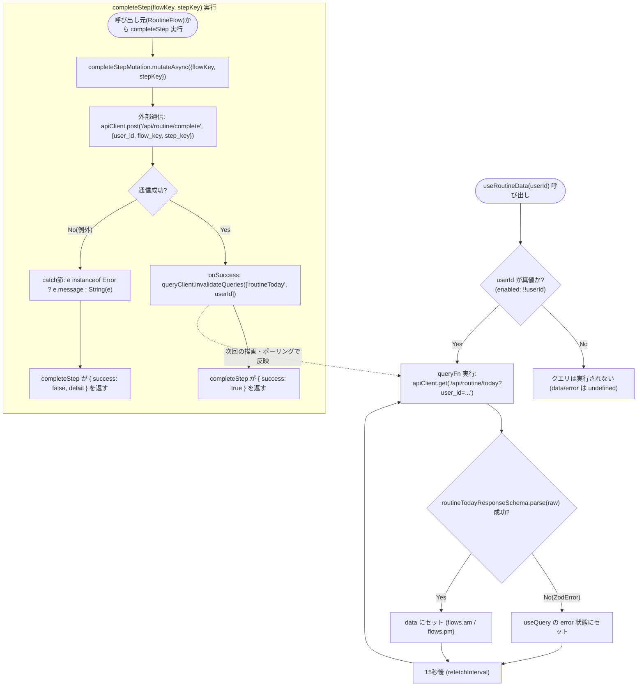
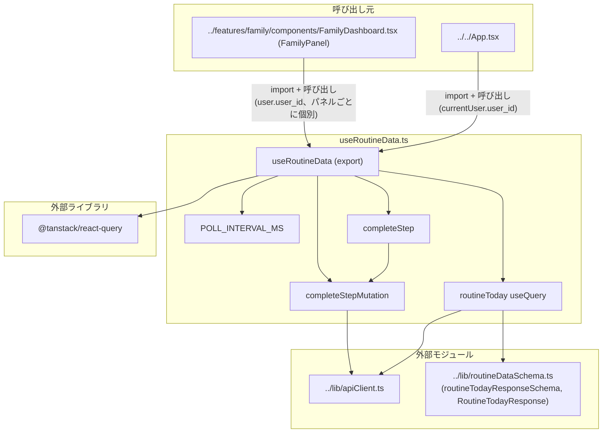

## 1. 解析メタ情報

| 項目 | 内容 |
| --- | --- |
| 対象ファイル | `useRoutineData.ts` (family-quest/src/hooks/useRoutineData.ts) |
| 言語 | React (TypeScript) |
| 解析対象 | 提供されたコードのみ |
| 推測・補完 | 一切なし |
| 解析基準コミット | `83b42db` |

## 関連ドキュメント

* [../lib/routineDataSchema.md](../lib/routineDataSchema.md) - 本フックが`gameData`クエリと同じ方式で使う`routineTodayResponseSchema`（Zod、`.parse()`によるレスポンス検証）と`RoutineTodayResponse`型の実装元。
* [../lib/apiClient.md](../lib/apiClient.md) - 本フックが`GET /api/routine/today`・`POST /api/routine/complete`の通信に使う`apiClient`の実装元。
* [../hooks/useGameData.md](../hooks/useGameData.md) - 同じ「React Query + Zodによるレスポンス検証」パターンを採る姉妹フック。`queryClient.invalidateQueries`によるキャッシュ無効化の方針が共通する。
* [../features/routine/components/RoutineFlow.md](../features/routine/components/RoutineFlow.md) - 本フックの戻り値（`flows`/`completeStep`/`isCompleting`）の消費元コンポーネント。
* [../../App.md](../../App.md) - 本フックを`currentUser.user_id`で呼び出す消費元（縦画面/横画面共通のルートコンポーネント）。
* [../features/family/components/FamilyDashboard.md](../features/family/components/FamilyDashboard.md) - `FamilyPanel`が各ユーザーごとに個別に本フックを呼び出す消費元。
* `MY_HOME_SYSTEM/services/routine_service.py`（本タスクの対象外、未解析）- `GET /api/routine/today`のレスポンス生成、およびチェックポイントの時刻ベース強制通過（`_apply_forced_transition`）の実装元と推測される。

## 2. ファイルの概要

React Queryを用いて、「きょうのすごろく」機能のデータ取得（`GET /api/routine/today`のポーリング取得）と、1ステップの完了報告（`POST /api/routine/complete`）を提供するカスタムフック`useRoutineData`を定義するファイル。`userId`（呼び出し元のユーザーID）を引数に取り、そのユーザーの当日の朝(`am`)/夕方(`pm`)2系統のフロー状態、日付、ローディング状態、エラー、およびステップ完了関数`completeStep`とその送信中フラグ`isCompleting`を返す。チェックポイント（自由時間の終了）はサーバー側で時刻ベースに強制通過させる遅延評価方式のため、フロント側は15秒間隔の短いポーリング(`POLL_INTERVAL_MS`)でこれを追従する設計である。
* 根拠: ファイル冒頭のポーリング間隔コメント (行番号: 6〜9 / 抜粋: "// チェックポイント(自由時間の終了)はサーバー側で時刻ベースに強制通過させる遅延評価\n// (services/routine_service.py の _apply_forced_transition)のため、フロントは\n// 短い間隔でポーリングして「時刻になった瞬間」の反映をそう待たせずに拾う。\nconst POLL_INTERVAL_MS = 1000 * 15;")
* 根拠: `useRoutineData`関数定義と戻り値 (行番号: 11, 47〜54 / 抜粋: "export const useRoutineData = (userId: string | undefined) => {", "return {\n        flows: data?.flows,\n        date: data?.date,\n        isLoading,\n        error,\n        completeStep,\n        isCompleting: completeStepMutation.isPending,\n    };\n};")

## 3. 外部依存関係

### インポート一覧

| 名称 | 種類 | 用途 | 根拠 |
| --- | --- | --- | --- |
| `useMutation`, `useQuery`, `useQueryClient` | 外部ライブラリ(`@tanstack/react-query`) | データ取得（ポーリング付き）・完了報告のミューテーション・キャッシュ無効化に使用 | 根拠: [インポート宣言] (行番号: 2 / 抜粋: "import { useMutation, useQuery, useQueryClient } from '@tanstack/react-query';") |
| `apiClient` | 外部モジュール | `GET /api/routine/today`・`POST /api/routine/complete`への実際のHTTP通信を担うクライアント | 根拠: [インポート宣言] (行番号: 3 / 抜粋: "import { apiClient } from '../lib/apiClient';") |
| `routineTodayResponseSchema`, `RoutineTodayResponse` | 外部モジュール(Zodスキーマ/型) | `routineTodayResponseSchema`は`GET /api/routine/today`の生レスポンスをランタイム検証するために使用。`RoutineTodayResponse`は`useQuery`の型引数として使用 | 根拠: [インポート宣言] (行番号: 4 / 抜粋: "import { routineTodayResponseSchema, RoutineTodayResponse } from '../lib/routineDataSchema';") |

### ブラックボックスとなる外部要素

| 名称 | 理由 | 根拠 |
| --- | --- | --- |
| `apiClient`の内部実装 | ベースURL解決・エラーハンドリングの詳細な通信仕様は本ファイルからは読み取れないため（詳細は`apiClient.md`を参照）。 | 根拠: (行番号: 18, 27〜31 / 抜粋: "const raw = await apiClient.get<unknown>(`/api/routine/today?user_id=${encodeURIComponent(userId!)}`);", "return apiClient.post('/api/routine/complete', {") |
| `GET /api/routine/today`・`POST /api/routine/complete`エンドポイントの実装 | リクエスト後のDBの挙動、チェックポイントの時刻ベース強制通過（`_apply_forced_transition`とコメントされている）の具体的なタイミングは本ファイルからは不明（本タスクでは`MY_HOME_SYSTEM`側は解析対象外）。 | 根拠: (行番号: 6〜8 / 抜粋: "// チェックポイント(自由時間の終了)はサーバー側で時刻ベースに強制通過させる遅延評価\n// (services/routine_service.py の _apply_forced_transition)のため、") |
| `routineTodayResponseSchema`の詳細なフィールド定義 | `../lib/routineDataSchema.ts`に実装があり、本ファイルからは`.parse()`の呼び出し結果のみが分かる。詳細は`routineDataSchema.md`を参照。 | 根拠: (行番号: 4, 19 / 抜粋: "import { routineTodayResponseSchema, RoutineTodayResponse } from '../lib/routineDataSchema';", "return routineTodayResponseSchema.parse(raw);") |

## 4. 主要要素の定義（関数 / エンドポイント / コンポーネント）

### `POLL_INTERVAL_MS` (モジュールレベル定数、非export)

* **役割**: `routineToday`クエリの`refetchInterval`に使われるポーリング間隔（15000ミリ秒＝15秒）を保持する定数。サーバー側でチェックポイント（自由時間の終了）が時刻ベースの遅延評価で強制的に通過させられる設計のため、フロント側はこの間隔でポーリングし、「時刻になった瞬間」の反映をそれほど待たせずに拾うことを意図している、とコメントされている。
* 根拠: [定数定義] (行番号: 6〜9 / 抜粋: "// チェックポイント(自由時間の終了)はサーバー側で時刻ベースに強制通過させる遅延評価\n// (services/routine_service.py の _apply_forced_transition)のため、フロントは\n// 短い間隔でポーリングして「時刻になった瞬間」の反映をそう待たせずに拾う。\nconst POLL_INTERVAL_MS = 1000 * 15;")

* **引数/リクエスト**: 該当なし
* **戻り値/レスポンス**: 該当なし
* **副作用**: なし
* **エラーハンドリング**: 該当なし

### `useRoutineData` (カスタムフック本体、export)

* **役割**: 指定した`userId`について、当日のすごろくフロー状態を取得するクエリと、1ステップを完了報告するミューテーションをまとめて管理し、呼び出し元コンポーネントが使いやすい形（`flows`/`date`/`isLoading`/`error`/`completeStep`/`isCompleting`）に整形して返す。
* 根拠: [関数定義] (行番号: 11〜55 / 抜粋: "export const useRoutineData = (userId: string | undefined) => {")

* **引数/リクエスト**: `userId: string | undefined`（呼び出し元のユーザーID。`undefined`の場合、後述の`enabled: !!userId`によりクエリ自体が実行されない）
* 根拠: (行番号: 11 / 抜粋: "export const useRoutineData = (userId: string | undefined) => {")

* **戻り値/レスポンス**: オブジェクト `{ flows: RoutineTodayResponse['flows'] | undefined, date: string | undefined, isLoading: boolean, error: unknown, completeStep: (flowKey: 'am' | 'pm', stepKey: string) => Promise<{ success: boolean; detail?: string }>, isCompleting: boolean }`
* 根拠: (行番号: 47〜54 / 抜粋: "return {\n        flows: data?.flows,\n        date: data?.date,\n        isLoading,\n        error,\n        completeStep,\n        isCompleting: completeStepMutation.isPending,\n    };")

* **副作用**: `userId`が真値の間、`GET /api/routine/today`へのポーリング通信（`refetchInterval` 15秒、`staleTime` 10秒）を実行する。`completeStep`の呼び出しにより`POST /api/routine/complete`へのPOSTリクエストを実行し、成功時に`queryClient.invalidateQueries`で`['routineToday', userId]`のキャッシュを無効化して再取得を促す。
* 根拠: `useQuery`のオプション (行番号: 14〜23 / 抜粋: "const { data, isLoading, error } = useQuery<RoutineTodayResponse>({\n        queryKey: ['routineToday', userId],\n        enabled: !!userId,\n        queryFn: async () => {\n            const raw = await apiClient.get<unknown>(`/api/routine/today?user_id=${encodeURIComponent(userId!)}`);\n            return routineTodayResponseSchema.parse(raw);\n        },\n        staleTime: 1000 * 10,\n        refetchInterval: POLL_INTERVAL_MS,\n    });")
* 根拠: `onSuccess`でのキャッシュ無効化 (行番号: 33〜35 / 抜粋: "onSuccess: () => {\n            queryClient.invalidateQueries({ queryKey: ['routineToday', userId] });\n        },")

* **エラーハンドリング**: `gameData`/`gameDataResponseSchema`と同様、`queryFn`内で`routineTodayResponseSchema.parse(raw)`が失敗した場合`ZodError`が送出され、これは`useQuery`の`error`としてそのまま戻り値の`error`に伝播する（本ファイル自体はこれを握りつぶしたり変換したりしない。`useGameData.ts`の`describeGameDataError`のような表示用文字列への変換関数はここには存在しない）。`completeStep`は内部で`try/catch`により`completeStepMutation.mutateAsync`の例外を捕捉し、成功時`{ success: true }`、失敗時`{ success: false, detail: (エラーメッセージ) }`を返す（例外を再スローしない）。
* 根拠: `queryFn`内の`.parse()`呼び出し (行番号: 19 / 抜粋: "return routineTodayResponseSchema.parse(raw);")
* 根拠: `completeStep`の`try/catch` (行番号: 38〜45 / 抜粋: "const completeStep = async (flowKey: 'am' | 'pm', stepKey: string) => {\n        try {\n            await completeStepMutation.mutateAsync({ flowKey, stepKey });\n            return { success: true };\n        } catch (e) {\n            return { success: false, detail: e instanceof Error ? e.message : String(e) };\n        }\n    };")

### `routineToday` クエリ (`useQuery`)

* **役割**: `queryKey: ['routineToday', userId]`で、`userId`が真値のときのみ有効化される(`enabled: !!userId`)クエリ。`queryFn`は`apiClient.get<unknown>`で`/api/routine/today?user_id={encodeURIComponent(userId)}`から生レスポンスを取得し、`routineTodayResponseSchema.parse(raw)`でランタイム検証してから返す。`staleTime`は10秒、`refetchInterval`は`POLL_INTERVAL_MS`（15秒）。
* 根拠: (行番号: 14〜23 / 抜粋: "const { data, isLoading, error } = useQuery<RoutineTodayResponse>({\n        queryKey: ['routineToday', userId],\n        enabled: !!userId,\n        queryFn: async () => {\n            const raw = await apiClient.get<unknown>(`/api/routine/today?user_id=${encodeURIComponent(userId!)}`);\n            return routineTodayResponseSchema.parse(raw);\n        },\n        staleTime: 1000 * 10,\n        refetchInterval: POLL_INTERVAL_MS,\n    });")

* **引数/リクエスト**: なし（`useRoutineData(userId)`呼び出し時に自動実行。実際のリクエストURLに`userId`が`encodeURIComponent`を経て埋め込まれる）
* **戻り値/レスポンス**: `data: RoutineTodayResponse | undefined`, `isLoading: boolean`, `error: unknown`
* **副作用**: `userId`が真値の間の15秒間隔ポーリングによるHTTP GET
* **エラーハンドリング**: `routineTodayResponseSchema.parse(raw)`が失敗した場合`ZodError`が`useQuery`のエラー状態として扱われる（変換・握りつぶしなし）
* 根拠: (行番号: 16〜18 / 抜粋: "enabled: !!userId,\n        queryFn: async () => {\n            const raw = await apiClient.get<unknown>(`/api/routine/today?user_id=${encodeURIComponent(userId!)}`);")

### `completeStepMutation` (`useMutation`) / `completeStep` (ラッパー)

* **役割**: `completeStepMutation`は`{ flowKey: 'am' | 'pm'; stepKey: string }`を受け取り、`POST /api/routine/complete`へ`{ user_id: userId, flow_key: flowKey, step_key: stepKey }`をボディとして送信する`mutationFn`を持つ。成功時(`onSuccess`)、`queryClient.invalidateQueries({ queryKey: ['routineToday', userId] })`で当該ユーザーの`routineToday`キャッシュを無効化し、次回の描画・ポーリングで最新状態を反映させる。`completeStep`はこの`useMutation`を`mutateAsync`経由で呼び出す薄いラッパー関数で、呼び出し元（`RoutineFlow`コンポーネント）には`Promise<{ success: boolean; detail?: string }>`という単純な形で結果を返す。
* 根拠: [`useMutation`定義] (行番号: 25〜36 / 抜粋: "const completeStepMutation = useMutation({\n        mutationFn: async ({ flowKey, stepKey }: { flowKey: 'am' | 'pm'; stepKey: string }) => {\n            return apiClient.post('/api/routine/complete', {\n                user_id: userId,\n                flow_key: flowKey,\n                step_key: stepKey,\n            });\n        },\n        onSuccess: () => {\n            queryClient.invalidateQueries({ queryKey: ['routineToday', userId] });\n        },\n    });")
* 根拠: [`completeStep`ラッパー定義] (行番号: 38〜45 / 抜粋: "const completeStep = async (flowKey: 'am' | 'pm', stepKey: string) => {\n        try {\n            await completeStepMutation.mutateAsync({ flowKey, stepKey });\n            return { success: true };\n        } catch (e) {\n            return { success: false, detail: e instanceof Error ? e.message : String(e) };\n        }\n    };")

* **引数/リクエスト**: `completeStep(flowKey: 'am' | 'pm', stepKey: string)`。内部の`mutationFn`は`{ flowKey, stepKey }`を受け取り、リクエストボディとして`user_id`（フック引数の`userId`をそのまま使用、`null`/`undefined`チェックは行わない）・`flow_key`・`step_key`を送信する。
* 根拠: (行番号: 26〜31 / 抜粋: "mutationFn: async ({ flowKey, stepKey }: { flowKey: 'am' | 'pm'; stepKey: string }) => {\n            return apiClient.post('/api/routine/complete', {\n                user_id: userId,\n                flow_key: flowKey,\n                step_key: stepKey,\n            });\n        },")

* **戻り値/レスポンス**: `completeStep`は`Promise<{ success: true } | { success: false; detail: string }>`。`completeStepMutation`自体の`mutationFn`は`apiClient.post`の戻り値（型引数の指定なし、`unknown`相当）をそのまま返す。
* 根拠: (行番号: 27〜31, 40, 43 / 抜粋: "return apiClient.post('/api/routine/complete', {", "return { success: true };", "return { success: false, detail: e instanceof Error ? e.message : String(e) };")

* **副作用**: `/api/routine/complete`へのPOSTリクエスト。成功時、`queryClient.invalidateQueries`による`['routineToday', userId]`キャッシュの無効化（次回描画・次回ポーリングでの再取得を促す）。
* 根拠: (行番号: 33〜35 / 抜粋: "onSuccess: () => {\n            queryClient.invalidateQueries({ queryKey: ['routineToday', userId] });\n        },")

* **エラーハンドリング**: `completeStep`内の`try/catch`で`completeStepMutation.mutateAsync`が投げた例外を捕捉し、`e instanceof Error`なら`e.message`、そうでなければ`String(e)`を`detail`として`{ success: false, detail }`を返す。例外を呼び出し元へ再スローすることはない。`mutationFn`自体（および`apiClient.post`）に固有のエラーハンドリング（リトライ等）は本ファイルには実装されていない。
* 根拠: (行番号: 42〜44 / 抜粋: "} catch (e) {\n            return { success: false, detail: e instanceof Error ? e.message : String(e) };\n        }")

### 戻り値オブジェクト

* **役割**: `flows`（`data?.flows`、未取得時は`undefined`）、`date`（`data?.date`、未取得時は`undefined`）、`isLoading`（`routineToday`クエリのローディング状態）、`error`（`routineToday`クエリのエラー、未加工）、`completeStep`（上記ラッパー関数）、`isCompleting`（`completeStepMutation.isPending`）をまとめたオブジェクトを返す。`useGameData.ts`の戻り値と異なり、未取得時のフォールバックデータ（マスターデータ相当のもの）は用意されておらず、`flows`/`date`は単純に`undefined`のままとなる。
* 根拠: (行番号: 47〜54 / 抜粋: "return {\n        flows: data?.flows,\n        date: data?.date,\n        isLoading,\n        error,\n        completeStep,\n        isCompleting: completeStepMutation.isPending,\n    };")

## 5. 処理フロー図

以下は`routineToday`クエリのポーリングサイクルと、`completeStep`によるミューテーション・キャッシュ無効化のフローです。

## 6. 依存関係図

## 7. 次のステップ（リバースエンジニアリングの提案）

| 優先度 | ファイル名(推測可) | 理由 | 根拠 |
| --- | --- | --- | --- |
| 高 | `MY_HOME_SYSTEM/services/routine_service.py` | ファイル冒頭のコメントが名指しする`_apply_forced_transition`（チェックポイントの時刻ベース強制通過）の実際のタイミング・条件を確認し、15秒ポーリングという間隔の妥当性を検証するため。 | ファイル冒頭コメント (行番号: 6〜9) |
| 高 | `MY_HOME_SYSTEM/routers/routine_router.py`, `MY_HOME_SYSTEM/models/routine.py` | `GET /api/routine/today`・`POST /api/routine/complete`のリクエスト/レスポンスの正式な契約（必須パラメータ、バリデーションルール）を確認するため。 | エンドポイントパス文字列 (行番号: 18, 27) |
| 中 | `../lib/apiClient.ts` | `apiClient.get`/`apiClient.post`のエラーハンドリング（422のdetail配列結合、204/空ボディの扱い等）を確認し、`completeStep`の`catch`節が受け取りうる例外の形を把握するため。 | `apiClient.md`参照 |
| 中 | `../features/routine/components/RoutineFlow.tsx` | `flows`/`completeStep`/`isCompleting`が実際にどう描画・呼び出しに使われるかを確認するため。 | `RoutineFlow.md`参照 |
| 低 | `@tanstack/react-query`のドキュメント | `useQuery`の`enabled`/`staleTime`/`refetchInterval`、`useMutation`の`mutateAsync`/`isPending`の正確な挙動を確認するため。 | `import { useMutation, useQuery, useQueryClient } from '@tanstack/react-query';` |

## 8. 保守上の注意点

* **15秒ポーリングがチェックポイント反映の唯一の手段**: サーバー側の時刻ベース強制通過（`_apply_forced_transition`とコメントされている）をフロントが即座に検知する手段はプッシュ通知やWebSocketではなくこの15秒間隔ポーリングのみである。そのため、チェックポイント時刻を過ぎてから最大で`POLL_INTERVAL_MS`（15秒）程度、UIが古い状態（まだ自由時間に入っていない等）のまま表示され続ける可能性がある。
* 根拠: (行番号: 6〜9, 22 / 抜粋: "// チェックポイント(自由時間の終了)はサーバー側で時刻ベースに強制通過させる遅延評価\n// (services/routine_service.py の _apply_forced_transition)のため、フロントは\n// 短い間隔でポーリングして「時刻になった瞬間」の反映をそう待たせずに拾う。", "refetchInterval: POLL_INTERVAL_MS,")
* **`completeStep`に`userId`の`null`/`undefined`チェックが無い**: `useGameData.ts`の各ラッパー関数（`completeQuest`等、Issue #412）は対象IDが`null`/`undefined`の場合に通信自体を行わない事前ガードを持つが、本ファイルの`completeStepMutation`の`mutationFn`はフック引数の`userId`をそのままリクエストボディの`user_id`に使っており、`userId`が`undefined`のまま`completeStep`が呼ばれた場合の事前ガードは存在しない（`routineToday`クエリ自体は`enabled: !!userId`で防御されているが、`completeStep`単体にはこのガードが掛かっていない）。
* 根拠: (行番号: 16, 26〜31 / 抜粋: "enabled: !!userId,", "mutationFn: async ({ flowKey, stepKey }: { flowKey: 'am' | 'pm'; stepKey: string }) => {\n            return apiClient.post('/api/routine/complete', {\n                user_id: userId,")
* **手動でステップを進める手段が意図的に存在しない**: `useRoutineData`が公開する更新系の関数は`completeStep`のみであり、チェックポイント（自由時間の終了）自体を手動で進めるAPI呼び出しは存在しない。これは`RoutineFlow.tsx`側のコメント（4〜7行目）にある通り、チェックポイントの通過は時刻ベースのサーバー側判定のみに委ねる設計意図によるものである（詳細は`RoutineFlow.md`を参照）。
* 根拠: (行番号: 47〜54 / 抜粋: "return {\n        flows: data?.flows,\n        date: data?.date,\n        isLoading,\n        error,\n        completeStep,\n        isCompleting: completeStepMutation.isPending,\n    };")
* **`error`は未加工のまま公開される**: `useGameData.ts`の`gameDataError`のような、`ZodError`等を人間が読める文字列に変換する処理（`describeGameDataError`相当）は本ファイルには存在せず、`error`は`useQuery`の生の`error`値（`unknown`）がそのまま返る。呼び出し元でエラー表示を行う場合、この変換は呼び出し元またはさらに別のヘルパーの責務になる。
* 根拠: (行番号: 14, 51 / 抜粋: "const { data, isLoading, error } = useQuery<RoutineTodayResponse>({", "error,")

## 9. 不明事項一覧

| 項目 | 理由 | 必要なファイル |
| --- | --- | --- |
| `POST /api/routine/complete`のバックエンド実装 | リクエストボディ（`user_id`/`flow_key`/`step_key`）を受け取った後の具体的な処理（DBの更新内容、`is_checkpoint`ステップの完了とチェックポイント通過の関係、`bonus_gold`/`bonus_exp`の付与条件）は本ファイルからは不明。 | `MY_HOME_SYSTEM/services/routine_service.py`, `MY_HOME_SYSTEM/routers/routine_router.py` |
| `_apply_forced_transition`の実際の挙動 | コメントで言及されているのみで、本タスクでは`MY_HOME_SYSTEM`側は解析対象外のため、チェックポイント通過が実際にどのタイミング（サーバーの定期処理か、リクエストのたびの遅延評価か）で行われるかは確認できない。 | `MY_HOME_SYSTEM/services/routine_service.py` |
| `completeStepMutation`の`mutationFn`の戻り値の型 | `apiClient.post('/api/routine/complete', ...)`の呼び出しに型引数が指定されておらず、レスポンス（成功時のボディ）の具体的な形は本ファイルからは不明（`completeStep`ラッパー側もこの戻り値を使わず、成功したことのみを見て`{ success: true }`を返す）。 | `MY_HOME_SYSTEM/models/routine.py`または`routine_router.py`のレスポンスモデル定義 |

## 相互参照による補足情報

なし（本タスクでは`MY_HOME_SYSTEM`側のバックエンドファイルを解析対象としていないため、上記の不明事項を補足する他ドキュメントは現時点で存在しない）。

## 10. 自己検証結果

* [x] 完了: 推測・外部ファイルの仕様を一切含んでいない
* [x] 完了: 全関数・全クラス・全コンポーネントを列挙した
* [x] 完了: 全てのインポート要素を列挙した
* [x] 完了: すべての仕様説明に「根拠（行番号・抜粋）」を明記した
* [x] 完了: 根拠漏れが0件である
* [x] 完了: Mermaid構文にエラーの原因となる記号（エスケープ漏れ）がない
* [x] 完了: 不明事項を漏れなく列挙した
