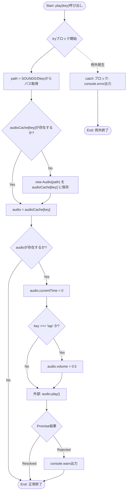
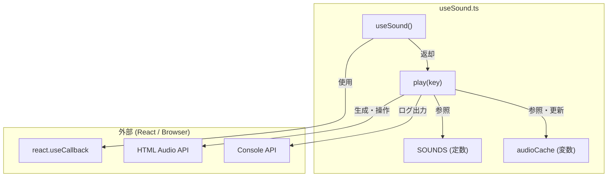

## 1. 解析メタ情報

| 項目 | 内容 |
| --- | --- |
| 対象ファイル | useSound.ts |
| 言語 | React (TypeScript) |
| 解析対象 | 提供されたコードのみ |
| 推測・補完 | 一切なし |

## 2. ファイルの概要

* Reactコンポーネント内で効果音を再生するためのカスタムフック `useSound` を提供する。
* 音声ファイルのパスを一元管理し、`HTMLAudioElement` のインスタンスをキャッシュすることで、連続再生やリソースの効率的な利用を行う。

## 3. 外部依存関係

### インポート一覧

| 名称 | 種類 | 用途 | 根拠 |
| --- | --- | --- | --- |
| `useCallback` | 関数 | 関数をメモ化し、不要な再生成を防ぐため | 根拠: `import { useCallback } from 'react';` (行番号: 1〜1 / 抜粋: "import { useCallback } from 'r") |

### ブラックボックスとなる外部要素

| 名称 | 理由 | 根拠 |
| --- | --- | --- |
| `Audio` (HTMLAudioElement) | ブラウザのWeb APIであり、ファイル内には実装がないため | 根拠: `new Audio(path)` (行番号: 27〜27 / 抜粋: "audioCache[key] = new Audio(pat") |

## 4. 主要要素の定義（関数 / エンドポイント / コンポーネント）

### `SOUNDS`

* **役割**: 効果音のキー（例: `submit`, `tap`など）と、対応する音声ファイルのパス（`/quest/...`）のマッピングを保持するオブジェクト。
* 根拠: `SOUNDS` (行番号: 4〜13 / 抜粋: "const SOUNDS = {...")

### `audioCache`

* **役割**: `SOUNDS` のキーごとに生成された `HTMLAudioElement` のインスタンスを保持し、再利用するためのキャッシュオブジェクト。
* 根拠: `audioCache` (行番号: 18〜18 / 抜粋: "const audioCache: Partial<Recor")

### `useSound`

* **役割**: 効果音を再生する関数 `play` を提供するカスタムフック。再生対象のキーを受け取り、キャッシュの確認・生成、再生位置のリセット、音量調整（`tap`のみ）を行った上で音声を再生する。
* 根拠: `useSound` (行番号: 20〜49 / 抜粋: "export const useSound = () => {")

* **引数/リクエスト**: なし
* 根拠: `useSound = ()` (行番号: 20〜20 / 抜粋: "export const useSound = () => {")

* **戻り値/レスポンス**: `{ play: (key: SoundKey) => void }` (音声を再生する関数を含むオブジェクト)
* 根拠: `return { play }` (行番号: 48〜48 / 抜粋: "return { play };")

* **副作用**:
* フックの外部で定義された変数 `audioCache` に対して、Audioインスタンスの追加・変更を行う。
* 根拠: `audioCache[key] = new Audio(path)` (行番号: 27〜27 / 抜粋: "audioCache[key] = new Audio(pat")
* ブラウザのAudio APIによる音声再生（オーディオデバイスへの出力）を行う。
* 根拠: `audio.play()` (行番号: 38〜38 / 抜粋: "audio.play().catch(e => {")

* **エラーハンドリング**:
* `audio.play()` が返すPromiseのrejectionをキャッチし、`console.warn` で出力する。
* 根拠: `catch(e => { console.warn... })` (行番号: 38〜41 / 抜粋: "console.warn('Sound play failed")
* `play` 関数内の全体を `try...catch` で囲み、エラー発生時は `console.error` で出力する。
* 根拠: `catch (error) { console.error... }` (行番号: 43〜45 / 抜粋: "console.error('Audio setup erro")

## 5. 処理フロー図

## 6. 依存関係図

## 7. 次のステップ（リバースエンジニアリングの提案）

| 優先度 | ファイル名(推測可) | 理由 | 根拠 |
| --- | --- | --- | --- |
| 高 | `useSound` を利用しているUIコンポーネント（ファイル名不明） | このフックがどのタイミング（ボタンクリック、イベント発火など）で呼び出され、実際に音声ファイルが期待通りにロード・再生されているかを確認するため。 | 根拠: `export const useSound` (行番号: 20〜20 / 抜粋: "export const useSound = () => {") |
| 中 | 静的ファイルディレクトリ（例: `public/quest/` など） | `SOUNDS` オブジェクトに定義されている `.mp3` ファイルが実際に正しいパスに配置されているかを検証するため。 | 根拠: `/quest/submit.mp3` などのパス指定 (行番号: 5〜12 / 抜粋: "submit: '/quest/submit.mp3',") |

## 8. 保守上の注意点

* **グローバル変数の状態保持**: `audioCache` はモジュールスコープ（フックの外部）に定義されているため、アプリケーション全体で単一のキャッシュインスタンスを共有する。フックのアンマウント時にキャッシュが破棄されないため、メモリ上に Audio オブジェクトが残り続ける仕様となっている。
* 根拠: `const audioCache` (行番号: 18〜18 / 抜粋: "const audioCache: Partial<Recor")

* **ハードコードされた音量**: `tap` 時の音量 `0.5` がコード内にハードコードされている。他の音量の調整が必要になった場合、ここを直接修正する必要がある。
* 根拠: `if (key === 'tap') audio.volume = 0.5;` (行番号: 35〜35 / 抜粋: "if (key === 'tap') audio.volume")

* **自動再生ポリシーの考慮**: ブラウザの自動再生ポリシー（Autoplay Policy）により、ユーザーの操作（クリックやタップ）に直接紐付かない再生はブロックされる可能性があり、その場合は警告ログが出力されるのみで音は鳴らない。
* 根拠: `audio.play().catch(...)` (行番号: 38〜41 / 抜粋: "audio.play().catch(e => {")

## 9. 不明事項一覧

| 項目 | 理由 | 必要なファイル |
| --- | --- | --- |
| 音声ファイルの配置場所と存在有無 | コード内ではパス文字列を指定しているのみで、実際のアセットの配置はコードから確認できないため。 | 対象の `.mp3` ファイル（`/quest/*.mp3`） |
| フックの呼び出し元と実行タイミング | 本ファイルはフックの定義のみであり、実際にどのコンポーネントでどのキーの音声が再生されるかは不明なため。 | `useSound` をインポート・使用しているコンポーネントファイル |

## 10. 自己検証結果

* [x] 推測・外部ファイルの仕様を一切含んでいない完了
* [x] 全関数・全クラス・全コンポーネントを列挙した完了
* [x] 全てのインポート要素を列挙した完了
* [x] すべての仕様説明に「根拠（行番号・抜粋）」を明記した完了
* [x] 根拠漏れが0件である完了
* [x] Mermaid構文にエラーの原因となる記号（エスケープ漏れ）がない完了
* [x] 不明事項を漏れなく列挙した完了