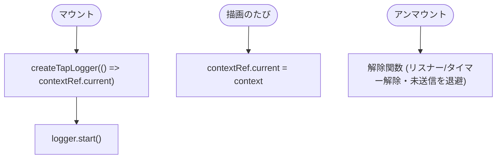
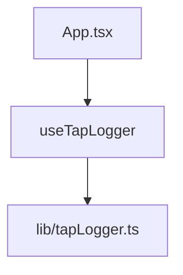

## 1. 解析メタ情報

| 項目 | 内容 |
| --- | --- |
| 対象ファイル | `useTapLogger.ts` |
| 言語 | TypeScript / React |
| 解析対象 | 提供されたコードのみ |
| 推測・補完 | 一切なし |

## 関連ドキュメント

* [../lib/tapLogger.md](../lib/tapLogger.md) - 本フックが`createTapLogger`で生成・開始するタップログ本体
* [../../App.md](../../App.md) - 本フックを呼び出す側(選択中ユーザー・画面・向きを渡す)

## 2. ファイルの概要

画面タップログ(`lib/tapLogger.ts`)を、コンポーネントのマウント中だけ有効にするカスタムフック。文脈(選択中ユーザー・画面・向き)は`ref`に入れ替え、リスナー側がタップ時点の最新値を読むため、画面が切り替わってもリスナーを張り直さない。
根拠: [関数定義] (行番号: 7 / 抜粋: "export function useTapLogger(context: TapContext): void {")

## 3. 外部依存関係

### インポート一覧

| 名称 | 種類 | 用途 | 根拠 |
| --- | --- | --- | --- |
| `useEffect` / `useRef` | 外部パッケージ(react) | 文脈のref保持と開始/解除 | 根拠: [インポート宣言] (行番号: 1 / 抜粋: "import { useEffect, useRef } from 'react';") |
| `createTapLogger` / `TapContext` | ローカルモジュール | ロガー生成と文脈の型 | 根拠: [インポート宣言] (行番号: 2 / 抜粋: "import { createTapLogger, type TapContext } from '../lib/tapLogger';") |

### ブラックボックスとなる外部要素

| 名称 | 理由 | 根拠 |
| --- | --- | --- |
| `TapLogger.start`の内部動作 | [tapLogger.md](../lib/tapLogger.md)側 | [関数呼び出し] (行番号: 16 / 抜粋: "return logger.start();") |

## 4. 主要要素の定義（関数 / エンドポイント / コンポーネント）

### `useTapLogger`

* **役割**: マウント時に`createTapLogger`で生成したロガーを`start()`し、アンマウント時に解除関数を返して停止する。レンダー中の`ref`書き換え(ESLint `react-hooks/refs`)を避けるため、`contextRef.current`は描画ごとの`useEffect`で最新へ入れ替える。
* 根拠: [関数定義] (行番号: 7 / 抜粋: "export function useTapLogger(context: TapContext): void {")、[文脈更新] (行番号: 10-12)、[開始/解除] (行番号: 14-17)
* **引数/リクエスト**: `context: TapContext`
* **戻り値/レスポンス**: なし(`void`)
* **副作用**: `document`/`window`リスナー・タイマーの登録と解除(`TapLogger.start`経由)
* 根拠: [関数呼び出し] (行番号: 15-16 / 抜粋: "const logger = createTapLogger(() => contextRef.current);")
* **エラーハンドリング**: なし

## 5. 処理フロー図

## 6. 依存関係図

## 7. 次のステップ（リバースエンジニアリングの提案）

| 優先度 | ファイル名(推測可) | 理由 | 根拠 |
| --- | --- | --- | --- |
| 高 | `src/lib/tapLogger.ts` | 実処理の把握 | [関数呼び出し] (行番号: 15) |

## 8. 保守上の注意点

* 依存配列が`[]`のため、ロガーはマウント中1つだけ。文脈の変化は`ref`経由で反映される。
* `App`でのみ呼ぶこと。カメラ画面(`/camera`)は`main.tsx`で`App`とは別にマウントされるため、ここでは動かない(記録しない方針)。

## 9. 不明事項一覧

| 項目 | 理由 | 必要なファイル |
| --- | --- | --- |
| なし | - | - |

## 10. 自己検証結果

* [x] 完了: 推測・外部ファイルの仕様を一切含んでいない
* [x] 完了: 全関数・全クラス・全コンポーネントを列挙した
* [x] 完了: 全てのインポート要素を列挙した
* [x] 完了: すべての仕様説明に「根拠（行番号・抜粋）」を明記した
* [x] 完了: 根拠漏れが0件である
* [x] 完了: Mermaid構文にエラーの原因となる記号（エスケープ漏れ）がない
* [x] 完了: 不明事項を漏れなく列挙した
