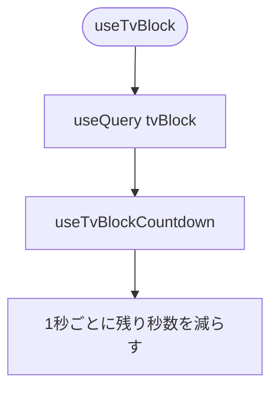
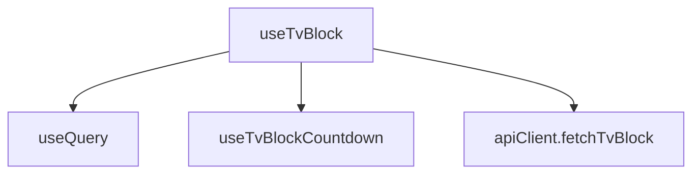

## 1. 解析メタ情報

| 項目 | 内容 |
| --- | --- |
| 対象ファイル | useTvBlock.ts |
| 言語 | React (TypeScript) |
| 解析対象 | 提供されたコードのみ |
| 推測・補完 | 一切なし |

## 関連ドキュメント

* [../lib/apiClient.md](../lib/apiClient.md) - `fetchTvBlock`
* [../lib/uiConstants.md](../lib/uiConstants.md) - `TV_BLOCK_POLL_INTERVAL_MS`
* [../components/layout/TvBlockHeaderBanner.md](../components/layout/TvBlockHeaderBanner.md) - 利用側

## 2. ファイルの概要

* 休日のテレビおやすみの状態を扱うフック2つ。`useTvBlockCountdown` は禁止開始までの秒数をサーバー値起点でローカルに1秒ずつ減らし、`useTvBlock` は `GET /api/quest/tv_block` を30秒間隔で取得してそれを併用する。
* 根拠: `export function useTvBlockCountdown(tvBlock: TvBlockState | null) {` (行番号: 10 / 抜粋: "export function useTvBlockCountdown(tvBlock: TvBlockState | null) {")
* ごほうび画面と画面上部の帯で判定を食い違わせないため集約している。
* 根拠: `// ローカルで1秒ずつ減らすカウントダウン。ごほうび画面(InventoryList)と画面上部の` (行番号: 8 / 抜粋: "// ローカルで1秒ずつ減らすカウントダウン。ごほうび画面(InventoryList)と画面上部の")

## 3. 外部依存関係

### インポート一覧

| 名称 | 種類 | 用途 | 根拠 |
| --- | --- | --- | --- |
| `useQuery` | 関数 | 定期取得 | 根拠: `import { useQuery } from '@tanstack/react-query';` (行番号: 2 / 抜粋: "import { useQuery } from '@tanstack/react-query';") |
| `apiClient` | オブジェクト | API呼び出し | 根拠: `import { apiClient } from '../lib/apiClient';` (行番号: 3 / 抜粋: "import { apiClient } from '../lib/apiClient';") |
| `TV_BLOCK_POLL_INTERVAL_MS` | 定数 | ポーリング間隔 | 根拠: `import { TV_BLOCK_POLL_INTERVAL_MS } from '../lib/uiConstants';` (行番号: 4 / 抜粋: "import { TV_BLOCK_POLL_INTERVAL_MS } from '../lib/uiConstants';") |

### ブラックボックスとなる外部要素

| 名称 | 理由 | 根拠 |
| --- | --- | --- |
| 各importの実装 | 本ファイル外のため | 根拠: import文 (行番号: 1 / 抜粋: 判断不可) |

## 4. 主要要素の定義（関数 / エンドポイント / コンポーネント）

### useTvBlockCountdown

* **役割**: サーバー値の残り秒数を1秒ごとに減らし、おやすみ中かを返す。
* 根拠: `export function useTvBlockCountdown(tvBlock: TvBlockState | null) {` (行番号: 10 / 抜粋: "export function useTvBlockCountdown(tvBlock: TvBlockState | null) {")
* **引数/リクエスト**: `tvBlock`（null可）
* **戻り値/レスポンス**: `{ tvSecondsLeft, tvBlockActive }`。`tvBlockActive` は `is_blocked` または残り秒数が0以下
* **副作用**: `setInterval` を張り、サーバー値が変わる／アンマウントで解除
* **エラーハンドリング**: なし

### useTvBlock

* **役割**: 全員共通の状態を取得し、カウントダウンと合わせて返す。
* 根拠: `export function useTvBlock() {` (行番号: 32 / 抜粋: "export function useTvBlock() {")
* **引数/リクエスト**: なし
* **戻り値/レスポンス**: `{ tvBlock, tvSecondsLeft, tvBlockActive }`
* **副作用**: 30秒間隔のポーリング
* **エラーハンドリング**: 取得失敗時は data が無く tvBlock は null（画面側は何も出さない）

## 5. 処理フロー図

## 6. 依存関係図

## 7. 次のステップ（リバースエンジニアリングの提案）

| 優先度 | ファイル名(推測可) | 理由 |
| --- | --- | --- |
| 中 | `MY_HOME_SYSTEM/services/switchbot_service.py` | 状態の算出 |

## 8. 保守上の注意点

* `useTvBlockCountdown` の `set-state-in-effect` は、サーバー値起点のローカルカウントダウンのため意図的に eslint を無効化している。

## 9. 不明事項一覧

| 項目 | 理由 | 必要なファイル |
| --- | --- | --- |
| なし | － | － |

## 10. 自己検証結果

* [x] 推測・外部ファイルの仕様を一切含んでいない
* [x] 全関数・全クラス・全コンポーネントを列挙した
* [x] 全てのインポート要素を列挙した
* [x] すべての仕様説明に「根拠（行番号・抜粋）」を明記した
* [x] 根拠漏れが0件である
* [x] Mermaid構文にエラーの原因となる記号（エスケープ漏れ）がない
* [x] 不明事項を漏れなく列挙した
