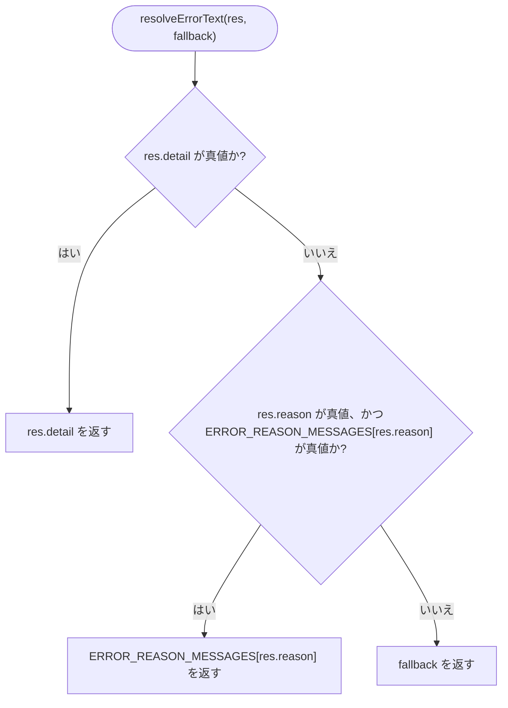
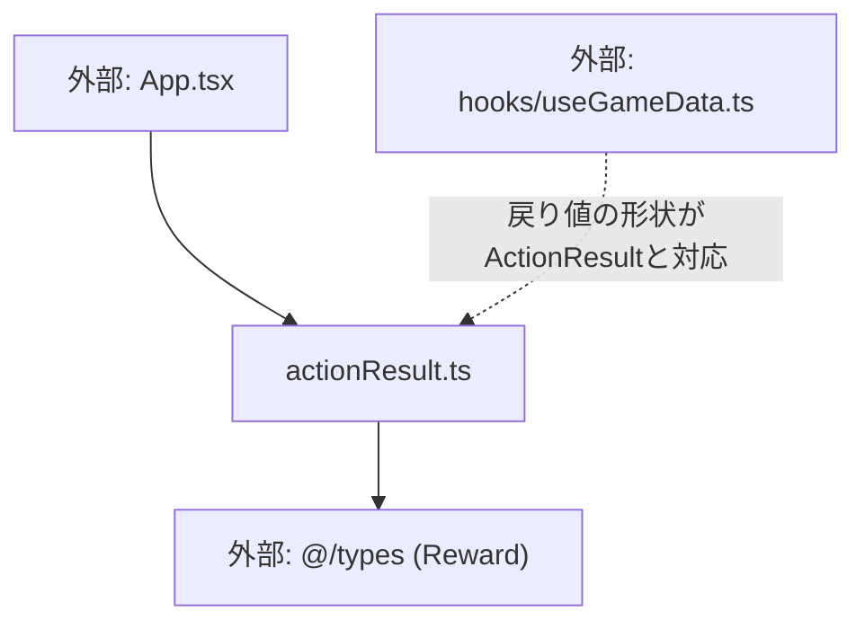

## 1. 解析メタ情報

| 項目 | 内容 |
| --- | --- |
| 対象ファイル | actionResult.ts (family-quest/src/lib/actionResult.ts) |
| 言語 | TypeScript |
| 解析対象 | 提供されたコードのみ |
| 推測・補完 | 一切なし |
| 解析基準コミット | `f06eef5` |

## 関連ドキュメント

* [../../App.md](../../App.md) - 呼び出し元（`ActionResult`型で各種ミューテーション結果を受け取り、`resolveErrorText`でエラーメッセージを組み立てる）
* [../hooks/useGameData.md](../hooks/useGameData.md) - `ActionResult`が表す戻り値（`success`/`status`/`earnedMedals`等）を実際に返す`completeQuest`/`cancelQuest`/`buyReward`/`rejectQuest`/`approveQuest`の実装元
* [../types/index.md](../types/index.md) - `Reward`型の定義元

## 2. ファイルの概要

* `useGameData.ts`の各種ミューテーションラッパー関数の戻り値をまとめて表す型`ActionResult`と、`reason`文字列を日本語エラーメッセージへマッピングする定数・関数を提供するモジュール。**（Issue #552で`App.tsx`から抽出）** 以前は`App.tsx`内にモジュールレベルの型・定数・関数として定義されていたものが、ロジックを変更せずそのまま本ファイルへ移動された。
* 根拠: ファイル冒頭のコメントと定義 (行番号: 1〜4 / 抜粋: "import { Reward } from '@/types';\n\n// useGameData.ts の completeQuest/cancelQuest/buyReward/rejectQuest\n// ラッパー関数群の戻り値をまとめて受け取るための型（各関数は success 以外のフィールドが少しずつ異なる）")

## 3. 外部依存関係

### インポート一覧

| 名称 | 種類 | 用途 | 根拠 |
| --- | --- | --- | --- |
| `Reward` | 型定義 | `ActionResult.reward`フィールドの型 | 根拠: (行番号: 1 / 抜粋: "import { Reward } from '@/types';") |

### ブラックボックスとなる外部要素

なし（型定義に使う`Reward`以外は外部依存が無い）。

## 4. 主要要素の定義（関数 / エンドポイント / コンポーネント）

### `ActionResult` (export interface)

* **役割**: `useGameData.ts`の`completeQuest`/`cancelQuest`/`buyReward`/`rejectQuest`/`approveQuest`ラッパー関数群の戻り値をまとめて受け取るためのインターフェース。各関数は`success`以外のフィールドが少しずつ異なるため、全フィールドを任意（オプショナル）として定義している。
* 根拠: (行番号: 3〜15 / 抜粋: "export interface ActionResult {\n    success: boolean;\n    status?: string;\n    message?: string;\n    earnedMedals?: number;\n    leveledUp?: boolean;\n    newGold?: number;\n    reward?: Reward;\n    reason?: string;\n    detail?: string;\n}")

* **引数/リクエスト**: 該当なし（型定義）
* **戻り値/レスポンス**: 該当なし（型定義）
* **副作用**: なし
* **エラーハンドリング**: なし

### `ERROR_REASON_MESSAGES` (export const)

* **役割**: `reason`文字列（`gold`/`pending`/`permission`/`error`）を日本語のエラーメッセージへマッピングする定数オブジェクト。
* 根拠: (行番号: 17〜22 / 抜粋: "export const ERROR_REASON_MESSAGES: { [key: string]: string } = {\n    gold: \"お金が足りません！\",\n    pending: \"すでに申請中です\",\n    permission: \"権限がありません\",\n    error: \"エラーが発生しました\",\n};")

* **引数/リクエスト**: 該当なし
* **戻り値/レスポンス**: `{ [key: string]: string }`（4キー固定）
* **副作用**: なし
* **エラーハンドリング**: なし

### `resolveErrorText` (export関数)

* **役割**: `res.detail`（バックエンドが返す具体的なエラー内容）を最優先とし、それが無ければ`res.reason`に対応する`ERROR_REASON_MESSAGES`のメッセージ、それも無ければ呼び出し元が渡した`fallback`文字列を返す。
* 根拠: (行番号: 24〜26 / 抜粋: "// バックエンドが具体的なエラー内容(detail)を返している場合はそれを優先表示する\nexport const resolveErrorText = (res: ActionResult, fallback: string): string =>\n    res.detail || (res.reason && ERROR_REASON_MESSAGES[res.reason]) || fallback;")

* **引数/リクエスト**: `res: ActionResult`, `fallback: string`
* **戻り値/レスポンス**: `string`
* **副作用**: なし
* **エラーハンドリング**: `res.detail` → `ERROR_REASON_MESSAGES[res.reason]` → `fallback`の順にフォールバックするため、いずれかが真値になる限り例外は発生しない。`res.reason`が`ERROR_REASON_MESSAGES`に無いキーの場合は`undefined`となり次のフォールバックへ進む。

## 5. 処理フロー図

## 6. 依存関係図

## 7. 次のステップ（リバースエンジニアリングの提案）

| 優先度 | ファイル名(推測可) | 理由 | 根拠 |
| --- | --- | --- | --- |
| 中 | `../hooks/useGameData.ts` | `completeQuest`等が実際に`ActionResult`の各フィールド（`reason`/`detail`等）をどのような条件で設定するかを確認するため | 根拠: 関連ドキュメント参照 |
| 低 | `../../App.tsx` | `resolveErrorText`の実際の呼び出し箇所（`messageData`へのセット方法）を確認するため | 根拠: 関連ドキュメント参照 |

## 8. 保守上の注意点

* **`ERROR_REASON_MESSAGES`に無いreasonは無言でfallbackへ流れる**: `res.reason`が`'gold'`/`'pending'`/`'permission'`/`'error'`以外の文字列の場合、`ERROR_REASON_MESSAGES[res.reason]`は`undefined`となり、警告等は出さずに`fallback`が使われる。新しい`reason`種別をバックエンドに追加する場合は本ファイルの定数も合わせて更新する必要がある。
* **`res.detail`が常に優先される**: `reason`によるマッピングよりも`detail`（バックエンドの生のエラー文言）が優先されるため、`detail`が空文字列ではなく`undefined`/`null`であることをバックエンド側が保証しないと、意図せず`reason`ベースのメッセージにフォールバックしない（空文字列は偽値のためフォールバックする）。

## 9. 不明事項一覧

なし（本ファイル単体で完結する型・純粋関数のみで構成されている）。

## 相互参照による補足情報

なし。

## 10. 自己検証結果

* [x] 推測・外部ファイルの仕様を一切含んでいない
* [x] 全関数・全クラス・全コンポーネントを列挙した
* [x] 全てのインポート要素を列挙した
* [x] すべての仕様説明に「根拠（行番号・抜粋）」を明記した
* [x] 根拠漏れが0件である
* [x] Mermaid構文にエラーの原因となる記号（エスケープ漏れ）がない
* [x] 不明事項を漏れなく列挙した
