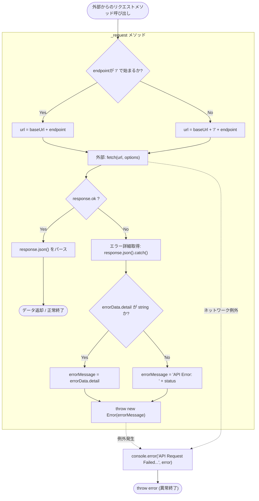
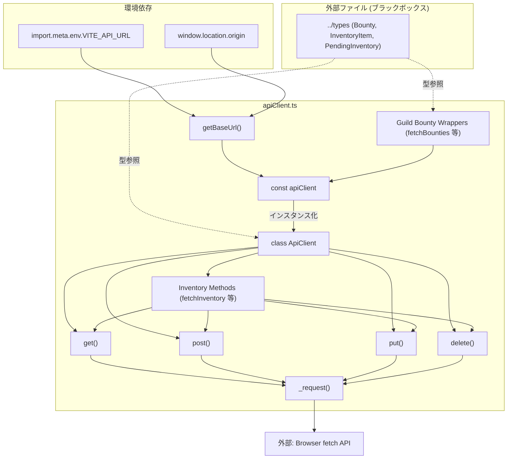

## 1. 解析メタ情報

| 項目 | 内容 |
| --- | --- |
| 対象ファイル | `apiClient.ts` |
| 言語 | TypeScript (React/Vite想定環境) |
| 解析対象 | 提供されたコードのみ |
| 推測・補完 | 一切なし |

## 2. ファイルの概要

* 本ファイルは、アプリケーションからバックエンドAPIへ通信するためのHTTPクライアント（`ApiClient` クラスおよびそのインスタンス `apiClient`）を定義し、提供する責務を持つ。
* 環境に応じたベースURLの解決、リクエストヘッダの共通設定（`application/json`）、JSONデータの送受信、およびHTTPエラー時の共通エラーハンドリング（例外送出）をカプセル化している。
* `Inventory`（インベントリ）関連および `Guild Bounty`（ギルドバウンティ）関連の各APIエンドポイントを呼び出すためのラッパーメソッド・関数群を定義している。

## 3. 外部依存関係

### インポート一覧

| 名称 | 種類 | 用途 | 根拠 |
| --- | --- | --- | --- |
| `Bounty` | 型(Type/Interface) | APIレスポンスの型指定として使用 | 根拠: [import宣言] (行番号: 行番号取得不可 / 抜粋: "import { Bounty, InventoryIt") |
| `InventoryItem` | 型(Type/Interface) | APIレスポンスの型指定として使用 | 根拠: [import宣言] (行番号: 行番号取得不可 / 抜粋: "import { Bounty, InventoryIt") |
| `PendingInventory` | 型(Type/Interface) | APIレスポンスの型指定として使用 | 根拠: [import宣言] (行番号: 行番号取得不可 / 抜粋: "import { Bounty, InventoryIt") |

### ブラックボックスとなる外部要素

| 名称 | 理由 | 根拠 |
| --- | --- | --- |
| `../types` | インポート元のファイル実装が提供されていないため、各データ構造のプロパティが不明 | 根拠: [import宣言] (行番号: 行番号取得不可 / 抜粋: "from "../types";") |
| `import.meta.env.VITE_API_URL` | Viteの環境変数依存であり、本ファイル単体では設定値が不明 | 根拠: [getBaseUrl内の条件分岐] (行番号: 行番号取得不可 / 抜粋: "if (import.meta.env.VITE_API_") |
| `window.location.origin` | ブラウザの実行環境に依存しており、静的解析ではURLが特定不可 | 根拠: [getBaseUrlのフォールバック] (行番号: 行番号取得不可 / 抜粋: "window.location.origin : '';") |

## 4. 主要要素の定義（関数 / エンドポイント / コンポーネント）

### `getBaseUrl`

* **役割**: 環境変数 `VITE_API_URL` が定義されている場合はそれを返し、存在しない場合は実行環境のブラウザのオリジン（`window.location.origin`）をベースURLとして返す。ブラウザ環境外(`typeof window === 'undefined'`)の場合は空文字を返す。
* 根拠: [getBaseUrl関数] (行番号: 行番号取得不可 / 抜粋: "const getBaseUrl = (): strin")

* **引数/リクエスト**: なし
* 根拠: [getBaseUrl関数] (行番号: 行番号取得不可 / 抜粋: "const getBaseUrl = (): strin")

* **戻り値/レスポンス**: `string` (決定されたベースURL)
* 根拠: [getBaseUrl関数] (行番号: 行番号取得不可 / 抜粋: "const getBaseUrl = (): strin")

* **副作用**: グローバルオブジェクト (`import.meta.env`, `window`) へのアクセス
* 根拠: [getBaseUrl内の処理] (行番号: 行番号取得不可 / 抜粋: "return typeof window !== 'un")

* **エラーハンドリング**: なし
* 根拠: [getBaseUrl関数] (行番号: 行番号取得不可 / 抜粋: "const getBaseUrl = (): strin")

### `ApiClient` (クラス)

* **役割**: API通信のベースとなるクラス。コンストラクタでベースURLを受け取り、共通のHTTPメソッドラッパー (`get`, `post`, `put`, `delete`) と、インベントリ機能固有のメソッド群を提供する。
* 根拠: [ApiClientクラス定義] (行番号: 行番号取得不可 / 抜粋: "class ApiClient {")

* **引数/リクエスト**: コンストラクタにて `baseUrl: string`
* 根拠: [constructor] (行番号: 行番号取得不可 / 抜粋: "constructor(baseUrl: string)")

* **戻り値/レスポンス**: クラスインスタンス
* 根拠: [ApiClientクラス定義] (行番号: 行番号取得不可 / 抜粋: "class ApiClient {")

* **副作用**: なし（メソッド呼び出し時に発生）
* 根拠: [ApiClientクラス定義] (行番号: 行番号取得不可 / 抜粋: "class ApiClient {")

* **エラーハンドリング**: なし
* 根拠: [ApiClientクラス定義] (行番号: 行番号取得不可 / 抜粋: "class ApiClient {")

### `ApiClient.get`, `post`, `put`, `delete`

* **役割**: `_request` メソッドを呼び出し、対応するHTTPメソッドによるリクエストを実行する。`post` と `put` はヘッダに `application/json` を設定し、bodyをJSON文字列化する。
* 根拠: [各メソッド定義] (行番号: 行番号取得不可 / 抜粋: "async post(endpoint: stri")

* **引数/リクエスト**: `endpoint: string`。`post`, `put` のみ `body: Record<string, unknown>` を追加で取る。
* 根拠: [各メソッド定義] (行番号: 行番号取得不可 / 抜粋: "endpoint: string, body: Reco")

* **戻り値/レスポンス**: `Promise<T>`
* 根拠: [各メソッド定義] (行番号: 行番号取得不可 / 抜粋: "Promise {")

* **副作用**: `_request` 呼び出しによるAPI通信
* 根拠: [各メソッド内部] (行番号: 行番号取得不可 / 抜粋: "return this._request(endp")

* **エラーハンドリング**: `_request` 内のエラーハンドリングに依存
* 根拠: [各メソッド内部] (行番号: 行番号取得不可 / 抜粋: "return this._request(endp")

### `ApiClient._request` (プライベートメソッド)

* **役割**: 実際に `fetch` を使用してHTTPリクエストを行う共通処理。エンドポイントの先頭スラッシュを正規化してURLを構築し、通信成功時はJSONをパースして返す。失敗時はエラーレスポンスを解析し例外をスローする。
* 根拠: [_requestメソッド定義] (行番号: 行番号取得不可 / 抜粋: "private async _request(en")

* **引数/リクエスト**: `endpoint: string`, `options: RequestOptions`
* 根拠: [_requestメソッド定義] (行番号: 行番号取得不可 / 抜粋: "endpoint: string, options: R")

* **戻り値/レスポンス**: `Promise<T>` (パースされたJSONレスポンス)
* 根拠: [_requestメソッド定義] (行番号: 行番号取得不可 / 抜粋: "Promise {")

* **副作用**: `fetch` APIによる外部ネットワーク通信。エラー時の `console.error` 出力。
* 根拠: [fetch呼び出しおよびcatch句] (行番号: 行番号取得不可 / 抜粋: "const response = await fetch")

* **エラーハンドリング**:
* HTTPステータスが `!ok` の場合、レスポンスのJSONパースを試みる（パース失敗時は空オブジェクト `{}` にフォールバック）。
* `errorData.detail` が文字列ならそれを、そうでなければステータスコードを用いた汎用メッセージを使用して `Error` をスロー。
* 通信例外やスローされた例外を `catch` で捕捉し、コンソールにエラーログを出力した上で再スローする。
* 根拠: [try-catchおよびif (!response.ok)ブロック] (行番号: 行番号取得不可 / 抜粋: "if (!response.ok) {")

### インベントリ関連メソッド (`fetchInventory`, `useItem`, `cancelItemUsage`, `consumeItem`, `fetchPendingInventory`, `getFamilyMileage`, `updateFamilyMileage`)

* **役割**: `ApiClient` クラスに組み込まれた、各インベントリ・マイレージAPIの呼び出し専用メソッド群。
* 根拠: [Inventory Methods セクション] (行番号: 行番号取得不可 / 抜粋: "// --- Inventory Methods ---")

* **引数/リクエスト**: メソッドに応じたパラメータ (`userId: string`, `inventoryId: number`, `approverId: string`, `targetName: string`, `targetExp: number`)
* 根拠: [各メソッドの引数定義] (行番号: 行番号取得不可 / 抜粋: "useItem(userId: string, inve")

* **戻り値/レスポンス**: `Promise<InventoryItem[]>`, `Promise<ApiResponse>`, `Promise<PendingInventory[]>`, `Promise<any>` のいずれか
* 根拠: [各メソッドの戻り値型定義] (行番号: 行番号取得不可 / 抜粋: "Promise<InventoryItem[]> {")

* **副作用**: `_request` を介したネットワーク通信
* 根拠: [各メソッドの実装] (行番号: 行番号取得不可 / 抜粋: "return this.post<ApiResponse")

* **エラーハンドリング**: `_request` の実装に依存
* 根拠: [各メソッドの実装] (行番号: 行番号取得不可 / 抜粋: "return this.post<ApiResponse")

### `apiClient` (インスタンス定数)

* **役割**: `BASE_URL` を用いて初期化された `ApiClient` のシングルトンインスタンス。外部モジュールからのAPI呼び出しに使用される。
* 根拠: [インスタンスのエクスポート] (行番号: 行番号取得不可 / 抜粋: "export const apiClient = new")

### Guild Bounty API Wrappers (`fetchBounties`, `createBounty`, `acceptBounty`, `completeBounty`, `approveBounty`, `resignBounty`, `deleteBounty`)

* **役割**: エクスポートされた `apiClient` インスタンスを用いて、ギルドバウンティ関連の各APIエンドポイントへのリクエストを行う関数群。
* 根拠: [Guild Bounty API Wrappers セクション] (行番号: 行番号取得不可 / 抜粋: "// --- Guild Bounty API Wrap")

* **引数/リクエスト**: 関数に応じたパラメータ (`userId: string`, `bountyId: number`, `bountyData: Record<string, unknown>`)
* 根拠: [各関数の引数定義] (行番号: 行番号取得不可 / 抜粋: "acceptBounty = async (bounty")

* **戻り値/レスポンス**: `Promise<Bounty[]>` または `Promise<ApiResponse>`
* 根拠: [各関数の戻り値型定義] (行番号: 行番号取得不可 / 抜粋: "Promise => {")

* **副作用**: `apiClient` を介したネットワーク通信
* 根拠: [各関数の実装] (行番号: 行番号取得不可 / 抜粋: "return apiClient.post<ApiRes")

* **エラーハンドリング**: `apiClient._request` の実装に依存
* 根拠: [各関数の実装] (行番号: 行番号取得不可 / 抜粋: "return apiClient.post<ApiRes")

## 5. 処理フロー図

## 6. 依存関係図

## 7. 次のステップ（リバースエンジニアリングの提案）

| 優先度 | ファイル名(推測可) | 理由 | 根拠 |
| --- | --- | --- | --- |
| 高 | `../types.ts` (または `../types/index.ts` 等) | `ApiResponse` 以外の戻り値型 (`Bounty`, `InventoryItem`, `PendingInventory`) の正確な構造を把握し、API利用側で利用できるプロパティを確定するため。 | 根拠: [import宣言] (行番号: 行番号取得不可 / 抜粋: "import { Bounty, InventoryIt") |
| 中 | `.env` ファイル | `VITE_API_URL` に設定される具体的なバックエンドのホスト情報を特定し、ルーティング全容を把握するため。 | 根拠: [getBaseUrl関数] (行番号: 行番号取得不可 / 抜粋: "import.meta.env.VITE_API_URL") |
| 中 | バックエンドルーティングファイル (例: FastAPIの `main.py` やルーター設定) | `/api/quest/inventory/*` や `api/bounties/*` などのエンドポイントが実際にどのようなビジネスロジックを実行しているか把握するため。 | 根拠: [各API呼び出し先エンドポイント] (行番号: 行番号取得不可 / 抜粋: "'/api/quest/inventory/use'") |

## 8. 保守上の注意点

* **ベースURLとエンドポイントの結合**: `_request` 内で `cleanEndpoint` として先頭のスラッシュを付与・補完しているが、`this.baseUrl` の末尾のスラッシュの有無については検査・トリム処理がない。環境変数やオリジンの末尾にスラッシュが含まれていた場合、URLが `//` となる可能性がある。
* **SSR環境の考慮**: `typeof window !== 'undefined'` の判定を行っているが、`undefined` (例: SSR/Node環境) かつ `.env` が未定義の場合、ベースURLが空文字 `''` となる。これによりリクエストが相対パスとして処理されるか、エラーになる。
* **エラー時のJSONパース**: `response.json().catch(() => ({}))` と記載されており、APIが `text/html` 等の非JSONエラーレスポンスを返した場合、パースエラーは握りつぶされて常に空オブジェクトとして扱われる。
* **型安全性**: `getFamilyMileage` メソッドの戻り値が `Promise<any>` であり、TypeScriptの型恩恵を受けられない状態になっている。

## 9. 不明事項一覧

| 項目 | 理由 | 必要なファイル |
| --- | --- | --- |
| APIレスポンスの具体的なデータ構造 | 各データモデルの実装が別ファイルに依存しているため。 | `../types` ファイル |
| バックエンド側の具体的な仕様・制約 | リクエストボディの必須パラメータ、バリデーションルールがクライアント側のコードのみでは特定できないため。 | バックエンドのAPI実装ファイル |
| APIのベースURL | 環境変数または実行時環境に依存して動的に決定されるため。 | `.env` または実行環境のドメイン情報 |

## 10. 自己検証結果

* [x] 完了: 推測・外部ファイルの仕様を一切含んでいない
* [x] 完了: 全関数・全クラス・全コンポーネントを列挙した
* [x] 完了: 全てのインポート要素を列挙した
* [x] 完了: すべての仕様説明に「根拠（行番号・抜粋）」を明記した
* [x] 完了: 根拠漏れが0件である
* [x] 完了: Mermaid構文にエラーの原因となる記号（エスケープ漏れ）がない
* [x] 完了: 不明事項を漏れなく列挙した