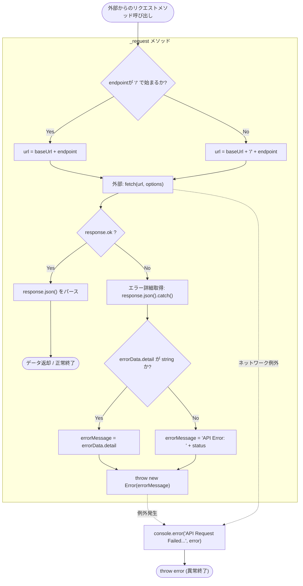
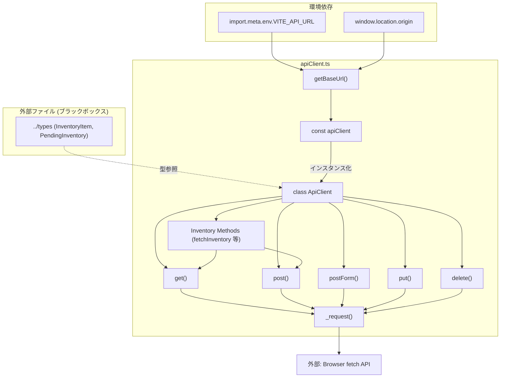

## 1. 解析メタ情報

| 項目 | 内容 |
| --- | --- |
| 対象ファイル | `apiClient.ts` |
| 言語 | TypeScript (React/Vite想定環境) |
| 解析対象 | 提供されたコードのみ |
| 推測・補完 | 一切なし |

## 関連ドキュメント

- [types/index.md](../types/index.md) — `InventoryItem`/`PendingInventory`型定義の提供元。
- [useGameData.md](../hooks/useGameData.md) — 本クライアントを利用してクエスト関連APIを呼び出す上位フック。
- [InventoryList.md](../features/shop/components/InventoryList.md) — インベントリ関連メソッドの利用元。
- [ApprovalList.md](../features/quest/components/ApprovalList.md) — `consumeItem`メソッドの利用元。
- [quest_router.md](../../../MY_HOME_SYSTEM/quest_router.md) — `/inventory/*`等、バックエンド側APIエンドポイントの実装元。

## 2. ファイルの概要

* 本ファイルは、アプリケーションからバックエンドAPIへ通信するためのHTTPクライアント（`ApiClient` クラスおよびそのインスタンス `apiClient`）を定義し、提供する責務を持つ。
* 環境に応じたベースURLの解決、リクエストヘッダの共通設定（`application/json`）、JSONデータの送受信、およびHTTPエラー時の共通エラーハンドリング（例外送出）をカプセル化している。
* `Inventory`（インベントリ）関連の各APIエンドポイントを呼び出すためのラッパーメソッド群を定義している。
* 根拠: [ファイル冒頭コメント] (行番号: 1 / 抜粋: "// family-quest/src/lib/apiClient.ts")

## 3. 外部依存関係

### インポート一覧

| 名称 | 種類 | 用途 | 根拠 |
| --- | --- | --- | --- |
| `InventoryItem` | 型(Type/Interface) | `fetchInventory`の戻り値の型指定として使用 | 根拠: [import宣言] (行番号: 3 / 抜粋: "import { InventoryItem, PendingInventory } from \"../types\";") |
| `PendingInventory` | 型(Type/Interface) | `fetchPendingInventory`の戻り値の型指定として使用 | 根拠: [import宣言] (行番号: 3 / 抜粋: "import { InventoryItem, PendingInventory } from \"../types\";") |

### ブラックボックスとなる外部要素

| 名称 | 理由 | 根拠 |
| --- | --- | --- |
| `../types` | インポート元のファイル実装が提供されていないため、各データ構造のプロパティが不明 | 根拠: [import宣言] (行番号: 3 / 抜粋: "from \"../types\";") |
| `import.meta.env.VITE_API_URL` | Viteの環境変数依存であり、本ファイル単体では設定値が不明 | 根拠: [getBaseUrl内の条件分岐] (行番号: 8 / 抜粋: "if (import.meta.env.VITE_API_URL) {") |
| `window.location.origin` | ブラウザの実行環境に依存しており、静的解析ではURLが特定不可 | 根拠: [getBaseUrlのフォールバック] (行番号: 12 / 抜粋: "return typeof window !== 'undefined' ? window.location.origin : '';") |

## 4. 主要要素の定義（関数 / エンドポイント / コンポーネント）

### `getBaseUrl`

* **役割**: 環境変数 `VITE_API_URL` が定義されている場合はそれを返し、存在しない場合は実行環境のブラウザのオリジン（`window.location.origin`）をベースURLとして返す。ブラウザ環境外(`typeof window === 'undefined'`)の場合は空文字を返す。
* 根拠: [getBaseUrl関数] (行番号: 6〜13 / 抜粋: "const getBaseUrl = (): string => {")

* **引数/リクエスト**: なし
* 根拠: [getBaseUrl関数] (行番号: 6 / 抜粋: "const getBaseUrl = (): string => {")

* **戻り値/レスポンス**: `string` (決定されたベースURL)
* 根拠: [getBaseUrl関数] (行番号: 6〜13 / 抜粋: "const getBaseUrl = (): string => {")

* **副作用**: グローバルオブジェクト (`import.meta.env`, `window`) へのアクセス
* 根拠: [getBaseUrl内の処理] (行番号: 12 / 抜粋: "return typeof window !== 'undefined' ? window.location.origin : '';")

* **エラーハンドリング**: なし
* 根拠: [getBaseUrl関数] (行番号: 6〜13 / 抜粋: "const getBaseUrl = (): string => {")

### `ApiClient` (クラス)

* **役割**: API通信のベースとなるクラス。コンストラクタでベースURLを受け取り、共通のHTTPメソッドラッパー (`get`, `post`, `postForm`, `put`, `delete`) と、インベントリ機能固有のメソッド群を提供する。
* 根拠: [ApiClientクラス定義] (行番号: 32〜118 / 抜粋: "class ApiClient {")

* **引数/リクエスト**: コンストラクタにて `baseUrl: string`
* 根拠: [constructor] (行番号: 35〜37 / 抜粋: "constructor(baseUrl: string) {")

* **戻り値/レスポンス**: クラスインスタンス
* 根拠: [ApiClientクラス定義] (行番号: 32〜118 / 抜粋: "class ApiClient {")

* **副作用**: なし（メソッド呼び出し時に発生）
* 根拠: [ApiClientクラス定義] (行番号: 32〜118 / 抜粋: "class ApiClient {")

* **エラーハンドリング**: なし
* 根拠: [ApiClientクラス定義] (行番号: 32〜118 / 抜粋: "class ApiClient {")

### `ApiClient.get`, `post`, `put`, `delete`

* **役割**: `_request` メソッドを呼び出し、対応するHTTPメソッドによるリクエストを実行する。`post` と `put` はヘッダに `application/json` を設定し、bodyをJSON文字列化する。
* 根拠: [各メソッド定義] (行番号: 39〜41, 43〜51, 63〜71, 73〜75 / 抜粋: "async post<T>(endpoint: string, body: Record<string, unknown>): Promise<T> {")

* **引数/リクエスト**: `endpoint: string`。`post`, `put` のみ `body: Record<string, unknown>` を追加で取る。
* 根拠: [各メソッド定義] (行番号: 43, 63 / 抜粋: "async post<T>(endpoint: string, body: Record<string, unknown>): Promise<T> {")

* **戻り値/レスポンス**: `Promise<T>`
* 根拠: [各メソッド定義] (行番号: 39, 43, 63, 73 / 抜粋: "): Promise<T> {")

* **副作用**: `_request` 呼び出しによるAPI通信
* 根拠: [各メソッド内部] (行番号: 40, 44, 64, 74 / 抜粋: "return this._request<T>(endpoint, { method: 'GET' });")

* **エラーハンドリング**: `_request` 内のエラーハンドリングに依存
* 根拠: [各メソッド内部] (行番号: 40, 44, 64, 74 / 抜粋: "return this._request<T>(endpoint,")

### `ApiClient.postForm`

* **役割**: `multipart/form-data` 形式でのファイルアップロード等に使用するPOSTメソッド。`Content-Type` ヘッダを明示的に指定せず、ブラウザに `boundary` 付きヘッダーを自動生成させる（手動指定すると `boundary` が欠落しリクエストが壊れるため、とコメントで明記されている）。
* 根拠: [`postForm`メソッド定義] (行番号: 53〜61 / 抜粋: "async postForm<T>(endpoint: string, formData: FormData): Promise<T> {")

* **引数/リクエスト**: `endpoint: string`, `formData: FormData`
* 根拠: [`postForm`引数] (行番号: 56 / 抜粋: "async postForm<T>(endpoint: string, formData: FormData): Promise<T> {")

* **戻り値/レスポンス**: `Promise<T>`
* 根拠: [`postForm`戻り値] (行番号: 56 / 抜粋: "async postForm<T>(endpoint: string, formData: FormData): Promise<T> {")

* **副作用**: `_request` 呼び出しによるAPI通信（`FormData`をそのままbodyに渡す）
* 根拠: [`postForm`内部] (行番号: 57〜60 / 抜粋: "return this._request<T>(endpoint, {\n            method: 'POST',\n            body: formData,")

* **エラーハンドリング**: `_request` 内のエラーハンドリングに依存
* 根拠: [`postForm`内部] (行番号: 57〜60 / 抜粋: "return this._request<T>(endpoint, {")

### `ApiClient._request` (プライベートメソッド)

* **役割**: 実際に `fetch` を使用してHTTPリクエストを行う共通処理。エンドポイントの先頭スラッシュを正規化してURLを構築し、通信成功時はJSONをパースして返す。失敗時はエラーレスポンスを解析し例外をスローする。
* 根拠: [_requestメソッド定義] (行番号: 77〜95 / 抜粋: "private async _request<T>(endpoint: string, options: RequestOptions): Promise<T> {")

* **引数/リクエスト**: `endpoint: string`, `options: RequestOptions`
* 根拠: [_requestメソッド定義] (行番号: 77 / 抜粋: "private async _request<T>(endpoint: string, options: RequestOptions): Promise<T> {")

* **戻り値/レスポンス**: `Promise<T>` (パースされたJSONレスポンス)
* 根拠: [_requestメソッド定義] (行番号: 90 / 抜粋: "return await response.json() as T;")

* **副作用**: `fetch` APIによる外部ネットワーク通信。エラー時の `console.error` 出力。
* 根拠: [fetch呼び出しおよびcatch句] (行番号: 82, 92 / 抜粋: "const response = await fetch(url, options);")

* **エラーハンドリング**:
* HTTPステータスが `!ok` の場合、レスポンスのJSONパースを試みる（パース失敗時は空オブジェクト `{}` にフォールバック）。
* `errorData.detail` が文字列ならそれを、そうでなければステータスコードを用いた汎用メッセージを使用して `Error` をスロー。
* 通信例外やスローされた例外を `catch` で捕捉し、コンソールにエラーログを出力した上で再スローする。
* 根拠: [try-catchおよびif (!response.ok)ブロック] (行番号: 81〜94 / 抜粋: "if (!response.ok) {")

### インベントリ関連メソッド (`fetchInventory`, `useItem`, `cancelItemUsage`, `consumeItem`, `fetchPendingInventory`)

* **役割**: `ApiClient` クラスに組み込まれた、各インベントリAPIの呼び出し専用メソッド群。
* 根拠: [Inventory Methods セクション] (行番号: 97〜117 / 抜粋: "// --- Inventory Methods ---")

* **引数/リクエスト**: メソッドに応じたパラメータ (`userId: string`, `inventoryId: number`, `approverId: string`)
* 根拠: [各メソッドの引数定義] (行番号: 99, 103, 107, 111, 115 / 抜粋: "async useItem(userId: string, inventoryId: number): Promise<ApiResponse> {")

* **戻り値/レスポンス**: `Promise<InventoryItem[]>`, `Promise<ApiResponse>`, `Promise<PendingInventory[]>` のいずれか
* 根拠: [各メソッドの戻り値型定義] (行番号: 99, 103, 107, 111, 115 / 抜粋: "async fetchInventory(userId: string): Promise<InventoryItem[]> {")

* **副作用**: `get`/`post`（ひいては`_request`）を介したネットワーク通信
* 根拠: [各メソッドの実装] (行番号: 100, 104, 108, 112, 116 / 抜粋: "return this.post<ApiResponse>('/api/quest/inventory/use', { user_id: userId, inventory_id: inventoryId });")

* **エラーハンドリング**: `_request` の実装に依存
* 根拠: [各メソッドの実装] (行番号: 100, 104, 108, 112, 116 / 抜粋: "return this.get<InventoryItem[]>(`/api/quest/inventory/${userId}`);")

### `apiClient` (インスタンス定数)

* **役割**: `BASE_URL` を用いて初期化された `ApiClient` のシングルトンインスタンス。外部モジュールからのAPI呼び出しに使用される。
* 根拠: [インスタンスのエクスポート] (行番号: 120 / 抜粋: "export const apiClient = new ApiClient(BASE_URL);")

## 5. 処理フロー図

```mermaid
flowchart TD
    Start([外部からのリクエストメソッド呼び出し]) --> CheckCleanEndpoint

    subgraph "_request メソッド"
    CheckCleanEndpoint{endpointが '/' で始まるか?}
    CheckCleanEndpoint -- Yes --> FormatURL1["url = baseUrl + endpoint"]
    CheckCleanEndpoint -- No --> FormatURL2["url = baseUrl + '/' + endpoint"]

    FormatURL1 --> FetchCall["外部: fetch(url, options)"]
    FormatURL2 --> FetchCall

    FetchCall --> ResponseCheck{response.ok ?}

    ResponseCheck -- Yes --> ParseJSONSuccess["response.json() をパース"]
    ParseJSONSuccess --> ReturnData([データ返却 / 正常終了])

    ResponseCheck -- No --> ParseJSONError["エラー詳細取得: response.json().catch()"]
    ParseJSONError --> CheckDetail{errorData.detail が string か?}

    CheckDetail -- Yes --> SetErrorMsg1["errorMessage = errorData.detail"]
    CheckDetail -- No --> SetErrorMsg2["errorMessage = 'API Error: ' + status"]

    SetErrorMsg1 --> ThrowAPIError["throw new Error(errorMessage)"]
    SetErrorMsg2 --> ThrowAPIError
    end

    ThrowAPIError -. "例外発生" .-> CatchBlock
    FetchCall -. "ネットワーク例外" .-> CatchBlock

    CatchBlock["console.error('API Request Failed...', error)"] --> ThrowFinalError(["throw error (異常終了)"])

```

## 6. 依存関係図

```mermaid
graph TD
    subgraph "外部ファイル (ブラックボックス)"
        Types["../types (InventoryItem, PendingInventory)"]
    end

    subgraph "環境依存"
        Env["import.meta.env.VITE_API_URL"]
        Window["window.location.origin"]
    end

    subgraph "apiClient.ts"
        GetBaseUrl["getBaseUrl()"]

        ApiClientClass["class ApiClient"]
        Request["_request()"]
        Get["get()"]
        Post["post()"]
        PostForm["postForm()"]
        Put["put()"]
        Delete["delete()"]
        InventoryMethods["Inventory Methods (fetchInventory 等)"]

        ApiClientInstance["const apiClient"]
    end

    FetchAPI["外部: Browser fetch API"]

    Types -. "型参照" .-> ApiClientClass

    Env --> GetBaseUrl
    Window --> GetBaseUrl
    GetBaseUrl --> ApiClientInstance

    ApiClientClass --> Get & Post & PostForm & Put & Delete & InventoryMethods
    Get & Post & PostForm & Put & Delete --> Request
    InventoryMethods --> Get & Post

    Request --> FetchAPI

    ApiClientInstance -- "インスタンス化" --> ApiClientClass

```

## 7. 次のステップ（リバースエンジニアリングの提案）

| 優先度 | ファイル名(推測可) | 理由 | 根拠 |
| --- | --- | --- | --- |
| 高 | `../types.ts` (または `../types/index.ts` 等) | `ApiResponse` 以外の戻り値型 (`InventoryItem`, `PendingInventory`) の正確な構造を把握し、API利用側で利用できるプロパティを確定するため。 | 根拠: [import宣言] (行番号: 3 / 抜粋: "import { InventoryItem, PendingInventory } from \"../types\";") |
| 中 | `.env` ファイル | `VITE_API_URL` に設定される具体的なバックエンドのホスト情報を特定し、ルーティング全容を把握するため。 | 根拠: [getBaseUrl関数] (行番号: 8 / 抜粋: "if (import.meta.env.VITE_API_URL) {") |
| 中 | バックエンドルーティングファイル (例: FastAPIの `main.py` やルーター設定) | `/api/quest/inventory/*` などのエンドポイントが実際にどのようなビジネスロジックを実行しているか把握するため。 | 根拠: [各API呼び出し先エンドポイント] (行番号: 104 / 抜粋: "'/api/quest/inventory/use'") |

## 8. 保守上の注意点

* **ベースURLとエンドポイントの結合**: `_request` 内で `cleanEndpoint` として先頭のスラッシュを付与・補完しているが、`this.baseUrl` の末尾のスラッシュの有無については検査・トリム処理がない。環境変数やオリジンの末尾にスラッシュが含まれていた場合、URLが `//` となる可能性がある。
* **SSR環境の考慮**: `typeof window !== 'undefined'` の判定を行っているが、`undefined` (例: SSR/Node環境) かつ `.env` が未定義の場合、ベースURLが空文字 `''` となる。これによりリクエストが相対パスとして処理されるか、エラーになる。
* **エラー時のJSONパース**: `response.json().catch(() => ({}))` と記載されており、APIが `text/html` 等の非JSONエラーレスポンスを返した場合、パースエラーは握りつぶされて常に空オブジェクトとして扱われる。

## 9. 不明事項一覧

| 項目 | 理由 | 必要なファイル |
| --- | --- | --- |
| APIレスポンスの具体的なデータ構造 | 各データモデルの実装が別ファイルに依存しているため。 | `../types` ファイル |
| バックエンド側の具体的な仕様・制約 | リクエストボディの必須パラメータ、バリデーションルールがクライアント側のコードのみでは特定できないため。 | バックエンドのAPI実装ファイル |
| APIのベースURL | 環境変数または実行時環境に依存して動的に決定されるため。（リポジトリ内を検索したが`.env`ファイルは存在せず、ルート`.gitignore`13行目の`.env`規則により追跡対象外と判明。実行時のドメイン情報も本リポジトリのソースからは確認できないため解消不可） | `.env` または実行環境のドメイン情報 |

## 相互参照による補足情報

| 元の不明事項 | 判明した内容 | 参照元ドキュメント |
| --- | --- | --- |
| APIレスポンスの具体的なデータ構造 | `types/index.md`の解析によれば、`InventoryItem`と`PendingInventory`はいずれも`@/types`内でインターフェースとして定義されているとされているが、`types/index.md`側でも各プロパティの網羅的な列挙は行われていない。 | `../types/index.md` |
| バックエンド側の具体的な仕様・制約 | `quest_router.md`の解析によれば、インベントリ関連には`get_inventory`(`GET /inventory/{user_id}`)、`use_item`(`POST /inventory/use`)、`consume_item`(`POST /inventory/consume`)、`cancel_item_usage`(`POST /inventory/cancel`)、`get_admin_pending_inventory`(`GET /inventory/admin/pending`)という対応するエンドポイントが存在するとされている。ただし本ファイル側の抜粋（`/api/quest/inventory/use`等）と`quest_router.md`側のパス表記（`/inventory/use`等、プレフィックスなし）が完全に一致するかは、ルーター側のマウント方法（プレフィックス設定）を確認しないと断定できない。 | `../../../MY_HOME_SYSTEM/quest_router.md` |

## 10. 自己検証結果

* [x] 完了: 推測・外部ファイルの仕様を一切含んでいない
* [x] 完了: 全関数・全クラス・全コンポーネントを列挙した
* [x] 完了: 全てのインポート要素を列挙した
* [x] 完了: すべての仕様説明に「根拠（行番号・抜粋）」を明記した
* [x] 完了: 根拠漏れが0件である
* [x] 完了: Mermaid構文にエラーの原因となる記号（エスケープ漏れ）がない
* [x] 完了: 不明事項を漏れなく列挙した
