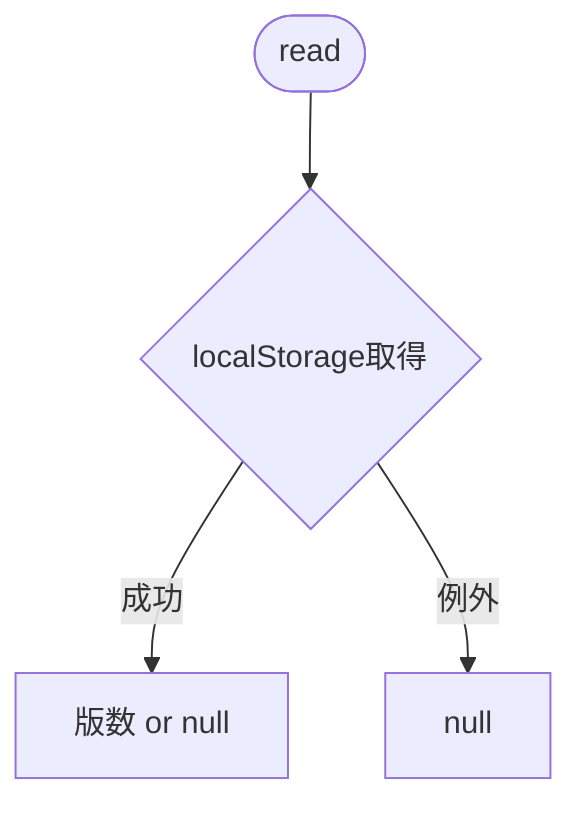
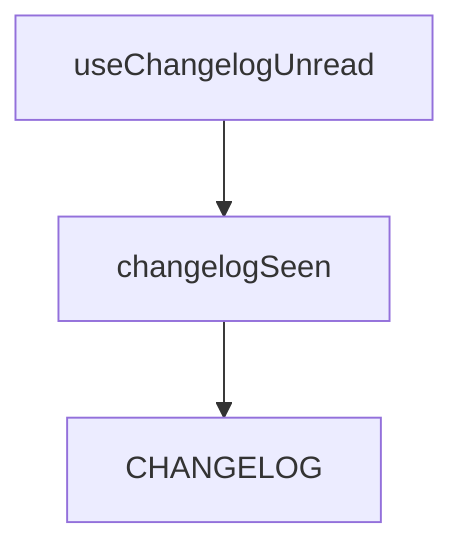

## 1. 解析メタ情報

| 項目 | 内容 |
| --- | --- |
| 対象ファイル | changelogSeen.ts |
| 言語 | TypeScript |
| 解析対象 | 提供されたコードのみ |
| 推測・補完 | 一切なし |

## 関連ドキュメント

* [changelog.md](changelog.md) - `CHANGELOG`（先頭が最新）
* [../hooks/useChangelogUnread.md](../hooks/useChangelogUnread.md) - 利用側

## 2. ファイルの概要

* 「どのアップデートまで見たか」を端末ごとの localStorage で覚えるための関数群。最新エントリ `LATEST_CHANGELOG_ENTRY`、読み出し `readSeenChangelogVersion`、書き込み `writeSeenChangelogVersion`。
* 根拠: `export const LATEST_CHANGELOG_ENTRY = CHANGELOG[0];` (行番号: 8 / 抜粋: "export const LATEST_CHANGELOG_ENTRY = CHANGELOG[0];")
* localStorage が使えない環境でも画面を壊さないよう、読み書きは try/catch で囲む。
* 根拠: `export function readSeenChangelogVersion(): string | null {` (行番号: 12 / 抜粋: "export function readSeenChangelogVersion(): string | null {")

## 3. 外部依存関係

### インポート一覧

| 名称 | 種類 | 用途 | 根拠 |
| --- | --- | --- | --- |
| `CHANGELOG` | 定数 | 更新履歴 | 根拠: `import { CHANGELOG } from './changelog';` (行番号: 1 / 抜粋: "import { CHANGELOG } from './changelog';") |

### ブラックボックスとなる外部要素

| 名称 | 理由 | 根拠 |
| --- | --- | --- |
| 各importの実装 | 本ファイル外のため | 根拠: import文 (行番号: 1 / 抜粋: 判断不可) |

## 4. 主要要素の定義（関数 / エンドポイント / コンポーネント）

### LATEST_CHANGELOG_ENTRY

* **役割**: `CHANGELOG` の先頭（最新）エントリ。
* 根拠: `export const LATEST_CHANGELOG_ENTRY = CHANGELOG[0];` (行番号: 8 / 抜粋: "export const LATEST_CHANGELOG_ENTRY = CHANGELOG[0];")
* **引数/リクエスト**: なし
* **戻り値/レスポンス**: `ChangelogEntry`（`CHANGELOG` が空なら undefined）
* **副作用**: なし
* **エラーハンドリング**: なし

### readSeenChangelogVersion

* **役割**: この端末で最後に見た版数を返す。
* 根拠: `export function readSeenChangelogVersion(): string | null {` (行番号: 12 / 抜粋: "export function readSeenChangelogVersion(): string | null {")
* **引数/リクエスト**: なし
* **戻り値/レスポンス**: `string | null`（未保存・例外時は null）
* **副作用**: なし
* **エラーハンドリング**: 例外は握りつぶして null

### writeSeenChangelogVersion

* **役割**: 見た版数を保存する。
* 根拠: `export function writeSeenChangelogVersion(version: string): void {` (行番号: 20 / 抜粋: "export function writeSeenChangelogVersion(version: string): void {")
* **引数/リクエスト**: `version: string`
* **戻り値/レスポンス**: なし
* **副作用**: localStorage への書き込み
* **エラーハンドリング**: 例外は握りつぶす（保存できなくても致命的でない）

## 5. 処理フロー図

## 6. 依存関係図

## 7. 次のステップ（リバースエンジニアリングの提案）

| 優先度 | ファイル名(推測可) | 理由 |
| --- | --- | --- |
| 低 | `family-quest/src/hooks/useChangelogUnread.ts` | 既読判定の利用側 |

## 8. 保守上の注意点

* 保存キーは `familyQuest.changelog.seenVersion`。端末（ブラウザ）ごとに独立し、サーバーには保存されない。

## 9. 不明事項一覧

| 項目 | 理由 | 必要なファイル |
| --- | --- | --- |
| なし | － | － |

## 10. 自己検証結果

* [x] 推測・外部ファイルの仕様を一切含んでいない
* [x] 全関数・全クラス・全コンポーネントを列挙した
* [x] 全てのインポート要素を列挙した
* [x] すべての仕様説明に「根拠（行番号・抜粋）」を明記した
* [x] 根拠漏れが0件である
* [x] Mermaid構文にエラーの原因となる記号（エスケープ漏れ）がない
* [x] 不明事項を漏れなく列挙した
