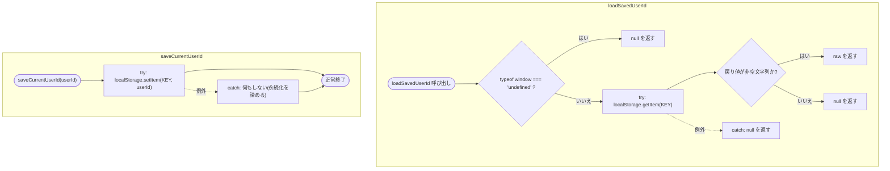
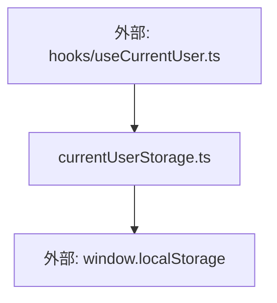

## 1. 解析メタ情報

| 項目 | 内容 |
| --- | --- |
| 対象ファイル | currentUserStorage.ts (family-quest/src/lib/currentUserStorage.ts) |
| 言語 | TypeScript |
| 解析対象 | 提供されたコードのみ |
| 推測・補完 | 一切なし |
| 解析基準コミット | `f06eef5` |

## 関連ドキュメント

* [../hooks/useCurrentUser.md](../hooks/useCurrentUser.md) - 唯一の呼び出し元。`loadSavedUserId`/`saveCurrentUserId`の両方をimportして使う
* [../../App.md](../../App.md) - `useCurrentUser`経由の間接的な利用元（選択中ユーザーの永続化）

## 2. ファイルの概要

* 選択中ユーザーを`localStorage`（キー`familyQuest.currentUserId.v1`）に永続化するための読み書きヘルパー2関数を提供するモジュール。**（Issue #393）** 以前は`currentUserIdx`がメモリのみで保持されており、PWA起動のたびに`0`（パパ）にリセットされ、子どものスマホでは毎回切替が必要だった。**インデックスではなく`user_id`を保存する**ことで、`quest_data.USERS`の宣言順が変わったりメンバーが減った場合でも呼び出し元（`useCurrentUser.ts`）の`users.findIndex`で正しい人を再選択でき、見つからなければ自然に`0`番目へフォールバックする（以前の「保存したindexが範囲外になり`INITIAL_USERS`の`guest`カードが出て誰も選択状態にならない」不具合の根治にもなる）。**（Issue #552で`App.tsx`から抽出）** 以前は`App.tsx`内にモジュールレベルの定数・関数として定義されていたものが、ロジックを変更せずそのまま本ファイルへ移動された。
* 根拠: ファイル冒頭のコメント (行番号: 1〜5 / 抜粋: "// #393: 選択中ユーザーをlocalStorageに永続化する。インデックスではなくuser_idを保存する\n// ことで、メンバーの並び順が変わったりメンバーが減っても、対応する人を正しく再選択でき\n// (見つからなければ0番目にフォールバックする)、以前のように保存していたindexが範囲外に\n// なって「接続エラー(guest)」カードが出る事故が起きない。\nconst CURRENT_USER_STORAGE_KEY = 'familyQuest.currentUserId.v1';")

## 3. 外部依存関係

### インポート一覧

なし（`window.localStorage`のみに依存する自己完結したモジュール）。

### ブラックボックスとなる外部要素

| 名称 | 理由 | 根拠 |
| --- | --- | --- |
| `window.localStorage` | ブラウザ組み込みAPIであり、本ファイルからはプライベートモード等での利用可否や容量制限の詳細は不明 | 根拠: (行番号: 10, 20 / 抜粋: "const raw = window.localStorage.getItem(CURRENT_USER_STORAGE_KEY);", "window.localStorage.setItem(CURRENT_USER_STORAGE_KEY, userId);") |

## 4. 主要要素の定義（関数 / エンドポイント / コンポーネント）

### `CURRENT_USER_STORAGE_KEY` (モジュールレベル定数、非export)

* **役割**: `localStorage`に選択中ユーザーの`user_id`を保存する際のキー名。`.v1`サフィックスによりバージョニングされている。
* 根拠: (行番号: 5 / 抜粋: "const CURRENT_USER_STORAGE_KEY = 'familyQuest.currentUserId.v1';")

### `loadSavedUserId` (export関数)

* **役割**: `localStorage`から保存済みの`user_id`を読み出す。`window`が未定義の環境（SSR等）では`null`を返して早期リターンする。読み出しは`try/catch`で保護され、例外発生時は`null`を返す。戻り値が非空の`string`であることを検証してから返す（形状検証。空文字列は`null`扱いにする）。
* 根拠: (行番号: 7〜16 / 抜粋: "export function loadSavedUserId(): string | null {\n    if (typeof window === 'undefined') return null;\n    try {\n        const raw = window.localStorage.getItem(CURRENT_USER_STORAGE_KEY);\n        // 形状検証: 空文字列や(将来の形式変更等による)非文字列相当の値は無視する\n        return typeof raw === 'string' && raw.length > 0 ? raw : null;\n    } catch {\n        return null;\n    }\n}")

* **引数/リクエスト**: なし
* **戻り値/レスポンス**: `string | null`
* **副作用**: `localStorage.getItem`の呼び出し（読み取りのみ）
* **エラーハンドリング**: `window`未定義時は早期`return null`。`localStorage`アクセスで例外が発生した場合も`catch`で捕捉し`null`を返す。

### `saveCurrentUserId` (export関数)

* **役割**: 指定された`userId`を`localStorage`（`CURRENT_USER_STORAGE_KEY`）へ書き込む。書き込みは`try/catch`で保護され、プライベートモード等で失敗しても永続化を諦めるだけで処理は継続する（呼び出し元へ例外を伝播しない）。
* 根拠: (行番号: 18〜24 / 抜粋: "export function saveCurrentUserId(userId: string): void {\n    try {\n        window.localStorage.setItem(CURRENT_USER_STORAGE_KEY, userId);\n    } catch {\n        // localStorageが使えない環境(プライベートモード等)では永続化を諦める\n    }\n}")

* **引数/リクエスト**: `userId: string`
* **戻り値/レスポンス**: なし (`void`)
* **副作用**: `localStorage.setItem`の呼び出し（書き込み）
* **エラーハンドリング**: `localStorage.setItem`が例外を投げた場合、`catch`ブロックで捕捉し何もせず終了する（呼び出し元への通知は無い）。

## 5. 処理フロー図

## 6. 依存関係図

## 7. 次のステップ（リバースエンジニアリングの提案）

| 優先度 | ファイル名(推測可) | 理由 | 根拠 |
| --- | --- | --- | --- |
| 高 | `../hooks/useCurrentUser.ts` | `loadSavedUserId`/`saveCurrentUserId`の実際の呼び出しタイミング・`currentUserIdx`との対応関係を確認するため | 根拠: 関連ドキュメント参照 |

## 8. 保守上の注意点

* **保存形式を変える場合はキーのサフィックスを上げる**: `.v1`というバージョンサフィックスが付いているため、将来保存する値の形式（例: 単一`user_id`から複数フィールドを持つJSONへ変更する等）を変える場合は、キー名を`.v2`等に変更し、旧キーとの互換性を`loadSavedUserId`側で明示的に扱う設計にするのが自然である（本ファイル単体では旧バージョンからの移行処理は行っていない）。
* **`saveCurrentUserId`の失敗は静かに握りつぶされる**: 呼び出し元（`useCurrentUser.ts`）に失敗を知らせる手段が無いため、`localStorage`が使えない環境では毎回`loadSavedUserId`が`null`を返し続け、ユーザー選択の永続化が機能しないまま気づかれない可能性がある。

## 9. 不明事項一覧

なし（本ファイル単体で完結し、ブラウザ組み込みAPIのみに依存する）。

## 相互参照による補足情報

なし。

## 10. 自己検証結果

* [x] 推測・外部ファイルの仕様を一切含んでいない
* [x] 全関数・全クラス・全コンポーネントを列挙した
* [x] 全てのインポート要素を列挙した
* [x] すべての仕様説明に「根拠（行番号・抜粋）」を明記した
* [x] 根拠漏れが0件である
* [x] Mermaid構文にエラーの原因となる記号（エスケープ漏れ）がない
* [x] 不明事項を漏れなく列挙した
