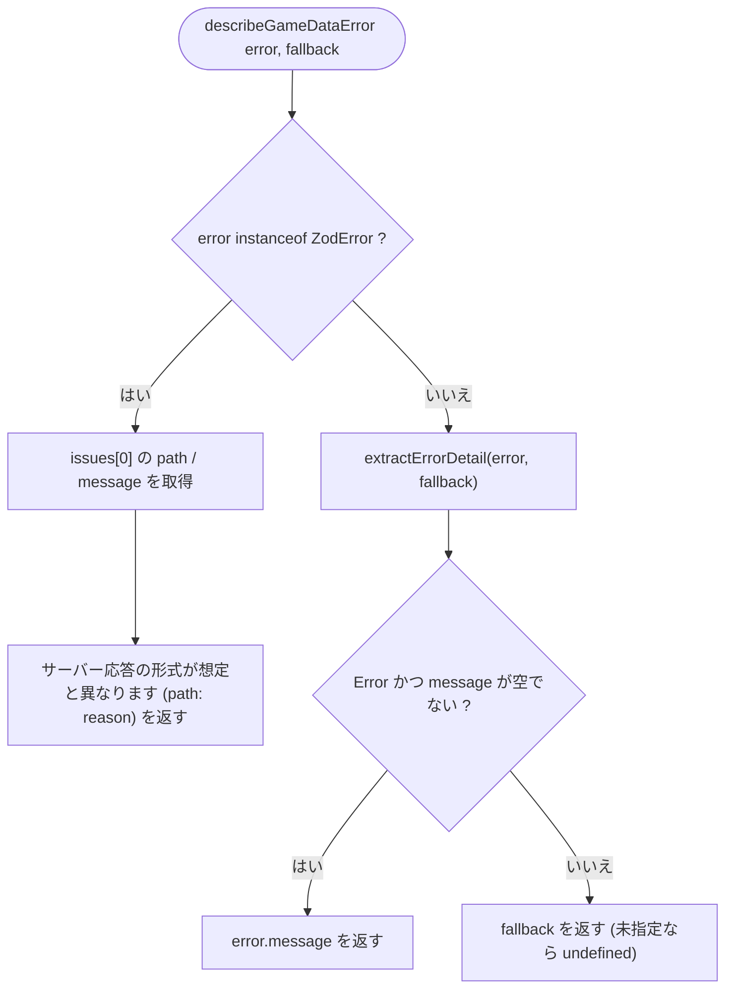
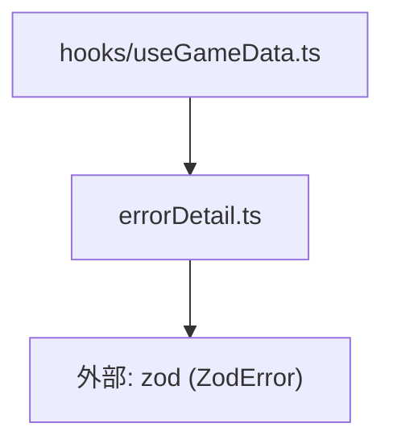

## 1. 解析メタ情報

| 項目 | 内容 |
| --- | --- |
| 対象ファイル | errorDetail.ts (family-quest/src/lib/errorDetail.ts) |
| 言語 | TypeScript |
| 解析対象 | 提供されたコードのみ |
| 推測・補完 | 一切なし |
| 解析基準コミット | `65fce15` |

## 関連ドキュメント

* [./apiClient.md](./apiClient.md) - ここで扱う`Error.message`（バックエンドの`{"detail": "..."}`）を生成するHTTPクライアント
* [../hooks/useGameData.md](../hooks/useGameData.md) - `extractErrorDetail`（各ラッパー関数の`catch`）と`describeGameDataError`（`gameDataError`の生成）の利用元
* [./gameDataSchema.md](./gameDataSchema.md) - `describeGameDataError`が要約対象とする`ZodError`の発生源

## 2. ファイルの概要

* `apiClient.ts`がスローする`Error`の`message`（バックエンドが返す`{"detail": "..."}`の内容、または`"API Error: <status>"`等）から、ユーザーに表示する文字列を取り出す処理を集約したモジュール。以前は`useGameData.ts`/`InventoryList.tsx`/`CameraDashboard.tsx`にほぼ同じ関数が3重複していた（Issue #412）。あわせて、`/api/quest/data`の取得失敗をバナー表示するため（Issue #390）、Zodの検証エラー（`message`がJSON配列の生ダンプで読めない）を「最初の不一致箇所（パス + 理由）」に要約する`describeGameDataError`を提供する。
* 根拠: ファイル冒頭コメント (行番号: 1〜9 / 抜粋: "// apiClient.ts がスローする Error の message には、バックエンドが返す\n// {\"detail\": \"...\"} の内容(または \"API Error: <status>\" / 通信エラーの文言)が\n// 入っている。")

## 3. 外部依存関係

### インポート一覧

| 名称 | 種類 | 用途 | 根拠 |
| --- | --- | --- | --- |
| `ZodError` | 外部ライブラリ(`zod`) | `describeGameDataError`でスキーマ検証エラーかどうかを`instanceof`判定するため | 根拠: (行番号: 10 / 抜粋: "import { ZodError } from 'zod';") |

### ブラックボックスとなる外部要素

| 名称 | 理由 | 根拠 |
| --- | --- | --- |
| `ZodError.issues` | `zod`の内部構造。`path`/`message`の生成規則は`zod`側の実装に依存する | 根拠: (行番号: 28〜30 / 抜粋: "const first = error.issues[0];\n        const where = first?.path.length ? first.path.join('.') : '(root)';") |

## 4. 主要要素の定義（関数 / エンドポイント / コンポーネント）

### `extractErrorDetail` (export関数、オーバーロード)

* **役割**: `error`が`Error`インスタンスで`message`が空でなければ`message`を、それ以外は`fallback`を返す。`fallback`を省略した呼び出し（`useGameData.ts`の各`catch`節）は`string | undefined`を返し、呼び出し側（`App.tsx`の`resolveErrorText`）が`reason`別の既定文言にフォールバックする。`fallback`付きの呼び出しは常に`string`を返す。
* 根拠: (行番号: 12〜20 / 抜粋: "export function extractErrorDetail(error: unknown): string | undefined;\nexport function extractErrorDetail(error: unknown, fallback: string): string;\nexport function extractErrorDetail(error: unknown, fallback?: string): string | undefined {\n    if (error instanceof Error && error.message) return error.message;\n    return fallback;\n}")
* **引数/リクエスト**: `error: unknown`, `fallback?: string`
* **戻り値/レスポンス**: `string | undefined`（`fallback`指定時は`string`）
* **副作用**: なし
* **エラーハンドリング**: なし（`unknown`を安全に扱うための関数そのもの）

### `describeGameDataError` (export関数)

* **役割**: `error`が`ZodError`なら`issues[0]`の`path`（`.`区切り、空なら`(root)`）と`message`から「サーバー応答の形式が想定と異なります (path: reason)」を組み立てて返す。それ以外は`extractErrorDetail(error, fallback)`に委ねる。
* 根拠: (行番号: 22〜34 / 抜粋: "export function describeGameDataError(error: unknown, fallback: string): string {\n    if (error instanceof ZodError) {\n        const first = error.issues[0];\n        const where = first?.path.length ? first.path.join('.') : '(root)';\n        const why = first?.message ?? 'unknown';\n        return `サーバー応答の形式が想定と異なります (${where}: ${why})`;\n    }\n    return extractErrorDetail(error, fallback);\n}")
* **引数/リクエスト**: `error: unknown`, `fallback: string`
* **戻り値/レスポンス**: `string`
* **副作用**: なし
* **エラーハンドリング**: なし

## 5. 処理フロー図

## 6. 依存関係図

## 7. 次のステップ（リバースエンジニアリングの提案）

| 優先度 | ファイル名(推測可) | 理由 | 根拠 |
| --- | --- | --- | --- |
| 中 | `./apiClient.ts` | ここで取り出す`Error.message`がどの条件でどの文言になるか（`detail`文字列 / `API Error: <status>` / 通信エラー）を把握するため | 根拠: 冒頭コメント (行番号: 3〜5) |

## 8. 保守上の注意点

* **`fallback`省略時は`undefined`を返す**: `extractErrorDetail(e)`の戻り値をそのまま画面に出すと`undefined`が表示されうる。表示直前に既定文言へフォールバックする（`App.tsx`の`resolveErrorText`）か、`fallback`付きで呼ぶこと。
* 根拠: (行番号: 12〜14, 17〜20)
* **Zodエラーは最初の1件のみ要約する**: 複数の不一致がある場合、2件目以降はバナーには出ない（`console`には`useQuery`の`error`として全件残る）。
* 根拠: (行番号: 28)

## 9. 不明事項一覧

| 項目 | 理由 | 必要なファイル |
| --- | --- | --- |
| `Error.message`に入りうる文言の全パターン | `apiClient.ts`の実装に依存する | `./apiClient.ts` |

## 相互参照による補足情報

| 元の不明事項 | 判明した内容 | 参照元ドキュメント |
| --- | --- | --- |
| `Error.message`に入りうる文言の全パターン | `family-quest/src/lib/apiClient.ts`の`_request`を直接確認した。非2xx応答ではレスポンスJSONの`detail`が文字列ならそれを、そうでなければ`"API Error: <status>"`を`Error`の`message`としてスローする。 | 直接ソース確認: `family-quest/src/lib/apiClient.ts` |

## 10. 自己検証結果

* [x] 推測・外部ファイルの仕様を一切含んでいない
* [x] 全関数・全クラス・全コンポーネントを列挙した
* [x] 全てのインポート要素を列挙した
* [x] すべての仕様説明に「根拠（行番号・抜粋）」を明記した
* [x] 根拠漏れが0件である
* [x] Mermaid構文にエラーの原因となる記号（エスケープ漏れ）がない
* [x] 不明事項を漏れなく列挙した
