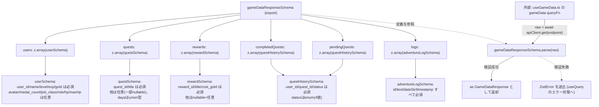

## 1. 解析メタ情報

| 項目 | 内容 |
| --- | --- |
| 対象ファイル | `gameDataSchema.ts` (family-quest/src/lib/gameDataSchema.ts) |
| 言語 | TypeScript |
| 解析対象 | 提供されたコードのみ |
| 推測・補完 | 一切なし |
| 解析基準コミット | `65fce15` |

## 関連ドキュメント

* [../hooks/useGameData.md](../hooks/useGameData.md) - `gameDataResponseSchema`の唯一の利用元。`gameData`クエリ(`GET /api/quest/data`)の取得境界で`.parse()`を呼び出す。
* [../types/index.md](../types/index.md) - `GameDataResponse`関連の型（`User`/`Quest`/`Reward`/`QuestHistory`）の定義元。本ファイルのZodスキーマはこれらの型が実際にAPIから受け取る値の形を明示する。
* [../../../../MY_HOME_SYSTEM/quest_service.md](../../../../MY_HOME_SYSTEM/quest_service.md) - 本ファイルが検証対象とする`GET /api/quest/data`レスポンスの生成元(`GameSystem.get_all_view_data`)。

## 2. ファイルの概要

`GameSystem.get_all_view_data`（`/api/quest/data`）のレスポンスに限り、`useGameData.ts`の取得境界でZodによるランタイム検証を行うためのスキーマ定義ファイル。バックエンド(MY_HOME_SYSTEM)のAPIレスポンス形状とフロントエンドの型定義(`src/types/index.ts`)が乖離していても、OpenAPI→TS生成パイプラインが存在しないためビルド時には検知できず、フィールド名二重化のような不整合の温床になっていたこと（Issue #291）を受けて追加された。バックエンドが実際に返しているフィールド名と型をここに明示し、ここに定義されていないフィールドをコンポーネント側で参照した場合、TypeScript上は型チェックを通過しても実行時には常に`undefined`になる「幽霊フィールド」であることが`.parse()`失敗によってすぐ分かるようにするのが目的。`users`/`quests`/`rewards`/`completedQuests`/`pendingQuests`/`logs`の6つの配列フィールドからなる`gameDataResponseSchema`を唯一のエクスポートとして提供する。
* 根拠: ファイル冒頭コメント (行番号: 1〜14 / 抜粋: "// #291: バックエンド(MY_HOME_SYSTEM)のAPIレスポンス形状とフロントエンドの型定義\n// (src/types/index.ts)が乖離していても、OpenAPI→TS生成パイプラインが無いため\n// ビルド時には検知できなかった(フィールド名二重化のような不整合の温床になっていた)。\n// GameSystem.get_all_view_data (/api/quest/data) のレスポンスに限り、useGameData.ts\n// の取得境界でZodによるランタイム検証を行い、バックエンドが実際に返している\n// フィールド名と型をここに明示する。ここに無いフィールドをコンポーネント側で\n// 参照しても、たとえTypeScript上は通っても実行時には常にundefinedになる\n// (\"幽霊フィールド\")ことがすぐ分かるようにするのが目的。")
* 根拠: `.strict()`を使わない方針のコメント (行番号: 12〜14 / 抜粋: "// 既知でないフィールドは(zodのデフォルト挙動により)無視して構わない。将来\n// バックエンドが新しいフィールドを追加した場合にparseが失敗しないよう、\n// 意図的に .strict() は使わない。")
* 根拠: `export const gameDataResponseSchema` (行番号: 80〜87 / 抜粋: "export const gameDataResponseSchema = z.object({\n    users: z.array(userSchema),\n    quests: z.array(questSchema),\n    rewards: z.array(rewardSchema),\n    completedQuests: z.array(questHistorySchema),\n    pendingQuests: z.array(questHistorySchema),\n    logs: z.array(adventureLogSchema),\n});")

## 3. 外部依存関係

### インポート一覧

| 名称 | 種類 | 用途 | 根拠 |
| --- | --- | --- | --- |
| `z` | 外部ライブラリ(`zod`) | スキーマオブジェクト・各フィールドのバリデータ定義に使用 | 根拠: [インポート宣言] (行番号: 15 / 抜粋: "import { z } from 'zod';") |

### ブラックボックスとなる外部要素

| 名称 | 理由 | 根拠 |
| --- | --- | --- |
| `zod`ライブラリ自体の`.parse()`/`.optional()`/`.nullable()`/`.union()`等の挙動 | `zod`パッケージの実装は本ファイル外であり、バリデーション失敗時に送出される例外の詳細な構造（`ZodError`のメッセージ形式等）は本ファイルからは不明。 | 根拠: [インポート宣言] (行番号: 15 / 抜粋: "import { z } from 'zod';") |

## 4. 主要要素の定義（関数 / エンドポイント / コンポーネント）

### `userSchema` (モジュールレベル定数、非export)

* **役割**: `gameData.users`配列の1要素（`quest_users`テーブルの行 + `get_all_view_data`が付与する`nextLevelExp`/`maxHp`/`hp`）を検証するZodスキーマ。`user_id`/`name`/`level`/`exp`/`gold`は必須、`hp`/`maxHp`は任意。**（Issue #390で修正）** `avatar`/`medal_count`/`job_class`/`role`は`quest_users`のNULL可カラム（`migrations/0000_baseline_schema.sql`、`0001_add_quest_users_role.sql`）であるため`.nullable().optional()`とし、`null`を受理する。以前は`.optional()`のみで`null`を拒否していたため、`quest_data.py`に`role`無しでメンバーを追加すると`"role": null`で届いてZod検証が失敗し、全端末が「サーバーに繋がりません」のフォールバック表示になっていた。
* 根拠: [定数定義] (行番号: 17〜33 / 抜粋: "// #390: quest_users の avatar / job_class / role は NULL 可のカラム\n// (migrations/0000_baseline_schema.sql, 0001_add_quest_users_role.sql)。", "const userSchema = z.object({\n    user_id: z.string(),\n    name: z.string(),\n    level: z.number(),\n    exp: z.number(),\n    avatar: z.string().nullable().optional(),\n    medal_count: z.number().nullable().optional(),\n    job_class: z.string().nullable().optional(),\n    gold: z.number(),\n    role: z.string().nullable().optional(),\n    hp: z.number().optional(),\n    maxHp: z.number().optional(),\n});")

* **引数/リクエスト**: 該当なし（スキーマ定義であり関数ではない）
* **戻り値/レスポンス**: 該当なし
* **副作用**: なし
* **エラーハンドリング**: 該当なし（`gameDataResponseSchema.parse()`実行時に、この定義に反する`users`要素があれば`ZodError`が送出される）

### `questSchema` (モジュールレベル定数、非export)

* **役割**: `gameData.quests`配列の1要素（`quest_master`テーブルの行 + `filter_active_quests`/`get_all_view_data`が付与する`bonus_gold`/`bonus_exp`等）を検証するZodスキーマ。`quest_id`/`title`は必須、他はすべて任意（`description`/`icon_key`/`start_time`/`end_time`/`target_user`/`pre_requisite_quest_id`は`.nullable()`も許容）。`days`は`number[] | string | null`のいずれかを許容する。共有クエスト判定用の`is_shared_completed_by`/`shared_completed_by_name`/`is_shared_pending_by`/`shared_pending_by_name`も任意フィールドとして含む。
* 根拠: [定数定義] (行番号: 31〜50 / 抜粋: "const questSchema = z.object({\n    quest_id: z.number(),\n    title: z.string(),\n    description: z.string().nullable().optional(),")
* 根拠: `days`の型 (行番号: 43 / 抜粋: "days: z.union([z.array(z.number()), z.string(), z.null()]).optional(),")

* **引数/リクエスト**: 該当なし
* **戻り値/レスポンス**: 該当なし
* **副作用**: なし
* **エラーハンドリング**: 該当なし

### `rewardSchema` (モジュールレベル定数、非export)

* **役割**: `gameData.rewards`配列の1要素（`reward_master`テーブルの行）を検証するZodスキーマ。`reward_id`/`title`/`cost_gold`は必須、`description`/`category`/`icon_key`/`target`は`.nullable().optional()`。
* 根拠: [定数定義] (行番号: 52〜60 / 抜粋: "const rewardSchema = z.object({\n    reward_id: z.number(),\n    title: z.string(),\n    description: z.string().nullable().optional(),\n    category: z.string().nullable().optional(),\n    cost_gold: z.number(),\n    icon_key: z.string().nullable().optional(),\n    target: z.string().nullable().optional(),\n});")

* **引数/リクエスト**: 該当なし
* **戻り値/レスポンス**: 該当なし
* **副作用**: なし
* **エラーハンドリング**: 該当なし

### `questHistorySchema` (モジュールレベル定数、非export)

* **役割**: `gameData.completedQuests`/`gameData.pendingQuests`配列の1要素（`quest_history`テーブルの行）を検証するZodスキーマ。`user_id`/`quest_id`/`status`は必須（`quest_id`は`number | string`の`union`）。**（Issue #390で修正）** `status`はサーバーが実際に生成する`'pending' | 'approved' | 'rejected'`の3値に限定した`z.enum`（以前含まれていた`'completed'`はどこにも生成されない値だったため削除）。`id`/`quest_title`/`linked_history_id`は任意、`gold_earned`/`exp_earned`はNULL可カラムのため`.nullable().optional()`。
* 根拠: [定数定義] (行番号: 66〜78 / 抜粋: "// #390: quest_history.gold_earned / exp_earned は NULL 可のカラム。\n// status はサーバーが生成する 'pending' | 'approved' | 'rejected' のみ", "const questHistorySchema = z.object({\n    id: z.number().optional(),\n    user_id: z.string(),\n    quest_id: z.union([z.number(), z.string()]),\n    quest_title: z.string().nullable().optional(),\n    status: z.enum(['pending', 'approved', 'rejected']),\n    gold_earned: z.number().nullable().optional(),\n    exp_earned: z.number().nullable().optional(),\n    linked_history_id: z.union([z.number(), z.string()]).nullable().optional(),\n});")

* **引数/リクエスト**: 該当なし
* **戻り値/レスポンス**: 該当なし
* **副作用**: なし
* **エラーハンドリング**: 該当なし

### `adventureLogSchema` (モジュールレベル定数、非export)

* **役割**: `gameData.logs`配列の1要素（`QuestService._fetch_recent_logs`のレスポンス、`useGameData.ts`の`AdventureLog`型に対応）を検証するZodスキーマ。`id`/`text`/`dateStr`/`timestamp`の4フィールドすべてが必須（`.optional()`/`.nullable()`が一切付与されていない、本ファイル内で唯一のスキーマ）。
* 根拠: [定数定義] (行番号: 73〜78 / 抜粋: "const adventureLogSchema = z.object({\n    id: z.string(),\n    text: z.string(),\n    dateStr: z.string(),\n    timestamp: z.string(),\n});")

* **引数/リクエスト**: 該当なし
* **戻り値/レスポンス**: 該当なし
* **副作用**: なし
* **エラーハンドリング**: 該当なし

### `gameDataResponseSchema` (export定数)

* **役割**: 本ファイルの唯一のエクスポート。`/api/quest/data`（`GameSystem.get_all_view_data`）のレスポンス全体を検証するトップレベルのZodスキーマ。`users`/`quests`/`rewards`/`completedQuests`/`pendingQuests`/`logs`の6配列フィールドをそれぞれ対応するサブスキーマの`z.array()`として持つ。オブジェクト全体・各サブスキーマともに`.strict()`は使われておらず、未知の追加フィールドはZodのデフォルト挙動により無視され、`.parse()`失敗の原因にはならない。
* 根拠: [定数定義] (行番号: 80〜87 / 抜粋: "export const gameDataResponseSchema = z.object({\n    users: z.array(userSchema),\n    quests: z.array(questSchema),\n    rewards: z.array(rewardSchema),\n    completedQuests: z.array(questHistorySchema),\n    pendingQuests: z.array(questHistorySchema),\n    logs: z.array(adventureLogSchema),\n});")
* 根拠: `.strict()`を使わない方針 (行番号: 12〜14 / 抜粋: "// 既知でないフィールドは(zodのデフォルト挙動により)無視して構わない。将来\n// バックエンドが新しいフィールドを追加した場合にparseが失敗しないよう、\n// 意図的に .strict() は使わない。")

* **引数/リクエスト**: 該当なし（スキーマオブジェクト自体はデータを受け取らない。実際の検証は呼び出し元`useGameData.ts`が`gameDataResponseSchema.parse(raw)`として呼び出す）
* **戻り値/レスポンス**: 該当なし（`.parse()`メソッド自体は`zod`ライブラリが提供するAPIであり、本ファイルはスキーマオブジェクトの定義のみを行う）
* **副作用**: なし
* **エラーハンドリング**: 該当なし（`.parse()`実行時にスキーマへ違反するデータが渡された場合の`ZodError`送出は`zod`ライブラリ側の挙動であり、本ファイル自体は例外処理を持たない）

## 5. 処理フロー図

以下は`gameDataResponseSchema`のオブジェクト構成（どのサブスキーマがどのフィールドに対応するか）を示す図です。本ファイル自体は宣言のみで実行時の分岐ロジックを持たないため、他の仕様書のような条件分岐フローではなく、スキーマの合成構造を示します。



## 6. 依存関係図

```mermaid
graph TD
    subgraph "gameDataSchema.ts"
        userSchema
        questSchema
        rewardSchema
        questHistorySchema
        adventureLogSchema
        gameDataResponseSchema["gameDataResponseSchema (export)"]
    end

    subgraph "外部ライブラリ"
        zod["zod (z)"]
    end

    subgraph "呼び出し元"
        useGameData["../hooks/useGameData.ts"]
    end

    userSchema --> zod
    questSchema --> zod
    rewardSchema --> zod
    questHistorySchema --> zod
    adventureLogSchema --> zod

    gameDataResponseSchema --> userSchema
    gameDataResponseSchema --> questSchema
    gameDataResponseSchema --> rewardSchema
    gameDataResponseSchema --> questHistorySchema
    gameDataResponseSchema --> adventureLogSchema

    useGameData -->|import + .parse() 呼び出し| gameDataResponseSchema
```

## 7. 次のステップ（リバースエンジニアリングの提案）

| 優先度 | ファイル名(推測可) | 理由 | 根拠 |
| --- | --- | --- | --- |
| 高 | `../hooks/useGameData.ts` | `gameDataResponseSchema`の唯一の呼び出し元であり、`.parse()`失敗時（`ZodError`）に`useQuery`のエラー状態がどう扱われるか（本フックの戻り値に`error`が公開されているか等）を確認するため。 | `gameDataResponseSchema.parse(raw) as GameDataResponse;`（`useGameData.ts`側） |
| 高 | `MY_HOME_SYSTEM/services/quest_service.py` の `GameSystem.get_all_view_data` | 本ファイルの各スキーマが実際のバックエンドレスポンス（`users`/`quests`/`rewards`/`completedQuests`/`pendingQuests`/`logs`の実データ）と完全に一致しているかを検証するため。 | `def get_all_view_data(self, viewer_user_id: Optional[str] = None) -> Dict[str, Any]:` |
| 中 | `../types/index.ts` | `GameDataResponse`関連の各TypeScript型（`User`/`Quest`/`Reward`/`QuestHistory`）と本ファイルの各Zodスキーマとの間で、フィールドの必須/任意・型が一致しているかを突き合わせるため。 | `import { User, Quest, QuestHistory, Reward, QuestResult } from '@/types';`（`useGameData.ts`側） |
| 低 | `zod`パッケージのドキュメント | `.optional()`/`.nullable()`/`.union()`/`.enum()`等の挙動、および`.parse()`失敗時の`ZodError`の構造を確認するため。 | `import { z } from 'zod';` |

## 8. 保守上の注意点

* **バックエンド実レスポンスとの契約テスト（Issue #390）**: `gameDataSchema.test.ts`に、`GameSystem.get_all_view_data`の実レスポンス形状（`SELECT *`による全カラム、`null`の`role`/`avatar`/`job_class`、`use_item`が記録する`quest_id=0`の履歴行、兄妹連携の`linked_history_id`、`_fetch_recent_logs`の`logs`）を模したfixtureを`gameDataResponseSchema.safeParse`に通す契約テストがある。バックエンドのレスポンス形状（`quest_service.py`の`get_all_view_data`/`filter_active_quests`/`_fetch_recent_logs`、`migrations/`のカラム定義）を変更した際は、このfixtureと本スキーマの両方を更新すること。
* 根拠: `family-quest/src/lib/gameDataSchema.test.ts`（テストファイルのため仕様書は持たない）
* **NULL可カラムは`.nullable().optional()`にする**: SQLiteの`quest_users`/`quest_history`はほとんどのカラムがNULL可であり、`SELECT *`の結果がそのまま届く。`.optional()`だけでは「キーが無い」ことしか許容せず`null`は拒否されるため、新しいカラムをスキーマに追加する際はDBのNULL制約を`migrations/`で確認し、NULL可なら`.nullable().optional()`にすること。
* 根拠: (行番号: 17〜20, 66〜68)

* **`.strict()`を意図的に使わない設計**: `gameDataResponseSchema`および各サブスキーマは`.strict()`を付与しておらず、バックエンドがスキーマに定義されていない新しいフィールドを追加しても`.parse()`は失敗しない（未知フィールドは黙って無視される）。これは将来のバックエンド変更でこのフロントエンドのビルドが壊れないようにするための意図的なトレードオフだが、裏を返すと「バックエンドが新フィールドを追加したのにこのスキーマ側の更新を忘れた」場合も検知されない（＝この検証層はバックエンドの追加変更を検知する目的では機能しない）。
* 根拠: (行番号: 12〜14 / 抜粋: "// 既知でないフィールドは(zodのデフォルト挙動により)無視して構わない。将来\n// バックエンドが新しいフィールドを追加した場合にparseが失敗しないよう、\n// 意図的に .strict() は使わない。")
* **`userSchema`は`nextLevelExp`を検証対象に含まない**: `MY_HOME_SYSTEM/services/quest_service.py`の`GameSystem.get_all_view_data`を直接確認したところ、`users`の各要素に`u['nextLevelExp'] = game_logic.GameLogic.calculate_next_level_exp(u['level'])`という形で`nextLevelExp`フィールドが常に付与される（`.strict()`ではないため`.parse()`自体は成功する）。しかし`userSchema`にはこのフィールドの定義がなく、検証対象から漏れている。`.strict()`でないため実害（`.parse()`失敗）はないが、`userSchema`を「バックエンドが実際に返しているフィールドの一覧」として参照する際は、`nextLevelExp`が抜け落ちている点に注意が必要である。
* 根拠: (行番号: 17〜29 / 抜粋: "const userSchema = z.object({\n    user_id: z.string(),\n    name: z.string(),\n    level: z.number(),\n    exp: z.number(),\n    avatar: z.string().optional(),")、`MY_HOME_SYSTEM/services/quest_service.py`側の`nextLevelExp`付与箇所（直接ソース確認、行番号は`quest_service.md`の相互参照情報を参照）
* **`questSchema`の`bonus_gold`/`bonus_exp`は任意扱いだが実際は常に付与される**: `GameSystem.get_all_view_data`は`filtered_quests`の全要素に対し、`target_user`の値にかかわらず必ず`q['bonus_gold']`/`q['bonus_exp']`のいずれかの分岐で数値（`0`を含む）を設定しており、値が存在しないケースはない。`questSchema`側は`.optional()`としているため、`.parse()`自体はこの点で失敗することはないが、スキーマ上は「無くてもよい」フィールドとして緩く定義されている。
* 根拠: (行番号: 38 / 抜粋: "bonus_gold: z.number().optional(),")、`quest_service.md`の`GameSystem.get_all_view_data`解析内容（`if q['target_user'] and q['target_user'] != 'all': ... else: q['bonus_gold'] = 0`等、いずれの分岐でも設定される）
* **モジュールレベル定数はすべて非export**: `gameDataResponseSchema`以外の5つのサブスキーマ（`userSchema`/`questSchema`/`rewardSchema`/`questHistorySchema`/`adventureLogSchema`）は`export`されておらず、本ファイル外から個別に参照することはできない。他のコンポーネントが「クエスト単体だけを検証したい」といった用途で再利用したい場合は、まずこれらを`export`する変更が必要になる。
* 根拠: (行番号: 17, 31, 52, 62, 73 / 抜粋: "const userSchema = z.object({", "const questSchema = z.object({", "const rewardSchema = z.object({", "const questHistorySchema = z.object({", "const adventureLogSchema = z.object({")

## 9. 不明事項一覧

| 項目 | 理由 | 必要なファイル |
| --- | --- | --- |
| `.parse()`失敗時の`useQuery`エラー状態の扱い | `gameDataResponseSchema.parse(raw)`が`ZodError`を送出した場合、呼び出し元の`useGameData.ts`がこれをどう扱うか（`useQuery`の`error`を戻り値として公開しているか、握りつぶしてローディング状態のままにするか等）は本ファイルからは不明。 | `../hooks/useGameData.ts` |
| バックエンドレスポンスとの完全な整合性 | 本ファイルの各スキーマが`GameSystem.get_all_view_data`の実際のレスポンス全フィールドを漏れなくカバーしているか（`userSchema`が`nextLevelExp`を含んでいない等の既知の差異を除く）を全項目突き合わせて確認するには、バックエンド側コードの継続的な参照が必要。 | `MY_HOME_SYSTEM/services/quest_service.py` |

## 相互参照による補足情報

| 元の不明事項 | 判明した内容 | 参照元ドキュメント |
| --- | --- | --- |
| バックエンドレスポンスとの整合性（`userSchema`の`nextLevelExp`欠落） | `MY_HOME_SYSTEM/services/quest_service.py`の`GameSystem.get_all_view_data`を直接確認した。`users`の各要素に対し`u['nextLevelExp'] = game_logic.GameLogic.calculate_next_level_exp(u['level'])`、`u['maxHp'] = game_logic.GameLogic.calculate_max_hp(u['level'])`、`u['hp'] = u['maxHp']`の3フィールドが付与されることを確認した。このうち`maxHp`/`hp`は`userSchema`に定義があるが、`nextLevelExp`は定義に含まれていない。`.strict()`を使わない設計のため`.parse()`自体は成功するが、`userSchema`はバックエンドが実際に返す全フィールドの完全な一覧ではない。 | 直接ソース確認: `MY_HOME_SYSTEM/services/quest_service.py`（`GameSystem.get_all_view_data`内、`nextLevelExp`/`maxHp`/`hp`付与箇所） |
| バックエンドレスポンスとの整合性（`rewardSchema`とreward_masterの整合） | `MY_HOME_SYSTEM/services/quest_service.py`の`GameSystem.get_all_view_data`を直接確認した。`rewards = [dict(row) for row in cur.execute("SELECT * FROM reward_master")]`のうえで各要素から`r.pop('desc', None)`によりレガシー列`desc`のみを除去する処理（Issue #291で追加）が行われている。`reward_master`テーブルの列（`reward_id`/`title`/`cost_gold`/`category`/`icon_key`/`description`/`target`/`desc`）のうち`desc`除去後に残る7列は、`rewardSchema`が定義する`reward_id`/`title`/`description`/`category`/`cost_gold`/`icon_key`/`target`の7フィールドと完全に一致することを確認した。 | 直接ソース確認: `MY_HOME_SYSTEM/services/quest_service.py`（`GameSystem.get_all_view_data`内の`reward`整形処理）、`MY_HOME_SYSTEM/current_schema.sql`（`reward_master`のCREATE TABLE定義） |

## 10. 自己検証結果

* [x] 完了: 推測・外部ファイルの仕様を一切含んでいない
* [x] 完了: 全関数・全クラス・全コンポーネントを列挙した（本ファイルは6つのモジュールレベル定数のみで構成されており、すべて列挙した）
* [x] 完了: 全てのインポート要素を列挙した
* [x] 完了: すべての仕様説明に「根拠（行番号・抜粋）」を明記した
* [x] 完了: 根拠漏れが0件である
* [x] 完了: Mermaid構文にエラーの原因となる記号（エスケープ漏れ）がない
* [x] 完了: 不明事項を漏れなく列挙した
