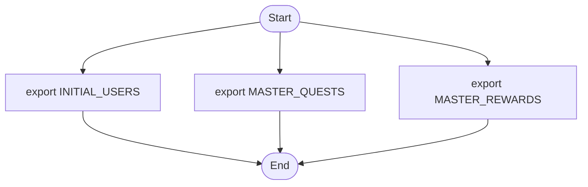
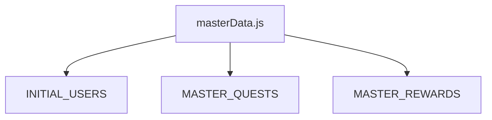

## 1. 解析メタ情報

| 項目 | 内容 |
| --- | --- |
| 対象ファイル | masterData.js (family-quest/src/constants/masterData.js) |
| 言語 | JavaScript / React |
| 解析対象 | 提供されたコードのみ |
| 推測・補完 | 一切なし |

## 2. ファイルの概要

* サーバー接続エラーが発生した際のみ使用されるフォールバック用のダミーデータ（定数）を定義し、外部に提供（エクスポート）する。
* 根拠: [ファイル冒頭コメント] (行番号: 2 / 抜粋: "// サーバー接続エラー時のみ使用されるフォールバックデータ")

## 3. 外部依存関係

### インポート一覧

| 名称 | 種類 | 用途 | 根拠 |
| --- | --- | --- | --- |
| 該当なし | - | - | - |

### ブラックボックスとなる外部要素

| 名称 | 理由 | 根拠 |
| --- | --- | --- |
| 該当なし | 外部ファイルのインポートや呼び出しが含まれていないため | - |

## 4. 主要要素の定義（関数 / エンドポイント / コンポーネント）

※本ファイルは定数定義のみであり、関数、クラス、エンドポイント等は存在しません。代わりにエクスポートされている主要な定数要素を列挙します。

### 定数：`INITIAL_USERS`

* **役割**: 接続エラー時に使用されるゲストユーザーのフォールバックデータを定義する。
* 根拠: [定数定義] (行番号: 4〜17 / 抜粋: "export const INITIAL_USERS = [")

* **引数/リクエスト**: なし
* 根拠: [定数定義] (行番号: 4 / 抜粋: "export const INITIAL_USERS = [")

* **戻り値/レスポンス**: オブジェクトの配列（プロパティ: `user_id`, `name`, `job_class`, `level`, `exp`, `nextLevelExp`, `gold`, `hp`, `maxHp`, `avatar`, `inventory`）
* 根拠: [定数の中身] (行番号: 5〜16 / 抜粋: "user_id: 'guest',")

* **副作用**: なし
* 根拠: [定数定義] (行番号: 4〜17 / 抜粋: "export const INITIAL_USERS = [")

* **エラーハンドリング**: なし
* 根拠: [定数定義] (行番号: 4〜17 / 抜粋: "export const INITIAL_USERS = [")

### 定数：`MASTER_QUESTS`

* **役割**: 接続エラー時に使用される、エラー状態を伝えるダミークエストのフォールバックデータを定義する。
* 根拠: [定数定義] (行番号: 19〜22 / 抜粋: "export const MASTER_QUESTS = [")

* **引数/リクエスト**: なし
* 根拠: [定数定義] (行番号: 19 / 抜粋: "export const MASTER_QUESTS = [")

* **戻り値/レスポンス**: オブジェクトの配列（プロパティ: `id`, `title`, `exp`, `gold`, `type`, `days`, `icon`）
* 根拠: [定数の中身] (行番号: 20〜21 / 抜粋: "{ id: 999, title: '⚠️ サーバ...")

* **副作用**: なし
* 根拠: [定数定義] (行番号: 19〜22 / 抜粋: "export const MASTER_QUESTS = [")

* **エラーハンドリング**: なし
* 根拠: [定数定義] (行番号: 19〜22 / 抜粋: "export const MASTER_QUESTS = [")

### 定数：`MASTER_REWARDS`

* **役割**: 接続エラー時に使用される、データ取得失敗を伝えるダミー報酬のフォールバックデータを定義する。
* 根拠: [定数定義] (行番号: 24〜26 / 抜粋: "export const MASTER_REWARDS = [")

* **引数/リクエスト**: なし
* 根拠: [定数定義] (行番号: 24 / 抜粋: "export const MASTER_REWARDS = [")

* **戻り値/レスポンス**: オブジェクトの配列（プロパティ: `id`, `title`, `cost`, `category`, `icon`, `desc`）
* 根拠: [定数の中身] (行番号: 25 / 抜粋: "{ id: 999, title: 'データ取得失敗...")

* **副作用**: なし
* 根拠: [定数定義] (行番号: 24〜26 / 抜粋: "export const MASTER_REWARDS = [")

* **エラーハンドリング**: なし
* 根拠: [定数定義] (行番号: 24〜26 / 抜粋: "export const MASTER_REWARDS = [")

## 5. 処理フロー図

※本ファイルは静的データの定義のみであるため、定数のエクスポート処理のみを描画しています。

## 6. 依存関係図

## 7. 次のステップ（リバースエンジニアリングの提案）

| 優先度 | ファイル名(推測可) | 理由 | 根拠 |
| --- | --- | --- | --- |
| 高 | 不明（インポート元のファイル） | 本ファイルで定義した定数を読み込み、サーバー接続エラー時にどのようにUIへのデータ切り替えを実装しているかを把握するため。 | `export` キーワードにより、外部からの呼び出しが前提となっているため (行番号: 4, 19, 24 / 抜粋: "export const") |

## 8. 保守上の注意点

* 定数としてエクスポートされる各オブジェクトのスキーマ（プロパティ構成）はハードコードされている。アプリ全体でユーザー、クエスト、報酬のデータ構造に変更があった場合、このファイルのオブジェクト構造も手動で合わせる必要がある。

## 9. 不明事項一覧

| 項目 | 理由 | 必要なファイル |
| --- | --- | --- |
| フォールバックデータの利用箇所と適用条件 | 本ファイル内にデータのインポート先や、エラーハンドリング（データ切り替え）のロジックが存在しないため。 | `masterData.js` をインポートしているモジュール群（APIクライアントやContext、各種UIコンポーネントなど） |

## 10. 自己検証結果

* [x] 推測・外部ファイルの仕様を一切含んでいない
* [x] 全関数・全クラス・全コンポーネントを列挙した（※今回は定数のみのため定数を列挙）
* [x] 全てのインポート要素を列挙した（※該当なしとして記載）
* [x] すべての仕様説明に「根拠（行番号・抜粋）」を明記した
* [x] 根拠漏れが0件である
* [x] Mermaid構文にエラーの原因となる記号（エスケープ漏れ）がない
* [x] 不明事項を漏れなく列挙した