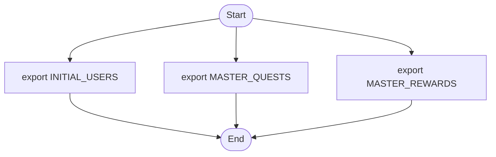
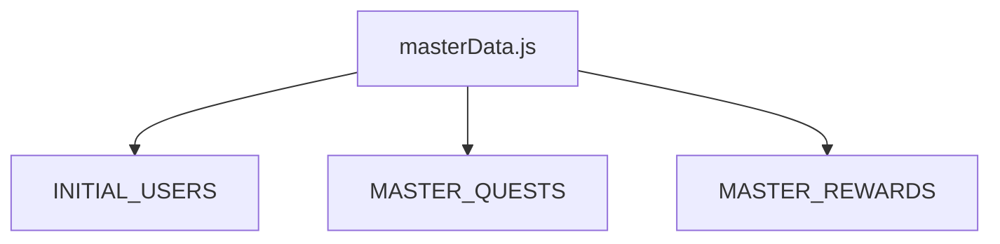

## 1. 解析メタ情報

| 項目 | 内容 |
| --- | --- |
| 対象ファイル | masterData.js (family-quest/src/lib/masterData.js) |
| 言語 | JavaScript / React |
| 解析対象 | 提供されたコードのみ |
| 推測・補完 | 一切なし |

## 関連ドキュメント

- [useGameData.md](../hooks/useGameData.md) — `INITIAL_USERS`/`MASTER_QUESTS`/`MASTER_REWARDS`の利用元。サーバー接続エラー時のフォールバックとして参照する。
- [types/index.md](../types/index.md) — `User`/`Quest`/`Reward`のスキーマ定義元。フォールバックデータの構造整合性の確認に利用できる。

## 2. ファイルの概要

* サーバー接続エラーが発生した際のみ使用されるフォールバック用のダミーデータ（定数）を定義し、外部に提供（エクスポート）する。
* 根拠: [ファイル冒頭コメント] (行番号: 2 / 抜粋: "// サーバー接続エラー時のみ使用されるフォールバックデータ")

## 3. 外部依存関係

### インポート一覧

| 名称 | 種類 | 用途 | 根拠 |
| --- | --- | --- | --- |
| 該当なし | - | - | - |

### ブラックボックスとなる外部要素

| 名称 | 理由 | 根拠 |
| --- | --- | --- |
| 該当なし | 外部ファイルのインポートや呼び出しが含まれていないため | - |

## 4. 主要要素の定義（関数 / エンドポイント / コンポーネント）

※本ファイルは定数定義のみであり、関数、クラス、エンドポイント等は存在しません。代わりにエクスポートされている主要な定数要素を列挙します。

### 定数：`INITIAL_USERS`

* **役割**: 接続エラー時に使用されるゲストユーザーのフォールバックデータを定義する。
* 根拠: [定数定義] (行番号: 4〜18 / 抜粋: "export const INITIAL_USERS = [")

* **引数/リクエスト**: なし
* 根拠: [定数定義] (行番号: 4 / 抜粋: "export const INITIAL_USERS = [")

* **戻り値/レスポンス**: オブジェクトの配列（プロパティ: `user_id`, `name`, `job_class`, `level`, `exp`, `nextLevelExp`, `gold`, `hp`, `maxHp`, `avatar`, `inventory`）
* 根拠: [定数の中身] (行番号: 6〜16 / 抜粋: "user_id: 'guest',")

* **副作用**: なし
* 根拠: [定数定義] (行番号: 4〜18 / 抜粋: "export const INITIAL_USERS = [")

* **エラーハンドリング**: なし
* 根拠: [定数定義] (行番号: 4〜18 / 抜粋: "export const INITIAL_USERS = [")

### 定数：`MASTER_QUESTS`

* **役割**: 接続エラー時に使用される、エラー状態を伝えるダミークエストのフォールバックデータを定義する。**（#291で修正）** プロパティ名がバックエンドAPIのレスポンスと同じフィールド名（`quest_id`/`exp_gain`/`gold_gain`/`quest_type`/`icon_key`）に統一され、フロント側（`QuestList.tsx`等）が二重のフィールド名フォールバック（`quest.gold_gain || quest.gold`等）を持たずに済むようになった。以前は`id`/`exp`/`gold`/`type`/`icon`という別名を使用していた。
* 根拠: [定数定義] (行番号: 20〜26 / 抜粋: "// #291: バックエンドのAPIレスポンスと同じフィールド名(quest_id/exp_gain/gold_gain/\n// quest_type/icon_key、reward_id/cost_gold/icon_key/description)に統一し、\n// フロント側で二重のフィールド名フォールバックを持たずに済むようにする。\nexport const MASTER_QUESTS = [")

* **引数/リクエスト**: なし
* 根拠: [定数定義] (行番号: 23 / 抜粋: "export const MASTER_QUESTS = [")

* **戻り値/レスポンス**: オブジェクトの配列（プロパティ: `quest_id`, `title`, `exp_gain`, `gold_gain`, `quest_type`, `days`, `icon_key`）
* 根拠: [定数の中身] (行番号: 24〜25 / 抜粋: "{ quest_id: 999, title: '⚠️ サーバーに繋がりません', exp_gain: 0, gold_gain: 0, quest_type: 'daily', days: null, icon_key: '🔌' },")

* **副作用**: なし
* 根拠: [定数定義] (行番号: 23〜26 / 抜粋: "export const MASTER_QUESTS = [")

* **エラーハンドリング**: なし
* 根拠: [定数定義] (行番号: 23〜26 / 抜粋: "export const MASTER_QUESTS = [")

### 定数：`MASTER_REWARDS`

* **役割**: 接続エラー時に使用される、データ取得失敗を伝えるダミー報酬のフォールバックデータを定義する。**（#291で修正）** プロパティ名がバックエンドAPIのレスポンスと同じフィールド名（`reward_id`/`cost_gold`/`icon_key`/`description`）に統一された。以前は`id`/`cost`/`icon`/`desc`という別名を使用しており、`RewardList.tsx`側で`cost_gold || cost`のような二重参照が必要だったが、これが不要になった。
* 根拠: [定数定義] (行番号: 20〜22, 28〜30 / 抜粋: "export const MASTER_REWARDS = [")

* **引数/リクエスト**: なし
* 根拠: [定数定義] (行番号: 28 / 抜粋: "export const MASTER_REWARDS = [")

* **戻り値/レスポンス**: オブジェクトの配列（プロパティ: `reward_id`, `title`, `cost_gold`, `category`, `icon_key`, `description`）
* 根拠: [定数の中身] (行番号: 29 / 抜粋: "{ reward_id: 999, title: 'データ取得失敗', cost_gold: 99999, category: 'special', icon_key: '❌', description: 'サーバーを確認してください' },")

* **副作用**: なし
* 根拠: [定数定義] (行番号: 28〜30 / 抜粋: "export const MASTER_REWARDS = [")

* **エラーハンドリング**: なし
* 根拠: [定数定義] (行番号: 28〜30 / 抜粋: "export const MASTER_REWARDS = [")

## 5. 処理フロー図

※本ファイルは静的データの定義のみであるため、定数のエクスポート処理のみを描画しています。

```mermaid
flowchart TD
    Start([Start]) --> Export1["export INITIAL_USERS"]
    Start --> Export2["export MASTER_QUESTS"]
    Start --> Export3["export MASTER_REWARDS"]
    Export1 --> End([End])
    Export2 --> End([End])
    Export3 --> End([End])

```

## 6. 依存関係図

```mermaid
graph TD
    masterData["masterData.js"]
    masterData --> INITIAL_USERS
    masterData --> MASTER_QUESTS
    masterData --> MASTER_REWARDS

```

## 7. 次のステップ（リバースエンジニアリングの提案）

| 優先度 | ファイル名(推測可) | 理由 | 根拠 |
| --- | --- | --- | --- |
| 高 | 不明（インポート元のファイル） | 本ファイルで定義した定数を読み込み、サーバー接続エラー時にどのようにUIへのデータ切り替えを実装しているかを把握するため。 | `export` キーワードにより、外部からの呼び出しが前提となっているため (行番号: 4, 20, 25 / 抜粋: "export const") |

## 8. 保守上の注意点

* 定数としてエクスポートされる各オブジェクトのスキーマ（プロパティ構成）はハードコードされている。アプリ全体でユーザー、クエスト、報酬のデータ構造に変更があった場合、このファイルのオブジェクト構造も手動で合わせる必要がある。**（#291で対応）** `MASTER_QUESTS`/`MASTER_REWARDS`のプロパティ名は、`Quest`/`Reward`型定義がバックエンドの実カラム名に一本化されたことに合わせて更新済みであり、現時点ではフィールド名の乖離はない。
* ファイル冒頭コメントの記載パスは実際の配置場所 (`family-quest/src/lib/masterData.js`) と一致している。
* 根拠: [ファイル冒頭コメント] (行番号: 1 / 抜粋: "// family-quest/src/lib/masterData.js")

## 9. 不明事項一覧

| 項目 | 理由 | 必要なファイル |
| --- | --- | --- |
| フォールバックデータの利用箇所と適用条件 | 本ファイル内にデータのインポート先や、エラーハンドリング（データ切り替え）のロジックが存在しないため。 | `masterData.js` をインポートしているモジュール群（APIクライアントやContext、各種UIコンポーネントなど） |

## 相互参照による補足情報

| 元の不明事項 | 判明した内容 | 参照元ドキュメント |
| --- | --- | --- |
| フォールバックデータの利用箇所と適用条件 | `useGameData.md`の解析によれば、`useGameData`フックの戻り値オブジェクトにおいて`users: gameData?.users || INITIAL_USERS`のように、`useQuery`によるサーバーからの取得データが存在しない場合のフォールバック値として`INITIAL_USERS`/`MASTER_QUESTS`/`MASTER_REWARDS`が使われているとされている。 | `../hooks/useGameData.md` |

## 10. 自己検証結果

* [x] 推測・外部ファイルの仕様を一切含んでいない
* [x] 全関数・全クラス・全コンポーネントを列挙した（※今回は定数のみのため定数を列挙）
* [x] 全てのインポート要素を列挙した（※該当なしとして記載）
* [x] すべての仕様説明に「根拠（行番号・抜粋）」を明記した
* [x] 根拠漏れが0件である
* [x] Mermaid構文にエラーの原因となる記号（エスケープ漏れ）がない
* [x] 不明事項を漏れなく列挙した

完了