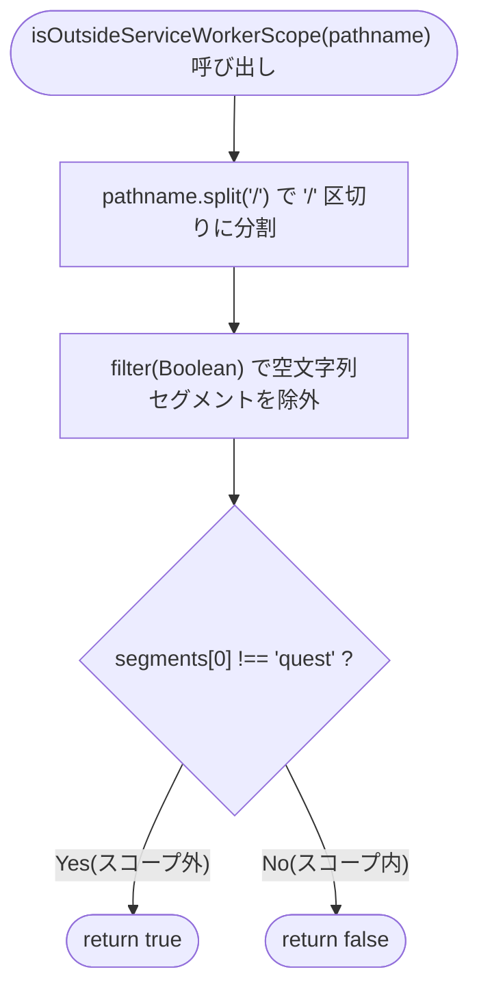
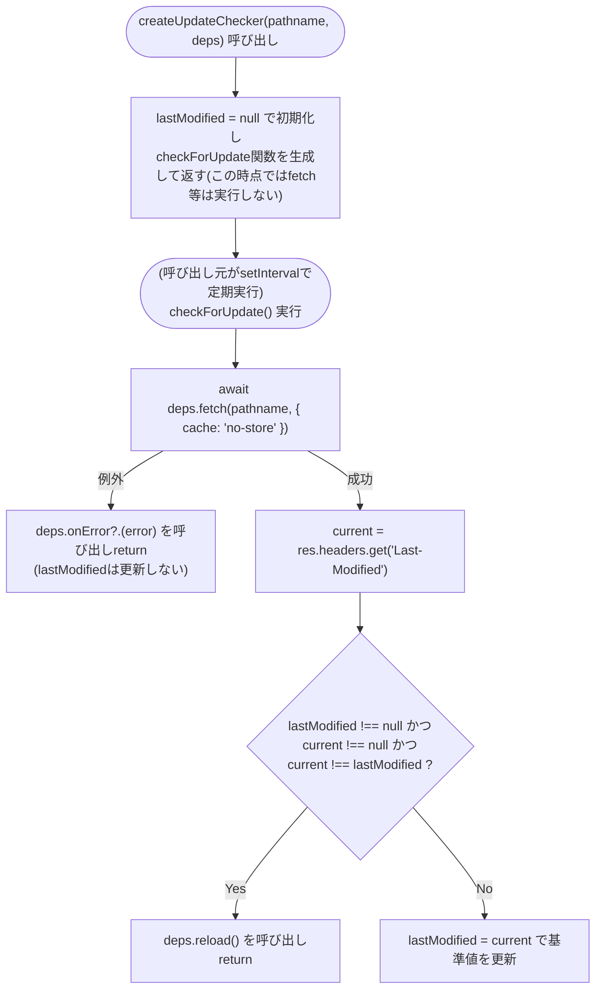
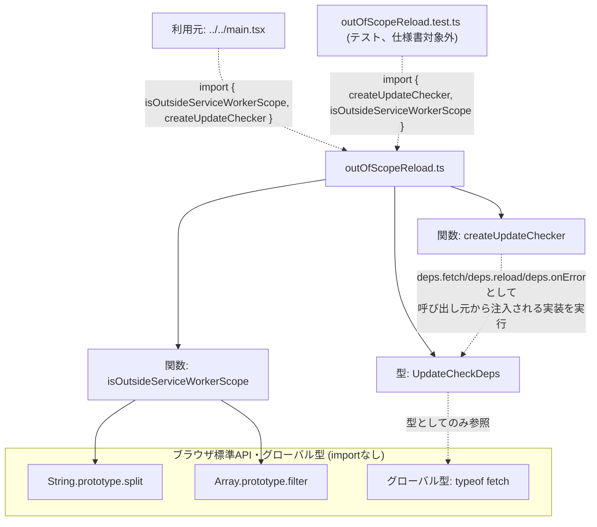

## 1. 解析メタ情報

| 項目 | 内容 |
| --- | --- |
| 対象ファイル | `outOfScopeReload.ts` (family-quest/src/lib/outOfScopeReload.ts) |
| 言語 | TypeScript |
| 解析対象 | 提供されたコードのみ（`outOfScopeReload.test.ts`は動作仕様の裏付けとして参照） |
| 推測・補完 | 一切なし |
| 解析基準コミット | (このリポジトリのHEADで新規作成) |

## 関連ドキュメント

* [../../main.md](../../main.md) - 唯一の呼び出し元。`registerSW(...)`呼び出しの直後、`isOutsideServiceWorkerScope(window.location.pathname)`が真の場合のみ`createUpdateChecker`が返す関数を`SW_UPDATE_INTERVAL_MS`(1時間)ごとに`window.setInterval`で呼び出す（Issue #591）。
* [routing.md](routing.md) - `main.tsx`のもう一方の判定関数`isCameraRoute`の実装元。本ファイルの`isOutsideServiceWorkerScope`とは**別モジュール・別の判定基準**であり、一方が他方を代替・包含するものではない（詳細は本ファイルの「8. 保守上の注意点」参照）。
* [../../../MY_HOME_SYSTEM/unified_server.md](../../../MY_HOME_SYSTEM/unified_server.md) - `/camera`・`/camera/{full_path}`を`FileResponse`で配信するバックエンド側の実装元。本ファイルが依存する「`/camera`のレスポンスには`Last-Modified`ヘッダが付与される」という前提は、StarletteのFileResponseがファイルのmtimeから自動的に付与する挙動に基づく。

## 2. ファイルの概要

`main.tsx`のService Worker更新戦略(Issue #362)がカバーできない領域、すなわちService Workerのスコープ外にあるページ向けの更新検知ロジックを、単体テスト可能な形で切り出したモジュールである。エクスポートは2つ: パスがスコープ外かどうかを判定する純粋関数`isOutsideServiceWorkerScope(pathname: string): boolean`と、定期呼び出し用の非同期チェック関数を生成するファクトリ関数`createUpdateChecker(pathname: string, deps: UpdateCheckDeps): () => Promise<void>`である。ファイル冒頭のコメントによれば、`vite-plugin-pwa`が生成するService Workerのスコープは`vite.config.ts`の`base`(`/quest/`)に閉じており、`/camera`のようなスコープ外のページでは`navigator.serviceWorker.controller`が常に`null`のままとなるため、`main.tsx`の`controllerchange`ベースの自動リロード(Issue #362)が一切発火しない。この隙間を埋めるため、スコープ外のページ自身のHTMLを定期的にno-cacheで再取得し、`Last-Modified`ヘッダの変化を見ることで同じ役割（新しいバンドルのデプロイ検知→自動リロード）を代替する。
* 根拠: ファイル冒頭コメント全文 (行番号: 1〜12 / 抜粋: "// #591: vite-plugin-pwaのService Workerのスコープはvite.config.tsのbase(`/quest/`)\n// に閉じている。main.tsxのcontrollerchangeハンドラ(#362)は新しいSWが有効化された\n// 時点で自動リロードする仕組みだが、`/camera`のようにスコープ外のパスでは、その\n// ページ自体がSWの管理下に一切入らない(navigator.serviceWorker.controllerが常に\n// nullのまま)ため、controllerchangeイベント自体が発火しない。", "// SWの管理外にあるページに対しては、ページ自身のHTMLを定期的にno-cacheで\n// 再取得しLast-Modifiedヘッダの変化を見ることで、同じ問題を防ぐ。")
* 根拠: エクスポートは2つ (行番号: 15, 31 / 抜粋: "export function isOutsideServiceWorkerScope(pathname: string): boolean {", "export function createUpdateChecker(pathname: string, deps: UpdateCheckDeps) {")

## 3. 外部依存関係

### インポート一覧

| 名称 | 種類 | 用途 | 根拠 |
| --- | --- | --- | --- |
| 該当なし | - | 本ファイルはimport文を持たない（`String.prototype.split`/`Array.prototype.filter`、グローバル型`typeof fetch`のみを使用する自己完結したモジュール） | - |

### ブラックボックスとなる外部要素

| 名称 | 理由 | 根拠 |
| --- | --- | --- |
| `deps.fetch`, `deps.reload`, `deps.onError`（呼び出し元が注入する`UpdateCheckDeps`） | 実際の実装は呼び出し元(`main.tsx`)から関数として注入されるため、本ファイル単体では具体的に何を`fetch`するのか（実体は`window.fetch`かテスト用モックか）や、`reload`が本当に`window.location.reload()`を呼ぶ実装かどうかは判断できない。 | 根拠: `UpdateCheckDeps`の型定義のみで実体を持たない (行番号: 20〜24 / 抜粋: "export interface UpdateCheckDeps {\n    fetch: typeof fetch;\n    reload: () => void;\n    onError?: (error: unknown) => void;\n}") |

## 4. 主要要素の定義（関数 / エンドポイント / コンポーネント）

### `isOutsideServiceWorkerScope`

* **役割**: 与えられたパス文字列`pathname`が、Service Workerのスコープ(`/quest/`)の**外**にあるかどうかを判定する純粋関数。パスを`/`で分割し空文字列セグメントを除外した配列`segments`を作り、`segments[0] !== 'quest'`を返す。先頭セグメントが`'quest'`である場合のみスコープ内(`false`)と判定し、それ以外（`/camera`、`/`、`/settings`等）はすべてスコープ外(`true`)として扱う。
* 根拠: [関数定義] (行番号: 15〜18 / 抜粋: "export function isOutsideServiceWorkerScope(pathname: string): boolean {\n    const segments = pathname.split('/').filter(Boolean);\n    return segments[0] !== 'quest';\n}")
* 根拠: 動作契約を裏付けるテスト (`outOfScopeReload.test.ts`、行番号: 9〜21 / 抜粋: "it.each(['/camera', '/camera/', '/camera/live/cam1', '/', '/settings'])(\n        'treats %s as outside the service worker scope',\n        (pathname) => {\n            expect(isOutsideServiceWorkerScope(pathname)).toBe(true);\n        }\n    );", "it.each(['/quest', '/quest/', '/quest/camera', '/quest/settings'])(\n        'treats %s as inside the service worker scope (base: /quest/)',\n        (pathname) => {\n            expect(isOutsideServiceWorkerScope(pathname)).toBe(false);\n        }\n    );")

* **引数/リクエスト**: `pathname: string`（判定対象のURLパス。`main.tsx`では`window.location.pathname`が唯一の実際の呼び出し元での実引数）
* 根拠: [関数シグネチャ] (行番号: 15 / 抜粋: "export function isOutsideServiceWorkerScope(pathname: string): boolean {")

* **戻り値/レスポンス**: `boolean`（スコープ外と判定すれば`true`、スコープ内(`quest`配下)であれば`false`）
* 根拠: [関数シグネチャの戻り値型と`return`文] (行番号: 15〜17 / 抜粋: "): boolean {\n    const segments = pathname.split('/').filter(Boolean);\n    return segments[0] !== 'quest';")

* **副作用**: なし（`pathname`という引数のみに依存する純粋関数。グローバル状態の読み書きや外部I/Oは一切行わない）
* 根拠: [関数本体全体] (行番号: 15〜18)

* **エラーハンドリング**: なし（`try-catch`等は存在しない）。`pathname`が空文字列の場合、`''.split('/').filter(Boolean)`は空配列`[]`となり`segments[0]`は`undefined`となるため、`undefined !== 'quest'`は真となり`true`（スコープ外）を返す（例外は発生しない）。
* 根拠: [`filter(Boolean)`による空文字列セグメントの除外] (行番号: 16 / 抜粋: "const segments = pathname.split('/').filter(Boolean);")

### `createUpdateChecker`

* **役割**: `pathname`と`deps: UpdateCheckDeps`を受け取り、呼び出す度に`pathname`をno-cacheで再取得して`Last-Modified`ヘッダの変化を検知する非同期チェック関数`checkForUpdate: () => Promise<void>`を生成するファクトリ関数。クロージャ内部に`lastModified: string | null`という状態を1つだけ保持する。`checkForUpdate`が呼ばれるたびに`deps.fetch(pathname, { cache: 'no-store' })`を`await`し、レスポンスの`Last-Modified`ヘッダを`current`として取得する。`lastModified !== null`（＝2回目以降の呼び出し）かつ`current !== null`（＝ヘッダが存在する）かつ`current !== lastModified`（＝値が変化した）の3条件がすべて真の場合のみ`deps.reload()`を呼び出して`return`する。それ以外（初回呼び出し・値が変化していない・`current`が`null`のいずれか）の場合は`reload`を呼ばず、`lastModified = current`で基準値を更新するのみで終わる。
* 根拠: [関数定義全文] (行番号: 31〜50 / 抜粋: "export function createUpdateChecker(pathname: string, deps: UpdateCheckDeps) {\n    let lastModified: string | null = null;\n\n    return async function checkForUpdate(): Promise<void> {\n        let current: string | null;\n        try {\n            const res = await deps.fetch(pathname, { cache: 'no-store' });\n            current = res.headers.get('Last-Modified');\n        } catch (error) {\n            deps.onError?.(error);\n            return;\n        }\n\n        if (lastModified !== null && current !== null && current !== lastModified) {\n            deps.reload();\n            return;\n        }\n        lastModified = current;\n    };\n}")
* 根拠: 動作契約を裏付けるテスト (`outOfScopeReload.test.ts`、6ケース、行番号: 31〜99 / 抜粋: "it('does not reload on the first check (no baseline to compare against yet)', ...", "it('reloads once Last-Modified changes from the recorded baseline', ...", "it('reports fetch failures via onError instead of throwing, and does not reload', ...")

* **引数**: `pathname: string`（チェック対象のURLパス。`checkForUpdate`が`deps.fetch`を呼ぶ際の第1引数として毎回使われる、`createUpdateChecker`呼び出し時に固定されるクロージャ変数）、`deps: UpdateCheckDeps`（`fetch: typeof fetch`／`reload: () => void`／任意の`onError?: (error: unknown) => void`の3フィールドを持つオブジェクト）
* 根拠: [関数シグネチャと`UpdateCheckDeps`の定義] (行番号: 20〜24, 31 / 抜粋: "export interface UpdateCheckDeps {\n    fetch: typeof fetch;\n    reload: () => void;\n    onError?: (error: unknown) => void;\n}", "export function createUpdateChecker(pathname: string, deps: UpdateCheckDeps) {")

* **戻り値/レスポンス**: `() => Promise<void>`型の関数（`checkForUpdate`という名前の`async`クロージャ）。`createUpdateChecker`自体の呼び出しはこの関数を返すのみで、`checkForUpdate`を実際に呼び出すまでは`fetch`等は一切実行されない。
* 根拠: [`return async function checkForUpdate()`] (行番号: 34 / 抜粋: "return async function checkForUpdate(): Promise<void> {")

* **副作用**: `createUpdateChecker`自体の呼び出し（ファクトリ関数としての実行）自体には副作用はなく、クロージャを1つ生成するのみ。生成された`checkForUpdate`を実際に呼び出すたびに、`deps.fetch`によるHTTPリクエスト、条件成立時の`deps.reload()`呼び出し、クロージャ内部状態`lastModified`の更新という3種の副作用が発生しうる。
* 根拠: (行番号: 32, 37, 45, 48 / 抜粋: "let lastModified: string | null = null;", "const res = await deps.fetch(pathname, { cache: 'no-store' });", "deps.reload();", "lastModified = current;")

* **エラーハンドリング**: `deps.fetch`が例外を投げた場合（`try...catch`）、`deps.onError?.(error)`（オプショナルチェイニングにより`onError`が未指定なら何もしない）を呼び出し、即座に`return`する。例外は`checkForUpdate`の外へは伝播しない（呼び出し元で`await checker()`が`reject`することはない）。この分岐では`lastModified`も更新されないため、次回呼び出し時は障害発生前の基準値と比較される。
* 根拠: (行番号: 36〜42 / 抜粋: "try {\n            const res = await deps.fetch(pathname, { cache: 'no-store' });\n            current = res.headers.get('Last-Modified');\n        } catch (error) {\n            deps.onError?.(error);\n            return;\n        }")

## 5. 処理フロー図

## 6. 依存関係図

## 7. 次のステップ（リバースエンジニアリングの提案）

| 優先度 | ファイル名(推測可) | 理由 | 根拠 |
| --- | --- | --- | --- |
| 高 | `../../main.tsx` | `isOutsideServiceWorkerScope`/`createUpdateChecker`の唯一の呼び出し元であり、実際にどう組み合わされて`SW_UPDATE_INTERVAL_MS`ごとに定期実行されるかを確認するため。 | `main.md`（既存の解析済み仕様書）参照 |
| 中 | `MY_HOME_SYSTEM/unified_server.py` | ファイル冒頭コメントおよび本ファイルの設計が前提とする「`/camera`ルートのレスポンスには`Last-Modified`ヘッダが付与される」という挙動を、バックエンド側の実装（`FileResponse(index_path)`）で裏付け確認するため。 | 直接ソース確認: `MY_HOME_SYSTEM/unified_server.py:367-396`（`serve_quest_spa`/`serve_quest_root`が`/camera`・`/camera/{full_path}`にも登録され`FileResponse`を返す） |
| 低 | `outOfScopeReload.test.ts` | 本ファイルの動作契約（15ケース）を網羅的に確認済みだが、今後仕様変更があった場合はテストケースとの整合を都度確認する必要がある。 | `describe`/`it`/`it.each`一覧 |

## 8. 保守上の注意点

* **`lastModified`はモジュールスコープではなくクロージャごとのインスタンス状態**: `createUpdateChecker`を複数回呼び出すと、それぞれ独立した`lastModified`を持つ別々の`checkForUpdate`関数が生成される。`main.tsx`は`isOutsideServiceWorkerScope`が真の場合に1回だけ呼び出すため実害はないが、誤って複数回呼び出すと基準値がリセットされ、直後の呼び出しは必ず「変化なし」判定になる点に注意。
* 根拠: (行番号: 31〜32 / 抜粋: "export function createUpdateChecker(pathname: string, deps: UpdateCheckDeps) {\n    let lastModified: string | null = null;")
* **`Last-Modified`ヘッダが欠落する配信環境では変化を検知できない**: `current`が`null`（ヘッダ欠落）の場合、`current !== null`の条件が偽になるため、実際に新しいデプロイがあっても`reload`は呼ばれない（`lastModified`は`null`のまま更新され続ける）。本ファイルはStarletteの`FileResponse`が自動付与する`Last-Modified`ヘッダに依存する設計だが、その前提自体は本ファイル単体からは検証できない（`MY_HOME_SYSTEM/unified_server.py`側の実装に依存する）。
* 根拠: (行番号: 44, 48 / 抜粋: "if (lastModified !== null && current !== null && current !== lastModified) {", "lastModified = current;")
* **初回呼び出しでは必ずbaseline記録のみで終わり、リロードは次回以降まで発生しない**: `lastModified`は`null`で初期化されるため、`checkForUpdate`の初回呼び出しは（`current`がどんな値であっても）`lastModified !== null`の条件が偽となり、必ず`reload`されずに`lastModified = current`が実行されるだけで終わる。`/camera`をブラウザで開いた直後にこのチェックによるリロードが走ることはなく、実際に新しいバンドルを検知してリロードするには、呼び出し元(`main.tsx`)の`setInterval`間隔（`SW_UPDATE_INTERVAL_MS`＝1時間）分の待ちが最低でも必要になる。
* 根拠: (行番号: 32, 44 / 抜粋: "let lastModified: string | null = null;", "if (lastModified !== null && current !== null && current !== lastModified) {")
* **`fetch`の失敗はエラーを`onError`に委譲して握りつぶすのみで、基準値も更新されない**: `deps.fetch`が例外を投げた場合、`deps.onError`を呼んで即`return`するため、`lastModified`は前回の値のまま変わらない。次回呼び出しで`fetch`が成功すれば、それ以前の`lastModified`と比較される（＝一時的なネットワーク障害によって基準値が失われたり、誤って`reload`が発火したりすることはない）。
* 根拠: (行番号: 36〜42 / 抜粋: "try {\n            const res = await deps.fetch(pathname, { cache: 'no-store' });\n            current = res.headers.get('Last-Modified');\n        } catch (error) {\n            deps.onError?.(error);\n            return;\n        }")
* **`isCameraRoute`(`routing.ts`)とは独立した別の判定軸である**: 本ファイルの`isOutsideServiceWorkerScope`は「このページはService Workerの管理下にあるか」を判定し、`routing.ts`の`isCameraRoute`は「カメラビュー(`CameraDashboard`)をマウントすべきパスか」を判定する、目的の異なる2つの独立した純粋関数である。`/camera`のような単純なケースでは両方とも`true`を返すため紛らわしいが、`/quest/camera`では`isCameraRoute('/quest/camera')`が`true`（カメラビューをマウントすべき）である一方、`isOutsideServiceWorkerScope('/quest/camera')`は`false`（`quest`配下でSWスコープ内）となり判定結果が食い違う。一方の関数の変更が他方の判定に影響することはなく、代替・包含関係にもない点に注意する必要がある。
* 根拠: (行番号: 15〜18 / 抜粋: "export function isOutsideServiceWorkerScope(pathname: string): boolean {\n    const segments = pathname.split('/').filter(Boolean);\n    return segments[0] !== 'quest';\n}")

## 9. 不明事項一覧

| 項目 | 理由 | 必要なファイル |
| --- | --- | --- |
| `MY_HOME_SYSTEM/unified_server.py`側で`/camera`が実際に`Last-Modified`ヘッダ付きで応答することの実行時レベルでの確認 | 本ファイルの設計はStarletteの`FileResponse`がファイルのmtimeから`Last-Modified`を自動付与する挙動を前提とするが、本ファイル自体はこのバックエンド側の実装を直接参照・検証していない（ソースコード上は`FileResponse(index_path)`の呼び出しを確認済みだが、実際のHTTPレスポンスヘッダそのものは未確認）。 | `MY_HOME_SYSTEM/unified_server.py`（実行時のレスポンスヘッダ確認） |

## 相互参照による補足情報

（本ファイルは新規作成のため、他ドキュメントとの相互参照による補足情報はまだ存在しない。）

## 10. 自己検証結果

* [x] 完了: 推測・外部ファイルの仕様を一切含んでいない
* [x] 完了: 全関数・全クラス・全コンポーネントを列挙した（本ファイルは`isOutsideServiceWorkerScope`・`createUpdateChecker`の2関数と`UpdateCheckDeps`型で構成されており、列挙した）
* [x] 完了: 全てのインポート要素を列挙した（該当なし）
* [x] 完了: すべての仕様説明に「根拠（行番号・抜粋）」を明記した
* [x] 完了: 根拠漏れが0件である
* [x] 完了: Mermaid構文にエラーの原因となる記号（エスケープ漏れ）がない
* [x] 完了: 不明事項を漏れなく列挙した
