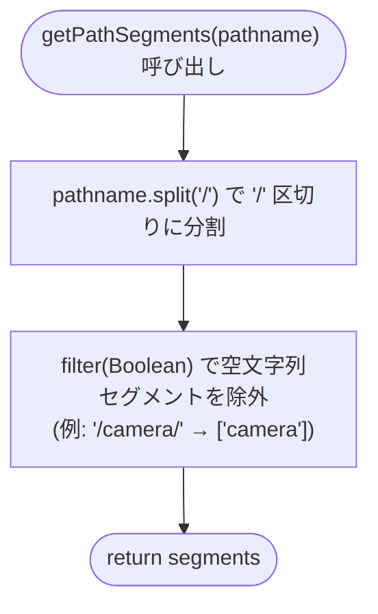
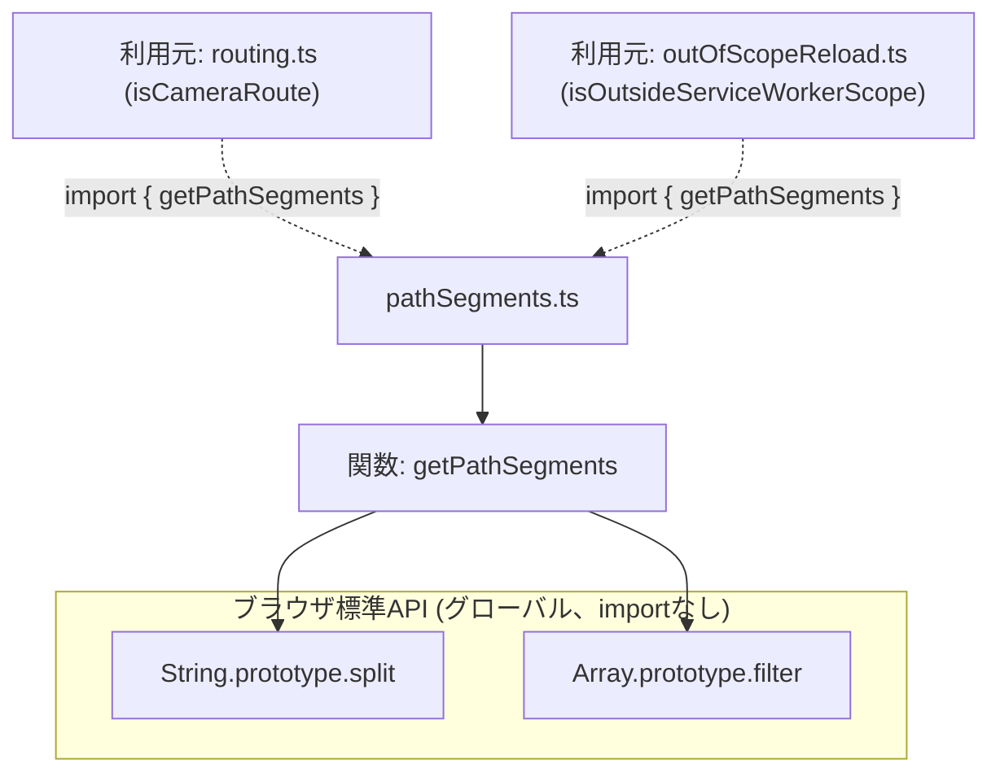

## 1. 解析メタ情報

| 項目 | 内容 |
| --- | --- |
| 対象ファイル | `pathSegments.ts` (family-quest/src/lib/pathSegments.ts) |
| 言語 | TypeScript |
| 解析対象 | 提供されたコードのみ（本ファイル専用の単体テストファイルは存在しない。`routing.test.ts`/`outOfScopeReload.test.ts`が利用元経由で間接的に動作を検証している） |
| 推測・補完 | 一切なし |
| 解析基準コミット | (このリポジトリのHEADで新規作成) |

## 関連ドキュメント

* [routing.md](routing.md) - 利用元の1つ。`isCameraRoute`が本ファイルの`getPathSegments`を使ってパスをセグメント配列に分割する。以前は`routing.ts`独自の`pathname.split('/').filter(Boolean)`だった（2026-09-10、コードレビュー指摘対応で本ファイルへ切り出された）。
* [outOfScopeReload.md](outOfScopeReload.md) - もう1つの利用元。`isOutsideServiceWorkerScope`が本ファイルの`getPathSegments`を使う。以前は`outOfScopeReload.ts`独自の同じ実装を持っており、`routing.ts`との重複があった。

## 2. ファイルの概要

`routing.ts`の`isCameraRoute`と`outOfScopeReload.ts`の`isOutsideServiceWorkerScope`が、それぞれ独自に`pathname.split('/').filter(Boolean)`（URLパスを`/`区切りのセグメント配列に分割し、先頭・末尾スラッシュ等に由来する空文字列セグメントを除去する処理）を行っていた重複をコードレビューで指摘され、共有ヘルパー関数`getPathSegments(pathname: string): string[]`として1箇所に集約したモジュールである。エクスポートはこの1関数のみで、副作用やモジュールレベルの状態を一切持たない。
* 根拠: ファイル冒頭コメント全文 (行番号: 3〜6 / 抜粋: "// routing.ts(isCameraRoute)とoutOfScopeReload.ts(isOutsideServiceWorkerScope)が\n// それぞれ独自にpathname.split('/').filter(Boolean)を行っていた重複を解消する\n// ための共有ヘルパー(コードレビュー指摘対応)。パスの先頭スラッシュ・末尾スラッシュ\n// による空文字列の混入を取り除いたセグメント配列を返す。")
* 根拠: エクスポートは1関数のみ (行番号: 7〜9 / 抜粋: "export function getPathSegments(pathname: string): string[] {\n    return pathname.split('/').filter(Boolean);\n}")

## 3. 外部依存関係

### インポート一覧

| 名称 | 種類 | 用途 | 根拠 |
| --- | --- | --- | --- |
| 該当なし | - | 本ファイルはimport文を持たない（`String.prototype.split`/`Array.prototype.filter`のみを使用する自己完結した純粋関数） | - |

### ブラックボックスとなる外部要素

| 名称 | 理由 | 根拠 |
| --- | --- | --- |
| 該当なし | 外部モジュールのインポートが存在せず、`pathname: string`という単純な文字列引数のみを扱うため、本ファイル単体で完結しブラックボックスとなる外部要素はない。 | - |

## 4. 主要要素の定義（関数 / エンドポイント / コンポーネント）

### `getPathSegments`

* **役割**: 与えられたパス文字列`pathname`を`/`で分割し、空文字列セグメントを除外したセグメント配列を返す純粋関数。`pathname.split('/')`は先頭・末尾のスラッシュや連続するスラッシュにより空文字列要素を生む（例: `'/camera/'.split('/')`は`['', 'camera', '']`）ため、`.filter(Boolean)`でこれらを除去してから返す（例: `getPathSegments('/camera/')`は`['camera']`）。
* 根拠: [関数定義] (行番号: 7〜9 / 抜粋: "export function getPathSegments(pathname: string): string[] {\n    return pathname.split('/').filter(Boolean);\n}")
* 根拠: 動作契約を間接的に裏付けるテスト（本ファイル専用のテストファイルは無いが、利用元経由で同じ分割結果を検証している）(`routing.test.ts`、行番号: 8〜23 / 抜粋: "it.each([\n        '/camera',\n        '/camera/',\n        '/camera/live/cam1',\n        '/quest/camera',\n        '/quest/camera/',\n        '/quest/camera/history',\n    ])('treats %s as a camera route', ..."), (`outOfScopeReload.test.ts`、行番号: 9〜21 / 抜粋: "it.each(['/camera', '/camera/', '/camera/live/cam1', '/', '/settings'])(\n        'treats %s as outside the service worker scope', ...")

* **引数/リクエスト**: `pathname: string`（分割対象のURLパス）
* 根拠: [関数シグネチャ] (行番号: 7 / 抜粋: "export function getPathSegments(pathname: string): string[] {")

* **戻り値/レスポンス**: `string[]`（空文字列セグメントを除いたパスセグメントの配列。一致するセグメントが無い場合は空配列`[]`）
* 根拠: [関数シグネチャの戻り値型と`return`文] (行番号: 7〜8 / 抜粋: "): string[] {\n    return pathname.split('/').filter(Boolean);")

* **副作用**: なし（`pathname`という引数のみに依存する純粋関数。グローバル状態の読み書きや外部I/Oは一切行わない）
* 根拠: [関数本体全体] (行番号: 7〜9)

* **エラーハンドリング**: なし（`try-catch`等は存在しない）。`pathname`が空文字列の場合、`''.split('/')`は`['']`となり`.filter(Boolean)`で空配列`[]`になる（例外は発生しない）。`pathname`が`string`型であることは呼び出し元の型システムに委ねられており、本関数自体に型・値のバリデーションは無い。
* 根拠: [`split`と`filter(Boolean)`の実装] (行番号: 8 / 抜粋: "return pathname.split('/').filter(Boolean);")

## 5. 処理フロー図

## 6. 依存関係図

## 7. 次のステップ（リバースエンジニアリングの提案）

| 優先度 | ファイル名(推測可) | 理由 | 根拠 |
| --- | --- | --- | --- |
| 中 | `routing.ts` / `routing.test.ts` | `getPathSegments`の利用元の1つであり、`isCameraRoute`がセグメント配列をどう判定に使うかを確認するため。 | [routing.md](routing.md)（既存の解析済み仕様書）参照 |
| 中 | `outOfScopeReload.ts` / `outOfScopeReload.test.ts` | `getPathSegments`のもう1つの利用元であり、`isOutsideServiceWorkerScope`がセグメント配列をどう判定に使うかを確認するため。 | [outOfScopeReload.md](outOfScopeReload.md)（既存の解析済み仕様書）参照 |

## 8. 保守上の注意点

* **本ファイル専用の単体テストは存在しない**: `getPathSegments`の動作は`routing.test.ts`/`outOfScopeReload.test.ts`が、それぞれの利用元関数（`isCameraRoute`/`isOutsideServiceWorkerScope`）を経由して間接的に検証しているのみで、`pathSegments.ts`自体を直接importして`getPathSegments`の戻り値を検証するテストファイルは無い。将来この関数の実装（空文字列除去の仕様等）を変更する場合は、両方の利用元のテストスイートを実行して回帰が無いことを確認する必要がある。
* 根拠: [ファイル一覧に`pathSegments.test.ts`が存在しないこと] (`family-quest/src/lib/`ディレクトリの直接確認)
* **`routing.ts`と`outOfScopeReload.ts`はセグメント分割の実装のみを共有し、判定基準は独立している**: 両ファイルとも本関数を使ってパスをセグメント配列に変換するが、その後の判定ロジック（`isCameraRoute`は「先頭が`camera`、または`quest`の次が`camera`か」、`isOutsideServiceWorkerScope`は「先頭が`quest`でないか」）はそれぞれ独立しており、本ファイルの変更が意図せず両方の判定結果に波及する点に注意（分割ロジック自体を変えれば両方に影響するのは意図通りだが、一方の判定基準のみを変えたい場合は本ファイルではなく呼び出し元を変更すること）。
* 根拠: [routing.ts:18-21, outOfScopeReload.ts:17-20の`getPathSegments`呼び出し] (直接ソース確認)

## 9. 不明事項一覧

（本ファイルは単純な純粋関数1つのみで構成されており、ソースコードから判断できない不明事項は無い。）

## 相互参照による補足情報

（本ファイルは新規作成のため、他ドキュメントとの相互参照による補足情報はまだ存在しない。）

## 10. 自己検証結果

* [x] 完了: 推測・外部ファイルの仕様を一切含んでいない
* [x] 完了: 全関数・全クラス・全コンポーネントを列挙した（本ファイルは`getPathSegments`の1関数のみで構成されており、列挙した）
* [x] 完了: 全てのインポート要素を列挙した（該当なし）
* [x] 完了: すべての仕様説明に「根拠（行番号・抜粋）」を明記した
* [x] 完了: 根拠漏れが0件である
* [x] 完了: Mermaid構文にエラーの原因となる記号（エスケープ漏れ）がない
* [x] 完了: 不明事項を漏れなく列挙した
