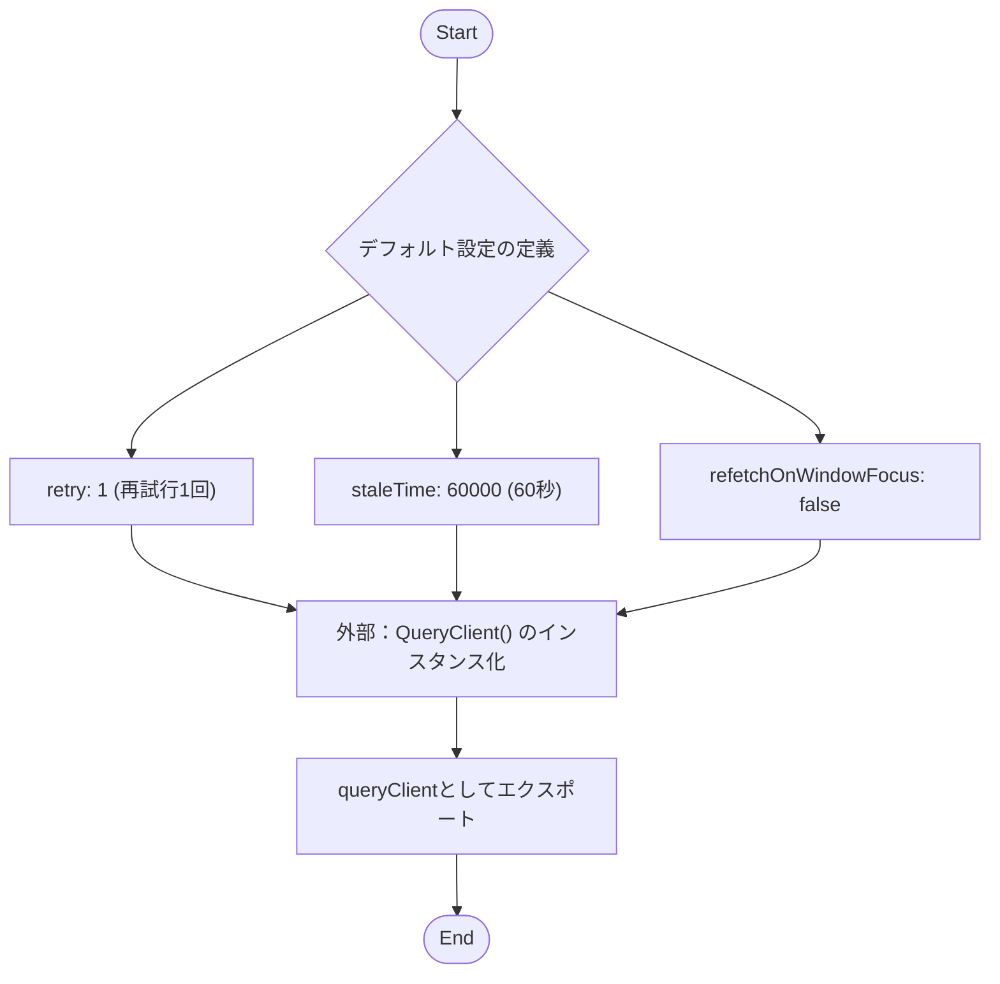
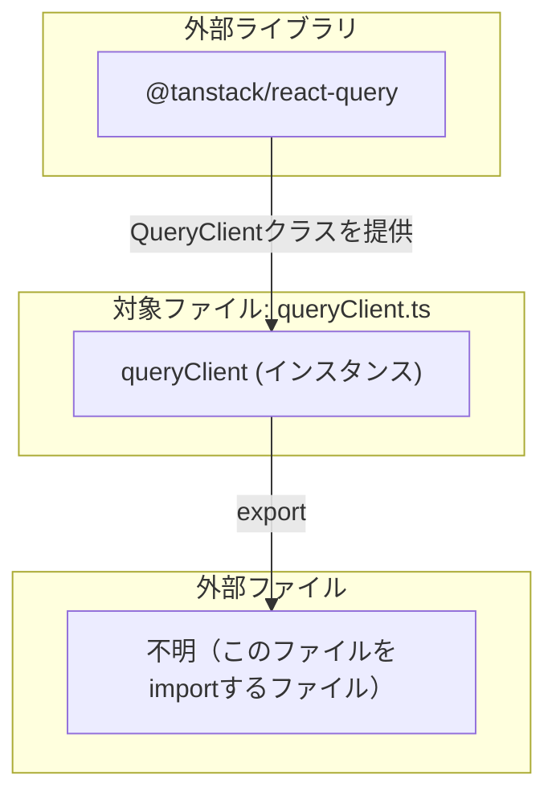

## 1. 解析メタ情報

| 項目 | 内容 |
| --- | --- |
| 対象ファイル | queryClient.ts |
| 言語 | TypeScript (React環境を想定) |
| 解析対象 | 提供されたコードのみ |
| 推測・補完 | 一切なし |

## 2. ファイルの概要

* `@tanstack/react-query` ライブラリの `QueryClient` を初期化し、システム全体で適用されるデータフェッチングのデフォルト動作（再試行回数、キャッシュ期限、ウィンドウフォーカス時の動作）を定義したインスタンスをエクスポートする。
* 根拠: [queryClient] (行番号: 3〜11 / 抜粋: "export const queryClient = new")

## 3. 外部依存関係

### インポート一覧

| 名称 | 種類 | 用途 | 根拠 |
| --- | --- | --- | --- |
| `QueryClient` | クラス | `queryClient`インスタンスを生成するため | 根拠: [import文] (行番号: 1〜1 / 抜粋: "import { QueryClient } from ") |

### ブラックボックスとなる外部要素

| 名称 | 理由 | 根拠 |
| --- | --- | --- |
| 該当なし | ファイル単体で設定オブジェクトの生成として完結しているため。 | 根拠: [ファイル全体] (行番号: 1〜11 / 抜粋: "import { QueryClient } ...") |

## 4. 主要要素の定義（関数 / エンドポイント / コンポーネント）

### `queryClient`

* **役割**: アプリケーション全体で利用するデフォルトオプション（失敗時のリトライ1回、キャッシュの鮮度判定時間60秒、画面フォーカス時の自動再取得無効化）を適用した`QueryClient`インスタンスを保持・提供する。
* 根拠: [queryClient定義全体] (行番号: 3〜11 / 抜粋: "export const queryClient = new")

* **引数/リクエスト**: 該当なし（定数定義のため）
* 根拠: [queryClient] (行番号: 3〜3 / 抜粋: "export const queryClient = new")

* **戻り値/レスポンス**: `QueryClient` クラスのインスタンス
* 根拠: [queryClient] (行番号: 3〜3 / 抜粋: "new QueryClient({")

* **副作用**: なし
* 根拠: [ファイル全体] (行番号: 1〜11 / 抜粋: "export const queryClient = new")

* **エラーハンドリング**: なし
* 根拠: [ファイル全体] (行番号: 1〜11 / 抜粋: "export const queryClient = new")

## 5. 処理フロー図

## 6. 依存関係図

## 7. 次のステップ（リバースエンジニアリングの提案）

| 優先度 | ファイル名(推測可) | 理由 | 根拠 |
| --- | --- | --- | --- |
| 高 | `App.tsx` または `main.tsx` (エントリーポイント) | エクスポートされた `queryClient` が `QueryClientProvider` に渡され、アプリケーション全体に適用されている箇所を特定するため。 | 根拠: [queryClientのエクスポート] (行番号: 3〜3 / 抜粋: "export const queryClient = new") |

## 8. 保守上の注意点

* `staleTime: 1000 * 60` により、デフォルトで取得したデータは60秒間「新鮮（staleではない）」とみなされ、その間は再フェッチが発生しない設定となっている。
* 根拠: [staleTime設定] (行番号: 7〜7 / 抜粋: "staleTime: 1000 * 60,")

* `refetchOnWindowFocus: false` により、ユーザーが別のタブやウィンドウから戻ってきた際の自動データ更新が無効化されている。
* 根拠: [refetchOnWindowFocus設定] (行番号: 8〜8 / 抜粋: "refetchOnWindowFocus: false,")

* `retry: 1` により、デフォルトではAPI通信等のクエリ失敗時に1回だけ自動再試行される。
* 根拠: [retry設定] (行番号: 6〜6 / 抜粋: "retry: 1,")

## 9. 不明事項一覧

| 項目 | 理由 | 必要なファイル |
| --- | --- | --- |
| `queryClient`の利用箇所 | このファイルはエクスポートのみを行っており、どこでプロバイダーとして適用されているか不明であるため。 | アプリケーションのルートコンポーネントまたはエントリーポイントとなるファイル（例: `App.tsx`, `index.tsx` など） |

## 10. 自己検証結果

* [x] 推測・外部ファイルの仕様を一切含んでいない（完了）
* [x] 全関数・全クラス・全コンポーネントを列挙した（完了）
* [x] 全てのインポート要素を列挙した（完了）
* [x] すべての仕様説明に「根拠（行番号・抜粋）」を明記した（完了）
* [x] 根拠漏れが0件である（完了）
* [x] Mermaid構文にエラーの原因となる記号（エスケープ漏れ）がない（完了）
* [x] 不明事項を漏れなく列挙した（完了）