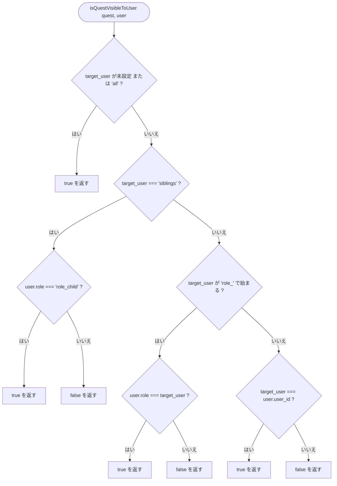
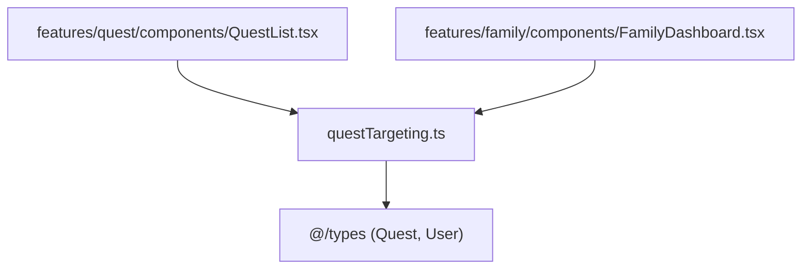

## 1. 解析メタ情報

| 項目 | 内容 |
| --- | --- |
| 対象ファイル | questTargeting.ts (family-quest/src/lib/questTargeting.ts) |
| 言語 | TypeScript |
| 解析対象 | 提供されたコードのみ |
| 推測・補完 | 一切なし |
| 解析基準コミット | `6007292` |

## 関連ドキュメント

* [../../features/quest/components/QuestList.md](../../features/quest/components/QuestList.md) - `sortedQuests`のフィルタ内で本関数を呼ぶ利用元（縦画面のクエスト一覧）
* [../../features/family/components/FamilyDashboard.md](../../features/family/components/FamilyDashboard.md) - `hasNothingToDo`内で本関数を呼ぶ利用元（横画面4人パネルの「今日やることが無いか」判定）
* [../types/index.md](../types/index.md) - `Quest`/`User`型の定義元

## 2. ファイルの概要

* クエストの`target_user`フィールドが、渡された`User`にとって対象かどうかを判定する純粋関数`isQuestVisibleToUser`を提供するモジュール。**（Issue #412 品質で追加）** 以前は`QuestList.tsx`（一覧のフィルタ）と`FamilyDashboard.tsx`（「今日やることが無いか」の判定）に、`all`/`siblings`/`role_`プレフィックス/個別`user_id`一致というほぼ同一の判定ロジックが重複して実装されており、判定基準を変更する際に両ファイルを漏れなく修正する必要があった。本ファイルへ集約し、両者から呼び出す形にした。
* 根拠: ファイル冒頭コメント (行番号: 1〜7 / 抜粋: "// #412(品質): クエストの target_user 判定（'all' / 'siblings' / 'role_' プレフィックス /\n// 個別 user_id 一致）は以前 QuestList.tsx（一覧のフィルタ）と FamilyDashboard.tsx\n// （「今日やることが無いか」の判定）に、ほぼ同一のロジックが重複して実装されていた。\n// ここに集約し、両者から参照する。")

## 3. 外部依存関係

### インポート一覧

| 名称 | 種類 | 用途 | 根拠 |
| --- | --- | --- | --- |
| `Quest`, `User` | 型定義 | 判定対象のクエスト・ユーザーの型 | 根拠: (行番号: 8 / 抜粋: "import { Quest, User } from '@/types';") |

### ブラックボックスとなる外部要素

なし（外部APIやDOM等への依存が一切ない純粋関数のみで構成されている）。

## 4. 主要要素の定義（関数 / エンドポイント / コンポーネント）

### `isQuestVisibleToUser` (export関数)

* **役割**: `quest.target_user`の値に応じて、`user`にとってそのクエストが対象かどうかを判定する。`target_user`が未設定または`'all'`なら常に対象。`'siblings'`（兄妹連携クエスト）なら`user.role === 'role_child'`のときのみ対象。`'role_'`で始まる値（例: `'role_adult'`）なら`user.role`が完全一致するときのみ対象。それ以外は`target_user`が`user.user_id`と完全一致するときのみ対象（個別指名）。
* 根拠: (行番号: 10〜21 / 抜粋: "export function isQuestVisibleToUser(quest: Quest, user: User): boolean {\n    const target = quest.target_user;\n    if (!target || target === 'all') return true;\n\n    if (target === 'siblings') {\n        // 兄妹連携クエスト: 対象は子ども(role_child)全員\n        return user.role === 'role_child';\n    }\n    if (target.startsWith('role_')) {\n        return user.role === target;\n    }\n    return target === user.user_id;\n}")

* **引数/リクエスト**: `quest: Quest`, `user: User`
* **戻り値/レスポンス**: `boolean`
* **副作用**: なし
* **エラーハンドリング**: なし（`target`が`undefined`の場合の分岐は判定ロジックの一部であり、例外処理ではない）

## 5. 処理フロー図

## 6. 依存関係図

## 7. 次のステップ（リバースエンジニアリングの提案）

| 優先度 | ファイル名(推測可) | 理由 | 根拠 |
| --- | --- | --- | --- |
| 中 | `../../features/quest/components/QuestList.tsx` | 本関数を使ったクエスト一覧フィルタの全体像（曜日フィルタ・ソートとの組み合わせ）を把握するため | 根拠: 関連ドキュメント参照 |
| 中 | `../../features/family/components/FamilyDashboard.tsx` | 本関数を使った「今日やることが無いか」判定の全体像を把握するため | 根拠: 関連ドキュメント参照 |

## 8. 保守上の注意点

* **判定基準を変更する際はこのファイルのみを直せばよい**: 以前は`QuestList.tsx`と`FamilyDashboard.tsx`の2箇所に重複していたロジックが本ファイルに一本化されたため、`target_user`の対象範囲（新しいプレフィックスの追加等）を変更する場合は本ファイルのみを修正すればよい。
* **`role_`プレフィックスの判定は`startsWith`による前方一致**: `role_adult`/`role_child`以外の`role_`で始まる値が将来追加された場合も、`user.role`との完全一致でのみ対象になる（前方一致ではない）。
* 根拠: (行番号: 18〜19 / 抜粋: "if (target.startsWith('role_')) {\n        return user.role === target;\n    }")

## 9. 不明事項一覧

なし（本ファイル単体で完結する純粋関数であり、外部依存の不明点は無い）。

## 相互参照による補足情報

なし。

## 10. 自己検証結果

* [x] 推測・外部ファイルの仕様を一切含んでいない
* [x] 全関数・全クラス・全コンポーネントを列挙した
* [x] 全てのインポート要素を列挙した
* [x] すべての仕様説明に「根拠（行番号・抜粋）」を明記した
* [x] 根拠漏れが0件である
* [x] Mermaid構文にエラーの原因となる記号（エスケープ漏れ）がない
* [x] 不明事項を漏れなく列挙した
