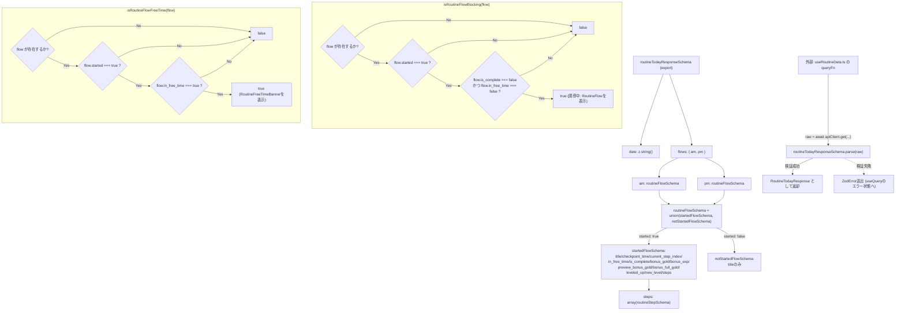
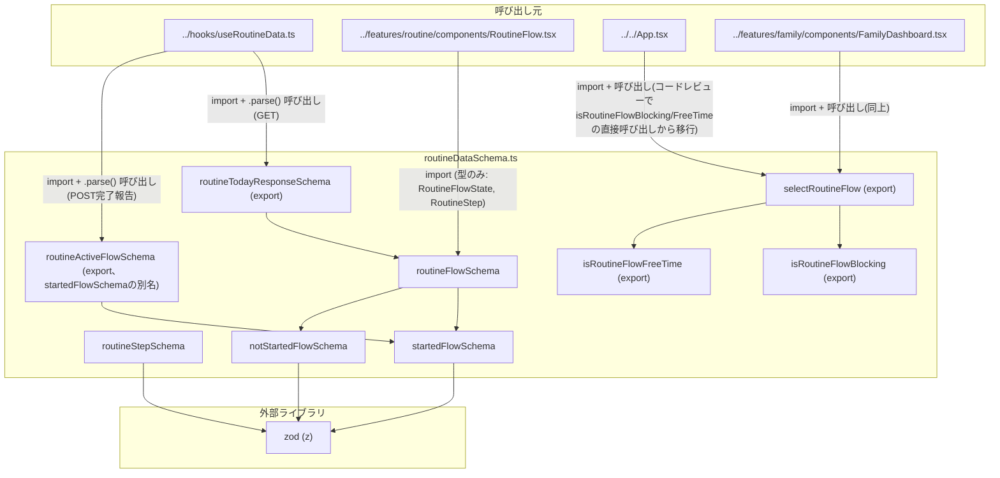

## 1. 解析メタ情報

| 項目 | 内容 |
| --- | --- |
| 対象ファイル | `routineDataSchema.ts` (family-quest/src/lib/routineDataSchema.ts) |
| 言語 | TypeScript |
| 解析対象 | 提供されたコードのみ |
| 推測・補完 | 一切なし |
| 解析基準コミット | `0d67384` (+同一ブランチ内で朝の準備の順不同チェックリスト化(`is_checklist`/`preview_bonus_gold`/`bonus_full_gold`フィールド追加)を追加修正) |

## 関連ドキュメント

* [../hooks/useRoutineData.md](../hooks/useRoutineData.md) - 本ファイルの`routineTodayResponseSchema`で`GET /api/routine/today`のレスポンスを検証するフック。`RoutineTodayResponse`型も利用する。
* [../features/routine/components/RoutineFlow.md](../features/routine/components/RoutineFlow.md) - 本ファイルの`RoutineFlowState`/`RoutineStep`型をpropsの型として利用するコンポーネント。
* [./gameDataSchema.md](./gameDataSchema.md) - 同じ「バックエンドAPIレスポンスをZodでランタイム検証する」方針を採る姉妹ファイル。`.strict()`を使わない設計方針が共通する。
* `MY_HOME_SYSTEM/services/routine_service.py`（本タスクの対象外、未解析）- `GET /api/routine/today`のレスポンスを生成する`RoutineService.get_today_state`、およびチェックポイントの時刻ベース強制通過（`_apply_forced_transition`）の実装元と推測されるが、本タスクでは解析対象外のため詳細は不明（9章参照）。

## 2. ファイルの概要

`GET /api/routine/today`（コメントによれば`services/routine_service.py`の`RoutineService.get_today_state`が生成すると推測されるレスポンス）に対するランタイム検証用のZodスキーマ群を定義するファイル。朝(`am`)/夕方(`pm`)の2系統の「すごろく」フロー（`routineFlowSchema`。未開始を表す`notStartedFlowSchema`と、進行中を表す`startedFlowSchema`の判別可能な union）と、その中の1ステップを表す`routineStepSchema`を定義し、トップレベルの`routineTodayResponseSchema`としてまとめてエクスポートする。**（コードレビューで発覚した欠落を修正）** `startedFlowSchema`には`leveled_up`/`new_level`フィールドが追加され、`POST /api/routine/complete`のレスポンス検証用に`startedFlowSchema`をそのまま指す`routineActiveFlowSchema`もエクスポートするようになった(以前は完了報告のレスポンスがランタイム検証を一切通っていなかった)。**（朝の準備チェックリスト化で追加）** `routineStepSchema`に`is_checklist: z.boolean()`(順不同でチェック/チェック解除できる項目かどうか)が、`startedFlowSchema`に`preview_bonus_gold: z.number()`/`bonus_full_gold: z.number()`(チェックリストを1つチェックするたびに増える出発ボーナスの見込みgold額、および満額)が追加された。加えて、あるフローが「画面を占有すべき状態（誘導中）」かどうかを判定する`isRoutineFlowBlocking`と、「自由時間中」かどうかを判定する`isRoutineFlowFreeTime`という2つの型ガード関数、および両者を「amをpmより優先する」という共通の優先順位でまとめて呼び出すヘルパー`selectRoutineFlow`(と、その入出力型`RoutineFlowsMap`/`SelectedRoutineFlow`)をエクスポートする。`selectRoutineFlow`は元々`App.tsx`と`FamilyDashboard.tsx`に重複していた同じ4分岐の三項演算子ロジックをコードレビューで指摘され、本ファイルへ集約したもの。`gameDataSchema.ts`と同じく、バックエンドが将来追加しうる未知のフィールドで`.parse()`が失敗しないよう`.strict()`は使わない方針を採る。
* 根拠: ファイル冒頭コメント (行番号: 1〜5 / 抜粋: "// family-quest/src/lib/routineDataSchema.ts\n//\n// GET /api/routine/today (services/routine_service.py RoutineService.get_today_state)の\n// レスポンスに対するランタイム検証。gameDataSchema.ts と同じ方針(未知フィールドは\n// 無視するため .strict() は使わない)。")
* 根拠: `leveled_up`/`new_level`フィールドと`routineActiveFlowSchema` (行番号: 31〜33, 46 / 抜粋: "// チェックポイント通過ボーナスでレベルアップした「その1回のレスポンス」でのみtrue。\n    leveled_up: z.boolean(),\n    new_level: z.number().nullable(),", "export const routineActiveFlowSchema = startedFlowSchema;")
* 根拠: `is_checklist`/`preview_bonus_gold`/`bonus_full_gold`フィールド (行番号: 13〜14, 27〜30 / 抜粋: "// 順不同でチェック/チェック解除できる項目(例: 朝の準備5項目)かどうか。\n    is_checklist: z.boolean(),", "// チェックリストを1つチェックするたびに増える、出発ボーナスの見込みgold額。\n    // チェックポイント通過前はライブプレビュー、通過後はbonus_goldと同じ値になる。\n    preview_bonus_gold: z.number(),\n    bonus_full_gold: z.number(),")
* 根拠: `export const routineTodayResponseSchema` (行番号: 48〜54 / 抜粋: "export const routineTodayResponseSchema = z.object({\n    date: z.string(),\n    flows: z.object({\n        am: routineFlowSchema,\n        pm: routineFlowSchema,\n    }),\n});")
* 根拠: 2つの型ガード関数と`selectRoutineFlow`のエクスポート (行番号: 61〜99 / 抜粋: "export const isRoutineFlowBlocking = (flow: RoutineFlowState | undefined): flow is RoutineActiveFlow =>\n    !!flow && flow.started && !flow.is_complete && !flow.in_free_time;", "export const selectRoutineFlow = (flows: RoutineFlowsMap | undefined): SelectedRoutineFlow => {")

## 3. 外部依存関係

### インポート一覧

| 名称 | 種類 | 用途 | 根拠 |
| --- | --- | --- | --- |
| `z` | 外部ライブラリ(`zod`) | スキーマオブジェクト・各フィールドのバリデータの定義に使用 | 根拠: [インポート宣言] (行番号: 6 / 抜粋: "import { z } from 'zod';") |

### ブラックボックスとなる外部要素

| 名称 | 理由 | 根拠 |
| --- | --- | --- |
| `zod`ライブラリ自体の`.parse()`/`.object()`/`.union()`/`.literal()`/`.enum()`等の挙動 | `zod`パッケージの実装は本ファイル外であり、バリデーション失敗時に送出される`ZodError`の詳細な構造は本ファイルからは不明。 | 根拠: [インポート宣言] (行番号: 6 / 抜粋: "import { z } from 'zod';") |
| `services/routine_service.py`の`RoutineService.get_today_state`（推測、本タスク対象外） | ファイル冒頭コメントにレスポンス生成元として名指しされているが、本タスクでは解析対象外のため実際のバックエンドの挙動・フィールド生成条件は不明。 | 根拠: [ファイル冒頭コメント] (行番号: 3 / 抜粋: "// GET /api/routine/today (services/routine_service.py RoutineService.get_today_state)の") |

## 4. 主要要素の定義（関数 / エンドポイント / コンポーネント）

### `routineStepSchema` (モジュールレベル定数、非export)

* **役割**: すごろくの1ステップ（`key`/`label`/`icon_key`/`is_checkpoint`/**（朝の準備チェックリスト化で追加）**`is_checklist`/`status`）を検証するZodスキーマ。全フィールドが必須で、`status`は`'locked' | 'current' | 'done' | 'remind'`の4値に限定した`z.enum`。**（朝の準備チェックリスト化で追加）** `is_checklist: z.boolean()`は、そのステップが順不同でチェック/チェック解除できるグループの一員(バックエンド側の`RoutineStep.checklist`をそのまま転記した値)かどうかを表す。
* 根拠: [定数定義] (行番号: 8〜16 / 抜粋: "const routineStepSchema = z.object({\n    key: z.string(),\n    label: z.string(),\n    icon_key: z.string(),\n    is_checkpoint: z.boolean(),\n    // 順不同でチェック/チェック解除できる項目(例: 朝の準備5項目)かどうか。\n    is_checklist: z.boolean(),\n    status: z.enum(['locked', 'current', 'done', 'remind']),\n});")

* **引数/リクエスト**: 該当なし（スキーマ定義であり関数ではない）
* **戻り値/レスポンス**: 該当なし
* **副作用**: なし
* **エラーハンドリング**: 該当なし（違反するデータに対する`ZodError`送出は`zod`ライブラリ側の挙動）

### `startedFlowSchema` / `notStartedFlowSchema` / `routineFlowSchema` (モジュールレベル定数、非export)

* **役割**: 1つの時間帯（朝または夕方）のフロー状態を表す判別可能なunion型のZodスキーマ群。`notStartedFlowSchema`は`started: z.literal(false)`と`title`のみを持つ「未開始」の形。`startedFlowSchema`は`started: z.literal(true)`に加え、`title`/`checkpoint_time`（`string | null`）/`current_step_index`/`in_free_time`/`is_complete`/`bonus_gold`/`bonus_exp`/**（朝の準備チェックリスト化で追加）**`preview_bonus_gold`/`bonus_full_gold`/`leveled_up`/`new_level`/`steps`（`routineStepSchema`の配列）を全て必須で持つ「進行中」の形。`routineFlowSchema`はこの2つの`z.union`であり、`started`フィールドの`true`/`false`リテラルによって`zod`がどちらの形として検証するかを判別する。**（コードレビューで発覚した欠落を修正）** `leveled_up: z.boolean()`/`new_level: z.number().nullable()`が追加された。`leveled_up`はチェックポイント通過でレベルアップした「その1回のレスポンス」でのみ`true`になる一時的なフラグ。**（朝の準備チェックリスト化で追加）** `preview_bonus_gold: z.number()`/`bonus_full_gold: z.number()`が追加された。`preview_bonus_gold`はチェックリストを1つチェックするたびに増える出発ボーナスの見込みgold額(チェックポイント通過前はライブプレビュー、通過後は`bonus_gold`と同じ値になるとコメントされている)、`bonus_full_gold`は満額。
* 根拠: [定数定義] (行番号: 18〜35 / 抜粋: "const startedFlowSchema = z.object({\n    started: z.literal(true),\n    title: z.string(),\n    checkpoint_time: z.string().nullable(),\n    current_step_index: z.number(),\n    in_free_time: z.boolean(),\n    is_complete: z.boolean(),\n    bonus_gold: z.number(),\n    bonus_exp: z.number(),\n    // チェックリストを1つチェックするたびに増える、出発ボーナスの見込みgold額。\n    // チェックポイント通過前はライブプレビュー、通過後はbonus_goldと同じ値になる。\n    preview_bonus_gold: z.number(),\n    bonus_full_gold: z.number(),\n    // チェックポイント通過ボーナスでレベルアップした「その1回のレスポンス」でのみtrue。\n    leveled_up: z.boolean(),\n    new_level: z.number().nullable(),\n    steps: z.array(routineStepSchema),\n});\n\nconst notStartedFlowSchema = z.object({\n    started: z.literal(false),\n    title: z.string(),\n});\n\nconst routineFlowSchema = z.union([startedFlowSchema, notStartedFlowSchema]);")

* **引数/リクエスト**: 該当なし
* **戻り値/レスポンス**: 該当なし
* **副作用**: なし
* **エラーハンドリング**: 該当なし

### `routineActiveFlowSchema` (export定数)

* **役割**: **（コードレビューで発覚した欠落を修正して新規追加）** `POST /api/routine/complete`のレスポンス(`RoutineService._serialize_flow`の戻り値で常に`started: true`の形)を検証するためのスキーマ。実体は`startedFlowSchema`をそのまま指すエイリアス。以前は`useRoutineData.ts`の`completeStepMutation`がこのレスポンスを一切検証せず`unknown`のまま扱っていたため、本ファイルにこのエイリアスを追加して`useRoutineData.ts`側で`.parse()`できるようにした。
* 根拠: [定数定義] (行番号: 44〜46 / 抜粋: "// POST /api/routine/complete のレスポンス(RoutineService._serialize_flowの戻り値、\n// 常にstarted=trueの形)の検証に使う。useRoutineData.tsのcompleteStepMutationが利用する。\nexport const routineActiveFlowSchema = startedFlowSchema;")

* **引数/リクエスト**: 該当なし
* **戻り値/レスポンス**: 該当なし
* **副作用**: なし
* **エラーハンドリング**: 該当なし

### `routineTodayResponseSchema` (export定数)

* **役割**: `GET /api/routine/today`のレスポンス全体を検証するトップレベルのZodスキーマ。`date: z.string()`と、`am`/`pm`それぞれを`routineFlowSchema`として持つ`flows`オブジェクトの2フィールドからなる。オブジェクト全体・各サブスキーマともに`.strict()`は使われておらず、未知の追加フィールドは`zod`のデフォルト挙動により無視される。
* 根拠: [定数定義] (行番号: 48〜54 / 抜粋: "export const routineTodayResponseSchema = z.object({\n    date: z.string(),\n    flows: z.object({\n        am: routineFlowSchema,\n        pm: routineFlowSchema,\n    }),\n});")

* **引数/リクエスト**: 該当なし（実際の検証は呼び出し元`useRoutineData.ts`が`routineTodayResponseSchema.parse(raw)`として呼び出す）
* **戻り値/レスポンス**: 該当なし
* **副作用**: なし
* **エラーハンドリング**: 該当なし（`.parse()`実行時の`ZodError`送出は`zod`ライブラリ側の挙動）

### `RoutineStep` / `RoutineFlowState` / `RoutineActiveFlow` / `RoutineTodayResponse` (export型定義)

* **役割**: 上記の各Zodスキーマから`z.infer`/`Extract`で導出されるTypeScript型。`RoutineStep`は`routineStepSchema`の推論型、`RoutineFlowState`は`routineFlowSchema`（union）の推論型、`RoutineActiveFlow`は`RoutineFlowState`から`{ started: true }`側のみを`Extract`で絞り込んだ型（`startedFlowSchema`側と同義）、`RoutineTodayResponse`は`routineTodayResponseSchema`の推論型。
* 根拠: [型定義] (行番号: 56〜59 / 抜粋: "export type RoutineStep = z.infer<typeof routineStepSchema>;\nexport type RoutineFlowState = z.infer<typeof routineFlowSchema>;\nexport type RoutineActiveFlow = Extract<RoutineFlowState, { started: true }>;\nexport type RoutineTodayResponse = z.infer<typeof routineTodayResponseSchema>;")

* **引数/リクエスト**: 該当なし（型定義であり関数ではない）
* **戻り値/レスポンス**: 該当なし
* **副作用**: なし
* **エラーハンドリング**: 該当なし

### `isRoutineFlowBlocking` (export関数、型ガード)

* **役割**: 渡された`flow`が「画面を占有して誘導すべき状態（すごろくがブロッキング中）」かどうかを判定する型ガード関数。`flow`が存在し(`!!flow`)、`flow.started`が真、かつ`flow.is_complete`が偽、かつ`flow.in_free_time`が偽の場合にのみ`true`を返す。戻り値の型注釈`flow is RoutineActiveFlow`により、呼び出し元でこの関数が`true`を返した分岐では`flow`が`RoutineActiveFlow`（`started: true`側）として型が絞り込まれる。自由時間中・未開始・完了後のいずれの状態でも`false`を返し、これらは通常のクエスト選択画面（`QuestList`）に画面を譲る設計であるとコメントされている。
* 根拠: [関数定義] (行番号: 61〜64 / 抜粋: "// すごろくが「画面を占有すべき状態」(誘導中)かどうか。自由時間中・未開始・\n// 完了後は通常のクエスト選択画面に譲る。\nexport const isRoutineFlowBlocking = (flow: RoutineFlowState | undefined): flow is RoutineActiveFlow =>\n    !!flow && flow.started && !flow.is_complete && !flow.in_free_time;")

* **引数/リクエスト**: `flow: RoutineFlowState | undefined`
* 根拠: (行番号: 63 / 抜粋: "export const isRoutineFlowBlocking = (flow: RoutineFlowState | undefined): flow is RoutineActiveFlow =>")

* **戻り値/レスポンス**: `boolean`（型ガードとして`flow is RoutineActiveFlow`）
* 根拠: (行番号: 63 / 抜粋: "): flow is RoutineActiveFlow =>")

* **副作用**: なし
* **エラーハンドリング**: なし（`flow`が`undefined`の場合も`!!flow`により例外を投げず`false`を返す）
* 根拠: (行番号: 64 / 抜粋: "!!flow && flow.started && !flow.is_complete && !flow.in_free_time;")

### `isRoutineFlowFreeTime` (export関数、型ガード)

* **役割**: 渡された`flow`が「自由時間中」かどうかを判定する型ガード関数。`flow`が存在し、`flow.started`が真、かつ`flow.in_free_time`が真の場合にのみ`true`を返す（`is_complete`は判定条件に含まれないため、完了後かつ`in_free_time`が真のままのデータが渡された場合でも`true`になりうる。9章参照）。`isRoutineFlowBlocking`と同様、戻り値の型注釈により`RoutineActiveFlow`への型の絞り込みを提供する。
* 根拠: [関数定義] (行番号: 66〜67 / 抜粋: "export const isRoutineFlowFreeTime = (flow: RoutineFlowState | undefined): flow is RoutineActiveFlow =>\n    !!flow && flow.started && flow.in_free_time;")

* **引数/リクエスト**: `flow: RoutineFlowState | undefined`
* **戻り値/レスポンス**: `boolean`（型ガードとして`flow is RoutineActiveFlow`）
* **副作用**: なし
* **エラーハンドリング**: なし（`flow`が`undefined`の場合も`!!flow`により`false`を返す）
* 根拠: (行番号: 67)

### `RoutineFlowsMap` / `SelectedRoutineFlow` (export型定義)

* **役割**: **（コードレビューで発覚した重複を解消するために新規追加）** `selectRoutineFlow`の入出力型。`RoutineFlowsMap`は`RoutineTodayResponse['flows']`（`{ am: RoutineFlowState; pm: RoutineFlowState }`）のエイリアス。`SelectedRoutineFlow`は`activeKey`/`freeTimeKey`(いずれも`'am' | 'pm' | null`)の2フィールドを持つインターフェースで、コメントにより`activeKey`は「誘導中(すごろくが画面を占有すべき)のフローキー」、`freeTimeKey`は「誘導中のフローが無い場合のみ、自由時間中バナーを出すべきフローキー」と定義されている。
* 根拠: [型定義] (行番号: 69〜76 / 抜粋: "export type RoutineFlowsMap = RoutineTodayResponse['flows'];\n\nexport interface SelectedRoutineFlow {\n    // 誘導中(すごろくが画面を占有すべき)のフローキー。無ければnull。\n    activeKey: 'am' | 'pm' | null;\n    // 誘導中のフローが無い場合のみ、自由時間中バナーを出すべきフローキー。\n    freeTimeKey: 'am' | 'pm' | null;\n}")

* **引数/リクエスト**: 該当なし
* **戻り値/レスポンス**: 該当なし
* **副作用**: なし
* **エラーハンドリング**: 該当なし

### `selectRoutineFlow` (export関数)

* **役割**: **（コードレビューで発覚した重複を解消するために新規追加）** `App.tsx`(縦画面・自分1人分)と`FamilyDashboard.tsx`(横画面・`FamilyPanel`ごと)の双方に同一のロジックとして重複していた「`am`を`pm`より優先して、誘導中/自由時間中のどちらのフローを表示すべきか判定する」4分岐の三項演算子を集約した関数。`flows`が`undefined`(データ未取得)なら`{activeKey: null, freeTimeKey: null}`を返す。そうでなければ、`isRoutineFlowBlocking(flows.am)`が真なら`activeKey='am'`、そうでなく`isRoutineFlowBlocking(flows.pm)`が真なら`activeKey='pm'`、どちらも偽なら`activeKey=null`とする。`freeTimeKey`は`activeKey`が非nullの場合は常に`null`(誘導中は自由時間バナーより優先)、`activeKey`がnullの場合のみ`isRoutineFlowFreeTime(flows.am)`→`isRoutineFlowFreeTime(flows.pm)`の順に判定する。
* 根拠: [関数定義] (行番号: 81〜99 / 抜粋: "export const selectRoutineFlow = (flows: RoutineFlowsMap | undefined): SelectedRoutineFlow => {\n    if (!flows) return { activeKey: null, freeTimeKey: null };\n\n    const activeKey: 'am' | 'pm' | null = isRoutineFlowBlocking(flows.am)\n        ? 'am'\n        : isRoutineFlowBlocking(flows.pm)\n            ? 'pm'\n            : null;")

* **引数/リクエスト**: `flows: RoutineFlowsMap | undefined`
* 根拠: (行番号: 81)

* **戻り値/レスポンス**: `SelectedRoutineFlow`(`{activeKey, freeTimeKey}`)
* 根拠: (行番号: 82, 98 / 抜粋: "if (!flows) return { activeKey: null, freeTimeKey: null };", "return { activeKey, freeTimeKey };")

* **副作用**: なし
* **エラーハンドリング**: なし（`flows`が`undefined`でも例外を投げず早期returnする）
* 根拠: (行番号: 82)

## 5. 処理フロー図

以下は`routineTodayResponseSchema`のオブジェクト構成と、2つの型ガード関数の判定分岐を示す図です。本ファイル自体はスキーマ宣言と単純な論理式のみで構成され、他の仕様書のような複雑な条件分岐フローは持ちません。

## 6. 依存関係図

## 7. 次のステップ（リバースエンジニアリングの提案）

| 優先度 | ファイル名(推測可) | 理由 | 根拠 |
| --- | --- | --- | --- |
| 高 | `MY_HOME_SYSTEM/services/routine_service.py` | 本ファイルのコメントが名指しする`RoutineService.get_today_state`の実装を確認し、各スキーマが実際のバックエンドレスポンス（特に`checkpoint_time`が実際に`null`になる条件、チェックポイントの時刻ベース強制通過`_apply_forced_transition`のタイミング）と一致しているかを検証するため。 | ファイル冒頭コメント (行番号: 3) |
| 高 | `../hooks/useRoutineData.ts` | `routineTodayResponseSchema`の呼び出し元であり、`.parse()`失敗時の`ZodError`が`useQuery`のエラー状態としてどう扱われるかを確認するため。 | `routineTodayResponseSchema.parse(raw)`（`useRoutineData.ts`側） |
| 中 | `../features/routine/components/RoutineFlow.tsx` | `RoutineFlowState`/`RoutineStep`型が実際にどう描画へ使われるか（`icon_key`と表示アイコンの対応表等）を確認するため。 | `import { RoutineFlowState, RoutineStep } from '@/lib/routineDataSchema';`（`RoutineFlow.tsx`側） |
| 低 | `MY_HOME_SYSTEM/routers/routine_router.py`, `MY_HOME_SYSTEM/models/routine.py` | `GET /api/routine/today`のルーティング定義・リクエスト/レスポンスのPydanticモデルを確認し、本ファイルのZodスキーマとの整合性を突き合わせるため。 | ファイル冒頭コメント (行番号: 3、本ファイルからは推測に留まる) |

## 8. 保守上の注意点

* **`.strict()`を意図的に使わない設計**: `gameDataSchema.ts`と同じ方針で、本ファイルの全スキーマは`.strict()`を付与していない。バックエンドが将来フィールドを追加しても`.parse()`は失敗しないが、逆に「バックエンドが新フィールドを追加したのにスキーマ側の更新を忘れた」場合も検知されない（`gameDataSchema.md`の8章に記載された既知のトレードオフと同一）。
* 根拠: [ファイル冒頭コメント] (行番号: 4〜5 / 抜粋: "// レスポンスに対するランタイム検証。gameDataSchema.ts と同じ方針(未知フィールドは\n// 無視するため .strict() は使わない)。")
* **`isRoutineFlowFreeTime`は`is_complete`を考慮しない**: `isRoutineFlowBlocking`が`!flow.is_complete`を条件に含むのに対し、`isRoutineFlowFreeTime`は`flow.started && flow.in_free_time`のみを条件とし`is_complete`を見ていない。バックエンドが理論上`is_complete: true`かつ`in_free_time: true`という組み合わせを返した場合、`isRoutineFlowBlocking`は`false`（誘導しない）を返すが`isRoutineFlowFreeTime`は`true`を返し、`App.tsx`/`FamilyDashboard.tsx`側では完了後にもかかわらず`RoutineFreeTimeBanner`が表示されうる。実際にこの組み合わせがバックエンドから返されるかどうかは本ファイルからは不明（9章参照）。
* 根拠: (行番号: 63〜64, 66〜67 / 抜粋: "!!flow && flow.started && !flow.is_complete && !flow.in_free_time;", "!!flow && flow.started && flow.in_free_time;")
* **`routineFlowSchema`のunion判別は`started`リテラルに依存する**: `startedFlowSchema`と`notStartedFlowSchema`はいずれも`started`フィールドをそれぞれ`z.literal(true)`/`z.literal(false)`として持ち、`zod`はこのリテラル値をもとにどちらの形式として検証するかを判別する。将来`started`を`boolean`型の別フィールドに置き換える等の変更をする場合、この判別ロジックが壊れないよう注意が必要。
* 根拠: (行番号: 19, 38 / 抜粋: "started: z.literal(true),", "started: z.literal(false),")
* **（コードレビューで発覚した重複を解消）** `selectRoutineFlow`は`App.tsx`/`FamilyDashboard.tsx`にあった重複ロジックの単一の正とする実装であり、両ファイルはこれ以降`isRoutineFlowBlocking`/`isRoutineFlowFreeTime`を直接importしなくなった(直接呼び出す場合は本ファイル内の`selectRoutineFlow`経由のみになる)。優先順位ルール自体を変える場合、修正箇所はこの関数1箇所で済む。
* **`leveled_up`/`new_level`は「その1回のレスポンスのみ」の一時的な値**: `startedFlowSchema`の`leveled_up`/`new_level`はDBに永続化されるフィールドではなく、バックエンド側の`RoutineService._apply_forced_transition`がチェックポイントを通過した「その呼び出し」でのみ値を持つ設計と推測される(詳細はバックエンド側、9章参照)。フロント側のポーリング(`useRoutineData.ts`)は、レスポンスを受け取った瞬間にのみ`leveled_up`を見てLEVEL UP演出を出す必要があり、状態として保持し続けてはいけない。
* **（朝の準備チェックリスト化で新規追加）** `preview_bonus_gold`もDBに永続化されない値と推測される点は`leveled_up`/`new_level`と似ているが、性質は異なる: `leveled_up`は「チェックポイント通過の瞬間だけ`true`になる一度きりの通知」なのに対し、`preview_bonus_gold`はコメントによれば「チェックポイント通過前はライブプレビュー、通過後は`bonus_gold`と同じ値になる」— つまり毎回のレスポンスで常に意味のある値を持ち、通過の前後を通じて0から増加し続ける表示用の値である(バックエンド側の実装は本ファイルの解析対象外のため推測、9章参照)。
* 根拠: (行番号: 27〜30 / 抜粋: "// チェックリストを1つチェックするたびに増える、出発ボーナスの見込みgold額。\n    // チェックポイント通過前はライブプレビュー、通過後はbonus_goldと同じ値になる。\n    preview_bonus_gold: z.number(),\n    bonus_full_gold: z.number(),")
* **（朝の準備チェックリスト化で新規追加）** `is_checklist`は`is_checkpoint`と同様に各ステップの「種別フラグ」だが、`is_checkpoint`が「このステップは時刻ベースで自動的に強制通過する」という単一の意味を持つのに対し、`is_checklist`が実際にどういうUI/インタラクションの違いを意味するか(例えばチェック解除が可能かどうか)は本ファイル(スキーマ定義のみ)からは分からず、消費側の`RoutineFlow.tsx`のレンダリングロジックに依存する(`RoutineFlow.md`参照)。
* 根拠: (行番号: 12〜14 / 抜粋: "is_checkpoint: z.boolean(),\n    // 順不同でチェック/チェック解除できる項目(例: 朝の準備5項目)かどうか。\n    is_checklist: z.boolean(),")

## 9. 不明事項一覧

| 項目 | 理由 | 必要なファイル |
| --- | --- | --- |
| `GET /api/routine/today`のバックエンド実装との整合性 | ファイル冒頭コメントは生成元を`services/routine_service.py`の`RoutineService.get_today_state`と推測して記しているが、本タスクでは`MY_HOME_SYSTEM`側のファイルは解析対象外であり、各フィールドの実際の生成条件（`checkpoint_time`が`null`になる条件、`bonus_gold`/`bonus_exp`が付与される条件等）は確認できない。 | `MY_HOME_SYSTEM/services/routine_service.py`、`MY_HOME_SYSTEM/models/routine.py`、`MY_HOME_SYSTEM/routers/routine_router.py` |
| `is_complete`と`in_free_time`が同時に`true`になりうるか | `isRoutineFlowFreeTime`が`is_complete`を判定条件に含まないため懸念点として8章に記載したが、バックエンドが実際にこの組み合わせを返しうるかどうかは本ファイル（フロントエンドのスキーマ定義のみ）からは判断できない。 | `MY_HOME_SYSTEM/services/routine_service.py` |
| `icon_key`が取りうる値の全一覧 | `routineStepSchema`の`icon_key`は`z.string()`のみで値を限定しておらず、バックエンドが実際にどの文字列を送出するかは本ファイルからは不明（`RoutineFlow.tsx`側のローカル`ICONS`テーブルとの対応は`RoutineFlow.md`を参照）。 | `MY_HOME_SYSTEM/routine_data.py`（ファイル名から推測、未確認） |

## 相互参照による補足情報

なし（本タスクでは`MY_HOME_SYSTEM`側のバックエンドファイルを解析対象としていないため、上記の不明事項を補足する他ドキュメントは現時点で存在しない）。

## 10. 自己検証結果

* [x] 完了: 推測・外部ファイルの仕様を一切含んでいない
* [x] 完了: 全関数・全クラス・全コンポーネントを列挙した（本ファイルは非exportのモジュールレベル定数4つ、export定数2つ、export関数3つ、export型/インターフェース6つで構成されており、すべて列挙した）
* [x] 完了: 全てのインポート要素を列挙した
* [x] 完了: すべての仕様説明に「根拠（行番号・抜粋）」を明記した
* [x] 完了: 根拠漏れが0件である
* [x] 完了: Mermaid構文にエラーの原因となる記号（エスケープ漏れ）がない
* [x] 完了: 不明事項を漏れなく列挙した
