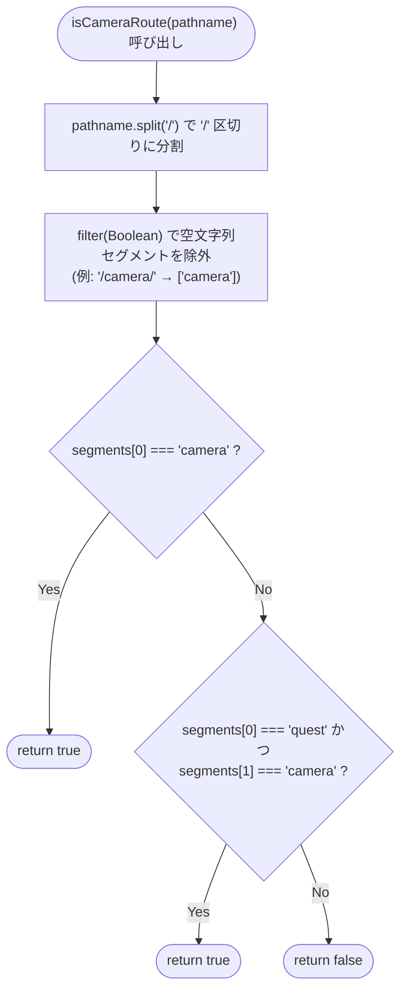
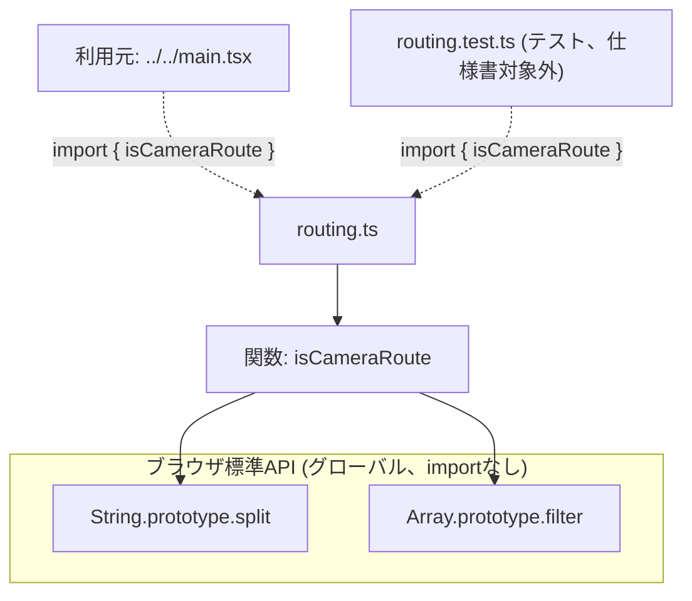

## 1. 解析メタ情報

| 項目 | 内容 |
| --- | --- |
| 対象ファイル | `routing.ts` (family-quest/src/lib/routing.ts) |
| 言語 | TypeScript |
| 解析対象 | 提供されたコードのみ（`routing.test.ts`は動作仕様の裏付けとして参照） |
| 推測・補完 | 一切なし |
| 解析基準コミット | (このリポジトリのHEADで新規作成) |

## 関連ドキュメント

* [../../main.md](../../main.md) - 唯一の呼び出し元。`isCameraView`の判定（`window.location.pathname`が「カメラルート」かどうか）に本ファイルの`isCameraRoute`を使う（Issue #472で、以前ここに直接書かれていた`pathname.includes('/camera')`という部分一致判定を置き換えた）。
* [../../../../../MY_HOME_SYSTEM/unified_server.md](../../../../../MY_HOME_SYSTEM/unified_server.md) - `/camera`・`/camera/{full_path}`を専用のFastAPIルートで、`/quest/{full_path}`をSPAのcatch-allフォールバック（`index.html`への委譲）でそれぞれ配信するバックエンド側のルーティング実装元。本ファイルのファイル冒頭コメントが前提とする「`/quest/camera`もクライアントサイドでカメラビューとして扱う必要がある」という設計はここに由来する。

## 2. ファイルの概要

`main.tsx`のルートビュー切り替え判定（カメラビューワ`CameraDashboard`を描画するか、通常のFamily Questアプリ`App`を描画するか）を、単体テスト可能な純粋関数として切り出したモジュールである。エクスポートは`isCameraRoute(pathname: string): boolean`の1関数のみで、副作用やモジュールレベルの状態を一切持たない。ファイル冒頭のコメントによれば、バックエンド（`MY_HOME_SYSTEM/unified_server.py`）が`/camera`・`/camera/...`を専用のFastAPIルートで配信する一方、`/quest/...`（`/quest/camera`を含む）はSPAのcatch-allフォールバックとして`index.html`へ委譲されるため、`/quest/camera`配下ではこのフロントエンドバンドル自身がクライアントサイドで「カメラビューとして扱うべきパスか」を判定する必要がある、という背景を持つ。以前は`main.tsx`内に直接書かれた`pathname.includes('/camera')`という単純な部分一致判定だったが、将来`/settings/camera-help`のような無関係なパスが追加された場合に誤って一致してしまう懸念があったため、パスをセグメント単位に分割して厳密に判定する本関数に置き換えられた（Issue #472）。
* 根拠: ファイル冒頭コメント全文 (行番号: 1〜15 / 抜粋: "// #472: main.tsxのルートビュー切り替え判定を、単体テスト可能な純粋関数として分離する。\n//\n// バックエンド(MY_HOME_SYSTEM/unified_server.py)は '/camera' 配下を専用ルートで、\n// '/quest' 配下をSPAのcatch-allフォールバック(index.htmlへ委譲)で配信している。\n// そのため実際にカメラビューとして扱うべきパスは '/camera'・'/camera/...' に加えて、\n// '/quest' 配下のSPAが自身でクライアントサイド判定する '/quest/camera'・\n// '/quest/camera/...' も含む(main.tsxの元コメント参照)。\n//\n// 以前は pathname.includes('/camera') という単純な部分一致で判定しており、\n// 将来 '/settings/camera-help' のような無関係なパスを追加すると、意図せず\n// CameraDashboardがマウントされてしまう恐れがあった。パスをセグメント単位に\n// 分割し、先頭セグメントが 'camera' であるか、先頭が 'quest' で2番目が\n// 'camera' である場合のみカメラビューとして扱う。")
* 根拠: エクスポートは1関数のみ (行番号: 17〜19 / 抜粋: "export function isCameraRoute(pathname: string): boolean {\n    const segments = pathname.split('/').filter(Boolean);\n    return segments[0] === 'camera' || (segments[0] === 'quest' && segments[1] === 'camera');\n}")

## 3. 外部依存関係

### インポート一覧

| 名称 | 種類 | 用途 | 根拠 |
| --- | --- | --- | --- |
| 該当なし | - | 本ファイルはimport文を持たない（`String.prototype.split`/`Array.prototype.filter`のみを使用する自己完結した純粋関数） | - |

### ブラックボックスとなる外部要素

| 名称 | 理由 | 根拠 |
| --- | --- | --- |
| 該当なし | 外部モジュールのインポートが存在せず、`pathname: string`という単純な文字列引数のみを扱うため、本ファイル単体で完結しブラックボックスとなる外部要素はない。 | - |

## 4. 主要要素の定義（関数 / エンドポイント / コンポーネント）

### `isCameraRoute`

* **役割**: 与えられたパス文字列`pathname`が「カメラビューとして扱うべきルート」かどうかを判定する純粋関数。パスを`/`で分割し空文字列セグメントを除外した配列`segments`を作り、`segments[0] === 'camera'`（例: `/camera`, `/camera/live/cam1`）、または`segments[0] === 'quest' && segments[1] === 'camera'`（例: `/quest/camera`, `/quest/camera/history`）のいずれかが真の場合に`true`を返す。それ以外（`/`, `/quest`, `/quest/settings`, `/settings/camera-help`, `/camera-settings`, `/quest/camera-settings`等、`routing.test.ts`で明示的に検証されているケースを含む）は`false`を返す。
* 根拠: [関数定義] (行番号: 17〜19 / 抜粋: "export function isCameraRoute(pathname: string): boolean {\n    const segments = pathname.split('/').filter(Boolean);\n    return segments[0] === 'camera' || (segments[0] === 'quest' && segments[1] === 'camera');\n}")
* 根拠: 動作契約を裏付けるテスト (`routing.test.ts`、行番号: 8〜23 / 抜粋: "it.each([\n        '/camera',\n        '/camera/',\n        '/camera/live/cam1',\n        '/quest/camera',\n        '/quest/camera/',\n        '/quest/camera/history',\n    ])('treats %s as a camera route', ...", "it.each([\n        '/',\n        '/quest',\n        '/quest/',\n        '/quest/settings',\n        '/settings/camera-help',\n        '/camera-settings',\n        '/quest/camera-settings',\n    ])('does not treat %s as a camera route', ...")

* **引数/リクエスト**: `pathname: string`（判定対象のURLパス。`window.location.pathname`が唯一の実際の呼び出し元での実引数）
* 根拠: [関数シグネチャ] (行番号: 17 / 抜粋: "export function isCameraRoute(pathname: string): boolean {")

* **戻り値/レスポンス**: `boolean`（カメラルートと判定すれば`true`、それ以外は`false`）
* 根拠: [関数シグネチャの戻り値型と`return`文] (行番号: 17〜19 / 抜粋: "): boolean {\n    ...\n    return segments[0] === 'camera' || (segments[0] === 'quest' && segments[1] === 'camera');")

* **副作用**: なし（`pathname`という引数のみに依存する純粋関数。グローバル状態の読み書きや外部I/Oは一切行わない）
* 根拠: [関数本体全体] (行番号: 17〜19)

* **エラーハンドリング**: なし（`try-catch`等は存在しない）。`pathname`が空文字列の場合、`''.split('/').filter(Boolean)`は空配列`[]`となり、`segments[0]`は`undefined`となるため、いずれの条件も偽になり`false`を返す（例外は発生しない）。`pathname`が`string`型であることは呼び出し元の型システムに委ねられており、本関数自体に型・値のバリデーションは無い。
* 根拠: [`filter(Boolean)`による空文字列セグメントの除外] (行番号: 18 / 抜粋: "const segments = pathname.split('/').filter(Boolean);")

## 5. 処理フロー図

## 6. 依存関係図

## 7. 次のステップ（リバースエンジニアリングの提案）

| 優先度 | ファイル名(推測可) | 理由 | 根拠 |
| --- | --- | --- | --- |
| 高 | `../../main.tsx` | `isCameraRoute`の唯一の呼び出し元であり、`isCameraView`判定の結果が実際にどのコンポーネント（`CameraDashboard`/`App`）の描画切り替えに使われるかを確認するため。 | `main.md`（既存の解析済み仕様書）参照 |
| 中 | `MY_HOME_SYSTEM/unified_server.py` | ファイル冒頭コメントが前提とする「`/camera`は専用ルート、`/quest`はSPAのcatch-allフォールバック」という配信方式を、バックエンド側のルーティング定義で裏付け確認するため。 | ファイル冒頭コメント (行番号: 3〜4) |
| 低 | `routing.test.ts` | 本ファイルの動作契約（どのパスが真/偽と判定されるか）を網羅的に確認済みだが、今後仕様変更があった場合はテストケースとの整合を都度確認する必要がある。 | `it.each([...])`によるテストケース一覧 |

## 8. 保守上の注意点

* **パスのセグメント分割は`filter(Boolean)`により空文字列を除去する**: `pathname.split('/')`単体では、先頭・末尾のスラッシュや連続するスラッシュにより空文字列要素が混入する（例: `'/camera/'.split('/')`は`['', 'camera', '']`）。`filter(Boolean)`でこれらの空文字列を除外してから`segments[0]`/`segments[1]`を参照するため、末尾スラッシュの有無（`/camera`と`/camera/`）に関わらず同じ判定結果になる。この前提を崩す変更（例: `filter(Boolean)`を削除する等）を行うと、末尾スラッシュ付きパスの判定が壊れる。
* 根拠: (行番号: 18 / 抜粋: "const segments = pathname.split('/').filter(Boolean);")
* **大文字小文字を区別する完全一致判定**: `segments[0] === 'camera'`等は`===`による厳密な文字列比較であり、大文字小文字の違い（例: `/Camera`）や前後の空白は区別・トリムされない。実際のブラウザの`window.location.pathname`はURLエンコード後の値であり通常この種の揺れは生じないが、他の呼び出し元（将来追加されるテストやSSR等）から任意の文字列を渡す場合はこの厳密性に注意する必要がある。
* 根拠: (行番号: 19 / 抜粋: "return segments[0] === 'camera' || (segments[0] === 'quest' && segments[1] === 'camera');")
* **クエリ文字列・フラグメントは考慮しない**: `pathname`は`window.location.pathname`（クエリ文字列やハッシュを含まない）を渡す前提の関数であり、本関数自体は`?`や`#`を含む完全なURLを渡された場合の処理を持たない。例えば`/camera?x=1`を渡した場合、`'/camera?x=1'.split('/')`は`['', 'camera?x=1']`となり、`segments[0]`は`'camera?x=1'`（`'camera'`と一致しない）になるため`false`と判定される点に注意。
* 根拠: [関数の実装、クエリ文字列処理が存在しないことを確認] (行番号: 17〜19)
* **`/quest/camera`より深い階層は`quest`直下のセグメントのみで判定される**: `segments[1] === 'camera'`は2番目のセグメントのみを見るため、`/quest/camera/history`のように3番目以降にセグメントが続いても真になる（`routing.test.ts`の`'/quest/camera/history'`ケースで確認済み）一方、`/quest/settings/camera`のように`camera`が3番目のセグメントに来るケースは`segments[1]`が`'settings'`のため偽になる。

## 9. 不明事項一覧

| 項目 | 理由 | 必要なファイル |
| --- | --- | --- |
| `MY_HOME_SYSTEM/unified_server.py`側の実際のルーティング定義との厳密な整合 | ファイル冒頭コメントは「`/camera`は専用ルート、`/quest`はSPAのcatch-allフォールバック」という設計を前提として説明しているが、本ファイル自体はこのバックエンド側の実装を直接参照・検証していない。 | `MY_HOME_SYSTEM/unified_server.py` |

## 相互参照による補足情報

（本ファイルは新規作成のため、他ドキュメントとの相互参照による補足情報はまだ存在しない。）

## 10. 自己検証結果

* [x] 完了: 推測・外部ファイルの仕様を一切含んでいない
* [x] 完了: 全関数・全クラス・全コンポーネントを列挙した（本ファイルは`isCameraRoute`の1関数のみで構成されており、列挙した）
* [x] 完了: 全てのインポート要素を列挙した（該当なし）
* [x] 完了: すべての仕様説明に「根拠（行番号・抜粋）」を明記した
* [x] 完了: 根拠漏れが0件である
* [x] 完了: Mermaid構文にエラーの原因となる記号（エスケープ漏れ）がない
* [x] 完了: 不明事項を漏れなく列挙した
