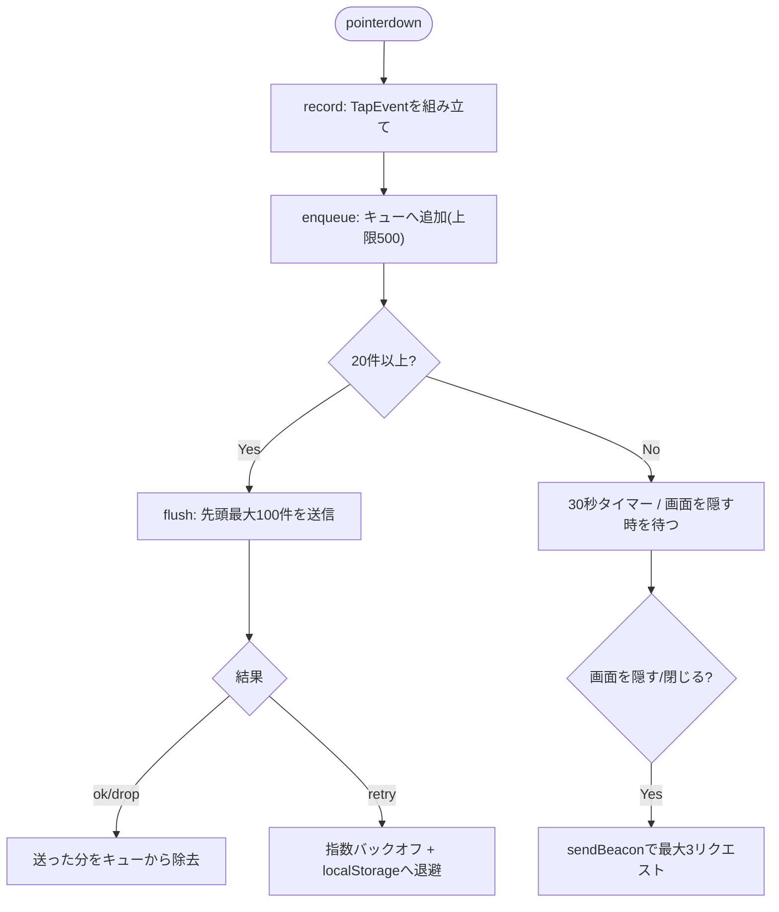
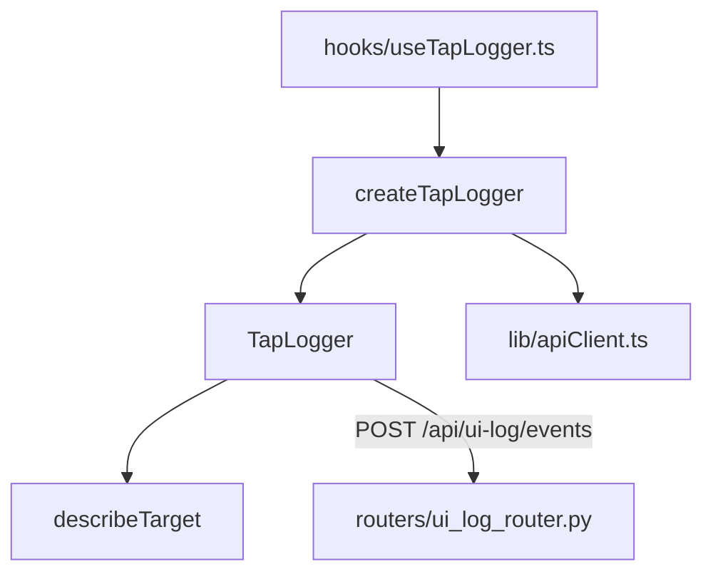

## 1. 解析メタ情報

| 項目 | 内容 |
| --- | --- |
| 対象ファイル | `tapLogger.ts` |
| 言語 | TypeScript |
| 解析対象 | 提供されたコードのみ |
| 推測・補完 | 一切なし |

## 関連ドキュメント

* [../hooks/useTapLogger.md](../hooks/useTapLogger.md) - 本モジュールの`createTapLogger`を呼び、マウント中だけ有効にするフック
* [apiClient.md](./apiClient.md) - `apiClient.url()`で送信先の絶対URLを得る
* [../../../MY_HOME_SYSTEM/ui_log_router.md](../../../MY_HOME_SYSTEM/ui_log_router.md) - 送信先の`POST /api/ui-log/events`

## 2. ファイルの概要

UI/UX改善のための画面タップログ。`document`の`pointerdown`をcapture段階で1回だけ監視し、「いつ・どの画面の・どの要素を」タップしたかをメモリのキューへためて、20件または30秒ごと、および画面を隠す/閉じる時にバッチ送信する。送信失敗時は指数バックオフで再試行し、キューを`localStorage`にも退避する。各タップに`event_id`(UUID)を付け、サーバー側で冪等に保存される。入力欄の値は記録しない。カメラ画面は`main.tsx`で`App`とは別にマウントされるため対象外(ファイル冒頭コメント)。
根拠: [ファイル冒頭コメント] (行番号: 2-16)、[クラス定義] (行番号: 132 / 抜粋: "export class TapLogger {")

## 3. 外部依存関係

### インポート一覧

| 名称 | 種類 | 用途 | 根拠 |
| --- | --- | --- | --- |
| `apiClient` | ローカルモジュール | `apiClient.url(TAP_LOG_ENDPOINT)`で`fetch`/`sendBeacon`の送信先URLを得る | 根拠: [インポート宣言] (行番号: 17 / 抜粋: "import { apiClient } from './apiClient';") |

### ブラックボックスとなる外部要素

| 名称 | 理由 | 根拠 |
| --- | --- | --- |
| `POST /api/ui-log/events`の応答仕様 | サーバー実装は[ui_log_router.md](../../../MY_HOME_SYSTEM/ui_log_router.md)側。本ファイルは2xxなら成功、408/429/5xxは再試行、それ以外の4xxは破棄として扱う | [送信処理] (行番号: 304-325) |

## 4. 主要要素の定義（関数 / エンドポイント / コンポーネント）

### 定数

* **役割**: `TAP_LOG_ENDPOINT`(`/api/ui-log/events`)、`TAP_FLUSH_THRESHOLD`(20)、`TAP_FLUSH_INTERVAL_MS`(30000)、`TAP_MAX_BATCH`(100。バックエンドの`UI_TAP_LOG_MAX_BATCH`と揃える)、`TAP_STORAGE_KEY`/`TAP_STORAGE_MAX`(`familyQuest.tapLog.pending.v1` / 500)、`TAP_BACKOFF_BASE_MS`(5000)/`TAP_BACKOFF_MAX_MS`(300000)、送信前に丸める上限(`MAX_USER_ID`=64, `MAX_SCREEN`=32, `MAX_TAG`=16, `MAX_LAYOUT_MODE`=16, ラベル30文字)。
* 根拠: [定数定義] (行番号: 19-36)
* **引数/リクエスト**: 該当なし
* **戻り値/レスポンス**: 該当なし
* **副作用**: なし
* **エラーハンドリング**: なし

### 型 (`TapEvent` / `TapBatch` / `TapContext` / `SendResult` / `TapLoggerDeps` / `TargetDescription`)

* **役割**: 1タップ、バッチ、タップ時点の文脈(選択中ユーザー・画面・向き)、送信結果(`'ok' | 'retry' | 'drop'`)、注入可能な依存(`getContext`/`send`/`beacon`/`storage`/`now`/`uuid`)、要素の記述。
* 根拠: [型定義] (行番号: 42-84)
* **引数/リクエスト**: 該当なし
* **戻り値/レスポンス**: 該当なし
* **副作用**: なし
* **エラーハンドリング**: なし

### `describeTarget`

* **役割**: タップ対象を記録用の識別子にする。最近接の操作要素(button/a[href]/role=button・tab・menuitem/input/select/textarea/summary/label/`[data-track]`)を探し、識別子は`data-track` > `aria-label` > (入力欄は`name`/`placeholder`/`type`のみ。**値は読まない**) > 文言の先頭30文字の優先順。操作要素が無ければ`element_id`なし・`is_interactive:false`(反応しない場所へのタップ)。
* 根拠: [関数定義] (行番号: 96 / 抜粋: "export function describeTarget(target: EventTarget | null): TargetDescription {")
* **引数/リクエスト**: `target: EventTarget | null`
* **戻り値/レスポンス**: `TargetDescription`
* **副作用**: なし(DOMの読み取りのみ)
* **エラーハンドリング**: `Element`でない対象は`{null, null, false}`を返す。

### `TapLogger`

* **役割**: キューと送信を管理するクラス。`enqueue`(20件で自動flush、上限500件を超えたら古い順に破棄)、`record`(`pointerdown`からイベントを組み立てる。非primary・マウスの非左ボタンは無視。`data-tap-user`/`data-tap-screen`を持つ祖先があればそれを優先=横画面の4人パネル)、`flush`(先頭最大100件を送信。送信中・バックオフ中・空なら何もしない。`ok`/`drop`は送った分を`event_id`で除去、`retry`は失敗回数に応じ指数バックオフしキューを退避)、`flushOnHide`(`sendBeacon`で最大3リクエスト)、`restore`(`localStorage`の未送信分を戻す。壊れたデータは無視)、`start`(リスナーとタイマーを登録し解除関数を返す)。
* 根拠: [クラス定義] (行番号: 132 / 抜粋: "export class TapLogger {")、[各メソッド] (行番号: 149, 158, 179, 208, 218, 259)
* **引数/リクエスト**: コンストラクタ`deps: TapLoggerDeps`
* 根拠: [コンストラクタ] (行番号: 139 / 抜粋: "constructor(private readonly deps: TapLoggerDeps) {")
* **戻り値/レスポンス**: `start()`は解除関数、`flush()`は`Promise<void>`
* **副作用**: `document`へのpointerdown(capture・passive)/visibilitychange、`window`へのpagehide/onlineリスナー、30秒の`setInterval`、`localStorage`の読み書き、ネットワーク送信
* 根拠: [start] (行番号: 259-285)
* **エラーハンドリング**: 送信例外は`'retry'`扱い。`localStorage`の例外は握りつぶす(ログ欠損よりアプリの動作を優先)。

### `createTapLogger`

* **役割**: 本番用の依存(`fetch`+`keepalive`、`sendBeacon`、`localStorage`、`Date.now`、`crypto.randomUUID`)で`TapLogger`を作る。HTTP 408/429/5xxは`'retry'`、それ以外の4xxは再送しても同じなので`'drop'`。
* 根拠: [関数定義] (行番号: 304 / 抜粋: "export function createTapLogger(getContext: () => TapContext): TapLogger {")
* **引数/リクエスト**: `getContext: () => TapContext`
* **戻り値/レスポンス**: `TapLogger`
* **副作用**: なし(生成のみ。送信は`start`後)
* **エラーハンドリング**: `fetch`の例外は`'retry'`。`sendBeacon`が無い/例外ならfalse。

## 5. 処理フロー図

## 6. 依存関係図

## 7. 次のステップ（リバースエンジニアリングの提案）

| 優先度 | ファイル名(推測可) | 理由 | 根拠 |
| --- | --- | --- | --- |
| 中 | `src/hooks/useTapLogger.ts` | 本モジュールを有効にするフックの把握 | [関連ドキュメント] |

## 8. 保守上の注意点

* 送信前にフィールド長を丸めているのは、サーバーが1件でも上限超過すると422でバッチ全体(最大100件)を返し、本ファイルは4xxを`'drop'`として破棄するため。上限は`models/ui_log.py`と揃えること。
* `data-tap-user`/`data-tap-screen`は`FamilyDashboard`の各パネルが自己申告する。
* 入力欄の値は記録しない(`describeTarget`は`value`を読まない)。

## 9. 不明事項一覧

| 項目 | 理由 | 必要なファイル |
| --- | --- | --- |
| なし | - | - |

## 10. 自己検証結果

* [x] 完了: 推測・外部ファイルの仕様を一切含んでいない
* [x] 完了: 全関数・全クラス・全コンポーネントを列挙した
* [x] 完了: 全てのインポート要素を列挙した
* [x] 完了: すべての仕様説明に「根拠（行番号・抜粋）」を明記した
* [x] 完了: 根拠漏れが0件である
* [x] 完了: Mermaid構文にエラーの原因となる記号（エスケープ漏れ）がない
* [x] 完了: 不明事項を漏れなく列挙した
