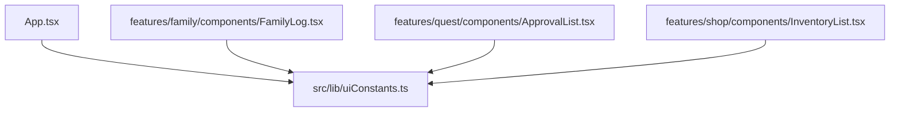

## 1. 解析メタ情報

| 項目 | 内容 |
| --- | --- |
| 対象ファイル | uiConstants.ts (family-quest/src/lib/uiConstants.ts) |
| 解析基準コミット | Issue #660 での新規作成時点(2026-09-16) |
| 言語 | TypeScript |
| 解析対象 | 提供されたコードのみ |
| 推測・補完 | 一切なし |

## 関連ドキュメント

* [../../App.md](../../App.md) — ユーザー切替・タブ切替のスワイプ判定で `VIEW_SWIPE_THRESHOLD_PX` を使う
* [../features/family/components/FamilyLog.md](../features/family/components/FamilyLog.md) — 同じ閾値でユーザーを切り替える
* [../features/quest/components/ApprovalList.md](../features/quest/components/ApprovalList.md) — 承認/却下スワイプで `APPROVAL_SWIPE_THRESHOLD_PX` を使う
* [../features/shop/components/InventoryList.md](../features/shop/components/InventoryList.md) — ポーリング間隔に `INVENTORY_POLL_INTERVAL_MS` を使う

## 2. ファイルの概要

画面をまたいで共有する UI の閾値・間隔を1箇所に集約する定数モジュール。Issue #660 の調査で、同じ数値が `App.tsx`(2箇所)・`FamilyLog.tsx`・`ApprovalList.tsx` に直書きで散っており、「切り替えの感度を変える」ような調整が片方だけに入る状態だったため新設した。値そのものは既存の実装から変えていない(インベントリのポーリング間隔のみ 5 秒から 15 秒へ緩和)。

## 3. 外部依存関係

### インポート一覧

依存なし(定数のみを export する)。

### ブラックボックスとなる外部要素

| 項目 | 理由 |
| --- | --- |
| framer-motion の `onPanEnd` が返す `info.offset.x` の単位 | 呼び出し側(`App.tsx` / `FamilyLog.tsx`)がライブラリから受け取る値で、本ファイルからは不明(px 前提で閾値を置いている)。 |

## 4. 主要要素の定義（関数 / エンドポイント / コンポーネント）

| 定数 | 値 | 意味 |
| --- | --- | --- |
| `VIEW_SWIPE_THRESHOLD_PX` | `60` | 画面(ユーザー/タブ)を切り替えるスワイプと判定する横方向の移動量 |
| `APPROVAL_SWIPE_THRESHOLD_PX` | `90` | 承認/却下のスワイプと判定する移動量。誤操作が即座に承認・却下につながるため画面切替より広く取る |
| `INVENTORY_POLL_INTERVAL_MS` | `15000` | インベントリ一覧のポーリング間隔。所持アイテムは自分の操作以外で増減せず、購入・使用時は `invalidateQueries` が走るため、取りこぼしの保険として15秒で足りる |

## 5. 処理フロー図

ロジックを持たない定数モジュールのため、処理フローは無い。

## 6. 依存関係図

## 7. 次のステップ（リバースエンジニアリングの提案）

| 優先度 | ファイル名 | 理由 |
| --- | --- | --- |
| 低 | `src/hooks/useLongPress.ts` | 長押しの閾値(550ms)も同種の「感度」の定数であり、ここへ寄せられる余地がある。 |

## 8. 保守上の注意点

* **閾値を変えるときはここだけを直す**: 重複を解消した目的がこれ。呼び出し側に数値を直書きしないこと。
* **承認スワイプは意図的に広い**: 画面切替(60px)より大きい 90px なのは誤操作の代償が違うためで、揃えないこと。

## 9. 不明事項一覧

| 項目 | 理由 | 必要なファイル |
| --- | --- | --- |
| 実機での操作感 | 閾値の妥当性は実端末(タブレット・Echo Show)での操作でしか確かめられない。 | — |

## 10. 自己検証結果

* 各定数の値と用途は、移行元(`App.tsx` / `FamilyLog.tsx` / `ApprovalList.tsx` / `InventoryList.tsx`)の現物と照合済み。
