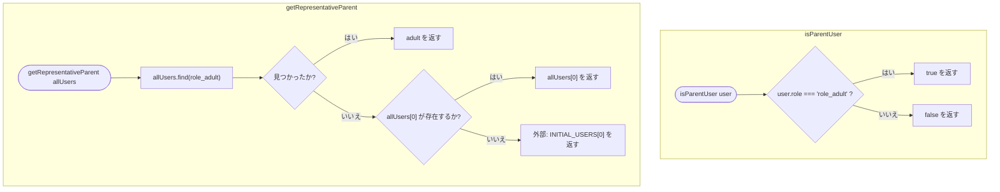
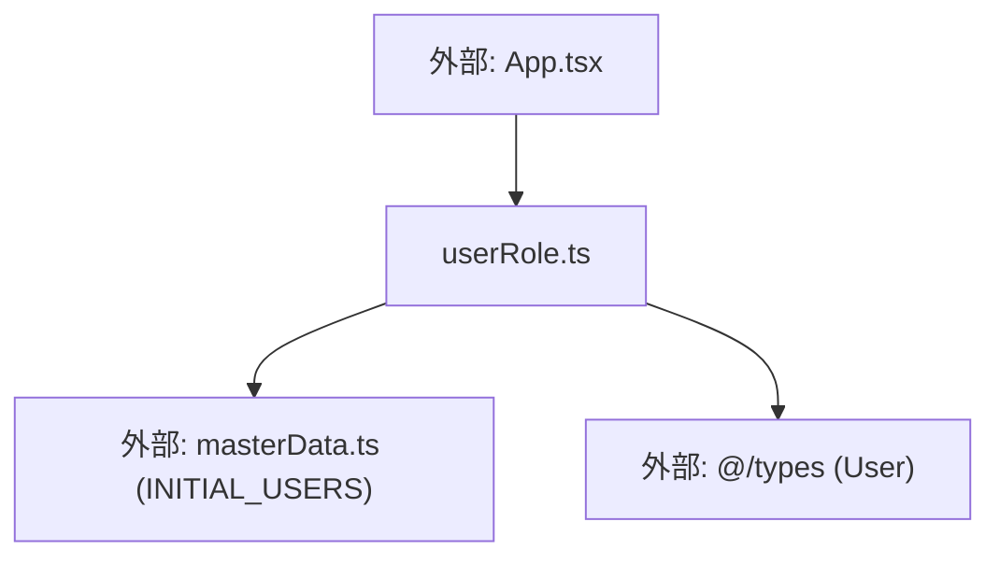

## 1. 解析メタ情報

| 項目 | 内容 |
| --- | --- |
| 対象ファイル | userRole.ts (family-quest/src/lib/userRole.ts) |
| 言語 | TypeScript |
| 解析対象 | 提供されたコードのみ |
| 推測・補完 | 一切なし |
| 解析基準コミット | `f06eef5` |

## 関連ドキュメント

* [../../App.md](../../App.md) - 呼び出し元（`isParentUser`で保護者向けUIの表示可否を判定、`getRepresentativeParent`で承認・却下・購入の記録名義を解決）
* [./masterData.md](./masterData.md) - `INITIAL_USERS`（`getRepresentativeParent`の最終フォールバック）の提供元
* [../types/index.md](../types/index.md) - `User`型の定義元

## 2. ファイルの概要

* ユーザーの役割（保護者/子ども）に関する判定ロジックをまとめたモジュール。**（Issue #552で`App.tsx`から抽出）** 以前は`App.tsx`内にモジュールレベル関数として定義されていた`isParentUser`と`getRepresentativeParent`が、ロジックを変更せずそのまま本ファイルへ移動された。
* 根拠: ファイル冒頭のインポートと関数定義 (行番号: 1〜15 / 抜粋: "import { INITIAL_USERS } from './masterData';\nimport { User } from '@/types';")

## 3. 外部依存関係

### インポート一覧

| 名称 | 種類 | 用途 | 根拠 |
| --- | --- | --- | --- |
| `INITIAL_USERS` | 定数 | `getRepresentativeParent`が`allUsers`もその中の`role_adult`も見つけられなかった場合の最終フォールバック | 根拠: (行番号: 1 / 抜粋: "import { INITIAL_USERS } from './masterData';") |
| `User` | 型定義 | 引数・戻り値の型 | 根拠: (行番号: 2 / 抜粋: "import { User } from '@/types';") |

### ブラックボックスとなる外部要素

| 名称 | 理由 | 根拠 |
| --- | --- | --- |
| `INITIAL_USERS` | データ構造・要素数の詳細が本ファイルからは不明 | 根拠: (行番号: 1 / 抜粋: "import { INITIAL_USERS } from './masterData';") |

## 4. 主要要素の定義（関数 / エンドポイント / コンポーネント）

### `isParentUser` (export関数)

* **役割**: `user.role`が`'role_adult'`かどうかで保護者判定を行う。直前のコメントにより、これはUI上の配慮（隠しボタンを子どもに見せないため）でありセキュリティ境界ではないこと、バックエンドは現状どのuser_idでも自称できてしまうためアクセス制御はバックエンド側で別途実装される必要があることが明記されている。
* 根拠: (行番号: 4〜8 / 抜粋: "// 保護者判定は quest_users.role ('role_adult'/'role_child') を唯一の判定基準とする。\n// ★注意: これはクライアント側のUI上の配慮（隠しボタンを子どもに見せないため）にすぎず、\n// セキュリティ境界ではない。バックエンドは現状どのuser_idでも自称できてしまうため、\n// 本当のアクセス制御はバックエンド側で別途実装される必要がある。\nexport const isParentUser = (user: User) => user.role === 'role_adult';")

* **引数/リクエスト**: `user: User`
* **戻り値/レスポンス**: `boolean`
* **副作用**: なし
* **エラーハンドリング**: なし

### `getRepresentativeParent` (export関数)

* **役割**: 承認・却下・購入の記録名義に使う代表の親ユーザーを返す。誰が実際にボタンを押したかは区別せず「親」として固定で記録する（要件5）。`allUsers`内に`role_adult`が見つからなければ`allUsers[0]`、それも無ければ`INITIAL_USERS[0]`にフォールバックする。
* 根拠: (行番号: 10〜15 / 抜粋: "// 承認・却下の記録名義に使う代表の親ユーザーを返す。誰が実際にボタンを押したかは\n// 区別せず「親」として固定で記録する(要件5)。\nexport const getRepresentativeParent = (allUsers: User[]): User => {\n    const adult = allUsers.find(u => u.role === 'role_adult');\n    return adult || allUsers[0] || INITIAL_USERS[0];\n};")

* **引数/リクエスト**: `allUsers: User[]`
* **戻り値/レスポンス**: `User`
* **副作用**: なし
* **エラーハンドリング**: `adult || allUsers[0] || INITIAL_USERS[0]`のフォールバック連鎖により未定義を回避する（行番号: 14）

## 5. 処理フロー図

## 6. 依存関係図

## 7. 次のステップ（リバースエンジニアリングの提案）

| 優先度 | ファイル名(推測可) | 理由 | 根拠 |
| --- | --- | --- | --- |
| 中 | `./masterData.ts` | `INITIAL_USERS`のデータ構造・要素数を確認するため（既に`masterData.md`で解析済み） | 根拠: 関連ドキュメント参照 |
| 低 | `../../App.tsx` | `isParentUser`/`getRepresentativeParent`の実際の呼び出し箇所（保護者向けUI分岐・承認/却下/購入の記録名義）を確認するため | 根拠: 関連ドキュメント参照 |

## 8. 保守上の注意点

* **`isParentUser`はセキュリティ境界ではない**: コメントで明記されている通り、これはUI表示の出し分けのみを目的としており、実際のアクセス制御はバックエンド側の責務である。本関数の結果をもってサーバー側のチェックを省略しないこと。
* **`getRepresentativeParent`は「誰が操作したか」を記録しない設計**: 複数の保護者アカウントが存在する場合でも、常に最初に見つかった`role_adult`（またはその他のフォールバック）が記録名義になる。個々の保護者を区別した記録が必要になった場合は本関数の設計自体を見直す必要がある。

## 9. 不明事項一覧

なし（本ファイル単体で完結する純粋関数のみで構成されており、外部依存の不明点は`masterData.md`側で解消済み）。

## 相互参照による補足情報

なし。

## 10. 自己検証結果

* [x] 推測・外部ファイルの仕様を一切含んでいない
* [x] 全関数・全クラス・全コンポーネントを列挙した
* [x] 全てのインポート要素を列挙した
* [x] すべての仕様説明に「根拠（行番号・抜粋）」を明記した
* [x] 根拠漏れが0件である
* [x] Mermaid構文にエラーの原因となる記号（エスケープ漏れ）がない
* [x] 不明事項を漏れなく列挙した
