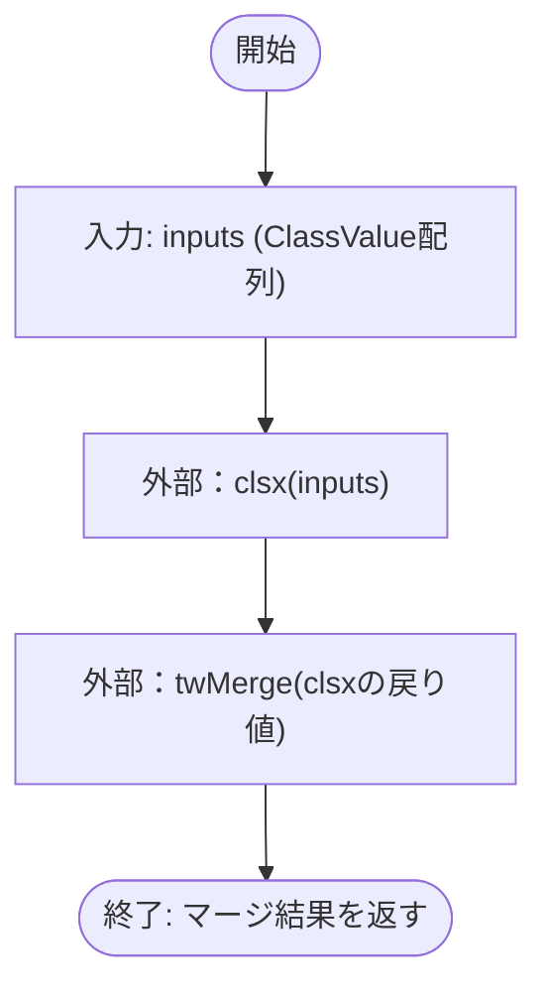
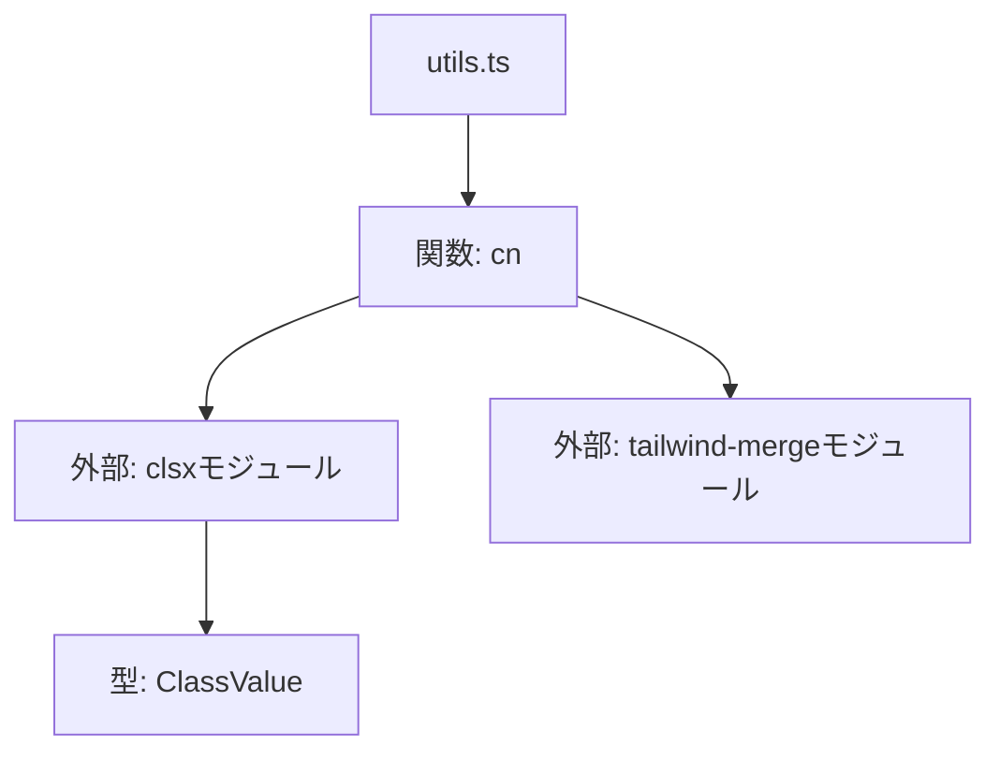

## 1. 解析メタ情報

| 項目 | 内容 |
| --- | --- |
| 対象ファイル | `utils.ts` |
| 言語 | TypeScript (React等のフロントエンド環境) |
| 解析対象 | 提供されたコードのみ |
| 推測・補完 | 一切なし |

## 2. ファイルの概要

* Tailwind CSSのクラス名をマージ（結合・競合解決）するためのユーティリティ関数 `cn` を提供する。
* 根拠: JSDocコメント (行番号: 4〜7 / 抜粋: "Tailwindのクラスをマージするユーティリ")

## 3. 外部依存関係

### インポート一覧

| 名称 | 種類 | 用途 | 根拠 |
| --- | --- | --- | --- |
| `ClassValue` | 型 | 関数の引数の型定義として使用 | `import { type ClassValue...` (行番号: 1 / 抜粋: "import { type ClassValue, clsx") |
| `clsx` | 関数 | 入力されたクラスの配列や条件式を処理するため | `import { type ClassValue, clsx }` (行番号: 1 / 抜粋: "import { type ClassValue, clsx") |
| `twMerge` | 関数 | `clsx`で処理された結果のTailwindクラスの競合をマージするため | `import { twMerge }` (行番号: 2 / 抜粋: "import { twMerge } from "tailw") |

### ブラックボックスとなる外部要素

| 名称 | 理由 | 根拠 |
| --- | --- | --- |
| `clsx`の実装詳細 | 外部ライブラリ `"clsx"` に依存しているため | `from "clsx"` (行番号: 1 / 抜粋: "from "clsx";") |
| `twMerge`の実装詳細 | 外部ライブラリ `"tailwind-merge"` に依存しているため | `from "tailwind-merge"` (行番号: 2 / 抜粋: "from "tailwind-merge";") |

## 4. 主要要素の定義（関数 / エンドポイント / コンポーネント）

### 関数 `cn`

* **役割**: 入力された引数を `clsx` で処理し、その結果を `twMerge` に渡してマージした値を返す。
* 根拠: `cn`関数内部の実装 (行番号: 9 / 抜粋: "return twMerge(clsx(inputs));")

* **引数/リクエスト**: `...inputs: ClassValue[]` (可変長引数として `ClassValue` 型の配列を受け取る)
* 根拠: `cn`関数のシグネチャ (行番号: 8 / 抜粋: "export function cn(...inputs: ")

* **戻り値/レスポンス**: 型の明記なし（`twMerge` の戻り値に依存する）
* 根拠: `cn`関数の戻り値 (行番号: 8〜9 / 抜粋: "export function cn(...inputs: ")

* **副作用**: なし
* 根拠: `cn`関数内部の実装 (行番号: 9 / 抜粋: "return twMerge(clsx(inputs));")

* **エラーハンドリング**: なし（内部での `try-catch` 等の実装はない）
* 根拠: `cn`関数全体 (行番号: 8〜10 / 抜粋: "export function cn(...inputs: ")

## 5. 処理フロー図

## 6. 依存関係図

## 7. 次のステップ（リバースエンジニアリングの提案）

| 優先度 | ファイル名(推測可) | 理由 | 根拠 |
| --- | --- | --- | --- |
| 低 | `cn`関数をインポートしているUIコンポーネントファイル群 (例: `components/**/*.tsx`) | 本ファイル単体で完結するユーティリティであり、システム全体での利用状況や影響範囲を特定するため。 | `export function cn` (行番号: 8 / 抜粋: "export function cn(...inputs: ") |

## 8. 保守上の注意点

* 外部ライブラリへの完全依存: 処理のすべてを `clsx` および `tailwind-merge` に委譲しているため、これらのライブラリのアップデートや仕様変更に直接影響を受ける。
* 例外処理の欠如: 引数に想定外の値が渡された場合や、依存する外部関数内でエラーが発生した場合のエラーハンドリングが実装されていない。

## 9. 不明事項一覧

| 項目 | 理由 | 必要なファイル |
| --- | --- | --- |
| `ClassValue` の許容する詳細な型構造 | 外部ライブラリからインポートされているため。 | `clsx` ライブラリの型定義ファイル |
| `cn` 関数の厳密な戻り値の型 | 戻り値の型アノテーションが省略されており、`twMerge` の型定義に依存しているため。 | `tailwind-merge` ライブラリの型定義ファイル |

## 10. 自己検証結果

* [x] 推測・外部ファイルの仕様を一切含んでいない
* [x] 全関数・全クラス・全コンポーネントを列挙した
* [x] 全てのインポート要素を列挙した
* [x] すべての仕様説明に「根拠（行番号・抜粋）」を明記した
* [x] 根拠漏れが0件である
* [x] Mermaid構文にエラーの原因となる記号（エスケープ漏れ）がない
* [x] 不明事項を漏れなく列挙した
* [x] 完了