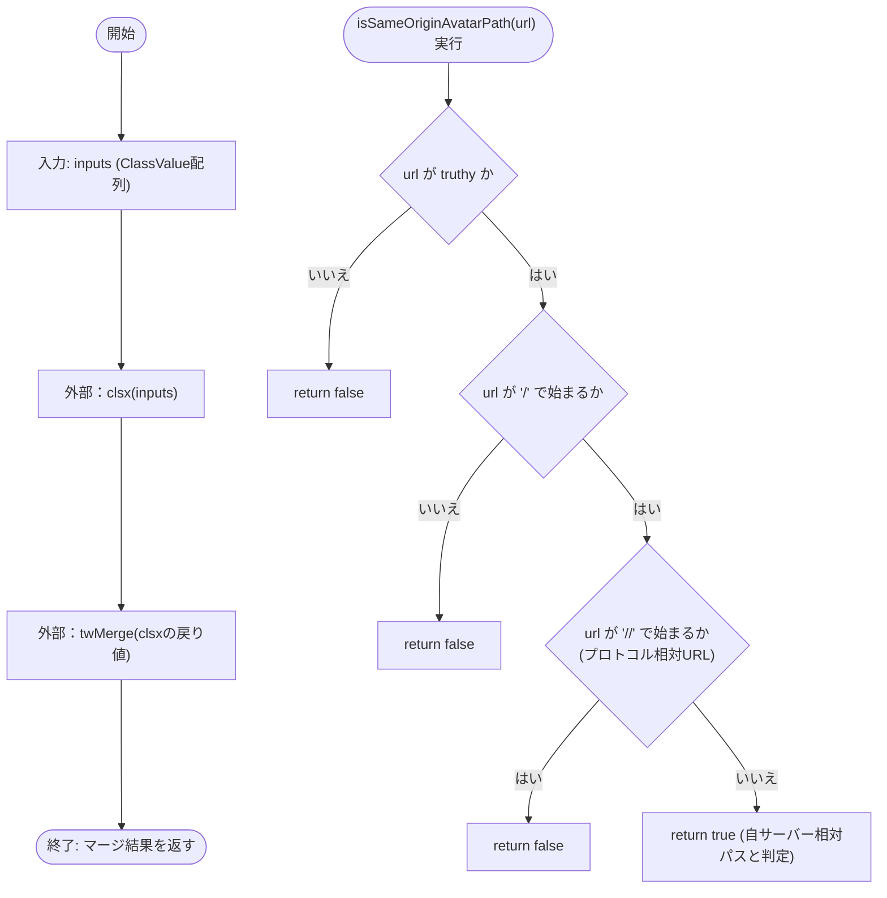
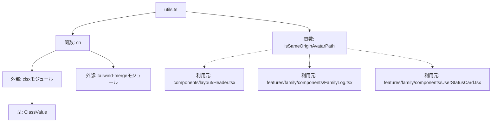

## 1. 解析メタ情報

| 項目 | 内容 |
| --- | --- |
| 対象ファイル | `utils.ts` |
| 言語 | TypeScript (React等のフロントエンド環境) |
| 解析対象 | 提供されたコードのみ |
| 推測・補完 | 一切なし |

## 関連ドキュメント

- [Button.md](../components/ui/Button.md) — `cn`関数の利用元の一つ。
- [Modal.md](../components/ui/Modal.md) — `cn`関数の利用元の一つ（`maxWidth`のクラス名結合に使用）。
- [Header.md](../components/layout/Header.md) — `isSameOriginAvatarPath`の利用元の一つ（アバター画像URLが自サーバー相対パスかどうかの判定に使用）。
- [FamilyLog.md](../features/family/components/FamilyLog.md) — `isSameOriginAvatarPath`の利用元の一つ。
- [UserStatusCard.md](../features/family/components/UserStatusCard.md) — `isSameOriginAvatarPath`の利用元の一つ。

## 2. ファイルの概要

* Tailwind CSSのクラス名をマージ（結合・競合解決）するためのユーティリティ関数 `cn` を提供する。
* 根拠: JSDocコメント (行番号: 4〜7 / 抜粋: "Tailwindのクラスをマージするユーティリ")
* セキュリティ修正（M-9-5）として、アバター画像URLが自サーバーの相対パスであるかどうかを判定するユーティリティ関数 `isSameOriginAvatarPath` を提供する。単純な`startsWith('/')`判定だとプロトコル相対URL（`//evil.example/x`）も真になり外部ホストの画像への差し替えを許してしまうため、`"//"`で始まるものを明示的に除外する。`Header.tsx`/`FamilyLog.tsx`/`UserStatusCard.tsx`の3箇所にあった同種の判定を本関数に共通化したもの。
* 根拠: JSDocコメント (行番号: 12〜18 / 抜粋: "M-9-5バグ修正: アバターURLが自サーバーの相対パス(/uploads/...)であることを\n * 確認するためのチェック。単純な startsWith('/') だと、プロトコル相対URL")、関数本体 (行番号: 19〜21 / 抜粋: "export function isSameOriginAvatarPath(url: string | undefined | null): url is string {\n    return !!url && url.startsWith('/') && !url.startsWith('//');\n}")

## 3. 外部依存関係

### インポート一覧

| 名称 | 種類 | 用途 | 根拠 |
| --- | --- | --- | --- |
| `ClassValue` | 型 | 関数の引数の型定義として使用 | `import { type ClassValue...` (行番号: 1 / 抜粋: "import { type ClassValue, clsx") |
| `clsx` | 関数 | 入力されたクラスの配列や条件式を処理するため | `import { type ClassValue, clsx }` (行番号: 1 / 抜粋: "import { type ClassValue, clsx") |
| `twMerge` | 関数 | `clsx`で処理された結果のTailwindクラスの競合をマージするため | `import { twMerge }` (行番号: 2 / 抜粋: "import { twMerge } from "tailw") |

### ブラックボックスとなる外部要素

| 名称 | 理由 | 根拠 |
| --- | --- | --- |
| `clsx`の実装詳細 | 外部ライブラリ `"clsx"` に依存しているため | `from "clsx"` (行番号: 1 / 抜粋: "from "clsx";") |
| `twMerge`の実装詳細 | 外部ライブラリ `"tailwind-merge"` に依存しているため | `from "tailwind-merge"` (行番号: 2 / 抜粋: "from "tailwind-merge";") |

## 4. 主要要素の定義（関数 / エンドポイント / コンポーネント）

### 関数 `cn`

* **役割**: 入力された引数を `clsx` で処理し、その結果を `twMerge` に渡してマージした値を返す。
* 根拠: `cn`関数内部の実装 (行番号: 9 / 抜粋: "return twMerge(clsx(inputs));")

* **引数/リクエスト**: `...inputs: ClassValue[]` (可変長引数として `ClassValue` 型の配列を受け取る)
* 根拠: `cn`関数のシグネチャ (行番号: 8 / 抜粋: "export function cn(...inputs: ")

* **戻り値/レスポンス**: 型の明記なし（`twMerge` の戻り値に依存する）
* 根拠: `cn`関数の戻り値 (行番号: 8〜9 / 抜粋: "export function cn(...inputs: ")

* **副作用**: なし
* 根拠: `cn`関数内部の実装 (行番号: 9 / 抜粋: "return twMerge(clsx(inputs));")

* **エラーハンドリング**: なし（内部での `try-catch` 等の実装はない）
* 根拠: `cn`関数全体 (行番号: 8〜10 / 抜粋: "export function cn(...inputs: ")

### 関数 `isSameOriginAvatarPath`

* **役割**: アバター画像のURLが自サーバー内の相対パス（`/uploads/...`等）であるかどうかを判定する型ガード関数。`url`が`"/"`で始まり、かつ`"//"`（プロトコル相対URL）では始まらない場合にのみ`true`を返す。
* 根拠: (行番号: 19〜21 / 抜粋: "export function isSameOriginAvatarPath(url: string | undefined | null): url is string {\n    return !!url && url.startsWith('/') && !url.startsWith('//');\n}")

* **引数/リクエスト**: `url: string | undefined | null`
* 根拠: (行番号: 19 / 抜粋: "export function isSameOriginAvatarPath(url: string | undefined | null): url is string {")

* **戻り値/レスポンス**: `url is string`（TypeScriptの型ガード）。`url`が非空文字列かつ`"/"`始まりかつ`"//"`始まりでない場合に`true`、それ以外（`undefined`/`null`/空文字列/`"//"`始まり/`"/"`始まりでない文字列）は`false`。
* 根拠: (行番号: 20 / 抜粋: "return !!url && url.startsWith('/') && !url.startsWith('//');")

* **副作用**: なし
* 根拠: (行番号: 20 / 抜粋: "return !!url && url.startsWith('/') && !url.startsWith('//');")

* **エラーハンドリング**: なし（`try-catch`等の実装はない。不正な値に対しては例外を投げず`false`を返す設計）
* 根拠: 関数全体 (行番号: 19〜21)

* **バグ修正の記録（M-9-5）**: 以前は`Header.tsx`/`FamilyLog.tsx`/`UserStatusCard.tsx`の3箇所でそれぞれ`user.avatar.startsWith('/')`のみによって「自サーバーの相対パスか」を判定していたが、プロトコル相対URL（`"//evil.example/x"`）も`startsWith('/')`が真になるため素通りしていた。ブラウザは`"//host/path"`形式を現在のプロトコルでの外部ホストへのリンクとして解決するため、外部ホストの画像に差し替えられる可能性があった。共通ヘルパーとして本関数を新設し、`"//"`で始まるものを明示的に除外したうえで3箇所とも置き換えた。
* 根拠: JSDocコメント (行番号: 12〜18 / 抜粋: "M-9-5バグ修正: アバターURLが自サーバーの相対パス(/uploads/...)であることを\n * 確認するためのチェック。単純な startsWith('/') だと、プロトコル相対URL\n * (\"//evil.example/x\")もマッチしてしまう(ブラウザは \"//host/path\" を\n * 現在のプロトコルでの外部ホストへのリンクとして解決するため、外部画像への\n * 差し替えを許してしまう)。\"//\" で始まるものは除外する。")

## 5. 処理フロー図

```mermaid
flowchart TD
    Start([開始]) --> Input["入力: inputs (ClassValue配列)"]
    Input --> CallClsx["外部：clsx(inputs)"]
    CallClsx --> CallTwMerge["外部：twMerge(clsxの戻り値)"]
    CallTwMerge --> End([終了: マージ結果を返す])

    Start2(["isSameOriginAvatarPath(url) 実行"]) --> CheckFalsy{"url が truthy か"}
    CheckFalsy -- いいえ --> ReturnFalse1["return false"]
    CheckFalsy -- はい --> CheckSlash{"url が '/' で始まるか"}
    CheckSlash -- いいえ --> ReturnFalse2["return false"]
    CheckSlash -- はい --> CheckDoubleSlash{"url が '//' で始まるか\n(プロトコル相対URL)"}
    CheckDoubleSlash -- はい --> ReturnFalse3["return false"]
    CheckDoubleSlash -- いいえ --> ReturnTrue["return true (自サーバー相対パスと判定)"]

```

## 6. 依存関係図

```mermaid
graph TD
    UtilsTS["utils.ts"] --> CN["関数: cn"]
    CN --> CLSX["外部: clsxモジュール"]
    CN --> TWMERGE["外部: tailwind-mergeモジュール"]
    CLSX --> ClassValue["型: ClassValue"]

    UtilsTS --> ISAP["関数: isSameOriginAvatarPath"]
    ISAP -.-> HeaderTsx["利用元: components/layout/Header.tsx"]
    ISAP -.-> FamilyLogTsx["利用元: features/family/components/FamilyLog.tsx"]
    ISAP -.-> UserStatusCardTsx["利用元: features/family/components/UserStatusCard.tsx"]

```

## 7. 次のステップ（リバースエンジニアリングの提案）

| 優先度 | ファイル名(推測可) | 理由 | 根拠 |
| --- | --- | --- | --- |
| 低 | `cn`関数をインポートしているUIコンポーネントファイル群 (例: `components/**/*.tsx`) | 本ファイル単体で完結するユーティリティであり、システム全体での利用状況や影響範囲を特定するため。 | `export function cn` (行番号: 8 / 抜粋: "export function cn(...inputs: ") |
| 中 | `family-quest/src/components/layout/Header.tsx`, `features/family/components/FamilyLog.tsx`, `features/family/components/UserStatusCard.tsx` | `isSameOriginAvatarPath`の実際の呼び出し箇所・置き換え前後の判定ロジックを確認するため。 | 根拠: JSDocコメント (行番号: 12〜13 / 抜粋: "M-9-5バグ修正: アバターURLが自サーバーの相対パス(/uploads/...)であることを") |

## 8. 保守上の注意点

* 外部ライブラリへの完全依存: `cn`の処理のすべてを `clsx` および `tailwind-merge` に委譲しているため、これらのライブラリのアップデートや仕様変更に直接影響を受ける。
* 例外処理の欠如: `cn`は引数に想定外の値が渡された場合や、依存する外部関数内でエラーが発生した場合のエラーハンドリングが実装されていない。
* `isSameOriginAvatarPath`は文字列の先頭一致のみによる判定であり、パストラバーサル（`/../`等）やクエリ文字列・フラグメントの内容までは検証しない。あくまで「`"/"`で始まり`"//"`では始まらない」という形式的な条件のみを見ている点に注意が必要（バックエンド側でのアップロード先パス自体の妥当性検証とは別レイヤーの防御である）。
* 根拠: (行番号: 20 / 抜粋: "return !!url && url.startsWith('/') && !url.startsWith('//');")

## 9. 不明事項一覧

| 項目 | 理由 | 必要なファイル |
| --- | --- | --- |
| `ClassValue` の許容する詳細な型構造 | 外部ライブラリからインポートされているため。（`family-quest`配下に`node_modules`がインストールされておらず、`clsx`ライブラリの型定義ファイルはリポジトリ内に存在しないため解消不可） | `clsx` ライブラリの型定義ファイル |
| `cn` 関数の厳密な戻り値の型 | 戻り値の型アノテーションが省略されており、`twMerge` の型定義に依存しているため。（`family-quest`配下に`node_modules`がインストールされておらず、`tailwind-merge`ライブラリの型定義ファイルはリポジトリ内に存在しないため解消不可） | `tailwind-merge` ライブラリの型定義ファイル |
| `isSameOriginAvatarPath`が実際にどのように呼び出されているか（`false`判定時のフォールバック表示等） | 本ファイルは関数定義のみであり、呼び出し側（`Header.tsx`/`FamilyLog.tsx`/`UserStatusCard.tsx`）のコンテキストが含まれていないため | `family-quest/src/components/layout/Header.tsx`, `family-quest/src/features/family/components/FamilyLog.tsx`, `family-quest/src/features/family/components/UserStatusCard.tsx` |

## 10. 自己検証結果

* [x] 推測・外部ファイルの仕様を一切含んでいない
* [x] 全関数・全クラス・全コンポーネントを列挙した
* [x] 全てのインポート要素を列挙した
* [x] すべての仕様説明に「根拠（行番号・抜粋）」を明記した
* [x] 根拠漏れが0件である
* [x] Mermaid構文にエラーの原因となる記号（エスケープ漏れ）がない
* [x] 不明事項を漏れなく列挙した
* [x] 完了